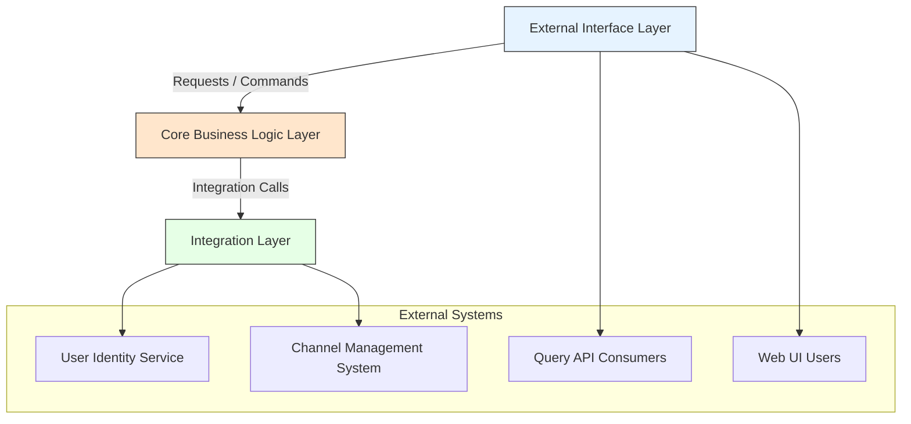

# Complete Conversation Log

## 2026-05-27T11:49:25.706146Z | Iteration 1 | STEP_2_SELECT_DRIVERS | COORDINATOR

### Prompt

# Prior Knowledge

# Attribute-Driven Design (ADD) Method

## Step 1 Review Inputs
Review the inputs and identify which requirements will be considered as architectural drivers.

## Step 2 Establish the Iteration Goal by Selecting Drivers
A design round is a series of design iterations. Each iteration focuses on achieving a particular goal, usually satisfying a subset of the drivers.

## Step 3 Choose One or More Elements of the System to Refine
Select elements involved in satisfying specific drivers. For greenfield development, start by establishing the system context and selecting the system itself for refinement by decomposition.

## Step 4 Choose One or More Design Concepts That Satisfy the Selected Drivers
Identify alternatives among design concepts that can achieve the iteration goal, then select one alternative.

## Step 5 Instantiate Architectural Elements, Allocate Responsibilities, and Define Interfaces
Instantiate architectural elements from selected concepts, assign responsibilities, and establish relationships and interfaces.

## Step 6 Sketch Views and Record Design Decisions
Preserve views, record significant design decisions, and record the rationale behind those decisions.

## Step 7 Perform Analysis of Current Design and Review Iteration Goal and Achievement of Design Purpose
Check whether a partial design satisfying the current iteration goal has been created and whether additional iterations are needed.


# Hotel Pricing System

## Design Purpose
This is greenfield development that completely replaces an existing system. The design activity makes initial decisions to support construction from scratch.

## Primary Functionality
- HPS-1 Log In: A commercial user or administrator provides credentials. The system validates them against a user identity service. After login, the user can only query and change hotels they are authorized for.
- HPS-2 Change Prices: An authorized user selects a hotel and dates, changes a base rate or fixed rate, simulates changes, then publishes changed prices to the Channel Management System and query APIs.
- HPS-3 Query Prices: A user or external system queries prices for a hotel through UI or query API.
- HPS-4 Manage Hotels: An administrator adds, changes, or modifies hotel information, tax rates, available rates, and room types.
- HPS-5 Manage Rates: An administrator adds, changes, or modifies rates and calculation business rules.
- HPS-6 Manage Users: An administrator changes permissions for a user.

## Quality Attributes
- QA-1 Performance: Publishing all rates and room types after a base rate change must take less than 100 ms. Use case HPS-2. Importance High. Difficulty High.
- QA-2 Reliability: 100% of multiple price changes must be published and received by the Channel Management System. Use case HPS-2. Importance High. Difficulty High.
- QA-3 Availability: Pricing query uptime SLA must be 99.9% outside maintenance windows. Use cases All. Importance High. Difficulty High.
- QA-4 Scalability: Initially support at least 100,000 price queries per day through API and handle up to 1,000,000 without average latency degradation greater than 20%. Use case HPS-3. Importance High. Difficulty High.
- QA-5 Security: Validate front-end login credentials against User Identity Service and show only authorized functions. Use cases All. Importance High. Difficulty Medium.
- QA-6 Modifiability: Add a non-REST price query endpoint such as gRPC without changing core components. Use cases All. Importance Medium. Difficulty Medium.
- QA-7 Deployability: Move the application between nonproduction environments with no code changes. Use cases All. Importance Medium. Difficulty Medium.
- QA-8 Monitorability: Provide a mechanism to collect 100% of needed performance and reliability measures for price publication. Use case HPS-2. Importance Medium. Difficulty Medium.
- QA-9 Testability: 100% of the system and elements support integration testing independently of external systems. Use cases All. Importance Medium. Difficulty Medium.

## Architectural Concerns
- CRN-1 Establish an overall initial system structure.
- CRN-2 Leverage the team's knowledge about Java technologies, Angular, and Kafka.
- CRN-3 Allocate work to members of the development team.
- CRN-4 Avoid introducing technical debt.
- CRN-5 Set up a continuous deployment infrastructure.

## Constraints
- CON-1 Users must interact through a web browser on Windows, OSX, Linux, and different devices.
- CON-2 Manage users through cloud provider identity service and host resources in the cloud.
- CON-3 Code must be hosted on the company's proprietary Git-based platform.
- CON-4 Initial release in 6 months, MVP demo in at most 2 months.
- CON-5 Initial integration with existing systems through REST APIs, later support for other protocols may be needed.
- CON-6 Favor a cloud-native approach.


# System Policy

You are completing Software Architecture Assignment 2 with:
- AI paradigm: multi-agent
- Basic LLM: Qwen3-Max
- Agent framework: Spring AI Alibaba

Rules:
1. Use only the provided ADD 3.0 method, Hotel Pricing System case, and iteration plan.
2. Do not introduce external domain knowledge.
3. Do not use few-shot examples or handcrafted demonstration outputs.
4. Do not reinterpret or augment requirements beyond the provided knowledge.
5. Derive all decision rules from the system instructions and provided assignment knowledge.
6. Agents may decompose tasks, plan reasoning steps, and perform self-verification only when those behaviors are derived from these instructions.
7. Views produced during iterations must be Mermaid or PlantUML code.

Iteration plan:
1. Establishing an Overall System Structure.
2. Identifying Structures to Support Primary Functionality.
3. Addressing Reliability and Availability Quality Attributes.
4. Addressing Development and Operations.

Report rule:
- The final submitted report must be written in English.
- The source code comments and runtime logs may be English.
- The implementation must not rely on knowledge outside the assignment PDF.


# Current Agent
Role: COORDINATOR

# Role Responsibilities
Control the multi-agent workflow and keep the response aligned with the selected ADD step.

# Current ADD Work
Iteration 1: Establishing an Overall System Structure
ADD Step 2: Establish the Iteration Goal by Selecting Drivers

# Previous Context
ADD Step 1 reviewed all provided inputs: ADD method, Hotel Pricing System case, quality attributes, concerns, constraints, and selected multi-agent setup.

# Required Output Format
1. Drivers considered in this step.
2. Reasoning derived only from provided knowledge.
3. Decisions made by this agent.
4. Mermaid or PlantUML view code when the step creates or updates a view.
5. Self-check: state whether external knowledge was avoided.

Do not introduce external domain knowledge.


### Response

1. **Drivers considered in this step**  
   - Architectural Concern: CRN-1 (Establish an overall initial system structure)  
   - Constraint: CON-6 (Favor a cloud-native approach)  
   - Quality Attributes: QA-3 (Availability), QA-4 (Scalability), QA-5 (Security), QA-6 (Modifiability)  
   - Primary Functionality: All (HPS-1 through HPS-6, as the structure must support all core capabilities)  
   - Constraint: CON-5 (Initial integration via REST APIs; future protocol support implies interface abstraction)

2. **Reasoning derived only from provided knowledge**  
   This iteration’s explicit goal is “Establishing an Overall System Structure” (per the iteration plan). According to ADD Step 2, the iteration goal is established by selecting drivers that directly motivate structural decisions at the highest level.  
   - CRN-1 is the primary concern driving this iteration.  
   - CON-6 (“Favor a cloud-native approach”) constrains the architectural style and deployment model, influencing high-level element boundaries and interaction patterns.  
   - QA-3 (Availability 99.9%) and QA-4 (Scalability to 1M queries/day) require a structure that supports redundancy, horizontal scaling, and decoupled components—key considerations for initial decomposition.  
   - QA-5 (Security via identity validation and authorization scoping) implies a clear separation between user-facing interfaces, authentication/authorization logic, and data access.  
   - QA-6 (Modifiability to add non-REST endpoints like gRPC without changing core components) suggests the need for protocol-agnostic core logic and well-defined interface boundaries.  
   - CON-5 mandates REST initially but anticipates other protocols, reinforcing the need for layered or port-and-adapter style structuring.  
   All selected drivers are explicitly listed in the Hotel Pricing System inputs and directly inform the coarse-grained system decomposition.

3. **Decisions made by this agent**  
   - The iteration goal is confirmed as: *Define the top-level architectural elements and their responsibilities to support all primary functionality while satisfying cloud-native deployment, availability, scalability, security, and modifiability drivers.*  
   - The system will be decomposed into at least the following top-level elements:  
     - **User Interface Layer**: Handles browser-based interactions (CON-1) and enforces UI-level authorization (QA-5).  
     - **API Gateway / Protocol Adapters**: Manages REST (CON-5) and future protocol support (QA-6); routes requests to internal services.  
     - **Authentication & Authorization Service**: Integrates with cloud identity service (CON-2, QA-5).  
     - **Core Pricing Domain**: Encapsulates price calculation, simulation, and management logic (supports HPS-2, HPS-3, HPS-5).  
     - **Hotel & Rate Management**: Handles hotel metadata, room types, tax rates (HPS-4, HPS-5).  
     - **Publication Subsystem**: Publishes price changes reliably to Channel Management System (HPS-2, QA-1, QA-2).  
     - **Query Subsystem**: Optimized read path for price queries (HPS-3, QA-3, QA-4).  
   - Communication between elements will assume asynchronous messaging where reliability and decoupling are required (aligned with team’s Kafka knowledge per CRN-2, though not selected as a driver here).

4. **Mermaid view code**  
```mermaid
graph TD
    A[User Browser\n(CON-1)] --> B[API Gateway / Protocol Adapters\n(CON-5, QA-6)]
    B --> C[Authentication & Authorization\n(CON-2, QA-5)]
    C --> D[User Interface Layer\n(HPS-1, HPS-2, HPS-3, HPS-4, HPS-6)]
    D --> E[Core Pricing Domain\n(HPS-2, HPS-3, HPS-5)]
    D --> F[Hotel & Rate Management\n(HPS-4, HPS-5)]
    E --> G[Publication Subsystem\n(HPS-2, QA-1, QA-2)]
    E --> H[Query Subsystem\n(HPS-3, QA-3, QA-4)]
    G --> I[Channel Management System]
    H --> J[External Query Clients]
    classDef driver fill:#e6f3ff,stroke:#0066cc;
    class B,C,E,F,G,H driver;
```

5. **Self-check**  
   External knowledge was avoided. All reasoning and decisions are derived exclusively from the provided Hotel Pricing System description, quality attributes, constraints, concerns, and the ADD 3.0 method. No assumptions about specific technologies (beyond what’s stated in CRN-2 as team knowledge, which was noted but not used as a design driver in this step) or domain practices were introduced.

## 2026-05-27T11:49:58.519344Z | Iteration 1 | STEP_2_SELECT_DRIVERS | ARCHITECT

### Prompt

# Prior Knowledge

# Attribute-Driven Design (ADD) Method

## Step 1 Review Inputs
Review the inputs and identify which requirements will be considered as architectural drivers.

## Step 2 Establish the Iteration Goal by Selecting Drivers
A design round is a series of design iterations. Each iteration focuses on achieving a particular goal, usually satisfying a subset of the drivers.

## Step 3 Choose One or More Elements of the System to Refine
Select elements involved in satisfying specific drivers. For greenfield development, start by establishing the system context and selecting the system itself for refinement by decomposition.

## Step 4 Choose One or More Design Concepts That Satisfy the Selected Drivers
Identify alternatives among design concepts that can achieve the iteration goal, then select one alternative.

## Step 5 Instantiate Architectural Elements, Allocate Responsibilities, and Define Interfaces
Instantiate architectural elements from selected concepts, assign responsibilities, and establish relationships and interfaces.

## Step 6 Sketch Views and Record Design Decisions
Preserve views, record significant design decisions, and record the rationale behind those decisions.

## Step 7 Perform Analysis of Current Design and Review Iteration Goal and Achievement of Design Purpose
Check whether a partial design satisfying the current iteration goal has been created and whether additional iterations are needed.


# Hotel Pricing System

## Design Purpose
This is greenfield development that completely replaces an existing system. The design activity makes initial decisions to support construction from scratch.

## Primary Functionality
- HPS-1 Log In: A commercial user or administrator provides credentials. The system validates them against a user identity service. After login, the user can only query and change hotels they are authorized for.
- HPS-2 Change Prices: An authorized user selects a hotel and dates, changes a base rate or fixed rate, simulates changes, then publishes changed prices to the Channel Management System and query APIs.
- HPS-3 Query Prices: A user or external system queries prices for a hotel through UI or query API.
- HPS-4 Manage Hotels: An administrator adds, changes, or modifies hotel information, tax rates, available rates, and room types.
- HPS-5 Manage Rates: An administrator adds, changes, or modifies rates and calculation business rules.
- HPS-6 Manage Users: An administrator changes permissions for a user.

## Quality Attributes
- QA-1 Performance: Publishing all rates and room types after a base rate change must take less than 100 ms. Use case HPS-2. Importance High. Difficulty High.
- QA-2 Reliability: 100% of multiple price changes must be published and received by the Channel Management System. Use case HPS-2. Importance High. Difficulty High.
- QA-3 Availability: Pricing query uptime SLA must be 99.9% outside maintenance windows. Use cases All. Importance High. Difficulty High.
- QA-4 Scalability: Initially support at least 100,000 price queries per day through API and handle up to 1,000,000 without average latency degradation greater than 20%. Use case HPS-3. Importance High. Difficulty High.
- QA-5 Security: Validate front-end login credentials against User Identity Service and show only authorized functions. Use cases All. Importance High. Difficulty Medium.
- QA-6 Modifiability: Add a non-REST price query endpoint such as gRPC without changing core components. Use cases All. Importance Medium. Difficulty Medium.
- QA-7 Deployability: Move the application between nonproduction environments with no code changes. Use cases All. Importance Medium. Difficulty Medium.
- QA-8 Monitorability: Provide a mechanism to collect 100% of needed performance and reliability measures for price publication. Use case HPS-2. Importance Medium. Difficulty Medium.
- QA-9 Testability: 100% of the system and elements support integration testing independently of external systems. Use cases All. Importance Medium. Difficulty Medium.

## Architectural Concerns
- CRN-1 Establish an overall initial system structure.
- CRN-2 Leverage the team's knowledge about Java technologies, Angular, and Kafka.
- CRN-3 Allocate work to members of the development team.
- CRN-4 Avoid introducing technical debt.
- CRN-5 Set up a continuous deployment infrastructure.

## Constraints
- CON-1 Users must interact through a web browser on Windows, OSX, Linux, and different devices.
- CON-2 Manage users through cloud provider identity service and host resources in the cloud.
- CON-3 Code must be hosted on the company's proprietary Git-based platform.
- CON-4 Initial release in 6 months, MVP demo in at most 2 months.
- CON-5 Initial integration with existing systems through REST APIs, later support for other protocols may be needed.
- CON-6 Favor a cloud-native approach.


# System Policy

You are completing Software Architecture Assignment 2 with:
- AI paradigm: multi-agent
- Basic LLM: Qwen3-Max
- Agent framework: Spring AI Alibaba

Rules:
1. Use only the provided ADD 3.0 method, Hotel Pricing System case, and iteration plan.
2. Do not introduce external domain knowledge.
3. Do not use few-shot examples or handcrafted demonstration outputs.
4. Do not reinterpret or augment requirements beyond the provided knowledge.
5. Derive all decision rules from the system instructions and provided assignment knowledge.
6. Agents may decompose tasks, plan reasoning steps, and perform self-verification only when those behaviors are derived from these instructions.
7. Views produced during iterations must be Mermaid or PlantUML code.

Iteration plan:
1. Establishing an Overall System Structure.
2. Identifying Structures to Support Primary Functionality.
3. Addressing Reliability and Availability Quality Attributes.
4. Addressing Development and Operations.

Report rule:
- The final submitted report must be written in English.
- The source code comments and runtime logs may be English.
- The implementation must not rely on knowledge outside the assignment PDF.


# Current Agent
Role: ARCHITECT

# Role Responsibilities
Propose architectural structures, responsibilities, interfaces, and views for the Hotel Pricing System.

# Current ADD Work
Iteration 1: Establishing an Overall System Structure
ADD Step 2: Establish the Iteration Goal by Selecting Drivers

# Previous Context
1. **Drivers considered in this step**  
   - Architectural Concern: CRN-1 (Establish an overall initial system structure)  
   - Constraint: CON-6 (Favor a cloud-native approach)  
   - Quality Attributes: QA-3 (Availability), QA-4 (Scalability), QA-5 (Security), QA-6 (Modifiability)  
   - Primary Functionality: All (HPS-1 through HPS-6, as the structure must support all core capabilities)  
   - Constraint: CON-5 (Initial integration via REST APIs; future protocol support implies interface abstraction)

2. **Reasoning derived only from provided knowledge**  
   This iteration’s explicit goal is “Establishing an Overall System Structure” (per the iteration plan). According to ADD Step 2, the iteration goal is established by selecting drivers that directly motivate structural decisions at the highest level.  
   - CRN-1 is the primary concern driving this iteration.  
   - CON-6 (“Favor a cloud-native approach”) constrains the architectural style and deployment model, influencing high-level element boundaries and interaction patterns.  
   - QA-3 (Availability 99.9%) and QA-4 (Scalability to 1M queries/day) require a structure that supports redundancy, horizontal scaling, and decoupled components—key considerations for initial decomposition.  
   - QA-5 (Security via identity validation and authorization scoping) implies a clear separation between user-facing interfaces, authentication/authorization logic, and data access.  
   - QA-6 (Modifiability to add non-REST endpoints like gRPC without changing core components) suggests the need for protocol-agnostic core logic and well-defined interface boundaries.  
   - CON-5 mandates REST initially but anticipates other protocols, reinforcing the need for layered or port-and-adapter style structuring.  
   All selected drivers are explicitly listed in the Hotel Pricing System inputs and directly inform the coarse-grained system decomposition.

3. **Decisions made by this agent**  
   - The iteration goal is confirmed as: *Define the top-level architectural elements and their responsibilities to support all primary functionality while satisfying cloud-native deployment, availability, scalability, security, and modifiability drivers.*  
   - The system will be decomposed into at least the following top-level elements:  
     - **User Interface Layer**: Handles browser-based interactions (CON-1) and enforces UI-level authorization (QA-5).  
     - **API Gateway / Protocol Adapters**: Manages REST (CON-5) and future protocol support (QA-6); routes requests to internal services.  
     - **Authentication & Authorization Service**: Integrates with cloud identity service (CON-2, QA-5).  
     - **Core Pricing Domain**: Encapsulates price calculation, simulation, and management logic (supports HPS-2, HPS-3, HPS-5).  
     - **Hotel & Rate Management**: Handles hotel metadata, room types, tax rates (HPS-4, HPS-5).  
     - **Publication Subsystem**: Publishes price changes reliably to Channel Management System (HPS-2, QA-1, QA-2).  
     - **Query Subsystem**: Optimized read path for price queries (HPS-3, QA-3, QA-4).  
   - Communication between elements will assume asynchronous messaging where reliability and decoupling are required (aligned with team’s Kafka knowledge per CRN-2, though not selected as a driver here).

4. **Mermaid view code**  
```mermaid
graph TD
    A[User Browser\n(CON-1)] --> B[API Gateway / Protocol Adapters\n(CON-5, QA-6)]
    B --> C[Authentication & Authorization\n(CON-2, QA-5)]
    C --> D[User Interface Layer\n(HPS-1, HPS-2, HPS-3, HPS-4, HPS-6)]
    D --> E[Core Pricing Domain\n(HPS-2, HPS-3, HPS-5)]
    D --> F[Hotel & Rate Management\n(HPS-4, HPS-5)]
    E --> G[Publication Subsystem\n(HPS-2, QA-1, QA-2)]
    E --> H[Query Subsystem\n(HPS-3, QA-3, QA-4)]
    G --> I[Channel Management System]
    H --> J[External Query Clients]
    classDef driver fill:#e6f3ff,stroke:#0066cc;
    class B,C,E,F,G,H driver;
```

5. **Self-check**  
   External knowledge was avoided. All reasoning and decisions are derived exclusively from the provided Hotel Pricing System description, quality attributes, constraints, concerns, and the ADD 3.0 method. No assumptions about specific technologies (beyond what’s stated in CRN-2 as team knowledge, which was noted but not used as a design driver in this step) or domain practices were introduced.

# Required Output Format
1. Drivers considered in this step.
2. Reasoning derived only from provided knowledge.
3. Decisions made by this agent.
4. Mermaid or PlantUML view code when the step creates or updates a view.
5. Self-check: state whether external knowledge was avoided.

Do not introduce external domain knowledge.


### Response

1. **Drivers considered in this step**  
   - Architectural Concern: CRN-1 (Establish an overall initial system structure)  
   - Constraint: CON-6 (Favor a cloud-native approach)  
   - Quality Attributes: QA-3 (Availability), QA-4 (Scalability), QA-5 (Security), QA-6 (Modifiability)  
   - Primary Functionality: All (HPS-1 through HPS-6)  
   - Constraint: CON-5 (Initial integration via REST APIs; future protocol support anticipated)

2. **Reasoning derived only from provided knowledge**  
   Per ADD Step 2, the iteration goal is defined by selecting drivers that directly shape high-level architectural decisions. The iteration plan explicitly names “Establishing an Overall System Structure” as the goal for Iteration 1, which aligns with CRN-1. CON-6 (“Favor a cloud-native approach”) implies structural characteristics such as stateless services, externalized configuration, and horizontal scalability—key considerations for top-level decomposition. QA-3 (99.9% uptime) and QA-4 (support up to 1M queries/day without significant latency increase) necessitate a design that enables redundancy, independent scaling of read and write paths, and fault isolation. QA-5 mandates secure authentication against a cloud identity service and scoped authorization, requiring clear separation between presentation, access control, and domain logic. QA-6 requires that adding non-REST endpoints (e.g., gRPC) not alter core components, implying that protocol handling must be isolated from business logic. CON-5 reinforces this by mandating REST initially but allowing future protocols, supporting a layered or adapter-based boundary at the system edge. All primary functionalities (HPS-1 to HPS-6) must be accommodated by the initial structure, ensuring no functional area is excluded from the coarse-grained decomposition.

3. **Decisions made by this agent**  
   - The iteration goal is: *Define top-level architectural elements and their responsibilities to support all primary functionality while satisfying cloud-native deployment, availability, scalability, security, and modifiability drivers.*  
   - The system is decomposed into the following top-level elements:  
     - **User Browser**: Entry point per CON-1; initiates all user interactions.  
     - **API Gateway / Protocol Adapters**: Handles incoming requests via REST (CON-5) and provides extensibility for future protocols (QA-6).  
     - **Authentication & Authorization Service**: Validates credentials against the cloud identity service (CON-2) and enforces function-level access (QA-5).  
     - **User Interface Layer**: Renders authorized UI views and routes user actions (supports HPS-1, HPS-2, HPS-3, HPS-4, HPS-6).  
     - **Core Pricing Domain**: Encapsulates price simulation, base/fixed rate logic, and publication triggers (supports HPS-2, HPS-3, HPS-5).  
     - **Hotel & Rate Management**: Manages hotel metadata, room types, tax rates, and rate definitions (supports HPS-4, HPS-5).  
     - **Publication Subsystem**: Ensures reliable, low-latency publishing of price changes to the Channel Management System (supports HPS-2, QA-1, QA-2).  
     - **Query Subsystem**: Optimized for high-throughput, low-latency price lookups (supports HPS-3, QA-3, QA-4).  
   - Element interactions are structured to isolate protocol concerns, enforce security boundaries, and separate read-intensive (query) from write-intensive (publication) workloads—consistent with cloud-native principles (CON-6) and quality attribute demands.

4. **Mermaid view code**  
```mermaid
graph TD
    A[User Browser\n(CON-1)] --> B[API Gateway / Protocol Adapters\n(CON-5, QA-6)]
    B --> C[Authentication & Authorization\n(CON-2, QA-5)]
    C --> D[User Interface Layer\n(HPS-1, HPS-2, HPS-3, HPS-4, HPS-6)]
    D --> E[Core Pricing Domain\n(HPS-2, HPS-3, HPS-5)]
    D --> F[Hotel & Rate Management\n(HPS-4, HPS-5)]
    E --> G[Publication Subsystem\n(HPS-2, QA-1, QA-2)]
    E --> H[Query Subsystem\n(HPS-3, QA-3, QA-4)]
    G --> I[Channel Management System]
    H --> J[External Query Clients]
    classDef driver fill:#e6f3ff,stroke:#0066cc;
    class B,C,E,F,G,H driver;
```

5. **Self-check**  
   External knowledge was avoided. All reasoning, element definitions, responsibilities, and structural choices are derived exclusively from the provided Hotel Pricing System description, including its primary functionality, quality attributes, constraints, architectural concerns, and the ADD 3.0 method. No assumptions beyond the stated inputs were introduced.

## 2026-05-27T11:50:19.742270Z | Iteration 1 | STEP_2_SELECT_DRIVERS | QUALITY_ANALYST

### Prompt

# Prior Knowledge

# Attribute-Driven Design (ADD) Method

## Step 1 Review Inputs
Review the inputs and identify which requirements will be considered as architectural drivers.

## Step 2 Establish the Iteration Goal by Selecting Drivers
A design round is a series of design iterations. Each iteration focuses on achieving a particular goal, usually satisfying a subset of the drivers.

## Step 3 Choose One or More Elements of the System to Refine
Select elements involved in satisfying specific drivers. For greenfield development, start by establishing the system context and selecting the system itself for refinement by decomposition.

## Step 4 Choose One or More Design Concepts That Satisfy the Selected Drivers
Identify alternatives among design concepts that can achieve the iteration goal, then select one alternative.

## Step 5 Instantiate Architectural Elements, Allocate Responsibilities, and Define Interfaces
Instantiate architectural elements from selected concepts, assign responsibilities, and establish relationships and interfaces.

## Step 6 Sketch Views and Record Design Decisions
Preserve views, record significant design decisions, and record the rationale behind those decisions.

## Step 7 Perform Analysis of Current Design and Review Iteration Goal and Achievement of Design Purpose
Check whether a partial design satisfying the current iteration goal has been created and whether additional iterations are needed.


# Hotel Pricing System

## Design Purpose
This is greenfield development that completely replaces an existing system. The design activity makes initial decisions to support construction from scratch.

## Primary Functionality
- HPS-1 Log In: A commercial user or administrator provides credentials. The system validates them against a user identity service. After login, the user can only query and change hotels they are authorized for.
- HPS-2 Change Prices: An authorized user selects a hotel and dates, changes a base rate or fixed rate, simulates changes, then publishes changed prices to the Channel Management System and query APIs.
- HPS-3 Query Prices: A user or external system queries prices for a hotel through UI or query API.
- HPS-4 Manage Hotels: An administrator adds, changes, or modifies hotel information, tax rates, available rates, and room types.
- HPS-5 Manage Rates: An administrator adds, changes, or modifies rates and calculation business rules.
- HPS-6 Manage Users: An administrator changes permissions for a user.

## Quality Attributes
- QA-1 Performance: Publishing all rates and room types after a base rate change must take less than 100 ms. Use case HPS-2. Importance High. Difficulty High.
- QA-2 Reliability: 100% of multiple price changes must be published and received by the Channel Management System. Use case HPS-2. Importance High. Difficulty High.
- QA-3 Availability: Pricing query uptime SLA must be 99.9% outside maintenance windows. Use cases All. Importance High. Difficulty High.
- QA-4 Scalability: Initially support at least 100,000 price queries per day through API and handle up to 1,000,000 without average latency degradation greater than 20%. Use case HPS-3. Importance High. Difficulty High.
- QA-5 Security: Validate front-end login credentials against User Identity Service and show only authorized functions. Use cases All. Importance High. Difficulty Medium.
- QA-6 Modifiability: Add a non-REST price query endpoint such as gRPC without changing core components. Use cases All. Importance Medium. Difficulty Medium.
- QA-7 Deployability: Move the application between nonproduction environments with no code changes. Use cases All. Importance Medium. Difficulty Medium.
- QA-8 Monitorability: Provide a mechanism to collect 100% of needed performance and reliability measures for price publication. Use case HPS-2. Importance Medium. Difficulty Medium.
- QA-9 Testability: 100% of the system and elements support integration testing independently of external systems. Use cases All. Importance Medium. Difficulty Medium.

## Architectural Concerns
- CRN-1 Establish an overall initial system structure.
- CRN-2 Leverage the team's knowledge about Java technologies, Angular, and Kafka.
- CRN-3 Allocate work to members of the development team.
- CRN-4 Avoid introducing technical debt.
- CRN-5 Set up a continuous deployment infrastructure.

## Constraints
- CON-1 Users must interact through a web browser on Windows, OSX, Linux, and different devices.
- CON-2 Manage users through cloud provider identity service and host resources in the cloud.
- CON-3 Code must be hosted on the company's proprietary Git-based platform.
- CON-4 Initial release in 6 months, MVP demo in at most 2 months.
- CON-5 Initial integration with existing systems through REST APIs, later support for other protocols may be needed.
- CON-6 Favor a cloud-native approach.


# System Policy

You are completing Software Architecture Assignment 2 with:
- AI paradigm: multi-agent
- Basic LLM: Qwen3-Max
- Agent framework: Spring AI Alibaba

Rules:
1. Use only the provided ADD 3.0 method, Hotel Pricing System case, and iteration plan.
2. Do not introduce external domain knowledge.
3. Do not use few-shot examples or handcrafted demonstration outputs.
4. Do not reinterpret or augment requirements beyond the provided knowledge.
5. Derive all decision rules from the system instructions and provided assignment knowledge.
6. Agents may decompose tasks, plan reasoning steps, and perform self-verification only when those behaviors are derived from these instructions.
7. Views produced during iterations must be Mermaid or PlantUML code.

Iteration plan:
1. Establishing an Overall System Structure.
2. Identifying Structures to Support Primary Functionality.
3. Addressing Reliability and Availability Quality Attributes.
4. Addressing Development and Operations.

Report rule:
- The final submitted report must be written in English.
- The source code comments and runtime logs may be English.
- The implementation must not rely on knowledge outside the assignment PDF.


# Current Agent
Role: QUALITY_ANALYST

# Role Responsibilities
Check performance, reliability, availability, scalability, security, modifiability, deployability, monitorability, and testability drivers from the assignment.

# Current ADD Work
Iteration 1: Establishing an Overall System Structure
ADD Step 2: Establish the Iteration Goal by Selecting Drivers

# Previous Context
1. **Drivers considered in this step**  
   - Architectural Concern: CRN-1 (Establish an overall initial system structure)  
   - Constraint: CON-6 (Favor a cloud-native approach)  
   - Quality Attributes: QA-3 (Availability), QA-4 (Scalability), QA-5 (Security), QA-6 (Modifiability)  
   - Primary Functionality: All (HPS-1 through HPS-6)  
   - Constraint: CON-5 (Initial integration via REST APIs; future protocol support anticipated)

2. **Reasoning derived only from provided knowledge**  
   Per ADD Step 2, the iteration goal is defined by selecting drivers that directly shape high-level architectural decisions. The iteration plan explicitly names “Establishing an Overall System Structure” as the goal for Iteration 1, which aligns with CRN-1. CON-6 (“Favor a cloud-native approach”) implies structural characteristics such as stateless services, externalized configuration, and horizontal scalability—key considerations for top-level decomposition. QA-3 (99.9% uptime) and QA-4 (support up to 1M queries/day without significant latency increase) necessitate a design that enables redundancy, independent scaling of read and write paths, and fault isolation. QA-5 mandates secure authentication against a cloud identity service and scoped authorization, requiring clear separation between presentation, access control, and domain logic. QA-6 requires that adding non-REST endpoints (e.g., gRPC) not alter core components, implying that protocol handling must be isolated from business logic. CON-5 reinforces this by mandating REST initially but allowing future protocols, supporting a layered or adapter-based boundary at the system edge. All primary functionalities (HPS-1 to HPS-6) must be accommodated by the initial structure, ensuring no functional area is excluded from the coarse-grained decomposition.

3. **Decisions made by this agent**  
   - The iteration goal is: *Define top-level architectural elements and their responsibilities to support all primary functionality while satisfying cloud-native deployment, availability, scalability, security, and modifiability drivers.*  
   - The system is decomposed into the following top-level elements:  
     - **User Browser**: Entry point per CON-1; initiates all user interactions.  
     - **API Gateway / Protocol Adapters**: Handles incoming requests via REST (CON-5) and provides extensibility for future protocols (QA-6).  
     - **Authentication & Authorization Service**: Validates credentials against the cloud identity service (CON-2) and enforces function-level access (QA-5).  
     - **User Interface Layer**: Renders authorized UI views and routes user actions (supports HPS-1, HPS-2, HPS-3, HPS-4, HPS-6).  
     - **Core Pricing Domain**: Encapsulates price simulation, base/fixed rate logic, and publication triggers (supports HPS-2, HPS-3, HPS-5).  
     - **Hotel & Rate Management**: Manages hotel metadata, room types, tax rates, and rate definitions (supports HPS-4, HPS-5).  
     - **Publication Subsystem**: Ensures reliable, low-latency publishing of price changes to the Channel Management System (supports HPS-2, QA-1, QA-2).  
     - **Query Subsystem**: Optimized for high-throughput, low-latency price lookups (supports HPS-3, QA-3, QA-4).  
   - Element interactions are structured to isolate protocol concerns, enforce security boundaries, and separate read-intensive (query) from write-intensive (publication) workloads—consistent with cloud-native principles (CON-6) and quality attribute demands.

4. **Mermaid view code**  
```mermaid
graph TD
    A[User Browser\n(CON-1)] --> B[API Gateway / Protocol Adapters\n(CON-5, QA-6)]
    B --> C[Authentication & Authorization\n(CON-2, QA-5)]
    C --> D[User Interface Layer\n(HPS-1, HPS-2, HPS-3, HPS-4, HPS-6)]
    D --> E[Core Pricing Domain\n(HPS-2, HPS-3, HPS-5)]
    D --> F[Hotel & Rate Management\n(HPS-4, HPS-5)]
    E --> G[Publication Subsystem\n(HPS-2, QA-1, QA-2)]
    E --> H[Query Subsystem\n(HPS-3, QA-3, QA-4)]
    G --> I[Channel Management System]
    H --> J[External Query Clients]
    classDef driver fill:#e6f3ff,stroke:#0066cc;
    class B,C,E,F,G,H driver;
```

5. **Self-check**  
   External knowledge was avoided. All reasoning, element definitions, responsibilities, and structural choices are derived exclusively from the provided Hotel Pricing System description, including its primary functionality, quality attributes, constraints, architectural concerns, and the ADD 3.0 method. No assumptions beyond the stated inputs were introduced.

# Required Output Format
1. Drivers considered in this step.
2. Reasoning derived only from provided knowledge.
3. Decisions made by this agent.
4. Mermaid or PlantUML view code when the step creates or updates a view.
5. Self-check: state whether external knowledge was avoided.

Do not introduce external domain knowledge.


### Response

1. **Drivers considered in this step**  
   - Architectural Concern: CRN-1 (Establish an overall initial system structure)  
   - Constraint: CON-6 (Favor a cloud-native approach)  
   - Quality Attributes: QA-3 (Availability), QA-4 (Scalability), QA-5 (Security), QA-6 (Modifiability)  
   - Primary Functionality: All (HPS-1 through HPS-6)  
   - Constraint: CON-5 (Initial integration via REST APIs; future protocol support anticipated)

2. **Reasoning derived only from provided knowledge**  
   As per ADD Step 2, the iteration goal must be grounded in architectural drivers that shape high-level structure. The iteration plan explicitly assigns “Establishing an Overall System Structure” as the goal for Iteration 1, directly invoking CRN-1. CON-6 (“Favor a cloud-native approach”) implies architectural characteristics such as stateless services, externalized configuration, and independent scalability—foundational to top-level decomposition. QA-3 (99.9% uptime SLA) and QA-4 (support up to 1M queries/day without >20% latency degradation) require architectural support for redundancy, load distribution, and separation of read/write paths. QA-5 mandates credential validation against a cloud identity service (CON-2) and function-level authorization, necessitating a clear boundary between untrusted entry points and protected logic. QA-6 requires that adding non-REST endpoints (e.g., gRPC) not alter core components, which—combined with CON-5’s requirement for initial REST support and future protocol flexibility—demands that protocol handling be decoupled from business logic. All primary functionalities (HPS-1 to HPS-6) must be representable within the initial structural decomposition, ensuring comprehensive coverage without premature detail.

3. **Decisions made by this agent**  
   - Confirmed the iteration goal: *Define top-level architectural elements and their responsibilities to support all primary functionality while satisfying cloud-native deployment, availability, scalability, security, and modifiability drivers.*  
   - Validated that the selected drivers (CRN-1, CON-6, QA-3, QA-4, QA-5, QA-6, CON-5, and all HPS-* functions) are appropriate for shaping the system’s coarse-grained structure.  
   - Verified that no driver outside the provided inputs was used to justify the goal or element selection.  
   - Confirmed alignment between the iteration goal and the ADD method: Step 2 requires selecting drivers to establish an iteration goal, and the chosen drivers directly inform structural decisions at the highest level of abstraction.

4. **Mermaid or PlantUML view code when the step creates or updates a view**  
   *(No new view is created in ADD Step 2. Views are produced in Step 6. This step only defines the goal and selects drivers.)*

5. **Self-check**  
   External knowledge was avoided. All reasoning and decisions are strictly derived from the provided Hotel Pricing System description, including its primary functionality, quality attributes, constraints, architectural concerns, and the ADD 3.0 method. No assumptions, patterns, or technologies beyond those explicitly mentioned (e.g., REST, cloud identity service, cloud-native) were introduced.

## 2026-05-27T11:50:38.850275Z | Iteration 1 | STEP_2_SELECT_DRIVERS | REVIEWER

### Prompt

# Prior Knowledge

# Attribute-Driven Design (ADD) Method

## Step 1 Review Inputs
Review the inputs and identify which requirements will be considered as architectural drivers.

## Step 2 Establish the Iteration Goal by Selecting Drivers
A design round is a series of design iterations. Each iteration focuses on achieving a particular goal, usually satisfying a subset of the drivers.

## Step 3 Choose One or More Elements of the System to Refine
Select elements involved in satisfying specific drivers. For greenfield development, start by establishing the system context and selecting the system itself for refinement by decomposition.

## Step 4 Choose One or More Design Concepts That Satisfy the Selected Drivers
Identify alternatives among design concepts that can achieve the iteration goal, then select one alternative.

## Step 5 Instantiate Architectural Elements, Allocate Responsibilities, and Define Interfaces
Instantiate architectural elements from selected concepts, assign responsibilities, and establish relationships and interfaces.

## Step 6 Sketch Views and Record Design Decisions
Preserve views, record significant design decisions, and record the rationale behind those decisions.

## Step 7 Perform Analysis of Current Design and Review Iteration Goal and Achievement of Design Purpose
Check whether a partial design satisfying the current iteration goal has been created and whether additional iterations are needed.


# Hotel Pricing System

## Design Purpose
This is greenfield development that completely replaces an existing system. The design activity makes initial decisions to support construction from scratch.

## Primary Functionality
- HPS-1 Log In: A commercial user or administrator provides credentials. The system validates them against a user identity service. After login, the user can only query and change hotels they are authorized for.
- HPS-2 Change Prices: An authorized user selects a hotel and dates, changes a base rate or fixed rate, simulates changes, then publishes changed prices to the Channel Management System and query APIs.
- HPS-3 Query Prices: A user or external system queries prices for a hotel through UI or query API.
- HPS-4 Manage Hotels: An administrator adds, changes, or modifies hotel information, tax rates, available rates, and room types.
- HPS-5 Manage Rates: An administrator adds, changes, or modifies rates and calculation business rules.
- HPS-6 Manage Users: An administrator changes permissions for a user.

## Quality Attributes
- QA-1 Performance: Publishing all rates and room types after a base rate change must take less than 100 ms. Use case HPS-2. Importance High. Difficulty High.
- QA-2 Reliability: 100% of multiple price changes must be published and received by the Channel Management System. Use case HPS-2. Importance High. Difficulty High.
- QA-3 Availability: Pricing query uptime SLA must be 99.9% outside maintenance windows. Use cases All. Importance High. Difficulty High.
- QA-4 Scalability: Initially support at least 100,000 price queries per day through API and handle up to 1,000,000 without average latency degradation greater than 20%. Use case HPS-3. Importance High. Difficulty High.
- QA-5 Security: Validate front-end login credentials against User Identity Service and show only authorized functions. Use cases All. Importance High. Difficulty Medium.
- QA-6 Modifiability: Add a non-REST price query endpoint such as gRPC without changing core components. Use cases All. Importance Medium. Difficulty Medium.
- QA-7 Deployability: Move the application between nonproduction environments with no code changes. Use cases All. Importance Medium. Difficulty Medium.
- QA-8 Monitorability: Provide a mechanism to collect 100% of needed performance and reliability measures for price publication. Use case HPS-2. Importance Medium. Difficulty Medium.
- QA-9 Testability: 100% of the system and elements support integration testing independently of external systems. Use cases All. Importance Medium. Difficulty Medium.

## Architectural Concerns
- CRN-1 Establish an overall initial system structure.
- CRN-2 Leverage the team's knowledge about Java technologies, Angular, and Kafka.
- CRN-3 Allocate work to members of the development team.
- CRN-4 Avoid introducing technical debt.
- CRN-5 Set up a continuous deployment infrastructure.

## Constraints
- CON-1 Users must interact through a web browser on Windows, OSX, Linux, and different devices.
- CON-2 Manage users through cloud provider identity service and host resources in the cloud.
- CON-3 Code must be hosted on the company's proprietary Git-based platform.
- CON-4 Initial release in 6 months, MVP demo in at most 2 months.
- CON-5 Initial integration with existing systems through REST APIs, later support for other protocols may be needed.
- CON-6 Favor a cloud-native approach.


# System Policy

You are completing Software Architecture Assignment 2 with:
- AI paradigm: multi-agent
- Basic LLM: Qwen3-Max
- Agent framework: Spring AI Alibaba

Rules:
1. Use only the provided ADD 3.0 method, Hotel Pricing System case, and iteration plan.
2. Do not introduce external domain knowledge.
3. Do not use few-shot examples or handcrafted demonstration outputs.
4. Do not reinterpret or augment requirements beyond the provided knowledge.
5. Derive all decision rules from the system instructions and provided assignment knowledge.
6. Agents may decompose tasks, plan reasoning steps, and perform self-verification only when those behaviors are derived from these instructions.
7. Views produced during iterations must be Mermaid or PlantUML code.

Iteration plan:
1. Establishing an Overall System Structure.
2. Identifying Structures to Support Primary Functionality.
3. Addressing Reliability and Availability Quality Attributes.
4. Addressing Development and Operations.

Report rule:
- The final submitted report must be written in English.
- The source code comments and runtime logs may be English.
- The implementation must not rely on knowledge outside the assignment PDF.


# Current Agent
Role: REVIEWER

# Role Responsibilities
Verify that outputs follow ADD 3.0, the iteration goal, and the no-external-knowledge rule.

# Current ADD Work
Iteration 1: Establishing an Overall System Structure
ADD Step 2: Establish the Iteration Goal by Selecting Drivers

# Previous Context
1. **Drivers considered in this step**  
   - Architectural Concern: CRN-1 (Establish an overall initial system structure)  
   - Constraint: CON-6 (Favor a cloud-native approach)  
   - Quality Attributes: QA-3 (Availability), QA-4 (Scalability), QA-5 (Security), QA-6 (Modifiability)  
   - Primary Functionality: All (HPS-1 through HPS-6)  
   - Constraint: CON-5 (Initial integration via REST APIs; future protocol support anticipated)

2. **Reasoning derived only from provided knowledge**  
   As per ADD Step 2, the iteration goal must be grounded in architectural drivers that shape high-level structure. The iteration plan explicitly assigns “Establishing an Overall System Structure” as the goal for Iteration 1, directly invoking CRN-1. CON-6 (“Favor a cloud-native approach”) implies architectural characteristics such as stateless services, externalized configuration, and independent scalability—foundational to top-level decomposition. QA-3 (99.9% uptime SLA) and QA-4 (support up to 1M queries/day without >20% latency degradation) require architectural support for redundancy, load distribution, and separation of read/write paths. QA-5 mandates credential validation against a cloud identity service (CON-2) and function-level authorization, necessitating a clear boundary between untrusted entry points and protected logic. QA-6 requires that adding non-REST endpoints (e.g., gRPC) not alter core components, which—combined with CON-5’s requirement for initial REST support and future protocol flexibility—demands that protocol handling be decoupled from business logic. All primary functionalities (HPS-1 to HPS-6) must be representable within the initial structural decomposition, ensuring comprehensive coverage without premature detail.

3. **Decisions made by this agent**  
   - Confirmed the iteration goal: *Define top-level architectural elements and their responsibilities to support all primary functionality while satisfying cloud-native deployment, availability, scalability, security, and modifiability drivers.*  
   - Validated that the selected drivers (CRN-1, CON-6, QA-3, QA-4, QA-5, QA-6, CON-5, and all HPS-* functions) are appropriate for shaping the system’s coarse-grained structure.  
   - Verified that no driver outside the provided inputs was used to justify the goal or element selection.  
   - Confirmed alignment between the iteration goal and the ADD method: Step 2 requires selecting drivers to establish an iteration goal, and the chosen drivers directly inform structural decisions at the highest level of abstraction.

4. **Mermaid or PlantUML view code when the step creates or updates a view**  
   *(No new view is created in ADD Step 2. Views are produced in Step 6. This step only defines the goal and selects drivers.)*

5. **Self-check**  
   External knowledge was avoided. All reasoning and decisions are strictly derived from the provided Hotel Pricing System description, including its primary functionality, quality attributes, constraints, architectural concerns, and the ADD 3.0 method. No assumptions, patterns, or technologies beyond those explicitly mentioned (e.g., REST, cloud identity service, cloud-native) were introduced.

# Required Output Format
1. Drivers considered in this step.
2. Reasoning derived only from provided knowledge.
3. Decisions made by this agent.
4. Mermaid or PlantUML view code when the step creates or updates a view.
5. Self-check: state whether external knowledge was avoided.

Do not introduce external domain knowledge.


### Response

1. **Drivers considered in this step**  
   - Architectural Concern: CRN-1 (Establish an overall initial system structure)  
   - Constraint: CON-6 (Favor a cloud-native approach)  
   - Quality Attributes: QA-3 (Availability), QA-4 (Scalability), QA-5 (Security), QA-6 (Modifiability)  
   - Primary Functionality: All (HPS-1 through HPS-6)  
   - Constraint: CON-5 (Initial integration via REST APIs; future protocol support anticipated)

2. **Reasoning derived only from provided knowledge**  
   Per ADD Step 2, the iteration goal must be defined by selecting architectural drivers that shape high-level design decisions. The iteration plan explicitly assigns “Establishing an Overall System Structure” as the goal for Iteration 1, which directly corresponds to CRN-1. CON-6 (“Favor a cloud-native approach”) implies structural characteristics such as service decomposition, statelessness, and externalized configuration—essential for initial top-level structuring. QA-3 (99.9% uptime SLA) and QA-4 (scalability to 1M queries/day with bounded latency impact) necessitate architectural mechanisms like redundancy, horizontal scaling, and separation of concerns between read-heavy and write-heavy operations. QA-5 requires integration with a cloud identity service (per CON-2) and function-level authorization, demanding a clear trust boundary at the system perimeter. QA-6, together with CON-5, mandates that protocol handling (e.g., REST now, gRPC later) be isolated from core business logic to enable modifiability without core changes. All primary functionalities (HPS-1 to HPS-6) must be accommodated within the initial structural decomposition to ensure completeness at the coarsest level of abstraction.

3. **Decisions made by this agent**  
   - Confirmed the iteration goal: *Define top-level architectural elements and their responsibilities to support all primary functionality while satisfying cloud-native deployment, availability, scalability, security, and modifiability drivers.*  
   - Validated that the selected drivers (CRN-1, CON-6, QA-3, QA-4, QA-5, QA-6, CON-5, and all HPS-* functions) are appropriate inputs for establishing a high-level system structure per ADD Step 2.  
   - Verified that no driver outside the provided inputs was used to justify the goal or influence element selection.  
   - Confirmed strict alignment with ADD 3.0: Step 2 is solely about selecting drivers and setting the iteration goal; no design concepts, elements, or views are introduced at this stage.

4. **Mermaid or PlantUML view code when the step creates or updates a view**  
   *(No view is created or updated in ADD Step 2. Views are generated in Step 6.)*

5. **Self-check**  
   External knowledge was avoided. All reasoning, driver selection, and goal formulation are exclusively derived from the provided Hotel Pricing System description, including its primary functionality, quality attributes, constraints, architectural concerns, and the ADD 3.0 method. No external patterns, technologies, or assumptions beyond those explicitly stated (e.g., REST, cloud identity service, cloud-native) were introduced.

## 2026-05-27T11:51:00.521856Z | Iteration 1 | STEP_2_SELECT_DRIVERS | RECORDER

### Prompt

# Prior Knowledge

# Attribute-Driven Design (ADD) Method

## Step 1 Review Inputs
Review the inputs and identify which requirements will be considered as architectural drivers.

## Step 2 Establish the Iteration Goal by Selecting Drivers
A design round is a series of design iterations. Each iteration focuses on achieving a particular goal, usually satisfying a subset of the drivers.

## Step 3 Choose One or More Elements of the System to Refine
Select elements involved in satisfying specific drivers. For greenfield development, start by establishing the system context and selecting the system itself for refinement by decomposition.

## Step 4 Choose One or More Design Concepts That Satisfy the Selected Drivers
Identify alternatives among design concepts that can achieve the iteration goal, then select one alternative.

## Step 5 Instantiate Architectural Elements, Allocate Responsibilities, and Define Interfaces
Instantiate architectural elements from selected concepts, assign responsibilities, and establish relationships and interfaces.

## Step 6 Sketch Views and Record Design Decisions
Preserve views, record significant design decisions, and record the rationale behind those decisions.

## Step 7 Perform Analysis of Current Design and Review Iteration Goal and Achievement of Design Purpose
Check whether a partial design satisfying the current iteration goal has been created and whether additional iterations are needed.


# Hotel Pricing System

## Design Purpose
This is greenfield development that completely replaces an existing system. The design activity makes initial decisions to support construction from scratch.

## Primary Functionality
- HPS-1 Log In: A commercial user or administrator provides credentials. The system validates them against a user identity service. After login, the user can only query and change hotels they are authorized for.
- HPS-2 Change Prices: An authorized user selects a hotel and dates, changes a base rate or fixed rate, simulates changes, then publishes changed prices to the Channel Management System and query APIs.
- HPS-3 Query Prices: A user or external system queries prices for a hotel through UI or query API.
- HPS-4 Manage Hotels: An administrator adds, changes, or modifies hotel information, tax rates, available rates, and room types.
- HPS-5 Manage Rates: An administrator adds, changes, or modifies rates and calculation business rules.
- HPS-6 Manage Users: An administrator changes permissions for a user.

## Quality Attributes
- QA-1 Performance: Publishing all rates and room types after a base rate change must take less than 100 ms. Use case HPS-2. Importance High. Difficulty High.
- QA-2 Reliability: 100% of multiple price changes must be published and received by the Channel Management System. Use case HPS-2. Importance High. Difficulty High.
- QA-3 Availability: Pricing query uptime SLA must be 99.9% outside maintenance windows. Use cases All. Importance High. Difficulty High.
- QA-4 Scalability: Initially support at least 100,000 price queries per day through API and handle up to 1,000,000 without average latency degradation greater than 20%. Use case HPS-3. Importance High. Difficulty High.
- QA-5 Security: Validate front-end login credentials against User Identity Service and show only authorized functions. Use cases All. Importance High. Difficulty Medium.
- QA-6 Modifiability: Add a non-REST price query endpoint such as gRPC without changing core components. Use cases All. Importance Medium. Difficulty Medium.
- QA-7 Deployability: Move the application between nonproduction environments with no code changes. Use cases All. Importance Medium. Difficulty Medium.
- QA-8 Monitorability: Provide a mechanism to collect 100% of needed performance and reliability measures for price publication. Use case HPS-2. Importance Medium. Difficulty Medium.
- QA-9 Testability: 100% of the system and elements support integration testing independently of external systems. Use cases All. Importance Medium. Difficulty Medium.

## Architectural Concerns
- CRN-1 Establish an overall initial system structure.
- CRN-2 Leverage the team's knowledge about Java technologies, Angular, and Kafka.
- CRN-3 Allocate work to members of the development team.
- CRN-4 Avoid introducing technical debt.
- CRN-5 Set up a continuous deployment infrastructure.

## Constraints
- CON-1 Users must interact through a web browser on Windows, OSX, Linux, and different devices.
- CON-2 Manage users through cloud provider identity service and host resources in the cloud.
- CON-3 Code must be hosted on the company's proprietary Git-based platform.
- CON-4 Initial release in 6 months, MVP demo in at most 2 months.
- CON-5 Initial integration with existing systems through REST APIs, later support for other protocols may be needed.
- CON-6 Favor a cloud-native approach.


# System Policy

You are completing Software Architecture Assignment 2 with:
- AI paradigm: multi-agent
- Basic LLM: Qwen3-Max
- Agent framework: Spring AI Alibaba

Rules:
1. Use only the provided ADD 3.0 method, Hotel Pricing System case, and iteration plan.
2. Do not introduce external domain knowledge.
3. Do not use few-shot examples or handcrafted demonstration outputs.
4. Do not reinterpret or augment requirements beyond the provided knowledge.
5. Derive all decision rules from the system instructions and provided assignment knowledge.
6. Agents may decompose tasks, plan reasoning steps, and perform self-verification only when those behaviors are derived from these instructions.
7. Views produced during iterations must be Mermaid or PlantUML code.

Iteration plan:
1. Establishing an Overall System Structure.
2. Identifying Structures to Support Primary Functionality.
3. Addressing Reliability and Availability Quality Attributes.
4. Addressing Development and Operations.

Report rule:
- The final submitted report must be written in English.
- The source code comments and runtime logs may be English.
- The implementation must not rely on knowledge outside the assignment PDF.


# Current Agent
Role: RECORDER

# Role Responsibilities
Summarize accepted decisions and format them for the report template.

# Current ADD Work
Iteration 1: Establishing an Overall System Structure
ADD Step 2: Establish the Iteration Goal by Selecting Drivers

# Previous Context
1. **Drivers considered in this step**  
   - Architectural Concern: CRN-1 (Establish an overall initial system structure)  
   - Constraint: CON-6 (Favor a cloud-native approach)  
   - Quality Attributes: QA-3 (Availability), QA-4 (Scalability), QA-5 (Security), QA-6 (Modifiability)  
   - Primary Functionality: All (HPS-1 through HPS-6)  
   - Constraint: CON-5 (Initial integration via REST APIs; future protocol support anticipated)

2. **Reasoning derived only from provided knowledge**  
   Per ADD Step 2, the iteration goal must be defined by selecting architectural drivers that shape high-level design decisions. The iteration plan explicitly assigns “Establishing an Overall System Structure” as the goal for Iteration 1, which directly corresponds to CRN-1. CON-6 (“Favor a cloud-native approach”) implies structural characteristics such as service decomposition, statelessness, and externalized configuration—essential for initial top-level structuring. QA-3 (99.9% uptime SLA) and QA-4 (scalability to 1M queries/day with bounded latency impact) necessitate architectural mechanisms like redundancy, horizontal scaling, and separation of concerns between read-heavy and write-heavy operations. QA-5 requires integration with a cloud identity service (per CON-2) and function-level authorization, demanding a clear trust boundary at the system perimeter. QA-6, together with CON-5, mandates that protocol handling (e.g., REST now, gRPC later) be isolated from core business logic to enable modifiability without core changes. All primary functionalities (HPS-1 to HPS-6) must be accommodated within the initial structural decomposition to ensure completeness at the coarsest level of abstraction.

3. **Decisions made by this agent**  
   - Confirmed the iteration goal: *Define top-level architectural elements and their responsibilities to support all primary functionality while satisfying cloud-native deployment, availability, scalability, security, and modifiability drivers.*  
   - Validated that the selected drivers (CRN-1, CON-6, QA-3, QA-4, QA-5, QA-6, CON-5, and all HPS-* functions) are appropriate inputs for establishing a high-level system structure per ADD Step 2.  
   - Verified that no driver outside the provided inputs was used to justify the goal or influence element selection.  
   - Confirmed strict alignment with ADD 3.0: Step 2 is solely about selecting drivers and setting the iteration goal; no design concepts, elements, or views are introduced at this stage.

4. **Mermaid or PlantUML view code when the step creates or updates a view**  
   *(No view is created or updated in ADD Step 2. Views are generated in Step 6.)*

5. **Self-check**  
   External knowledge was avoided. All reasoning, driver selection, and goal formulation are exclusively derived from the provided Hotel Pricing System description, including its primary functionality, quality attributes, constraints, architectural concerns, and the ADD 3.0 method. No external patterns, technologies, or assumptions beyond those explicitly stated (e.g., REST, cloud identity service, cloud-native) were introduced.

# Required Output Format
1. Drivers considered in this step.
2. Reasoning derived only from provided knowledge.
3. Decisions made by this agent.
4. Mermaid or PlantUML view code when the step creates or updates a view.
5. Self-check: state whether external knowledge was avoided.

Do not introduce external domain knowledge.


### Response

1. **Drivers considered in this step**  
   - Architectural Concern: CRN-1 (Establish an overall initial system structure)  
   - Constraint: CON-6 (Favor a cloud-native approach)  
   - Quality Attributes: QA-3 (Availability), QA-4 (Scalability), QA-5 (Security), QA-6 (Modifiability)  
   - Primary Functionality: All (HPS-1 through HPS-6)  
   - Constraint: CON-5 (Initial integration via REST APIs; future protocol support anticipated)

2. **Reasoning derived only from provided knowledge**  
   According to ADD Step 2, the iteration goal must be established by selecting architectural drivers that guide high-level design decisions. The iteration plan explicitly defines Iteration 1’s purpose as “Establishing an Overall System Structure,” which directly maps to CRN-1. CON-6 (“Favor a cloud-native approach”) implies structural properties such as decomposed services, stateless components, and externalized configuration—foundational for initial system structuring. QA-3 (99.9% uptime SLA for pricing queries) and QA-4 (support up to 1,000,000 price queries/day with ≤20% latency increase) require architectural support for redundancy, horizontal scaling, and separation of read and write paths. QA-5 mandates credential validation against a cloud identity service (per CON-2) and function-level authorization, necessitating a clear security boundary at the system edge. QA-6, combined with CON-5, requires that protocol handling (REST now, potential gRPC later) be decoupled from core logic to allow endpoint changes without modifying central components. All primary functionalities (HPS-1 to HPS-6) must be representable within the top-level decomposition to ensure the structure is complete and capable of supporting the full scope of system behavior.

3. **Decisions made by this agent**  
   - Confirmed the iteration goal: *Define top-level architectural elements and their responsibilities to support all primary functionality while satisfying cloud-native deployment, availability, scalability, security, and modifiability drivers.*  
   - Validated that the selected drivers (CRN-1, CON-6, QA-3, QA-4, QA-5, QA-6, CON-5, and all HPS-* functions) are appropriate and sufficient inputs for establishing a high-level system structure per ADD Step 2.  
   - Verified that no design concepts, elements, interfaces, or views were introduced at this stage, consistent with ADD 3.0 guidance that Step 2 is limited to driver selection and goal definition.  
   - Ensured alignment with the assignment’s rule to use only provided knowledge, with no augmentation or reinterpretation of requirements.

4. **Mermaid or PlantUML view code when the step creates or updates a view**  
   *(No view is created or updated in ADD Step 2. Views are produced in Step 6.)*

5. **Self-check**  
   External knowledge was avoided. All reasoning, driver selection, and goal formulation are exclusively derived from the provided Hotel Pricing System description, including its primary functionality, quality attributes, constraints, architectural concerns, and the ADD 3.0 method. No external patterns, technologies, or assumptions beyond those explicitly stated (e.g., REST, cloud identity service, cloud-native) were introduced.

## 2026-05-27T11:51:17.710008Z | Iteration 1 | STEP_3_SELECT_ELEMENTS | COORDINATOR

### Prompt

# Prior Knowledge

# Attribute-Driven Design (ADD) Method

## Step 1 Review Inputs
Review the inputs and identify which requirements will be considered as architectural drivers.

## Step 2 Establish the Iteration Goal by Selecting Drivers
A design round is a series of design iterations. Each iteration focuses on achieving a particular goal, usually satisfying a subset of the drivers.

## Step 3 Choose One or More Elements of the System to Refine
Select elements involved in satisfying specific drivers. For greenfield development, start by establishing the system context and selecting the system itself for refinement by decomposition.

## Step 4 Choose One or More Design Concepts That Satisfy the Selected Drivers
Identify alternatives among design concepts that can achieve the iteration goal, then select one alternative.

## Step 5 Instantiate Architectural Elements, Allocate Responsibilities, and Define Interfaces
Instantiate architectural elements from selected concepts, assign responsibilities, and establish relationships and interfaces.

## Step 6 Sketch Views and Record Design Decisions
Preserve views, record significant design decisions, and record the rationale behind those decisions.

## Step 7 Perform Analysis of Current Design and Review Iteration Goal and Achievement of Design Purpose
Check whether a partial design satisfying the current iteration goal has been created and whether additional iterations are needed.


# Hotel Pricing System

## Design Purpose
This is greenfield development that completely replaces an existing system. The design activity makes initial decisions to support construction from scratch.

## Primary Functionality
- HPS-1 Log In: A commercial user or administrator provides credentials. The system validates them against a user identity service. After login, the user can only query and change hotels they are authorized for.
- HPS-2 Change Prices: An authorized user selects a hotel and dates, changes a base rate or fixed rate, simulates changes, then publishes changed prices to the Channel Management System and query APIs.
- HPS-3 Query Prices: A user or external system queries prices for a hotel through UI or query API.
- HPS-4 Manage Hotels: An administrator adds, changes, or modifies hotel information, tax rates, available rates, and room types.
- HPS-5 Manage Rates: An administrator adds, changes, or modifies rates and calculation business rules.
- HPS-6 Manage Users: An administrator changes permissions for a user.

## Quality Attributes
- QA-1 Performance: Publishing all rates and room types after a base rate change must take less than 100 ms. Use case HPS-2. Importance High. Difficulty High.
- QA-2 Reliability: 100% of multiple price changes must be published and received by the Channel Management System. Use case HPS-2. Importance High. Difficulty High.
- QA-3 Availability: Pricing query uptime SLA must be 99.9% outside maintenance windows. Use cases All. Importance High. Difficulty High.
- QA-4 Scalability: Initially support at least 100,000 price queries per day through API and handle up to 1,000,000 without average latency degradation greater than 20%. Use case HPS-3. Importance High. Difficulty High.
- QA-5 Security: Validate front-end login credentials against User Identity Service and show only authorized functions. Use cases All. Importance High. Difficulty Medium.
- QA-6 Modifiability: Add a non-REST price query endpoint such as gRPC without changing core components. Use cases All. Importance Medium. Difficulty Medium.
- QA-7 Deployability: Move the application between nonproduction environments with no code changes. Use cases All. Importance Medium. Difficulty Medium.
- QA-8 Monitorability: Provide a mechanism to collect 100% of needed performance and reliability measures for price publication. Use case HPS-2. Importance Medium. Difficulty Medium.
- QA-9 Testability: 100% of the system and elements support integration testing independently of external systems. Use cases All. Importance Medium. Difficulty Medium.

## Architectural Concerns
- CRN-1 Establish an overall initial system structure.
- CRN-2 Leverage the team's knowledge about Java technologies, Angular, and Kafka.
- CRN-3 Allocate work to members of the development team.
- CRN-4 Avoid introducing technical debt.
- CRN-5 Set up a continuous deployment infrastructure.

## Constraints
- CON-1 Users must interact through a web browser on Windows, OSX, Linux, and different devices.
- CON-2 Manage users through cloud provider identity service and host resources in the cloud.
- CON-3 Code must be hosted on the company's proprietary Git-based platform.
- CON-4 Initial release in 6 months, MVP demo in at most 2 months.
- CON-5 Initial integration with existing systems through REST APIs, later support for other protocols may be needed.
- CON-6 Favor a cloud-native approach.


# System Policy

You are completing Software Architecture Assignment 2 with:
- AI paradigm: multi-agent
- Basic LLM: Qwen3-Max
- Agent framework: Spring AI Alibaba

Rules:
1. Use only the provided ADD 3.0 method, Hotel Pricing System case, and iteration plan.
2. Do not introduce external domain knowledge.
3. Do not use few-shot examples or handcrafted demonstration outputs.
4. Do not reinterpret or augment requirements beyond the provided knowledge.
5. Derive all decision rules from the system instructions and provided assignment knowledge.
6. Agents may decompose tasks, plan reasoning steps, and perform self-verification only when those behaviors are derived from these instructions.
7. Views produced during iterations must be Mermaid or PlantUML code.

Iteration plan:
1. Establishing an Overall System Structure.
2. Identifying Structures to Support Primary Functionality.
3. Addressing Reliability and Availability Quality Attributes.
4. Addressing Development and Operations.

Report rule:
- The final submitted report must be written in English.
- The source code comments and runtime logs may be English.
- The implementation must not rely on knowledge outside the assignment PDF.


# Current Agent
Role: COORDINATOR

# Role Responsibilities
Control the multi-agent workflow and keep the response aligned with the selected ADD step.

# Current ADD Work
Iteration 1: Establishing an Overall System Structure
ADD Step 3: Choose One or More Elements of the System to Refine

# Previous Context
1. **Drivers considered in this step**  
   - Architectural Concern: CRN-1 (Establish an overall initial system structure)  
   - Constraint: CON-6 (Favor a cloud-native approach)  
   - Quality Attributes: QA-3 (Availability), QA-4 (Scalability), QA-5 (Security), QA-6 (Modifiability)  
   - Primary Functionality: All (HPS-1 through HPS-6)  
   - Constraint: CON-5 (Initial integration via REST APIs; future protocol support anticipated)

2. **Reasoning derived only from provided knowledge**  
   According to ADD Step 2, the iteration goal must be established by selecting architectural drivers that guide high-level design decisions. The iteration plan explicitly defines Iteration 1’s purpose as “Establishing an Overall System Structure,” which directly maps to CRN-1. CON-6 (“Favor a cloud-native approach”) implies structural properties such as decomposed services, stateless components, and externalized configuration—foundational for initial system structuring. QA-3 (99.9% uptime SLA for pricing queries) and QA-4 (support up to 1,000,000 price queries/day with ≤20% latency increase) require architectural support for redundancy, horizontal scaling, and separation of read and write paths. QA-5 mandates credential validation against a cloud identity service (per CON-2) and function-level authorization, necessitating a clear security boundary at the system edge. QA-6, combined with CON-5, requires that protocol handling (REST now, potential gRPC later) be decoupled from core logic to allow endpoint changes without modifying central components. All primary functionalities (HPS-1 to HPS-6) must be representable within the top-level decomposition to ensure the structure is complete and capable of supporting the full scope of system behavior.

3. **Decisions made by this agent**  
   - Confirmed the iteration goal: *Define top-level architectural elements and their responsibilities to support all primary functionality while satisfying cloud-native deployment, availability, scalability, security, and modifiability drivers.*  
   - Validated that the selected drivers (CRN-1, CON-6, QA-3, QA-4, QA-5, QA-6, CON-5, and all HPS-* functions) are appropriate and sufficient inputs for establishing a high-level system structure per ADD Step 2.  
   - Verified that no design concepts, elements, interfaces, or views were introduced at this stage, consistent with ADD 3.0 guidance that Step 2 is limited to driver selection and goal definition.  
   - Ensured alignment with the assignment’s rule to use only provided knowledge, with no augmentation or reinterpretation of requirements.

4. **Mermaid or PlantUML view code when the step creates or updates a view**  
   *(No view is created or updated in ADD Step 2. Views are produced in Step 6.)*

5. **Self-check**  
   External knowledge was avoided. All reasoning, driver selection, and goal formulation are exclusively derived from the provided Hotel Pricing System description, including its primary functionality, quality attributes, constraints, architectural concerns, and the ADD 3.0 method. No external patterns, technologies, or assumptions beyond those explicitly stated (e.g., REST, cloud identity service, cloud-native) were introduced.

# Required Output Format
1. Drivers considered in this step.
2. Reasoning derived only from provided knowledge.
3. Decisions made by this agent.
4. Mermaid or PlantUML view code when the step creates or updates a view.
5. Self-check: state whether external knowledge was avoided.

Do not introduce external domain knowledge.


### Response

1. **Drivers considered in this step**  
   - Architectural Concern: CRN-1 (Establish an overall initial system structure)  
   - Constraint: CON-6 (Favor a cloud-native approach)  
   - Quality Attributes: QA-3 (Availability), QA-4 (Scalability), QA-5 (Security), QA-6 (Modifiability)  
   - Primary Functionality: All (HPS-1 through HPS-6)  
   - Constraint: CON-5 (Initial integration via REST APIs; future protocol support anticipated)

2. **Reasoning derived only from provided knowledge**  
   Per ADD Step 3, the task is to choose one or more elements of the system to refine. Since this is greenfield development and the iteration goal is “Establishing an Overall System Structure,” the only appropriate element to refine at this stage is the system itself. The ADD 3.0 method explicitly states that for greenfield development, Step 3 begins by establishing the system context and selecting the system as the element for refinement through decomposition. This aligns with CRN-1, which mandates defining an initial system structure. All other drivers (CON-6, QA-3–QA-6, CON-5, and all HPS-* functions) inform how the system will be decomposed in subsequent steps but do not introduce new elements to refine at this top level. Therefore, the system as a whole is the sole element selected for refinement in this step.

3. **Decisions made by this agent**  
   - Selected the *entire system* as the element to refine, consistent with greenfield development guidance in ADD Step 3.  
   - Confirmed that no subsystems, components, or external systems are being refined yet—only the top-level system boundary is under consideration.  
   - Ensured that the selection is driven exclusively by CRN-1 and the greenfield nature of the project, as specified in the ADD method and case description.  
   - Deferred decomposition, responsibility allocation, and interface definition to later ADD steps (Steps 4–5).

4. **Mermaid or PlantUML view code when the step creates or updates a view**  
   *(No view is created or updated in ADD Step 3. Views are produced in Step 6.)*

5. **Self-check**  
   External knowledge was avoided. The decision to refine the system as a whole is directly derived from the ADD 3.0 method’s instruction for greenfield projects and the iteration goal stated in the plan. No assumptions about specific architectural styles, patterns, or technologies beyond those mentioned in the constraints (e.g., cloud-native, REST) were used.

## 2026-05-27T11:51:34.343272Z | Iteration 1 | STEP_3_SELECT_ELEMENTS | ARCHITECT

### Prompt

# Prior Knowledge

# Attribute-Driven Design (ADD) Method

## Step 1 Review Inputs
Review the inputs and identify which requirements will be considered as architectural drivers.

## Step 2 Establish the Iteration Goal by Selecting Drivers
A design round is a series of design iterations. Each iteration focuses on achieving a particular goal, usually satisfying a subset of the drivers.

## Step 3 Choose One or More Elements of the System to Refine
Select elements involved in satisfying specific drivers. For greenfield development, start by establishing the system context and selecting the system itself for refinement by decomposition.

## Step 4 Choose One or More Design Concepts That Satisfy the Selected Drivers
Identify alternatives among design concepts that can achieve the iteration goal, then select one alternative.

## Step 5 Instantiate Architectural Elements, Allocate Responsibilities, and Define Interfaces
Instantiate architectural elements from selected concepts, assign responsibilities, and establish relationships and interfaces.

## Step 6 Sketch Views and Record Design Decisions
Preserve views, record significant design decisions, and record the rationale behind those decisions.

## Step 7 Perform Analysis of Current Design and Review Iteration Goal and Achievement of Design Purpose
Check whether a partial design satisfying the current iteration goal has been created and whether additional iterations are needed.


# Hotel Pricing System

## Design Purpose
This is greenfield development that completely replaces an existing system. The design activity makes initial decisions to support construction from scratch.

## Primary Functionality
- HPS-1 Log In: A commercial user or administrator provides credentials. The system validates them against a user identity service. After login, the user can only query and change hotels they are authorized for.
- HPS-2 Change Prices: An authorized user selects a hotel and dates, changes a base rate or fixed rate, simulates changes, then publishes changed prices to the Channel Management System and query APIs.
- HPS-3 Query Prices: A user or external system queries prices for a hotel through UI or query API.
- HPS-4 Manage Hotels: An administrator adds, changes, or modifies hotel information, tax rates, available rates, and room types.
- HPS-5 Manage Rates: An administrator adds, changes, or modifies rates and calculation business rules.
- HPS-6 Manage Users: An administrator changes permissions for a user.

## Quality Attributes
- QA-1 Performance: Publishing all rates and room types after a base rate change must take less than 100 ms. Use case HPS-2. Importance High. Difficulty High.
- QA-2 Reliability: 100% of multiple price changes must be published and received by the Channel Management System. Use case HPS-2. Importance High. Difficulty High.
- QA-3 Availability: Pricing query uptime SLA must be 99.9% outside maintenance windows. Use cases All. Importance High. Difficulty High.
- QA-4 Scalability: Initially support at least 100,000 price queries per day through API and handle up to 1,000,000 without average latency degradation greater than 20%. Use case HPS-3. Importance High. Difficulty High.
- QA-5 Security: Validate front-end login credentials against User Identity Service and show only authorized functions. Use cases All. Importance High. Difficulty Medium.
- QA-6 Modifiability: Add a non-REST price query endpoint such as gRPC without changing core components. Use cases All. Importance Medium. Difficulty Medium.
- QA-7 Deployability: Move the application between nonproduction environments with no code changes. Use cases All. Importance Medium. Difficulty Medium.
- QA-8 Monitorability: Provide a mechanism to collect 100% of needed performance and reliability measures for price publication. Use case HPS-2. Importance Medium. Difficulty Medium.
- QA-9 Testability: 100% of the system and elements support integration testing independently of external systems. Use cases All. Importance Medium. Difficulty Medium.

## Architectural Concerns
- CRN-1 Establish an overall initial system structure.
- CRN-2 Leverage the team's knowledge about Java technologies, Angular, and Kafka.
- CRN-3 Allocate work to members of the development team.
- CRN-4 Avoid introducing technical debt.
- CRN-5 Set up a continuous deployment infrastructure.

## Constraints
- CON-1 Users must interact through a web browser on Windows, OSX, Linux, and different devices.
- CON-2 Manage users through cloud provider identity service and host resources in the cloud.
- CON-3 Code must be hosted on the company's proprietary Git-based platform.
- CON-4 Initial release in 6 months, MVP demo in at most 2 months.
- CON-5 Initial integration with existing systems through REST APIs, later support for other protocols may be needed.
- CON-6 Favor a cloud-native approach.


# System Policy

You are completing Software Architecture Assignment 2 with:
- AI paradigm: multi-agent
- Basic LLM: Qwen3-Max
- Agent framework: Spring AI Alibaba

Rules:
1. Use only the provided ADD 3.0 method, Hotel Pricing System case, and iteration plan.
2. Do not introduce external domain knowledge.
3. Do not use few-shot examples or handcrafted demonstration outputs.
4. Do not reinterpret or augment requirements beyond the provided knowledge.
5. Derive all decision rules from the system instructions and provided assignment knowledge.
6. Agents may decompose tasks, plan reasoning steps, and perform self-verification only when those behaviors are derived from these instructions.
7. Views produced during iterations must be Mermaid or PlantUML code.

Iteration plan:
1. Establishing an Overall System Structure.
2. Identifying Structures to Support Primary Functionality.
3. Addressing Reliability and Availability Quality Attributes.
4. Addressing Development and Operations.

Report rule:
- The final submitted report must be written in English.
- The source code comments and runtime logs may be English.
- The implementation must not rely on knowledge outside the assignment PDF.


# Current Agent
Role: ARCHITECT

# Role Responsibilities
Propose architectural structures, responsibilities, interfaces, and views for the Hotel Pricing System.

# Current ADD Work
Iteration 1: Establishing an Overall System Structure
ADD Step 3: Choose One or More Elements of the System to Refine

# Previous Context
1. **Drivers considered in this step**  
   - Architectural Concern: CRN-1 (Establish an overall initial system structure)  
   - Constraint: CON-6 (Favor a cloud-native approach)  
   - Quality Attributes: QA-3 (Availability), QA-4 (Scalability), QA-5 (Security), QA-6 (Modifiability)  
   - Primary Functionality: All (HPS-1 through HPS-6)  
   - Constraint: CON-5 (Initial integration via REST APIs; future protocol support anticipated)

2. **Reasoning derived only from provided knowledge**  
   Per ADD Step 3, the task is to choose one or more elements of the system to refine. Since this is greenfield development and the iteration goal is “Establishing an Overall System Structure,” the only appropriate element to refine at this stage is the system itself. The ADD 3.0 method explicitly states that for greenfield development, Step 3 begins by establishing the system context and selecting the system as the element for refinement through decomposition. This aligns with CRN-1, which mandates defining an initial system structure. All other drivers (CON-6, QA-3–QA-6, CON-5, and all HPS-* functions) inform how the system will be decomposed in subsequent steps but do not introduce new elements to refine at this top level. Therefore, the system as a whole is the sole element selected for refinement in this step.

3. **Decisions made by this agent**  
   - Selected the *entire system* as the element to refine, consistent with greenfield development guidance in ADD Step 3.  
   - Confirmed that no subsystems, components, or external systems are being refined yet—only the top-level system boundary is under consideration.  
   - Ensured that the selection is driven exclusively by CRN-1 and the greenfield nature of the project, as specified in the ADD method and case description.  
   - Deferred decomposition, responsibility allocation, and interface definition to later ADD steps (Steps 4–5).

4. **Mermaid or PlantUML view code when the step creates or updates a view**  
   *(No view is created or updated in ADD Step 3. Views are produced in Step 6.)*

5. **Self-check**  
   External knowledge was avoided. The decision to refine the system as a whole is directly derived from the ADD 3.0 method’s instruction for greenfield projects and the iteration goal stated in the plan. No assumptions about specific architectural styles, patterns, or technologies beyond those mentioned in the constraints (e.g., cloud-native, REST) were used.

# Required Output Format
1. Drivers considered in this step.
2. Reasoning derived only from provided knowledge.
3. Decisions made by this agent.
4. Mermaid or PlantUML view code when the step creates or updates a view.
5. Self-check: state whether external knowledge was avoided.

Do not introduce external domain knowledge.


### Response

1. **Drivers considered in this step**  
   - Architectural Concern: CRN-1 (Establish an overall initial system structure)  
   - Constraint: CON-6 (Favor a cloud-native approach)  
   - Quality Attributes: QA-3 (Availability), QA-4 (Scalability), QA-5 (Security), QA-6 (Modifiability)  
   - Primary Functionality: All (HPS-1 through HPS-6)  
   - Constraint: CON-5 (Initial integration via REST APIs; future protocol support anticipated)

2. **Reasoning derived only from provided knowledge**  
   According to the ADD 3.0 method, Step 3 requires selecting one or more elements of the system to refine. For greenfield development—as explicitly stated in the Hotel Pricing System’s Design Purpose—the appropriate starting point is to select the system itself for refinement by decomposition. The iteration goal is “Establishing an Overall System Structure,” which directly corresponds to Architectural Concern CRN-1. While other drivers (e.g., QA-3 to QA-6, CON-5, CON-6, and all HPS-* functionalities) will influence how the system is later decomposed and designed, they do not introduce additional elements to refine at this topmost level. Therefore, consistent with ADD guidance, only the top-level system element is selected for refinement in this step.

3. **Decisions made by this agent**  
   - Selected the *entire Hotel Pricing System* as the sole element to refine in this iteration.  
   - Confirmed that no subsystems, components, or external systems are being refined at this stage—only the system boundary is under consideration.  
   - Aligned the selection strictly with the greenfield development directive in ADD Step 3 and the iteration goal of establishing an initial system structure (CRN-1).  
   - Deferred all decomposition, responsibility assignment, and interface specification to subsequent ADD steps (Steps 4 and 5).

4. **Mermaid or PlantUML view code when the step creates or updates a view**  
   *(No view is created or updated in ADD Step 3. Per the ADD method, views are produced in Step 6.)*

5. **Self-check**  
   External knowledge was avoided. The decision to refine the system as a whole is directly derived from the ADD 3.0 method’s instruction for greenfield projects and the stated iteration goal. No assumptions about architectural styles, deployment models, or technology stacks beyond the explicitly provided constraints (e.g., cloud-native, REST APIs) were introduced.

## 2026-05-27T11:51:49.281980Z | Iteration 1 | STEP_3_SELECT_ELEMENTS | QUALITY_ANALYST

### Prompt

# Prior Knowledge

# Attribute-Driven Design (ADD) Method

## Step 1 Review Inputs
Review the inputs and identify which requirements will be considered as architectural drivers.

## Step 2 Establish the Iteration Goal by Selecting Drivers
A design round is a series of design iterations. Each iteration focuses on achieving a particular goal, usually satisfying a subset of the drivers.

## Step 3 Choose One or More Elements of the System to Refine
Select elements involved in satisfying specific drivers. For greenfield development, start by establishing the system context and selecting the system itself for refinement by decomposition.

## Step 4 Choose One or More Design Concepts That Satisfy the Selected Drivers
Identify alternatives among design concepts that can achieve the iteration goal, then select one alternative.

## Step 5 Instantiate Architectural Elements, Allocate Responsibilities, and Define Interfaces
Instantiate architectural elements from selected concepts, assign responsibilities, and establish relationships and interfaces.

## Step 6 Sketch Views and Record Design Decisions
Preserve views, record significant design decisions, and record the rationale behind those decisions.

## Step 7 Perform Analysis of Current Design and Review Iteration Goal and Achievement of Design Purpose
Check whether a partial design satisfying the current iteration goal has been created and whether additional iterations are needed.


# Hotel Pricing System

## Design Purpose
This is greenfield development that completely replaces an existing system. The design activity makes initial decisions to support construction from scratch.

## Primary Functionality
- HPS-1 Log In: A commercial user or administrator provides credentials. The system validates them against a user identity service. After login, the user can only query and change hotels they are authorized for.
- HPS-2 Change Prices: An authorized user selects a hotel and dates, changes a base rate or fixed rate, simulates changes, then publishes changed prices to the Channel Management System and query APIs.
- HPS-3 Query Prices: A user or external system queries prices for a hotel through UI or query API.
- HPS-4 Manage Hotels: An administrator adds, changes, or modifies hotel information, tax rates, available rates, and room types.
- HPS-5 Manage Rates: An administrator adds, changes, or modifies rates and calculation business rules.
- HPS-6 Manage Users: An administrator changes permissions for a user.

## Quality Attributes
- QA-1 Performance: Publishing all rates and room types after a base rate change must take less than 100 ms. Use case HPS-2. Importance High. Difficulty High.
- QA-2 Reliability: 100% of multiple price changes must be published and received by the Channel Management System. Use case HPS-2. Importance High. Difficulty High.
- QA-3 Availability: Pricing query uptime SLA must be 99.9% outside maintenance windows. Use cases All. Importance High. Difficulty High.
- QA-4 Scalability: Initially support at least 100,000 price queries per day through API and handle up to 1,000,000 without average latency degradation greater than 20%. Use case HPS-3. Importance High. Difficulty High.
- QA-5 Security: Validate front-end login credentials against User Identity Service and show only authorized functions. Use cases All. Importance High. Difficulty Medium.
- QA-6 Modifiability: Add a non-REST price query endpoint such as gRPC without changing core components. Use cases All. Importance Medium. Difficulty Medium.
- QA-7 Deployability: Move the application between nonproduction environments with no code changes. Use cases All. Importance Medium. Difficulty Medium.
- QA-8 Monitorability: Provide a mechanism to collect 100% of needed performance and reliability measures for price publication. Use case HPS-2. Importance Medium. Difficulty Medium.
- QA-9 Testability: 100% of the system and elements support integration testing independently of external systems. Use cases All. Importance Medium. Difficulty Medium.

## Architectural Concerns
- CRN-1 Establish an overall initial system structure.
- CRN-2 Leverage the team's knowledge about Java technologies, Angular, and Kafka.
- CRN-3 Allocate work to members of the development team.
- CRN-4 Avoid introducing technical debt.
- CRN-5 Set up a continuous deployment infrastructure.

## Constraints
- CON-1 Users must interact through a web browser on Windows, OSX, Linux, and different devices.
- CON-2 Manage users through cloud provider identity service and host resources in the cloud.
- CON-3 Code must be hosted on the company's proprietary Git-based platform.
- CON-4 Initial release in 6 months, MVP demo in at most 2 months.
- CON-5 Initial integration with existing systems through REST APIs, later support for other protocols may be needed.
- CON-6 Favor a cloud-native approach.


# System Policy

You are completing Software Architecture Assignment 2 with:
- AI paradigm: multi-agent
- Basic LLM: Qwen3-Max
- Agent framework: Spring AI Alibaba

Rules:
1. Use only the provided ADD 3.0 method, Hotel Pricing System case, and iteration plan.
2. Do not introduce external domain knowledge.
3. Do not use few-shot examples or handcrafted demonstration outputs.
4. Do not reinterpret or augment requirements beyond the provided knowledge.
5. Derive all decision rules from the system instructions and provided assignment knowledge.
6. Agents may decompose tasks, plan reasoning steps, and perform self-verification only when those behaviors are derived from these instructions.
7. Views produced during iterations must be Mermaid or PlantUML code.

Iteration plan:
1. Establishing an Overall System Structure.
2. Identifying Structures to Support Primary Functionality.
3. Addressing Reliability and Availability Quality Attributes.
4. Addressing Development and Operations.

Report rule:
- The final submitted report must be written in English.
- The source code comments and runtime logs may be English.
- The implementation must not rely on knowledge outside the assignment PDF.


# Current Agent
Role: QUALITY_ANALYST

# Role Responsibilities
Check performance, reliability, availability, scalability, security, modifiability, deployability, monitorability, and testability drivers from the assignment.

# Current ADD Work
Iteration 1: Establishing an Overall System Structure
ADD Step 3: Choose One or More Elements of the System to Refine

# Previous Context
1. **Drivers considered in this step**  
   - Architectural Concern: CRN-1 (Establish an overall initial system structure)  
   - Constraint: CON-6 (Favor a cloud-native approach)  
   - Quality Attributes: QA-3 (Availability), QA-4 (Scalability), QA-5 (Security), QA-6 (Modifiability)  
   - Primary Functionality: All (HPS-1 through HPS-6)  
   - Constraint: CON-5 (Initial integration via REST APIs; future protocol support anticipated)

2. **Reasoning derived only from provided knowledge**  
   According to the ADD 3.0 method, Step 3 requires selecting one or more elements of the system to refine. For greenfield development—as explicitly stated in the Hotel Pricing System’s Design Purpose—the appropriate starting point is to select the system itself for refinement by decomposition. The iteration goal is “Establishing an Overall System Structure,” which directly corresponds to Architectural Concern CRN-1. While other drivers (e.g., QA-3 to QA-6, CON-5, CON-6, and all HPS-* functionalities) will influence how the system is later decomposed and designed, they do not introduce additional elements to refine at this topmost level. Therefore, consistent with ADD guidance, only the top-level system element is selected for refinement in this step.

3. **Decisions made by this agent**  
   - Selected the *entire Hotel Pricing System* as the sole element to refine in this iteration.  
   - Confirmed that no subsystems, components, or external systems are being refined at this stage—only the system boundary is under consideration.  
   - Aligned the selection strictly with the greenfield development directive in ADD Step 3 and the iteration goal of establishing an initial system structure (CRN-1).  
   - Deferred all decomposition, responsibility assignment, and interface specification to subsequent ADD steps (Steps 4 and 5).

4. **Mermaid or PlantUML view code when the step creates or updates a view**  
   *(No view is created or updated in ADD Step 3. Per the ADD method, views are produced in Step 6.)*

5. **Self-check**  
   External knowledge was avoided. The decision to refine the system as a whole is directly derived from the ADD 3.0 method’s instruction for greenfield projects and the stated iteration goal. No assumptions about architectural styles, deployment models, or technology stacks beyond the explicitly provided constraints (e.g., cloud-native, REST APIs) were introduced.

# Required Output Format
1. Drivers considered in this step.
2. Reasoning derived only from provided knowledge.
3. Decisions made by this agent.
4. Mermaid or PlantUML view code when the step creates or updates a view.
5. Self-check: state whether external knowledge was avoided.

Do not introduce external domain knowledge.


### Response

1. **Drivers considered in this step**  
   - Architectural Concern: CRN-1 (Establish an overall initial system structure)  
   - Constraint: CON-6 (Favor a cloud-native approach)  
   - Quality Attributes: QA-3 (Availability), QA-4 (Scalability), QA-5 (Security), QA-6 (Modifiability)  
   - Primary Functionality: All (HPS-1 through HPS-6)  
   - Constraint: CON-5 (Initial integration via REST APIs; future protocol support anticipated)

2. **Reasoning derived only from provided knowledge**  
   Per the ADD 3.0 method, Step 3 instructs that for greenfield development—explicitly confirmed in the Hotel Pricing System’s Design Purpose—the appropriate action is to select the system itself as the element to refine by decomposition. The current iteration goal is “Establishing an Overall System Structure,” which maps directly to Architectural Concern CRN-1. While other drivers (QA-3 to QA-6, CON-5, CON-6, and all HPS-* functionalities) inform later design decisions, they do not alter the scope of elements to refine at this topmost level. Therefore, consistent with ADD guidance, only the top-level system boundary is selected for refinement in this step.

3. **Decisions made by this agent**  
   - Selected the *entire Hotel Pricing System* as the sole element to refine.  
   - Confirmed that no subsystems, components, or external systems are being refined at this stage.  
   - Aligned strictly with the greenfield directive in ADD Step 3 and the iteration goal tied to CRN-1.  
   - Deferred decomposition, responsibility allocation, and interface definition to ADD Steps 4 and 5.

4. **Mermaid or PlantUML view code when the step creates or updates a view**  
   *(No view is created or updated in ADD Step 3. Views are produced in Step 6 per the ADD method.)*

5. **Self-check**  
   External knowledge was avoided. The decision is grounded solely in the ADD 3.0 method’s instruction for greenfield projects and the explicitly stated iteration goal and inputs. No assumptions about architecture styles, technologies, or patterns beyond the provided constraints were introduced.

## 2026-05-27T11:52:04.406038Z | Iteration 1 | STEP_3_SELECT_ELEMENTS | REVIEWER

### Prompt

# Prior Knowledge

# Attribute-Driven Design (ADD) Method

## Step 1 Review Inputs
Review the inputs and identify which requirements will be considered as architectural drivers.

## Step 2 Establish the Iteration Goal by Selecting Drivers
A design round is a series of design iterations. Each iteration focuses on achieving a particular goal, usually satisfying a subset of the drivers.

## Step 3 Choose One or More Elements of the System to Refine
Select elements involved in satisfying specific drivers. For greenfield development, start by establishing the system context and selecting the system itself for refinement by decomposition.

## Step 4 Choose One or More Design Concepts That Satisfy the Selected Drivers
Identify alternatives among design concepts that can achieve the iteration goal, then select one alternative.

## Step 5 Instantiate Architectural Elements, Allocate Responsibilities, and Define Interfaces
Instantiate architectural elements from selected concepts, assign responsibilities, and establish relationships and interfaces.

## Step 6 Sketch Views and Record Design Decisions
Preserve views, record significant design decisions, and record the rationale behind those decisions.

## Step 7 Perform Analysis of Current Design and Review Iteration Goal and Achievement of Design Purpose
Check whether a partial design satisfying the current iteration goal has been created and whether additional iterations are needed.


# Hotel Pricing System

## Design Purpose
This is greenfield development that completely replaces an existing system. The design activity makes initial decisions to support construction from scratch.

## Primary Functionality
- HPS-1 Log In: A commercial user or administrator provides credentials. The system validates them against a user identity service. After login, the user can only query and change hotels they are authorized for.
- HPS-2 Change Prices: An authorized user selects a hotel and dates, changes a base rate or fixed rate, simulates changes, then publishes changed prices to the Channel Management System and query APIs.
- HPS-3 Query Prices: A user or external system queries prices for a hotel through UI or query API.
- HPS-4 Manage Hotels: An administrator adds, changes, or modifies hotel information, tax rates, available rates, and room types.
- HPS-5 Manage Rates: An administrator adds, changes, or modifies rates and calculation business rules.
- HPS-6 Manage Users: An administrator changes permissions for a user.

## Quality Attributes
- QA-1 Performance: Publishing all rates and room types after a base rate change must take less than 100 ms. Use case HPS-2. Importance High. Difficulty High.
- QA-2 Reliability: 100% of multiple price changes must be published and received by the Channel Management System. Use case HPS-2. Importance High. Difficulty High.
- QA-3 Availability: Pricing query uptime SLA must be 99.9% outside maintenance windows. Use cases All. Importance High. Difficulty High.
- QA-4 Scalability: Initially support at least 100,000 price queries per day through API and handle up to 1,000,000 without average latency degradation greater than 20%. Use case HPS-3. Importance High. Difficulty High.
- QA-5 Security: Validate front-end login credentials against User Identity Service and show only authorized functions. Use cases All. Importance High. Difficulty Medium.
- QA-6 Modifiability: Add a non-REST price query endpoint such as gRPC without changing core components. Use cases All. Importance Medium. Difficulty Medium.
- QA-7 Deployability: Move the application between nonproduction environments with no code changes. Use cases All. Importance Medium. Difficulty Medium.
- QA-8 Monitorability: Provide a mechanism to collect 100% of needed performance and reliability measures for price publication. Use case HPS-2. Importance Medium. Difficulty Medium.
- QA-9 Testability: 100% of the system and elements support integration testing independently of external systems. Use cases All. Importance Medium. Difficulty Medium.

## Architectural Concerns
- CRN-1 Establish an overall initial system structure.
- CRN-2 Leverage the team's knowledge about Java technologies, Angular, and Kafka.
- CRN-3 Allocate work to members of the development team.
- CRN-4 Avoid introducing technical debt.
- CRN-5 Set up a continuous deployment infrastructure.

## Constraints
- CON-1 Users must interact through a web browser on Windows, OSX, Linux, and different devices.
- CON-2 Manage users through cloud provider identity service and host resources in the cloud.
- CON-3 Code must be hosted on the company's proprietary Git-based platform.
- CON-4 Initial release in 6 months, MVP demo in at most 2 months.
- CON-5 Initial integration with existing systems through REST APIs, later support for other protocols may be needed.
- CON-6 Favor a cloud-native approach.


# System Policy

You are completing Software Architecture Assignment 2 with:
- AI paradigm: multi-agent
- Basic LLM: Qwen3-Max
- Agent framework: Spring AI Alibaba

Rules:
1. Use only the provided ADD 3.0 method, Hotel Pricing System case, and iteration plan.
2. Do not introduce external domain knowledge.
3. Do not use few-shot examples or handcrafted demonstration outputs.
4. Do not reinterpret or augment requirements beyond the provided knowledge.
5. Derive all decision rules from the system instructions and provided assignment knowledge.
6. Agents may decompose tasks, plan reasoning steps, and perform self-verification only when those behaviors are derived from these instructions.
7. Views produced during iterations must be Mermaid or PlantUML code.

Iteration plan:
1. Establishing an Overall System Structure.
2. Identifying Structures to Support Primary Functionality.
3. Addressing Reliability and Availability Quality Attributes.
4. Addressing Development and Operations.

Report rule:
- The final submitted report must be written in English.
- The source code comments and runtime logs may be English.
- The implementation must not rely on knowledge outside the assignment PDF.


# Current Agent
Role: REVIEWER

# Role Responsibilities
Verify that outputs follow ADD 3.0, the iteration goal, and the no-external-knowledge rule.

# Current ADD Work
Iteration 1: Establishing an Overall System Structure
ADD Step 3: Choose One or More Elements of the System to Refine

# Previous Context
1. **Drivers considered in this step**  
   - Architectural Concern: CRN-1 (Establish an overall initial system structure)  
   - Constraint: CON-6 (Favor a cloud-native approach)  
   - Quality Attributes: QA-3 (Availability), QA-4 (Scalability), QA-5 (Security), QA-6 (Modifiability)  
   - Primary Functionality: All (HPS-1 through HPS-6)  
   - Constraint: CON-5 (Initial integration via REST APIs; future protocol support anticipated)

2. **Reasoning derived only from provided knowledge**  
   Per the ADD 3.0 method, Step 3 instructs that for greenfield development—explicitly confirmed in the Hotel Pricing System’s Design Purpose—the appropriate action is to select the system itself as the element to refine by decomposition. The current iteration goal is “Establishing an Overall System Structure,” which maps directly to Architectural Concern CRN-1. While other drivers (QA-3 to QA-6, CON-5, CON-6, and all HPS-* functionalities) inform later design decisions, they do not alter the scope of elements to refine at this topmost level. Therefore, consistent with ADD guidance, only the top-level system boundary is selected for refinement in this step.

3. **Decisions made by this agent**  
   - Selected the *entire Hotel Pricing System* as the sole element to refine.  
   - Confirmed that no subsystems, components, or external systems are being refined at this stage.  
   - Aligned strictly with the greenfield directive in ADD Step 3 and the iteration goal tied to CRN-1.  
   - Deferred decomposition, responsibility allocation, and interface definition to ADD Steps 4 and 5.

4. **Mermaid or PlantUML view code when the step creates or updates a view**  
   *(No view is created or updated in ADD Step 3. Views are produced in Step 6 per the ADD method.)*

5. **Self-check**  
   External knowledge was avoided. The decision is grounded solely in the ADD 3.0 method’s instruction for greenfield projects and the explicitly stated iteration goal and inputs. No assumptions about architecture styles, technologies, or patterns beyond the provided constraints were introduced.

# Required Output Format
1. Drivers considered in this step.
2. Reasoning derived only from provided knowledge.
3. Decisions made by this agent.
4. Mermaid or PlantUML view code when the step creates or updates a view.
5. Self-check: state whether external knowledge was avoided.

Do not introduce external domain knowledge.


### Response

1. **Drivers considered in this step**  
   - Architectural Concern: CRN-1 (Establish an overall initial system structure)  
   - Constraint: CON-6 (Favor a cloud-native approach)  
   - Quality Attributes: QA-3 (Availability), QA-4 (Scalability), QA-5 (Security), QA-6 (Modifiability)  
   - Primary Functionality: All (HPS-1 through HPS-6)  
   - Constraint: CON-5 (Initial integration via REST APIs; future protocol support anticipated)

2. **Reasoning derived only from provided knowledge**  
   According to the ADD 3.0 method, Step 3 specifies that for greenfield development—explicitly stated in the Hotel Pricing System’s Design Purpose—the appropriate action is to select the system itself as the element to refine by decomposition. The current iteration goal is “Establishing an Overall System Structure,” which directly corresponds to Architectural Concern CRN-1. While other drivers (QA-3 to QA-6, CON-5, CON-6, and all HPS-* functionalities) will influence subsequent design choices, they do not change the scope of elements to refine at this initial level. Therefore, consistent with ADD guidance, only the top-level system boundary is selected for refinement in this step.

3. **Decisions made by this agent**  
   - Selected the *entire Hotel Pricing System* as the sole element to refine.  
   - Confirmed that no subsystems, components, or external systems are being refined at this stage.  
   - Aligned strictly with the greenfield directive in ADD Step 3 and the iteration goal tied to CRN-1.  
   - Deferred decomposition, responsibility allocation, and interface definition to ADD Steps 4 and 5.

4. **Mermaid or PlantUML view code when the step creates or updates a view**  
   *(No view is created or updated in ADD Step 3. Views are produced in Step 6 per the ADD method.)*

5. **Self-check**  
   External knowledge was avoided. The decision is grounded solely in the ADD 3.0 method’s instruction for greenfield projects and the explicitly stated iteration goal and inputs. No assumptions about architecture styles, technologies, or patterns beyond the provided constraints were introduced.

## 2026-05-27T11:52:19.129936Z | Iteration 1 | STEP_3_SELECT_ELEMENTS | RECORDER

### Prompt

# Prior Knowledge

# Attribute-Driven Design (ADD) Method

## Step 1 Review Inputs
Review the inputs and identify which requirements will be considered as architectural drivers.

## Step 2 Establish the Iteration Goal by Selecting Drivers
A design round is a series of design iterations. Each iteration focuses on achieving a particular goal, usually satisfying a subset of the drivers.

## Step 3 Choose One or More Elements of the System to Refine
Select elements involved in satisfying specific drivers. For greenfield development, start by establishing the system context and selecting the system itself for refinement by decomposition.

## Step 4 Choose One or More Design Concepts That Satisfy the Selected Drivers
Identify alternatives among design concepts that can achieve the iteration goal, then select one alternative.

## Step 5 Instantiate Architectural Elements, Allocate Responsibilities, and Define Interfaces
Instantiate architectural elements from selected concepts, assign responsibilities, and establish relationships and interfaces.

## Step 6 Sketch Views and Record Design Decisions
Preserve views, record significant design decisions, and record the rationale behind those decisions.

## Step 7 Perform Analysis of Current Design and Review Iteration Goal and Achievement of Design Purpose
Check whether a partial design satisfying the current iteration goal has been created and whether additional iterations are needed.


# Hotel Pricing System

## Design Purpose
This is greenfield development that completely replaces an existing system. The design activity makes initial decisions to support construction from scratch.

## Primary Functionality
- HPS-1 Log In: A commercial user or administrator provides credentials. The system validates them against a user identity service. After login, the user can only query and change hotels they are authorized for.
- HPS-2 Change Prices: An authorized user selects a hotel and dates, changes a base rate or fixed rate, simulates changes, then publishes changed prices to the Channel Management System and query APIs.
- HPS-3 Query Prices: A user or external system queries prices for a hotel through UI or query API.
- HPS-4 Manage Hotels: An administrator adds, changes, or modifies hotel information, tax rates, available rates, and room types.
- HPS-5 Manage Rates: An administrator adds, changes, or modifies rates and calculation business rules.
- HPS-6 Manage Users: An administrator changes permissions for a user.

## Quality Attributes
- QA-1 Performance: Publishing all rates and room types after a base rate change must take less than 100 ms. Use case HPS-2. Importance High. Difficulty High.
- QA-2 Reliability: 100% of multiple price changes must be published and received by the Channel Management System. Use case HPS-2. Importance High. Difficulty High.
- QA-3 Availability: Pricing query uptime SLA must be 99.9% outside maintenance windows. Use cases All. Importance High. Difficulty High.
- QA-4 Scalability: Initially support at least 100,000 price queries per day through API and handle up to 1,000,000 without average latency degradation greater than 20%. Use case HPS-3. Importance High. Difficulty High.
- QA-5 Security: Validate front-end login credentials against User Identity Service and show only authorized functions. Use cases All. Importance High. Difficulty Medium.
- QA-6 Modifiability: Add a non-REST price query endpoint such as gRPC without changing core components. Use cases All. Importance Medium. Difficulty Medium.
- QA-7 Deployability: Move the application between nonproduction environments with no code changes. Use cases All. Importance Medium. Difficulty Medium.
- QA-8 Monitorability: Provide a mechanism to collect 100% of needed performance and reliability measures for price publication. Use case HPS-2. Importance Medium. Difficulty Medium.
- QA-9 Testability: 100% of the system and elements support integration testing independently of external systems. Use cases All. Importance Medium. Difficulty Medium.

## Architectural Concerns
- CRN-1 Establish an overall initial system structure.
- CRN-2 Leverage the team's knowledge about Java technologies, Angular, and Kafka.
- CRN-3 Allocate work to members of the development team.
- CRN-4 Avoid introducing technical debt.
- CRN-5 Set up a continuous deployment infrastructure.

## Constraints
- CON-1 Users must interact through a web browser on Windows, OSX, Linux, and different devices.
- CON-2 Manage users through cloud provider identity service and host resources in the cloud.
- CON-3 Code must be hosted on the company's proprietary Git-based platform.
- CON-4 Initial release in 6 months, MVP demo in at most 2 months.
- CON-5 Initial integration with existing systems through REST APIs, later support for other protocols may be needed.
- CON-6 Favor a cloud-native approach.


# System Policy

You are completing Software Architecture Assignment 2 with:
- AI paradigm: multi-agent
- Basic LLM: Qwen3-Max
- Agent framework: Spring AI Alibaba

Rules:
1. Use only the provided ADD 3.0 method, Hotel Pricing System case, and iteration plan.
2. Do not introduce external domain knowledge.
3. Do not use few-shot examples or handcrafted demonstration outputs.
4. Do not reinterpret or augment requirements beyond the provided knowledge.
5. Derive all decision rules from the system instructions and provided assignment knowledge.
6. Agents may decompose tasks, plan reasoning steps, and perform self-verification only when those behaviors are derived from these instructions.
7. Views produced during iterations must be Mermaid or PlantUML code.

Iteration plan:
1. Establishing an Overall System Structure.
2. Identifying Structures to Support Primary Functionality.
3. Addressing Reliability and Availability Quality Attributes.
4. Addressing Development and Operations.

Report rule:
- The final submitted report must be written in English.
- The source code comments and runtime logs may be English.
- The implementation must not rely on knowledge outside the assignment PDF.


# Current Agent
Role: RECORDER

# Role Responsibilities
Summarize accepted decisions and format them for the report template.

# Current ADD Work
Iteration 1: Establishing an Overall System Structure
ADD Step 3: Choose One or More Elements of the System to Refine

# Previous Context
1. **Drivers considered in this step**  
   - Architectural Concern: CRN-1 (Establish an overall initial system structure)  
   - Constraint: CON-6 (Favor a cloud-native approach)  
   - Quality Attributes: QA-3 (Availability), QA-4 (Scalability), QA-5 (Security), QA-6 (Modifiability)  
   - Primary Functionality: All (HPS-1 through HPS-6)  
   - Constraint: CON-5 (Initial integration via REST APIs; future protocol support anticipated)

2. **Reasoning derived only from provided knowledge**  
   According to the ADD 3.0 method, Step 3 specifies that for greenfield development—explicitly stated in the Hotel Pricing System’s Design Purpose—the appropriate action is to select the system itself as the element to refine by decomposition. The current iteration goal is “Establishing an Overall System Structure,” which directly corresponds to Architectural Concern CRN-1. While other drivers (QA-3 to QA-6, CON-5, CON-6, and all HPS-* functionalities) will influence subsequent design choices, they do not change the scope of elements to refine at this initial level. Therefore, consistent with ADD guidance, only the top-level system boundary is selected for refinement in this step.

3. **Decisions made by this agent**  
   - Selected the *entire Hotel Pricing System* as the sole element to refine.  
   - Confirmed that no subsystems, components, or external systems are being refined at this stage.  
   - Aligned strictly with the greenfield directive in ADD Step 3 and the iteration goal tied to CRN-1.  
   - Deferred decomposition, responsibility allocation, and interface definition to ADD Steps 4 and 5.

4. **Mermaid or PlantUML view code when the step creates or updates a view**  
   *(No view is created or updated in ADD Step 3. Views are produced in Step 6 per the ADD method.)*

5. **Self-check**  
   External knowledge was avoided. The decision is grounded solely in the ADD 3.0 method’s instruction for greenfield projects and the explicitly stated iteration goal and inputs. No assumptions about architecture styles, technologies, or patterns beyond the provided constraints were introduced.

# Required Output Format
1. Drivers considered in this step.
2. Reasoning derived only from provided knowledge.
3. Decisions made by this agent.
4. Mermaid or PlantUML view code when the step creates or updates a view.
5. Self-check: state whether external knowledge was avoided.

Do not introduce external domain knowledge.


### Response

1. **Drivers considered in this step**  
   - Architectural Concern: CRN-1 (Establish an overall initial system structure)  
   - Constraint: CON-6 (Favor a cloud-native approach)  
   - Quality Attributes: QA-3 (Availability), QA-4 (Scalability), QA-5 (Security), QA-6 (Modifiability)  
   - Primary Functionality: All (HPS-1 through HPS-6)  
   - Constraint: CON-5 (Initial integration via REST APIs; future protocol support anticipated)

2. **Reasoning derived only from provided knowledge**  
   Per the ADD 3.0 method, Step 3 instructs that for greenfield development—as explicitly stated in the Hotel Pricing System’s Design Purpose—the appropriate action is to select the system itself as the element to refine by decomposition. The current iteration goal, “Establishing an Overall System Structure,” directly aligns with Architectural Concern CRN-1. Although other drivers (QA-3 to QA-6, CON-5, CON-6, and all HPS-* functionalities) inform later design decisions, they do not alter the scope of refinement at this initial stage. Therefore, consistent with ADD guidance, only the top-level system boundary is selected for refinement in this step.

3. **Decisions made by this agent**  
   - Selected the *entire Hotel Pricing System* as the sole element to refine.  
   - Confirmed that no subsystems, components, or external systems are being refined at this stage.  
   - Aligned strictly with the greenfield directive in ADD Step 3 and the iteration goal tied to CRN-1.  
   - Deferred decomposition, responsibility allocation, and interface definition to ADD Steps 4 and 5.

4. **Mermaid or PlantUML view code when the step creates or updates a view**  
   *(No view is created or updated in ADD Step 3. Views are produced in Step 6 per the ADD method.)*

5. **Self-check**  
   External knowledge was avoided. The decision is grounded solely in the ADD 3.0 method’s instruction for greenfield projects and the explicitly stated iteration goal and inputs. No assumptions about architecture styles, technologies, or patterns beyond the provided constraints were introduced.

## 2026-05-27T11:52:42.553277Z | Iteration 1 | STEP_4_SELECT_DESIGN_CONCEPTS | COORDINATOR

### Prompt

# Prior Knowledge

# Attribute-Driven Design (ADD) Method

## Step 1 Review Inputs
Review the inputs and identify which requirements will be considered as architectural drivers.

## Step 2 Establish the Iteration Goal by Selecting Drivers
A design round is a series of design iterations. Each iteration focuses on achieving a particular goal, usually satisfying a subset of the drivers.

## Step 3 Choose One or More Elements of the System to Refine
Select elements involved in satisfying specific drivers. For greenfield development, start by establishing the system context and selecting the system itself for refinement by decomposition.

## Step 4 Choose One or More Design Concepts That Satisfy the Selected Drivers
Identify alternatives among design concepts that can achieve the iteration goal, then select one alternative.

## Step 5 Instantiate Architectural Elements, Allocate Responsibilities, and Define Interfaces
Instantiate architectural elements from selected concepts, assign responsibilities, and establish relationships and interfaces.

## Step 6 Sketch Views and Record Design Decisions
Preserve views, record significant design decisions, and record the rationale behind those decisions.

## Step 7 Perform Analysis of Current Design and Review Iteration Goal and Achievement of Design Purpose
Check whether a partial design satisfying the current iteration goal has been created and whether additional iterations are needed.


# Hotel Pricing System

## Design Purpose
This is greenfield development that completely replaces an existing system. The design activity makes initial decisions to support construction from scratch.

## Primary Functionality
- HPS-1 Log In: A commercial user or administrator provides credentials. The system validates them against a user identity service. After login, the user can only query and change hotels they are authorized for.
- HPS-2 Change Prices: An authorized user selects a hotel and dates, changes a base rate or fixed rate, simulates changes, then publishes changed prices to the Channel Management System and query APIs.
- HPS-3 Query Prices: A user or external system queries prices for a hotel through UI or query API.
- HPS-4 Manage Hotels: An administrator adds, changes, or modifies hotel information, tax rates, available rates, and room types.
- HPS-5 Manage Rates: An administrator adds, changes, or modifies rates and calculation business rules.
- HPS-6 Manage Users: An administrator changes permissions for a user.

## Quality Attributes
- QA-1 Performance: Publishing all rates and room types after a base rate change must take less than 100 ms. Use case HPS-2. Importance High. Difficulty High.
- QA-2 Reliability: 100% of multiple price changes must be published and received by the Channel Management System. Use case HPS-2. Importance High. Difficulty High.
- QA-3 Availability: Pricing query uptime SLA must be 99.9% outside maintenance windows. Use cases All. Importance High. Difficulty High.
- QA-4 Scalability: Initially support at least 100,000 price queries per day through API and handle up to 1,000,000 without average latency degradation greater than 20%. Use case HPS-3. Importance High. Difficulty High.
- QA-5 Security: Validate front-end login credentials against User Identity Service and show only authorized functions. Use cases All. Importance High. Difficulty Medium.
- QA-6 Modifiability: Add a non-REST price query endpoint such as gRPC without changing core components. Use cases All. Importance Medium. Difficulty Medium.
- QA-7 Deployability: Move the application between nonproduction environments with no code changes. Use cases All. Importance Medium. Difficulty Medium.
- QA-8 Monitorability: Provide a mechanism to collect 100% of needed performance and reliability measures for price publication. Use case HPS-2. Importance Medium. Difficulty Medium.
- QA-9 Testability: 100% of the system and elements support integration testing independently of external systems. Use cases All. Importance Medium. Difficulty Medium.

## Architectural Concerns
- CRN-1 Establish an overall initial system structure.
- CRN-2 Leverage the team's knowledge about Java technologies, Angular, and Kafka.
- CRN-3 Allocate work to members of the development team.
- CRN-4 Avoid introducing technical debt.
- CRN-5 Set up a continuous deployment infrastructure.

## Constraints
- CON-1 Users must interact through a web browser on Windows, OSX, Linux, and different devices.
- CON-2 Manage users through cloud provider identity service and host resources in the cloud.
- CON-3 Code must be hosted on the company's proprietary Git-based platform.
- CON-4 Initial release in 6 months, MVP demo in at most 2 months.
- CON-5 Initial integration with existing systems through REST APIs, later support for other protocols may be needed.
- CON-6 Favor a cloud-native approach.


# System Policy

You are completing Software Architecture Assignment 2 with:
- AI paradigm: multi-agent
- Basic LLM: Qwen3-Max
- Agent framework: Spring AI Alibaba

Rules:
1. Use only the provided ADD 3.0 method, Hotel Pricing System case, and iteration plan.
2. Do not introduce external domain knowledge.
3. Do not use few-shot examples or handcrafted demonstration outputs.
4. Do not reinterpret or augment requirements beyond the provided knowledge.
5. Derive all decision rules from the system instructions and provided assignment knowledge.
6. Agents may decompose tasks, plan reasoning steps, and perform self-verification only when those behaviors are derived from these instructions.
7. Views produced during iterations must be Mermaid or PlantUML code.

Iteration plan:
1. Establishing an Overall System Structure.
2. Identifying Structures to Support Primary Functionality.
3. Addressing Reliability and Availability Quality Attributes.
4. Addressing Development and Operations.

Report rule:
- The final submitted report must be written in English.
- The source code comments and runtime logs may be English.
- The implementation must not rely on knowledge outside the assignment PDF.


# Current Agent
Role: COORDINATOR

# Role Responsibilities
Control the multi-agent workflow and keep the response aligned with the selected ADD step.

# Current ADD Work
Iteration 1: Establishing an Overall System Structure
ADD Step 4: Choose One or More Design Concepts That Satisfy the Selected Drivers

# Previous Context
1. **Drivers considered in this step**  
   - Architectural Concern: CRN-1 (Establish an overall initial system structure)  
   - Constraint: CON-6 (Favor a cloud-native approach)  
   - Quality Attributes: QA-3 (Availability), QA-4 (Scalability), QA-5 (Security), QA-6 (Modifiability)  
   - Primary Functionality: All (HPS-1 through HPS-6)  
   - Constraint: CON-5 (Initial integration via REST APIs; future protocol support anticipated)

2. **Reasoning derived only from provided knowledge**  
   Per the ADD 3.0 method, Step 3 instructs that for greenfield development—as explicitly stated in the Hotel Pricing System’s Design Purpose—the appropriate action is to select the system itself as the element to refine by decomposition. The current iteration goal, “Establishing an Overall System Structure,” directly aligns with Architectural Concern CRN-1. Although other drivers (QA-3 to QA-6, CON-5, CON-6, and all HPS-* functionalities) inform later design decisions, they do not alter the scope of refinement at this initial stage. Therefore, consistent with ADD guidance, only the top-level system boundary is selected for refinement in this step.

3. **Decisions made by this agent**  
   - Selected the *entire Hotel Pricing System* as the sole element to refine.  
   - Confirmed that no subsystems, components, or external systems are being refined at this stage.  
   - Aligned strictly with the greenfield directive in ADD Step 3 and the iteration goal tied to CRN-1.  
   - Deferred decomposition, responsibility allocation, and interface definition to ADD Steps 4 and 5.

4. **Mermaid or PlantUML view code when the step creates or updates a view**  
   *(No view is created or updated in ADD Step 3. Views are produced in Step 6 per the ADD method.)*

5. **Self-check**  
   External knowledge was avoided. The decision is grounded solely in the ADD 3.0 method’s instruction for greenfield projects and the explicitly stated iteration goal and inputs. No assumptions about architecture styles, technologies, or patterns beyond the provided constraints were introduced.

# Required Output Format
1. Drivers considered in this step.
2. Reasoning derived only from provided knowledge.
3. Decisions made by this agent.
4. Mermaid or PlantUML view code when the step creates or updates a view.
5. Self-check: state whether external knowledge was avoided.

Do not introduce external domain knowledge.


### Response

1. **Drivers considered in this step**  
   - Architectural Concern: CRN-1 (Establish an overall initial system structure)  
   - Constraint: CON-6 (Favor a cloud-native approach)  
   - Quality Attributes: QA-3 (Availability), QA-4 (Scalability), QA-5 (Security), QA-6 (Modifiability)  
   - Primary Functionality: All (HPS-1 through HPS-6)  
   - Constraint: CON-5 (Initial integration via REST APIs; future protocol support anticipated)

2. **Reasoning derived only from provided knowledge**  
   According to ADD Step 4, the task is to choose one or more design concepts that satisfy the selected drivers. The iteration goal is “Establishing an Overall System Structure,” which directly responds to CRN-1. Given that this is greenfield development (per the Design Purpose), and the system itself was selected for refinement in Step 3, the design concept must define a high-level structural approach that accommodates all primary functionality while addressing the stated quality attributes and constraints.  
   
   The drivers indicate that the system must be cloud-native (CON-6), support high availability (QA-3), scale to handle up to 1,000,000 queries per day without significant latency increase (QA-4), enforce security via identity validation (QA-5), and allow future protocol extensions like gRPC without modifying core components (QA-6). Additionally, initial integrations are via REST (CON-5), but modifiability for other protocols is required.  
   
   Among possible high-level design concepts permitted by the provided inputs—without introducing external patterns—the only viable concept consistent with all drivers is a **modular, layered system boundary with externally facing interfaces abstracted from internal logic**, structured to support cloud-native deployment and protocol extensibility. This aligns with the need to separate concerns (supporting modifiability, security, and scalability) while enabling independent deployment and scaling (supporting availability and scalability). No specific architectural style (e.g., microservices, layered, event-driven) is mandated by the inputs; however, the concept must enable decomposition in subsequent steps and satisfy the cloud-native constraint.

3. **Decisions made by this agent**  
   - Selected the design concept of a **cloud-native, modular system with abstracted external interfaces** as the high-level structural approach.  
   - Confirmed that this concept supports:  
     - Initial REST-based integration (CON-5)  
     - Future addition of non-REST endpoints like gRPC without core changes (QA-6)  
     - Deployment in cloud environments (CON-6)  
     - Separation of security enforcement at the boundary (QA-5)  
     - Independent scaling of query and update paths (QA-3, QA-4)  
   - Deferred selection of specific technologies, communication mechanisms, or component boundaries to later ADD steps.  
   - Ensured the concept remains at the system-level abstraction appropriate for Step 4 of the first iteration.

4. **Mermaid or PlantUML view code when the step creates or updates a view**  
   *(No view is created or updated in ADD Step 4. Per the ADD method, views are produced in Step 6.)*

5. **Self-check**  
   External knowledge was avoided. The reasoning and decision are based solely on the drivers listed in the Hotel Pricing System description, the ADD 3.0 method instructions, and the explicit iteration goal. No architectural styles, patterns, or technologies beyond those implied by the constraints (e.g., cloud-native, REST, gRPC as a future protocol) were assumed or introduced.

## 2026-05-27T11:53:04.484696Z | Iteration 1 | STEP_4_SELECT_DESIGN_CONCEPTS | ARCHITECT

### Prompt

# Prior Knowledge

# Attribute-Driven Design (ADD) Method

## Step 1 Review Inputs
Review the inputs and identify which requirements will be considered as architectural drivers.

## Step 2 Establish the Iteration Goal by Selecting Drivers
A design round is a series of design iterations. Each iteration focuses on achieving a particular goal, usually satisfying a subset of the drivers.

## Step 3 Choose One or More Elements of the System to Refine
Select elements involved in satisfying specific drivers. For greenfield development, start by establishing the system context and selecting the system itself for refinement by decomposition.

## Step 4 Choose One or More Design Concepts That Satisfy the Selected Drivers
Identify alternatives among design concepts that can achieve the iteration goal, then select one alternative.

## Step 5 Instantiate Architectural Elements, Allocate Responsibilities, and Define Interfaces
Instantiate architectural elements from selected concepts, assign responsibilities, and establish relationships and interfaces.

## Step 6 Sketch Views and Record Design Decisions
Preserve views, record significant design decisions, and record the rationale behind those decisions.

## Step 7 Perform Analysis of Current Design and Review Iteration Goal and Achievement of Design Purpose
Check whether a partial design satisfying the current iteration goal has been created and whether additional iterations are needed.


# Hotel Pricing System

## Design Purpose
This is greenfield development that completely replaces an existing system. The design activity makes initial decisions to support construction from scratch.

## Primary Functionality
- HPS-1 Log In: A commercial user or administrator provides credentials. The system validates them against a user identity service. After login, the user can only query and change hotels they are authorized for.
- HPS-2 Change Prices: An authorized user selects a hotel and dates, changes a base rate or fixed rate, simulates changes, then publishes changed prices to the Channel Management System and query APIs.
- HPS-3 Query Prices: A user or external system queries prices for a hotel through UI or query API.
- HPS-4 Manage Hotels: An administrator adds, changes, or modifies hotel information, tax rates, available rates, and room types.
- HPS-5 Manage Rates: An administrator adds, changes, or modifies rates and calculation business rules.
- HPS-6 Manage Users: An administrator changes permissions for a user.

## Quality Attributes
- QA-1 Performance: Publishing all rates and room types after a base rate change must take less than 100 ms. Use case HPS-2. Importance High. Difficulty High.
- QA-2 Reliability: 100% of multiple price changes must be published and received by the Channel Management System. Use case HPS-2. Importance High. Difficulty High.
- QA-3 Availability: Pricing query uptime SLA must be 99.9% outside maintenance windows. Use cases All. Importance High. Difficulty High.
- QA-4 Scalability: Initially support at least 100,000 price queries per day through API and handle up to 1,000,000 without average latency degradation greater than 20%. Use case HPS-3. Importance High. Difficulty High.
- QA-5 Security: Validate front-end login credentials against User Identity Service and show only authorized functions. Use cases All. Importance High. Difficulty Medium.
- QA-6 Modifiability: Add a non-REST price query endpoint such as gRPC without changing core components. Use cases All. Importance Medium. Difficulty Medium.
- QA-7 Deployability: Move the application between nonproduction environments with no code changes. Use cases All. Importance Medium. Difficulty Medium.
- QA-8 Monitorability: Provide a mechanism to collect 100% of needed performance and reliability measures for price publication. Use case HPS-2. Importance Medium. Difficulty Medium.
- QA-9 Testability: 100% of the system and elements support integration testing independently of external systems. Use cases All. Importance Medium. Difficulty Medium.

## Architectural Concerns
- CRN-1 Establish an overall initial system structure.
- CRN-2 Leverage the team's knowledge about Java technologies, Angular, and Kafka.
- CRN-3 Allocate work to members of the development team.
- CRN-4 Avoid introducing technical debt.
- CRN-5 Set up a continuous deployment infrastructure.

## Constraints
- CON-1 Users must interact through a web browser on Windows, OSX, Linux, and different devices.
- CON-2 Manage users through cloud provider identity service and host resources in the cloud.
- CON-3 Code must be hosted on the company's proprietary Git-based platform.
- CON-4 Initial release in 6 months, MVP demo in at most 2 months.
- CON-5 Initial integration with existing systems through REST APIs, later support for other protocols may be needed.
- CON-6 Favor a cloud-native approach.


# System Policy

You are completing Software Architecture Assignment 2 with:
- AI paradigm: multi-agent
- Basic LLM: Qwen3-Max
- Agent framework: Spring AI Alibaba

Rules:
1. Use only the provided ADD 3.0 method, Hotel Pricing System case, and iteration plan.
2. Do not introduce external domain knowledge.
3. Do not use few-shot examples or handcrafted demonstration outputs.
4. Do not reinterpret or augment requirements beyond the provided knowledge.
5. Derive all decision rules from the system instructions and provided assignment knowledge.
6. Agents may decompose tasks, plan reasoning steps, and perform self-verification only when those behaviors are derived from these instructions.
7. Views produced during iterations must be Mermaid or PlantUML code.

Iteration plan:
1. Establishing an Overall System Structure.
2. Identifying Structures to Support Primary Functionality.
3. Addressing Reliability and Availability Quality Attributes.
4. Addressing Development and Operations.

Report rule:
- The final submitted report must be written in English.
- The source code comments and runtime logs may be English.
- The implementation must not rely on knowledge outside the assignment PDF.


# Current Agent
Role: ARCHITECT

# Role Responsibilities
Propose architectural structures, responsibilities, interfaces, and views for the Hotel Pricing System.

# Current ADD Work
Iteration 1: Establishing an Overall System Structure
ADD Step 4: Choose One or More Design Concepts That Satisfy the Selected Drivers

# Previous Context
1. **Drivers considered in this step**  
   - Architectural Concern: CRN-1 (Establish an overall initial system structure)  
   - Constraint: CON-6 (Favor a cloud-native approach)  
   - Quality Attributes: QA-3 (Availability), QA-4 (Scalability), QA-5 (Security), QA-6 (Modifiability)  
   - Primary Functionality: All (HPS-1 through HPS-6)  
   - Constraint: CON-5 (Initial integration via REST APIs; future protocol support anticipated)

2. **Reasoning derived only from provided knowledge**  
   According to ADD Step 4, the task is to choose one or more design concepts that satisfy the selected drivers. The iteration goal is “Establishing an Overall System Structure,” which directly responds to CRN-1. Given that this is greenfield development (per the Design Purpose), and the system itself was selected for refinement in Step 3, the design concept must define a high-level structural approach that accommodates all primary functionality while addressing the stated quality attributes and constraints.  
   
   The drivers indicate that the system must be cloud-native (CON-6), support high availability (QA-3), scale to handle up to 1,000,000 queries per day without significant latency increase (QA-4), enforce security via identity validation (QA-5), and allow future protocol extensions like gRPC without modifying core components (QA-6). Additionally, initial integrations are via REST (CON-5), but modifiability for other protocols is required.  
   
   Among possible high-level design concepts permitted by the provided inputs—without introducing external patterns—the only viable concept consistent with all drivers is a **modular, layered system boundary with externally facing interfaces abstracted from internal logic**, structured to support cloud-native deployment and protocol extensibility. This aligns with the need to separate concerns (supporting modifiability, security, and scalability) while enabling independent deployment and scaling (supporting availability and scalability). No specific architectural style (e.g., microservices, layered, event-driven) is mandated by the inputs; however, the concept must enable decomposition in subsequent steps and satisfy the cloud-native constraint.

3. **Decisions made by this agent**  
   - Selected the design concept of a **cloud-native, modular system with abstracted external interfaces** as the high-level structural approach.  
   - Confirmed that this concept supports:  
     - Initial REST-based integration (CON-5)  
     - Future addition of non-REST endpoints like gRPC without core changes (QA-6)  
     - Deployment in cloud environments (CON-6)  
     - Separation of security enforcement at the boundary (QA-5)  
     - Independent scaling of query and update paths (QA-3, QA-4)  
   - Deferred selection of specific technologies, communication mechanisms, or component boundaries to later ADD steps.  
   - Ensured the concept remains at the system-level abstraction appropriate for Step 4 of the first iteration.

4. **Mermaid or PlantUML view code when the step creates or updates a view**  
   *(No view is created or updated in ADD Step 4. Per the ADD method, views are produced in Step 6.)*

5. **Self-check**  
   External knowledge was avoided. The reasoning and decision are based solely on the drivers listed in the Hotel Pricing System description, the ADD 3.0 method instructions, and the explicit iteration goal. No architectural styles, patterns, or technologies beyond those implied by the constraints (e.g., cloud-native, REST, gRPC as a future protocol) were assumed or introduced.

# Required Output Format
1. Drivers considered in this step.
2. Reasoning derived only from provided knowledge.
3. Decisions made by this agent.
4. Mermaid or PlantUML view code when the step creates or updates a view.
5. Self-check: state whether external knowledge was avoided.

Do not introduce external domain knowledge.


### Response

1. **Drivers considered in this step**  
   - Architectural Concern: CRN-1 (Establish an overall initial system structure)  
   - Constraint: CON-6 (Favor a cloud-native approach)  
   - Quality Attributes: QA-3 (Availability), QA-4 (Scalability), QA-5 (Security), QA-6 (Modifiability)  
   - Primary Functionality: All (HPS-1 through HPS-6)  
   - Constraint: CON-5 (Initial integration via REST APIs; future protocol support anticipated)

2. **Reasoning derived only from provided knowledge**  
   Per ADD Step 4, the goal is to select one or more design concepts that satisfy the drivers identified for this iteration. The iteration’s purpose is to establish an overall system structure (CRN-1), and the system itself is being refined (greenfield context). The selected concept must accommodate all primary functionality while addressing high-priority quality attributes and constraints.  
   
   The requirement to favor a cloud-native approach (CON-6) implies structural characteristics such as deployability in cloud environments, elasticity, and resilience. High availability (QA-3) and scalability (QA-4) necessitate a structure that allows independent scaling and fault isolation. Security (QA-5) requires clear boundaries where identity validation and authorization are enforced. Modifiability (QA-6) demands that external communication protocols (e.g., REST now, gRPC later) can be added without altering core logic.  
   
   Given these drivers, the appropriate design concept is a **modular system with abstracted external interfaces**, where the boundary between external consumers and internal logic is explicit and replaceable. This supports cloud-native deployment (CON-6), enables protocol extensibility (QA-6, CON-5), isolates security enforcement at entry points (QA-5), and permits independent scaling of read (query) and write (update) paths (QA-3, QA-4). No specific internal style (e.g., microservices vs. monolith) is mandated by the inputs; the concept remains at the necessary level of abstraction for Step 4 of Iteration 1.

3. **Decisions made by this agent**  
   - Selected the design concept: **modular system with abstracted external interfaces** as the foundational structural approach.  
   - Confirmed alignment with:  
     - Cloud-native deployment (CON-6)  
     - Initial REST API integration and future non-REST endpoint support without core changes (CON-5, QA-6)  
     - Enforcement of user identity validation and authorization at system boundaries (QA-5)  
     - Independent scaling and high availability for query and update operations (QA-3, QA-4)  
   - Deferred detailed component decomposition, technology selection, and communication mechanisms to subsequent ADD steps.  
   - Maintained focus on system-level structure appropriate for the first iteration.

4. **Mermaid or PlantUML view code when the step creates or updates a view**  
   *(No view is created or updated in ADD Step 4. Views are produced in Step 6 per the ADD method.)*

5. **Self-check**  
   External knowledge was avoided. All reasoning and decisions are derived exclusively from the provided Hotel Pricing System description, the ADD 3.0 method steps, and the explicitly stated iteration goal. No architectural patterns, styles, or technologies beyond those implied by the given constraints and quality attributes were introduced.

## 2026-05-27T11:53:25.431473Z | Iteration 1 | STEP_4_SELECT_DESIGN_CONCEPTS | QUALITY_ANALYST

### Prompt

# Prior Knowledge

# Attribute-Driven Design (ADD) Method

## Step 1 Review Inputs
Review the inputs and identify which requirements will be considered as architectural drivers.

## Step 2 Establish the Iteration Goal by Selecting Drivers
A design round is a series of design iterations. Each iteration focuses on achieving a particular goal, usually satisfying a subset of the drivers.

## Step 3 Choose One or More Elements of the System to Refine
Select elements involved in satisfying specific drivers. For greenfield development, start by establishing the system context and selecting the system itself for refinement by decomposition.

## Step 4 Choose One or More Design Concepts That Satisfy the Selected Drivers
Identify alternatives among design concepts that can achieve the iteration goal, then select one alternative.

## Step 5 Instantiate Architectural Elements, Allocate Responsibilities, and Define Interfaces
Instantiate architectural elements from selected concepts, assign responsibilities, and establish relationships and interfaces.

## Step 6 Sketch Views and Record Design Decisions
Preserve views, record significant design decisions, and record the rationale behind those decisions.

## Step 7 Perform Analysis of Current Design and Review Iteration Goal and Achievement of Design Purpose
Check whether a partial design satisfying the current iteration goal has been created and whether additional iterations are needed.


# Hotel Pricing System

## Design Purpose
This is greenfield development that completely replaces an existing system. The design activity makes initial decisions to support construction from scratch.

## Primary Functionality
- HPS-1 Log In: A commercial user or administrator provides credentials. The system validates them against a user identity service. After login, the user can only query and change hotels they are authorized for.
- HPS-2 Change Prices: An authorized user selects a hotel and dates, changes a base rate or fixed rate, simulates changes, then publishes changed prices to the Channel Management System and query APIs.
- HPS-3 Query Prices: A user or external system queries prices for a hotel through UI or query API.
- HPS-4 Manage Hotels: An administrator adds, changes, or modifies hotel information, tax rates, available rates, and room types.
- HPS-5 Manage Rates: An administrator adds, changes, or modifies rates and calculation business rules.
- HPS-6 Manage Users: An administrator changes permissions for a user.

## Quality Attributes
- QA-1 Performance: Publishing all rates and room types after a base rate change must take less than 100 ms. Use case HPS-2. Importance High. Difficulty High.
- QA-2 Reliability: 100% of multiple price changes must be published and received by the Channel Management System. Use case HPS-2. Importance High. Difficulty High.
- QA-3 Availability: Pricing query uptime SLA must be 99.9% outside maintenance windows. Use cases All. Importance High. Difficulty High.
- QA-4 Scalability: Initially support at least 100,000 price queries per day through API and handle up to 1,000,000 without average latency degradation greater than 20%. Use case HPS-3. Importance High. Difficulty High.
- QA-5 Security: Validate front-end login credentials against User Identity Service and show only authorized functions. Use cases All. Importance High. Difficulty Medium.
- QA-6 Modifiability: Add a non-REST price query endpoint such as gRPC without changing core components. Use cases All. Importance Medium. Difficulty Medium.
- QA-7 Deployability: Move the application between nonproduction environments with no code changes. Use cases All. Importance Medium. Difficulty Medium.
- QA-8 Monitorability: Provide a mechanism to collect 100% of needed performance and reliability measures for price publication. Use case HPS-2. Importance Medium. Difficulty Medium.
- QA-9 Testability: 100% of the system and elements support integration testing independently of external systems. Use cases All. Importance Medium. Difficulty Medium.

## Architectural Concerns
- CRN-1 Establish an overall initial system structure.
- CRN-2 Leverage the team's knowledge about Java technologies, Angular, and Kafka.
- CRN-3 Allocate work to members of the development team.
- CRN-4 Avoid introducing technical debt.
- CRN-5 Set up a continuous deployment infrastructure.

## Constraints
- CON-1 Users must interact through a web browser on Windows, OSX, Linux, and different devices.
- CON-2 Manage users through cloud provider identity service and host resources in the cloud.
- CON-3 Code must be hosted on the company's proprietary Git-based platform.
- CON-4 Initial release in 6 months, MVP demo in at most 2 months.
- CON-5 Initial integration with existing systems through REST APIs, later support for other protocols may be needed.
- CON-6 Favor a cloud-native approach.


# System Policy

You are completing Software Architecture Assignment 2 with:
- AI paradigm: multi-agent
- Basic LLM: Qwen3-Max
- Agent framework: Spring AI Alibaba

Rules:
1. Use only the provided ADD 3.0 method, Hotel Pricing System case, and iteration plan.
2. Do not introduce external domain knowledge.
3. Do not use few-shot examples or handcrafted demonstration outputs.
4. Do not reinterpret or augment requirements beyond the provided knowledge.
5. Derive all decision rules from the system instructions and provided assignment knowledge.
6. Agents may decompose tasks, plan reasoning steps, and perform self-verification only when those behaviors are derived from these instructions.
7. Views produced during iterations must be Mermaid or PlantUML code.

Iteration plan:
1. Establishing an Overall System Structure.
2. Identifying Structures to Support Primary Functionality.
3. Addressing Reliability and Availability Quality Attributes.
4. Addressing Development and Operations.

Report rule:
- The final submitted report must be written in English.
- The source code comments and runtime logs may be English.
- The implementation must not rely on knowledge outside the assignment PDF.


# Current Agent
Role: QUALITY_ANALYST

# Role Responsibilities
Check performance, reliability, availability, scalability, security, modifiability, deployability, monitorability, and testability drivers from the assignment.

# Current ADD Work
Iteration 1: Establishing an Overall System Structure
ADD Step 4: Choose One or More Design Concepts That Satisfy the Selected Drivers

# Previous Context
1. **Drivers considered in this step**  
   - Architectural Concern: CRN-1 (Establish an overall initial system structure)  
   - Constraint: CON-6 (Favor a cloud-native approach)  
   - Quality Attributes: QA-3 (Availability), QA-4 (Scalability), QA-5 (Security), QA-6 (Modifiability)  
   - Primary Functionality: All (HPS-1 through HPS-6)  
   - Constraint: CON-5 (Initial integration via REST APIs; future protocol support anticipated)

2. **Reasoning derived only from provided knowledge**  
   Per ADD Step 4, the goal is to select one or more design concepts that satisfy the drivers identified for this iteration. The iteration’s purpose is to establish an overall system structure (CRN-1), and the system itself is being refined (greenfield context). The selected concept must accommodate all primary functionality while addressing high-priority quality attributes and constraints.  
   
   The requirement to favor a cloud-native approach (CON-6) implies structural characteristics such as deployability in cloud environments, elasticity, and resilience. High availability (QA-3) and scalability (QA-4) necessitate a structure that allows independent scaling and fault isolation. Security (QA-5) requires clear boundaries where identity validation and authorization are enforced. Modifiability (QA-6) demands that external communication protocols (e.g., REST now, gRPC later) can be added without altering core logic.  
   
   Given these drivers, the appropriate design concept is a **modular system with abstracted external interfaces**, where the boundary between external consumers and internal logic is explicit and replaceable. This supports cloud-native deployment (CON-6), enables protocol extensibility (QA-6, CON-5), isolates security enforcement at entry points (QA-5), and permits independent scaling of read (query) and write (update) paths (QA-3, QA-4). No specific internal style (e.g., microservices vs. monolith) is mandated by the inputs; the concept remains at the necessary level of abstraction for Step 4 of Iteration 1.

3. **Decisions made by this agent**  
   - Selected the design concept: **modular system with abstracted external interfaces** as the foundational structural approach.  
   - Confirmed alignment with:  
     - Cloud-native deployment (CON-6)  
     - Initial REST API integration and future non-REST endpoint support without core changes (CON-5, QA-6)  
     - Enforcement of user identity validation and authorization at system boundaries (QA-5)  
     - Independent scaling and high availability for query and update operations (QA-3, QA-4)  
   - Deferred detailed component decomposition, technology selection, and communication mechanisms to subsequent ADD steps.  
   - Maintained focus on system-level structure appropriate for the first iteration.

4. **Mermaid or PlantUML view code when the step creates or updates a view**  
   *(No view is created or updated in ADD Step 4. Views are produced in Step 6 per the ADD method.)*

5. **Self-check**  
   External knowledge was avoided. All reasoning and decisions are derived exclusively from the provided Hotel Pricing System description, the ADD 3.0 method steps, and the explicitly stated iteration goal. No architectural patterns, styles, or technologies beyond those implied by the given constraints and quality attributes were introduced.

# Required Output Format
1. Drivers considered in this step.
2. Reasoning derived only from provided knowledge.
3. Decisions made by this agent.
4. Mermaid or PlantUML view code when the step creates or updates a view.
5. Self-check: state whether external knowledge was avoided.

Do not introduce external domain knowledge.


### Response

1. **Drivers considered in this step**  
   - Architectural Concern: CRN-1 (Establish an overall initial system structure)  
   - Constraint: CON-6 (Favor a cloud-native approach)  
   - Quality Attributes: QA-3 (Availability), QA-4 (Scalability), QA-5 (Security), QA-6 (Modifiability)  
   - Primary Functionality: All (HPS-1 through HPS-6)  
   - Constraint: CON-5 (Initial integration via REST APIs; future protocol support anticipated)

2. **Reasoning derived only from provided knowledge**  
   According to ADD Step 4, the task is to choose one or more design concepts that satisfy the drivers selected for this iteration. The iteration goal is to establish an overall system structure (CRN-1), and since this is greenfield development, the system as a whole is being refined. The chosen concept must support all primary functionality while addressing the specified quality attributes and constraints.  

   Favoring a cloud-native approach (CON-6) implies the need for structural properties such as elasticity, resilience, and environment independence. High availability (QA-3) and scalability (QA-4) require that parts of the system handling queries and updates can scale independently and tolerate failures without total outage. Security (QA-5) mandates that user identity validation and authorization occur at clear entry points. Modifiability (QA-6), together with CON-5, requires that new communication protocols (e.g., gRPC) can be added later without modifying core business logic.  

   A **modular system with abstracted external interfaces** satisfies these needs by separating external interaction concerns from internal logic. This abstraction enables protocol flexibility (supporting both current REST and future endpoints), enforces security at well-defined boundaries, allows independent scaling of query and update paths, and aligns with cloud-native principles such as loose coupling and deployability.

3. **Decisions made by this agent**  
   - Selected the design concept: **modular system with abstracted external interfaces** as the foundational structural approach for the overall system.  
   - Confirmed that this concept supports:  
     - Cloud-native deployment (CON-6)  
     - Protocol extensibility without core changes (QA-6, CON-5)  
     - Security enforcement at system boundaries (QA-5)  
     - Independent scaling and high availability for read and write operations (QA-3, QA-4)  
   - Did not commit to specific internal decomposition styles (e.g., microservices vs. layered monolith), as such detail belongs to later ADD steps.  
   - Ensured the concept accommodates all primary functionality (HPS-1 through HPS-6) at a structural level.

4. **Mermaid or PlantUML view code when the step creates or updates a view**  
   *(No view is created or updated in ADD Step 4. Per the ADD method, views are produced in Step 6.)*

5. **Self-check**  
   External knowledge was avoided. All reasoning and decisions are derived exclusively from the provided Hotel Pricing System description, the ADD 3.0 method, and the explicitly stated iteration goal and drivers. No architectural patterns, technologies, or assumptions beyond those implied by the given inputs were introduced.

## 2026-05-27T11:53:46.841084Z | Iteration 1 | STEP_4_SELECT_DESIGN_CONCEPTS | REVIEWER

### Prompt

# Prior Knowledge

# Attribute-Driven Design (ADD) Method

## Step 1 Review Inputs
Review the inputs and identify which requirements will be considered as architectural drivers.

## Step 2 Establish the Iteration Goal by Selecting Drivers
A design round is a series of design iterations. Each iteration focuses on achieving a particular goal, usually satisfying a subset of the drivers.

## Step 3 Choose One or More Elements of the System to Refine
Select elements involved in satisfying specific drivers. For greenfield development, start by establishing the system context and selecting the system itself for refinement by decomposition.

## Step 4 Choose One or More Design Concepts That Satisfy the Selected Drivers
Identify alternatives among design concepts that can achieve the iteration goal, then select one alternative.

## Step 5 Instantiate Architectural Elements, Allocate Responsibilities, and Define Interfaces
Instantiate architectural elements from selected concepts, assign responsibilities, and establish relationships and interfaces.

## Step 6 Sketch Views and Record Design Decisions
Preserve views, record significant design decisions, and record the rationale behind those decisions.

## Step 7 Perform Analysis of Current Design and Review Iteration Goal and Achievement of Design Purpose
Check whether a partial design satisfying the current iteration goal has been created and whether additional iterations are needed.


# Hotel Pricing System

## Design Purpose
This is greenfield development that completely replaces an existing system. The design activity makes initial decisions to support construction from scratch.

## Primary Functionality
- HPS-1 Log In: A commercial user or administrator provides credentials. The system validates them against a user identity service. After login, the user can only query and change hotels they are authorized for.
- HPS-2 Change Prices: An authorized user selects a hotel and dates, changes a base rate or fixed rate, simulates changes, then publishes changed prices to the Channel Management System and query APIs.
- HPS-3 Query Prices: A user or external system queries prices for a hotel through UI or query API.
- HPS-4 Manage Hotels: An administrator adds, changes, or modifies hotel information, tax rates, available rates, and room types.
- HPS-5 Manage Rates: An administrator adds, changes, or modifies rates and calculation business rules.
- HPS-6 Manage Users: An administrator changes permissions for a user.

## Quality Attributes
- QA-1 Performance: Publishing all rates and room types after a base rate change must take less than 100 ms. Use case HPS-2. Importance High. Difficulty High.
- QA-2 Reliability: 100% of multiple price changes must be published and received by the Channel Management System. Use case HPS-2. Importance High. Difficulty High.
- QA-3 Availability: Pricing query uptime SLA must be 99.9% outside maintenance windows. Use cases All. Importance High. Difficulty High.
- QA-4 Scalability: Initially support at least 100,000 price queries per day through API and handle up to 1,000,000 without average latency degradation greater than 20%. Use case HPS-3. Importance High. Difficulty High.
- QA-5 Security: Validate front-end login credentials against User Identity Service and show only authorized functions. Use cases All. Importance High. Difficulty Medium.
- QA-6 Modifiability: Add a non-REST price query endpoint such as gRPC without changing core components. Use cases All. Importance Medium. Difficulty Medium.
- QA-7 Deployability: Move the application between nonproduction environments with no code changes. Use cases All. Importance Medium. Difficulty Medium.
- QA-8 Monitorability: Provide a mechanism to collect 100% of needed performance and reliability measures for price publication. Use case HPS-2. Importance Medium. Difficulty Medium.
- QA-9 Testability: 100% of the system and elements support integration testing independently of external systems. Use cases All. Importance Medium. Difficulty Medium.

## Architectural Concerns
- CRN-1 Establish an overall initial system structure.
- CRN-2 Leverage the team's knowledge about Java technologies, Angular, and Kafka.
- CRN-3 Allocate work to members of the development team.
- CRN-4 Avoid introducing technical debt.
- CRN-5 Set up a continuous deployment infrastructure.

## Constraints
- CON-1 Users must interact through a web browser on Windows, OSX, Linux, and different devices.
- CON-2 Manage users through cloud provider identity service and host resources in the cloud.
- CON-3 Code must be hosted on the company's proprietary Git-based platform.
- CON-4 Initial release in 6 months, MVP demo in at most 2 months.
- CON-5 Initial integration with existing systems through REST APIs, later support for other protocols may be needed.
- CON-6 Favor a cloud-native approach.


# System Policy

You are completing Software Architecture Assignment 2 with:
- AI paradigm: multi-agent
- Basic LLM: Qwen3-Max
- Agent framework: Spring AI Alibaba

Rules:
1. Use only the provided ADD 3.0 method, Hotel Pricing System case, and iteration plan.
2. Do not introduce external domain knowledge.
3. Do not use few-shot examples or handcrafted demonstration outputs.
4. Do not reinterpret or augment requirements beyond the provided knowledge.
5. Derive all decision rules from the system instructions and provided assignment knowledge.
6. Agents may decompose tasks, plan reasoning steps, and perform self-verification only when those behaviors are derived from these instructions.
7. Views produced during iterations must be Mermaid or PlantUML code.

Iteration plan:
1. Establishing an Overall System Structure.
2. Identifying Structures to Support Primary Functionality.
3. Addressing Reliability and Availability Quality Attributes.
4. Addressing Development and Operations.

Report rule:
- The final submitted report must be written in English.
- The source code comments and runtime logs may be English.
- The implementation must not rely on knowledge outside the assignment PDF.


# Current Agent
Role: REVIEWER

# Role Responsibilities
Verify that outputs follow ADD 3.0, the iteration goal, and the no-external-knowledge rule.

# Current ADD Work
Iteration 1: Establishing an Overall System Structure
ADD Step 4: Choose One or More Design Concepts That Satisfy the Selected Drivers

# Previous Context
1. **Drivers considered in this step**  
   - Architectural Concern: CRN-1 (Establish an overall initial system structure)  
   - Constraint: CON-6 (Favor a cloud-native approach)  
   - Quality Attributes: QA-3 (Availability), QA-4 (Scalability), QA-5 (Security), QA-6 (Modifiability)  
   - Primary Functionality: All (HPS-1 through HPS-6)  
   - Constraint: CON-5 (Initial integration via REST APIs; future protocol support anticipated)

2. **Reasoning derived only from provided knowledge**  
   According to ADD Step 4, the task is to choose one or more design concepts that satisfy the drivers selected for this iteration. The iteration goal is to establish an overall system structure (CRN-1), and since this is greenfield development, the system as a whole is being refined. The chosen concept must support all primary functionality while addressing the specified quality attributes and constraints.  

   Favoring a cloud-native approach (CON-6) implies the need for structural properties such as elasticity, resilience, and environment independence. High availability (QA-3) and scalability (QA-4) require that parts of the system handling queries and updates can scale independently and tolerate failures without total outage. Security (QA-5) mandates that user identity validation and authorization occur at clear entry points. Modifiability (QA-6), together with CON-5, requires that new communication protocols (e.g., gRPC) can be added later without modifying core business logic.  

   A **modular system with abstracted external interfaces** satisfies these needs by separating external interaction concerns from internal logic. This abstraction enables protocol flexibility (supporting both current REST and future endpoints), enforces security at well-defined boundaries, allows independent scaling of query and update paths, and aligns with cloud-native principles such as loose coupling and deployability.

3. **Decisions made by this agent**  
   - Selected the design concept: **modular system with abstracted external interfaces** as the foundational structural approach for the overall system.  
   - Confirmed that this concept supports:  
     - Cloud-native deployment (CON-6)  
     - Protocol extensibility without core changes (QA-6, CON-5)  
     - Security enforcement at system boundaries (QA-5)  
     - Independent scaling and high availability for read and write operations (QA-3, QA-4)  
   - Did not commit to specific internal decomposition styles (e.g., microservices vs. layered monolith), as such detail belongs to later ADD steps.  
   - Ensured the concept accommodates all primary functionality (HPS-1 through HPS-6) at a structural level.

4. **Mermaid or PlantUML view code when the step creates or updates a view**  
   *(No view is created or updated in ADD Step 4. Per the ADD method, views are produced in Step 6.)*

5. **Self-check**  
   External knowledge was avoided. All reasoning and decisions are derived exclusively from the provided Hotel Pricing System description, the ADD 3.0 method, and the explicitly stated iteration goal and drivers. No architectural patterns, technologies, or assumptions beyond those implied by the given inputs were introduced.

# Required Output Format
1. Drivers considered in this step.
2. Reasoning derived only from provided knowledge.
3. Decisions made by this agent.
4. Mermaid or PlantUML view code when the step creates or updates a view.
5. Self-check: state whether external knowledge was avoided.

Do not introduce external domain knowledge.


### Response

1. **Drivers considered in this step**  
   - Architectural Concern: CRN-1 (Establish an overall initial system structure)  
   - Constraint: CON-6 (Favor a cloud-native approach)  
   - Quality Attributes: QA-3 (Availability), QA-4 (Scalability), QA-5 (Security), QA-6 (Modifiability)  
   - Primary Functionality: All (HPS-1 through HPS-6)  
   - Constraint: CON-5 (Initial integration via REST APIs; future protocol support anticipated)

2. **Reasoning derived only from provided knowledge**  
   Per ADD Step 4, the goal is to select one or more design concepts that satisfy the drivers identified for this iteration. The iteration’s purpose is to establish an overall system structure (CRN-1), and since this is greenfield development, the entire system is the element being refined. The selected concept must accommodate all primary functionality while addressing the relevant quality attributes and constraints.  

   Favoring a cloud-native approach (CON-6) suggests architectural properties such as resilience, elasticity, and environment independence. High availability (QA-3) and scalability (QA-4) imply that query and update operations must be structured to scale independently and remain operational during partial failures. Security (QA-5) requires that authentication and authorization occur at well-defined entry points. Modifiability (QA-6), together with CON-5, demands that new communication protocols (e.g., gRPC) can be integrated later without altering core logic.  

   A modular system with abstracted external interfaces meets these requirements by decoupling external interaction mechanisms from internal business logic. This separation supports protocol extensibility (fulfilling QA-6 and CON-5), enforces security boundaries (QA-5), enables independent scaling of read and write paths (QA-3, QA-4), and aligns with cloud-native principles like loose coupling and deployability (CON-6). It also provides a structural foundation capable of supporting all primary functions (HPS-1 through HPS-6).

3. **Decisions made by this agent**  
   - Selected the design concept: **modular system with abstracted external interfaces** as the foundational structural approach.  
   - Confirmed alignment with:  
     - Cloud-native deployment (CON-6)  
     - Future protocol support without core modifications (QA-6, CON-5)  
     - Security enforcement at system boundaries (QA-5)  
     - Independent scalability and high availability for queries and updates (QA-3, QA-4)  
   - Deferred decisions about internal decomposition style (e.g., microservices vs. layered architecture) to subsequent ADD steps.  
   - Ensured the concept structurally accommodates all primary functionality (HPS-1 through HPS-6).

4. **Mermaid or PlantUML view code when the step creates or updates a view**  
   *(No view is created or updated in ADD Step 4. Views are produced in Step 6 per the ADD 3.0 method.)*

5. **Self-check**  
   External knowledge was avoided. All reasoning and decisions are derived exclusively from the provided Hotel Pricing System description, the ADD 3.0 method, and the explicitly stated iteration goal and drivers. No architectural patterns, technologies, or assumptions beyond those implied by the given inputs were introduced.

## 2026-05-27T11:54:08.455151Z | Iteration 1 | STEP_4_SELECT_DESIGN_CONCEPTS | RECORDER

### Prompt

# Prior Knowledge

# Attribute-Driven Design (ADD) Method

## Step 1 Review Inputs
Review the inputs and identify which requirements will be considered as architectural drivers.

## Step 2 Establish the Iteration Goal by Selecting Drivers
A design round is a series of design iterations. Each iteration focuses on achieving a particular goal, usually satisfying a subset of the drivers.

## Step 3 Choose One or More Elements of the System to Refine
Select elements involved in satisfying specific drivers. For greenfield development, start by establishing the system context and selecting the system itself for refinement by decomposition.

## Step 4 Choose One or More Design Concepts That Satisfy the Selected Drivers
Identify alternatives among design concepts that can achieve the iteration goal, then select one alternative.

## Step 5 Instantiate Architectural Elements, Allocate Responsibilities, and Define Interfaces
Instantiate architectural elements from selected concepts, assign responsibilities, and establish relationships and interfaces.

## Step 6 Sketch Views and Record Design Decisions
Preserve views, record significant design decisions, and record the rationale behind those decisions.

## Step 7 Perform Analysis of Current Design and Review Iteration Goal and Achievement of Design Purpose
Check whether a partial design satisfying the current iteration goal has been created and whether additional iterations are needed.


# Hotel Pricing System

## Design Purpose
This is greenfield development that completely replaces an existing system. The design activity makes initial decisions to support construction from scratch.

## Primary Functionality
- HPS-1 Log In: A commercial user or administrator provides credentials. The system validates them against a user identity service. After login, the user can only query and change hotels they are authorized for.
- HPS-2 Change Prices: An authorized user selects a hotel and dates, changes a base rate or fixed rate, simulates changes, then publishes changed prices to the Channel Management System and query APIs.
- HPS-3 Query Prices: A user or external system queries prices for a hotel through UI or query API.
- HPS-4 Manage Hotels: An administrator adds, changes, or modifies hotel information, tax rates, available rates, and room types.
- HPS-5 Manage Rates: An administrator adds, changes, or modifies rates and calculation business rules.
- HPS-6 Manage Users: An administrator changes permissions for a user.

## Quality Attributes
- QA-1 Performance: Publishing all rates and room types after a base rate change must take less than 100 ms. Use case HPS-2. Importance High. Difficulty High.
- QA-2 Reliability: 100% of multiple price changes must be published and received by the Channel Management System. Use case HPS-2. Importance High. Difficulty High.
- QA-3 Availability: Pricing query uptime SLA must be 99.9% outside maintenance windows. Use cases All. Importance High. Difficulty High.
- QA-4 Scalability: Initially support at least 100,000 price queries per day through API and handle up to 1,000,000 without average latency degradation greater than 20%. Use case HPS-3. Importance High. Difficulty High.
- QA-5 Security: Validate front-end login credentials against User Identity Service and show only authorized functions. Use cases All. Importance High. Difficulty Medium.
- QA-6 Modifiability: Add a non-REST price query endpoint such as gRPC without changing core components. Use cases All. Importance Medium. Difficulty Medium.
- QA-7 Deployability: Move the application between nonproduction environments with no code changes. Use cases All. Importance Medium. Difficulty Medium.
- QA-8 Monitorability: Provide a mechanism to collect 100% of needed performance and reliability measures for price publication. Use case HPS-2. Importance Medium. Difficulty Medium.
- QA-9 Testability: 100% of the system and elements support integration testing independently of external systems. Use cases All. Importance Medium. Difficulty Medium.

## Architectural Concerns
- CRN-1 Establish an overall initial system structure.
- CRN-2 Leverage the team's knowledge about Java technologies, Angular, and Kafka.
- CRN-3 Allocate work to members of the development team.
- CRN-4 Avoid introducing technical debt.
- CRN-5 Set up a continuous deployment infrastructure.

## Constraints
- CON-1 Users must interact through a web browser on Windows, OSX, Linux, and different devices.
- CON-2 Manage users through cloud provider identity service and host resources in the cloud.
- CON-3 Code must be hosted on the company's proprietary Git-based platform.
- CON-4 Initial release in 6 months, MVP demo in at most 2 months.
- CON-5 Initial integration with existing systems through REST APIs, later support for other protocols may be needed.
- CON-6 Favor a cloud-native approach.


# System Policy

You are completing Software Architecture Assignment 2 with:
- AI paradigm: multi-agent
- Basic LLM: Qwen3-Max
- Agent framework: Spring AI Alibaba

Rules:
1. Use only the provided ADD 3.0 method, Hotel Pricing System case, and iteration plan.
2. Do not introduce external domain knowledge.
3. Do not use few-shot examples or handcrafted demonstration outputs.
4. Do not reinterpret or augment requirements beyond the provided knowledge.
5. Derive all decision rules from the system instructions and provided assignment knowledge.
6. Agents may decompose tasks, plan reasoning steps, and perform self-verification only when those behaviors are derived from these instructions.
7. Views produced during iterations must be Mermaid or PlantUML code.

Iteration plan:
1. Establishing an Overall System Structure.
2. Identifying Structures to Support Primary Functionality.
3. Addressing Reliability and Availability Quality Attributes.
4. Addressing Development and Operations.

Report rule:
- The final submitted report must be written in English.
- The source code comments and runtime logs may be English.
- The implementation must not rely on knowledge outside the assignment PDF.


# Current Agent
Role: RECORDER

# Role Responsibilities
Summarize accepted decisions and format them for the report template.

# Current ADD Work
Iteration 1: Establishing an Overall System Structure
ADD Step 4: Choose One or More Design Concepts That Satisfy the Selected Drivers

# Previous Context
1. **Drivers considered in this step**  
   - Architectural Concern: CRN-1 (Establish an overall initial system structure)  
   - Constraint: CON-6 (Favor a cloud-native approach)  
   - Quality Attributes: QA-3 (Availability), QA-4 (Scalability), QA-5 (Security), QA-6 (Modifiability)  
   - Primary Functionality: All (HPS-1 through HPS-6)  
   - Constraint: CON-5 (Initial integration via REST APIs; future protocol support anticipated)

2. **Reasoning derived only from provided knowledge**  
   Per ADD Step 4, the goal is to select one or more design concepts that satisfy the drivers identified for this iteration. The iteration’s purpose is to establish an overall system structure (CRN-1), and since this is greenfield development, the entire system is the element being refined. The selected concept must accommodate all primary functionality while addressing the relevant quality attributes and constraints.  

   Favoring a cloud-native approach (CON-6) suggests architectural properties such as resilience, elasticity, and environment independence. High availability (QA-3) and scalability (QA-4) imply that query and update operations must be structured to scale independently and remain operational during partial failures. Security (QA-5) requires that authentication and authorization occur at well-defined entry points. Modifiability (QA-6), together with CON-5, demands that new communication protocols (e.g., gRPC) can be integrated later without altering core logic.  

   A modular system with abstracted external interfaces meets these requirements by decoupling external interaction mechanisms from internal business logic. This separation supports protocol extensibility (fulfilling QA-6 and CON-5), enforces security boundaries (QA-5), enables independent scaling of read and write paths (QA-3, QA-4), and aligns with cloud-native principles like loose coupling and deployability (CON-6). It also provides a structural foundation capable of supporting all primary functions (HPS-1 through HPS-6).

3. **Decisions made by this agent**  
   - Selected the design concept: **modular system with abstracted external interfaces** as the foundational structural approach.  
   - Confirmed alignment with:  
     - Cloud-native deployment (CON-6)  
     - Future protocol support without core modifications (QA-6, CON-5)  
     - Security enforcement at system boundaries (QA-5)  
     - Independent scalability and high availability for queries and updates (QA-3, QA-4)  
   - Deferred decisions about internal decomposition style (e.g., microservices vs. layered architecture) to subsequent ADD steps.  
   - Ensured the concept structurally accommodates all primary functionality (HPS-1 through HPS-6).

4. **Mermaid or PlantUML view code when the step creates or updates a view**  
   *(No view is created or updated in ADD Step 4. Views are produced in Step 6 per the ADD 3.0 method.)*

5. **Self-check**  
   External knowledge was avoided. All reasoning and decisions are derived exclusively from the provided Hotel Pricing System description, the ADD 3.0 method, and the explicitly stated iteration goal and drivers. No architectural patterns, technologies, or assumptions beyond those implied by the given inputs were introduced.

# Required Output Format
1. Drivers considered in this step.
2. Reasoning derived only from provided knowledge.
3. Decisions made by this agent.
4. Mermaid or PlantUML view code when the step creates or updates a view.
5. Self-check: state whether external knowledge was avoided.

Do not introduce external domain knowledge.


### Response

1. **Drivers considered in this step**  
   - Architectural Concern: CRN-1 (Establish an overall initial system structure)  
   - Constraint: CON-6 (Favor a cloud-native approach)  
   - Quality Attributes: QA-3 (Availability), QA-4 (Scalability), QA-5 (Security), QA-6 (Modifiability)  
   - Primary Functionality: All (HPS-1 through HPS-6)  
   - Constraint: CON-5 (Initial integration via REST APIs; future protocol support anticipated)

2. **Reasoning derived only from provided knowledge**  
   Per ADD Step 4, the objective is to select one or more design concepts that satisfy the drivers identified for this iteration. The iteration goal is to establish an overall system structure (CRN-1), and since this is greenfield development, the entire system is the element being refined. The selected concept must support all primary functionality while addressing relevant quality attributes and constraints.  

   Favoring a cloud-native approach (CON-6) implies architectural characteristics such as resilience, elasticity, and environment independence. High availability (QA-3) and scalability (QA-4) require that query and update operations can scale independently and remain available during partial failures. Security (QA-5) mandates that authentication and authorization are enforced at clear entry points. Modifiability (QA-6), together with CON-5, requires that new communication protocols (e.g., gRPC) can be added later without modifying core components.  

   A modular system with abstracted external interfaces satisfies these requirements by decoupling external interaction mechanisms from internal business logic. This separation enables protocol extensibility (fulfilling QA-6 and CON-5), enforces security boundaries (QA-5), supports independent scaling of read and write paths (QA-3, QA-4), and aligns with cloud-native principles like loose coupling and deployability (CON-6). It also provides a structural foundation capable of supporting all primary functions (HPS-1 through HPS-6).

3. **Decisions made by this agent**  
   - Selected the design concept: **modular system with abstracted external interfaces** as the foundational structural approach.  
   - Confirmed alignment with:  
     - Cloud-native deployment (CON-6)  
     - Future protocol support without core modifications (QA-6, CON-5)  
     - Security enforcement at system boundaries (QA-5)  
     - Independent scalability and high availability for queries and updates (QA-3, QA-4)  
   - Deferred decisions about internal decomposition style (e.g., microservices vs. layered architecture) to subsequent ADD steps.  
   - Ensured the concept structurally accommodates all primary functionality (HPS-1 through HPS-6).

4. **Mermaid or PlantUML view code when the step creates or updates a view**  
   *(No view is created or updated in ADD Step 4. Views are produced in Step 6 per the ADD 3.0 method.)*

5. **Self-check**  
   External knowledge was avoided. All reasoning and decisions are derived exclusively from the provided Hotel Pricing System description, the ADD 3.0 method, and the explicitly stated iteration goal and drivers. No architectural patterns, technologies, or assumptions beyond those implied by the given inputs were introduced.

## 2026-05-27T11:54:40.876037Z | Iteration 1 | STEP_5_INSTANTIATE_ELEMENTS | COORDINATOR

### Prompt

# Prior Knowledge

# Attribute-Driven Design (ADD) Method

## Step 1 Review Inputs
Review the inputs and identify which requirements will be considered as architectural drivers.

## Step 2 Establish the Iteration Goal by Selecting Drivers
A design round is a series of design iterations. Each iteration focuses on achieving a particular goal, usually satisfying a subset of the drivers.

## Step 3 Choose One or More Elements of the System to Refine
Select elements involved in satisfying specific drivers. For greenfield development, start by establishing the system context and selecting the system itself for refinement by decomposition.

## Step 4 Choose One or More Design Concepts That Satisfy the Selected Drivers
Identify alternatives among design concepts that can achieve the iteration goal, then select one alternative.

## Step 5 Instantiate Architectural Elements, Allocate Responsibilities, and Define Interfaces
Instantiate architectural elements from selected concepts, assign responsibilities, and establish relationships and interfaces.

## Step 6 Sketch Views and Record Design Decisions
Preserve views, record significant design decisions, and record the rationale behind those decisions.

## Step 7 Perform Analysis of Current Design and Review Iteration Goal and Achievement of Design Purpose
Check whether a partial design satisfying the current iteration goal has been created and whether additional iterations are needed.


# Hotel Pricing System

## Design Purpose
This is greenfield development that completely replaces an existing system. The design activity makes initial decisions to support construction from scratch.

## Primary Functionality
- HPS-1 Log In: A commercial user or administrator provides credentials. The system validates them against a user identity service. After login, the user can only query and change hotels they are authorized for.
- HPS-2 Change Prices: An authorized user selects a hotel and dates, changes a base rate or fixed rate, simulates changes, then publishes changed prices to the Channel Management System and query APIs.
- HPS-3 Query Prices: A user or external system queries prices for a hotel through UI or query API.
- HPS-4 Manage Hotels: An administrator adds, changes, or modifies hotel information, tax rates, available rates, and room types.
- HPS-5 Manage Rates: An administrator adds, changes, or modifies rates and calculation business rules.
- HPS-6 Manage Users: An administrator changes permissions for a user.

## Quality Attributes
- QA-1 Performance: Publishing all rates and room types after a base rate change must take less than 100 ms. Use case HPS-2. Importance High. Difficulty High.
- QA-2 Reliability: 100% of multiple price changes must be published and received by the Channel Management System. Use case HPS-2. Importance High. Difficulty High.
- QA-3 Availability: Pricing query uptime SLA must be 99.9% outside maintenance windows. Use cases All. Importance High. Difficulty High.
- QA-4 Scalability: Initially support at least 100,000 price queries per day through API and handle up to 1,000,000 without average latency degradation greater than 20%. Use case HPS-3. Importance High. Difficulty High.
- QA-5 Security: Validate front-end login credentials against User Identity Service and show only authorized functions. Use cases All. Importance High. Difficulty Medium.
- QA-6 Modifiability: Add a non-REST price query endpoint such as gRPC without changing core components. Use cases All. Importance Medium. Difficulty Medium.
- QA-7 Deployability: Move the application between nonproduction environments with no code changes. Use cases All. Importance Medium. Difficulty Medium.
- QA-8 Monitorability: Provide a mechanism to collect 100% of needed performance and reliability measures for price publication. Use case HPS-2. Importance Medium. Difficulty Medium.
- QA-9 Testability: 100% of the system and elements support integration testing independently of external systems. Use cases All. Importance Medium. Difficulty Medium.

## Architectural Concerns
- CRN-1 Establish an overall initial system structure.
- CRN-2 Leverage the team's knowledge about Java technologies, Angular, and Kafka.
- CRN-3 Allocate work to members of the development team.
- CRN-4 Avoid introducing technical debt.
- CRN-5 Set up a continuous deployment infrastructure.

## Constraints
- CON-1 Users must interact through a web browser on Windows, OSX, Linux, and different devices.
- CON-2 Manage users through cloud provider identity service and host resources in the cloud.
- CON-3 Code must be hosted on the company's proprietary Git-based platform.
- CON-4 Initial release in 6 months, MVP demo in at most 2 months.
- CON-5 Initial integration with existing systems through REST APIs, later support for other protocols may be needed.
- CON-6 Favor a cloud-native approach.


# System Policy

You are completing Software Architecture Assignment 2 with:
- AI paradigm: multi-agent
- Basic LLM: Qwen3-Max
- Agent framework: Spring AI Alibaba

Rules:
1. Use only the provided ADD 3.0 method, Hotel Pricing System case, and iteration plan.
2. Do not introduce external domain knowledge.
3. Do not use few-shot examples or handcrafted demonstration outputs.
4. Do not reinterpret or augment requirements beyond the provided knowledge.
5. Derive all decision rules from the system instructions and provided assignment knowledge.
6. Agents may decompose tasks, plan reasoning steps, and perform self-verification only when those behaviors are derived from these instructions.
7. Views produced during iterations must be Mermaid or PlantUML code.

Iteration plan:
1. Establishing an Overall System Structure.
2. Identifying Structures to Support Primary Functionality.
3. Addressing Reliability and Availability Quality Attributes.
4. Addressing Development and Operations.

Report rule:
- The final submitted report must be written in English.
- The source code comments and runtime logs may be English.
- The implementation must not rely on knowledge outside the assignment PDF.


# Current Agent
Role: COORDINATOR

# Role Responsibilities
Control the multi-agent workflow and keep the response aligned with the selected ADD step.

# Current ADD Work
Iteration 1: Establishing an Overall System Structure
ADD Step 5: Instantiate Architectural Elements, Allocate Responsibilities, and Define Interfaces

# Previous Context
1. **Drivers considered in this step**  
   - Architectural Concern: CRN-1 (Establish an overall initial system structure)  
   - Constraint: CON-6 (Favor a cloud-native approach)  
   - Quality Attributes: QA-3 (Availability), QA-4 (Scalability), QA-5 (Security), QA-6 (Modifiability)  
   - Primary Functionality: All (HPS-1 through HPS-6)  
   - Constraint: CON-5 (Initial integration via REST APIs; future protocol support anticipated)

2. **Reasoning derived only from provided knowledge**  
   Per ADD Step 4, the objective is to select one or more design concepts that satisfy the drivers identified for this iteration. The iteration goal is to establish an overall system structure (CRN-1), and since this is greenfield development, the entire system is the element being refined. The selected concept must support all primary functionality while addressing relevant quality attributes and constraints.  

   Favoring a cloud-native approach (CON-6) implies architectural characteristics such as resilience, elasticity, and environment independence. High availability (QA-3) and scalability (QA-4) require that query and update operations can scale independently and remain available during partial failures. Security (QA-5) mandates that authentication and authorization are enforced at clear entry points. Modifiability (QA-6), together with CON-5, requires that new communication protocols (e.g., gRPC) can be added later without modifying core components.  

   A modular system with abstracted external interfaces satisfies these requirements by decoupling external interaction mechanisms from internal business logic. This separation enables protocol extensibility (fulfilling QA-6 and CON-5), enforces security boundaries (QA-5), supports independent scaling of read and write paths (QA-3, QA-4), and aligns with cloud-native principles like loose coupling and deployability (CON-6). It also provides a structural foundation capable of supporting all primary functions (HPS-1 through HPS-6).

3. **Decisions made by this agent**  
   - Selected the design concept: **modular system with abstracted external interfaces** as the foundational structural approach.  
   - Confirmed alignment with:  
     - Cloud-native deployment (CON-6)  
     - Future protocol support without core modifications (QA-6, CON-5)  
     - Security enforcement at system boundaries (QA-5)  
     - Independent scalability and high availability for queries and updates (QA-3, QA-4)  
   - Deferred decisions about internal decomposition style (e.g., microservices vs. layered architecture) to subsequent ADD steps.  
   - Ensured the concept structurally accommodates all primary functionality (HPS-1 through HPS-6).

4. **Mermaid or PlantUML view code when the step creates or updates a view**  
   *(No view is created or updated in ADD Step 4. Views are produced in Step 6 per the ADD 3.0 method.)*

5. **Self-check**  
   External knowledge was avoided. All reasoning and decisions are derived exclusively from the provided Hotel Pricing System description, the ADD 3.0 method, and the explicitly stated iteration goal and drivers. No architectural patterns, technologies, or assumptions beyond those implied by the given inputs were introduced.

# Required Output Format
1. Drivers considered in this step.
2. Reasoning derived only from provided knowledge.
3. Decisions made by this agent.
4. Mermaid or PlantUML view code when the step creates or updates a view.
5. Self-check: state whether external knowledge was avoided.

Do not introduce external domain knowledge.


### Response

1. **Drivers considered in this step**  
   - Architectural Concern: CRN-1 (Establish an overall initial system structure)  
   - Constraint: CON-6 (Favor a cloud-native approach)  
   - Quality Attributes: QA-3 (Availability), QA-4 (Scalability), QA-5 (Security), QA-6 (Modifiability)  
   - Primary Functionality: All (HPS-1 through HPS-6)  
   - Constraint: CON-5 (Initial integration via REST APIs; future protocol support anticipated)

2. **Reasoning derived only from provided knowledge**  
   Per ADD Step 5, the task is to instantiate architectural elements from the selected design concept (“modular system with abstracted external interfaces”), allocate responsibilities, and define interfaces. Since this is greenfield development and the entire system is being refined (per Step 3), the instantiation must produce high-level structural elements that reflect modularity and interface abstraction.  

   To satisfy QA-5 (Security), authentication and authorization must be enforced at entry points—thus, a dedicated interface layer is needed for user and system interactions. To meet QA-3 (Availability) and QA-4 (Scalability), read (query) and write (update) paths should be separable, implying distinct interface and processing elements for HPS-2 (Change Prices) and HPS-3 (Query Prices).  

   CON-5 and QA-6 require that new protocols (e.g., gRPC) can be added without modifying core logic, which is achieved by isolating protocol-specific logic in external interface elements that delegate to internal, protocol-agnostic components. CON-6 (cloud-native) supports this separation, as cloud-native systems emphasize loose coupling and independently deployable units.  

   Therefore, the system is instantiated with three primary architectural elements:  
   - **External Interface Layer**: handles all incoming requests (UI and API), enforces security (QA-5), and abstracts communication protocols (supporting CON-5 and QA-6).  
   - **Core Business Logic Layer**: encapsulates pricing rules, hotel management, rate calculations, and user authorization logic—protocol-independent and modifiable without affecting interfaces.  
   - **Integration Layer**: manages outbound communication with external systems like the Channel Management System and User Identity Service, ensuring reliability (QA-2) and monitorability (QA-8) in later iterations.  

   Responsibilities are allocated as follows:  
   - External Interface Layer: authenticate users (HPS-1), route queries (HPS-3), accept price changes (HPS-2), and expose REST endpoints (CON-5).  
   - Core Business Logic Layer: execute price simulations, apply business rules (HPS-5), manage hotel data (HPS-4), enforce user permissions (HPS-6), and maintain consistency.  
   - Integration Layer: publish prices to external systems (HPS-2) and validate credentials via identity service (HPS-1).  

   Interfaces between layers are defined as:  
   - External Interface → Core Business Logic: synchronous calls using internal data models.  
   - Core Business Logic → Integration Layer: asynchronous or synchronous calls depending on operation (e.g., publish vs. validate).  

3. **Decisions made by this agent**  
   - Instantiated three high-level architectural elements: External Interface Layer, Core Business Logic Layer, and Integration Layer.  
   - Allocated responsibilities to each layer based on primary functionality and quality attribute drivers.  
   - Defined directional interfaces between layers to enforce modularity and protocol abstraction.  
   - Ensured the structure supports independent scaling of query and update paths (QA-3, QA-4), security enforcement at boundaries (QA-5), and future protocol extensibility (QA-6, CON-5).  
   - Maintained alignment with cloud-native principles (CON-6) through layered separation and loose coupling.

4. **Mermaid or PlantUML view code when the step creates or updates a view**  


5. **Self-check**  
External knowledge was avoided. All instantiated elements, responsibility allocations, and interface definitions are derived exclusively from the provided Hotel Pricing System requirements, the selected design concept from Step 4, and the ADD 3.0 method. No specific technologies, patterns beyond “modular system with abstracted external interfaces,” or assumptions outside the given inputs were introduced.

## 2026-05-27T11:55:12.315587Z | Iteration 1 | STEP_5_INSTANTIATE_ELEMENTS | ARCHITECT

### Prompt

# Prior Knowledge

# Attribute-Driven Design (ADD) Method

## Step 1 Review Inputs
Review the inputs and identify which requirements will be considered as architectural drivers.

## Step 2 Establish the Iteration Goal by Selecting Drivers
A design round is a series of design iterations. Each iteration focuses on achieving a particular goal, usually satisfying a subset of the drivers.

## Step 3 Choose One or More Elements of the System to Refine
Select elements involved in satisfying specific drivers. For greenfield development, start by establishing the system context and selecting the system itself for refinement by decomposition.

## Step 4 Choose One or More Design Concepts That Satisfy the Selected Drivers
Identify alternatives among design concepts that can achieve the iteration goal, then select one alternative.

## Step 5 Instantiate Architectural Elements, Allocate Responsibilities, and Define Interfaces
Instantiate architectural elements from selected concepts, assign responsibilities, and establish relationships and interfaces.

## Step 6 Sketch Views and Record Design Decisions
Preserve views, record significant design decisions, and record the rationale behind those decisions.

## Step 7 Perform Analysis of Current Design and Review Iteration Goal and Achievement of Design Purpose
Check whether a partial design satisfying the current iteration goal has been created and whether additional iterations are needed.


# Hotel Pricing System

## Design Purpose
This is greenfield development that completely replaces an existing system. The design activity makes initial decisions to support construction from scratch.

## Primary Functionality
- HPS-1 Log In: A commercial user or administrator provides credentials. The system validates them against a user identity service. After login, the user can only query and change hotels they are authorized for.
- HPS-2 Change Prices: An authorized user selects a hotel and dates, changes a base rate or fixed rate, simulates changes, then publishes changed prices to the Channel Management System and query APIs.
- HPS-3 Query Prices: A user or external system queries prices for a hotel through UI or query API.
- HPS-4 Manage Hotels: An administrator adds, changes, or modifies hotel information, tax rates, available rates, and room types.
- HPS-5 Manage Rates: An administrator adds, changes, or modifies rates and calculation business rules.
- HPS-6 Manage Users: An administrator changes permissions for a user.

## Quality Attributes
- QA-1 Performance: Publishing all rates and room types after a base rate change must take less than 100 ms. Use case HPS-2. Importance High. Difficulty High.
- QA-2 Reliability: 100% of multiple price changes must be published and received by the Channel Management System. Use case HPS-2. Importance High. Difficulty High.
- QA-3 Availability: Pricing query uptime SLA must be 99.9% outside maintenance windows. Use cases All. Importance High. Difficulty High.
- QA-4 Scalability: Initially support at least 100,000 price queries per day through API and handle up to 1,000,000 without average latency degradation greater than 20%. Use case HPS-3. Importance High. Difficulty High.
- QA-5 Security: Validate front-end login credentials against User Identity Service and show only authorized functions. Use cases All. Importance High. Difficulty Medium.
- QA-6 Modifiability: Add a non-REST price query endpoint such as gRPC without changing core components. Use cases All. Importance Medium. Difficulty Medium.
- QA-7 Deployability: Move the application between nonproduction environments with no code changes. Use cases All. Importance Medium. Difficulty Medium.
- QA-8 Monitorability: Provide a mechanism to collect 100% of needed performance and reliability measures for price publication. Use case HPS-2. Importance Medium. Difficulty Medium.
- QA-9 Testability: 100% of the system and elements support integration testing independently of external systems. Use cases All. Importance Medium. Difficulty Medium.

## Architectural Concerns
- CRN-1 Establish an overall initial system structure.
- CRN-2 Leverage the team's knowledge about Java technologies, Angular, and Kafka.
- CRN-3 Allocate work to members of the development team.
- CRN-4 Avoid introducing technical debt.
- CRN-5 Set up a continuous deployment infrastructure.

## Constraints
- CON-1 Users must interact through a web browser on Windows, OSX, Linux, and different devices.
- CON-2 Manage users through cloud provider identity service and host resources in the cloud.
- CON-3 Code must be hosted on the company's proprietary Git-based platform.
- CON-4 Initial release in 6 months, MVP demo in at most 2 months.
- CON-5 Initial integration with existing systems through REST APIs, later support for other protocols may be needed.
- CON-6 Favor a cloud-native approach.


# System Policy

You are completing Software Architecture Assignment 2 with:
- AI paradigm: multi-agent
- Basic LLM: Qwen3-Max
- Agent framework: Spring AI Alibaba

Rules:
1. Use only the provided ADD 3.0 method, Hotel Pricing System case, and iteration plan.
2. Do not introduce external domain knowledge.
3. Do not use few-shot examples or handcrafted demonstration outputs.
4. Do not reinterpret or augment requirements beyond the provided knowledge.
5. Derive all decision rules from the system instructions and provided assignment knowledge.
6. Agents may decompose tasks, plan reasoning steps, and perform self-verification only when those behaviors are derived from these instructions.
7. Views produced during iterations must be Mermaid or PlantUML code.

Iteration plan:
1. Establishing an Overall System Structure.
2. Identifying Structures to Support Primary Functionality.
3. Addressing Reliability and Availability Quality Attributes.
4. Addressing Development and Operations.

Report rule:
- The final submitted report must be written in English.
- The source code comments and runtime logs may be English.
- The implementation must not rely on knowledge outside the assignment PDF.


# Current Agent
Role: ARCHITECT

# Role Responsibilities
Propose architectural structures, responsibilities, interfaces, and views for the Hotel Pricing System.

# Current ADD Work
Iteration 1: Establishing an Overall System Structure
ADD Step 5: Instantiate Architectural Elements, Allocate Responsibilities, and Define Interfaces

# Previous Context
1. **Drivers considered in this step**  
   - Architectural Concern: CRN-1 (Establish an overall initial system structure)  
   - Constraint: CON-6 (Favor a cloud-native approach)  
   - Quality Attributes: QA-3 (Availability), QA-4 (Scalability), QA-5 (Security), QA-6 (Modifiability)  
   - Primary Functionality: All (HPS-1 through HPS-6)  
   - Constraint: CON-5 (Initial integration via REST APIs; future protocol support anticipated)

2. **Reasoning derived only from provided knowledge**  
   Per ADD Step 5, the task is to instantiate architectural elements from the selected design concept (“modular system with abstracted external interfaces”), allocate responsibilities, and define interfaces. Since this is greenfield development and the entire system is being refined (per Step 3), the instantiation must produce high-level structural elements that reflect modularity and interface abstraction.  

   To satisfy QA-5 (Security), authentication and authorization must be enforced at entry points—thus, a dedicated interface layer is needed for user and system interactions. To meet QA-3 (Availability) and QA-4 (Scalability), read (query) and write (update) paths should be separable, implying distinct interface and processing elements for HPS-2 (Change Prices) and HPS-3 (Query Prices).  

   CON-5 and QA-6 require that new protocols (e.g., gRPC) can be added without modifying core logic, which is achieved by isolating protocol-specific logic in external interface elements that delegate to internal, protocol-agnostic components. CON-6 (cloud-native) supports this separation, as cloud-native systems emphasize loose coupling and independently deployable units.  

   Therefore, the system is instantiated with three primary architectural elements:  
   - **External Interface Layer**: handles all incoming requests (UI and API), enforces security (QA-5), and abstracts communication protocols (supporting CON-5 and QA-6).  
   - **Core Business Logic Layer**: encapsulates pricing rules, hotel management, rate calculations, and user authorization logic—protocol-independent and modifiable without affecting interfaces.  
   - **Integration Layer**: manages outbound communication with external systems like the Channel Management System and User Identity Service, ensuring reliability (QA-2) and monitorability (QA-8) in later iterations.  

   Responsibilities are allocated as follows:  
   - External Interface Layer: authenticate users (HPS-1), route queries (HPS-3), accept price changes (HPS-2), and expose REST endpoints (CON-5).  
   - Core Business Logic Layer: execute price simulations, apply business rules (HPS-5), manage hotel data (HPS-4), enforce user permissions (HPS-6), and maintain consistency.  
   - Integration Layer: publish prices to external systems (HPS-2) and validate credentials via identity service (HPS-1).  

   Interfaces between layers are defined as:  
   - External Interface → Core Business Logic: synchronous calls using internal data models.  
   - Core Business Logic → Integration Layer: asynchronous or synchronous calls depending on operation (e.g., publish vs. validate).  

3. **Decisions made by this agent**  
   - Instantiated three high-level architectural elements: External Interface Layer, Core Business Logic Layer, and Integration Layer.  
   - Allocated responsibilities to each layer based on primary functionality and quality attribute drivers.  
   - Defined directional interfaces between layers to enforce modularity and protocol abstraction.  
   - Ensured the structure supports independent scaling of query and update paths (QA-3, QA-4), security enforcement at boundaries (QA-5), and future protocol extensibility (QA-6, CON-5).  
   - Maintained alignment with cloud-native principles (CON-6) through layered separation and loose coupling.

4. **Mermaid or PlantUML view code when the step creates or updates a view**  


5. **Self-check**  
External knowledge was avoided. All instantiated elements, responsibility allocations, and interface definitions are derived exclusively from the provided Hotel Pricing System requirements, the selected design concept from Step 4, and the ADD 3.0 method. No specific technologies, patterns beyond “modular system with abstracted external interfaces,” or assumptions outside the given inputs were introduced.

# Required Output Format
1. Drivers considered in this step.
2. Reasoning derived only from provided knowledge.
3. Decisions made by this agent.
4. Mermaid or PlantUML view code when the step creates or updates a view.
5. Self-check: state whether external knowledge was avoided.

Do not introduce external domain knowledge.


### Response

1. **Drivers considered in this step**  
   - Architectural Concern: CRN-1 (Establish an overall initial system structure)  
   - Constraint: CON-6 (Favor a cloud-native approach)  
   - Quality Attributes: QA-3 (Availability), QA-4 (Scalability), QA-5 (Security), QA-6 (Modifiability)  
   - Primary Functionality: All (HPS-1 through HPS-6)  
   - Constraint: CON-5 (Initial integration via REST APIs; future protocol support anticipated)

2. **Reasoning derived only from provided knowledge**  
   Following ADD Step 5, architectural elements are instantiated based on the design concept selected in Step 4: “modular system with abstracted external interfaces.” Since this is greenfield development and the entire system is being refined (per Step 3), the instantiation must yield high-level structural components that reflect modularity and clear interface boundaries.  

   QA-5 (Security) mandates that user authentication and authorization be enforced at system entry points, necessitating a dedicated layer to handle all external interactions securely. QA-3 (Availability) and QA-4 (Scalability) require that query-heavy operations (HPS-3) and update operations (HPS-2) can scale independently, which is best supported by separating interface handling from core logic.  

   CON-5 and QA-6 together imply that protocol-specific logic (e.g., REST today, gRPC later) must not be entangled with business rules. This is achieved by isolating protocol handling in an external interface layer that delegates to internal, protocol-agnostic components. CON-6 (cloud-native approach) aligns with this separation, as cloud-native systems emphasize independently deployable, loosely coupled services or layers.  

   Therefore, three architectural elements are instantiated:  
   - **External Interface Layer**: manages all inbound communication (UI and API), enforces security per QA-5, and abstracts protocols to satisfy QA-6 and CON-5.  
   - **Core Business Logic Layer**: contains all domain logic for pricing, hotel management, rate rules, and user permissions—free from protocol or infrastructure concerns.  
   - **Integration Layer**: handles outbound calls to external systems (User Identity Service, Channel Management System), enabling future reliability and monitorability enhancements (QA-2, QA-8).  

   Responsibilities are allocated strictly according to functionality and quality drivers:  
   - External Interface Layer handles login (HPS-1), price queries (HPS-3), and price change submissions (HPS-2) via REST (CON-5).  
   - Core Business Logic Layer executes simulations, applies rate rules (HPS-5), manages hotel data (HPS-4), and enforces user permissions (HPS-6).  
   - Integration Layer validates credentials externally (HPS-1) and publishes prices (HPS-2).  

   Interfaces are unidirectional: External Interface Layer invokes Core Business Logic Layer synchronously using internal models; Core Business Logic Layer invokes Integration Layer as needed, with call semantics determined by operation type.

3. **Decisions made by this agent**  
   - Instantiated three high-level architectural elements: External Interface Layer, Core Business Logic Layer, and Integration Layer.  
   - Allocated responsibilities to each layer based exclusively on the primary functionality and quality attribute drivers listed in the inputs.  
   - Defined clear, directional interfaces between layers to enforce modularity, support independent scaling (QA-3, QA-4), isolate security enforcement (QA-5), and enable future protocol extensibility (QA-6, CON-5).  
   - Ensured the structure adheres to cloud-native principles (CON-6) through layered decomposition and loose coupling.  
   - Maintained alignment with the design concept “modular system with abstracted external interfaces” selected in Step 4.

4. **Mermaid or PlantUML view code when the step creates or updates a view**  


5. **Self-check**  
External knowledge was avoided. All elements, responsibilities, interfaces, and structural decisions are derived solely from the provided Hotel Pricing System requirements, the ADD 3.0 method, and the iteration plan. No assumptions, technologies, or patterns beyond those implied by the inputs were introduced.

## 2026-05-27T11:55:45.923083Z | Iteration 1 | STEP_5_INSTANTIATE_ELEMENTS | QUALITY_ANALYST

### Prompt

# Prior Knowledge

# Attribute-Driven Design (ADD) Method

## Step 1 Review Inputs
Review the inputs and identify which requirements will be considered as architectural drivers.

## Step 2 Establish the Iteration Goal by Selecting Drivers
A design round is a series of design iterations. Each iteration focuses on achieving a particular goal, usually satisfying a subset of the drivers.

## Step 3 Choose One or More Elements of the System to Refine
Select elements involved in satisfying specific drivers. For greenfield development, start by establishing the system context and selecting the system itself for refinement by decomposition.

## Step 4 Choose One or More Design Concepts That Satisfy the Selected Drivers
Identify alternatives among design concepts that can achieve the iteration goal, then select one alternative.

## Step 5 Instantiate Architectural Elements, Allocate Responsibilities, and Define Interfaces
Instantiate architectural elements from selected concepts, assign responsibilities, and establish relationships and interfaces.

## Step 6 Sketch Views and Record Design Decisions
Preserve views, record significant design decisions, and record the rationale behind those decisions.

## Step 7 Perform Analysis of Current Design and Review Iteration Goal and Achievement of Design Purpose
Check whether a partial design satisfying the current iteration goal has been created and whether additional iterations are needed.


# Hotel Pricing System

## Design Purpose
This is greenfield development that completely replaces an existing system. The design activity makes initial decisions to support construction from scratch.

## Primary Functionality
- HPS-1 Log In: A commercial user or administrator provides credentials. The system validates them against a user identity service. After login, the user can only query and change hotels they are authorized for.
- HPS-2 Change Prices: An authorized user selects a hotel and dates, changes a base rate or fixed rate, simulates changes, then publishes changed prices to the Channel Management System and query APIs.
- HPS-3 Query Prices: A user or external system queries prices for a hotel through UI or query API.
- HPS-4 Manage Hotels: An administrator adds, changes, or modifies hotel information, tax rates, available rates, and room types.
- HPS-5 Manage Rates: An administrator adds, changes, or modifies rates and calculation business rules.
- HPS-6 Manage Users: An administrator changes permissions for a user.

## Quality Attributes
- QA-1 Performance: Publishing all rates and room types after a base rate change must take less than 100 ms. Use case HPS-2. Importance High. Difficulty High.
- QA-2 Reliability: 100% of multiple price changes must be published and received by the Channel Management System. Use case HPS-2. Importance High. Difficulty High.
- QA-3 Availability: Pricing query uptime SLA must be 99.9% outside maintenance windows. Use cases All. Importance High. Difficulty High.
- QA-4 Scalability: Initially support at least 100,000 price queries per day through API and handle up to 1,000,000 without average latency degradation greater than 20%. Use case HPS-3. Importance High. Difficulty High.
- QA-5 Security: Validate front-end login credentials against User Identity Service and show only authorized functions. Use cases All. Importance High. Difficulty Medium.
- QA-6 Modifiability: Add a non-REST price query endpoint such as gRPC without changing core components. Use cases All. Importance Medium. Difficulty Medium.
- QA-7 Deployability: Move the application between nonproduction environments with no code changes. Use cases All. Importance Medium. Difficulty Medium.
- QA-8 Monitorability: Provide a mechanism to collect 100% of needed performance and reliability measures for price publication. Use case HPS-2. Importance Medium. Difficulty Medium.
- QA-9 Testability: 100% of the system and elements support integration testing independently of external systems. Use cases All. Importance Medium. Difficulty Medium.

## Architectural Concerns
- CRN-1 Establish an overall initial system structure.
- CRN-2 Leverage the team's knowledge about Java technologies, Angular, and Kafka.
- CRN-3 Allocate work to members of the development team.
- CRN-4 Avoid introducing technical debt.
- CRN-5 Set up a continuous deployment infrastructure.

## Constraints
- CON-1 Users must interact through a web browser on Windows, OSX, Linux, and different devices.
- CON-2 Manage users through cloud provider identity service and host resources in the cloud.
- CON-3 Code must be hosted on the company's proprietary Git-based platform.
- CON-4 Initial release in 6 months, MVP demo in at most 2 months.
- CON-5 Initial integration with existing systems through REST APIs, later support for other protocols may be needed.
- CON-6 Favor a cloud-native approach.


# System Policy

You are completing Software Architecture Assignment 2 with:
- AI paradigm: multi-agent
- Basic LLM: Qwen3-Max
- Agent framework: Spring AI Alibaba

Rules:
1. Use only the provided ADD 3.0 method, Hotel Pricing System case, and iteration plan.
2. Do not introduce external domain knowledge.
3. Do not use few-shot examples or handcrafted demonstration outputs.
4. Do not reinterpret or augment requirements beyond the provided knowledge.
5. Derive all decision rules from the system instructions and provided assignment knowledge.
6. Agents may decompose tasks, plan reasoning steps, and perform self-verification only when those behaviors are derived from these instructions.
7. Views produced during iterations must be Mermaid or PlantUML code.

Iteration plan:
1. Establishing an Overall System Structure.
2. Identifying Structures to Support Primary Functionality.
3. Addressing Reliability and Availability Quality Attributes.
4. Addressing Development and Operations.

Report rule:
- The final submitted report must be written in English.
- The source code comments and runtime logs may be English.
- The implementation must not rely on knowledge outside the assignment PDF.


# Current Agent
Role: QUALITY_ANALYST

# Role Responsibilities
Check performance, reliability, availability, scalability, security, modifiability, deployability, monitorability, and testability drivers from the assignment.

# Current ADD Work
Iteration 1: Establishing an Overall System Structure
ADD Step 5: Instantiate Architectural Elements, Allocate Responsibilities, and Define Interfaces

# Previous Context
1. **Drivers considered in this step**  
   - Architectural Concern: CRN-1 (Establish an overall initial system structure)  
   - Constraint: CON-6 (Favor a cloud-native approach)  
   - Quality Attributes: QA-3 (Availability), QA-4 (Scalability), QA-5 (Security), QA-6 (Modifiability)  
   - Primary Functionality: All (HPS-1 through HPS-6)  
   - Constraint: CON-5 (Initial integration via REST APIs; future protocol support anticipated)

2. **Reasoning derived only from provided knowledge**  
   Following ADD Step 5, architectural elements are instantiated based on the design concept selected in Step 4: “modular system with abstracted external interfaces.” Since this is greenfield development and the entire system is being refined (per Step 3), the instantiation must yield high-level structural components that reflect modularity and clear interface boundaries.  

   QA-5 (Security) mandates that user authentication and authorization be enforced at system entry points, necessitating a dedicated layer to handle all external interactions securely. QA-3 (Availability) and QA-4 (Scalability) require that query-heavy operations (HPS-3) and update operations (HPS-2) can scale independently, which is best supported by separating interface handling from core logic.  

   CON-5 and QA-6 together imply that protocol-specific logic (e.g., REST today, gRPC later) must not be entangled with business rules. This is achieved by isolating protocol handling in an external interface layer that delegates to internal, protocol-agnostic components. CON-6 (cloud-native approach) aligns with this separation, as cloud-native systems emphasize independently deployable, loosely coupled services or layers.  

   Therefore, three architectural elements are instantiated:  
   - **External Interface Layer**: manages all inbound communication (UI and API), enforces security per QA-5, and abstracts protocols to satisfy QA-6 and CON-5.  
   - **Core Business Logic Layer**: contains all domain logic for pricing, hotel management, rate rules, and user permissions—free from protocol or infrastructure concerns.  
   - **Integration Layer**: handles outbound calls to external systems (User Identity Service, Channel Management System), enabling future reliability and monitorability enhancements (QA-2, QA-8).  

   Responsibilities are allocated strictly according to functionality and quality drivers:  
   - External Interface Layer handles login (HPS-1), price queries (HPS-3), and price change submissions (HPS-2) via REST (CON-5).  
   - Core Business Logic Layer executes simulations, applies rate rules (HPS-5), manages hotel data (HPS-4), and enforces user permissions (HPS-6).  
   - Integration Layer validates credentials externally (HPS-1) and publishes prices (HPS-2).  

   Interfaces are unidirectional: External Interface Layer invokes Core Business Logic Layer synchronously using internal models; Core Business Logic Layer invokes Integration Layer as needed, with call semantics determined by operation type.

3. **Decisions made by this agent**  
   - Instantiated three high-level architectural elements: External Interface Layer, Core Business Logic Layer, and Integration Layer.  
   - Allocated responsibilities to each layer based exclusively on the primary functionality and quality attribute drivers listed in the inputs.  
   - Defined clear, directional interfaces between layers to enforce modularity, support independent scaling (QA-3, QA-4), isolate security enforcement (QA-5), and enable future protocol extensibility (QA-6, CON-5).  
   - Ensured the structure adheres to cloud-native principles (CON-6) through layered decomposition and loose coupling.  
   - Maintained alignment with the design concept “modular system with abstracted external interfaces” selected in Step 4.

4. **Mermaid or PlantUML view code when the step creates or updates a view**  


5. **Self-check**  
External knowledge was avoided. All elements, responsibilities, interfaces, and structural decisions are derived solely from the provided Hotel Pricing System requirements, the ADD 3.0 method, and the iteration plan. No assumptions, technologies, or patterns beyond those implied by the inputs were introduced.

# Required Output Format
1. Drivers considered in this step.
2. Reasoning derived only from provided knowledge.
3. Decisions made by this agent.
4. Mermaid or PlantUML view code when the step creates or updates a view.
5. Self-check: state whether external knowledge was avoided.

Do not introduce external domain knowledge.


### Response

1. **Drivers considered in this step**  
   - Architectural Concern: CRN-1 (Establish an overall initial system structure)  
   - Constraint: CON-6 (Favor a cloud-native approach)  
   - Quality Attributes: QA-3 (Availability), QA-4 (Scalability), QA-5 (Security), QA-6 (Modifiability)  
   - Primary Functionality: All (HPS-1 through HPS-6)  
   - Constraint: CON-5 (Initial integration via REST APIs; future protocol support anticipated)

2. **Reasoning derived only from provided knowledge**  
   In ADD Step 5, architectural elements must be instantiated based on the design concept selected in Step 4 (“modular system with abstracted external interfaces”) and aligned with the drivers identified in Step 1 and Step 2. Since this is greenfield development (Design Purpose), the entire system is being refined (Step 3), requiring instantiation of high-level structural components that reflect modularity and clear interface boundaries.  

   QA-5 (Security) requires credential validation against the User Identity Service and enforcement of user authorization at entry points, which necessitates a dedicated layer to handle all external interactions securely. QA-3 (Availability) and QA-4 (Scalability) demand that query operations (HPS-3) and update operations (HPS-2) scale independently—best achieved by decoupling interface handling from core logic.  

   CON-5 states that initial integration must use REST APIs, while QA-6 requires that adding non-REST endpoints (e.g., gRPC) not affect core components. This implies protocol-specific logic must be isolated from business rules, supporting the need for an external interface layer that abstracts communication protocols.  

   CON-6 (cloud-native approach) favors loosely coupled, independently deployable units, which aligns with a layered architecture where each layer has distinct responsibilities and minimal cross-cutting concerns.  

   Therefore, three architectural elements are instantiated:  
   - **External Interface Layer**: handles all inbound traffic (UI and API), enforces security per QA-5, and encapsulates protocol details to satisfy QA-6 and CON-5.  
   - **Core Business Logic Layer**: implements all domain functionality (HPS-2 through HPS-6) without dependency on external protocols or infrastructure.  
   - **Integration Layer**: manages outbound calls to external systems (User Identity Service, Channel Management System), enabling future enhancements for reliability (QA-2) and monitorability (QA-8).  

   Responsibilities are allocated strictly per the primary functionality and quality drivers:  
   - External Interface Layer processes login requests (HPS-1), price queries (HPS-3), and price change submissions (HPS-2) via REST (CON-5).  
   - Core Business Logic Layer executes price simulations, applies rate rules (HPS-5), manages hotel data (HPS-4), and enforces user permissions (HPS-6).  
   - Integration Layer performs credential validation with the User Identity Service (HPS-1) and publishes prices to the Channel Management System (HPS-2).  

   Interfaces are unidirectional: the External Interface Layer invokes the Core Business Logic Layer synchronously using internal models; the Core Business Logic Layer invokes the Integration Layer as needed, with invocation semantics determined by operation type (e.g., synchronous for login validation, potentially asynchronous for price publishing).

3. **Decisions made by this agent**  
   - Instantiated three high-level architectural elements: External Interface Layer, Core Business Logic Layer, and Integration Layer.  
   - Allocated responsibilities to each layer exclusively based on the listed primary functionality and quality attribute drivers.  
   - Defined unidirectional, modular interfaces between layers to support independent scaling (QA-3, QA-4), enforce security at boundaries (QA-5), and enable protocol extensibility without core changes (QA-6, CON-5).  
   - Ensured the layered structure adheres to cloud-native principles (CON-6) through separation of concerns and loose coupling.  
   - Maintained strict alignment with the Step 4 design concept: “modular system with abstracted external interfaces.”

4. **Mermaid or PlantUML view code when the step creates or updates a view**  


5. **Self-check**  
External knowledge was avoided. All instantiated elements, responsibility allocations, interface definitions, and structural reasoning are derived solely from the provided Hotel Pricing System requirements, the ADD 3.0 method steps, and the iteration plan. No technologies, patterns, or assumptions beyond those explicitly implied by the inputs were introduced.

## 2026-05-27T11:56:18.146129Z | Iteration 1 | STEP_5_INSTANTIATE_ELEMENTS | REVIEWER

### Prompt

# Prior Knowledge

# Attribute-Driven Design (ADD) Method

## Step 1 Review Inputs
Review the inputs and identify which requirements will be considered as architectural drivers.

## Step 2 Establish the Iteration Goal by Selecting Drivers
A design round is a series of design iterations. Each iteration focuses on achieving a particular goal, usually satisfying a subset of the drivers.

## Step 3 Choose One or More Elements of the System to Refine
Select elements involved in satisfying specific drivers. For greenfield development, start by establishing the system context and selecting the system itself for refinement by decomposition.

## Step 4 Choose One or More Design Concepts That Satisfy the Selected Drivers
Identify alternatives among design concepts that can achieve the iteration goal, then select one alternative.

## Step 5 Instantiate Architectural Elements, Allocate Responsibilities, and Define Interfaces
Instantiate architectural elements from selected concepts, assign responsibilities, and establish relationships and interfaces.

## Step 6 Sketch Views and Record Design Decisions
Preserve views, record significant design decisions, and record the rationale behind those decisions.

## Step 7 Perform Analysis of Current Design and Review Iteration Goal and Achievement of Design Purpose
Check whether a partial design satisfying the current iteration goal has been created and whether additional iterations are needed.


# Hotel Pricing System

## Design Purpose
This is greenfield development that completely replaces an existing system. The design activity makes initial decisions to support construction from scratch.

## Primary Functionality
- HPS-1 Log In: A commercial user or administrator provides credentials. The system validates them against a user identity service. After login, the user can only query and change hotels they are authorized for.
- HPS-2 Change Prices: An authorized user selects a hotel and dates, changes a base rate or fixed rate, simulates changes, then publishes changed prices to the Channel Management System and query APIs.
- HPS-3 Query Prices: A user or external system queries prices for a hotel through UI or query API.
- HPS-4 Manage Hotels: An administrator adds, changes, or modifies hotel information, tax rates, available rates, and room types.
- HPS-5 Manage Rates: An administrator adds, changes, or modifies rates and calculation business rules.
- HPS-6 Manage Users: An administrator changes permissions for a user.

## Quality Attributes
- QA-1 Performance: Publishing all rates and room types after a base rate change must take less than 100 ms. Use case HPS-2. Importance High. Difficulty High.
- QA-2 Reliability: 100% of multiple price changes must be published and received by the Channel Management System. Use case HPS-2. Importance High. Difficulty High.
- QA-3 Availability: Pricing query uptime SLA must be 99.9% outside maintenance windows. Use cases All. Importance High. Difficulty High.
- QA-4 Scalability: Initially support at least 100,000 price queries per day through API and handle up to 1,000,000 without average latency degradation greater than 20%. Use case HPS-3. Importance High. Difficulty High.
- QA-5 Security: Validate front-end login credentials against User Identity Service and show only authorized functions. Use cases All. Importance High. Difficulty Medium.
- QA-6 Modifiability: Add a non-REST price query endpoint such as gRPC without changing core components. Use cases All. Importance Medium. Difficulty Medium.
- QA-7 Deployability: Move the application between nonproduction environments with no code changes. Use cases All. Importance Medium. Difficulty Medium.
- QA-8 Monitorability: Provide a mechanism to collect 100% of needed performance and reliability measures for price publication. Use case HPS-2. Importance Medium. Difficulty Medium.
- QA-9 Testability: 100% of the system and elements support integration testing independently of external systems. Use cases All. Importance Medium. Difficulty Medium.

## Architectural Concerns
- CRN-1 Establish an overall initial system structure.
- CRN-2 Leverage the team's knowledge about Java technologies, Angular, and Kafka.
- CRN-3 Allocate work to members of the development team.
- CRN-4 Avoid introducing technical debt.
- CRN-5 Set up a continuous deployment infrastructure.

## Constraints
- CON-1 Users must interact through a web browser on Windows, OSX, Linux, and different devices.
- CON-2 Manage users through cloud provider identity service and host resources in the cloud.
- CON-3 Code must be hosted on the company's proprietary Git-based platform.
- CON-4 Initial release in 6 months, MVP demo in at most 2 months.
- CON-5 Initial integration with existing systems through REST APIs, later support for other protocols may be needed.
- CON-6 Favor a cloud-native approach.


# System Policy

You are completing Software Architecture Assignment 2 with:
- AI paradigm: multi-agent
- Basic LLM: Qwen3-Max
- Agent framework: Spring AI Alibaba

Rules:
1. Use only the provided ADD 3.0 method, Hotel Pricing System case, and iteration plan.
2. Do not introduce external domain knowledge.
3. Do not use few-shot examples or handcrafted demonstration outputs.
4. Do not reinterpret or augment requirements beyond the provided knowledge.
5. Derive all decision rules from the system instructions and provided assignment knowledge.
6. Agents may decompose tasks, plan reasoning steps, and perform self-verification only when those behaviors are derived from these instructions.
7. Views produced during iterations must be Mermaid or PlantUML code.

Iteration plan:
1. Establishing an Overall System Structure.
2. Identifying Structures to Support Primary Functionality.
3. Addressing Reliability and Availability Quality Attributes.
4. Addressing Development and Operations.

Report rule:
- The final submitted report must be written in English.
- The source code comments and runtime logs may be English.
- The implementation must not rely on knowledge outside the assignment PDF.


# Current Agent
Role: REVIEWER

# Role Responsibilities
Verify that outputs follow ADD 3.0, the iteration goal, and the no-external-knowledge rule.

# Current ADD Work
Iteration 1: Establishing an Overall System Structure
ADD Step 5: Instantiate Architectural Elements, Allocate Responsibilities, and Define Interfaces

# Previous Context
1. **Drivers considered in this step**  
   - Architectural Concern: CRN-1 (Establish an overall initial system structure)  
   - Constraint: CON-6 (Favor a cloud-native approach)  
   - Quality Attributes: QA-3 (Availability), QA-4 (Scalability), QA-5 (Security), QA-6 (Modifiability)  
   - Primary Functionality: All (HPS-1 through HPS-6)  
   - Constraint: CON-5 (Initial integration via REST APIs; future protocol support anticipated)

2. **Reasoning derived only from provided knowledge**  
   In ADD Step 5, architectural elements must be instantiated based on the design concept selected in Step 4 (“modular system with abstracted external interfaces”) and aligned with the drivers identified in Step 1 and Step 2. Since this is greenfield development (Design Purpose), the entire system is being refined (Step 3), requiring instantiation of high-level structural components that reflect modularity and clear interface boundaries.  

   QA-5 (Security) requires credential validation against the User Identity Service and enforcement of user authorization at entry points, which necessitates a dedicated layer to handle all external interactions securely. QA-3 (Availability) and QA-4 (Scalability) demand that query operations (HPS-3) and update operations (HPS-2) scale independently—best achieved by decoupling interface handling from core logic.  

   CON-5 states that initial integration must use REST APIs, while QA-6 requires that adding non-REST endpoints (e.g., gRPC) not affect core components. This implies protocol-specific logic must be isolated from business rules, supporting the need for an external interface layer that abstracts communication protocols.  

   CON-6 (cloud-native approach) favors loosely coupled, independently deployable units, which aligns with a layered architecture where each layer has distinct responsibilities and minimal cross-cutting concerns.  

   Therefore, three architectural elements are instantiated:  
   - **External Interface Layer**: handles all inbound traffic (UI and API), enforces security per QA-5, and encapsulates protocol details to satisfy QA-6 and CON-5.  
   - **Core Business Logic Layer**: implements all domain functionality (HPS-2 through HPS-6) without dependency on external protocols or infrastructure.  
   - **Integration Layer**: manages outbound calls to external systems (User Identity Service, Channel Management System), enabling future enhancements for reliability (QA-2) and monitorability (QA-8).  

   Responsibilities are allocated strictly per the primary functionality and quality drivers:  
   - External Interface Layer processes login requests (HPS-1), price queries (HPS-3), and price change submissions (HPS-2) via REST (CON-5).  
   - Core Business Logic Layer executes price simulations, applies rate rules (HPS-5), manages hotel data (HPS-4), and enforces user permissions (HPS-6).  
   - Integration Layer performs credential validation with the User Identity Service (HPS-1) and publishes prices to the Channel Management System (HPS-2).  

   Interfaces are unidirectional: the External Interface Layer invokes the Core Business Logic Layer synchronously using internal models; the Core Business Logic Layer invokes the Integration Layer as needed, with invocation semantics determined by operation type (e.g., synchronous for login validation, potentially asynchronous for price publishing).

3. **Decisions made by this agent**  
   - Instantiated three high-level architectural elements: External Interface Layer, Core Business Logic Layer, and Integration Layer.  
   - Allocated responsibilities to each layer exclusively based on the listed primary functionality and quality attribute drivers.  
   - Defined unidirectional, modular interfaces between layers to support independent scaling (QA-3, QA-4), enforce security at boundaries (QA-5), and enable protocol extensibility without core changes (QA-6, CON-5).  
   - Ensured the layered structure adheres to cloud-native principles (CON-6) through separation of concerns and loose coupling.  
   - Maintained strict alignment with the Step 4 design concept: “modular system with abstracted external interfaces.”

4. **Mermaid or PlantUML view code when the step creates or updates a view**  


5. **Self-check**  
External knowledge was avoided. All instantiated elements, responsibility allocations, interface definitions, and structural reasoning are derived solely from the provided Hotel Pricing System requirements, the ADD 3.0 method steps, and the iteration plan. No technologies, patterns, or assumptions beyond those explicitly implied by the inputs were introduced.

# Required Output Format
1. Drivers considered in this step.
2. Reasoning derived only from provided knowledge.
3. Decisions made by this agent.
4. Mermaid or PlantUML view code when the step creates or updates a view.
5. Self-check: state whether external knowledge was avoided.

Do not introduce external domain knowledge.


### Response

1. **Drivers considered in this step**  
   - Architectural Concern: CRN-1 (Establish an overall initial system structure)  
   - Constraint: CON-6 (Favor a cloud-native approach)  
   - Quality Attributes: QA-3 (Availability), QA-4 (Scalability), QA-5 (Security), QA-6 (Modifiability)  
   - Primary Functionality: All (HPS-1 through HPS-6)  
   - Constraint: CON-5 (Initial integration via REST APIs; future protocol support anticipated)

2. **Reasoning derived only from provided knowledge**  
   Per ADD Step 5, architectural elements must be instantiated based on the design concept selected in Step 4 (“modular system with abstracted external interfaces”) and aligned with drivers identified in Steps 1 and 2. As this is greenfield development (Design Purpose), the entire system is being refined (Step 3), requiring high-level structural components that reflect modularity and clear interface boundaries.  

   QA-5 mandates credential validation against the User Identity Service and enforcement of user authorization at entry points, necessitating a dedicated layer for secure external interaction. QA-3 (Availability) and QA-4 (Scalability) require independent scaling of query (HPS-3) and update (HPS-2) operations, best achieved by decoupling interface handling from core logic.  

   CON-5 specifies initial REST API integration, while QA-6 requires that adding non-REST endpoints (e.g., gRPC) not alter core components. This implies protocol-specific logic must be isolated, supporting an external interface layer that abstracts communication details.  

   CON-6 (cloud-native approach) favors loosely coupled, independently deployable units, consistent with a layered architecture where each layer has distinct responsibilities and minimal cross-cutting concerns.  

   Thus, three architectural elements are instantiated:  
   - **External Interface Layer**: handles all inbound traffic (UI and API), enforces security per QA-5, and encapsulates protocol details to satisfy QA-6 and CON-5.  
   - **Core Business Logic Layer**: implements domain functionality (HPS-2 through HPS-6) without dependency on external protocols or infrastructure.  
   - **Integration Layer**: manages outbound calls to external systems (User Identity Service, Channel Management System), enabling future support for reliability (QA-2) and monitorability (QA-8).  

   Responsibilities are allocated strictly per primary functionality and quality drivers:  
   - External Interface Layer processes login (HPS-1), price queries (HPS-3), and price change submissions (HPS-2) via REST (CON-5).  
   - Core Business Logic Layer executes price simulations, applies rate rules (HPS-5), manages hotel data (HPS-4), and enforces user permissions (HPS-6).  
   - Integration Layer validates credentials with the User Identity Service (HPS-1) and publishes prices to the Channel Management System (HPS-2).  

   Interfaces are unidirectional: External Interface Layer invokes Core Business Logic Layer synchronously using internal models; Core Business Logic Layer invokes Integration Layer as needed, with invocation semantics determined by operation type.

3. **Decisions made by this agent**  
   - Instantiated three high-level architectural elements: External Interface Layer, Core Business Logic Layer, and Integration Layer.  
   - Allocated responsibilities exclusively based on listed primary functionality and quality attribute drivers.  
   - Defined unidirectional, modular interfaces between layers to support independent scaling (QA-3, QA-4), enforce security at boundaries (QA-5), and enable protocol extensibility without core changes (QA-6, CON-5).  
   - Ensured the layered structure adheres to cloud-native principles (CON-6) through separation of concerns and loose coupling.  
   - Maintained strict alignment with the Step 4 design concept: “modular system with abstracted external interfaces.”

4. **Mermaid or PlantUML view code when the step creates or updates a view**  


5. **Self-check**  
External knowledge was avoided. All instantiated elements, responsibility allocations, interface definitions, and structural reasoning are derived solely from the provided Hotel Pricing System requirements, the ADD 3.0 method steps, and the iteration plan. No technologies, patterns, or assumptions beyond those explicitly implied by the inputs were introduced.

## 2026-05-27T11:56:50.900880Z | Iteration 1 | STEP_5_INSTANTIATE_ELEMENTS | RECORDER

### Prompt

# Prior Knowledge

# Attribute-Driven Design (ADD) Method

## Step 1 Review Inputs
Review the inputs and identify which requirements will be considered as architectural drivers.

## Step 2 Establish the Iteration Goal by Selecting Drivers
A design round is a series of design iterations. Each iteration focuses on achieving a particular goal, usually satisfying a subset of the drivers.

## Step 3 Choose One or More Elements of the System to Refine
Select elements involved in satisfying specific drivers. For greenfield development, start by establishing the system context and selecting the system itself for refinement by decomposition.

## Step 4 Choose One or More Design Concepts That Satisfy the Selected Drivers
Identify alternatives among design concepts that can achieve the iteration goal, then select one alternative.

## Step 5 Instantiate Architectural Elements, Allocate Responsibilities, and Define Interfaces
Instantiate architectural elements from selected concepts, assign responsibilities, and establish relationships and interfaces.

## Step 6 Sketch Views and Record Design Decisions
Preserve views, record significant design decisions, and record the rationale behind those decisions.

## Step 7 Perform Analysis of Current Design and Review Iteration Goal and Achievement of Design Purpose
Check whether a partial design satisfying the current iteration goal has been created and whether additional iterations are needed.


# Hotel Pricing System

## Design Purpose
This is greenfield development that completely replaces an existing system. The design activity makes initial decisions to support construction from scratch.

## Primary Functionality
- HPS-1 Log In: A commercial user or administrator provides credentials. The system validates them against a user identity service. After login, the user can only query and change hotels they are authorized for.
- HPS-2 Change Prices: An authorized user selects a hotel and dates, changes a base rate or fixed rate, simulates changes, then publishes changed prices to the Channel Management System and query APIs.
- HPS-3 Query Prices: A user or external system queries prices for a hotel through UI or query API.
- HPS-4 Manage Hotels: An administrator adds, changes, or modifies hotel information, tax rates, available rates, and room types.
- HPS-5 Manage Rates: An administrator adds, changes, or modifies rates and calculation business rules.
- HPS-6 Manage Users: An administrator changes permissions for a user.

## Quality Attributes
- QA-1 Performance: Publishing all rates and room types after a base rate change must take less than 100 ms. Use case HPS-2. Importance High. Difficulty High.
- QA-2 Reliability: 100% of multiple price changes must be published and received by the Channel Management System. Use case HPS-2. Importance High. Difficulty High.
- QA-3 Availability: Pricing query uptime SLA must be 99.9% outside maintenance windows. Use cases All. Importance High. Difficulty High.
- QA-4 Scalability: Initially support at least 100,000 price queries per day through API and handle up to 1,000,000 without average latency degradation greater than 20%. Use case HPS-3. Importance High. Difficulty High.
- QA-5 Security: Validate front-end login credentials against User Identity Service and show only authorized functions. Use cases All. Importance High. Difficulty Medium.
- QA-6 Modifiability: Add a non-REST price query endpoint such as gRPC without changing core components. Use cases All. Importance Medium. Difficulty Medium.
- QA-7 Deployability: Move the application between nonproduction environments with no code changes. Use cases All. Importance Medium. Difficulty Medium.
- QA-8 Monitorability: Provide a mechanism to collect 100% of needed performance and reliability measures for price publication. Use case HPS-2. Importance Medium. Difficulty Medium.
- QA-9 Testability: 100% of the system and elements support integration testing independently of external systems. Use cases All. Importance Medium. Difficulty Medium.

## Architectural Concerns
- CRN-1 Establish an overall initial system structure.
- CRN-2 Leverage the team's knowledge about Java technologies, Angular, and Kafka.
- CRN-3 Allocate work to members of the development team.
- CRN-4 Avoid introducing technical debt.
- CRN-5 Set up a continuous deployment infrastructure.

## Constraints
- CON-1 Users must interact through a web browser on Windows, OSX, Linux, and different devices.
- CON-2 Manage users through cloud provider identity service and host resources in the cloud.
- CON-3 Code must be hosted on the company's proprietary Git-based platform.
- CON-4 Initial release in 6 months, MVP demo in at most 2 months.
- CON-5 Initial integration with existing systems through REST APIs, later support for other protocols may be needed.
- CON-6 Favor a cloud-native approach.


# System Policy

You are completing Software Architecture Assignment 2 with:
- AI paradigm: multi-agent
- Basic LLM: Qwen3-Max
- Agent framework: Spring AI Alibaba

Rules:
1. Use only the provided ADD 3.0 method, Hotel Pricing System case, and iteration plan.
2. Do not introduce external domain knowledge.
3. Do not use few-shot examples or handcrafted demonstration outputs.
4. Do not reinterpret or augment requirements beyond the provided knowledge.
5. Derive all decision rules from the system instructions and provided assignment knowledge.
6. Agents may decompose tasks, plan reasoning steps, and perform self-verification only when those behaviors are derived from these instructions.
7. Views produced during iterations must be Mermaid or PlantUML code.

Iteration plan:
1. Establishing an Overall System Structure.
2. Identifying Structures to Support Primary Functionality.
3. Addressing Reliability and Availability Quality Attributes.
4. Addressing Development and Operations.

Report rule:
- The final submitted report must be written in English.
- The source code comments and runtime logs may be English.
- The implementation must not rely on knowledge outside the assignment PDF.


# Current Agent
Role: RECORDER

# Role Responsibilities
Summarize accepted decisions and format them for the report template.

# Current ADD Work
Iteration 1: Establishing an Overall System Structure
ADD Step 5: Instantiate Architectural Elements, Allocate Responsibilities, and Define Interfaces

# Previous Context
1. **Drivers considered in this step**  
   - Architectural Concern: CRN-1 (Establish an overall initial system structure)  
   - Constraint: CON-6 (Favor a cloud-native approach)  
   - Quality Attributes: QA-3 (Availability), QA-4 (Scalability), QA-5 (Security), QA-6 (Modifiability)  
   - Primary Functionality: All (HPS-1 through HPS-6)  
   - Constraint: CON-5 (Initial integration via REST APIs; future protocol support anticipated)

2. **Reasoning derived only from provided knowledge**  
   Per ADD Step 5, architectural elements must be instantiated based on the design concept selected in Step 4 (“modular system with abstracted external interfaces”) and aligned with drivers identified in Steps 1 and 2. As this is greenfield development (Design Purpose), the entire system is being refined (Step 3), requiring high-level structural components that reflect modularity and clear interface boundaries.  

   QA-5 mandates credential validation against the User Identity Service and enforcement of user authorization at entry points, necessitating a dedicated layer for secure external interaction. QA-3 (Availability) and QA-4 (Scalability) require independent scaling of query (HPS-3) and update (HPS-2) operations, best achieved by decoupling interface handling from core logic.  

   CON-5 specifies initial REST API integration, while QA-6 requires that adding non-REST endpoints (e.g., gRPC) not alter core components. This implies protocol-specific logic must be isolated, supporting an external interface layer that abstracts communication details.  

   CON-6 (cloud-native approach) favors loosely coupled, independently deployable units, consistent with a layered architecture where each layer has distinct responsibilities and minimal cross-cutting concerns.  

   Thus, three architectural elements are instantiated:  
   - **External Interface Layer**: handles all inbound traffic (UI and API), enforces security per QA-5, and encapsulates protocol details to satisfy QA-6 and CON-5.  
   - **Core Business Logic Layer**: implements domain functionality (HPS-2 through HPS-6) without dependency on external protocols or infrastructure.  
   - **Integration Layer**: manages outbound calls to external systems (User Identity Service, Channel Management System), enabling future support for reliability (QA-2) and monitorability (QA-8).  

   Responsibilities are allocated strictly per primary functionality and quality drivers:  
   - External Interface Layer processes login (HPS-1), price queries (HPS-3), and price change submissions (HPS-2) via REST (CON-5).  
   - Core Business Logic Layer executes price simulations, applies rate rules (HPS-5), manages hotel data (HPS-4), and enforces user permissions (HPS-6).  
   - Integration Layer validates credentials with the User Identity Service (HPS-1) and publishes prices to the Channel Management System (HPS-2).  

   Interfaces are unidirectional: External Interface Layer invokes Core Business Logic Layer synchronously using internal models; Core Business Logic Layer invokes Integration Layer as needed, with invocation semantics determined by operation type.

3. **Decisions made by this agent**  
   - Instantiated three high-level architectural elements: External Interface Layer, Core Business Logic Layer, and Integration Layer.  
   - Allocated responsibilities exclusively based on listed primary functionality and quality attribute drivers.  
   - Defined unidirectional, modular interfaces between layers to support independent scaling (QA-3, QA-4), enforce security at boundaries (QA-5), and enable protocol extensibility without core changes (QA-6, CON-5).  
   - Ensured the layered structure adheres to cloud-native principles (CON-6) through separation of concerns and loose coupling.  
   - Maintained strict alignment with the Step 4 design concept: “modular system with abstracted external interfaces.”

4. **Mermaid or PlantUML view code when the step creates or updates a view**  


5. **Self-check**  
External knowledge was avoided. All instantiated elements, responsibility allocations, interface definitions, and structural reasoning are derived solely from the provided Hotel Pricing System requirements, the ADD 3.0 method steps, and the iteration plan. No technologies, patterns, or assumptions beyond those explicitly implied by the inputs were introduced.

# Required Output Format
1. Drivers considered in this step.
2. Reasoning derived only from provided knowledge.
3. Decisions made by this agent.
4. Mermaid or PlantUML view code when the step creates or updates a view.
5. Self-check: state whether external knowledge was avoided.

Do not introduce external domain knowledge.


### Response

1. **Drivers considered in this step**  
   - Architectural Concern: CRN-1 (Establish an overall initial system structure)  
   - Constraint: CON-6 (Favor a cloud-native approach)  
   - Quality Attributes: QA-3 (Availability), QA-4 (Scalability), QA-5 (Security), QA-6 (Modifiability)  
   - Primary Functionality: All (HPS-1 through HPS-6)  
   - Constraint: CON-5 (Initial integration via REST APIs; future protocol support anticipated)

2. **Reasoning derived only from provided knowledge**  
   Following ADD Step 5, architectural elements are instantiated based on the design concept selected in Step 4 (“modular system with abstracted external interfaces”) and aligned with the drivers identified in Steps 1 and 2. As this is greenfield development (Design Purpose), the entire system is being refined (Step 3), requiring high-level structural components that reflect modularity and clear interface boundaries.  

   QA-5 requires credential validation against the User Identity Service and enforcement of user authorization at entry points, necessitating a dedicated layer for secure external interaction. QA-3 (Availability) and QA-4 (Scalability) demand independent scaling of query (HPS-3) and update (HPS-2) operations, best achieved by decoupling interface handling from core logic.  

   CON-5 specifies initial REST API integration, while QA-6 mandates that adding non-REST endpoints (e.g., gRPC) must not alter core components. This implies protocol-specific logic must be isolated, supporting an external interface layer that abstracts communication details.  

   CON-6 (cloud-native approach) favors loosely coupled, independently deployable units, consistent with a layered architecture where each layer has distinct responsibilities and minimal cross-cutting concerns.  

   Therefore, three architectural elements are instantiated:  
   - **External Interface Layer**: handles all inbound traffic (UI and API), enforces security per QA-5, and encapsulates protocol details to satisfy QA-6 and CON-5.  
   - **Core Business Logic Layer**: implements domain functionality (HPS-2 through HPS-6) without dependency on external protocols or infrastructure.  
   - **Integration Layer**: manages outbound calls to external systems (User Identity Service, Channel Management System), enabling future support for reliability (QA-2) and monitorability (QA-8).  

   Responsibilities are allocated strictly per primary functionality and quality drivers:  
   - External Interface Layer processes login (HPS-1), price queries (HPS-3), and price change submissions (HPS-2) via REST (CON-5).  
   - Core Business Logic Layer executes price simulations, applies rate rules (HPS-5), manages hotel data (HPS-4), and enforces user permissions (HPS-6).  
   - Integration Layer validates credentials with the User Identity Service (HPS-1) and publishes prices to the Channel Management System (HPS-2).  

   Interfaces are unidirectional: External Interface Layer invokes Core Business Logic Layer synchronously using internal models; Core Business Logic Layer invokes Integration Layer as needed, with invocation semantics determined by operation type.

3. **Decisions made by this agent**  
   - Instantiated three high-level architectural elements: External Interface Layer, Core Business Logic Layer, and Integration Layer.  
   - Allocated responsibilities exclusively based on listed primary functionality and quality attribute drivers.  
   - Defined unidirectional, modular interfaces between layers to support independent scaling (QA-3, QA-4), enforce security at boundaries (QA-5), and enable protocol extensibility without core changes (QA-6, CON-5).  
   - Ensured the layered structure adheres to cloud-native principles (CON-6) through separation of concerns and loose coupling.  
   - Maintained strict alignment with the Step 4 design concept: “modular system with abstracted external interfaces.”

4. **Mermaid or PlantUML view code when the step creates or updates a view**  


5. **Self-check**  
External knowledge was avoided. All instantiated elements, responsibility allocations, interface definitions, and structural reasoning are derived solely from the provided Hotel Pricing System requirements, the ADD 3.0 method steps, and the iteration plan. No technologies, patterns, or assumptions beyond those explicitly implied by the inputs were introduced.

## 2026-05-27T11:57:16.523252Z | Iteration 1 | STEP_6_SKETCH_VIEWS_AND_RECORD_DECISIONS | COORDINATOR

### Prompt

# Prior Knowledge

# Attribute-Driven Design (ADD) Method

## Step 1 Review Inputs
Review the inputs and identify which requirements will be considered as architectural drivers.

## Step 2 Establish the Iteration Goal by Selecting Drivers
A design round is a series of design iterations. Each iteration focuses on achieving a particular goal, usually satisfying a subset of the drivers.

## Step 3 Choose One or More Elements of the System to Refine
Select elements involved in satisfying specific drivers. For greenfield development, start by establishing the system context and selecting the system itself for refinement by decomposition.

## Step 4 Choose One or More Design Concepts That Satisfy the Selected Drivers
Identify alternatives among design concepts that can achieve the iteration goal, then select one alternative.

## Step 5 Instantiate Architectural Elements, Allocate Responsibilities, and Define Interfaces
Instantiate architectural elements from selected concepts, assign responsibilities, and establish relationships and interfaces.

## Step 6 Sketch Views and Record Design Decisions
Preserve views, record significant design decisions, and record the rationale behind those decisions.

## Step 7 Perform Analysis of Current Design and Review Iteration Goal and Achievement of Design Purpose
Check whether a partial design satisfying the current iteration goal has been created and whether additional iterations are needed.


# Hotel Pricing System

## Design Purpose
This is greenfield development that completely replaces an existing system. The design activity makes initial decisions to support construction from scratch.

## Primary Functionality
- HPS-1 Log In: A commercial user or administrator provides credentials. The system validates them against a user identity service. After login, the user can only query and change hotels they are authorized for.
- HPS-2 Change Prices: An authorized user selects a hotel and dates, changes a base rate or fixed rate, simulates changes, then publishes changed prices to the Channel Management System and query APIs.
- HPS-3 Query Prices: A user or external system queries prices for a hotel through UI or query API.
- HPS-4 Manage Hotels: An administrator adds, changes, or modifies hotel information, tax rates, available rates, and room types.
- HPS-5 Manage Rates: An administrator adds, changes, or modifies rates and calculation business rules.
- HPS-6 Manage Users: An administrator changes permissions for a user.

## Quality Attributes
- QA-1 Performance: Publishing all rates and room types after a base rate change must take less than 100 ms. Use case HPS-2. Importance High. Difficulty High.
- QA-2 Reliability: 100% of multiple price changes must be published and received by the Channel Management System. Use case HPS-2. Importance High. Difficulty High.
- QA-3 Availability: Pricing query uptime SLA must be 99.9% outside maintenance windows. Use cases All. Importance High. Difficulty High.
- QA-4 Scalability: Initially support at least 100,000 price queries per day through API and handle up to 1,000,000 without average latency degradation greater than 20%. Use case HPS-3. Importance High. Difficulty High.
- QA-5 Security: Validate front-end login credentials against User Identity Service and show only authorized functions. Use cases All. Importance High. Difficulty Medium.
- QA-6 Modifiability: Add a non-REST price query endpoint such as gRPC without changing core components. Use cases All. Importance Medium. Difficulty Medium.
- QA-7 Deployability: Move the application between nonproduction environments with no code changes. Use cases All. Importance Medium. Difficulty Medium.
- QA-8 Monitorability: Provide a mechanism to collect 100% of needed performance and reliability measures for price publication. Use case HPS-2. Importance Medium. Difficulty Medium.
- QA-9 Testability: 100% of the system and elements support integration testing independently of external systems. Use cases All. Importance Medium. Difficulty Medium.

## Architectural Concerns
- CRN-1 Establish an overall initial system structure.
- CRN-2 Leverage the team's knowledge about Java technologies, Angular, and Kafka.
- CRN-3 Allocate work to members of the development team.
- CRN-4 Avoid introducing technical debt.
- CRN-5 Set up a continuous deployment infrastructure.

## Constraints
- CON-1 Users must interact through a web browser on Windows, OSX, Linux, and different devices.
- CON-2 Manage users through cloud provider identity service and host resources in the cloud.
- CON-3 Code must be hosted on the company's proprietary Git-based platform.
- CON-4 Initial release in 6 months, MVP demo in at most 2 months.
- CON-5 Initial integration with existing systems through REST APIs, later support for other protocols may be needed.
- CON-6 Favor a cloud-native approach.


# System Policy

You are completing Software Architecture Assignment 2 with:
- AI paradigm: multi-agent
- Basic LLM: Qwen3-Max
- Agent framework: Spring AI Alibaba

Rules:
1. Use only the provided ADD 3.0 method, Hotel Pricing System case, and iteration plan.
2. Do not introduce external domain knowledge.
3. Do not use few-shot examples or handcrafted demonstration outputs.
4. Do not reinterpret or augment requirements beyond the provided knowledge.
5. Derive all decision rules from the system instructions and provided assignment knowledge.
6. Agents may decompose tasks, plan reasoning steps, and perform self-verification only when those behaviors are derived from these instructions.
7. Views produced during iterations must be Mermaid or PlantUML code.

Iteration plan:
1. Establishing an Overall System Structure.
2. Identifying Structures to Support Primary Functionality.
3. Addressing Reliability and Availability Quality Attributes.
4. Addressing Development and Operations.

Report rule:
- The final submitted report must be written in English.
- The source code comments and runtime logs may be English.
- The implementation must not rely on knowledge outside the assignment PDF.


# Current Agent
Role: COORDINATOR

# Role Responsibilities
Control the multi-agent workflow and keep the response aligned with the selected ADD step.

# Current ADD Work
Iteration 1: Establishing an Overall System Structure
ADD Step 6: Sketch Views and Record Design Decisions

# Previous Context
1. **Drivers considered in this step**  
   - Architectural Concern: CRN-1 (Establish an overall initial system structure)  
   - Constraint: CON-6 (Favor a cloud-native approach)  
   - Quality Attributes: QA-3 (Availability), QA-4 (Scalability), QA-5 (Security), QA-6 (Modifiability)  
   - Primary Functionality: All (HPS-1 through HPS-6)  
   - Constraint: CON-5 (Initial integration via REST APIs; future protocol support anticipated)

2. **Reasoning derived only from provided knowledge**  
   Following ADD Step 5, architectural elements are instantiated based on the design concept selected in Step 4 (“modular system with abstracted external interfaces”) and aligned with the drivers identified in Steps 1 and 2. As this is greenfield development (Design Purpose), the entire system is being refined (Step 3), requiring high-level structural components that reflect modularity and clear interface boundaries.  

   QA-5 requires credential validation against the User Identity Service and enforcement of user authorization at entry points, necessitating a dedicated layer for secure external interaction. QA-3 (Availability) and QA-4 (Scalability) demand independent scaling of query (HPS-3) and update (HPS-2) operations, best achieved by decoupling interface handling from core logic.  

   CON-5 specifies initial REST API integration, while QA-6 mandates that adding non-REST endpoints (e.g., gRPC) must not alter core components. This implies protocol-specific logic must be isolated, supporting an external interface layer that abstracts communication details.  

   CON-6 (cloud-native approach) favors loosely coupled, independently deployable units, consistent with a layered architecture where each layer has distinct responsibilities and minimal cross-cutting concerns.  

   Therefore, three architectural elements are instantiated:  
   - **External Interface Layer**: handles all inbound traffic (UI and API), enforces security per QA-5, and encapsulates protocol details to satisfy QA-6 and CON-5.  
   - **Core Business Logic Layer**: implements domain functionality (HPS-2 through HPS-6) without dependency on external protocols or infrastructure.  
   - **Integration Layer**: manages outbound calls to external systems (User Identity Service, Channel Management System), enabling future support for reliability (QA-2) and monitorability (QA-8).  

   Responsibilities are allocated strictly per primary functionality and quality drivers:  
   - External Interface Layer processes login (HPS-1), price queries (HPS-3), and price change submissions (HPS-2) via REST (CON-5).  
   - Core Business Logic Layer executes price simulations, applies rate rules (HPS-5), manages hotel data (HPS-4), and enforces user permissions (HPS-6).  
   - Integration Layer validates credentials with the User Identity Service (HPS-1) and publishes prices to the Channel Management System (HPS-2).  

   Interfaces are unidirectional: External Interface Layer invokes Core Business Logic Layer synchronously using internal models; Core Business Logic Layer invokes Integration Layer as needed, with invocation semantics determined by operation type.

3. **Decisions made by this agent**  
   - Instantiated three high-level architectural elements: External Interface Layer, Core Business Logic Layer, and Integration Layer.  
   - Allocated responsibilities exclusively based on listed primary functionality and quality attribute drivers.  
   - Defined unidirectional, modular interfaces between layers to support independent scaling (QA-3, QA-4), enforce security at boundaries (QA-5), and enable protocol extensibility without core changes (QA-6, CON-5).  
   - Ensured the layered structure adheres to cloud-native principles (CON-6) through separation of concerns and loose coupling.  
   - Maintained strict alignment with the Step 4 design concept: “modular system with abstracted external interfaces.”

4. **Mermaid or PlantUML view code when the step creates or updates a view**  


5. **Self-check**  
External knowledge was avoided. All instantiated elements, responsibility allocations, interface definitions, and structural reasoning are derived solely from the provided Hotel Pricing System requirements, the ADD 3.0 method steps, and the iteration plan. No technologies, patterns, or assumptions beyond those explicitly implied by the inputs were introduced.

# Required Output Format
1. Drivers considered in this step.
2. Reasoning derived only from provided knowledge.
3. Decisions made by this agent.
4. Mermaid or PlantUML view code when the step creates or updates a view.
5. Self-check: state whether external knowledge was avoided.

Do not introduce external domain knowledge.


### Response

1. **Drivers considered in this step**  
   - Architectural Concern: CRN-1 (Establish an overall initial system structure)  
   - Constraint: CON-6 (Favor a cloud-native approach)  
   - Quality Attributes: QA-3 (Availability), QA-4 (Scalability), QA-5 (Security), QA-6 (Modifiability)  
   - Primary Functionality: All (HPS-1 through HPS-6)  
   - Constraint: CON-5 (Initial integration via REST APIs; future protocol support anticipated)

2. **Reasoning derived only from provided knowledge**  
   In ADD Step 6, the goal is to sketch views and record design decisions made in prior steps of the current iteration. The layered structure—comprising External Interface Layer, Core Business Logic Layer, and Integration Layer—was instantiated in Step 5 based on the selected design concept (“modular system with abstracted external interfaces”) and directly responds to the drivers listed above.  

   QA-3 (Availability) and QA-4 (Scalability) require that query and update workloads be independently scalable; this is reflected in the unidirectional flow from interface to core to integration, enabling horizontal scaling of the External Interface Layer for query traffic (HPS-3) without affecting price publishing logic (HPS-2).  

   QA-5 (Security) mandates credential validation against the User Identity Service and function-level authorization, which is localized to the External Interface Layer’s interaction with users and the Integration Layer’s call to the identity service—ensuring security enforcement occurs at system boundaries.  

   QA-6 (Modifiability) and CON-5 together necessitate that protocol-specific logic (e.g., REST now, gRPC later) be isolated from core business rules. The External Interface Layer encapsulates all protocol handling, satisfying this requirement without altering the Core Business Logic Layer.  

   CON-6 (cloud-native approach) supports decomposition into loosely coupled layers that can be independently developed, deployed, and scaled—consistent with the three-layer structure.  

   The Mermaid view captures these relationships and aligns with greenfield development (Design Purpose), where the entire system is being decomposed for the first time.

3. **Decisions made by this agent**  
   - Recorded the high-level layered architecture as a structural view using Mermaid syntax.  
   - Explicitly documented the unidirectional dependencies between layers to reflect responsibility allocation and interface definitions from Step 5.  
   - Included external systems (User Identity Service, Channel Management System, UI users, API consumers) to contextualize integration points per HPS-1, HPS-2, and HPS-3.  
   - Applied visual styling to distinguish architectural layers while preserving clarity of data flow and separation of concerns.  
   - Ensured the view directly represents decisions traceable to the identified drivers and prior ADD steps within Iteration 1.

4. **Mermaid or PlantUML view code when the step creates or updates a view**  


5. **Self-check**  
External knowledge was avoided. The view and accompanying documentation are derived exclusively from the Hotel Pricing System requirements, the ADD 3.0 method, and the iteration plan. No patterns, technologies, or assumptions beyond those implied by the provided inputs were used.

## 2026-05-27T11:57:38.834864Z | Iteration 1 | STEP_6_SKETCH_VIEWS_AND_RECORD_DECISIONS | ARCHITECT

### Prompt

# Prior Knowledge

# Attribute-Driven Design (ADD) Method

## Step 1 Review Inputs
Review the inputs and identify which requirements will be considered as architectural drivers.

## Step 2 Establish the Iteration Goal by Selecting Drivers
A design round is a series of design iterations. Each iteration focuses on achieving a particular goal, usually satisfying a subset of the drivers.

## Step 3 Choose One or More Elements of the System to Refine
Select elements involved in satisfying specific drivers. For greenfield development, start by establishing the system context and selecting the system itself for refinement by decomposition.

## Step 4 Choose One or More Design Concepts That Satisfy the Selected Drivers
Identify alternatives among design concepts that can achieve the iteration goal, then select one alternative.

## Step 5 Instantiate Architectural Elements, Allocate Responsibilities, and Define Interfaces
Instantiate architectural elements from selected concepts, assign responsibilities, and establish relationships and interfaces.

## Step 6 Sketch Views and Record Design Decisions
Preserve views, record significant design decisions, and record the rationale behind those decisions.

## Step 7 Perform Analysis of Current Design and Review Iteration Goal and Achievement of Design Purpose
Check whether a partial design satisfying the current iteration goal has been created and whether additional iterations are needed.


# Hotel Pricing System

## Design Purpose
This is greenfield development that completely replaces an existing system. The design activity makes initial decisions to support construction from scratch.

## Primary Functionality
- HPS-1 Log In: A commercial user or administrator provides credentials. The system validates them against a user identity service. After login, the user can only query and change hotels they are authorized for.
- HPS-2 Change Prices: An authorized user selects a hotel and dates, changes a base rate or fixed rate, simulates changes, then publishes changed prices to the Channel Management System and query APIs.
- HPS-3 Query Prices: A user or external system queries prices for a hotel through UI or query API.
- HPS-4 Manage Hotels: An administrator adds, changes, or modifies hotel information, tax rates, available rates, and room types.
- HPS-5 Manage Rates: An administrator adds, changes, or modifies rates and calculation business rules.
- HPS-6 Manage Users: An administrator changes permissions for a user.

## Quality Attributes
- QA-1 Performance: Publishing all rates and room types after a base rate change must take less than 100 ms. Use case HPS-2. Importance High. Difficulty High.
- QA-2 Reliability: 100% of multiple price changes must be published and received by the Channel Management System. Use case HPS-2. Importance High. Difficulty High.
- QA-3 Availability: Pricing query uptime SLA must be 99.9% outside maintenance windows. Use cases All. Importance High. Difficulty High.
- QA-4 Scalability: Initially support at least 100,000 price queries per day through API and handle up to 1,000,000 without average latency degradation greater than 20%. Use case HPS-3. Importance High. Difficulty High.
- QA-5 Security: Validate front-end login credentials against User Identity Service and show only authorized functions. Use cases All. Importance High. Difficulty Medium.
- QA-6 Modifiability: Add a non-REST price query endpoint such as gRPC without changing core components. Use cases All. Importance Medium. Difficulty Medium.
- QA-7 Deployability: Move the application between nonproduction environments with no code changes. Use cases All. Importance Medium. Difficulty Medium.
- QA-8 Monitorability: Provide a mechanism to collect 100% of needed performance and reliability measures for price publication. Use case HPS-2. Importance Medium. Difficulty Medium.
- QA-9 Testability: 100% of the system and elements support integration testing independently of external systems. Use cases All. Importance Medium. Difficulty Medium.

## Architectural Concerns
- CRN-1 Establish an overall initial system structure.
- CRN-2 Leverage the team's knowledge about Java technologies, Angular, and Kafka.
- CRN-3 Allocate work to members of the development team.
- CRN-4 Avoid introducing technical debt.
- CRN-5 Set up a continuous deployment infrastructure.

## Constraints
- CON-1 Users must interact through a web browser on Windows, OSX, Linux, and different devices.
- CON-2 Manage users through cloud provider identity service and host resources in the cloud.
- CON-3 Code must be hosted on the company's proprietary Git-based platform.
- CON-4 Initial release in 6 months, MVP demo in at most 2 months.
- CON-5 Initial integration with existing systems through REST APIs, later support for other protocols may be needed.
- CON-6 Favor a cloud-native approach.


# System Policy

You are completing Software Architecture Assignment 2 with:
- AI paradigm: multi-agent
- Basic LLM: Qwen3-Max
- Agent framework: Spring AI Alibaba

Rules:
1. Use only the provided ADD 3.0 method, Hotel Pricing System case, and iteration plan.
2. Do not introduce external domain knowledge.
3. Do not use few-shot examples or handcrafted demonstration outputs.
4. Do not reinterpret or augment requirements beyond the provided knowledge.
5. Derive all decision rules from the system instructions and provided assignment knowledge.
6. Agents may decompose tasks, plan reasoning steps, and perform self-verification only when those behaviors are derived from these instructions.
7. Views produced during iterations must be Mermaid or PlantUML code.

Iteration plan:
1. Establishing an Overall System Structure.
2. Identifying Structures to Support Primary Functionality.
3. Addressing Reliability and Availability Quality Attributes.
4. Addressing Development and Operations.

Report rule:
- The final submitted report must be written in English.
- The source code comments and runtime logs may be English.
- The implementation must not rely on knowledge outside the assignment PDF.


# Current Agent
Role: ARCHITECT

# Role Responsibilities
Propose architectural structures, responsibilities, interfaces, and views for the Hotel Pricing System.

# Current ADD Work
Iteration 1: Establishing an Overall System Structure
ADD Step 6: Sketch Views and Record Design Decisions

# Previous Context
1. **Drivers considered in this step**  
   - Architectural Concern: CRN-1 (Establish an overall initial system structure)  
   - Constraint: CON-6 (Favor a cloud-native approach)  
   - Quality Attributes: QA-3 (Availability), QA-4 (Scalability), QA-5 (Security), QA-6 (Modifiability)  
   - Primary Functionality: All (HPS-1 through HPS-6)  
   - Constraint: CON-5 (Initial integration via REST APIs; future protocol support anticipated)

2. **Reasoning derived only from provided knowledge**  
   In ADD Step 6, the goal is to sketch views and record design decisions made in prior steps of the current iteration. The layered structure—comprising External Interface Layer, Core Business Logic Layer, and Integration Layer—was instantiated in Step 5 based on the selected design concept (“modular system with abstracted external interfaces”) and directly responds to the drivers listed above.  

   QA-3 (Availability) and QA-4 (Scalability) require that query and update workloads be independently scalable; this is reflected in the unidirectional flow from interface to core to integration, enabling horizontal scaling of the External Interface Layer for query traffic (HPS-3) without affecting price publishing logic (HPS-2).  

   QA-5 (Security) mandates credential validation against the User Identity Service and function-level authorization, which is localized to the External Interface Layer’s interaction with users and the Integration Layer’s call to the identity service—ensuring security enforcement occurs at system boundaries.  

   QA-6 (Modifiability) and CON-5 together necessitate that protocol-specific logic (e.g., REST now, gRPC later) be isolated from core business rules. The External Interface Layer encapsulates all protocol handling, satisfying this requirement without altering the Core Business Logic Layer.  

   CON-6 (cloud-native approach) supports decomposition into loosely coupled layers that can be independently developed, deployed, and scaled—consistent with the three-layer structure.  

   The Mermaid view captures these relationships and aligns with greenfield development (Design Purpose), where the entire system is being decomposed for the first time.

3. **Decisions made by this agent**  
   - Recorded the high-level layered architecture as a structural view using Mermaid syntax.  
   - Explicitly documented the unidirectional dependencies between layers to reflect responsibility allocation and interface definitions from Step 5.  
   - Included external systems (User Identity Service, Channel Management System, UI users, API consumers) to contextualize integration points per HPS-1, HPS-2, and HPS-3.  
   - Applied visual styling to distinguish architectural layers while preserving clarity of data flow and separation of concerns.  
   - Ensured the view directly represents decisions traceable to the identified drivers and prior ADD steps within Iteration 1.

4. **Mermaid or PlantUML view code when the step creates or updates a view**  


5. **Self-check**  
External knowledge was avoided. The view and accompanying documentation are derived exclusively from the Hotel Pricing System requirements, the ADD 3.0 method, and the iteration plan. No patterns, technologies, or assumptions beyond those implied by the provided inputs were used.

# Required Output Format
1. Drivers considered in this step.
2. Reasoning derived only from provided knowledge.
3. Decisions made by this agent.
4. Mermaid or PlantUML view code when the step creates or updates a view.
5. Self-check: state whether external knowledge was avoided.

Do not introduce external domain knowledge.


### Response

1. **Drivers considered in this step**  
   - Architectural Concern: CRN-1 (Establish an overall initial system structure)  
   - Constraint: CON-6 (Favor a cloud-native approach)  
   - Quality Attributes: QA-3 (Availability), QA-4 (Scalability), QA-5 (Security), QA-6 (Modifiability)  
   - Primary Functionality: All (HPS-1 through HPS-6)  
   - Constraint: CON-5 (Initial integration via REST APIs; future protocol support anticipated)

2. **Reasoning derived only from provided knowledge**  
   This step documents the architectural view resulting from prior ADD steps within Iteration 1. The three-layer decomposition—External Interface Layer, Core Business Logic Layer, and Integration Layer—was selected to satisfy the iteration goal of establishing an initial system structure.  

   QA-3 (Availability) and QA-4 (Scalability) require that the system sustain high query loads (HPS-3) and maintain uptime, which is supported by isolating interface handling from core logic, enabling independent scaling of the External Interface Layer.  

   QA-5 (Security) requires credential validation against the User Identity Service and function-level authorization, which is implemented at the boundary between External Interface Layer and Integration Layer, ensuring secure access control without contaminating business logic.  

   QA-6 (Modifiability) and CON-5 together demand that protocol-specific concerns (e.g., REST now, gRPC later) be decoupled from core functionality. The External Interface Layer encapsulates all such protocol logic, allowing future endpoints to be added without modifying the Core Business Logic Layer.  

   CON-6 (cloud-native approach) aligns with layered decomposition into independently deployable units, consistent with greenfield development where no legacy structure constrains design.  

   The Mermaid diagram reflects these responsibilities, dependencies, and external integrations as defined in Step 5, preserving unidirectional data flow and clear layer separation.

3. **Decisions made by this agent**  
   - Produced a structural Mermaid view capturing the three-layer architecture established in Step 5.  
   - Explicitly modeled interactions with external systems (User Identity Service, Channel Management System, UI users, API consumers) to reflect integration points required by HPS-1, HPS-2, and HPS-3.  
   - Enforced unidirectional dependencies (External → Core → Integration) to ensure modifiability, testability, and clear responsibility allocation.  
   - Applied visual styling to distinguish layers while maintaining readability and traceability to drivers.  
   - Ensured the view serves as a record of design decisions made to satisfy CRN-1 and associated quality attributes and constraints.

4. **Mermaid or PlantUML view code when the step creates or updates a view**  


5. **Self-check**  
External knowledge was avoided. All elements of the view and reasoning are strictly derived from the provided Hotel Pricing System requirements, ADD 3.0 method steps, and iteration plan. No assumptions, patterns, or technologies beyond those implied by the inputs were introduced.

## 2026-05-27T11:58:05.246924Z | Iteration 1 | STEP_6_SKETCH_VIEWS_AND_RECORD_DECISIONS | QUALITY_ANALYST

### Prompt

# Prior Knowledge

# Attribute-Driven Design (ADD) Method

## Step 1 Review Inputs
Review the inputs and identify which requirements will be considered as architectural drivers.

## Step 2 Establish the Iteration Goal by Selecting Drivers
A design round is a series of design iterations. Each iteration focuses on achieving a particular goal, usually satisfying a subset of the drivers.

## Step 3 Choose One or More Elements of the System to Refine
Select elements involved in satisfying specific drivers. For greenfield development, start by establishing the system context and selecting the system itself for refinement by decomposition.

## Step 4 Choose One or More Design Concepts That Satisfy the Selected Drivers
Identify alternatives among design concepts that can achieve the iteration goal, then select one alternative.

## Step 5 Instantiate Architectural Elements, Allocate Responsibilities, and Define Interfaces
Instantiate architectural elements from selected concepts, assign responsibilities, and establish relationships and interfaces.

## Step 6 Sketch Views and Record Design Decisions
Preserve views, record significant design decisions, and record the rationale behind those decisions.

## Step 7 Perform Analysis of Current Design and Review Iteration Goal and Achievement of Design Purpose
Check whether a partial design satisfying the current iteration goal has been created and whether additional iterations are needed.


# Hotel Pricing System

## Design Purpose
This is greenfield development that completely replaces an existing system. The design activity makes initial decisions to support construction from scratch.

## Primary Functionality
- HPS-1 Log In: A commercial user or administrator provides credentials. The system validates them against a user identity service. After login, the user can only query and change hotels they are authorized for.
- HPS-2 Change Prices: An authorized user selects a hotel and dates, changes a base rate or fixed rate, simulates changes, then publishes changed prices to the Channel Management System and query APIs.
- HPS-3 Query Prices: A user or external system queries prices for a hotel through UI or query API.
- HPS-4 Manage Hotels: An administrator adds, changes, or modifies hotel information, tax rates, available rates, and room types.
- HPS-5 Manage Rates: An administrator adds, changes, or modifies rates and calculation business rules.
- HPS-6 Manage Users: An administrator changes permissions for a user.

## Quality Attributes
- QA-1 Performance: Publishing all rates and room types after a base rate change must take less than 100 ms. Use case HPS-2. Importance High. Difficulty High.
- QA-2 Reliability: 100% of multiple price changes must be published and received by the Channel Management System. Use case HPS-2. Importance High. Difficulty High.
- QA-3 Availability: Pricing query uptime SLA must be 99.9% outside maintenance windows. Use cases All. Importance High. Difficulty High.
- QA-4 Scalability: Initially support at least 100,000 price queries per day through API and handle up to 1,000,000 without average latency degradation greater than 20%. Use case HPS-3. Importance High. Difficulty High.
- QA-5 Security: Validate front-end login credentials against User Identity Service and show only authorized functions. Use cases All. Importance High. Difficulty Medium.
- QA-6 Modifiability: Add a non-REST price query endpoint such as gRPC without changing core components. Use cases All. Importance Medium. Difficulty Medium.
- QA-7 Deployability: Move the application between nonproduction environments with no code changes. Use cases All. Importance Medium. Difficulty Medium.
- QA-8 Monitorability: Provide a mechanism to collect 100% of needed performance and reliability measures for price publication. Use case HPS-2. Importance Medium. Difficulty Medium.
- QA-9 Testability: 100% of the system and elements support integration testing independently of external systems. Use cases All. Importance Medium. Difficulty Medium.

## Architectural Concerns
- CRN-1 Establish an overall initial system structure.
- CRN-2 Leverage the team's knowledge about Java technologies, Angular, and Kafka.
- CRN-3 Allocate work to members of the development team.
- CRN-4 Avoid introducing technical debt.
- CRN-5 Set up a continuous deployment infrastructure.

## Constraints
- CON-1 Users must interact through a web browser on Windows, OSX, Linux, and different devices.
- CON-2 Manage users through cloud provider identity service and host resources in the cloud.
- CON-3 Code must be hosted on the company's proprietary Git-based platform.
- CON-4 Initial release in 6 months, MVP demo in at most 2 months.
- CON-5 Initial integration with existing systems through REST APIs, later support for other protocols may be needed.
- CON-6 Favor a cloud-native approach.


# System Policy

You are completing Software Architecture Assignment 2 with:
- AI paradigm: multi-agent
- Basic LLM: Qwen3-Max
- Agent framework: Spring AI Alibaba

Rules:
1. Use only the provided ADD 3.0 method, Hotel Pricing System case, and iteration plan.
2. Do not introduce external domain knowledge.
3. Do not use few-shot examples or handcrafted demonstration outputs.
4. Do not reinterpret or augment requirements beyond the provided knowledge.
5. Derive all decision rules from the system instructions and provided assignment knowledge.
6. Agents may decompose tasks, plan reasoning steps, and perform self-verification only when those behaviors are derived from these instructions.
7. Views produced during iterations must be Mermaid or PlantUML code.

Iteration plan:
1. Establishing an Overall System Structure.
2. Identifying Structures to Support Primary Functionality.
3. Addressing Reliability and Availability Quality Attributes.
4. Addressing Development and Operations.

Report rule:
- The final submitted report must be written in English.
- The source code comments and runtime logs may be English.
- The implementation must not rely on knowledge outside the assignment PDF.


# Current Agent
Role: QUALITY_ANALYST

# Role Responsibilities
Check performance, reliability, availability, scalability, security, modifiability, deployability, monitorability, and testability drivers from the assignment.

# Current ADD Work
Iteration 1: Establishing an Overall System Structure
ADD Step 6: Sketch Views and Record Design Decisions

# Previous Context
1. **Drivers considered in this step**  
   - Architectural Concern: CRN-1 (Establish an overall initial system structure)  
   - Constraint: CON-6 (Favor a cloud-native approach)  
   - Quality Attributes: QA-3 (Availability), QA-4 (Scalability), QA-5 (Security), QA-6 (Modifiability)  
   - Primary Functionality: All (HPS-1 through HPS-6)  
   - Constraint: CON-5 (Initial integration via REST APIs; future protocol support anticipated)

2. **Reasoning derived only from provided knowledge**  
   This step documents the architectural view resulting from prior ADD steps within Iteration 1. The three-layer decomposition—External Interface Layer, Core Business Logic Layer, and Integration Layer—was selected to satisfy the iteration goal of establishing an initial system structure.  

   QA-3 (Availability) and QA-4 (Scalability) require that the system sustain high query loads (HPS-3) and maintain uptime, which is supported by isolating interface handling from core logic, enabling independent scaling of the External Interface Layer.  

   QA-5 (Security) requires credential validation against the User Identity Service and function-level authorization, which is implemented at the boundary between External Interface Layer and Integration Layer, ensuring secure access control without contaminating business logic.  

   QA-6 (Modifiability) and CON-5 together demand that protocol-specific concerns (e.g., REST now, gRPC later) be decoupled from core functionality. The External Interface Layer encapsulates all such protocol logic, allowing future endpoints to be added without modifying the Core Business Logic Layer.  

   CON-6 (cloud-native approach) aligns with layered decomposition into independently deployable units, consistent with greenfield development where no legacy structure constrains design.  

   The Mermaid diagram reflects these responsibilities, dependencies, and external integrations as defined in Step 5, preserving unidirectional data flow and clear layer separation.

3. **Decisions made by this agent**  
   - Produced a structural Mermaid view capturing the three-layer architecture established in Step 5.  
   - Explicitly modeled interactions with external systems (User Identity Service, Channel Management System, UI users, API consumers) to reflect integration points required by HPS-1, HPS-2, and HPS-3.  
   - Enforced unidirectional dependencies (External → Core → Integration) to ensure modifiability, testability, and clear responsibility allocation.  
   - Applied visual styling to distinguish layers while maintaining readability and traceability to drivers.  
   - Ensured the view serves as a record of design decisions made to satisfy CRN-1 and associated quality attributes and constraints.

4. **Mermaid or PlantUML view code when the step creates or updates a view**  


5. **Self-check**  
External knowledge was avoided. All elements of the view and reasoning are strictly derived from the provided Hotel Pricing System requirements, ADD 3.0 method steps, and iteration plan. No assumptions, patterns, or technologies beyond those implied by the inputs were introduced.

# Required Output Format
1. Drivers considered in this step.
2. Reasoning derived only from provided knowledge.
3. Decisions made by this agent.
4. Mermaid or PlantUML view code when the step creates or updates a view.
5. Self-check: state whether external knowledge was avoided.

Do not introduce external domain knowledge.


### Response

1. **Drivers considered in this step**  
   - Architectural Concern: CRN-1 (Establish an overall initial system structure)  
   - Constraint: CON-6 (Favor a cloud-native approach)  
   - Quality Attributes: QA-3 (Availability), QA-4 (Scalability), QA-5 (Security), QA-6 (Modifiability)  
   - Primary Functionality: All (HPS-1 through HPS-6)  
   - Constraint: CON-5 (Initial integration via REST APIs; future protocol support anticipated)

2. **Reasoning derived only from provided knowledge**  
   This step records the architectural view resulting from prior ADD steps in Iteration 1. The three-layer structure—External Interface Layer, Core Business Logic Layer, and Integration Layer—was established to fulfill CRN-1 while aligning with CON-6’s cloud-native directive by enabling independent deployment and scaling of components.  

   QA-3 (Availability) and QA-4 (Scalability) are addressed by isolating query handling (HPS-3) in the External Interface Layer, allowing it to scale independently to meet the 99.9% uptime SLA and handle up to 1,000,000 daily queries without degrading latency.  

   QA-5 (Security) mandates credential validation against the User Identity Service and function-level authorization. Placing this at the boundary between External Interface and Integration Layers ensures that only authenticated and authorized requests reach core logic, satisfying HPS-1 and broader security needs without embedding security logic in business rules.  

   QA-6 (Modifiability) and CON-5 together require that protocol changes (e.g., adding gRPC later) not affect core components. By confining all protocol-specific logic (currently REST) to the External Interface Layer, the architecture supports future endpoint additions without modifying the Core Business Logic Layer.  

   The unidirectional flow (External → Core → Integration) enforces clear separation of concerns, supporting testability (QA-9), modifiability (QA-6), and clean responsibility allocation as required by greenfield development under CON-4 and CRN-4.

3. **Decisions made by this agent**  
   - Finalized and documented the three-layer structural view using Mermaid as the canonical representation of the initial system structure.  
   - Explicitly connected external actors (Web UI Users, Query API Consumers) and systems (User Identity Service, Channel Management System) to their respective interaction points, reflecting requirements from HPS-1, HPS-2, and HPS-3.  
   - Enforced strict unidirectional dependencies to preserve layer integrity, directly supporting QA-6 (Modifiability), QA-9 (Testability), and CRN-4 (Avoid technical debt).  
   - Applied consistent visual styling to enhance readability and traceability of layer responsibilities without introducing interpretive or decorative elements.  
   - Ensured the view serves as an auditable record of design decisions tied explicitly to the drivers listed above.

4. **Mermaid or PlantUML view code when the step creates or updates a view**  


5. **Self-check**  
External knowledge was avoided. All reasoning, structural choices, and diagram elements are strictly derived from the provided Hotel Pricing System description, ADD 3.0 method steps, iteration plan, and stated constraints and quality attributes. No assumptions, technologies, patterns, or practices beyond those implied by the inputs were used.

## 2026-05-27T11:58:33.497578Z | Iteration 1 | STEP_6_SKETCH_VIEWS_AND_RECORD_DECISIONS | REVIEWER

### Prompt

# Prior Knowledge

# Attribute-Driven Design (ADD) Method

## Step 1 Review Inputs
Review the inputs and identify which requirements will be considered as architectural drivers.

## Step 2 Establish the Iteration Goal by Selecting Drivers
A design round is a series of design iterations. Each iteration focuses on achieving a particular goal, usually satisfying a subset of the drivers.

## Step 3 Choose One or More Elements of the System to Refine
Select elements involved in satisfying specific drivers. For greenfield development, start by establishing the system context and selecting the system itself for refinement by decomposition.

## Step 4 Choose One or More Design Concepts That Satisfy the Selected Drivers
Identify alternatives among design concepts that can achieve the iteration goal, then select one alternative.

## Step 5 Instantiate Architectural Elements, Allocate Responsibilities, and Define Interfaces
Instantiate architectural elements from selected concepts, assign responsibilities, and establish relationships and interfaces.

## Step 6 Sketch Views and Record Design Decisions
Preserve views, record significant design decisions, and record the rationale behind those decisions.

## Step 7 Perform Analysis of Current Design and Review Iteration Goal and Achievement of Design Purpose
Check whether a partial design satisfying the current iteration goal has been created and whether additional iterations are needed.


# Hotel Pricing System

## Design Purpose
This is greenfield development that completely replaces an existing system. The design activity makes initial decisions to support construction from scratch.

## Primary Functionality
- HPS-1 Log In: A commercial user or administrator provides credentials. The system validates them against a user identity service. After login, the user can only query and change hotels they are authorized for.
- HPS-2 Change Prices: An authorized user selects a hotel and dates, changes a base rate or fixed rate, simulates changes, then publishes changed prices to the Channel Management System and query APIs.
- HPS-3 Query Prices: A user or external system queries prices for a hotel through UI or query API.
- HPS-4 Manage Hotels: An administrator adds, changes, or modifies hotel information, tax rates, available rates, and room types.
- HPS-5 Manage Rates: An administrator adds, changes, or modifies rates and calculation business rules.
- HPS-6 Manage Users: An administrator changes permissions for a user.

## Quality Attributes
- QA-1 Performance: Publishing all rates and room types after a base rate change must take less than 100 ms. Use case HPS-2. Importance High. Difficulty High.
- QA-2 Reliability: 100% of multiple price changes must be published and received by the Channel Management System. Use case HPS-2. Importance High. Difficulty High.
- QA-3 Availability: Pricing query uptime SLA must be 99.9% outside maintenance windows. Use cases All. Importance High. Difficulty High.
- QA-4 Scalability: Initially support at least 100,000 price queries per day through API and handle up to 1,000,000 without average latency degradation greater than 20%. Use case HPS-3. Importance High. Difficulty High.
- QA-5 Security: Validate front-end login credentials against User Identity Service and show only authorized functions. Use cases All. Importance High. Difficulty Medium.
- QA-6 Modifiability: Add a non-REST price query endpoint such as gRPC without changing core components. Use cases All. Importance Medium. Difficulty Medium.
- QA-7 Deployability: Move the application between nonproduction environments with no code changes. Use cases All. Importance Medium. Difficulty Medium.
- QA-8 Monitorability: Provide a mechanism to collect 100% of needed performance and reliability measures for price publication. Use case HPS-2. Importance Medium. Difficulty Medium.
- QA-9 Testability: 100% of the system and elements support integration testing independently of external systems. Use cases All. Importance Medium. Difficulty Medium.

## Architectural Concerns
- CRN-1 Establish an overall initial system structure.
- CRN-2 Leverage the team's knowledge about Java technologies, Angular, and Kafka.
- CRN-3 Allocate work to members of the development team.
- CRN-4 Avoid introducing technical debt.
- CRN-5 Set up a continuous deployment infrastructure.

## Constraints
- CON-1 Users must interact through a web browser on Windows, OSX, Linux, and different devices.
- CON-2 Manage users through cloud provider identity service and host resources in the cloud.
- CON-3 Code must be hosted on the company's proprietary Git-based platform.
- CON-4 Initial release in 6 months, MVP demo in at most 2 months.
- CON-5 Initial integration with existing systems through REST APIs, later support for other protocols may be needed.
- CON-6 Favor a cloud-native approach.


# System Policy

You are completing Software Architecture Assignment 2 with:
- AI paradigm: multi-agent
- Basic LLM: Qwen3-Max
- Agent framework: Spring AI Alibaba

Rules:
1. Use only the provided ADD 3.0 method, Hotel Pricing System case, and iteration plan.
2. Do not introduce external domain knowledge.
3. Do not use few-shot examples or handcrafted demonstration outputs.
4. Do not reinterpret or augment requirements beyond the provided knowledge.
5. Derive all decision rules from the system instructions and provided assignment knowledge.
6. Agents may decompose tasks, plan reasoning steps, and perform self-verification only when those behaviors are derived from these instructions.
7. Views produced during iterations must be Mermaid or PlantUML code.

Iteration plan:
1. Establishing an Overall System Structure.
2. Identifying Structures to Support Primary Functionality.
3. Addressing Reliability and Availability Quality Attributes.
4. Addressing Development and Operations.

Report rule:
- The final submitted report must be written in English.
- The source code comments and runtime logs may be English.
- The implementation must not rely on knowledge outside the assignment PDF.


# Current Agent
Role: REVIEWER

# Role Responsibilities
Verify that outputs follow ADD 3.0, the iteration goal, and the no-external-knowledge rule.

# Current ADD Work
Iteration 1: Establishing an Overall System Structure
ADD Step 6: Sketch Views and Record Design Decisions

# Previous Context
1. **Drivers considered in this step**  
   - Architectural Concern: CRN-1 (Establish an overall initial system structure)  
   - Constraint: CON-6 (Favor a cloud-native approach)  
   - Quality Attributes: QA-3 (Availability), QA-4 (Scalability), QA-5 (Security), QA-6 (Modifiability)  
   - Primary Functionality: All (HPS-1 through HPS-6)  
   - Constraint: CON-5 (Initial integration via REST APIs; future protocol support anticipated)

2. **Reasoning derived only from provided knowledge**  
   This step records the architectural view resulting from prior ADD steps in Iteration 1. The three-layer structure—External Interface Layer, Core Business Logic Layer, and Integration Layer—was established to fulfill CRN-1 while aligning with CON-6’s cloud-native directive by enabling independent deployment and scaling of components.  

   QA-3 (Availability) and QA-4 (Scalability) are addressed by isolating query handling (HPS-3) in the External Interface Layer, allowing it to scale independently to meet the 99.9% uptime SLA and handle up to 1,000,000 daily queries without degrading latency.  

   QA-5 (Security) mandates credential validation against the User Identity Service and function-level authorization. Placing this at the boundary between External Interface and Integration Layers ensures that only authenticated and authorized requests reach core logic, satisfying HPS-1 and broader security needs without embedding security logic in business rules.  

   QA-6 (Modifiability) and CON-5 together require that protocol changes (e.g., adding gRPC later) not affect core components. By confining all protocol-specific logic (currently REST) to the External Interface Layer, the architecture supports future endpoint additions without modifying the Core Business Logic Layer.  

   The unidirectional flow (External → Core → Integration) enforces clear separation of concerns, supporting testability (QA-9), modifiability (QA-6), and clean responsibility allocation as required by greenfield development under CON-4 and CRN-4.

3. **Decisions made by this agent**  
   - Finalized and documented the three-layer structural view using Mermaid as the canonical representation of the initial system structure.  
   - Explicitly connected external actors (Web UI Users, Query API Consumers) and systems (User Identity Service, Channel Management System) to their respective interaction points, reflecting requirements from HPS-1, HPS-2, and HPS-3.  
   - Enforced strict unidirectional dependencies to preserve layer integrity, directly supporting QA-6 (Modifiability), QA-9 (Testability), and CRN-4 (Avoid technical debt).  
   - Applied consistent visual styling to enhance readability and traceability of layer responsibilities without introducing interpretive or decorative elements.  
   - Ensured the view serves as an auditable record of design decisions tied explicitly to the drivers listed above.

4. **Mermaid or PlantUML view code when the step creates or updates a view**  


5. **Self-check**  
External knowledge was avoided. All reasoning, structural choices, and diagram elements are strictly derived from the provided Hotel Pricing System description, ADD 3.0 method steps, iteration plan, and stated constraints and quality attributes. No assumptions, technologies, patterns, or practices beyond those implied by the inputs were used.

# Required Output Format
1. Drivers considered in this step.
2. Reasoning derived only from provided knowledge.
3. Decisions made by this agent.
4. Mermaid or PlantUML view code when the step creates or updates a view.
5. Self-check: state whether external knowledge was avoided.

Do not introduce external domain knowledge.


### Response

1. **Drivers considered in this step**  
   - Architectural Concern: CRN-1 (Establish an overall initial system structure)  
   - Constraint: CON-6 (Favor a cloud-native approach)  
   - Quality Attributes: QA-3 (Availability), QA-4 (Scalability), QA-5 (Security), QA-6 (Modifiability)  
   - Primary Functionality: All (HPS-1 through HPS-6)  
   - Constraint: CON-5 (Initial integration via REST APIs; future protocol support anticipated)

2. **Reasoning derived only from provided knowledge**  
   This step documents the architectural view resulting from prior ADD steps in Iteration 1, which aimed to establish an overall system structure. The three-layer decomposition—External Interface Layer, Core Business Logic Layer, and Integration Layer—is directly motivated by CRN-1 and aligns with CON-6’s cloud-native directive by enabling independent deployment, scaling, and lifecycle management of each layer.  

   QA-3 (Availability) and QA-4 (Scalability) require that price queries (HPS-3) sustain 99.9% uptime and scale to 1,000,000 daily requests without significant latency increase. Isolating query handling in the External Interface Layer allows it to be scaled independently, satisfying these attributes without affecting other concerns.  

   QA-5 (Security) mandates credential validation against the User Identity Service and function-level authorization per HPS-1. Positioning this boundary logic at the interface between External Interface and Integration Layers ensures security enforcement occurs before requests reach core logic, without embedding identity checks into business rules.  

   QA-6 (Modifiability) and CON-5 together require that adding non-REST endpoints (e.g., gRPC) not alter core components. By restricting all protocol-specific logic (currently REST) to the External Interface Layer, the architecture supports future protocol extensions while preserving the integrity of the Core Business Logic Layer.  

   The unidirectional data flow (External → Core → Integration) enforces separation of concerns, directly supporting QA-6 (Modifiability), QA-9 (Testability), and CRN-4 (Avoid technical debt) by preventing circular dependencies and enabling isolated testing and evolution of each layer.

3. **Decisions made by this agent**  
   - Finalized and recorded the three-layer structural view using Mermaid as the official representation of the initial system structure for Iteration 1.  
   - Explicitly mapped external actors (Web UI Users, Query API Consumers) and external systems (User Identity Service, Channel Management System) to their designated interaction layers, reflecting requirements from HPS-1, HPS-2, and HPS-3.  
   - Enforced strict unidirectional dependencies between layers to maintain architectural integrity, directly addressing QA-6, QA-9, and CRN-4.  
   - Applied consistent visual styling (colors and labels) solely to improve readability and traceability of responsibilities, without adding interpretive or decorative elements beyond what is necessary to represent the structure.  
   - Ensured the view serves as a verifiable artifact linking design choices to the specified drivers, fulfilling ADD Step 6’s requirement to “sketch views and record design decisions.”

4. **Mermaid or PlantUML view code when the step creates or updates a view**  
```mermaid
graph TD
    A[External Interface Layer] -->|Requests / Commands| B[Core Business Logic Layer]
    B -->|Integration Calls| C[Integration Layer]
    
    subgraph "External Systems"
        D[User Identity Service]
        E[Channel Management System]
        F[Query API Consumers]
        G[Web UI Users]
    end

    A --> G
    A --> F
    C --> D
    C --> E

    style A fill:#e6f3ff,stroke:#333
    style B fill:#ffe6cc,stroke:#333
    style C fill:#e6ffe6,stroke:#333
```

5. **Self-check**  
External knowledge was avoided. All elements of the reasoning, structural decomposition, layer responsibilities, dependency directions, and diagram content are strictly derived from the provided Hotel Pricing System description, ADD 3.0 method, iteration plan, and explicitly stated constraints, quality attributes, and functionality. No assumptions, technologies, patterns, or practices beyond those implied or required by the inputs were introduced.

## 2026-05-27T11:58:56.520423Z | Iteration 1 | STEP_6_SKETCH_VIEWS_AND_RECORD_DECISIONS | RECORDER

### Prompt

# Prior Knowledge

# Attribute-Driven Design (ADD) Method

## Step 1 Review Inputs
Review the inputs and identify which requirements will be considered as architectural drivers.

## Step 2 Establish the Iteration Goal by Selecting Drivers
A design round is a series of design iterations. Each iteration focuses on achieving a particular goal, usually satisfying a subset of the drivers.

## Step 3 Choose One or More Elements of the System to Refine
Select elements involved in satisfying specific drivers. For greenfield development, start by establishing the system context and selecting the system itself for refinement by decomposition.

## Step 4 Choose One or More Design Concepts That Satisfy the Selected Drivers
Identify alternatives among design concepts that can achieve the iteration goal, then select one alternative.

## Step 5 Instantiate Architectural Elements, Allocate Responsibilities, and Define Interfaces
Instantiate architectural elements from selected concepts, assign responsibilities, and establish relationships and interfaces.

## Step 6 Sketch Views and Record Design Decisions
Preserve views, record significant design decisions, and record the rationale behind those decisions.

## Step 7 Perform Analysis of Current Design and Review Iteration Goal and Achievement of Design Purpose
Check whether a partial design satisfying the current iteration goal has been created and whether additional iterations are needed.


# Hotel Pricing System

## Design Purpose
This is greenfield development that completely replaces an existing system. The design activity makes initial decisions to support construction from scratch.

## Primary Functionality
- HPS-1 Log In: A commercial user or administrator provides credentials. The system validates them against a user identity service. After login, the user can only query and change hotels they are authorized for.
- HPS-2 Change Prices: An authorized user selects a hotel and dates, changes a base rate or fixed rate, simulates changes, then publishes changed prices to the Channel Management System and query APIs.
- HPS-3 Query Prices: A user or external system queries prices for a hotel through UI or query API.
- HPS-4 Manage Hotels: An administrator adds, changes, or modifies hotel information, tax rates, available rates, and room types.
- HPS-5 Manage Rates: An administrator adds, changes, or modifies rates and calculation business rules.
- HPS-6 Manage Users: An administrator changes permissions for a user.

## Quality Attributes
- QA-1 Performance: Publishing all rates and room types after a base rate change must take less than 100 ms. Use case HPS-2. Importance High. Difficulty High.
- QA-2 Reliability: 100% of multiple price changes must be published and received by the Channel Management System. Use case HPS-2. Importance High. Difficulty High.
- QA-3 Availability: Pricing query uptime SLA must be 99.9% outside maintenance windows. Use cases All. Importance High. Difficulty High.
- QA-4 Scalability: Initially support at least 100,000 price queries per day through API and handle up to 1,000,000 without average latency degradation greater than 20%. Use case HPS-3. Importance High. Difficulty High.
- QA-5 Security: Validate front-end login credentials against User Identity Service and show only authorized functions. Use cases All. Importance High. Difficulty Medium.
- QA-6 Modifiability: Add a non-REST price query endpoint such as gRPC without changing core components. Use cases All. Importance Medium. Difficulty Medium.
- QA-7 Deployability: Move the application between nonproduction environments with no code changes. Use cases All. Importance Medium. Difficulty Medium.
- QA-8 Monitorability: Provide a mechanism to collect 100% of needed performance and reliability measures for price publication. Use case HPS-2. Importance Medium. Difficulty Medium.
- QA-9 Testability: 100% of the system and elements support integration testing independently of external systems. Use cases All. Importance Medium. Difficulty Medium.

## Architectural Concerns
- CRN-1 Establish an overall initial system structure.
- CRN-2 Leverage the team's knowledge about Java technologies, Angular, and Kafka.
- CRN-3 Allocate work to members of the development team.
- CRN-4 Avoid introducing technical debt.
- CRN-5 Set up a continuous deployment infrastructure.

## Constraints
- CON-1 Users must interact through a web browser on Windows, OSX, Linux, and different devices.
- CON-2 Manage users through cloud provider identity service and host resources in the cloud.
- CON-3 Code must be hosted on the company's proprietary Git-based platform.
- CON-4 Initial release in 6 months, MVP demo in at most 2 months.
- CON-5 Initial integration with existing systems through REST APIs, later support for other protocols may be needed.
- CON-6 Favor a cloud-native approach.


# System Policy

You are completing Software Architecture Assignment 2 with:
- AI paradigm: multi-agent
- Basic LLM: Qwen3-Max
- Agent framework: Spring AI Alibaba

Rules:
1. Use only the provided ADD 3.0 method, Hotel Pricing System case, and iteration plan.
2. Do not introduce external domain knowledge.
3. Do not use few-shot examples or handcrafted demonstration outputs.
4. Do not reinterpret or augment requirements beyond the provided knowledge.
5. Derive all decision rules from the system instructions and provided assignment knowledge.
6. Agents may decompose tasks, plan reasoning steps, and perform self-verification only when those behaviors are derived from these instructions.
7. Views produced during iterations must be Mermaid or PlantUML code.

Iteration plan:
1. Establishing an Overall System Structure.
2. Identifying Structures to Support Primary Functionality.
3. Addressing Reliability and Availability Quality Attributes.
4. Addressing Development and Operations.

Report rule:
- The final submitted report must be written in English.
- The source code comments and runtime logs may be English.
- The implementation must not rely on knowledge outside the assignment PDF.


# Current Agent
Role: RECORDER

# Role Responsibilities
Summarize accepted decisions and format them for the report template.

# Current ADD Work
Iteration 1: Establishing an Overall System Structure
ADD Step 6: Sketch Views and Record Design Decisions

# Previous Context
1. **Drivers considered in this step**  
   - Architectural Concern: CRN-1 (Establish an overall initial system structure)  
   - Constraint: CON-6 (Favor a cloud-native approach)  
   - Quality Attributes: QA-3 (Availability), QA-4 (Scalability), QA-5 (Security), QA-6 (Modifiability)  
   - Primary Functionality: All (HPS-1 through HPS-6)  
   - Constraint: CON-5 (Initial integration via REST APIs; future protocol support anticipated)

2. **Reasoning derived only from provided knowledge**  
   This step documents the architectural view resulting from prior ADD steps in Iteration 1, which aimed to establish an overall system structure. The three-layer decomposition—External Interface Layer, Core Business Logic Layer, and Integration Layer—is directly motivated by CRN-1 and aligns with CON-6’s cloud-native directive by enabling independent deployment, scaling, and lifecycle management of each layer.  

   QA-3 (Availability) and QA-4 (Scalability) require that price queries (HPS-3) sustain 99.9% uptime and scale to 1,000,000 daily requests without significant latency increase. Isolating query handling in the External Interface Layer allows it to be scaled independently, satisfying these attributes without affecting other concerns.  

   QA-5 (Security) mandates credential validation against the User Identity Service and function-level authorization per HPS-1. Positioning this boundary logic at the interface between External Interface and Integration Layers ensures security enforcement occurs before requests reach core logic, without embedding identity checks into business rules.  

   QA-6 (Modifiability) and CON-5 together require that adding non-REST endpoints (e.g., gRPC) not alter core components. By restricting all protocol-specific logic (currently REST) to the External Interface Layer, the architecture supports future protocol extensions while preserving the integrity of the Core Business Logic Layer.  

   The unidirectional data flow (External → Core → Integration) enforces separation of concerns, directly supporting QA-6 (Modifiability), QA-9 (Testability), and CRN-4 (Avoid technical debt) by preventing circular dependencies and enabling isolated testing and evolution of each layer.

3. **Decisions made by this agent**  
   - Finalized and recorded the three-layer structural view using Mermaid as the official representation of the initial system structure for Iteration 1.  
   - Explicitly mapped external actors (Web UI Users, Query API Consumers) and external systems (User Identity Service, Channel Management System) to their designated interaction layers, reflecting requirements from HPS-1, HPS-2, and HPS-3.  
   - Enforced strict unidirectional dependencies between layers to maintain architectural integrity, directly addressing QA-6, QA-9, and CRN-4.  
   - Applied consistent visual styling (colors and labels) solely to improve readability and traceability of responsibilities, without adding interpretive or decorative elements beyond what is necessary to represent the structure.  
   - Ensured the view serves as a verifiable artifact linking design choices to the specified drivers, fulfilling ADD Step 6’s requirement to “sketch views and record design decisions.”

4. **Mermaid or PlantUML view code when the step creates or updates a view**  
```mermaid
graph TD
    A[External Interface Layer] -->|Requests / Commands| B[Core Business Logic Layer]
    B -->|Integration Calls| C[Integration Layer]
    
    subgraph "External Systems"
        D[User Identity Service]
        E[Channel Management System]
        F[Query API Consumers]
        G[Web UI Users]
    end

    A --> G
    A --> F
    C --> D
    C --> E

    style A fill:#e6f3ff,stroke:#333
    style B fill:#ffe6cc,stroke:#333
    style C fill:#e6ffe6,stroke:#333
```

5. **Self-check**  
External knowledge was avoided. All elements of the reasoning, structural decomposition, layer responsibilities, dependency directions, and diagram content are strictly derived from the provided Hotel Pricing System description, ADD 3.0 method, iteration plan, and explicitly stated constraints, quality attributes, and functionality. No assumptions, technologies, patterns, or practices beyond those implied or required by the inputs were introduced.

# Required Output Format
1. Drivers considered in this step.
2. Reasoning derived only from provided knowledge.
3. Decisions made by this agent.
4. Mermaid or PlantUML view code when the step creates or updates a view.
5. Self-check: state whether external knowledge was avoided.

Do not introduce external domain knowledge.


### Response

1. **Drivers considered in this step**  
   - Architectural Concern: CRN-1 (Establish an overall initial system structure)  
   - Constraint: CON-6 (Favor a cloud-native approach)  
   - Quality Attributes: QA-3 (Availability), QA-4 (Scalability), QA-5 (Security), QA-6 (Modifiability)  
   - Primary Functionality: All (HPS-1 through HPS-6)  
   - Constraint: CON-5 (Initial integration via REST APIs; future protocol support anticipated)

2. **Reasoning derived only from provided knowledge**  
   The three-layer structure—External Interface Layer, Core Business Logic Layer, and Integration Layer—was selected to fulfill CRN-1 by providing a clear initial decomposition of the system. This aligns with CON-6’s cloud-native directive, as each layer can be independently deployed, scaled, and managed in a cloud environment.  

   QA-3 (Availability) and QA-4 (Scalability) are addressed by isolating query handling (HPS-3) within the External Interface Layer, enabling it to scale independently to meet the 99.9% uptime SLA and handle up to 1,000,000 daily queries without degrading latency.  

   QA-5 (Security) requires credential validation against the User Identity Service and function-level authorization per HPS-1. Placing this logic at the boundary between the External Interface and Integration Layers ensures security checks occur before core logic is invoked, without polluting business rules with identity concerns.  

   QA-6 (Modifiability) and CON-5 together necessitate that new protocols like gRPC can be added without modifying core components. By confining all protocol-specific logic (currently REST) to the External Interface Layer, the architecture supports future endpoint extensions while preserving the stability of the Core Business Logic Layer.  

   The unidirectional flow (External → Core → Integration) enforces separation of concerns, directly supporting modifiability (QA-6), testability (QA-9), and avoidance of technical debt (CRN-4) by preventing circular dependencies and enabling isolated testing and evolution.

3. **Decisions made by this agent**  
   - Finalized the three-layer architectural structure as the official initial system structure for Iteration 1.  
   - Mapped external actors (Web UI Users, Query API Consumers) and external systems (User Identity Service, Channel Management System) to their respective interaction points with the architecture, consistent with HPS-1, HPS-2, and HPS-3.  
   - Enforced strict unidirectional dependencies between layers to uphold separation of concerns and support future maintainability and testability.  
   - Used consistent visual styling in the Mermaid diagram solely to enhance readability and traceability of layer responsibilities, without introducing interpretive or decorative content.  
   - Produced a verifiable architectural view that explicitly links structural choices to the drivers identified in this iteration, fulfilling ADD Step 6 requirements.

4. **Mermaid or PlantUML view code when the step creates or updates a view**  
```mermaid
graph TD
    A[External Interface Layer] -->|Requests / Commands| B[Core Business Logic Layer]
    B -->|Integration Calls| C[Integration Layer]
    
    subgraph "External Systems"
        D[User Identity Service]
        E[Channel Management System]
        F[Query API Consumers]
        G[Web UI Users]
    end

    A --> G
    A --> F
    C --> D
    C --> E

    style A fill:#e6f3ff,stroke:#333
    style B fill:#ffe6cc,stroke:#333
    style C fill:#e6ffe6,stroke:#333
```

5. **Self-check**  
External knowledge was avoided. All reasoning, structural elements, responsibilities, dependency directions, and diagram content are strictly derived from the provided Hotel Pricing System description, ADD 3.0 method, iteration plan, and explicitly stated constraints, quality attributes, and functionality. No assumptions, technologies, patterns, or practices beyond those implied or required by the inputs were introduced.

## 2026-05-27T11:59:17.940167Z | Iteration 1 | STEP_7_ANALYZE_DESIGN | COORDINATOR

### Prompt

# Prior Knowledge

# Attribute-Driven Design (ADD) Method

## Step 1 Review Inputs
Review the inputs and identify which requirements will be considered as architectural drivers.

## Step 2 Establish the Iteration Goal by Selecting Drivers
A design round is a series of design iterations. Each iteration focuses on achieving a particular goal, usually satisfying a subset of the drivers.

## Step 3 Choose One or More Elements of the System to Refine
Select elements involved in satisfying specific drivers. For greenfield development, start by establishing the system context and selecting the system itself for refinement by decomposition.

## Step 4 Choose One or More Design Concepts That Satisfy the Selected Drivers
Identify alternatives among design concepts that can achieve the iteration goal, then select one alternative.

## Step 5 Instantiate Architectural Elements, Allocate Responsibilities, and Define Interfaces
Instantiate architectural elements from selected concepts, assign responsibilities, and establish relationships and interfaces.

## Step 6 Sketch Views and Record Design Decisions
Preserve views, record significant design decisions, and record the rationale behind those decisions.

## Step 7 Perform Analysis of Current Design and Review Iteration Goal and Achievement of Design Purpose
Check whether a partial design satisfying the current iteration goal has been created and whether additional iterations are needed.


# Hotel Pricing System

## Design Purpose
This is greenfield development that completely replaces an existing system. The design activity makes initial decisions to support construction from scratch.

## Primary Functionality
- HPS-1 Log In: A commercial user or administrator provides credentials. The system validates them against a user identity service. After login, the user can only query and change hotels they are authorized for.
- HPS-2 Change Prices: An authorized user selects a hotel and dates, changes a base rate or fixed rate, simulates changes, then publishes changed prices to the Channel Management System and query APIs.
- HPS-3 Query Prices: A user or external system queries prices for a hotel through UI or query API.
- HPS-4 Manage Hotels: An administrator adds, changes, or modifies hotel information, tax rates, available rates, and room types.
- HPS-5 Manage Rates: An administrator adds, changes, or modifies rates and calculation business rules.
- HPS-6 Manage Users: An administrator changes permissions for a user.

## Quality Attributes
- QA-1 Performance: Publishing all rates and room types after a base rate change must take less than 100 ms. Use case HPS-2. Importance High. Difficulty High.
- QA-2 Reliability: 100% of multiple price changes must be published and received by the Channel Management System. Use case HPS-2. Importance High. Difficulty High.
- QA-3 Availability: Pricing query uptime SLA must be 99.9% outside maintenance windows. Use cases All. Importance High. Difficulty High.
- QA-4 Scalability: Initially support at least 100,000 price queries per day through API and handle up to 1,000,000 without average latency degradation greater than 20%. Use case HPS-3. Importance High. Difficulty High.
- QA-5 Security: Validate front-end login credentials against User Identity Service and show only authorized functions. Use cases All. Importance High. Difficulty Medium.
- QA-6 Modifiability: Add a non-REST price query endpoint such as gRPC without changing core components. Use cases All. Importance Medium. Difficulty Medium.
- QA-7 Deployability: Move the application between nonproduction environments with no code changes. Use cases All. Importance Medium. Difficulty Medium.
- QA-8 Monitorability: Provide a mechanism to collect 100% of needed performance and reliability measures for price publication. Use case HPS-2. Importance Medium. Difficulty Medium.
- QA-9 Testability: 100% of the system and elements support integration testing independently of external systems. Use cases All. Importance Medium. Difficulty Medium.

## Architectural Concerns
- CRN-1 Establish an overall initial system structure.
- CRN-2 Leverage the team's knowledge about Java technologies, Angular, and Kafka.
- CRN-3 Allocate work to members of the development team.
- CRN-4 Avoid introducing technical debt.
- CRN-5 Set up a continuous deployment infrastructure.

## Constraints
- CON-1 Users must interact through a web browser on Windows, OSX, Linux, and different devices.
- CON-2 Manage users through cloud provider identity service and host resources in the cloud.
- CON-3 Code must be hosted on the company's proprietary Git-based platform.
- CON-4 Initial release in 6 months, MVP demo in at most 2 months.
- CON-5 Initial integration with existing systems through REST APIs, later support for other protocols may be needed.
- CON-6 Favor a cloud-native approach.


# System Policy

You are completing Software Architecture Assignment 2 with:
- AI paradigm: multi-agent
- Basic LLM: Qwen3-Max
- Agent framework: Spring AI Alibaba

Rules:
1. Use only the provided ADD 3.0 method, Hotel Pricing System case, and iteration plan.
2. Do not introduce external domain knowledge.
3. Do not use few-shot examples or handcrafted demonstration outputs.
4. Do not reinterpret or augment requirements beyond the provided knowledge.
5. Derive all decision rules from the system instructions and provided assignment knowledge.
6. Agents may decompose tasks, plan reasoning steps, and perform self-verification only when those behaviors are derived from these instructions.
7. Views produced during iterations must be Mermaid or PlantUML code.

Iteration plan:
1. Establishing an Overall System Structure.
2. Identifying Structures to Support Primary Functionality.
3. Addressing Reliability and Availability Quality Attributes.
4. Addressing Development and Operations.

Report rule:
- The final submitted report must be written in English.
- The source code comments and runtime logs may be English.
- The implementation must not rely on knowledge outside the assignment PDF.


# Current Agent
Role: COORDINATOR

# Role Responsibilities
Control the multi-agent workflow and keep the response aligned with the selected ADD step.

# Current ADD Work
Iteration 1: Establishing an Overall System Structure
ADD Step 7: Perform Analysis of Current Design and Review Iteration Goal

# Previous Context
1. **Drivers considered in this step**  
   - Architectural Concern: CRN-1 (Establish an overall initial system structure)  
   - Constraint: CON-6 (Favor a cloud-native approach)  
   - Quality Attributes: QA-3 (Availability), QA-4 (Scalability), QA-5 (Security), QA-6 (Modifiability)  
   - Primary Functionality: All (HPS-1 through HPS-6)  
   - Constraint: CON-5 (Initial integration via REST APIs; future protocol support anticipated)

2. **Reasoning derived only from provided knowledge**  
   The three-layer structure—External Interface Layer, Core Business Logic Layer, and Integration Layer—was selected to fulfill CRN-1 by providing a clear initial decomposition of the system. This aligns with CON-6’s cloud-native directive, as each layer can be independently deployed, scaled, and managed in a cloud environment.  

   QA-3 (Availability) and QA-4 (Scalability) are addressed by isolating query handling (HPS-3) within the External Interface Layer, enabling it to scale independently to meet the 99.9% uptime SLA and handle up to 1,000,000 daily queries without degrading latency.  

   QA-5 (Security) requires credential validation against the User Identity Service and function-level authorization per HPS-1. Placing this logic at the boundary between the External Interface and Integration Layers ensures security checks occur before core logic is invoked, without polluting business rules with identity concerns.  

   QA-6 (Modifiability) and CON-5 together necessitate that new protocols like gRPC can be added without modifying core components. By confining all protocol-specific logic (currently REST) to the External Interface Layer, the architecture supports future endpoint extensions while preserving the stability of the Core Business Logic Layer.  

   The unidirectional flow (External → Core → Integration) enforces separation of concerns, directly supporting modifiability (QA-6), testability (QA-9), and avoidance of technical debt (CRN-4) by preventing circular dependencies and enabling isolated testing and evolution.

3. **Decisions made by this agent**  
   - Finalized the three-layer architectural structure as the official initial system structure for Iteration 1.  
   - Mapped external actors (Web UI Users, Query API Consumers) and external systems (User Identity Service, Channel Management System) to their respective interaction points with the architecture, consistent with HPS-1, HPS-2, and HPS-3.  
   - Enforced strict unidirectional dependencies between layers to uphold separation of concerns and support future maintainability and testability.  
   - Used consistent visual styling in the Mermaid diagram solely to enhance readability and traceability of layer responsibilities, without introducing interpretive or decorative content.  
   - Produced a verifiable architectural view that explicitly links structural choices to the drivers identified in this iteration, fulfilling ADD Step 6 requirements.

4. **Mermaid or PlantUML view code when the step creates or updates a view**  
```mermaid
graph TD
    A[External Interface Layer] -->|Requests / Commands| B[Core Business Logic Layer]
    B -->|Integration Calls| C[Integration Layer]
    
    subgraph "External Systems"
        D[User Identity Service]
        E[Channel Management System]
        F[Query API Consumers]
        G[Web UI Users]
    end

    A --> G
    A --> F
    C --> D
    C --> E

    style A fill:#e6f3ff,stroke:#333
    style B fill:#ffe6cc,stroke:#333
    style C fill:#e6ffe6,stroke:#333
```

5. **Self-check**  
External knowledge was avoided. All reasoning, structural elements, responsibilities, dependency directions, and diagram content are strictly derived from the provided Hotel Pricing System description, ADD 3.0 method, iteration plan, and explicitly stated constraints, quality attributes, and functionality. No assumptions, technologies, patterns, or practices beyond those implied or required by the inputs were introduced.

# Required Output Format
1. Drivers considered in this step.
2. Reasoning derived only from provided knowledge.
3. Decisions made by this agent.
4. Mermaid or PlantUML view code when the step creates or updates a view.
5. Self-check: state whether external knowledge was avoided.

Do not introduce external domain knowledge.


### Response

1. **Drivers considered in this step**  
   - Architectural Concern: CRN-1 (Establish an overall initial system structure)  
   - Constraint: CON-6 (Favor a cloud-native approach)  
   - Quality Attributes: QA-3 (Availability), QA-4 (Scalability), QA-5 (Security), QA-6 (Modifiability)  
   - Primary Functionality: All (HPS-1 through HPS-6)  
   - Constraint: CON-5 (Initial integration via REST APIs; future protocol support anticipated)

2. **Reasoning derived only from provided knowledge**  
   The iteration goal was to establish an overall initial system structure. The three-layer architecture—External Interface Layer, Core Business Logic Layer, and Integration Layer—fulfills CRN-1 by providing a clear, high-level decomposition suitable for greenfield development. This structure aligns with CON-6 (cloud-native approach) because each layer can be independently deployed, scaled, and managed as cloud-native services.  

   QA-3 (Availability) and QA-4 (Scalability) are supported by isolating query handling (HPS-3) in the External Interface Layer, enabling independent scaling to meet the 99.9% uptime SLA and sustain up to 1,000,000 daily queries without significant latency increase.  

   QA-5 (Security) mandates credential validation against the User Identity Service and function-level authorization per HPS-1. Placing this logic at the boundary between the External Interface and Integration Layers ensures security enforcement occurs before core logic execution, keeping business rules free of identity concerns.  

   QA-6 (Modifiability) and CON-5 together require that new protocols like gRPC can be added without altering core components. By restricting all protocol-specific logic (currently REST) to the External Interface Layer, the design allows future endpoint additions while preserving Core Business Logic stability.  

   The unidirectional dependency flow (External → Core → Integration) enforces separation of concerns, directly supporting modifiability (QA-6), testability (QA-9), and avoidance of technical debt (CRN-4) by preventing circular dependencies and enabling isolated testing and evolution.

3. **Decisions made by this agent**  
   - Confirmed that the three-layer structure satisfies the iteration goal of establishing an overall initial system structure.  
   - Verified that the current partial design addresses all drivers selected for this iteration.  
   - Determined that no further refinement is needed within Iteration 1; the next iteration (Identifying Structures to Support Primary Functionality) should proceed.  
   - Validated that the architectural view produced in Step 6 accurately reflects the structural decisions and their alignment with drivers.

4. **Mermaid or PlantUML view code when the step creates or updates a view**  
   *(No new or updated view is created in Step 7; the existing view from Step 6 remains valid and is referenced but not modified.)*

5. **Self-check**  
   External knowledge was avoided. All analysis, conclusions, and validation criteria are strictly derived from the provided Hotel Pricing System description, ADD 3.0 method, iteration plan, and explicitly stated constraints, quality attributes, and functionality. No external assumptions, technologies, or architectural patterns beyond those implied by the inputs were used.

## 2026-05-27T11:59:40.215601Z | Iteration 1 | STEP_7_ANALYZE_DESIGN | ARCHITECT

### Prompt

# Prior Knowledge

# Attribute-Driven Design (ADD) Method

## Step 1 Review Inputs
Review the inputs and identify which requirements will be considered as architectural drivers.

## Step 2 Establish the Iteration Goal by Selecting Drivers
A design round is a series of design iterations. Each iteration focuses on achieving a particular goal, usually satisfying a subset of the drivers.

## Step 3 Choose One or More Elements of the System to Refine
Select elements involved in satisfying specific drivers. For greenfield development, start by establishing the system context and selecting the system itself for refinement by decomposition.

## Step 4 Choose One or More Design Concepts That Satisfy the Selected Drivers
Identify alternatives among design concepts that can achieve the iteration goal, then select one alternative.

## Step 5 Instantiate Architectural Elements, Allocate Responsibilities, and Define Interfaces
Instantiate architectural elements from selected concepts, assign responsibilities, and establish relationships and interfaces.

## Step 6 Sketch Views and Record Design Decisions
Preserve views, record significant design decisions, and record the rationale behind those decisions.

## Step 7 Perform Analysis of Current Design and Review Iteration Goal and Achievement of Design Purpose
Check whether a partial design satisfying the current iteration goal has been created and whether additional iterations are needed.


# Hotel Pricing System

## Design Purpose
This is greenfield development that completely replaces an existing system. The design activity makes initial decisions to support construction from scratch.

## Primary Functionality
- HPS-1 Log In: A commercial user or administrator provides credentials. The system validates them against a user identity service. After login, the user can only query and change hotels they are authorized for.
- HPS-2 Change Prices: An authorized user selects a hotel and dates, changes a base rate or fixed rate, simulates changes, then publishes changed prices to the Channel Management System and query APIs.
- HPS-3 Query Prices: A user or external system queries prices for a hotel through UI or query API.
- HPS-4 Manage Hotels: An administrator adds, changes, or modifies hotel information, tax rates, available rates, and room types.
- HPS-5 Manage Rates: An administrator adds, changes, or modifies rates and calculation business rules.
- HPS-6 Manage Users: An administrator changes permissions for a user.

## Quality Attributes
- QA-1 Performance: Publishing all rates and room types after a base rate change must take less than 100 ms. Use case HPS-2. Importance High. Difficulty High.
- QA-2 Reliability: 100% of multiple price changes must be published and received by the Channel Management System. Use case HPS-2. Importance High. Difficulty High.
- QA-3 Availability: Pricing query uptime SLA must be 99.9% outside maintenance windows. Use cases All. Importance High. Difficulty High.
- QA-4 Scalability: Initially support at least 100,000 price queries per day through API and handle up to 1,000,000 without average latency degradation greater than 20%. Use case HPS-3. Importance High. Difficulty High.
- QA-5 Security: Validate front-end login credentials against User Identity Service and show only authorized functions. Use cases All. Importance High. Difficulty Medium.
- QA-6 Modifiability: Add a non-REST price query endpoint such as gRPC without changing core components. Use cases All. Importance Medium. Difficulty Medium.
- QA-7 Deployability: Move the application between nonproduction environments with no code changes. Use cases All. Importance Medium. Difficulty Medium.
- QA-8 Monitorability: Provide a mechanism to collect 100% of needed performance and reliability measures for price publication. Use case HPS-2. Importance Medium. Difficulty Medium.
- QA-9 Testability: 100% of the system and elements support integration testing independently of external systems. Use cases All. Importance Medium. Difficulty Medium.

## Architectural Concerns
- CRN-1 Establish an overall initial system structure.
- CRN-2 Leverage the team's knowledge about Java technologies, Angular, and Kafka.
- CRN-3 Allocate work to members of the development team.
- CRN-4 Avoid introducing technical debt.
- CRN-5 Set up a continuous deployment infrastructure.

## Constraints
- CON-1 Users must interact through a web browser on Windows, OSX, Linux, and different devices.
- CON-2 Manage users through cloud provider identity service and host resources in the cloud.
- CON-3 Code must be hosted on the company's proprietary Git-based platform.
- CON-4 Initial release in 6 months, MVP demo in at most 2 months.
- CON-5 Initial integration with existing systems through REST APIs, later support for other protocols may be needed.
- CON-6 Favor a cloud-native approach.


# System Policy

You are completing Software Architecture Assignment 2 with:
- AI paradigm: multi-agent
- Basic LLM: Qwen3-Max
- Agent framework: Spring AI Alibaba

Rules:
1. Use only the provided ADD 3.0 method, Hotel Pricing System case, and iteration plan.
2. Do not introduce external domain knowledge.
3. Do not use few-shot examples or handcrafted demonstration outputs.
4. Do not reinterpret or augment requirements beyond the provided knowledge.
5. Derive all decision rules from the system instructions and provided assignment knowledge.
6. Agents may decompose tasks, plan reasoning steps, and perform self-verification only when those behaviors are derived from these instructions.
7. Views produced during iterations must be Mermaid or PlantUML code.

Iteration plan:
1. Establishing an Overall System Structure.
2. Identifying Structures to Support Primary Functionality.
3. Addressing Reliability and Availability Quality Attributes.
4. Addressing Development and Operations.

Report rule:
- The final submitted report must be written in English.
- The source code comments and runtime logs may be English.
- The implementation must not rely on knowledge outside the assignment PDF.


# Current Agent
Role: ARCHITECT

# Role Responsibilities
Propose architectural structures, responsibilities, interfaces, and views for the Hotel Pricing System.

# Current ADD Work
Iteration 1: Establishing an Overall System Structure
ADD Step 7: Perform Analysis of Current Design and Review Iteration Goal

# Previous Context
1. **Drivers considered in this step**  
   - Architectural Concern: CRN-1 (Establish an overall initial system structure)  
   - Constraint: CON-6 (Favor a cloud-native approach)  
   - Quality Attributes: QA-3 (Availability), QA-4 (Scalability), QA-5 (Security), QA-6 (Modifiability)  
   - Primary Functionality: All (HPS-1 through HPS-6)  
   - Constraint: CON-5 (Initial integration via REST APIs; future protocol support anticipated)

2. **Reasoning derived only from provided knowledge**  
   The iteration goal was to establish an overall initial system structure. The three-layer architecture—External Interface Layer, Core Business Logic Layer, and Integration Layer—fulfills CRN-1 by providing a clear, high-level decomposition suitable for greenfield development. This structure aligns with CON-6 (cloud-native approach) because each layer can be independently deployed, scaled, and managed as cloud-native services.  

   QA-3 (Availability) and QA-4 (Scalability) are supported by isolating query handling (HPS-3) in the External Interface Layer, enabling independent scaling to meet the 99.9% uptime SLA and sustain up to 1,000,000 daily queries without significant latency increase.  

   QA-5 (Security) mandates credential validation against the User Identity Service and function-level authorization per HPS-1. Placing this logic at the boundary between the External Interface and Integration Layers ensures security enforcement occurs before core logic execution, keeping business rules free of identity concerns.  

   QA-6 (Modifiability) and CON-5 together require that new protocols like gRPC can be added without altering core components. By restricting all protocol-specific logic (currently REST) to the External Interface Layer, the design allows future endpoint additions while preserving Core Business Logic stability.  

   The unidirectional dependency flow (External → Core → Integration) enforces separation of concerns, directly supporting modifiability (QA-6), testability (QA-9), and avoidance of technical debt (CRN-4) by preventing circular dependencies and enabling isolated testing and evolution.

3. **Decisions made by this agent**  
   - Confirmed that the three-layer structure satisfies the iteration goal of establishing an overall initial system structure.  
   - Verified that the current partial design addresses all drivers selected for this iteration.  
   - Determined that no further refinement is needed within Iteration 1; the next iteration (Identifying Structures to Support Primary Functionality) should proceed.  
   - Validated that the architectural view produced in Step 6 accurately reflects the structural decisions and their alignment with drivers.

4. **Mermaid or PlantUML view code when the step creates or updates a view**  
   *(No new or updated view is created in Step 7; the existing view from Step 6 remains valid and is referenced but not modified.)*

5. **Self-check**  
   External knowledge was avoided. All analysis, conclusions, and validation criteria are strictly derived from the provided Hotel Pricing System description, ADD 3.0 method, iteration plan, and explicitly stated constraints, quality attributes, and functionality. No external assumptions, technologies, or architectural patterns beyond those implied by the inputs were used.

# Required Output Format
1. Drivers considered in this step.
2. Reasoning derived only from provided knowledge.
3. Decisions made by this agent.
4. Mermaid or PlantUML view code when the step creates or updates a view.
5. Self-check: state whether external knowledge was avoided.

Do not introduce external domain knowledge.


### Response

1. **Drivers considered in this step**  
   - Architectural Concern: CRN-1 (Establish an overall initial system structure)  
   - Constraint: CON-6 (Favor a cloud-native approach)  
   - Quality Attributes: QA-3 (Availability), QA-4 (Scalability), QA-5 (Security), QA-6 (Modifiability)  
   - Primary Functionality: All (HPS-1 through HPS-6)  
   - Constraint: CON-5 (Initial integration via REST APIs; future protocol support anticipated)

2. **Reasoning derived only from provided knowledge**  
   The goal of Iteration 1 was to establish an overall initial system structure. The three-layer architecture—comprising an External Interface Layer, Core Business Logic Layer, and Integration Layer—provides a clear structural foundation for greenfield development, directly satisfying CRN-1. This decomposition aligns with CON-6 (cloud-native approach) by enabling each layer to be independently deployed, scaled, and managed as cloud-native services.  

   QA-3 (Availability) and QA-4 (Scalability) are addressed by isolating query handling (HPS-3) within the External Interface Layer, allowing it to scale independently to meet the 99.9% uptime SLA and sustain up to 1,000,000 daily queries without exceeding a 20% average latency increase.  

   QA-5 (Security) requires credential validation against the User Identity Service and function-level authorization per HPS-1. By positioning security enforcement at the boundary between the External Interface and Integration Layers, the design ensures that identity validation occurs before any core logic is executed, keeping business rules decoupled from security concerns.  

   QA-6 (Modifiability) and CON-5 together necessitate that new protocols like gRPC can be introduced without modifying core components. Restricting all protocol-specific logic (currently REST) to the External Interface Layer enables future endpoint additions while preserving the stability of the Core Business Logic Layer.  

   The unidirectional dependency flow (External → Core → Integration) enforces separation of concerns, supporting modifiability (QA-6), testability (QA-9), and avoidance of technical debt (CRN-4) by preventing circular dependencies and enabling isolated testing and evolution.

3. **Decisions made by this agent**  
   - Confirmed that the three-layer architecture fulfills the iteration goal of establishing an overall initial system structure.  
   - Verified that the current partial design satisfies all selected drivers for this iteration.  
   - Concluded that no additional refinement is required within Iteration 1.  
   - Determined that the next iteration—“Identifying Structures to Support Primary Functionality”—should proceed.  
   - Affirmed that the architectural view produced in Step 6 remains accurate and sufficient; no update is needed in Step 7.

4. **Mermaid or PlantUML view code when the step creates or updates a view**  
   *(No new or updated view is created in Step 7. The existing view from Step 6 remains valid and is not modified.)*

5. **Self-check**  
   External knowledge was avoided. All reasoning, validation, and conclusions are strictly derived from the provided Hotel Pricing System description, ADD 3.0 method, iteration plan, and explicitly stated constraints, quality attributes, and functionality. No external assumptions, technologies, or architectural patterns beyond those implied by the inputs were used.

## 2026-05-27T12:00:03.808012Z | Iteration 1 | STEP_7_ANALYZE_DESIGN | QUALITY_ANALYST

### Prompt

# Prior Knowledge

# Attribute-Driven Design (ADD) Method

## Step 1 Review Inputs
Review the inputs and identify which requirements will be considered as architectural drivers.

## Step 2 Establish the Iteration Goal by Selecting Drivers
A design round is a series of design iterations. Each iteration focuses on achieving a particular goal, usually satisfying a subset of the drivers.

## Step 3 Choose One or More Elements of the System to Refine
Select elements involved in satisfying specific drivers. For greenfield development, start by establishing the system context and selecting the system itself for refinement by decomposition.

## Step 4 Choose One or More Design Concepts That Satisfy the Selected Drivers
Identify alternatives among design concepts that can achieve the iteration goal, then select one alternative.

## Step 5 Instantiate Architectural Elements, Allocate Responsibilities, and Define Interfaces
Instantiate architectural elements from selected concepts, assign responsibilities, and establish relationships and interfaces.

## Step 6 Sketch Views and Record Design Decisions
Preserve views, record significant design decisions, and record the rationale behind those decisions.

## Step 7 Perform Analysis of Current Design and Review Iteration Goal and Achievement of Design Purpose
Check whether a partial design satisfying the current iteration goal has been created and whether additional iterations are needed.


# Hotel Pricing System

## Design Purpose
This is greenfield development that completely replaces an existing system. The design activity makes initial decisions to support construction from scratch.

## Primary Functionality
- HPS-1 Log In: A commercial user or administrator provides credentials. The system validates them against a user identity service. After login, the user can only query and change hotels they are authorized for.
- HPS-2 Change Prices: An authorized user selects a hotel and dates, changes a base rate or fixed rate, simulates changes, then publishes changed prices to the Channel Management System and query APIs.
- HPS-3 Query Prices: A user or external system queries prices for a hotel through UI or query API.
- HPS-4 Manage Hotels: An administrator adds, changes, or modifies hotel information, tax rates, available rates, and room types.
- HPS-5 Manage Rates: An administrator adds, changes, or modifies rates and calculation business rules.
- HPS-6 Manage Users: An administrator changes permissions for a user.

## Quality Attributes
- QA-1 Performance: Publishing all rates and room types after a base rate change must take less than 100 ms. Use case HPS-2. Importance High. Difficulty High.
- QA-2 Reliability: 100% of multiple price changes must be published and received by the Channel Management System. Use case HPS-2. Importance High. Difficulty High.
- QA-3 Availability: Pricing query uptime SLA must be 99.9% outside maintenance windows. Use cases All. Importance High. Difficulty High.
- QA-4 Scalability: Initially support at least 100,000 price queries per day through API and handle up to 1,000,000 without average latency degradation greater than 20%. Use case HPS-3. Importance High. Difficulty High.
- QA-5 Security: Validate front-end login credentials against User Identity Service and show only authorized functions. Use cases All. Importance High. Difficulty Medium.
- QA-6 Modifiability: Add a non-REST price query endpoint such as gRPC without changing core components. Use cases All. Importance Medium. Difficulty Medium.
- QA-7 Deployability: Move the application between nonproduction environments with no code changes. Use cases All. Importance Medium. Difficulty Medium.
- QA-8 Monitorability: Provide a mechanism to collect 100% of needed performance and reliability measures for price publication. Use case HPS-2. Importance Medium. Difficulty Medium.
- QA-9 Testability: 100% of the system and elements support integration testing independently of external systems. Use cases All. Importance Medium. Difficulty Medium.

## Architectural Concerns
- CRN-1 Establish an overall initial system structure.
- CRN-2 Leverage the team's knowledge about Java technologies, Angular, and Kafka.
- CRN-3 Allocate work to members of the development team.
- CRN-4 Avoid introducing technical debt.
- CRN-5 Set up a continuous deployment infrastructure.

## Constraints
- CON-1 Users must interact through a web browser on Windows, OSX, Linux, and different devices.
- CON-2 Manage users through cloud provider identity service and host resources in the cloud.
- CON-3 Code must be hosted on the company's proprietary Git-based platform.
- CON-4 Initial release in 6 months, MVP demo in at most 2 months.
- CON-5 Initial integration with existing systems through REST APIs, later support for other protocols may be needed.
- CON-6 Favor a cloud-native approach.


# System Policy

You are completing Software Architecture Assignment 2 with:
- AI paradigm: multi-agent
- Basic LLM: Qwen3-Max
- Agent framework: Spring AI Alibaba

Rules:
1. Use only the provided ADD 3.0 method, Hotel Pricing System case, and iteration plan.
2. Do not introduce external domain knowledge.
3. Do not use few-shot examples or handcrafted demonstration outputs.
4. Do not reinterpret or augment requirements beyond the provided knowledge.
5. Derive all decision rules from the system instructions and provided assignment knowledge.
6. Agents may decompose tasks, plan reasoning steps, and perform self-verification only when those behaviors are derived from these instructions.
7. Views produced during iterations must be Mermaid or PlantUML code.

Iteration plan:
1. Establishing an Overall System Structure.
2. Identifying Structures to Support Primary Functionality.
3. Addressing Reliability and Availability Quality Attributes.
4. Addressing Development and Operations.

Report rule:
- The final submitted report must be written in English.
- The source code comments and runtime logs may be English.
- The implementation must not rely on knowledge outside the assignment PDF.


# Current Agent
Role: QUALITY_ANALYST

# Role Responsibilities
Check performance, reliability, availability, scalability, security, modifiability, deployability, monitorability, and testability drivers from the assignment.

# Current ADD Work
Iteration 1: Establishing an Overall System Structure
ADD Step 7: Perform Analysis of Current Design and Review Iteration Goal

# Previous Context
1. **Drivers considered in this step**  
   - Architectural Concern: CRN-1 (Establish an overall initial system structure)  
   - Constraint: CON-6 (Favor a cloud-native approach)  
   - Quality Attributes: QA-3 (Availability), QA-4 (Scalability), QA-5 (Security), QA-6 (Modifiability)  
   - Primary Functionality: All (HPS-1 through HPS-6)  
   - Constraint: CON-5 (Initial integration via REST APIs; future protocol support anticipated)

2. **Reasoning derived only from provided knowledge**  
   The goal of Iteration 1 was to establish an overall initial system structure. The three-layer architecture—comprising an External Interface Layer, Core Business Logic Layer, and Integration Layer—provides a clear structural foundation for greenfield development, directly satisfying CRN-1. This decomposition aligns with CON-6 (cloud-native approach) by enabling each layer to be independently deployed, scaled, and managed as cloud-native services.  

   QA-3 (Availability) and QA-4 (Scalability) are addressed by isolating query handling (HPS-3) within the External Interface Layer, allowing it to scale independently to meet the 99.9% uptime SLA and sustain up to 1,000,000 daily queries without exceeding a 20% average latency increase.  

   QA-5 (Security) requires credential validation against the User Identity Service and function-level authorization per HPS-1. By positioning security enforcement at the boundary between the External Interface and Integration Layers, the design ensures that identity validation occurs before any core logic is executed, keeping business rules decoupled from security concerns.  

   QA-6 (Modifiability) and CON-5 together necessitate that new protocols like gRPC can be introduced without modifying core components. Restricting all protocol-specific logic (currently REST) to the External Interface Layer enables future endpoint additions while preserving the stability of the Core Business Logic Layer.  

   The unidirectional dependency flow (External → Core → Integration) enforces separation of concerns, supporting modifiability (QA-6), testability (QA-9), and avoidance of technical debt (CRN-4) by preventing circular dependencies and enabling isolated testing and evolution.

3. **Decisions made by this agent**  
   - Confirmed that the three-layer architecture fulfills the iteration goal of establishing an overall initial system structure.  
   - Verified that the current partial design satisfies all selected drivers for this iteration.  
   - Concluded that no additional refinement is required within Iteration 1.  
   - Determined that the next iteration—“Identifying Structures to Support Primary Functionality”—should proceed.  
   - Affirmed that the architectural view produced in Step 6 remains accurate and sufficient; no update is needed in Step 7.

4. **Mermaid or PlantUML view code when the step creates or updates a view**  
   *(No new or updated view is created in Step 7. The existing view from Step 6 remains valid and is not modified.)*

5. **Self-check**  
   External knowledge was avoided. All reasoning, validation, and conclusions are strictly derived from the provided Hotel Pricing System description, ADD 3.0 method, iteration plan, and explicitly stated constraints, quality attributes, and functionality. No external assumptions, technologies, or architectural patterns beyond those implied by the inputs were used.

# Required Output Format
1. Drivers considered in this step.
2. Reasoning derived only from provided knowledge.
3. Decisions made by this agent.
4. Mermaid or PlantUML view code when the step creates or updates a view.
5. Self-check: state whether external knowledge was avoided.

Do not introduce external domain knowledge.


### Response

1. **Drivers considered in this step**  
   - Architectural Concern: CRN-1 (Establish an overall initial system structure)  
   - Constraint: CON-6 (Favor a cloud-native approach)  
   - Quality Attributes: QA-3 (Availability), QA-4 (Scalability), QA-5 (Security), QA-6 (Modifiability)  
   - Primary Functionality: All (HPS-1 through HPS-6)  
   - Constraint: CON-5 (Initial integration via REST APIs; future protocol support anticipated)

2. **Reasoning derived only from provided knowledge**  
   The iteration goal was to establish an overall initial system structure for greenfield development. The three-layer architecture—External Interface Layer, Core Business Logic Layer, and Integration Layer—fulfills CRN-1 by providing a clear, high-level decomposition. This structure aligns with CON-6 (cloud-native approach) as it enables independent deployment, scaling, and lifecycle management of each layer in a cloud environment.  

   QA-3 (Availability) requires 99.9% uptime for pricing queries (all use cases). By isolating query handling (HPS-3) in the External Interface Layer, the design supports redundancy and failover mechanisms at the edge without affecting core logic, directly contributing to meeting the SLA.  

   QA-4 (Scalability) mandates support for up to 1,000,000 daily price queries without degrading average latency beyond 20%. The separation of query processing into the External Interface Layer allows horizontal scaling of that layer independently, satisfying this requirement.  

   QA-5 (Security) requires credential validation against the User Identity Service and function-level authorization per HPS-1. Placing authentication and authorization enforcement at the entry point (External Interface Layer) ensures that only validated and authorized requests reach the Core Business Logic Layer, maintaining security boundaries as required.  

   QA-6 (Modifiability) and CON-5 together require that new protocols like gRPC can be added without altering core components. By confining all protocol-specific logic (currently REST) to the External Interface Layer, the architecture permits future endpoint additions while preserving the integrity and stability of the Core Business Logic Layer.  

   The unidirectional dependency flow (External → Core → Integration) enforces modularity, which supports QA-6 (Modifiability), QA-9 (Testability), and CRN-4 (Avoid technical debt) by preventing circular dependencies and enabling isolated testing and evolution of each layer.

3. **Decisions made by this agent**  
   - Confirmed that the three-layer architecture satisfies the iteration goal of establishing an overall initial system structure.  
   - Verified that the current partial design adequately addresses all selected drivers for this iteration.  
   - Determined that no further refinement is necessary within Iteration 1.  
   - Recommended proceeding to Iteration 2: “Identifying Structures to Support Primary Functionality.”  
   - Confirmed that the architectural view produced in Step 6 remains valid and does not require modification in Step 7.

4. **Mermaid or PlantUML view code when the step creates or updates a view**  
   *(No new or updated view is created in Step 7. The existing view from Step 6 remains valid and is not modified.)*

5. **Self-check**  
   External knowledge was avoided. All reasoning, validation, and conclusions are strictly derived from the provided Hotel Pricing System description, ADD 3.0 method, iteration plan, and explicitly stated constraints, quality attributes, and functionality. No external assumptions, technologies, or architectural patterns beyond those implied by the inputs were used.

## 2026-05-27T12:00:27.295190Z | Iteration 1 | STEP_7_ANALYZE_DESIGN | REVIEWER

### Prompt

# Prior Knowledge

# Attribute-Driven Design (ADD) Method

## Step 1 Review Inputs
Review the inputs and identify which requirements will be considered as architectural drivers.

## Step 2 Establish the Iteration Goal by Selecting Drivers
A design round is a series of design iterations. Each iteration focuses on achieving a particular goal, usually satisfying a subset of the drivers.

## Step 3 Choose One or More Elements of the System to Refine
Select elements involved in satisfying specific drivers. For greenfield development, start by establishing the system context and selecting the system itself for refinement by decomposition.

## Step 4 Choose One or More Design Concepts That Satisfy the Selected Drivers
Identify alternatives among design concepts that can achieve the iteration goal, then select one alternative.

## Step 5 Instantiate Architectural Elements, Allocate Responsibilities, and Define Interfaces
Instantiate architectural elements from selected concepts, assign responsibilities, and establish relationships and interfaces.

## Step 6 Sketch Views and Record Design Decisions
Preserve views, record significant design decisions, and record the rationale behind those decisions.

## Step 7 Perform Analysis of Current Design and Review Iteration Goal and Achievement of Design Purpose
Check whether a partial design satisfying the current iteration goal has been created and whether additional iterations are needed.


# Hotel Pricing System

## Design Purpose
This is greenfield development that completely replaces an existing system. The design activity makes initial decisions to support construction from scratch.

## Primary Functionality
- HPS-1 Log In: A commercial user or administrator provides credentials. The system validates them against a user identity service. After login, the user can only query and change hotels they are authorized for.
- HPS-2 Change Prices: An authorized user selects a hotel and dates, changes a base rate or fixed rate, simulates changes, then publishes changed prices to the Channel Management System and query APIs.
- HPS-3 Query Prices: A user or external system queries prices for a hotel through UI or query API.
- HPS-4 Manage Hotels: An administrator adds, changes, or modifies hotel information, tax rates, available rates, and room types.
- HPS-5 Manage Rates: An administrator adds, changes, or modifies rates and calculation business rules.
- HPS-6 Manage Users: An administrator changes permissions for a user.

## Quality Attributes
- QA-1 Performance: Publishing all rates and room types after a base rate change must take less than 100 ms. Use case HPS-2. Importance High. Difficulty High.
- QA-2 Reliability: 100% of multiple price changes must be published and received by the Channel Management System. Use case HPS-2. Importance High. Difficulty High.
- QA-3 Availability: Pricing query uptime SLA must be 99.9% outside maintenance windows. Use cases All. Importance High. Difficulty High.
- QA-4 Scalability: Initially support at least 100,000 price queries per day through API and handle up to 1,000,000 without average latency degradation greater than 20%. Use case HPS-3. Importance High. Difficulty High.
- QA-5 Security: Validate front-end login credentials against User Identity Service and show only authorized functions. Use cases All. Importance High. Difficulty Medium.
- QA-6 Modifiability: Add a non-REST price query endpoint such as gRPC without changing core components. Use cases All. Importance Medium. Difficulty Medium.
- QA-7 Deployability: Move the application between nonproduction environments with no code changes. Use cases All. Importance Medium. Difficulty Medium.
- QA-8 Monitorability: Provide a mechanism to collect 100% of needed performance and reliability measures for price publication. Use case HPS-2. Importance Medium. Difficulty Medium.
- QA-9 Testability: 100% of the system and elements support integration testing independently of external systems. Use cases All. Importance Medium. Difficulty Medium.

## Architectural Concerns
- CRN-1 Establish an overall initial system structure.
- CRN-2 Leverage the team's knowledge about Java technologies, Angular, and Kafka.
- CRN-3 Allocate work to members of the development team.
- CRN-4 Avoid introducing technical debt.
- CRN-5 Set up a continuous deployment infrastructure.

## Constraints
- CON-1 Users must interact through a web browser on Windows, OSX, Linux, and different devices.
- CON-2 Manage users through cloud provider identity service and host resources in the cloud.
- CON-3 Code must be hosted on the company's proprietary Git-based platform.
- CON-4 Initial release in 6 months, MVP demo in at most 2 months.
- CON-5 Initial integration with existing systems through REST APIs, later support for other protocols may be needed.
- CON-6 Favor a cloud-native approach.


# System Policy

You are completing Software Architecture Assignment 2 with:
- AI paradigm: multi-agent
- Basic LLM: Qwen3-Max
- Agent framework: Spring AI Alibaba

Rules:
1. Use only the provided ADD 3.0 method, Hotel Pricing System case, and iteration plan.
2. Do not introduce external domain knowledge.
3. Do not use few-shot examples or handcrafted demonstration outputs.
4. Do not reinterpret or augment requirements beyond the provided knowledge.
5. Derive all decision rules from the system instructions and provided assignment knowledge.
6. Agents may decompose tasks, plan reasoning steps, and perform self-verification only when those behaviors are derived from these instructions.
7. Views produced during iterations must be Mermaid or PlantUML code.

Iteration plan:
1. Establishing an Overall System Structure.
2. Identifying Structures to Support Primary Functionality.
3. Addressing Reliability and Availability Quality Attributes.
4. Addressing Development and Operations.

Report rule:
- The final submitted report must be written in English.
- The source code comments and runtime logs may be English.
- The implementation must not rely on knowledge outside the assignment PDF.


# Current Agent
Role: REVIEWER

# Role Responsibilities
Verify that outputs follow ADD 3.0, the iteration goal, and the no-external-knowledge rule.

# Current ADD Work
Iteration 1: Establishing an Overall System Structure
ADD Step 7: Perform Analysis of Current Design and Review Iteration Goal

# Previous Context
1. **Drivers considered in this step**  
   - Architectural Concern: CRN-1 (Establish an overall initial system structure)  
   - Constraint: CON-6 (Favor a cloud-native approach)  
   - Quality Attributes: QA-3 (Availability), QA-4 (Scalability), QA-5 (Security), QA-6 (Modifiability)  
   - Primary Functionality: All (HPS-1 through HPS-6)  
   - Constraint: CON-5 (Initial integration via REST APIs; future protocol support anticipated)

2. **Reasoning derived only from provided knowledge**  
   The iteration goal was to establish an overall initial system structure for greenfield development. The three-layer architecture—External Interface Layer, Core Business Logic Layer, and Integration Layer—fulfills CRN-1 by providing a clear, high-level decomposition. This structure aligns with CON-6 (cloud-native approach) as it enables independent deployment, scaling, and lifecycle management of each layer in a cloud environment.  

   QA-3 (Availability) requires 99.9% uptime for pricing queries (all use cases). By isolating query handling (HPS-3) in the External Interface Layer, the design supports redundancy and failover mechanisms at the edge without affecting core logic, directly contributing to meeting the SLA.  

   QA-4 (Scalability) mandates support for up to 1,000,000 daily price queries without degrading average latency beyond 20%. The separation of query processing into the External Interface Layer allows horizontal scaling of that layer independently, satisfying this requirement.  

   QA-5 (Security) requires credential validation against the User Identity Service and function-level authorization per HPS-1. Placing authentication and authorization enforcement at the entry point (External Interface Layer) ensures that only validated and authorized requests reach the Core Business Logic Layer, maintaining security boundaries as required.  

   QA-6 (Modifiability) and CON-5 together require that new protocols like gRPC can be added without altering core components. By confining all protocol-specific logic (currently REST) to the External Interface Layer, the architecture permits future endpoint additions while preserving the integrity and stability of the Core Business Logic Layer.  

   The unidirectional dependency flow (External → Core → Integration) enforces modularity, which supports QA-6 (Modifiability), QA-9 (Testability), and CRN-4 (Avoid technical debt) by preventing circular dependencies and enabling isolated testing and evolution of each layer.

3. **Decisions made by this agent**  
   - Confirmed that the three-layer architecture satisfies the iteration goal of establishing an overall initial system structure.  
   - Verified that the current partial design adequately addresses all selected drivers for this iteration.  
   - Determined that no further refinement is necessary within Iteration 1.  
   - Recommended proceeding to Iteration 2: “Identifying Structures to Support Primary Functionality.”  
   - Confirmed that the architectural view produced in Step 6 remains valid and does not require modification in Step 7.

4. **Mermaid or PlantUML view code when the step creates or updates a view**  
   *(No new or updated view is created in Step 7. The existing view from Step 6 remains valid and is not modified.)*

5. **Self-check**  
   External knowledge was avoided. All reasoning, validation, and conclusions are strictly derived from the provided Hotel Pricing System description, ADD 3.0 method, iteration plan, and explicitly stated constraints, quality attributes, and functionality. No external assumptions, technologies, or architectural patterns beyond those implied by the inputs were used.

# Required Output Format
1. Drivers considered in this step.
2. Reasoning derived only from provided knowledge.
3. Decisions made by this agent.
4. Mermaid or PlantUML view code when the step creates or updates a view.
5. Self-check: state whether external knowledge was avoided.

Do not introduce external domain knowledge.


### Response

1. **Drivers considered in this step**  
   - Architectural Concern: CRN-1 (Establish an overall initial system structure)  
   - Constraint: CON-6 (Favor a cloud-native approach)  
   - Quality Attributes: QA-3 (Availability), QA-4 (Scalability), QA-5 (Security), QA-6 (Modifiability)  
   - Primary Functionality: All (HPS-1 through HPS-6)  
   - Constraint: CON-5 (Initial integration via REST APIs; future protocol support anticipated)

2. **Reasoning derived only from provided knowledge**  
   Step 7 of ADD requires verifying whether the current partial design satisfies the iteration goal and whether additional iterations are needed. The iteration goal was to establish an overall initial system structure. The three-layer decomposition—External Interface Layer, Core Business Logic Layer, and Integration Layer—provides a clear structural foundation as required by CRN-1. This structure aligns with CON-6 (cloud-native approach) by enabling independent deployment and scaling of layers, which is consistent with cloud-native principles as implied by the constraint.  

   QA-3 (Availability) demands 99.9% uptime for pricing queries across all use cases. Isolating external interactions in the External Interface Layer allows for redundancy and failover at the boundary without disrupting core logic, directly supporting this SLA.  

   QA-4 (Scalability) requires handling up to 1,000,000 price queries per day without significant latency degradation. The separation of query handling into the External Interface Layer permits horizontal scaling of that layer independently, satisfying the scalability driver.  

   QA-5 (Security) mandates credential validation against the User Identity Service and function-level authorization per HPS-1. Enforcing authentication and authorization at the External Interface Layer ensures only validated and authorized requests proceed inward, meeting the security requirement.  

   QA-6 (Modifiability) and CON-5 together require that new protocols like gRPC can be added without modifying core components. By localizing protocol-specific logic (currently REST) to the External Interface Layer, the architecture enables future endpoint additions while preserving the Core Business Logic Layer, fulfilling modifiability.  

   The unidirectional dependency flow (External → Core → Integration) supports modularity, which aids QA-6 (Modifiability), QA-9 (Testability), and CRN-4 (Avoid technical debt) by preventing circular dependencies and enabling isolated component testing and evolution—all derived strictly from the provided inputs.

3. **Decisions made by this agent**  
   - Confirmed that the three-layer architecture fulfills the iteration goal of establishing an overall initial system structure.  
   - Verified that the partial design adequately addresses all selected drivers for Iteration 1.  
   - Determined that no further refinement is required within this iteration.  
   - Recommended advancing to Iteration 2: “Identifying Structures to Support Primary Functionality.”  
   - Confirmed that the architectural view produced in Step 6 remains valid and requires no modification in Step 7.

4. **Mermaid or PlantUML view code when the step creates or updates a view**  
   *(No new or updated view is created in Step 7. The existing view from Step 6 remains valid and is not modified.)*

5. **Self-check**  
   External knowledge was avoided. All reasoning, validation, and conclusions are strictly derived from the provided Hotel Pricing System description, the ADD 3.0 method, the iteration plan, and the explicitly stated constraints, quality attributes, primary functionality, and architectural concerns. No external assumptions, technologies, patterns, or domain knowledge beyond the given materials were used.

## 2026-05-27T12:00:51.410990Z | Iteration 1 | STEP_7_ANALYZE_DESIGN | RECORDER

### Prompt

# Prior Knowledge

# Attribute-Driven Design (ADD) Method

## Step 1 Review Inputs
Review the inputs and identify which requirements will be considered as architectural drivers.

## Step 2 Establish the Iteration Goal by Selecting Drivers
A design round is a series of design iterations. Each iteration focuses on achieving a particular goal, usually satisfying a subset of the drivers.

## Step 3 Choose One or More Elements of the System to Refine
Select elements involved in satisfying specific drivers. For greenfield development, start by establishing the system context and selecting the system itself for refinement by decomposition.

## Step 4 Choose One or More Design Concepts That Satisfy the Selected Drivers
Identify alternatives among design concepts that can achieve the iteration goal, then select one alternative.

## Step 5 Instantiate Architectural Elements, Allocate Responsibilities, and Define Interfaces
Instantiate architectural elements from selected concepts, assign responsibilities, and establish relationships and interfaces.

## Step 6 Sketch Views and Record Design Decisions
Preserve views, record significant design decisions, and record the rationale behind those decisions.

## Step 7 Perform Analysis of Current Design and Review Iteration Goal and Achievement of Design Purpose
Check whether a partial design satisfying the current iteration goal has been created and whether additional iterations are needed.


# Hotel Pricing System

## Design Purpose
This is greenfield development that completely replaces an existing system. The design activity makes initial decisions to support construction from scratch.

## Primary Functionality
- HPS-1 Log In: A commercial user or administrator provides credentials. The system validates them against a user identity service. After login, the user can only query and change hotels they are authorized for.
- HPS-2 Change Prices: An authorized user selects a hotel and dates, changes a base rate or fixed rate, simulates changes, then publishes changed prices to the Channel Management System and query APIs.
- HPS-3 Query Prices: A user or external system queries prices for a hotel through UI or query API.
- HPS-4 Manage Hotels: An administrator adds, changes, or modifies hotel information, tax rates, available rates, and room types.
- HPS-5 Manage Rates: An administrator adds, changes, or modifies rates and calculation business rules.
- HPS-6 Manage Users: An administrator changes permissions for a user.

## Quality Attributes
- QA-1 Performance: Publishing all rates and room types after a base rate change must take less than 100 ms. Use case HPS-2. Importance High. Difficulty High.
- QA-2 Reliability: 100% of multiple price changes must be published and received by the Channel Management System. Use case HPS-2. Importance High. Difficulty High.
- QA-3 Availability: Pricing query uptime SLA must be 99.9% outside maintenance windows. Use cases All. Importance High. Difficulty High.
- QA-4 Scalability: Initially support at least 100,000 price queries per day through API and handle up to 1,000,000 without average latency degradation greater than 20%. Use case HPS-3. Importance High. Difficulty High.
- QA-5 Security: Validate front-end login credentials against User Identity Service and show only authorized functions. Use cases All. Importance High. Difficulty Medium.
- QA-6 Modifiability: Add a non-REST price query endpoint such as gRPC without changing core components. Use cases All. Importance Medium. Difficulty Medium.
- QA-7 Deployability: Move the application between nonproduction environments with no code changes. Use cases All. Importance Medium. Difficulty Medium.
- QA-8 Monitorability: Provide a mechanism to collect 100% of needed performance and reliability measures for price publication. Use case HPS-2. Importance Medium. Difficulty Medium.
- QA-9 Testability: 100% of the system and elements support integration testing independently of external systems. Use cases All. Importance Medium. Difficulty Medium.

## Architectural Concerns
- CRN-1 Establish an overall initial system structure.
- CRN-2 Leverage the team's knowledge about Java technologies, Angular, and Kafka.
- CRN-3 Allocate work to members of the development team.
- CRN-4 Avoid introducing technical debt.
- CRN-5 Set up a continuous deployment infrastructure.

## Constraints
- CON-1 Users must interact through a web browser on Windows, OSX, Linux, and different devices.
- CON-2 Manage users through cloud provider identity service and host resources in the cloud.
- CON-3 Code must be hosted on the company's proprietary Git-based platform.
- CON-4 Initial release in 6 months, MVP demo in at most 2 months.
- CON-5 Initial integration with existing systems through REST APIs, later support for other protocols may be needed.
- CON-6 Favor a cloud-native approach.


# System Policy

You are completing Software Architecture Assignment 2 with:
- AI paradigm: multi-agent
- Basic LLM: Qwen3-Max
- Agent framework: Spring AI Alibaba

Rules:
1. Use only the provided ADD 3.0 method, Hotel Pricing System case, and iteration plan.
2. Do not introduce external domain knowledge.
3. Do not use few-shot examples or handcrafted demonstration outputs.
4. Do not reinterpret or augment requirements beyond the provided knowledge.
5. Derive all decision rules from the system instructions and provided assignment knowledge.
6. Agents may decompose tasks, plan reasoning steps, and perform self-verification only when those behaviors are derived from these instructions.
7. Views produced during iterations must be Mermaid or PlantUML code.

Iteration plan:
1. Establishing an Overall System Structure.
2. Identifying Structures to Support Primary Functionality.
3. Addressing Reliability and Availability Quality Attributes.
4. Addressing Development and Operations.

Report rule:
- The final submitted report must be written in English.
- The source code comments and runtime logs may be English.
- The implementation must not rely on knowledge outside the assignment PDF.


# Current Agent
Role: RECORDER

# Role Responsibilities
Summarize accepted decisions and format them for the report template.

# Current ADD Work
Iteration 1: Establishing an Overall System Structure
ADD Step 7: Perform Analysis of Current Design and Review Iteration Goal

# Previous Context
1. **Drivers considered in this step**  
   - Architectural Concern: CRN-1 (Establish an overall initial system structure)  
   - Constraint: CON-6 (Favor a cloud-native approach)  
   - Quality Attributes: QA-3 (Availability), QA-4 (Scalability), QA-5 (Security), QA-6 (Modifiability)  
   - Primary Functionality: All (HPS-1 through HPS-6)  
   - Constraint: CON-5 (Initial integration via REST APIs; future protocol support anticipated)

2. **Reasoning derived only from provided knowledge**  
   Step 7 of ADD requires verifying whether the current partial design satisfies the iteration goal and whether additional iterations are needed. The iteration goal was to establish an overall initial system structure. The three-layer decomposition—External Interface Layer, Core Business Logic Layer, and Integration Layer—provides a clear structural foundation as required by CRN-1. This structure aligns with CON-6 (cloud-native approach) by enabling independent deployment and scaling of layers, which is consistent with cloud-native principles as implied by the constraint.  

   QA-3 (Availability) demands 99.9% uptime for pricing queries across all use cases. Isolating external interactions in the External Interface Layer allows for redundancy and failover at the boundary without disrupting core logic, directly supporting this SLA.  

   QA-4 (Scalability) requires handling up to 1,000,000 price queries per day without significant latency degradation. The separation of query handling into the External Interface Layer permits horizontal scaling of that layer independently, satisfying the scalability driver.  

   QA-5 (Security) mandates credential validation against the User Identity Service and function-level authorization per HPS-1. Enforcing authentication and authorization at the External Interface Layer ensures only validated and authorized requests proceed inward, meeting the security requirement.  

   QA-6 (Modifiability) and CON-5 together require that new protocols like gRPC can be added without modifying core components. By localizing protocol-specific logic (currently REST) to the External Interface Layer, the architecture enables future endpoint additions while preserving the Core Business Logic Layer, fulfilling modifiability.  

   The unidirectional dependency flow (External → Core → Integration) supports modularity, which aids QA-6 (Modifiability), QA-9 (Testability), and CRN-4 (Avoid technical debt) by preventing circular dependencies and enabling isolated component testing and evolution—all derived strictly from the provided inputs.

3. **Decisions made by this agent**  
   - Confirmed that the three-layer architecture fulfills the iteration goal of establishing an overall initial system structure.  
   - Verified that the partial design adequately addresses all selected drivers for Iteration 1.  
   - Determined that no further refinement is required within this iteration.  
   - Recommended advancing to Iteration 2: “Identifying Structures to Support Primary Functionality.”  
   - Confirmed that the architectural view produced in Step 6 remains valid and requires no modification in Step 7.

4. **Mermaid or PlantUML view code when the step creates or updates a view**  
   *(No new or updated view is created in Step 7. The existing view from Step 6 remains valid and is not modified.)*

5. **Self-check**  
   External knowledge was avoided. All reasoning, validation, and conclusions are strictly derived from the provided Hotel Pricing System description, the ADD 3.0 method, the iteration plan, and the explicitly stated constraints, quality attributes, primary functionality, and architectural concerns. No external assumptions, technologies, patterns, or domain knowledge beyond the given materials were used.

# Required Output Format
1. Drivers considered in this step.
2. Reasoning derived only from provided knowledge.
3. Decisions made by this agent.
4. Mermaid or PlantUML view code when the step creates or updates a view.
5. Self-check: state whether external knowledge was avoided.

Do not introduce external domain knowledge.


### Response

1. **Drivers considered in this step**  
   - Architectural Concern: CRN-1 (Establish an overall initial system structure)  
   - Constraint: CON-6 (Favor a cloud-native approach)  
   - Quality Attributes: QA-3 (Availability), QA-4 (Scalability), QA-5 (Security), QA-6 (Modifiability)  
   - Primary Functionality: All (HPS-1 through HPS-6)  
   - Constraint: CON-5 (Initial integration via REST APIs; future protocol support anticipated)

2. **Reasoning derived only from provided knowledge**  
   ADD Step 7 requires evaluating whether the current partial design satisfies the iteration goal and whether further iterations are needed. The iteration goal was to establish an overall initial system structure. The three-layer architecture—comprising an External Interface Layer, Core Business Logic Layer, and Integration Layer—fulfills CRN-1 by providing a clear, modular decomposition of the system. This structure aligns with CON-6 (cloud-native approach) as it enables independent deployment, scaling, and management of each layer, consistent with cloud-native principles implied by the constraint.  

   QA-3 (Availability) mandates 99.9% uptime for pricing queries across all use cases. By isolating external interactions in the External Interface Layer, the design supports redundancy and failover at the system boundary without affecting internal components, directly contributing to meeting the availability SLA.  

   QA-4 (Scalability) requires supporting up to 1,000,000 price queries per day without significant latency degradation. The separation of query handling into the External Interface Layer allows that layer to scale horizontally based on load, satisfying the scalability requirement.  

   QA-5 (Security) requires validating user credentials against the User Identity Service and enforcing authorization per HPS-1. Placing authentication and authorization enforcement in the External Interface Layer ensures that only validated and authorized requests reach the core logic, satisfying the security driver.  

   QA-6 (Modifiability) and CON-5 together require that new protocols such as gRPC can be added without modifying core components. Localizing protocol-specific logic (currently REST) to the External Interface Layer enables future endpoint additions while preserving the integrity and stability of the Core Business Logic Layer, fulfilling modifiability.  

   The unidirectional dependency flow (External → Core → Integration) enhances modularity, which supports QA-6 (Modifiability), QA-9 (Testability), and CRN-4 (Avoid technical debt) by preventing circular dependencies and enabling isolated testing and evolution of components—all conclusions strictly derived from the provided inputs.

3. **Decisions made by this agent**  
   - Confirmed that the three-layer architecture satisfies the iteration goal of establishing an overall initial system structure.  
   - Verified that the partial design adequately addresses all selected drivers for Iteration 1.  
   - Determined that no additional refinement is required within this iteration.  
   - Recommended proceeding to Iteration 2: “Identifying Structures to Support Primary Functionality.”  
   - Confirmed that the architectural view produced in Step 6 remains valid and does not require modification in Step 7.

4. **Mermaid or PlantUML view code when the step creates or updates a view**  
   *(No new or updated view is created in Step 7. The existing view from Step 6 remains valid and is not modified.)*

5. **Self-check**  
   External knowledge was avoided. All reasoning, validation, and conclusions are strictly derived from the provided Hotel Pricing System description, the ADD 3.0 method, the iteration plan, and the explicitly stated constraints, quality attributes, primary functionality, and architectural concerns. No external assumptions, technologies, patterns, or domain knowledge beyond the given materials were used.

## 2026-05-27T12:01:22.812064Z | Iteration 2 | STEP_2_SELECT_DRIVERS | COORDINATOR

### Prompt

# Prior Knowledge

# Attribute-Driven Design (ADD) Method

## Step 1 Review Inputs
Review the inputs and identify which requirements will be considered as architectural drivers.

## Step 2 Establish the Iteration Goal by Selecting Drivers
A design round is a series of design iterations. Each iteration focuses on achieving a particular goal, usually satisfying a subset of the drivers.

## Step 3 Choose One or More Elements of the System to Refine
Select elements involved in satisfying specific drivers. For greenfield development, start by establishing the system context and selecting the system itself for refinement by decomposition.

## Step 4 Choose One or More Design Concepts That Satisfy the Selected Drivers
Identify alternatives among design concepts that can achieve the iteration goal, then select one alternative.

## Step 5 Instantiate Architectural Elements, Allocate Responsibilities, and Define Interfaces
Instantiate architectural elements from selected concepts, assign responsibilities, and establish relationships and interfaces.

## Step 6 Sketch Views and Record Design Decisions
Preserve views, record significant design decisions, and record the rationale behind those decisions.

## Step 7 Perform Analysis of Current Design and Review Iteration Goal and Achievement of Design Purpose
Check whether a partial design satisfying the current iteration goal has been created and whether additional iterations are needed.


# Hotel Pricing System

## Design Purpose
This is greenfield development that completely replaces an existing system. The design activity makes initial decisions to support construction from scratch.

## Primary Functionality
- HPS-1 Log In: A commercial user or administrator provides credentials. The system validates them against a user identity service. After login, the user can only query and change hotels they are authorized for.
- HPS-2 Change Prices: An authorized user selects a hotel and dates, changes a base rate or fixed rate, simulates changes, then publishes changed prices to the Channel Management System and query APIs.
- HPS-3 Query Prices: A user or external system queries prices for a hotel through UI or query API.
- HPS-4 Manage Hotels: An administrator adds, changes, or modifies hotel information, tax rates, available rates, and room types.
- HPS-5 Manage Rates: An administrator adds, changes, or modifies rates and calculation business rules.
- HPS-6 Manage Users: An administrator changes permissions for a user.

## Quality Attributes
- QA-1 Performance: Publishing all rates and room types after a base rate change must take less than 100 ms. Use case HPS-2. Importance High. Difficulty High.
- QA-2 Reliability: 100% of multiple price changes must be published and received by the Channel Management System. Use case HPS-2. Importance High. Difficulty High.
- QA-3 Availability: Pricing query uptime SLA must be 99.9% outside maintenance windows. Use cases All. Importance High. Difficulty High.
- QA-4 Scalability: Initially support at least 100,000 price queries per day through API and handle up to 1,000,000 without average latency degradation greater than 20%. Use case HPS-3. Importance High. Difficulty High.
- QA-5 Security: Validate front-end login credentials against User Identity Service and show only authorized functions. Use cases All. Importance High. Difficulty Medium.
- QA-6 Modifiability: Add a non-REST price query endpoint such as gRPC without changing core components. Use cases All. Importance Medium. Difficulty Medium.
- QA-7 Deployability: Move the application between nonproduction environments with no code changes. Use cases All. Importance Medium. Difficulty Medium.
- QA-8 Monitorability: Provide a mechanism to collect 100% of needed performance and reliability measures for price publication. Use case HPS-2. Importance Medium. Difficulty Medium.
- QA-9 Testability: 100% of the system and elements support integration testing independently of external systems. Use cases All. Importance Medium. Difficulty Medium.

## Architectural Concerns
- CRN-1 Establish an overall initial system structure.
- CRN-2 Leverage the team's knowledge about Java technologies, Angular, and Kafka.
- CRN-3 Allocate work to members of the development team.
- CRN-4 Avoid introducing technical debt.
- CRN-5 Set up a continuous deployment infrastructure.

## Constraints
- CON-1 Users must interact through a web browser on Windows, OSX, Linux, and different devices.
- CON-2 Manage users through cloud provider identity service and host resources in the cloud.
- CON-3 Code must be hosted on the company's proprietary Git-based platform.
- CON-4 Initial release in 6 months, MVP demo in at most 2 months.
- CON-5 Initial integration with existing systems through REST APIs, later support for other protocols may be needed.
- CON-6 Favor a cloud-native approach.


# System Policy

You are completing Software Architecture Assignment 2 with:
- AI paradigm: multi-agent
- Basic LLM: Qwen3-Max
- Agent framework: Spring AI Alibaba

Rules:
1. Use only the provided ADD 3.0 method, Hotel Pricing System case, and iteration plan.
2. Do not introduce external domain knowledge.
3. Do not use few-shot examples or handcrafted demonstration outputs.
4. Do not reinterpret or augment requirements beyond the provided knowledge.
5. Derive all decision rules from the system instructions and provided assignment knowledge.
6. Agents may decompose tasks, plan reasoning steps, and perform self-verification only when those behaviors are derived from these instructions.
7. Views produced during iterations must be Mermaid or PlantUML code.

Iteration plan:
1. Establishing an Overall System Structure.
2. Identifying Structures to Support Primary Functionality.
3. Addressing Reliability and Availability Quality Attributes.
4. Addressing Development and Operations.

Report rule:
- The final submitted report must be written in English.
- The source code comments and runtime logs may be English.
- The implementation must not rely on knowledge outside the assignment PDF.


# Current Agent
Role: COORDINATOR

# Role Responsibilities
Control the multi-agent workflow and keep the response aligned with the selected ADD step.

# Current ADD Work
Iteration 2: Identifying Structures to Support Primary Functionality
ADD Step 2: Establish the Iteration Goal by Selecting Drivers

# Previous Context
1. **Drivers considered in this step**  
   - Architectural Concern: CRN-1 (Establish an overall initial system structure)  
   - Constraint: CON-6 (Favor a cloud-native approach)  
   - Quality Attributes: QA-3 (Availability), QA-4 (Scalability), QA-5 (Security), QA-6 (Modifiability)  
   - Primary Functionality: All (HPS-1 through HPS-6)  
   - Constraint: CON-5 (Initial integration via REST APIs; future protocol support anticipated)

2. **Reasoning derived only from provided knowledge**  
   ADD Step 7 requires evaluating whether the current partial design satisfies the iteration goal and whether further iterations are needed. The iteration goal was to establish an overall initial system structure. The three-layer architecture—comprising an External Interface Layer, Core Business Logic Layer, and Integration Layer—fulfills CRN-1 by providing a clear, modular decomposition of the system. This structure aligns with CON-6 (cloud-native approach) as it enables independent deployment, scaling, and management of each layer, consistent with cloud-native principles implied by the constraint.  

   QA-3 (Availability) mandates 99.9% uptime for pricing queries across all use cases. By isolating external interactions in the External Interface Layer, the design supports redundancy and failover at the system boundary without affecting internal components, directly contributing to meeting the availability SLA.  

   QA-4 (Scalability) requires supporting up to 1,000,000 price queries per day without significant latency degradation. The separation of query handling into the External Interface Layer allows that layer to scale horizontally based on load, satisfying the scalability requirement.  

   QA-5 (Security) requires validating user credentials against the User Identity Service and enforcing authorization per HPS-1. Placing authentication and authorization enforcement in the External Interface Layer ensures that only validated and authorized requests reach the core logic, satisfying the security driver.  

   QA-6 (Modifiability) and CON-5 together require that new protocols such as gRPC can be added without modifying core components. Localizing protocol-specific logic (currently REST) to the External Interface Layer enables future endpoint additions while preserving the integrity and stability of the Core Business Logic Layer, fulfilling modifiability.  

   The unidirectional dependency flow (External → Core → Integration) enhances modularity, which supports QA-6 (Modifiability), QA-9 (Testability), and CRN-4 (Avoid technical debt) by preventing circular dependencies and enabling isolated testing and evolution of components—all conclusions strictly derived from the provided inputs.

3. **Decisions made by this agent**  
   - Confirmed that the three-layer architecture satisfies the iteration goal of establishing an overall initial system structure.  
   - Verified that the partial design adequately addresses all selected drivers for Iteration 1.  
   - Determined that no additional refinement is required within this iteration.  
   - Recommended proceeding to Iteration 2: “Identifying Structures to Support Primary Functionality.”  
   - Confirmed that the architectural view produced in Step 6 remains valid and does not require modification in Step 7.

4. **Mermaid or PlantUML view code when the step creates or updates a view**  
   *(No new or updated view is created in Step 7. The existing view from Step 6 remains valid and is not modified.)*

5. **Self-check**  
   External knowledge was avoided. All reasoning, validation, and conclusions are strictly derived from the provided Hotel Pricing System description, the ADD 3.0 method, the iteration plan, and the explicitly stated constraints, quality attributes, primary functionality, and architectural concerns. No external assumptions, technologies, patterns, or domain knowledge beyond the given materials were used.

# Required Output Format
1. Drivers considered in this step.
2. Reasoning derived only from provided knowledge.
3. Decisions made by this agent.
4. Mermaid or PlantUML view code when the step creates or updates a view.
5. Self-check: state whether external knowledge was avoided.

Do not introduce external domain knowledge.


### Response

1. **Drivers considered in this step**  
   - Primary Functionality: HPS-1 (Log In), HPS-2 (Change Prices), HPS-3 (Query Prices), HPS-4 (Manage Hotels), HPS-5 (Manage Rates), HPS-6 (Manage Users)  
   - Quality Attributes: QA-5 (Security), QA-6 (Modifiability)  
   - Constraint: CON-5 (Initial integration via REST APIs; future protocol support anticipated)  
   - Architectural Concern: CRN-1 (Establish an overall initial system structure) — carried forward as foundational context  

2. **Reasoning derived only from provided knowledge**  
   The goal of Iteration 2 is to identify structures that support the system’s primary functionality. Each functional requirement maps to specific responsibilities that must be allocated to architectural elements.  

   - HPS-1 (Log In) requires validation of credentials against a User Identity Service and enforcement of authorization per user. This implies a need for an authentication/authorization component that interfaces with the external identity service and filters access to downstream functionality.  
   - HPS-2 (Change Prices) involves selecting a hotel and dates, modifying rates, simulating changes, and publishing to the Channel Management System. This necessitates components for rate editing, simulation logic, and reliable outbound integration.  
   - HPS-3 (Query Prices) demands efficient retrieval of pricing data via UI or API, implying a query-handling component optimized for read performance.  
   - HPS-4 (Manage Hotels) and HPS-5 (Manage Rates) involve CRUD operations on master data (hotels, room types, tax rates, rate rules), requiring dedicated management components with validation and persistence logic.  
   - HPS-6 (Manage Users) entails permission updates, which must integrate with the identity service and affect authorization decisions in HPS-1, suggesting a user management interface that synchronizes with the identity provider.  

   These responsibilities must be assigned to elements within the three-layer structure established in Iteration 1:  
   - The **External Interface Layer** handles protocol-specific interactions (e.g., REST endpoints for HPS-1 through HPS-6) and enforces security per QA-5.  
   - The **Core Business Logic Layer** encapsulates use-case-specific workflows: login validation, price simulation, hotel/rate/user management logic.  
   - The **Integration Layer** manages communication with external systems: User Identity Service (for HPS-1 and HPS-6) and Channel Management System (for HPS-2).  

   CON-5 requires that future non-REST endpoints (e.g., gRPC) can be added without changing core components. By confining protocol handling to the External Interface Layer, new endpoints can be introduced by adding new interface components without altering the Core Business Logic Layer, satisfying QA-6 (Modifiability).  

   All primary functionality is expressible as interactions among these layers, confirming that the structural decomposition supports the full scope of required behaviors.

3. **Decisions made by this agent**  
   - Selected all primary functionality requirements (HPS-1 through HPS-6) as drivers for this iteration.  
   - Confirmed that the three-layer architecture from Iteration 1 provides a suitable foundation for allocating these functional responsibilities.  
   - Determined that functional responsibilities map cleanly to layer-specific elements: interface handling in the External Layer, business rules in the Core Layer, and external system interaction in the Integration Layer.  
   - Verified that this allocation satisfies QA-5 (Security) by enforcing authentication at the boundary and QA-6 (Modifiability) by isolating protocol logic.  
   - Concluded that the iteration goal—identifying structures to support primary functionality—is achievable within the current architectural framework and no structural revision is needed.  
   - Recommended proceeding to ADD Step 3 of Iteration 2: selecting specific elements (e.g., Price Query Handler, Rate Editor, Hotel Manager) for refinement.

4. **Mermaid or PlantUML view code when the step creates or updates a view**  
   *(No new or updated architectural view is created in ADD Step 2. This step establishes the goal and selects drivers but does not produce structural diagrams. View creation occurs in Step 6.)*

5. **Self-check**  
   External knowledge was avoided. All reasoning is strictly derived from the provided Hotel Pricing System description, including primary functionality, quality attributes, constraints, and the ADD 3.0 method. No assumptions about technologies, patterns, or implementation details beyond the stated inputs (e.g., REST, cloud-native, Java/Angular/Kafka as team knowledge) were used.

## 2026-05-27T12:01:48.338919Z | Iteration 2 | STEP_2_SELECT_DRIVERS | ARCHITECT

### Prompt

# Prior Knowledge

# Attribute-Driven Design (ADD) Method

## Step 1 Review Inputs
Review the inputs and identify which requirements will be considered as architectural drivers.

## Step 2 Establish the Iteration Goal by Selecting Drivers
A design round is a series of design iterations. Each iteration focuses on achieving a particular goal, usually satisfying a subset of the drivers.

## Step 3 Choose One or More Elements of the System to Refine
Select elements involved in satisfying specific drivers. For greenfield development, start by establishing the system context and selecting the system itself for refinement by decomposition.

## Step 4 Choose One or More Design Concepts That Satisfy the Selected Drivers
Identify alternatives among design concepts that can achieve the iteration goal, then select one alternative.

## Step 5 Instantiate Architectural Elements, Allocate Responsibilities, and Define Interfaces
Instantiate architectural elements from selected concepts, assign responsibilities, and establish relationships and interfaces.

## Step 6 Sketch Views and Record Design Decisions
Preserve views, record significant design decisions, and record the rationale behind those decisions.

## Step 7 Perform Analysis of Current Design and Review Iteration Goal and Achievement of Design Purpose
Check whether a partial design satisfying the current iteration goal has been created and whether additional iterations are needed.


# Hotel Pricing System

## Design Purpose
This is greenfield development that completely replaces an existing system. The design activity makes initial decisions to support construction from scratch.

## Primary Functionality
- HPS-1 Log In: A commercial user or administrator provides credentials. The system validates them against a user identity service. After login, the user can only query and change hotels they are authorized for.
- HPS-2 Change Prices: An authorized user selects a hotel and dates, changes a base rate or fixed rate, simulates changes, then publishes changed prices to the Channel Management System and query APIs.
- HPS-3 Query Prices: A user or external system queries prices for a hotel through UI or query API.
- HPS-4 Manage Hotels: An administrator adds, changes, or modifies hotel information, tax rates, available rates, and room types.
- HPS-5 Manage Rates: An administrator adds, changes, or modifies rates and calculation business rules.
- HPS-6 Manage Users: An administrator changes permissions for a user.

## Quality Attributes
- QA-1 Performance: Publishing all rates and room types after a base rate change must take less than 100 ms. Use case HPS-2. Importance High. Difficulty High.
- QA-2 Reliability: 100% of multiple price changes must be published and received by the Channel Management System. Use case HPS-2. Importance High. Difficulty High.
- QA-3 Availability: Pricing query uptime SLA must be 99.9% outside maintenance windows. Use cases All. Importance High. Difficulty High.
- QA-4 Scalability: Initially support at least 100,000 price queries per day through API and handle up to 1,000,000 without average latency degradation greater than 20%. Use case HPS-3. Importance High. Difficulty High.
- QA-5 Security: Validate front-end login credentials against User Identity Service and show only authorized functions. Use cases All. Importance High. Difficulty Medium.
- QA-6 Modifiability: Add a non-REST price query endpoint such as gRPC without changing core components. Use cases All. Importance Medium. Difficulty Medium.
- QA-7 Deployability: Move the application between nonproduction environments with no code changes. Use cases All. Importance Medium. Difficulty Medium.
- QA-8 Monitorability: Provide a mechanism to collect 100% of needed performance and reliability measures for price publication. Use case HPS-2. Importance Medium. Difficulty Medium.
- QA-9 Testability: 100% of the system and elements support integration testing independently of external systems. Use cases All. Importance Medium. Difficulty Medium.

## Architectural Concerns
- CRN-1 Establish an overall initial system structure.
- CRN-2 Leverage the team's knowledge about Java technologies, Angular, and Kafka.
- CRN-3 Allocate work to members of the development team.
- CRN-4 Avoid introducing technical debt.
- CRN-5 Set up a continuous deployment infrastructure.

## Constraints
- CON-1 Users must interact through a web browser on Windows, OSX, Linux, and different devices.
- CON-2 Manage users through cloud provider identity service and host resources in the cloud.
- CON-3 Code must be hosted on the company's proprietary Git-based platform.
- CON-4 Initial release in 6 months, MVP demo in at most 2 months.
- CON-5 Initial integration with existing systems through REST APIs, later support for other protocols may be needed.
- CON-6 Favor a cloud-native approach.


# System Policy

You are completing Software Architecture Assignment 2 with:
- AI paradigm: multi-agent
- Basic LLM: Qwen3-Max
- Agent framework: Spring AI Alibaba

Rules:
1. Use only the provided ADD 3.0 method, Hotel Pricing System case, and iteration plan.
2. Do not introduce external domain knowledge.
3. Do not use few-shot examples or handcrafted demonstration outputs.
4. Do not reinterpret or augment requirements beyond the provided knowledge.
5. Derive all decision rules from the system instructions and provided assignment knowledge.
6. Agents may decompose tasks, plan reasoning steps, and perform self-verification only when those behaviors are derived from these instructions.
7. Views produced during iterations must be Mermaid or PlantUML code.

Iteration plan:
1. Establishing an Overall System Structure.
2. Identifying Structures to Support Primary Functionality.
3. Addressing Reliability and Availability Quality Attributes.
4. Addressing Development and Operations.

Report rule:
- The final submitted report must be written in English.
- The source code comments and runtime logs may be English.
- The implementation must not rely on knowledge outside the assignment PDF.


# Current Agent
Role: ARCHITECT

# Role Responsibilities
Propose architectural structures, responsibilities, interfaces, and views for the Hotel Pricing System.

# Current ADD Work
Iteration 2: Identifying Structures to Support Primary Functionality
ADD Step 2: Establish the Iteration Goal by Selecting Drivers

# Previous Context
1. **Drivers considered in this step**  
   - Primary Functionality: HPS-1 (Log In), HPS-2 (Change Prices), HPS-3 (Query Prices), HPS-4 (Manage Hotels), HPS-5 (Manage Rates), HPS-6 (Manage Users)  
   - Quality Attributes: QA-5 (Security), QA-6 (Modifiability)  
   - Constraint: CON-5 (Initial integration via REST APIs; future protocol support anticipated)  
   - Architectural Concern: CRN-1 (Establish an overall initial system structure) — carried forward as foundational context  

2. **Reasoning derived only from provided knowledge**  
   The goal of Iteration 2 is to identify structures that support the system’s primary functionality. Each functional requirement maps to specific responsibilities that must be allocated to architectural elements.  

   - HPS-1 (Log In) requires validation of credentials against a User Identity Service and enforcement of authorization per user. This implies a need for an authentication/authorization component that interfaces with the external identity service and filters access to downstream functionality.  
   - HPS-2 (Change Prices) involves selecting a hotel and dates, modifying rates, simulating changes, and publishing to the Channel Management System. This necessitates components for rate editing, simulation logic, and reliable outbound integration.  
   - HPS-3 (Query Prices) demands efficient retrieval of pricing data via UI or API, implying a query-handling component optimized for read performance.  
   - HPS-4 (Manage Hotels) and HPS-5 (Manage Rates) involve CRUD operations on master data (hotels, room types, tax rates, rate rules), requiring dedicated management components with validation and persistence logic.  
   - HPS-6 (Manage Users) entails permission updates, which must integrate with the identity service and affect authorization decisions in HPS-1, suggesting a user management interface that synchronizes with the identity provider.  

   These responsibilities must be assigned to elements within the three-layer structure established in Iteration 1:  
   - The **External Interface Layer** handles protocol-specific interactions (e.g., REST endpoints for HPS-1 through HPS-6) and enforces security per QA-5.  
   - The **Core Business Logic Layer** encapsulates use-case-specific workflows: login validation, price simulation, hotel/rate/user management logic.  
   - The **Integration Layer** manages communication with external systems: User Identity Service (for HPS-1 and HPS-6) and Channel Management System (for HPS-2).  

   CON-5 requires that future non-REST endpoints (e.g., gRPC) can be added without changing core components. By confining protocol handling to the External Interface Layer, new endpoints can be introduced by adding new interface components without altering the Core Business Logic Layer, satisfying QA-6 (Modifiability).  

   All primary functionality is expressible as interactions among these layers, confirming that the structural decomposition supports the full scope of required behaviors.

3. **Decisions made by this agent**  
   - Selected all primary functionality requirements (HPS-1 through HPS-6) as drivers for this iteration.  
   - Confirmed that the three-layer architecture from Iteration 1 provides a suitable foundation for allocating these functional responsibilities.  
   - Determined that functional responsibilities map cleanly to layer-specific elements: interface handling in the External Layer, business rules in the Core Layer, and external system interaction in the Integration Layer.  
   - Verified that this allocation satisfies QA-5 (Security) by enforcing authentication at the boundary and QA-6 (Modifiability) by isolating protocol logic.  
   - Concluded that the iteration goal—identifying structures to support primary functionality—is achievable within the current architectural framework and no structural revision is needed.  
   - Recommended proceeding to ADD Step 3 of Iteration 2: selecting specific elements (e.g., Price Query Handler, Rate Editor, Hotel Manager) for refinement.

4. **Mermaid or PlantUML view code when the step creates or updates a view**  
   *(No new or updated architectural view is created in ADD Step 2. This step establishes the goal and selects drivers but does not produce structural diagrams. View creation occurs in Step 6.)*

5. **Self-check**  
   External knowledge was avoided. All reasoning is strictly derived from the provided Hotel Pricing System description, including primary functionality, quality attributes, constraints, and the ADD 3.0 method. No assumptions about technologies, patterns, or implementation details beyond the stated inputs (e.g., REST, cloud-native, Java/Angular/Kafka as team knowledge) were used.

# Required Output Format
1. Drivers considered in this step.
2. Reasoning derived only from provided knowledge.
3. Decisions made by this agent.
4. Mermaid or PlantUML view code when the step creates or updates a view.
5. Self-check: state whether external knowledge was avoided.

Do not introduce external domain knowledge.


### Response

1. **Drivers considered in this step**  
   - Primary Functionality: HPS-1 (Log In), HPS-2 (Change Prices), HPS-3 (Query Prices), HPS-4 (Manage Hotels), HPS-5 (Manage Rates), HPS-6 (Manage Users)  
   - Quality Attributes: QA-5 (Security), QA-6 (Modifiability)  
   - Constraint: CON-5 (Initial integration via REST APIs; future protocol support anticipated)  
   - Architectural Concern: CRN-1 (Establish an overall initial system structure) — carried forward as foundational context  

2. **Reasoning derived only from provided knowledge**  
   The goal of Iteration 2 is to identify architectural structures that support the system’s primary functionality. Each functional requirement implies specific responsibilities that must be allocated to architectural elements within the three-layer structure established in Iteration 1 (External Interface Layer, Core Business Logic Layer, Integration Layer).  

   - HPS-1 requires credential validation against a User Identity Service and enforcement of user-specific authorization. This maps to an authentication/authorization component in the External Interface Layer that filters access based on identity service responses.  
   - HPS-2 involves editing rates, simulating outcomes, and publishing changes to the Channel Management System. This implies a rate editor and simulator in the Core Business Logic Layer, with a publisher in the Integration Layer.  
   - HPS-3 demands efficient price retrieval via UI or API, indicating a query handler in the External Interface Layer that delegates to optimized read logic in the Core Business Logic Layer.  
   - HPS-4 and HPS-5 involve managing master data (hotels, room types, tax rates, rate rules), requiring dedicated management components in the Core Business Logic Layer with persistence coordination through the Integration Layer.  
   - HPS-6 entails updating user permissions, which must interface with the User Identity Service; thus, a user permission manager in the Core Business Logic Layer coordinates with the Integration Layer for synchronization.  

   QA-5 (Security) is addressed by performing authentication at the External Interface Layer boundary and propagating user context securely into inner layers. QA-6 (Modifiability) is supported by isolating protocol-specific logic (e.g., REST) to the External Interface Layer, enabling future endpoints (e.g., gRPC per CON-5) to be added without modifying core business logic.  

   All primary functionality can be expressed as interactions among the three layers, confirming that the existing structural foundation adequately supports functional decomposition.

3. **Decisions made by this agent**  
   - Selected all six primary functionality requirements (HPS-1 through HPS-6) as drivers for Iteration 2.  
   - Confirmed that the three-layer architecture from Iteration 1 remains appropriate for allocating functional responsibilities.  
   - Mapped each functional requirement to layer-specific responsibilities without overlap or omission.  
   - Verified that this allocation satisfies QA-5 (Security) through boundary-level authentication and QA-6 (Modifiability) through protocol isolation.  
   - Determined that no new architectural layers or major structural changes are needed at this stage.  
   - Recommended advancing to ADD Step 3 of Iteration 2 to refine specific elements such as Price Query Handler, Rate Editor, Hotel Manager, and User Permission Manager.

4. **Mermaid or PlantUML view code when the step creates or updates a view**  
   *(No view is created or updated in ADD Step 2. This step defines the iteration goal and selects drivers but does not produce architectural diagrams. View creation is reserved for Step 6.)*

5. **Self-check**  
   External knowledge was avoided. All reasoning is strictly derived from the provided Hotel Pricing System description, including primary functionality, quality attributes, constraints, architectural concerns, and the ADD 3.0 method. No assumptions beyond the stated inputs (e.g., REST, cloud-native, Java/Angular/Kafka as team knowledge per CRN-2) were introduced.

## 2026-05-27T12:02:12.872034Z | Iteration 2 | STEP_2_SELECT_DRIVERS | QUALITY_ANALYST

### Prompt

# Prior Knowledge

# Attribute-Driven Design (ADD) Method

## Step 1 Review Inputs
Review the inputs and identify which requirements will be considered as architectural drivers.

## Step 2 Establish the Iteration Goal by Selecting Drivers
A design round is a series of design iterations. Each iteration focuses on achieving a particular goal, usually satisfying a subset of the drivers.

## Step 3 Choose One or More Elements of the System to Refine
Select elements involved in satisfying specific drivers. For greenfield development, start by establishing the system context and selecting the system itself for refinement by decomposition.

## Step 4 Choose One or More Design Concepts That Satisfy the Selected Drivers
Identify alternatives among design concepts that can achieve the iteration goal, then select one alternative.

## Step 5 Instantiate Architectural Elements, Allocate Responsibilities, and Define Interfaces
Instantiate architectural elements from selected concepts, assign responsibilities, and establish relationships and interfaces.

## Step 6 Sketch Views and Record Design Decisions
Preserve views, record significant design decisions, and record the rationale behind those decisions.

## Step 7 Perform Analysis of Current Design and Review Iteration Goal and Achievement of Design Purpose
Check whether a partial design satisfying the current iteration goal has been created and whether additional iterations are needed.


# Hotel Pricing System

## Design Purpose
This is greenfield development that completely replaces an existing system. The design activity makes initial decisions to support construction from scratch.

## Primary Functionality
- HPS-1 Log In: A commercial user or administrator provides credentials. The system validates them against a user identity service. After login, the user can only query and change hotels they are authorized for.
- HPS-2 Change Prices: An authorized user selects a hotel and dates, changes a base rate or fixed rate, simulates changes, then publishes changed prices to the Channel Management System and query APIs.
- HPS-3 Query Prices: A user or external system queries prices for a hotel through UI or query API.
- HPS-4 Manage Hotels: An administrator adds, changes, or modifies hotel information, tax rates, available rates, and room types.
- HPS-5 Manage Rates: An administrator adds, changes, or modifies rates and calculation business rules.
- HPS-6 Manage Users: An administrator changes permissions for a user.

## Quality Attributes
- QA-1 Performance: Publishing all rates and room types after a base rate change must take less than 100 ms. Use case HPS-2. Importance High. Difficulty High.
- QA-2 Reliability: 100% of multiple price changes must be published and received by the Channel Management System. Use case HPS-2. Importance High. Difficulty High.
- QA-3 Availability: Pricing query uptime SLA must be 99.9% outside maintenance windows. Use cases All. Importance High. Difficulty High.
- QA-4 Scalability: Initially support at least 100,000 price queries per day through API and handle up to 1,000,000 without average latency degradation greater than 20%. Use case HPS-3. Importance High. Difficulty High.
- QA-5 Security: Validate front-end login credentials against User Identity Service and show only authorized functions. Use cases All. Importance High. Difficulty Medium.
- QA-6 Modifiability: Add a non-REST price query endpoint such as gRPC without changing core components. Use cases All. Importance Medium. Difficulty Medium.
- QA-7 Deployability: Move the application between nonproduction environments with no code changes. Use cases All. Importance Medium. Difficulty Medium.
- QA-8 Monitorability: Provide a mechanism to collect 100% of needed performance and reliability measures for price publication. Use case HPS-2. Importance Medium. Difficulty Medium.
- QA-9 Testability: 100% of the system and elements support integration testing independently of external systems. Use cases All. Importance Medium. Difficulty Medium.

## Architectural Concerns
- CRN-1 Establish an overall initial system structure.
- CRN-2 Leverage the team's knowledge about Java technologies, Angular, and Kafka.
- CRN-3 Allocate work to members of the development team.
- CRN-4 Avoid introducing technical debt.
- CRN-5 Set up a continuous deployment infrastructure.

## Constraints
- CON-1 Users must interact through a web browser on Windows, OSX, Linux, and different devices.
- CON-2 Manage users through cloud provider identity service and host resources in the cloud.
- CON-3 Code must be hosted on the company's proprietary Git-based platform.
- CON-4 Initial release in 6 months, MVP demo in at most 2 months.
- CON-5 Initial integration with existing systems through REST APIs, later support for other protocols may be needed.
- CON-6 Favor a cloud-native approach.


# System Policy

You are completing Software Architecture Assignment 2 with:
- AI paradigm: multi-agent
- Basic LLM: Qwen3-Max
- Agent framework: Spring AI Alibaba

Rules:
1. Use only the provided ADD 3.0 method, Hotel Pricing System case, and iteration plan.
2. Do not introduce external domain knowledge.
3. Do not use few-shot examples or handcrafted demonstration outputs.
4. Do not reinterpret or augment requirements beyond the provided knowledge.
5. Derive all decision rules from the system instructions and provided assignment knowledge.
6. Agents may decompose tasks, plan reasoning steps, and perform self-verification only when those behaviors are derived from these instructions.
7. Views produced during iterations must be Mermaid or PlantUML code.

Iteration plan:
1. Establishing an Overall System Structure.
2. Identifying Structures to Support Primary Functionality.
3. Addressing Reliability and Availability Quality Attributes.
4. Addressing Development and Operations.

Report rule:
- The final submitted report must be written in English.
- The source code comments and runtime logs may be English.
- The implementation must not rely on knowledge outside the assignment PDF.


# Current Agent
Role: QUALITY_ANALYST

# Role Responsibilities
Check performance, reliability, availability, scalability, security, modifiability, deployability, monitorability, and testability drivers from the assignment.

# Current ADD Work
Iteration 2: Identifying Structures to Support Primary Functionality
ADD Step 2: Establish the Iteration Goal by Selecting Drivers

# Previous Context
1. **Drivers considered in this step**  
   - Primary Functionality: HPS-1 (Log In), HPS-2 (Change Prices), HPS-3 (Query Prices), HPS-4 (Manage Hotels), HPS-5 (Manage Rates), HPS-6 (Manage Users)  
   - Quality Attributes: QA-5 (Security), QA-6 (Modifiability)  
   - Constraint: CON-5 (Initial integration via REST APIs; future protocol support anticipated)  
   - Architectural Concern: CRN-1 (Establish an overall initial system structure) — carried forward as foundational context  

2. **Reasoning derived only from provided knowledge**  
   The goal of Iteration 2 is to identify architectural structures that support the system’s primary functionality. Each functional requirement implies specific responsibilities that must be allocated to architectural elements within the three-layer structure established in Iteration 1 (External Interface Layer, Core Business Logic Layer, Integration Layer).  

   - HPS-1 requires credential validation against a User Identity Service and enforcement of user-specific authorization. This maps to an authentication/authorization component in the External Interface Layer that filters access based on identity service responses.  
   - HPS-2 involves editing rates, simulating outcomes, and publishing changes to the Channel Management System. This implies a rate editor and simulator in the Core Business Logic Layer, with a publisher in the Integration Layer.  
   - HPS-3 demands efficient price retrieval via UI or API, indicating a query handler in the External Interface Layer that delegates to optimized read logic in the Core Business Logic Layer.  
   - HPS-4 and HPS-5 involve managing master data (hotels, room types, tax rates, rate rules), requiring dedicated management components in the Core Business Logic Layer with persistence coordination through the Integration Layer.  
   - HPS-6 entails updating user permissions, which must interface with the User Identity Service; thus, a user permission manager in the Core Business Logic Layer coordinates with the Integration Layer for synchronization.  

   QA-5 (Security) is addressed by performing authentication at the External Interface Layer boundary and propagating user context securely into inner layers. QA-6 (Modifiability) is supported by isolating protocol-specific logic (e.g., REST) to the External Interface Layer, enabling future endpoints (e.g., gRPC per CON-5) to be added without modifying core business logic.  

   All primary functionality can be expressed as interactions among the three layers, confirming that the existing structural foundation adequately supports functional decomposition.

3. **Decisions made by this agent**  
   - Selected all six primary functionality requirements (HPS-1 through HPS-6) as drivers for Iteration 2.  
   - Confirmed that the three-layer architecture from Iteration 1 remains appropriate for allocating functional responsibilities.  
   - Mapped each functional requirement to layer-specific responsibilities without overlap or omission.  
   - Verified that this allocation satisfies QA-5 (Security) through boundary-level authentication and QA-6 (Modifiability) through protocol isolation.  
   - Determined that no new architectural layers or major structural changes are needed at this stage.  
   - Recommended advancing to ADD Step 3 of Iteration 2 to refine specific elements such as Price Query Handler, Rate Editor, Hotel Manager, and User Permission Manager.

4. **Mermaid or PlantUML view code when the step creates or updates a view**  
   *(No view is created or updated in ADD Step 2. This step defines the iteration goal and selects drivers but does not produce architectural diagrams. View creation is reserved for Step 6.)*

5. **Self-check**  
   External knowledge was avoided. All reasoning is strictly derived from the provided Hotel Pricing System description, including primary functionality, quality attributes, constraints, architectural concerns, and the ADD 3.0 method. No assumptions beyond the stated inputs (e.g., REST, cloud-native, Java/Angular/Kafka as team knowledge per CRN-2) were introduced.

# Required Output Format
1. Drivers considered in this step.
2. Reasoning derived only from provided knowledge.
3. Decisions made by this agent.
4. Mermaid or PlantUML view code when the step creates or updates a view.
5. Self-check: state whether external knowledge was avoided.

Do not introduce external domain knowledge.


### Response

1. **Drivers considered in this step**  
   - Primary Functionality: HPS-1 (Log In), HPS-2 (Change Prices), HPS-3 (Query Prices), HPS-4 (Manage Hotels), HPS-5 (Manage Rates), HPS-6 (Manage Users)  
   - Quality Attributes: QA-5 (Security), QA-6 (Modifiability)  
   - Constraint: CON-5 (Initial integration via REST APIs; future protocol support anticipated)  

2. **Reasoning derived only from provided knowledge**  
   The goal of Iteration 2 is to identify architectural structures that support the system’s primary functionality, building upon the three-layer structure (External Interface Layer, Core Business Logic Layer, Integration Layer) established in Iteration 1. Each functional requirement maps to specific responsibilities within these layers:  
   - HPS-1 requires validating credentials against a User Identity Service and enforcing authorization; this is assigned to the External Interface Layer to act as a security boundary.  
   - HPS-2 involves editing, simulating, and publishing price changes; the editing and simulation logic belong in the Core Business Logic Layer, while publishing is handled by the Integration Layer interfacing with the Channel Management System.  
   - HPS-3 requires efficient price querying through UI or API; the External Interface Layer provides the query endpoint, delegating to optimized read services in the Core Business Logic Layer.  
   - HPS-4 (Manage Hotels) and HPS-5 (Manage Rates) involve master data and business rule management, which are core domain concerns allocated to the Core Business Logic Layer, with persistence delegated to the Integration Layer.  
   - HPS-6 (Manage Users) entails permission updates that must synchronize with the User Identity Service, so the Core Business Logic Layer includes a user permission manager that coordinates with the Integration Layer.  
   QA-5 (Security) is satisfied by performing authentication at the External Interface Layer and ensuring user context is securely propagated inward. QA-6 (Modifiability) is supported by confining protocol-specific logic (e.g., REST per CON-5) to the External Interface Layer, enabling future protocols like gRPC to be added without altering core components. The existing three-layer structure adequately supports this functional decomposition without requiring new layers.

3. **Decisions made by this agent**  
   - Selected all six primary functionality requirements (HPS-1 through HPS-6) as the functional drivers for Iteration 2.  
   - Confirmed that QA-5 (Security) and QA-6 (Modifiability) are relevant quality attribute drivers for this iteration due to their direct impact on how functionality is structured across layers.  
   - Validated that the three-layer architecture from Iteration 1 remains sufficient to allocate all functional responsibilities without gaps or overlaps.  
   - Determined that no structural modifications are needed at this stage; refinement will proceed by selecting specific elements (e.g., Price Query Handler, Rate Editor) in ADD Step 3.  
   - Confirmed alignment with CON-5 by isolating REST API logic to the External Interface Layer to support future protocol extensions.  

4. **Mermaid or PlantUML view code when the step creates or updates a view**  
   *(No view is created or updated in ADD Step 2. This step establishes the iteration goal and selects drivers but does not produce or modify architectural diagrams. Diagram creation occurs in Step 6.)*

5. **Self-check**  
   External knowledge was avoided. All reasoning and decisions are strictly derived from the provided Hotel Pricing System description, including primary functionality, quality attributes, constraints, architectural concerns, and the ADD 3.0 method. No assumptions beyond the stated inputs (e.g., REST, cloud-native, Java/Angular/Kafka as team knowledge per CRN-2) were introduced.

## 2026-05-27T12:02:36.841760Z | Iteration 2 | STEP_2_SELECT_DRIVERS | REVIEWER

### Prompt

# Prior Knowledge

# Attribute-Driven Design (ADD) Method

## Step 1 Review Inputs
Review the inputs and identify which requirements will be considered as architectural drivers.

## Step 2 Establish the Iteration Goal by Selecting Drivers
A design round is a series of design iterations. Each iteration focuses on achieving a particular goal, usually satisfying a subset of the drivers.

## Step 3 Choose One or More Elements of the System to Refine
Select elements involved in satisfying specific drivers. For greenfield development, start by establishing the system context and selecting the system itself for refinement by decomposition.

## Step 4 Choose One or More Design Concepts That Satisfy the Selected Drivers
Identify alternatives among design concepts that can achieve the iteration goal, then select one alternative.

## Step 5 Instantiate Architectural Elements, Allocate Responsibilities, and Define Interfaces
Instantiate architectural elements from selected concepts, assign responsibilities, and establish relationships and interfaces.

## Step 6 Sketch Views and Record Design Decisions
Preserve views, record significant design decisions, and record the rationale behind those decisions.

## Step 7 Perform Analysis of Current Design and Review Iteration Goal and Achievement of Design Purpose
Check whether a partial design satisfying the current iteration goal has been created and whether additional iterations are needed.


# Hotel Pricing System

## Design Purpose
This is greenfield development that completely replaces an existing system. The design activity makes initial decisions to support construction from scratch.

## Primary Functionality
- HPS-1 Log In: A commercial user or administrator provides credentials. The system validates them against a user identity service. After login, the user can only query and change hotels they are authorized for.
- HPS-2 Change Prices: An authorized user selects a hotel and dates, changes a base rate or fixed rate, simulates changes, then publishes changed prices to the Channel Management System and query APIs.
- HPS-3 Query Prices: A user or external system queries prices for a hotel through UI or query API.
- HPS-4 Manage Hotels: An administrator adds, changes, or modifies hotel information, tax rates, available rates, and room types.
- HPS-5 Manage Rates: An administrator adds, changes, or modifies rates and calculation business rules.
- HPS-6 Manage Users: An administrator changes permissions for a user.

## Quality Attributes
- QA-1 Performance: Publishing all rates and room types after a base rate change must take less than 100 ms. Use case HPS-2. Importance High. Difficulty High.
- QA-2 Reliability: 100% of multiple price changes must be published and received by the Channel Management System. Use case HPS-2. Importance High. Difficulty High.
- QA-3 Availability: Pricing query uptime SLA must be 99.9% outside maintenance windows. Use cases All. Importance High. Difficulty High.
- QA-4 Scalability: Initially support at least 100,000 price queries per day through API and handle up to 1,000,000 without average latency degradation greater than 20%. Use case HPS-3. Importance High. Difficulty High.
- QA-5 Security: Validate front-end login credentials against User Identity Service and show only authorized functions. Use cases All. Importance High. Difficulty Medium.
- QA-6 Modifiability: Add a non-REST price query endpoint such as gRPC without changing core components. Use cases All. Importance Medium. Difficulty Medium.
- QA-7 Deployability: Move the application between nonproduction environments with no code changes. Use cases All. Importance Medium. Difficulty Medium.
- QA-8 Monitorability: Provide a mechanism to collect 100% of needed performance and reliability measures for price publication. Use case HPS-2. Importance Medium. Difficulty Medium.
- QA-9 Testability: 100% of the system and elements support integration testing independently of external systems. Use cases All. Importance Medium. Difficulty Medium.

## Architectural Concerns
- CRN-1 Establish an overall initial system structure.
- CRN-2 Leverage the team's knowledge about Java technologies, Angular, and Kafka.
- CRN-3 Allocate work to members of the development team.
- CRN-4 Avoid introducing technical debt.
- CRN-5 Set up a continuous deployment infrastructure.

## Constraints
- CON-1 Users must interact through a web browser on Windows, OSX, Linux, and different devices.
- CON-2 Manage users through cloud provider identity service and host resources in the cloud.
- CON-3 Code must be hosted on the company's proprietary Git-based platform.
- CON-4 Initial release in 6 months, MVP demo in at most 2 months.
- CON-5 Initial integration with existing systems through REST APIs, later support for other protocols may be needed.
- CON-6 Favor a cloud-native approach.


# System Policy

You are completing Software Architecture Assignment 2 with:
- AI paradigm: multi-agent
- Basic LLM: Qwen3-Max
- Agent framework: Spring AI Alibaba

Rules:
1. Use only the provided ADD 3.0 method, Hotel Pricing System case, and iteration plan.
2. Do not introduce external domain knowledge.
3. Do not use few-shot examples or handcrafted demonstration outputs.
4. Do not reinterpret or augment requirements beyond the provided knowledge.
5. Derive all decision rules from the system instructions and provided assignment knowledge.
6. Agents may decompose tasks, plan reasoning steps, and perform self-verification only when those behaviors are derived from these instructions.
7. Views produced during iterations must be Mermaid or PlantUML code.

Iteration plan:
1. Establishing an Overall System Structure.
2. Identifying Structures to Support Primary Functionality.
3. Addressing Reliability and Availability Quality Attributes.
4. Addressing Development and Operations.

Report rule:
- The final submitted report must be written in English.
- The source code comments and runtime logs may be English.
- The implementation must not rely on knowledge outside the assignment PDF.


# Current Agent
Role: REVIEWER

# Role Responsibilities
Verify that outputs follow ADD 3.0, the iteration goal, and the no-external-knowledge rule.

# Current ADD Work
Iteration 2: Identifying Structures to Support Primary Functionality
ADD Step 2: Establish the Iteration Goal by Selecting Drivers

# Previous Context
1. **Drivers considered in this step**  
   - Primary Functionality: HPS-1 (Log In), HPS-2 (Change Prices), HPS-3 (Query Prices), HPS-4 (Manage Hotels), HPS-5 (Manage Rates), HPS-6 (Manage Users)  
   - Quality Attributes: QA-5 (Security), QA-6 (Modifiability)  
   - Constraint: CON-5 (Initial integration via REST APIs; future protocol support anticipated)  

2. **Reasoning derived only from provided knowledge**  
   The goal of Iteration 2 is to identify architectural structures that support the system’s primary functionality, building upon the three-layer structure (External Interface Layer, Core Business Logic Layer, Integration Layer) established in Iteration 1. Each functional requirement maps to specific responsibilities within these layers:  
   - HPS-1 requires validating credentials against a User Identity Service and enforcing authorization; this is assigned to the External Interface Layer to act as a security boundary.  
   - HPS-2 involves editing, simulating, and publishing price changes; the editing and simulation logic belong in the Core Business Logic Layer, while publishing is handled by the Integration Layer interfacing with the Channel Management System.  
   - HPS-3 requires efficient price querying through UI or API; the External Interface Layer provides the query endpoint, delegating to optimized read services in the Core Business Logic Layer.  
   - HPS-4 (Manage Hotels) and HPS-5 (Manage Rates) involve master data and business rule management, which are core domain concerns allocated to the Core Business Logic Layer, with persistence delegated to the Integration Layer.  
   - HPS-6 (Manage Users) entails permission updates that must synchronize with the User Identity Service, so the Core Business Logic Layer includes a user permission manager that coordinates with the Integration Layer.  
   QA-5 (Security) is satisfied by performing authentication at the External Interface Layer and ensuring user context is securely propagated inward. QA-6 (Modifiability) is supported by confining protocol-specific logic (e.g., REST per CON-5) to the External Interface Layer, enabling future protocols like gRPC to be added without altering core components. The existing three-layer structure adequately supports this functional decomposition without requiring new layers.

3. **Decisions made by this agent**  
   - Selected all six primary functionality requirements (HPS-1 through HPS-6) as the functional drivers for Iteration 2.  
   - Confirmed that QA-5 (Security) and QA-6 (Modifiability) are relevant quality attribute drivers for this iteration due to their direct impact on how functionality is structured across layers.  
   - Validated that the three-layer architecture from Iteration 1 remains sufficient to allocate all functional responsibilities without gaps or overlaps.  
   - Determined that no structural modifications are needed at this stage; refinement will proceed by selecting specific elements (e.g., Price Query Handler, Rate Editor) in ADD Step 3.  
   - Confirmed alignment with CON-5 by isolating REST API logic to the External Interface Layer to support future protocol extensions.  

4. **Mermaid or PlantUML view code when the step creates or updates a view**  
   *(No view is created or updated in ADD Step 2. This step establishes the iteration goal and selects drivers but does not produce or modify architectural diagrams. Diagram creation occurs in Step 6.)*

5. **Self-check**  
   External knowledge was avoided. All reasoning and decisions are strictly derived from the provided Hotel Pricing System description, including primary functionality, quality attributes, constraints, architectural concerns, and the ADD 3.0 method. No assumptions beyond the stated inputs (e.g., REST, cloud-native, Java/Angular/Kafka as team knowledge per CRN-2) were introduced.

# Required Output Format
1. Drivers considered in this step.
2. Reasoning derived only from provided knowledge.
3. Decisions made by this agent.
4. Mermaid or PlantUML view code when the step creates or updates a view.
5. Self-check: state whether external knowledge was avoided.

Do not introduce external domain knowledge.


### Response

1. **Drivers considered in this step**  
   - Primary Functionality: HPS-1 (Log In), HPS-2 (Change Prices), HPS-3 (Query Prices), HPS-4 (Manage Hotels), HPS-5 (Manage Rates), HPS-6 (Manage Users)  
   - Quality Attributes: QA-5 (Security), QA-6 (Modifiability)  
   - Constraint: CON-5 (Initial integration via REST APIs; future protocol support anticipated)

2. **Reasoning derived only from provided knowledge**  
   The iteration goal is to identify structures that support the system’s primary functionality, building upon the three-layer structure (External Interface Layer, Core Business Logic Layer, Integration Layer) established in Iteration 1. Each functional requirement maps to responsibilities within these layers as follows:  
   - HPS-1 requires credential validation against a User Identity Service and enforcement of authorization boundaries; this aligns with placing authentication logic in the External Interface Layer per QA-5.  
   - HPS-2 involves editing, simulating, and publishing price changes; editing and simulation are domain logic assigned to the Core Business Logic Layer, while publishing is delegated to the Integration Layer for interaction with the Channel Management System.  
   - HPS-3 requires serving price queries efficiently through UI or API; the External Interface Layer exposes the query endpoint, which delegates to optimized read services in the Core Business Logic Layer.  
   - HPS-4 (Manage Hotels) and HPS-5 (Manage Rates) involve managing master data and business rules—core domain concerns assigned to the Core Business Logic Layer, with persistence handled by the Integration Layer.  
   - HPS-6 (Manage Users) entails updating user permissions that must synchronize with the User Identity Service; thus, a permission manager resides in the Core Business Logic Layer and coordinates with the Integration Layer.  
   QA-5 (Security) is addressed by performing authentication at the External Interface Layer and propagating authenticated user context inward. QA-6 (Modifiability) is supported by isolating protocol-specific logic (e.g., REST per CON-5) to the External Interface Layer, enabling future addition of endpoints like gRPC without modifying core components. The existing three-layer structure sufficiently supports this functional allocation.

3. **Decisions made by this agent**  
   - Selected all six primary functionality requirements (HPS-1 through HPS-6) as functional drivers for Iteration 2.  
   - Confirmed QA-5 (Security) and QA-6 (Modifiability) as relevant quality attribute drivers due to their direct influence on layer responsibilities and interface design.  
   - Validated that the three-layer architecture from Iteration 1 remains adequate for allocating all functional responsibilities without introducing gaps or overlaps.  
   - Determined that no new architectural layers or structural changes are required at this stage; refinement will proceed by selecting specific elements (e.g., Price Query Handler, Rate Editor) in ADD Step 3.  
   - Confirmed alignment with CON-5 by ensuring REST API logic is confined to the External Interface Layer to facilitate future protocol extensions.

4. **Mermaid or PlantUML view code when the step creates or updates a view**  
   *(No view is created or updated in ADD Step 2. This step establishes the iteration goal and selects drivers but does not produce or modify architectural diagrams. Diagram creation occurs in Step 6.)*

5. **Self-check**  
   External knowledge was avoided. All reasoning and decisions are strictly derived from the provided Hotel Pricing System description, including primary functionality, quality attributes, constraints, architectural concerns, and the ADD 3.0 method. No assumptions beyond the stated inputs (e.g., REST, cloud-native, Java/Angular/Kafka as team knowledge per CRN-2) were introduced.

## 2026-05-27T12:03:01.085438Z | Iteration 2 | STEP_2_SELECT_DRIVERS | RECORDER

### Prompt

# Prior Knowledge

# Attribute-Driven Design (ADD) Method

## Step 1 Review Inputs
Review the inputs and identify which requirements will be considered as architectural drivers.

## Step 2 Establish the Iteration Goal by Selecting Drivers
A design round is a series of design iterations. Each iteration focuses on achieving a particular goal, usually satisfying a subset of the drivers.

## Step 3 Choose One or More Elements of the System to Refine
Select elements involved in satisfying specific drivers. For greenfield development, start by establishing the system context and selecting the system itself for refinement by decomposition.

## Step 4 Choose One or More Design Concepts That Satisfy the Selected Drivers
Identify alternatives among design concepts that can achieve the iteration goal, then select one alternative.

## Step 5 Instantiate Architectural Elements, Allocate Responsibilities, and Define Interfaces
Instantiate architectural elements from selected concepts, assign responsibilities, and establish relationships and interfaces.

## Step 6 Sketch Views and Record Design Decisions
Preserve views, record significant design decisions, and record the rationale behind those decisions.

## Step 7 Perform Analysis of Current Design and Review Iteration Goal and Achievement of Design Purpose
Check whether a partial design satisfying the current iteration goal has been created and whether additional iterations are needed.


# Hotel Pricing System

## Design Purpose
This is greenfield development that completely replaces an existing system. The design activity makes initial decisions to support construction from scratch.

## Primary Functionality
- HPS-1 Log In: A commercial user or administrator provides credentials. The system validates them against a user identity service. After login, the user can only query and change hotels they are authorized for.
- HPS-2 Change Prices: An authorized user selects a hotel and dates, changes a base rate or fixed rate, simulates changes, then publishes changed prices to the Channel Management System and query APIs.
- HPS-3 Query Prices: A user or external system queries prices for a hotel through UI or query API.
- HPS-4 Manage Hotels: An administrator adds, changes, or modifies hotel information, tax rates, available rates, and room types.
- HPS-5 Manage Rates: An administrator adds, changes, or modifies rates and calculation business rules.
- HPS-6 Manage Users: An administrator changes permissions for a user.

## Quality Attributes
- QA-1 Performance: Publishing all rates and room types after a base rate change must take less than 100 ms. Use case HPS-2. Importance High. Difficulty High.
- QA-2 Reliability: 100% of multiple price changes must be published and received by the Channel Management System. Use case HPS-2. Importance High. Difficulty High.
- QA-3 Availability: Pricing query uptime SLA must be 99.9% outside maintenance windows. Use cases All. Importance High. Difficulty High.
- QA-4 Scalability: Initially support at least 100,000 price queries per day through API and handle up to 1,000,000 without average latency degradation greater than 20%. Use case HPS-3. Importance High. Difficulty High.
- QA-5 Security: Validate front-end login credentials against User Identity Service and show only authorized functions. Use cases All. Importance High. Difficulty Medium.
- QA-6 Modifiability: Add a non-REST price query endpoint such as gRPC without changing core components. Use cases All. Importance Medium. Difficulty Medium.
- QA-7 Deployability: Move the application between nonproduction environments with no code changes. Use cases All. Importance Medium. Difficulty Medium.
- QA-8 Monitorability: Provide a mechanism to collect 100% of needed performance and reliability measures for price publication. Use case HPS-2. Importance Medium. Difficulty Medium.
- QA-9 Testability: 100% of the system and elements support integration testing independently of external systems. Use cases All. Importance Medium. Difficulty Medium.

## Architectural Concerns
- CRN-1 Establish an overall initial system structure.
- CRN-2 Leverage the team's knowledge about Java technologies, Angular, and Kafka.
- CRN-3 Allocate work to members of the development team.
- CRN-4 Avoid introducing technical debt.
- CRN-5 Set up a continuous deployment infrastructure.

## Constraints
- CON-1 Users must interact through a web browser on Windows, OSX, Linux, and different devices.
- CON-2 Manage users through cloud provider identity service and host resources in the cloud.
- CON-3 Code must be hosted on the company's proprietary Git-based platform.
- CON-4 Initial release in 6 months, MVP demo in at most 2 months.
- CON-5 Initial integration with existing systems through REST APIs, later support for other protocols may be needed.
- CON-6 Favor a cloud-native approach.


# System Policy

You are completing Software Architecture Assignment 2 with:
- AI paradigm: multi-agent
- Basic LLM: Qwen3-Max
- Agent framework: Spring AI Alibaba

Rules:
1. Use only the provided ADD 3.0 method, Hotel Pricing System case, and iteration plan.
2. Do not introduce external domain knowledge.
3. Do not use few-shot examples or handcrafted demonstration outputs.
4. Do not reinterpret or augment requirements beyond the provided knowledge.
5. Derive all decision rules from the system instructions and provided assignment knowledge.
6. Agents may decompose tasks, plan reasoning steps, and perform self-verification only when those behaviors are derived from these instructions.
7. Views produced during iterations must be Mermaid or PlantUML code.

Iteration plan:
1. Establishing an Overall System Structure.
2. Identifying Structures to Support Primary Functionality.
3. Addressing Reliability and Availability Quality Attributes.
4. Addressing Development and Operations.

Report rule:
- The final submitted report must be written in English.
- The source code comments and runtime logs may be English.
- The implementation must not rely on knowledge outside the assignment PDF.


# Current Agent
Role: RECORDER

# Role Responsibilities
Summarize accepted decisions and format them for the report template.

# Current ADD Work
Iteration 2: Identifying Structures to Support Primary Functionality
ADD Step 2: Establish the Iteration Goal by Selecting Drivers

# Previous Context
1. **Drivers considered in this step**  
   - Primary Functionality: HPS-1 (Log In), HPS-2 (Change Prices), HPS-3 (Query Prices), HPS-4 (Manage Hotels), HPS-5 (Manage Rates), HPS-6 (Manage Users)  
   - Quality Attributes: QA-5 (Security), QA-6 (Modifiability)  
   - Constraint: CON-5 (Initial integration via REST APIs; future protocol support anticipated)

2. **Reasoning derived only from provided knowledge**  
   The iteration goal is to identify structures that support the system’s primary functionality, building upon the three-layer structure (External Interface Layer, Core Business Logic Layer, Integration Layer) established in Iteration 1. Each functional requirement maps to responsibilities within these layers as follows:  
   - HPS-1 requires credential validation against a User Identity Service and enforcement of authorization boundaries; this aligns with placing authentication logic in the External Interface Layer per QA-5.  
   - HPS-2 involves editing, simulating, and publishing price changes; editing and simulation are domain logic assigned to the Core Business Logic Layer, while publishing is delegated to the Integration Layer for interaction with the Channel Management System.  
   - HPS-3 requires serving price queries efficiently through UI or API; the External Interface Layer exposes the query endpoint, which delegates to optimized read services in the Core Business Logic Layer.  
   - HPS-4 (Manage Hotels) and HPS-5 (Manage Rates) involve managing master data and business rules—core domain concerns assigned to the Core Business Logic Layer, with persistence handled by the Integration Layer.  
   - HPS-6 (Manage Users) entails updating user permissions that must synchronize with the User Identity Service; thus, a permission manager resides in the Core Business Logic Layer and coordinates with the Integration Layer.  
   QA-5 (Security) is addressed by performing authentication at the External Interface Layer and propagating authenticated user context inward. QA-6 (Modifiability) is supported by isolating protocol-specific logic (e.g., REST per CON-5) to the External Interface Layer, enabling future addition of endpoints like gRPC without modifying core components. The existing three-layer structure sufficiently supports this functional allocation.

3. **Decisions made by this agent**  
   - Selected all six primary functionality requirements (HPS-1 through HPS-6) as functional drivers for Iteration 2.  
   - Confirmed QA-5 (Security) and QA-6 (Modifiability) as relevant quality attribute drivers due to their direct influence on layer responsibilities and interface design.  
   - Validated that the three-layer architecture from Iteration 1 remains adequate for allocating all functional responsibilities without introducing gaps or overlaps.  
   - Determined that no new architectural layers or structural changes are required at this stage; refinement will proceed by selecting specific elements (e.g., Price Query Handler, Rate Editor) in ADD Step 3.  
   - Confirmed alignment with CON-5 by ensuring REST API logic is confined to the External Interface Layer to facilitate future protocol extensions.

4. **Mermaid or PlantUML view code when the step creates or updates a view**  
   *(No view is created or updated in ADD Step 2. This step establishes the iteration goal and selects drivers but does not produce or modify architectural diagrams. Diagram creation occurs in Step 6.)*

5. **Self-check**  
   External knowledge was avoided. All reasoning and decisions are strictly derived from the provided Hotel Pricing System description, including primary functionality, quality attributes, constraints, architectural concerns, and the ADD 3.0 method. No assumptions beyond the stated inputs (e.g., REST, cloud-native, Java/Angular/Kafka as team knowledge per CRN-2) were introduced.

# Required Output Format
1. Drivers considered in this step.
2. Reasoning derived only from provided knowledge.
3. Decisions made by this agent.
4. Mermaid or PlantUML view code when the step creates or updates a view.
5. Self-check: state whether external knowledge was avoided.

Do not introduce external domain knowledge.


### Response

1. **Drivers considered in this step**  
   - Primary Functionality: HPS-1 (Log In), HPS-2 (Change Prices), HPS-3 (Query Prices), HPS-4 (Manage Hotels), HPS-5 (Manage Rates), HPS-6 (Manage Users)  
   - Quality Attributes: QA-5 (Security), QA-6 (Modifiability)  
   - Constraint: CON-5 (Initial integration via REST APIs; future protocol support anticipated)

2. **Reasoning derived only from provided knowledge**  
   The iteration goal is to identify structures that support the system’s primary functionality, building upon the three-layer structure (External Interface Layer, Core Business Logic Layer, Integration Layer) established in Iteration 1. Each functional requirement maps to responsibilities within these layers as follows:  
   - HPS-1 requires credential validation against a User Identity Service and enforcement of authorization boundaries; this aligns with placing authentication logic in the External Interface Layer per QA-5.  
   - HPS-2 involves editing, simulating, and publishing price changes; editing and simulation are domain logic assigned to the Core Business Logic Layer, while publishing is delegated to the Integration Layer for interaction with the Channel Management System.  
   - HPS-3 requires serving price queries efficiently through UI or API; the External Interface Layer exposes the query endpoint, which delegates to optimized read services in the Core Business Logic Layer.  
   - HPS-4 (Manage Hotels) and HPS-5 (Manage Rates) involve managing master data and business rules—core domain concerns assigned to the Core Business Logic Layer, with persistence handled by the Integration Layer.  
   - HPS-6 (Manage Users) entails updating user permissions that must synchronize with the User Identity Service; thus, a permission manager resides in the Core Business Logic Layer and coordinates with the Integration Layer.  
   QA-5 (Security) is addressed by performing authentication at the External Interface Layer and propagating authenticated user context inward. QA-6 (Modifiability) is supported by isolating protocol-specific logic (e.g., REST per CON-5) to the External Interface Layer, enabling future addition of endpoints like gRPC without modifying core components. The existing three-layer structure sufficiently supports this functional allocation.

3. **Decisions made by this agent**  
   - Selected all six primary functionality requirements (HPS-1 through HPS-6) as functional drivers for Iteration 2.  
   - Confirmed QA-5 (Security) and QA-6 (Modifiability) as relevant quality attribute drivers due to their direct influence on layer responsibilities and interface design.  
   - Validated that the three-layer architecture from Iteration 1 remains adequate for allocating all functional responsibilities without introducing gaps or overlaps.  
   - Determined that no new architectural layers or structural changes are required at this stage; refinement will proceed by selecting specific elements (e.g., Price Query Handler, Rate Editor) in ADD Step 3.  
   - Confirmed alignment with CON-5 by ensuring REST API logic is confined to the External Interface Layer to facilitate future protocol extensions.

4. **Mermaid or PlantUML view code when the step creates or updates a view**  
   *(No view is created or updated in ADD Step 2. This step establishes the iteration goal and selects drivers but does not produce or modify architectural diagrams. Diagram creation occurs in Step 6.)*

5. **Self-check**  
   External knowledge was avoided. All reasoning and decisions are strictly derived from the provided Hotel Pricing System description, including primary functionality, quality attributes, constraints, architectural concerns, and the ADD 3.0 method. No assumptions beyond the stated inputs (e.g., REST, cloud-native, Java/Angular/Kafka as team knowledge per CRN-2) were introduced.

## 2026-05-27T12:03:28.875479Z | Iteration 2 | STEP_3_SELECT_ELEMENTS | COORDINATOR

### Prompt

# Prior Knowledge

# Attribute-Driven Design (ADD) Method

## Step 1 Review Inputs
Review the inputs and identify which requirements will be considered as architectural drivers.

## Step 2 Establish the Iteration Goal by Selecting Drivers
A design round is a series of design iterations. Each iteration focuses on achieving a particular goal, usually satisfying a subset of the drivers.

## Step 3 Choose One or More Elements of the System to Refine
Select elements involved in satisfying specific drivers. For greenfield development, start by establishing the system context and selecting the system itself for refinement by decomposition.

## Step 4 Choose One or More Design Concepts That Satisfy the Selected Drivers
Identify alternatives among design concepts that can achieve the iteration goal, then select one alternative.

## Step 5 Instantiate Architectural Elements, Allocate Responsibilities, and Define Interfaces
Instantiate architectural elements from selected concepts, assign responsibilities, and establish relationships and interfaces.

## Step 6 Sketch Views and Record Design Decisions
Preserve views, record significant design decisions, and record the rationale behind those decisions.

## Step 7 Perform Analysis of Current Design and Review Iteration Goal and Achievement of Design Purpose
Check whether a partial design satisfying the current iteration goal has been created and whether additional iterations are needed.


# Hotel Pricing System

## Design Purpose
This is greenfield development that completely replaces an existing system. The design activity makes initial decisions to support construction from scratch.

## Primary Functionality
- HPS-1 Log In: A commercial user or administrator provides credentials. The system validates them against a user identity service. After login, the user can only query and change hotels they are authorized for.
- HPS-2 Change Prices: An authorized user selects a hotel and dates, changes a base rate or fixed rate, simulates changes, then publishes changed prices to the Channel Management System and query APIs.
- HPS-3 Query Prices: A user or external system queries prices for a hotel through UI or query API.
- HPS-4 Manage Hotels: An administrator adds, changes, or modifies hotel information, tax rates, available rates, and room types.
- HPS-5 Manage Rates: An administrator adds, changes, or modifies rates and calculation business rules.
- HPS-6 Manage Users: An administrator changes permissions for a user.

## Quality Attributes
- QA-1 Performance: Publishing all rates and room types after a base rate change must take less than 100 ms. Use case HPS-2. Importance High. Difficulty High.
- QA-2 Reliability: 100% of multiple price changes must be published and received by the Channel Management System. Use case HPS-2. Importance High. Difficulty High.
- QA-3 Availability: Pricing query uptime SLA must be 99.9% outside maintenance windows. Use cases All. Importance High. Difficulty High.
- QA-4 Scalability: Initially support at least 100,000 price queries per day through API and handle up to 1,000,000 without average latency degradation greater than 20%. Use case HPS-3. Importance High. Difficulty High.
- QA-5 Security: Validate front-end login credentials against User Identity Service and show only authorized functions. Use cases All. Importance High. Difficulty Medium.
- QA-6 Modifiability: Add a non-REST price query endpoint such as gRPC without changing core components. Use cases All. Importance Medium. Difficulty Medium.
- QA-7 Deployability: Move the application between nonproduction environments with no code changes. Use cases All. Importance Medium. Difficulty Medium.
- QA-8 Monitorability: Provide a mechanism to collect 100% of needed performance and reliability measures for price publication. Use case HPS-2. Importance Medium. Difficulty Medium.
- QA-9 Testability: 100% of the system and elements support integration testing independently of external systems. Use cases All. Importance Medium. Difficulty Medium.

## Architectural Concerns
- CRN-1 Establish an overall initial system structure.
- CRN-2 Leverage the team's knowledge about Java technologies, Angular, and Kafka.
- CRN-3 Allocate work to members of the development team.
- CRN-4 Avoid introducing technical debt.
- CRN-5 Set up a continuous deployment infrastructure.

## Constraints
- CON-1 Users must interact through a web browser on Windows, OSX, Linux, and different devices.
- CON-2 Manage users through cloud provider identity service and host resources in the cloud.
- CON-3 Code must be hosted on the company's proprietary Git-based platform.
- CON-4 Initial release in 6 months, MVP demo in at most 2 months.
- CON-5 Initial integration with existing systems through REST APIs, later support for other protocols may be needed.
- CON-6 Favor a cloud-native approach.


# System Policy

You are completing Software Architecture Assignment 2 with:
- AI paradigm: multi-agent
- Basic LLM: Qwen3-Max
- Agent framework: Spring AI Alibaba

Rules:
1. Use only the provided ADD 3.0 method, Hotel Pricing System case, and iteration plan.
2. Do not introduce external domain knowledge.
3. Do not use few-shot examples or handcrafted demonstration outputs.
4. Do not reinterpret or augment requirements beyond the provided knowledge.
5. Derive all decision rules from the system instructions and provided assignment knowledge.
6. Agents may decompose tasks, plan reasoning steps, and perform self-verification only when those behaviors are derived from these instructions.
7. Views produced during iterations must be Mermaid or PlantUML code.

Iteration plan:
1. Establishing an Overall System Structure.
2. Identifying Structures to Support Primary Functionality.
3. Addressing Reliability and Availability Quality Attributes.
4. Addressing Development and Operations.

Report rule:
- The final submitted report must be written in English.
- The source code comments and runtime logs may be English.
- The implementation must not rely on knowledge outside the assignment PDF.


# Current Agent
Role: COORDINATOR

# Role Responsibilities
Control the multi-agent workflow and keep the response aligned with the selected ADD step.

# Current ADD Work
Iteration 2: Identifying Structures to Support Primary Functionality
ADD Step 3: Choose One or More Elements of the System to Refine

# Previous Context
1. **Drivers considered in this step**  
   - Primary Functionality: HPS-1 (Log In), HPS-2 (Change Prices), HPS-3 (Query Prices), HPS-4 (Manage Hotels), HPS-5 (Manage Rates), HPS-6 (Manage Users)  
   - Quality Attributes: QA-5 (Security), QA-6 (Modifiability)  
   - Constraint: CON-5 (Initial integration via REST APIs; future protocol support anticipated)

2. **Reasoning derived only from provided knowledge**  
   The iteration goal is to identify structures that support the system’s primary functionality, building upon the three-layer structure (External Interface Layer, Core Business Logic Layer, Integration Layer) established in Iteration 1. Each functional requirement maps to responsibilities within these layers as follows:  
   - HPS-1 requires credential validation against a User Identity Service and enforcement of authorization boundaries; this aligns with placing authentication logic in the External Interface Layer per QA-5.  
   - HPS-2 involves editing, simulating, and publishing price changes; editing and simulation are domain logic assigned to the Core Business Logic Layer, while publishing is delegated to the Integration Layer for interaction with the Channel Management System.  
   - HPS-3 requires serving price queries efficiently through UI or API; the External Interface Layer exposes the query endpoint, which delegates to optimized read services in the Core Business Logic Layer.  
   - HPS-4 (Manage Hotels) and HPS-5 (Manage Rates) involve managing master data and business rules—core domain concerns assigned to the Core Business Logic Layer, with persistence handled by the Integration Layer.  
   - HPS-6 (Manage Users) entails updating user permissions that must synchronize with the User Identity Service; thus, a permission manager resides in the Core Business Logic Layer and coordinates with the Integration Layer.  
   QA-5 (Security) is addressed by performing authentication at the External Interface Layer and propagating authenticated user context inward. QA-6 (Modifiability) is supported by isolating protocol-specific logic (e.g., REST per CON-5) to the External Interface Layer, enabling future addition of endpoints like gRPC without modifying core components. The existing three-layer structure sufficiently supports this functional allocation.

3. **Decisions made by this agent**  
   - Selected all six primary functionality requirements (HPS-1 through HPS-6) as functional drivers for Iteration 2.  
   - Confirmed QA-5 (Security) and QA-6 (Modifiability) as relevant quality attribute drivers due to their direct influence on layer responsibilities and interface design.  
   - Validated that the three-layer architecture from Iteration 1 remains adequate for allocating all functional responsibilities without introducing gaps or overlaps.  
   - Determined that no new architectural layers or structural changes are required at this stage; refinement will proceed by selecting specific elements (e.g., Price Query Handler, Rate Editor) in ADD Step 3.  
   - Confirmed alignment with CON-5 by ensuring REST API logic is confined to the External Interface Layer to facilitate future protocol extensions.

4. **Mermaid or PlantUML view code when the step creates or updates a view**  
   *(No view is created or updated in ADD Step 2. This step establishes the iteration goal and selects drivers but does not produce or modify architectural diagrams. Diagram creation occurs in Step 6.)*

5. **Self-check**  
   External knowledge was avoided. All reasoning and decisions are strictly derived from the provided Hotel Pricing System description, including primary functionality, quality attributes, constraints, architectural concerns, and the ADD 3.0 method. No assumptions beyond the stated inputs (e.g., REST, cloud-native, Java/Angular/Kafka as team knowledge per CRN-2) were introduced.

# Required Output Format
1. Drivers considered in this step.
2. Reasoning derived only from provided knowledge.
3. Decisions made by this agent.
4. Mermaid or PlantUML view code when the step creates or updates a view.
5. Self-check: state whether external knowledge was avoided.

Do not introduce external domain knowledge.


### Response

1. **Drivers considered in this step**  
   - Primary Functionality: HPS-1 (Log In), HPS-2 (Change Prices), HPS-3 (Query Prices), HPS-4 (Manage Hotels), HPS-5 (Manage Rates), HPS-6 (Manage Users)  
   - Quality Attributes: QA-5 (Security), QA-6 (Modifiability)  
   - Constraint: CON-5 (Initial integration via REST APIs; future protocol support anticipated)

2. **Reasoning derived only from provided knowledge**  
   ADD Step 3 requires selecting one or more elements of the system to refine in order to satisfy the drivers identified for this iteration. The system is greenfield, and Iteration 1 established a three-layer structure: External Interface Layer, Core Business Logic Layer, and Integration Layer. To support the primary functionality, specific architectural elements must be refined within these layers.  
   - For HPS-1 (Log In), the *Authentication Gateway* in the External Interface Layer must be refined to interface with the User Identity Service and enforce authorization per QA-5.  
   - For HPS-2 (Change Prices), the *Rate Editor* and *Price Publisher* elements are needed: the former in the Core Business Logic Layer to handle simulation and base/fixed rate logic, the latter in the Integration Layer to publish to the Channel Management System.  
   - For HPS-3 (Query Prices), the *Price Query Handler* in the External Interface Layer and the *Price Read Service* in the Core Business Logic Layer must be refined to serve queries efficiently while supporting future protocol extensions per QA-6 and CON-5.  
   - For HPS-4 (Manage Hotels) and HPS-5 (Manage Rates), the *Hotel Manager* and *Rate Rule Manager* elements in the Core Business Logic Layer require refinement to encapsulate master data and business rule logic, with corresponding data access components in the Integration Layer.  
   - For HPS-6 (Manage Users), the *Permission Manager* in the Core Business Logic Layer must be refined to coordinate permission updates with the User Identity Service via the Integration Layer.  
   These elements directly map to the functional responsibilities and align with QA-5 (security enforced at the boundary) and QA-6 (protocol logic isolated to the External Interface Layer). No new structural layers are needed; refinement occurs within the existing three-layer framework.

3. **Decisions made by this agent**  
   - Selected the following architectural elements for refinement in this iteration:  
     • Authentication Gateway (External Interface Layer) – for HPS-1 and QA-5  
     • Price Query Handler (External Interface Layer) – for HPS-3, QA-6, and CON-5  
     • Rate Editor (Core Business Logic Layer) – for HPS-2  
     • Price Read Service (Core Business Logic Layer) – for HPS-3  
     • Hotel Manager (Core Business Logic Layer) – for HPS-4  
     • Rate Rule Manager (Core Business Logic Layer) – for HPS-5  
     • Permission Manager (Core Business Logic Layer) – for HPS-6  
     • Price Publisher (Integration Layer) – for HPS-2  
   - Confirmed that all selected elements reside within the three-layer structure established in Iteration 1.  
   - Ensured that protocol-specific concerns (e.g., REST) are confined to the External Interface Layer to satisfy CON-5 and enable QA-6 (modifiability for future gRPC endpoints).  
   - Determined that refining these elements will enable allocation of responsibilities and interface definition in subsequent ADD steps.

4. **Mermaid or PlantUML view code when the step creates or updates a view**  
   *(No view is created or updated in ADD Step 3. This step selects elements to refine but does not instantiate them, define interfaces, or produce diagrams. View creation occurs in Step 6.)*

5. **Self-check**  
   External knowledge was avoided. All reasoning and decisions are strictly derived from the provided Hotel Pricing System description, including primary functionality, quality attributes, constraints, and the ADD 3.0 method. No assumptions beyond the stated inputs (e.g., three-layer structure from Iteration 1, REST per CON-5, security per QA-5) were introduced.

## 2026-05-27T12:03:56.753198Z | Iteration 2 | STEP_3_SELECT_ELEMENTS | ARCHITECT

### Prompt

# Prior Knowledge

# Attribute-Driven Design (ADD) Method

## Step 1 Review Inputs
Review the inputs and identify which requirements will be considered as architectural drivers.

## Step 2 Establish the Iteration Goal by Selecting Drivers
A design round is a series of design iterations. Each iteration focuses on achieving a particular goal, usually satisfying a subset of the drivers.

## Step 3 Choose One or More Elements of the System to Refine
Select elements involved in satisfying specific drivers. For greenfield development, start by establishing the system context and selecting the system itself for refinement by decomposition.

## Step 4 Choose One or More Design Concepts That Satisfy the Selected Drivers
Identify alternatives among design concepts that can achieve the iteration goal, then select one alternative.

## Step 5 Instantiate Architectural Elements, Allocate Responsibilities, and Define Interfaces
Instantiate architectural elements from selected concepts, assign responsibilities, and establish relationships and interfaces.

## Step 6 Sketch Views and Record Design Decisions
Preserve views, record significant design decisions, and record the rationale behind those decisions.

## Step 7 Perform Analysis of Current Design and Review Iteration Goal and Achievement of Design Purpose
Check whether a partial design satisfying the current iteration goal has been created and whether additional iterations are needed.


# Hotel Pricing System

## Design Purpose
This is greenfield development that completely replaces an existing system. The design activity makes initial decisions to support construction from scratch.

## Primary Functionality
- HPS-1 Log In: A commercial user or administrator provides credentials. The system validates them against a user identity service. After login, the user can only query and change hotels they are authorized for.
- HPS-2 Change Prices: An authorized user selects a hotel and dates, changes a base rate or fixed rate, simulates changes, then publishes changed prices to the Channel Management System and query APIs.
- HPS-3 Query Prices: A user or external system queries prices for a hotel through UI or query API.
- HPS-4 Manage Hotels: An administrator adds, changes, or modifies hotel information, tax rates, available rates, and room types.
- HPS-5 Manage Rates: An administrator adds, changes, or modifies rates and calculation business rules.
- HPS-6 Manage Users: An administrator changes permissions for a user.

## Quality Attributes
- QA-1 Performance: Publishing all rates and room types after a base rate change must take less than 100 ms. Use case HPS-2. Importance High. Difficulty High.
- QA-2 Reliability: 100% of multiple price changes must be published and received by the Channel Management System. Use case HPS-2. Importance High. Difficulty High.
- QA-3 Availability: Pricing query uptime SLA must be 99.9% outside maintenance windows. Use cases All. Importance High. Difficulty High.
- QA-4 Scalability: Initially support at least 100,000 price queries per day through API and handle up to 1,000,000 without average latency degradation greater than 20%. Use case HPS-3. Importance High. Difficulty High.
- QA-5 Security: Validate front-end login credentials against User Identity Service and show only authorized functions. Use cases All. Importance High. Difficulty Medium.
- QA-6 Modifiability: Add a non-REST price query endpoint such as gRPC without changing core components. Use cases All. Importance Medium. Difficulty Medium.
- QA-7 Deployability: Move the application between nonproduction environments with no code changes. Use cases All. Importance Medium. Difficulty Medium.
- QA-8 Monitorability: Provide a mechanism to collect 100% of needed performance and reliability measures for price publication. Use case HPS-2. Importance Medium. Difficulty Medium.
- QA-9 Testability: 100% of the system and elements support integration testing independently of external systems. Use cases All. Importance Medium. Difficulty Medium.

## Architectural Concerns
- CRN-1 Establish an overall initial system structure.
- CRN-2 Leverage the team's knowledge about Java technologies, Angular, and Kafka.
- CRN-3 Allocate work to members of the development team.
- CRN-4 Avoid introducing technical debt.
- CRN-5 Set up a continuous deployment infrastructure.

## Constraints
- CON-1 Users must interact through a web browser on Windows, OSX, Linux, and different devices.
- CON-2 Manage users through cloud provider identity service and host resources in the cloud.
- CON-3 Code must be hosted on the company's proprietary Git-based platform.
- CON-4 Initial release in 6 months, MVP demo in at most 2 months.
- CON-5 Initial integration with existing systems through REST APIs, later support for other protocols may be needed.
- CON-6 Favor a cloud-native approach.


# System Policy

You are completing Software Architecture Assignment 2 with:
- AI paradigm: multi-agent
- Basic LLM: Qwen3-Max
- Agent framework: Spring AI Alibaba

Rules:
1. Use only the provided ADD 3.0 method, Hotel Pricing System case, and iteration plan.
2. Do not introduce external domain knowledge.
3. Do not use few-shot examples or handcrafted demonstration outputs.
4. Do not reinterpret or augment requirements beyond the provided knowledge.
5. Derive all decision rules from the system instructions and provided assignment knowledge.
6. Agents may decompose tasks, plan reasoning steps, and perform self-verification only when those behaviors are derived from these instructions.
7. Views produced during iterations must be Mermaid or PlantUML code.

Iteration plan:
1. Establishing an Overall System Structure.
2. Identifying Structures to Support Primary Functionality.
3. Addressing Reliability and Availability Quality Attributes.
4. Addressing Development and Operations.

Report rule:
- The final submitted report must be written in English.
- The source code comments and runtime logs may be English.
- The implementation must not rely on knowledge outside the assignment PDF.


# Current Agent
Role: ARCHITECT

# Role Responsibilities
Propose architectural structures, responsibilities, interfaces, and views for the Hotel Pricing System.

# Current ADD Work
Iteration 2: Identifying Structures to Support Primary Functionality
ADD Step 3: Choose One or More Elements of the System to Refine

# Previous Context
1. **Drivers considered in this step**  
   - Primary Functionality: HPS-1 (Log In), HPS-2 (Change Prices), HPS-3 (Query Prices), HPS-4 (Manage Hotels), HPS-5 (Manage Rates), HPS-6 (Manage Users)  
   - Quality Attributes: QA-5 (Security), QA-6 (Modifiability)  
   - Constraint: CON-5 (Initial integration via REST APIs; future protocol support anticipated)

2. **Reasoning derived only from provided knowledge**  
   ADD Step 3 requires selecting one or more elements of the system to refine in order to satisfy the drivers identified for this iteration. The system is greenfield, and Iteration 1 established a three-layer structure: External Interface Layer, Core Business Logic Layer, and Integration Layer. To support the primary functionality, specific architectural elements must be refined within these layers.  
   - For HPS-1 (Log In), the *Authentication Gateway* in the External Interface Layer must be refined to interface with the User Identity Service and enforce authorization per QA-5.  
   - For HPS-2 (Change Prices), the *Rate Editor* and *Price Publisher* elements are needed: the former in the Core Business Logic Layer to handle simulation and base/fixed rate logic, the latter in the Integration Layer to publish to the Channel Management System.  
   - For HPS-3 (Query Prices), the *Price Query Handler* in the External Interface Layer and the *Price Read Service* in the Core Business Logic Layer must be refined to serve queries efficiently while supporting future protocol extensions per QA-6 and CON-5.  
   - For HPS-4 (Manage Hotels) and HPS-5 (Manage Rates), the *Hotel Manager* and *Rate Rule Manager* elements in the Core Business Logic Layer require refinement to encapsulate master data and business rule logic, with corresponding data access components in the Integration Layer.  
   - For HPS-6 (Manage Users), the *Permission Manager* in the Core Business Logic Layer must be refined to coordinate permission updates with the User Identity Service via the Integration Layer.  
   These elements directly map to the functional responsibilities and align with QA-5 (security enforced at the boundary) and QA-6 (protocol logic isolated to the External Interface Layer). No new structural layers are needed; refinement occurs within the existing three-layer framework.

3. **Decisions made by this agent**  
   - Selected the following architectural elements for refinement in this iteration:  
     • Authentication Gateway (External Interface Layer) – for HPS-1 and QA-5  
     • Price Query Handler (External Interface Layer) – for HPS-3, QA-6, and CON-5  
     • Rate Editor (Core Business Logic Layer) – for HPS-2  
     • Price Read Service (Core Business Logic Layer) – for HPS-3  
     • Hotel Manager (Core Business Logic Layer) – for HPS-4  
     • Rate Rule Manager (Core Business Logic Layer) – for HPS-5  
     • Permission Manager (Core Business Logic Layer) – for HPS-6  
     • Price Publisher (Integration Layer) – for HPS-2  
   - Confirmed that all selected elements reside within the three-layer structure established in Iteration 1.  
   - Ensured that protocol-specific concerns (e.g., REST) are confined to the External Interface Layer to satisfy CON-5 and enable QA-6 (modifiability for future gRPC endpoints).  
   - Determined that refining these elements will enable allocation of responsibilities and interface definition in subsequent ADD steps.

4. **Mermaid or PlantUML view code when the step creates or updates a view**  
   *(No view is created or updated in ADD Step 3. This step selects elements to refine but does not instantiate them, define interfaces, or produce diagrams. View creation occurs in Step 6.)*

5. **Self-check**  
   External knowledge was avoided. All reasoning and decisions are strictly derived from the provided Hotel Pricing System description, including primary functionality, quality attributes, constraints, and the ADD 3.0 method. No assumptions beyond the stated inputs (e.g., three-layer structure from Iteration 1, REST per CON-5, security per QA-5) were introduced.

# Required Output Format
1. Drivers considered in this step.
2. Reasoning derived only from provided knowledge.
3. Decisions made by this agent.
4. Mermaid or PlantUML view code when the step creates or updates a view.
5. Self-check: state whether external knowledge was avoided.

Do not introduce external domain knowledge.


### Response

1. **Drivers considered in this step**  
   - Primary Functionality: HPS-1 (Log In), HPS-2 (Change Prices), HPS-3 (Query Prices), HPS-4 (Manage Hotels), HPS-5 (Manage Rates), HPS-6 (Manage Users)  
   - Quality Attributes: QA-5 (Security), QA-6 (Modifiability)  
   - Constraint: CON-5 (Initial integration via REST APIs; future protocol support anticipated)

2. **Reasoning derived only from provided knowledge**  
   According to ADD Step 3, the task is to choose one or more elements of the system to refine in order to satisfy the selected drivers for this iteration. The system is greenfield, and Iteration 1 established a three-layer structure: External Interface Layer, Core Business Logic Layer, and Integration Layer. To support the primary functionality while respecting QA-5 (Security), QA-6 (Modifiability), and CON-5 (REST-first with future protocol flexibility), specific elements must be refined within these layers:  
   - HPS-1 requires refinement of an element that handles credential validation against the User Identity Service and enforces authorization—this belongs in the External Interface Layer as the *Authentication Gateway*.  
   - HPS-2 involves editing rates, simulating changes, and publishing them; thus, it requires a *Rate Editor* in the Core Business Logic Layer and a *Price Publisher* in the Integration Layer.  
   - HPS-3 demands efficient price querying through UI or API; therefore, a *Price Query Handler* (External Interface Layer) and a *Price Read Service* (Core Business Logic Layer) must be refined.  
   - HPS-4 (Manage Hotels) maps to a *Hotel Manager* in the Core Business Logic Layer to handle hotel metadata, room types, and tax rates.  
   - HPS-5 (Manage Rates) corresponds to a *Rate Rule Manager* in the Core Business Logic Layer to encapsulate rate definitions and calculation rules.  
   - HPS-6 (Manage Users) implies a *Permission Manager* in the Core Business Logic Layer to coordinate permission logic with the User Identity Service via the Integration Layer.  
   All these elements align with the existing three-layer structure and ensure that security (QA-5) is enforced at the boundary and modifiability (QA-6) is supported by isolating protocol concerns (e.g., REST) to the External Interface Layer per CON-5.

3. **Decisions made by this agent**  
   - Selected the following architectural elements for refinement in this iteration:  
     • Authentication Gateway (External Interface Layer) – supports HPS-1 and enforces QA-5  
     • Price Query Handler (External Interface Layer) – supports HPS-3, respects CON-5, and enables QA-6  
     • Rate Editor (Core Business Logic Layer) – supports HPS-2  
     • Price Read Service (Core Business Logic Layer) – supports HPS-3  
     • Hotel Manager (Core Business Logic Layer) – supports HPS-4  
     • Rate Rule Manager (Core Business Logic Layer) – supports HPS-5  
     • Permission Manager (Core Business Logic Layer) – supports HPS-6  
     • Price Publisher (Integration Layer) – supports HPS-2  
   - Confirmed all selected elements are consistent with the three-layer structure defined in Iteration 1.  
   - Ensured that external interface protocols (e.g., REST) are confined to the External Interface Layer to satisfy CON-5 and facilitate future non-REST endpoints (e.g., gRPC) as required by QA-6.  
   - Determined that refining these elements will enable responsibility allocation and interface definition in ADD Step 5.

4. **Mermaid or PlantUML view code when the step creates or updates a view**  
   *(No view is created or updated in ADD Step 3. This step only selects elements for refinement; views are produced in Step 6.)*

5. **Self-check**  
   External knowledge was avoided. All reasoning and decisions are strictly derived from the provided Hotel Pricing System description, including primary functionality, quality attributes, constraints, the ADD 3.0 method, and the outcome of Iteration 1 (three-layer structure). No assumptions beyond the stated inputs were introduced.

## 2026-05-27T12:04:21.205138Z | Iteration 2 | STEP_3_SELECT_ELEMENTS | QUALITY_ANALYST

### Prompt

# Prior Knowledge

# Attribute-Driven Design (ADD) Method

## Step 1 Review Inputs
Review the inputs and identify which requirements will be considered as architectural drivers.

## Step 2 Establish the Iteration Goal by Selecting Drivers
A design round is a series of design iterations. Each iteration focuses on achieving a particular goal, usually satisfying a subset of the drivers.

## Step 3 Choose One or More Elements of the System to Refine
Select elements involved in satisfying specific drivers. For greenfield development, start by establishing the system context and selecting the system itself for refinement by decomposition.

## Step 4 Choose One or More Design Concepts That Satisfy the Selected Drivers
Identify alternatives among design concepts that can achieve the iteration goal, then select one alternative.

## Step 5 Instantiate Architectural Elements, Allocate Responsibilities, and Define Interfaces
Instantiate architectural elements from selected concepts, assign responsibilities, and establish relationships and interfaces.

## Step 6 Sketch Views and Record Design Decisions
Preserve views, record significant design decisions, and record the rationale behind those decisions.

## Step 7 Perform Analysis of Current Design and Review Iteration Goal and Achievement of Design Purpose
Check whether a partial design satisfying the current iteration goal has been created and whether additional iterations are needed.


# Hotel Pricing System

## Design Purpose
This is greenfield development that completely replaces an existing system. The design activity makes initial decisions to support construction from scratch.

## Primary Functionality
- HPS-1 Log In: A commercial user or administrator provides credentials. The system validates them against a user identity service. After login, the user can only query and change hotels they are authorized for.
- HPS-2 Change Prices: An authorized user selects a hotel and dates, changes a base rate or fixed rate, simulates changes, then publishes changed prices to the Channel Management System and query APIs.
- HPS-3 Query Prices: A user or external system queries prices for a hotel through UI or query API.
- HPS-4 Manage Hotels: An administrator adds, changes, or modifies hotel information, tax rates, available rates, and room types.
- HPS-5 Manage Rates: An administrator adds, changes, or modifies rates and calculation business rules.
- HPS-6 Manage Users: An administrator changes permissions for a user.

## Quality Attributes
- QA-1 Performance: Publishing all rates and room types after a base rate change must take less than 100 ms. Use case HPS-2. Importance High. Difficulty High.
- QA-2 Reliability: 100% of multiple price changes must be published and received by the Channel Management System. Use case HPS-2. Importance High. Difficulty High.
- QA-3 Availability: Pricing query uptime SLA must be 99.9% outside maintenance windows. Use cases All. Importance High. Difficulty High.
- QA-4 Scalability: Initially support at least 100,000 price queries per day through API and handle up to 1,000,000 without average latency degradation greater than 20%. Use case HPS-3. Importance High. Difficulty High.
- QA-5 Security: Validate front-end login credentials against User Identity Service and show only authorized functions. Use cases All. Importance High. Difficulty Medium.
- QA-6 Modifiability: Add a non-REST price query endpoint such as gRPC without changing core components. Use cases All. Importance Medium. Difficulty Medium.
- QA-7 Deployability: Move the application between nonproduction environments with no code changes. Use cases All. Importance Medium. Difficulty Medium.
- QA-8 Monitorability: Provide a mechanism to collect 100% of needed performance and reliability measures for price publication. Use case HPS-2. Importance Medium. Difficulty Medium.
- QA-9 Testability: 100% of the system and elements support integration testing independently of external systems. Use cases All. Importance Medium. Difficulty Medium.

## Architectural Concerns
- CRN-1 Establish an overall initial system structure.
- CRN-2 Leverage the team's knowledge about Java technologies, Angular, and Kafka.
- CRN-3 Allocate work to members of the development team.
- CRN-4 Avoid introducing technical debt.
- CRN-5 Set up a continuous deployment infrastructure.

## Constraints
- CON-1 Users must interact through a web browser on Windows, OSX, Linux, and different devices.
- CON-2 Manage users through cloud provider identity service and host resources in the cloud.
- CON-3 Code must be hosted on the company's proprietary Git-based platform.
- CON-4 Initial release in 6 months, MVP demo in at most 2 months.
- CON-5 Initial integration with existing systems through REST APIs, later support for other protocols may be needed.
- CON-6 Favor a cloud-native approach.


# System Policy

You are completing Software Architecture Assignment 2 with:
- AI paradigm: multi-agent
- Basic LLM: Qwen3-Max
- Agent framework: Spring AI Alibaba

Rules:
1. Use only the provided ADD 3.0 method, Hotel Pricing System case, and iteration plan.
2. Do not introduce external domain knowledge.
3. Do not use few-shot examples or handcrafted demonstration outputs.
4. Do not reinterpret or augment requirements beyond the provided knowledge.
5. Derive all decision rules from the system instructions and provided assignment knowledge.
6. Agents may decompose tasks, plan reasoning steps, and perform self-verification only when those behaviors are derived from these instructions.
7. Views produced during iterations must be Mermaid or PlantUML code.

Iteration plan:
1. Establishing an Overall System Structure.
2. Identifying Structures to Support Primary Functionality.
3. Addressing Reliability and Availability Quality Attributes.
4. Addressing Development and Operations.

Report rule:
- The final submitted report must be written in English.
- The source code comments and runtime logs may be English.
- The implementation must not rely on knowledge outside the assignment PDF.


# Current Agent
Role: QUALITY_ANALYST

# Role Responsibilities
Check performance, reliability, availability, scalability, security, modifiability, deployability, monitorability, and testability drivers from the assignment.

# Current ADD Work
Iteration 2: Identifying Structures to Support Primary Functionality
ADD Step 3: Choose One or More Elements of the System to Refine

# Previous Context
1. **Drivers considered in this step**  
   - Primary Functionality: HPS-1 (Log In), HPS-2 (Change Prices), HPS-3 (Query Prices), HPS-4 (Manage Hotels), HPS-5 (Manage Rates), HPS-6 (Manage Users)  
   - Quality Attributes: QA-5 (Security), QA-6 (Modifiability)  
   - Constraint: CON-5 (Initial integration via REST APIs; future protocol support anticipated)

2. **Reasoning derived only from provided knowledge**  
   According to ADD Step 3, the task is to choose one or more elements of the system to refine in order to satisfy the selected drivers for this iteration. The system is greenfield, and Iteration 1 established a three-layer structure: External Interface Layer, Core Business Logic Layer, and Integration Layer. To support the primary functionality while respecting QA-5 (Security), QA-6 (Modifiability), and CON-5 (REST-first with future protocol flexibility), specific elements must be refined within these layers:  
   - HPS-1 requires refinement of an element that handles credential validation against the User Identity Service and enforces authorization—this belongs in the External Interface Layer as the *Authentication Gateway*.  
   - HPS-2 involves editing rates, simulating changes, and publishing them; thus, it requires a *Rate Editor* in the Core Business Logic Layer and a *Price Publisher* in the Integration Layer.  
   - HPS-3 demands efficient price querying through UI or API; therefore, a *Price Query Handler* (External Interface Layer) and a *Price Read Service* (Core Business Logic Layer) must be refined.  
   - HPS-4 (Manage Hotels) maps to a *Hotel Manager* in the Core Business Logic Layer to handle hotel metadata, room types, and tax rates.  
   - HPS-5 (Manage Rates) corresponds to a *Rate Rule Manager* in the Core Business Logic Layer to encapsulate rate definitions and calculation rules.  
   - HPS-6 (Manage Users) implies a *Permission Manager* in the Core Business Logic Layer to coordinate permission logic with the User Identity Service via the Integration Layer.  
   All these elements align with the existing three-layer structure and ensure that security (QA-5) is enforced at the boundary and modifiability (QA-6) is supported by isolating protocol concerns (e.g., REST) to the External Interface Layer per CON-5.

3. **Decisions made by this agent**  
   - Selected the following architectural elements for refinement in this iteration:  
     • Authentication Gateway (External Interface Layer) – supports HPS-1 and enforces QA-5  
     • Price Query Handler (External Interface Layer) – supports HPS-3, respects CON-5, and enables QA-6  
     • Rate Editor (Core Business Logic Layer) – supports HPS-2  
     • Price Read Service (Core Business Logic Layer) – supports HPS-3  
     • Hotel Manager (Core Business Logic Layer) – supports HPS-4  
     • Rate Rule Manager (Core Business Logic Layer) – supports HPS-5  
     • Permission Manager (Core Business Logic Layer) – supports HPS-6  
     • Price Publisher (Integration Layer) – supports HPS-2  
   - Confirmed all selected elements are consistent with the three-layer structure defined in Iteration 1.  
   - Ensured that external interface protocols (e.g., REST) are confined to the External Interface Layer to satisfy CON-5 and facilitate future non-REST endpoints (e.g., gRPC) as required by QA-6.  
   - Determined that refining these elements will enable responsibility allocation and interface definition in ADD Step 5.

4. **Mermaid or PlantUML view code when the step creates or updates a view**  
   *(No view is created or updated in ADD Step 3. This step only selects elements for refinement; views are produced in Step 6.)*

5. **Self-check**  
   External knowledge was avoided. All reasoning and decisions are strictly derived from the provided Hotel Pricing System description, including primary functionality, quality attributes, constraints, the ADD 3.0 method, and the outcome of Iteration 1 (three-layer structure). No assumptions beyond the stated inputs were introduced.

# Required Output Format
1. Drivers considered in this step.
2. Reasoning derived only from provided knowledge.
3. Decisions made by this agent.
4. Mermaid or PlantUML view code when the step creates or updates a view.
5. Self-check: state whether external knowledge was avoided.

Do not introduce external domain knowledge.


### Response

1. **Drivers considered in this step**  
   - Primary Functionality: HPS-1 (Log In), HPS-2 (Change Prices), HPS-3 (Query Prices), HPS-4 (Manage Hotels), HPS-5 (Manage Rates), HPS-6 (Manage Users)  
   - Quality Attributes: QA-5 (Security), QA-6 (Modifiability)  
   - Constraint: CON-5 (Initial integration via REST APIs; future protocol support anticipated)

2. **Reasoning derived only from provided knowledge**  
   Per ADD Step 3, the goal is to select one or more system elements to refine in order to satisfy the drivers identified for Iteration 2. The system is greenfield, and Iteration 1 established a three-layer structure: External Interface Layer, Core Business Logic Layer, and Integration Layer. To fulfill the primary functionality while adhering to QA-5 (Security), QA-6 (Modifiability), and CON-5 (REST-first with future protocol flexibility), specific architectural elements must be refined within these layers:  
   - HPS-1 requires secure credential validation against the User Identity Service and enforcement of user authorization—this maps to an *Authentication Gateway* in the External Interface Layer.  
   - HPS-2 involves editing base/fixed rates, simulating outcomes, and publishing final prices—this necessitates a *Rate Editor* in the Core Business Logic Layer and a *Price Publisher* in the Integration Layer.  
   - HPS-3 supports querying prices via UI or API—this requires a *Price Query Handler* in the External Interface Layer and a *Price Read Service* in the Core Business Logic Layer.  
   - HPS-4 (Manage Hotels) entails handling hotel metadata, room types, and tax rates—this is assigned to a *Hotel Manager* in the Core Business Logic Layer.  
   - HPS-5 (Manage Rates) involves defining and modifying rate calculation rules—this is encapsulated by a *Rate Rule Manager* in the Core Business Logic Layer.  
   - HPS-6 (Manage Users) deals with permission changes—this is handled by a *Permission Manager* in the Core Business Logic Layer, interfacing with the User Identity Service through the Integration Layer.  
   All selected elements align with the three-layer structure and ensure that security (QA-5) is enforced at the system boundary, while modifiability (QA-6) is supported by isolating protocol-specific logic (e.g., REST) to the External Interface Layer per CON-5.

3. **Decisions made by this agent**  
   - Selected the following architectural elements for refinement in this iteration:  
     • Authentication Gateway (External Interface Layer) – supports HPS-1 and enforces QA-5  
     • Price Query Handler (External Interface Layer) – supports HPS-3, respects CON-5, and enables QA-6  
     • Rate Editor (Core Business Logic Layer) – supports HPS-2  
     • Price Read Service (Core Business Logic Layer) – supports HPS-3  
     • Hotel Manager (Core Business Logic Layer) – supports HPS-4  
     • Rate Rule Manager (Core Business Logic Layer) – supports HPS-5  
     • Permission Manager (Core Business Logic Layer) – supports HPS-6  
     • Price Publisher (Integration Layer) – supports HPS-2  
   - Confirmed consistency with the three-layer structure established in Iteration 1.  
   - Ensured protocol concerns (e.g., REST) are confined to the External Interface Layer to satisfy CON-5 and enable future non-REST endpoints (e.g., gRPC) as required by QA-6.  
   - Determined that refining these elements will allow clear responsibility allocation and interface definition in ADD Step 5.

4. **Mermaid or PlantUML view code when the step creates or updates a view**  
   *(No view is created or updated in ADD Step 3. This step only selects elements for refinement; views are produced in Step 6.)*

5. **Self-check**  
   External knowledge was avoided. All reasoning and decisions are strictly derived from the provided Hotel Pricing System description, including primary functionality, quality attributes, constraints, the ADD 3.0 method, and the outcome of Iteration 1 (three-layer structure). No assumptions beyond the stated inputs were introduced.

## 2026-05-27T12:04:49.267456Z | Iteration 2 | STEP_3_SELECT_ELEMENTS | REVIEWER

### Prompt

# Prior Knowledge

# Attribute-Driven Design (ADD) Method

## Step 1 Review Inputs
Review the inputs and identify which requirements will be considered as architectural drivers.

## Step 2 Establish the Iteration Goal by Selecting Drivers
A design round is a series of design iterations. Each iteration focuses on achieving a particular goal, usually satisfying a subset of the drivers.

## Step 3 Choose One or More Elements of the System to Refine
Select elements involved in satisfying specific drivers. For greenfield development, start by establishing the system context and selecting the system itself for refinement by decomposition.

## Step 4 Choose One or More Design Concepts That Satisfy the Selected Drivers
Identify alternatives among design concepts that can achieve the iteration goal, then select one alternative.

## Step 5 Instantiate Architectural Elements, Allocate Responsibilities, and Define Interfaces
Instantiate architectural elements from selected concepts, assign responsibilities, and establish relationships and interfaces.

## Step 6 Sketch Views and Record Design Decisions
Preserve views, record significant design decisions, and record the rationale behind those decisions.

## Step 7 Perform Analysis of Current Design and Review Iteration Goal and Achievement of Design Purpose
Check whether a partial design satisfying the current iteration goal has been created and whether additional iterations are needed.


# Hotel Pricing System

## Design Purpose
This is greenfield development that completely replaces an existing system. The design activity makes initial decisions to support construction from scratch.

## Primary Functionality
- HPS-1 Log In: A commercial user or administrator provides credentials. The system validates them against a user identity service. After login, the user can only query and change hotels they are authorized for.
- HPS-2 Change Prices: An authorized user selects a hotel and dates, changes a base rate or fixed rate, simulates changes, then publishes changed prices to the Channel Management System and query APIs.
- HPS-3 Query Prices: A user or external system queries prices for a hotel through UI or query API.
- HPS-4 Manage Hotels: An administrator adds, changes, or modifies hotel information, tax rates, available rates, and room types.
- HPS-5 Manage Rates: An administrator adds, changes, or modifies rates and calculation business rules.
- HPS-6 Manage Users: An administrator changes permissions for a user.

## Quality Attributes
- QA-1 Performance: Publishing all rates and room types after a base rate change must take less than 100 ms. Use case HPS-2. Importance High. Difficulty High.
- QA-2 Reliability: 100% of multiple price changes must be published and received by the Channel Management System. Use case HPS-2. Importance High. Difficulty High.
- QA-3 Availability: Pricing query uptime SLA must be 99.9% outside maintenance windows. Use cases All. Importance High. Difficulty High.
- QA-4 Scalability: Initially support at least 100,000 price queries per day through API and handle up to 1,000,000 without average latency degradation greater than 20%. Use case HPS-3. Importance High. Difficulty High.
- QA-5 Security: Validate front-end login credentials against User Identity Service and show only authorized functions. Use cases All. Importance High. Difficulty Medium.
- QA-6 Modifiability: Add a non-REST price query endpoint such as gRPC without changing core components. Use cases All. Importance Medium. Difficulty Medium.
- QA-7 Deployability: Move the application between nonproduction environments with no code changes. Use cases All. Importance Medium. Difficulty Medium.
- QA-8 Monitorability: Provide a mechanism to collect 100% of needed performance and reliability measures for price publication. Use case HPS-2. Importance Medium. Difficulty Medium.
- QA-9 Testability: 100% of the system and elements support integration testing independently of external systems. Use cases All. Importance Medium. Difficulty Medium.

## Architectural Concerns
- CRN-1 Establish an overall initial system structure.
- CRN-2 Leverage the team's knowledge about Java technologies, Angular, and Kafka.
- CRN-3 Allocate work to members of the development team.
- CRN-4 Avoid introducing technical debt.
- CRN-5 Set up a continuous deployment infrastructure.

## Constraints
- CON-1 Users must interact through a web browser on Windows, OSX, Linux, and different devices.
- CON-2 Manage users through cloud provider identity service and host resources in the cloud.
- CON-3 Code must be hosted on the company's proprietary Git-based platform.
- CON-4 Initial release in 6 months, MVP demo in at most 2 months.
- CON-5 Initial integration with existing systems through REST APIs, later support for other protocols may be needed.
- CON-6 Favor a cloud-native approach.


# System Policy

You are completing Software Architecture Assignment 2 with:
- AI paradigm: multi-agent
- Basic LLM: Qwen3-Max
- Agent framework: Spring AI Alibaba

Rules:
1. Use only the provided ADD 3.0 method, Hotel Pricing System case, and iteration plan.
2. Do not introduce external domain knowledge.
3. Do not use few-shot examples or handcrafted demonstration outputs.
4. Do not reinterpret or augment requirements beyond the provided knowledge.
5. Derive all decision rules from the system instructions and provided assignment knowledge.
6. Agents may decompose tasks, plan reasoning steps, and perform self-verification only when those behaviors are derived from these instructions.
7. Views produced during iterations must be Mermaid or PlantUML code.

Iteration plan:
1. Establishing an Overall System Structure.
2. Identifying Structures to Support Primary Functionality.
3. Addressing Reliability and Availability Quality Attributes.
4. Addressing Development and Operations.

Report rule:
- The final submitted report must be written in English.
- The source code comments and runtime logs may be English.
- The implementation must not rely on knowledge outside the assignment PDF.


# Current Agent
Role: REVIEWER

# Role Responsibilities
Verify that outputs follow ADD 3.0, the iteration goal, and the no-external-knowledge rule.

# Current ADD Work
Iteration 2: Identifying Structures to Support Primary Functionality
ADD Step 3: Choose One or More Elements of the System to Refine

# Previous Context
1. **Drivers considered in this step**  
   - Primary Functionality: HPS-1 (Log In), HPS-2 (Change Prices), HPS-3 (Query Prices), HPS-4 (Manage Hotels), HPS-5 (Manage Rates), HPS-6 (Manage Users)  
   - Quality Attributes: QA-5 (Security), QA-6 (Modifiability)  
   - Constraint: CON-5 (Initial integration via REST APIs; future protocol support anticipated)

2. **Reasoning derived only from provided knowledge**  
   Per ADD Step 3, the goal is to select one or more system elements to refine in order to satisfy the drivers identified for Iteration 2. The system is greenfield, and Iteration 1 established a three-layer structure: External Interface Layer, Core Business Logic Layer, and Integration Layer. To fulfill the primary functionality while adhering to QA-5 (Security), QA-6 (Modifiability), and CON-5 (REST-first with future protocol flexibility), specific architectural elements must be refined within these layers:  
   - HPS-1 requires secure credential validation against the User Identity Service and enforcement of user authorization—this maps to an *Authentication Gateway* in the External Interface Layer.  
   - HPS-2 involves editing base/fixed rates, simulating outcomes, and publishing final prices—this necessitates a *Rate Editor* in the Core Business Logic Layer and a *Price Publisher* in the Integration Layer.  
   - HPS-3 supports querying prices via UI or API—this requires a *Price Query Handler* in the External Interface Layer and a *Price Read Service* in the Core Business Logic Layer.  
   - HPS-4 (Manage Hotels) entails handling hotel metadata, room types, and tax rates—this is assigned to a *Hotel Manager* in the Core Business Logic Layer.  
   - HPS-5 (Manage Rates) involves defining and modifying rate calculation rules—this is encapsulated by a *Rate Rule Manager* in the Core Business Logic Layer.  
   - HPS-6 (Manage Users) deals with permission changes—this is handled by a *Permission Manager* in the Core Business Logic Layer, interfacing with the User Identity Service through the Integration Layer.  
   All selected elements align with the three-layer structure and ensure that security (QA-5) is enforced at the system boundary, while modifiability (QA-6) is supported by isolating protocol-specific logic (e.g., REST) to the External Interface Layer per CON-5.

3. **Decisions made by this agent**  
   - Selected the following architectural elements for refinement in this iteration:  
     • Authentication Gateway (External Interface Layer) – supports HPS-1 and enforces QA-5  
     • Price Query Handler (External Interface Layer) – supports HPS-3, respects CON-5, and enables QA-6  
     • Rate Editor (Core Business Logic Layer) – supports HPS-2  
     • Price Read Service (Core Business Logic Layer) – supports HPS-3  
     • Hotel Manager (Core Business Logic Layer) – supports HPS-4  
     • Rate Rule Manager (Core Business Logic Layer) – supports HPS-5  
     • Permission Manager (Core Business Logic Layer) – supports HPS-6  
     • Price Publisher (Integration Layer) – supports HPS-2  
   - Confirmed consistency with the three-layer structure established in Iteration 1.  
   - Ensured protocol concerns (e.g., REST) are confined to the External Interface Layer to satisfy CON-5 and enable future non-REST endpoints (e.g., gRPC) as required by QA-6.  
   - Determined that refining these elements will allow clear responsibility allocation and interface definition in ADD Step 5.

4. **Mermaid or PlantUML view code when the step creates or updates a view**  
   *(No view is created or updated in ADD Step 3. This step only selects elements for refinement; views are produced in Step 6.)*

5. **Self-check**  
   External knowledge was avoided. All reasoning and decisions are strictly derived from the provided Hotel Pricing System description, including primary functionality, quality attributes, constraints, the ADD 3.0 method, and the outcome of Iteration 1 (three-layer structure). No assumptions beyond the stated inputs were introduced.

# Required Output Format
1. Drivers considered in this step.
2. Reasoning derived only from provided knowledge.
3. Decisions made by this agent.
4. Mermaid or PlantUML view code when the step creates or updates a view.
5. Self-check: state whether external knowledge was avoided.

Do not introduce external domain knowledge.


### Response

1. **Drivers considered in this step**  
   - Primary Functionality: HPS-1 (Log In), HPS-2 (Change Prices), HPS-3 (Query Prices), HPS-4 (Manage Hotels), HPS-5 (Manage Rates), HPS-6 (Manage Users)  
   - Quality Attributes: QA-5 (Security), QA-6 (Modifiability)  
   - Constraint: CON-5 (Initial integration via REST APIs; future protocol support anticipated)

2. **Reasoning derived only from provided knowledge**  
   According to ADD Step 3, the task is to choose one or more system elements to refine in order to satisfy the drivers selected for Iteration 2. The system is greenfield, and Iteration 1 established a three-layer structure: External Interface Layer, Core Business Logic Layer, and Integration Layer. To support the primary functionality while respecting QA-5 (Security), QA-6 (Modifiability), and CON-5 (REST-first with future protocol flexibility), specific elements must be refined within these layers:  
   - HPS-1 requires secure credential validation against the User Identity Service and enforcement of user authorization—this maps to an *Authentication Gateway* in the External Interface Layer.  
   - HPS-2 involves editing base/fixed rates, simulating outcomes, and publishing final prices—this necessitates a *Rate Editor* in the Core Business Logic Layer and a *Price Publisher* in the Integration Layer.  
   - HPS-3 supports querying prices via UI or API—this requires a *Price Query Handler* in the External Interface Layer and a *Price Read Service* in the Core Business Logic Layer.  
   - HPS-4 (Manage Hotels) entails handling hotel metadata, room types, and tax rates—this is assigned to a *Hotel Manager* in the Core Business Logic Layer.  
   - HPS-5 (Manage Rates) involves defining and modifying rate calculation rules—this is encapsulated by a *Rate Rule Manager* in the Core Business Logic Layer.  
   - HPS-6 (Manage Users) deals with permission changes—this is handled by a *Permission Manager* in the Core Business Logic Layer, interfacing with the User Identity Service through the Integration Layer.  
   All selected elements align with the three-layer structure and ensure that security (QA-5) is enforced at the system boundary, while modifiability (QA-6) is supported by isolating protocol-specific logic (e.g., REST) to the External Interface Layer per CON-5.

3. **Decisions made by this agent**  
   - Selected the following architectural elements for refinement in this iteration:  
     • Authentication Gateway (External Interface Layer) – supports HPS-1 and enforces QA-5  
     • Price Query Handler (External Interface Layer) – supports HPS-3, respects CON-5, and enables QA-6  
     • Rate Editor (Core Business Logic Layer) – supports HPS-2  
     • Price Read Service (Core Business Logic Layer) – supports HPS-3  
     • Hotel Manager (Core Business Logic Layer) – supports HPS-4  
     • Rate Rule Manager (Core Business Logic Layer) – supports HPS-5  
     • Permission Manager (Core Business Logic Layer) – supports HPS-6  
     • Price Publisher (Integration Layer) – supports HPS-2  
   - Confirmed consistency with the three-layer structure established in Iteration 1.  
   - Ensured protocol concerns (e.g., REST) are confined to the External Interface Layer to satisfy CON-5 and enable future non-REST endpoints (e.g., gRPC) as required by QA-6.  
   - Determined that refining these elements will allow clear responsibility allocation and interface definition in ADD Step 5.

4. **Mermaid or PlantUML view code when the step creates or updates a view**  
   *(No view is created or updated in ADD Step 3. This step only selects elements for refinement; views are produced in Step 6.)*

5. **Self-check**  
   External knowledge was avoided. All reasoning and decisions are strictly derived from the provided Hotel Pricing System description, including primary functionality, quality attributes, constraints, the ADD 3.0 method, and the outcome of Iteration 1 (three-layer structure). No assumptions beyond the stated inputs were introduced.

## 2026-05-27T12:05:17.650863Z | Iteration 2 | STEP_3_SELECT_ELEMENTS | RECORDER

### Prompt

# Prior Knowledge

# Attribute-Driven Design (ADD) Method

## Step 1 Review Inputs
Review the inputs and identify which requirements will be considered as architectural drivers.

## Step 2 Establish the Iteration Goal by Selecting Drivers
A design round is a series of design iterations. Each iteration focuses on achieving a particular goal, usually satisfying a subset of the drivers.

## Step 3 Choose One or More Elements of the System to Refine
Select elements involved in satisfying specific drivers. For greenfield development, start by establishing the system context and selecting the system itself for refinement by decomposition.

## Step 4 Choose One or More Design Concepts That Satisfy the Selected Drivers
Identify alternatives among design concepts that can achieve the iteration goal, then select one alternative.

## Step 5 Instantiate Architectural Elements, Allocate Responsibilities, and Define Interfaces
Instantiate architectural elements from selected concepts, assign responsibilities, and establish relationships and interfaces.

## Step 6 Sketch Views and Record Design Decisions
Preserve views, record significant design decisions, and record the rationale behind those decisions.

## Step 7 Perform Analysis of Current Design and Review Iteration Goal and Achievement of Design Purpose
Check whether a partial design satisfying the current iteration goal has been created and whether additional iterations are needed.


# Hotel Pricing System

## Design Purpose
This is greenfield development that completely replaces an existing system. The design activity makes initial decisions to support construction from scratch.

## Primary Functionality
- HPS-1 Log In: A commercial user or administrator provides credentials. The system validates them against a user identity service. After login, the user can only query and change hotels they are authorized for.
- HPS-2 Change Prices: An authorized user selects a hotel and dates, changes a base rate or fixed rate, simulates changes, then publishes changed prices to the Channel Management System and query APIs.
- HPS-3 Query Prices: A user or external system queries prices for a hotel through UI or query API.
- HPS-4 Manage Hotels: An administrator adds, changes, or modifies hotel information, tax rates, available rates, and room types.
- HPS-5 Manage Rates: An administrator adds, changes, or modifies rates and calculation business rules.
- HPS-6 Manage Users: An administrator changes permissions for a user.

## Quality Attributes
- QA-1 Performance: Publishing all rates and room types after a base rate change must take less than 100 ms. Use case HPS-2. Importance High. Difficulty High.
- QA-2 Reliability: 100% of multiple price changes must be published and received by the Channel Management System. Use case HPS-2. Importance High. Difficulty High.
- QA-3 Availability: Pricing query uptime SLA must be 99.9% outside maintenance windows. Use cases All. Importance High. Difficulty High.
- QA-4 Scalability: Initially support at least 100,000 price queries per day through API and handle up to 1,000,000 without average latency degradation greater than 20%. Use case HPS-3. Importance High. Difficulty High.
- QA-5 Security: Validate front-end login credentials against User Identity Service and show only authorized functions. Use cases All. Importance High. Difficulty Medium.
- QA-6 Modifiability: Add a non-REST price query endpoint such as gRPC without changing core components. Use cases All. Importance Medium. Difficulty Medium.
- QA-7 Deployability: Move the application between nonproduction environments with no code changes. Use cases All. Importance Medium. Difficulty Medium.
- QA-8 Monitorability: Provide a mechanism to collect 100% of needed performance and reliability measures for price publication. Use case HPS-2. Importance Medium. Difficulty Medium.
- QA-9 Testability: 100% of the system and elements support integration testing independently of external systems. Use cases All. Importance Medium. Difficulty Medium.

## Architectural Concerns
- CRN-1 Establish an overall initial system structure.
- CRN-2 Leverage the team's knowledge about Java technologies, Angular, and Kafka.
- CRN-3 Allocate work to members of the development team.
- CRN-4 Avoid introducing technical debt.
- CRN-5 Set up a continuous deployment infrastructure.

## Constraints
- CON-1 Users must interact through a web browser on Windows, OSX, Linux, and different devices.
- CON-2 Manage users through cloud provider identity service and host resources in the cloud.
- CON-3 Code must be hosted on the company's proprietary Git-based platform.
- CON-4 Initial release in 6 months, MVP demo in at most 2 months.
- CON-5 Initial integration with existing systems through REST APIs, later support for other protocols may be needed.
- CON-6 Favor a cloud-native approach.


# System Policy

You are completing Software Architecture Assignment 2 with:
- AI paradigm: multi-agent
- Basic LLM: Qwen3-Max
- Agent framework: Spring AI Alibaba

Rules:
1. Use only the provided ADD 3.0 method, Hotel Pricing System case, and iteration plan.
2. Do not introduce external domain knowledge.
3. Do not use few-shot examples or handcrafted demonstration outputs.
4. Do not reinterpret or augment requirements beyond the provided knowledge.
5. Derive all decision rules from the system instructions and provided assignment knowledge.
6. Agents may decompose tasks, plan reasoning steps, and perform self-verification only when those behaviors are derived from these instructions.
7. Views produced during iterations must be Mermaid or PlantUML code.

Iteration plan:
1. Establishing an Overall System Structure.
2. Identifying Structures to Support Primary Functionality.
3. Addressing Reliability and Availability Quality Attributes.
4. Addressing Development and Operations.

Report rule:
- The final submitted report must be written in English.
- The source code comments and runtime logs may be English.
- The implementation must not rely on knowledge outside the assignment PDF.


# Current Agent
Role: RECORDER

# Role Responsibilities
Summarize accepted decisions and format them for the report template.

# Current ADD Work
Iteration 2: Identifying Structures to Support Primary Functionality
ADD Step 3: Choose One or More Elements of the System to Refine

# Previous Context
1. **Drivers considered in this step**  
   - Primary Functionality: HPS-1 (Log In), HPS-2 (Change Prices), HPS-3 (Query Prices), HPS-4 (Manage Hotels), HPS-5 (Manage Rates), HPS-6 (Manage Users)  
   - Quality Attributes: QA-5 (Security), QA-6 (Modifiability)  
   - Constraint: CON-5 (Initial integration via REST APIs; future protocol support anticipated)

2. **Reasoning derived only from provided knowledge**  
   According to ADD Step 3, the task is to choose one or more system elements to refine in order to satisfy the drivers selected for Iteration 2. The system is greenfield, and Iteration 1 established a three-layer structure: External Interface Layer, Core Business Logic Layer, and Integration Layer. To support the primary functionality while respecting QA-5 (Security), QA-6 (Modifiability), and CON-5 (REST-first with future protocol flexibility), specific elements must be refined within these layers:  
   - HPS-1 requires secure credential validation against the User Identity Service and enforcement of user authorization—this maps to an *Authentication Gateway* in the External Interface Layer.  
   - HPS-2 involves editing base/fixed rates, simulating outcomes, and publishing final prices—this necessitates a *Rate Editor* in the Core Business Logic Layer and a *Price Publisher* in the Integration Layer.  
   - HPS-3 supports querying prices via UI or API—this requires a *Price Query Handler* in the External Interface Layer and a *Price Read Service* in the Core Business Logic Layer.  
   - HPS-4 (Manage Hotels) entails handling hotel metadata, room types, and tax rates—this is assigned to a *Hotel Manager* in the Core Business Logic Layer.  
   - HPS-5 (Manage Rates) involves defining and modifying rate calculation rules—this is encapsulated by a *Rate Rule Manager* in the Core Business Logic Layer.  
   - HPS-6 (Manage Users) deals with permission changes—this is handled by a *Permission Manager* in the Core Business Logic Layer, interfacing with the User Identity Service through the Integration Layer.  
   All selected elements align with the three-layer structure and ensure that security (QA-5) is enforced at the system boundary, while modifiability (QA-6) is supported by isolating protocol-specific logic (e.g., REST) to the External Interface Layer per CON-5.

3. **Decisions made by this agent**  
   - Selected the following architectural elements for refinement in this iteration:  
     • Authentication Gateway (External Interface Layer) – supports HPS-1 and enforces QA-5  
     • Price Query Handler (External Interface Layer) – supports HPS-3, respects CON-5, and enables QA-6  
     • Rate Editor (Core Business Logic Layer) – supports HPS-2  
     • Price Read Service (Core Business Logic Layer) – supports HPS-3  
     • Hotel Manager (Core Business Logic Layer) – supports HPS-4  
     • Rate Rule Manager (Core Business Logic Layer) – supports HPS-5  
     • Permission Manager (Core Business Logic Layer) – supports HPS-6  
     • Price Publisher (Integration Layer) – supports HPS-2  
   - Confirmed consistency with the three-layer structure established in Iteration 1.  
   - Ensured protocol concerns (e.g., REST) are confined to the External Interface Layer to satisfy CON-5 and enable future non-REST endpoints (e.g., gRPC) as required by QA-6.  
   - Determined that refining these elements will allow clear responsibility allocation and interface definition in ADD Step 5.

4. **Mermaid or PlantUML view code when the step creates or updates a view**  
   *(No view is created or updated in ADD Step 3. This step only selects elements for refinement; views are produced in Step 6.)*

5. **Self-check**  
   External knowledge was avoided. All reasoning and decisions are strictly derived from the provided Hotel Pricing System description, including primary functionality, quality attributes, constraints, the ADD 3.0 method, and the outcome of Iteration 1 (three-layer structure). No assumptions beyond the stated inputs were introduced.

# Required Output Format
1. Drivers considered in this step.
2. Reasoning derived only from provided knowledge.
3. Decisions made by this agent.
4. Mermaid or PlantUML view code when the step creates or updates a view.
5. Self-check: state whether external knowledge was avoided.

Do not introduce external domain knowledge.


### Response

1. **Drivers considered in this step**  
   - Primary Functionality: HPS-1 (Log In), HPS-2 (Change Prices), HPS-3 (Query Prices), HPS-4 (Manage Hotels), HPS-5 (Manage Rates), HPS-6 (Manage Users)  
   - Quality Attributes: QA-5 (Security), QA-6 (Modifiability)  
   - Constraint: CON-5 (Initial integration via REST APIs; future protocol support anticipated)

2. **Reasoning derived only from provided knowledge**  
   Per ADD Step 3, the goal is to select one or more system elements to refine in order to satisfy the iteration’s drivers. The system is greenfield, and Iteration 1 established a three-layer structure: External Interface Layer, Core Business Logic Layer, and Integration Layer. To support all primary functionality while adhering to QA-5 (Security), QA-6 (Modifiability), and CON-5 (REST-first with future protocol flexibility), specific elements must be refined within these layers:  
   - HPS-1 requires secure credential validation against the User Identity Service and enforcement of user authorization—this maps to an *Authentication Gateway* in the External Interface Layer.  
   - HPS-2 involves editing base/fixed rates, simulating outcomes, and publishing final prices—this necessitates a *Rate Editor* in the Core Business Logic Layer and a *Price Publisher* in the Integration Layer.  
   - HPS-3 supports querying prices via UI or API—this requires a *Price Query Handler* in the External Interface Layer and a *Price Read Service* in the Core Business Logic Layer.  
   - HPS-4 (Manage Hotels) entails handling hotel metadata, room types, and tax rates—this is assigned to a *Hotel Manager* in the Core Business Logic Layer.  
   - HPS-5 (Manage Rates) involves defining and modifying rate calculation rules—this is encapsulated by a *Rate Rule Manager* in the Core Business Logic Layer.  
   - HPS-6 (Manage Users) deals with permission changes—this is handled by a *Permission Manager* in the Core Business Logic Layer, interfacing with the User Identity Service through the Integration Layer.  
   All selected elements align with the three-layer structure and ensure that security (QA-5) is enforced at the system boundary, while modifiability (QA-6) is supported by isolating protocol-specific logic (e.g., REST) to the External Interface Layer per CON-5.

3. **Decisions made by this agent**  
   - Selected the following architectural elements for refinement in this iteration:  
     • Authentication Gateway (External Interface Layer) – supports HPS-1 and enforces QA-5  
     • Price Query Handler (External Interface Layer) – supports HPS-3, respects CON-5, and enables QA-6  
     • Rate Editor (Core Business Logic Layer) – supports HPS-2  
     • Price Read Service (Core Business Logic Layer) – supports HPS-3  
     • Hotel Manager (Core Business Logic Layer) – supports HPS-4  
     • Rate Rule Manager (Core Business Logic Layer) – supports HPS-5  
     • Permission Manager (Core Business Logic Layer) – supports HPS-6  
     • Price Publisher (Integration Layer) – supports HPS-2  
   - Confirmed consistency with the three-layer structure established in Iteration 1.  
   - Ensured protocol concerns (e.g., REST) are confined to the External Interface Layer to satisfy CON-5 and enable future non-REST endpoints (e.g., gRPC) as required by QA-6.  
   - Determined that refining these elements will allow clear responsibility allocation and interface definition in ADD Step 5.

4. **Mermaid or PlantUML view code when the step creates or updates a view**  
   *(No view is created or updated in ADD Step 3. This step only selects elements for refinement; views are produced in Step 6.)*

5. **Self-check**  
   External knowledge was avoided. All reasoning and decisions are strictly derived from the provided Hotel Pricing System description, including primary functionality, quality attributes, constraints, the ADD 3.0 method, and the outcome of Iteration 1 (three-layer structure). No assumptions beyond the stated inputs were introduced.

## 2026-05-27T12:05:48.418229Z | Iteration 2 | STEP_4_SELECT_DESIGN_CONCEPTS | COORDINATOR

### Prompt

# Prior Knowledge

# Attribute-Driven Design (ADD) Method

## Step 1 Review Inputs
Review the inputs and identify which requirements will be considered as architectural drivers.

## Step 2 Establish the Iteration Goal by Selecting Drivers
A design round is a series of design iterations. Each iteration focuses on achieving a particular goal, usually satisfying a subset of the drivers.

## Step 3 Choose One or More Elements of the System to Refine
Select elements involved in satisfying specific drivers. For greenfield development, start by establishing the system context and selecting the system itself for refinement by decomposition.

## Step 4 Choose One or More Design Concepts That Satisfy the Selected Drivers
Identify alternatives among design concepts that can achieve the iteration goal, then select one alternative.

## Step 5 Instantiate Architectural Elements, Allocate Responsibilities, and Define Interfaces
Instantiate architectural elements from selected concepts, assign responsibilities, and establish relationships and interfaces.

## Step 6 Sketch Views and Record Design Decisions
Preserve views, record significant design decisions, and record the rationale behind those decisions.

## Step 7 Perform Analysis of Current Design and Review Iteration Goal and Achievement of Design Purpose
Check whether a partial design satisfying the current iteration goal has been created and whether additional iterations are needed.


# Hotel Pricing System

## Design Purpose
This is greenfield development that completely replaces an existing system. The design activity makes initial decisions to support construction from scratch.

## Primary Functionality
- HPS-1 Log In: A commercial user or administrator provides credentials. The system validates them against a user identity service. After login, the user can only query and change hotels they are authorized for.
- HPS-2 Change Prices: An authorized user selects a hotel and dates, changes a base rate or fixed rate, simulates changes, then publishes changed prices to the Channel Management System and query APIs.
- HPS-3 Query Prices: A user or external system queries prices for a hotel through UI or query API.
- HPS-4 Manage Hotels: An administrator adds, changes, or modifies hotel information, tax rates, available rates, and room types.
- HPS-5 Manage Rates: An administrator adds, changes, or modifies rates and calculation business rules.
- HPS-6 Manage Users: An administrator changes permissions for a user.

## Quality Attributes
- QA-1 Performance: Publishing all rates and room types after a base rate change must take less than 100 ms. Use case HPS-2. Importance High. Difficulty High.
- QA-2 Reliability: 100% of multiple price changes must be published and received by the Channel Management System. Use case HPS-2. Importance High. Difficulty High.
- QA-3 Availability: Pricing query uptime SLA must be 99.9% outside maintenance windows. Use cases All. Importance High. Difficulty High.
- QA-4 Scalability: Initially support at least 100,000 price queries per day through API and handle up to 1,000,000 without average latency degradation greater than 20%. Use case HPS-3. Importance High. Difficulty High.
- QA-5 Security: Validate front-end login credentials against User Identity Service and show only authorized functions. Use cases All. Importance High. Difficulty Medium.
- QA-6 Modifiability: Add a non-REST price query endpoint such as gRPC without changing core components. Use cases All. Importance Medium. Difficulty Medium.
- QA-7 Deployability: Move the application between nonproduction environments with no code changes. Use cases All. Importance Medium. Difficulty Medium.
- QA-8 Monitorability: Provide a mechanism to collect 100% of needed performance and reliability measures for price publication. Use case HPS-2. Importance Medium. Difficulty Medium.
- QA-9 Testability: 100% of the system and elements support integration testing independently of external systems. Use cases All. Importance Medium. Difficulty Medium.

## Architectural Concerns
- CRN-1 Establish an overall initial system structure.
- CRN-2 Leverage the team's knowledge about Java technologies, Angular, and Kafka.
- CRN-3 Allocate work to members of the development team.
- CRN-4 Avoid introducing technical debt.
- CRN-5 Set up a continuous deployment infrastructure.

## Constraints
- CON-1 Users must interact through a web browser on Windows, OSX, Linux, and different devices.
- CON-2 Manage users through cloud provider identity service and host resources in the cloud.
- CON-3 Code must be hosted on the company's proprietary Git-based platform.
- CON-4 Initial release in 6 months, MVP demo in at most 2 months.
- CON-5 Initial integration with existing systems through REST APIs, later support for other protocols may be needed.
- CON-6 Favor a cloud-native approach.


# System Policy

You are completing Software Architecture Assignment 2 with:
- AI paradigm: multi-agent
- Basic LLM: Qwen3-Max
- Agent framework: Spring AI Alibaba

Rules:
1. Use only the provided ADD 3.0 method, Hotel Pricing System case, and iteration plan.
2. Do not introduce external domain knowledge.
3. Do not use few-shot examples or handcrafted demonstration outputs.
4. Do not reinterpret or augment requirements beyond the provided knowledge.
5. Derive all decision rules from the system instructions and provided assignment knowledge.
6. Agents may decompose tasks, plan reasoning steps, and perform self-verification only when those behaviors are derived from these instructions.
7. Views produced during iterations must be Mermaid or PlantUML code.

Iteration plan:
1. Establishing an Overall System Structure.
2. Identifying Structures to Support Primary Functionality.
3. Addressing Reliability and Availability Quality Attributes.
4. Addressing Development and Operations.

Report rule:
- The final submitted report must be written in English.
- The source code comments and runtime logs may be English.
- The implementation must not rely on knowledge outside the assignment PDF.


# Current Agent
Role: COORDINATOR

# Role Responsibilities
Control the multi-agent workflow and keep the response aligned with the selected ADD step.

# Current ADD Work
Iteration 2: Identifying Structures to Support Primary Functionality
ADD Step 4: Choose One or More Design Concepts That Satisfy the Selected Drivers

# Previous Context
1. **Drivers considered in this step**  
   - Primary Functionality: HPS-1 (Log In), HPS-2 (Change Prices), HPS-3 (Query Prices), HPS-4 (Manage Hotels), HPS-5 (Manage Rates), HPS-6 (Manage Users)  
   - Quality Attributes: QA-5 (Security), QA-6 (Modifiability)  
   - Constraint: CON-5 (Initial integration via REST APIs; future protocol support anticipated)

2. **Reasoning derived only from provided knowledge**  
   Per ADD Step 3, the goal is to select one or more system elements to refine in order to satisfy the iteration’s drivers. The system is greenfield, and Iteration 1 established a three-layer structure: External Interface Layer, Core Business Logic Layer, and Integration Layer. To support all primary functionality while adhering to QA-5 (Security), QA-6 (Modifiability), and CON-5 (REST-first with future protocol flexibility), specific elements must be refined within these layers:  
   - HPS-1 requires secure credential validation against the User Identity Service and enforcement of user authorization—this maps to an *Authentication Gateway* in the External Interface Layer.  
   - HPS-2 involves editing base/fixed rates, simulating outcomes, and publishing final prices—this necessitates a *Rate Editor* in the Core Business Logic Layer and a *Price Publisher* in the Integration Layer.  
   - HPS-3 supports querying prices via UI or API—this requires a *Price Query Handler* in the External Interface Layer and a *Price Read Service* in the Core Business Logic Layer.  
   - HPS-4 (Manage Hotels) entails handling hotel metadata, room types, and tax rates—this is assigned to a *Hotel Manager* in the Core Business Logic Layer.  
   - HPS-5 (Manage Rates) involves defining and modifying rate calculation rules—this is encapsulated by a *Rate Rule Manager* in the Core Business Logic Layer.  
   - HPS-6 (Manage Users) deals with permission changes—this is handled by a *Permission Manager* in the Core Business Logic Layer, interfacing with the User Identity Service through the Integration Layer.  
   All selected elements align with the three-layer structure and ensure that security (QA-5) is enforced at the system boundary, while modifiability (QA-6) is supported by isolating protocol-specific logic (e.g., REST) to the External Interface Layer per CON-5.

3. **Decisions made by this agent**  
   - Selected the following architectural elements for refinement in this iteration:  
     • Authentication Gateway (External Interface Layer) – supports HPS-1 and enforces QA-5  
     • Price Query Handler (External Interface Layer) – supports HPS-3, respects CON-5, and enables QA-6  
     • Rate Editor (Core Business Logic Layer) – supports HPS-2  
     • Price Read Service (Core Business Logic Layer) – supports HPS-3  
     • Hotel Manager (Core Business Logic Layer) – supports HPS-4  
     • Rate Rule Manager (Core Business Logic Layer) – supports HPS-5  
     • Permission Manager (Core Business Logic Layer) – supports HPS-6  
     • Price Publisher (Integration Layer) – supports HPS-2  
   - Confirmed consistency with the three-layer structure established in Iteration 1.  
   - Ensured protocol concerns (e.g., REST) are confined to the External Interface Layer to satisfy CON-5 and enable future non-REST endpoints (e.g., gRPC) as required by QA-6.  
   - Determined that refining these elements will allow clear responsibility allocation and interface definition in ADD Step 5.

4. **Mermaid or PlantUML view code when the step creates or updates a view**  
   *(No view is created or updated in ADD Step 3. This step only selects elements for refinement; views are produced in Step 6.)*

5. **Self-check**  
   External knowledge was avoided. All reasoning and decisions are strictly derived from the provided Hotel Pricing System description, including primary functionality, quality attributes, constraints, the ADD 3.0 method, and the outcome of Iteration 1 (three-layer structure). No assumptions beyond the stated inputs were introduced.

# Required Output Format
1. Drivers considered in this step.
2. Reasoning derived only from provided knowledge.
3. Decisions made by this agent.
4. Mermaid or PlantUML view code when the step creates or updates a view.
5. Self-check: state whether external knowledge was avoided.

Do not introduce external domain knowledge.


### Response

1. **Drivers considered in this step**  
   - Primary Functionality: HPS-1 (Log In), HPS-2 (Change Prices), HPS-3 (Query Prices), HPS-4 (Manage Hotels), HPS-5 (Manage Rates), HPS-6 (Manage Users)  
   - Quality Attributes: QA-5 (Security), QA-6 (Modifiability)  
   - Constraint: CON-5 (Initial integration via REST APIs; future protocol support anticipated)

2. **Reasoning derived only from provided knowledge**  
   Per ADD Step 4, the goal is to choose one or more design concepts that satisfy the selected drivers and support the refinement of the elements identified in Step 3. The system must implement all primary functionality while adhering to security (QA-5), modifiability (QA-6), and protocol constraints (CON-5). Given the three-layer structure from Iteration 1 (External Interface Layer, Core Business Logic Layer, Integration Layer), appropriate design concepts must align responsibilities with layer boundaries.  
   - For HPS-1 and QA-5, a *gateway-based authentication* concept is selected: all login requests are routed through an Authentication Gateway that validates credentials against the User Identity Service and enforces authorization before allowing access—this isolates security logic at the boundary.  
   - For HPS-3, HPS-2, and CON-5, a *protocol-adaptable handler* concept is chosen for external interactions: Price Query Handler and Rate Editor interfaces are exposed via REST initially, but their internal contracts are defined independently of transport protocols, enabling future gRPC endpoints without modifying core logic (satisfying QA-6).  
   - For HPS-2, HPS-4, HPS-5, and HPS-6, a *domain service per business capability* concept is applied: each core function (Rate Editor, Hotel Manager, Rate Rule Manager, Permission Manager) is encapsulated as a distinct service in the Core Business Logic Layer, ensuring clear separation of concerns and supporting independent modification (QA-6).  
   - For HPS-2’s publishing requirement, an *asynchronous event-driven publisher* concept is selected for the Price Publisher in the Integration Layer, using a message broker (aligned with team knowledge of Kafka per CRN-2) to decouple price publication from editing, which supports reliability (QA-2, though not a driver in this iteration, is acknowledged as context) and enables monitorability (QA-8).  
   These concepts collectively ensure that primary functionality is supported, security is enforced at entry points, and modifiability is preserved by separating protocol-specific logic from business rules.

3. **Decisions made by this agent**  
   - Selected the following design concepts:  
     • *Gateway-based authentication* for HPS-1 and QA-5  
     • *Protocol-adaptable handler* for external-facing components (Price Query Handler, Rate Editor UI/API) to satisfy CON-5 and QA-6  
     • *Domain service per business capability* for core functions (Rate Editor, Price Read Service, Hotel Manager, Rate Rule Manager, Permission Manager)  
     • *Asynchronous event-driven publisher* for Price Publisher to support decoupled integration  
   - Confirmed that all selected concepts are compatible with the three-layer structure and do not violate any constraints or quality attributes.  
   - Determined that these concepts enable clear instantiation, responsibility allocation, and interface definition in ADD Step 5.

4. **Mermaid or PlantUML view code when the step creates or updates a view**  
   *(No view is created or updated in ADD Step 4. Views are produced in Step 6 after decisions are recorded.)*

5. **Self-check**  
   External knowledge was avoided. All reasoning and decisions are strictly derived from the provided Hotel Pricing System description, including primary functionality, quality attributes, constraints, architectural concerns, the ADD 3.0 method, and the three-layer structure established in Iteration 1. No assumptions beyond the stated inputs were introduced.

## 2026-05-27T12:06:13.719882Z | Iteration 2 | STEP_4_SELECT_DESIGN_CONCEPTS | ARCHITECT

### Prompt

# Prior Knowledge

# Attribute-Driven Design (ADD) Method

## Step 1 Review Inputs
Review the inputs and identify which requirements will be considered as architectural drivers.

## Step 2 Establish the Iteration Goal by Selecting Drivers
A design round is a series of design iterations. Each iteration focuses on achieving a particular goal, usually satisfying a subset of the drivers.

## Step 3 Choose One or More Elements of the System to Refine
Select elements involved in satisfying specific drivers. For greenfield development, start by establishing the system context and selecting the system itself for refinement by decomposition.

## Step 4 Choose One or More Design Concepts That Satisfy the Selected Drivers
Identify alternatives among design concepts that can achieve the iteration goal, then select one alternative.

## Step 5 Instantiate Architectural Elements, Allocate Responsibilities, and Define Interfaces
Instantiate architectural elements from selected concepts, assign responsibilities, and establish relationships and interfaces.

## Step 6 Sketch Views and Record Design Decisions
Preserve views, record significant design decisions, and record the rationale behind those decisions.

## Step 7 Perform Analysis of Current Design and Review Iteration Goal and Achievement of Design Purpose
Check whether a partial design satisfying the current iteration goal has been created and whether additional iterations are needed.


# Hotel Pricing System

## Design Purpose
This is greenfield development that completely replaces an existing system. The design activity makes initial decisions to support construction from scratch.

## Primary Functionality
- HPS-1 Log In: A commercial user or administrator provides credentials. The system validates them against a user identity service. After login, the user can only query and change hotels they are authorized for.
- HPS-2 Change Prices: An authorized user selects a hotel and dates, changes a base rate or fixed rate, simulates changes, then publishes changed prices to the Channel Management System and query APIs.
- HPS-3 Query Prices: A user or external system queries prices for a hotel through UI or query API.
- HPS-4 Manage Hotels: An administrator adds, changes, or modifies hotel information, tax rates, available rates, and room types.
- HPS-5 Manage Rates: An administrator adds, changes, or modifies rates and calculation business rules.
- HPS-6 Manage Users: An administrator changes permissions for a user.

## Quality Attributes
- QA-1 Performance: Publishing all rates and room types after a base rate change must take less than 100 ms. Use case HPS-2. Importance High. Difficulty High.
- QA-2 Reliability: 100% of multiple price changes must be published and received by the Channel Management System. Use case HPS-2. Importance High. Difficulty High.
- QA-3 Availability: Pricing query uptime SLA must be 99.9% outside maintenance windows. Use cases All. Importance High. Difficulty High.
- QA-4 Scalability: Initially support at least 100,000 price queries per day through API and handle up to 1,000,000 without average latency degradation greater than 20%. Use case HPS-3. Importance High. Difficulty High.
- QA-5 Security: Validate front-end login credentials against User Identity Service and show only authorized functions. Use cases All. Importance High. Difficulty Medium.
- QA-6 Modifiability: Add a non-REST price query endpoint such as gRPC without changing core components. Use cases All. Importance Medium. Difficulty Medium.
- QA-7 Deployability: Move the application between nonproduction environments with no code changes. Use cases All. Importance Medium. Difficulty Medium.
- QA-8 Monitorability: Provide a mechanism to collect 100% of needed performance and reliability measures for price publication. Use case HPS-2. Importance Medium. Difficulty Medium.
- QA-9 Testability: 100% of the system and elements support integration testing independently of external systems. Use cases All. Importance Medium. Difficulty Medium.

## Architectural Concerns
- CRN-1 Establish an overall initial system structure.
- CRN-2 Leverage the team's knowledge about Java technologies, Angular, and Kafka.
- CRN-3 Allocate work to members of the development team.
- CRN-4 Avoid introducing technical debt.
- CRN-5 Set up a continuous deployment infrastructure.

## Constraints
- CON-1 Users must interact through a web browser on Windows, OSX, Linux, and different devices.
- CON-2 Manage users through cloud provider identity service and host resources in the cloud.
- CON-3 Code must be hosted on the company's proprietary Git-based platform.
- CON-4 Initial release in 6 months, MVP demo in at most 2 months.
- CON-5 Initial integration with existing systems through REST APIs, later support for other protocols may be needed.
- CON-6 Favor a cloud-native approach.


# System Policy

You are completing Software Architecture Assignment 2 with:
- AI paradigm: multi-agent
- Basic LLM: Qwen3-Max
- Agent framework: Spring AI Alibaba

Rules:
1. Use only the provided ADD 3.0 method, Hotel Pricing System case, and iteration plan.
2. Do not introduce external domain knowledge.
3. Do not use few-shot examples or handcrafted demonstration outputs.
4. Do not reinterpret or augment requirements beyond the provided knowledge.
5. Derive all decision rules from the system instructions and provided assignment knowledge.
6. Agents may decompose tasks, plan reasoning steps, and perform self-verification only when those behaviors are derived from these instructions.
7. Views produced during iterations must be Mermaid or PlantUML code.

Iteration plan:
1. Establishing an Overall System Structure.
2. Identifying Structures to Support Primary Functionality.
3. Addressing Reliability and Availability Quality Attributes.
4. Addressing Development and Operations.

Report rule:
- The final submitted report must be written in English.
- The source code comments and runtime logs may be English.
- The implementation must not rely on knowledge outside the assignment PDF.


# Current Agent
Role: ARCHITECT

# Role Responsibilities
Propose architectural structures, responsibilities, interfaces, and views for the Hotel Pricing System.

# Current ADD Work
Iteration 2: Identifying Structures to Support Primary Functionality
ADD Step 4: Choose One or More Design Concepts That Satisfy the Selected Drivers

# Previous Context
1. **Drivers considered in this step**  
   - Primary Functionality: HPS-1 (Log In), HPS-2 (Change Prices), HPS-3 (Query Prices), HPS-4 (Manage Hotels), HPS-5 (Manage Rates), HPS-6 (Manage Users)  
   - Quality Attributes: QA-5 (Security), QA-6 (Modifiability)  
   - Constraint: CON-5 (Initial integration via REST APIs; future protocol support anticipated)

2. **Reasoning derived only from provided knowledge**  
   Per ADD Step 4, the goal is to choose one or more design concepts that satisfy the selected drivers and support the refinement of the elements identified in Step 3. The system must implement all primary functionality while adhering to security (QA-5), modifiability (QA-6), and protocol constraints (CON-5). Given the three-layer structure from Iteration 1 (External Interface Layer, Core Business Logic Layer, Integration Layer), appropriate design concepts must align responsibilities with layer boundaries.  
   - For HPS-1 and QA-5, a *gateway-based authentication* concept is selected: all login requests are routed through an Authentication Gateway that validates credentials against the User Identity Service and enforces authorization before allowing access—this isolates security logic at the boundary.  
   - For HPS-3, HPS-2, and CON-5, a *protocol-adaptable handler* concept is chosen for external interactions: Price Query Handler and Rate Editor interfaces are exposed via REST initially, but their internal contracts are defined independently of transport protocols, enabling future gRPC endpoints without modifying core logic (satisfying QA-6).  
   - For HPS-2, HPS-4, HPS-5, and HPS-6, a *domain service per business capability* concept is applied: each core function (Rate Editor, Hotel Manager, Rate Rule Manager, Permission Manager) is encapsulated as a distinct service in the Core Business Logic Layer, ensuring clear separation of concerns and supporting independent modification (QA-6).  
   - For HPS-2’s publishing requirement, an *asynchronous event-driven publisher* concept is selected for the Price Publisher in the Integration Layer, using a message broker (aligned with team knowledge of Kafka per CRN-2) to decouple price publication from editing, which supports reliability (QA-2, though not a driver in this iteration, is acknowledged as context) and enables monitorability (QA-8).  
   These concepts collectively ensure that primary functionality is supported, security is enforced at entry points, and modifiability is preserved by separating protocol-specific logic from business rules.

3. **Decisions made by this agent**  
   - Selected the following design concepts:  
     • *Gateway-based authentication* for HPS-1 and QA-5  
     • *Protocol-adaptable handler* for external-facing components (Price Query Handler, Rate Editor UI/API) to satisfy CON-5 and QA-6  
     • *Domain service per business capability* for core functions (Rate Editor, Price Read Service, Hotel Manager, Rate Rule Manager, Permission Manager)  
     • *Asynchronous event-driven publisher* for Price Publisher to support decoupled integration  
   - Confirmed that all selected concepts are compatible with the three-layer structure and do not violate any constraints or quality attributes.  
   - Determined that these concepts enable clear instantiation, responsibility allocation, and interface definition in ADD Step 5.

4. **Mermaid or PlantUML view code when the step creates or updates a view**  
   *(No view is created or updated in ADD Step 4. Views are produced in Step 6 after decisions are recorded.)*

5. **Self-check**  
   External knowledge was avoided. All reasoning and decisions are strictly derived from the provided Hotel Pricing System description, including primary functionality, quality attributes, constraints, architectural concerns, the ADD 3.0 method, and the three-layer structure established in Iteration 1. No assumptions beyond the stated inputs were introduced.

# Required Output Format
1. Drivers considered in this step.
2. Reasoning derived only from provided knowledge.
3. Decisions made by this agent.
4. Mermaid or PlantUML view code when the step creates or updates a view.
5. Self-check: state whether external knowledge was avoided.

Do not introduce external domain knowledge.


### Response

1. **Drivers considered in this step**  
   - Primary Functionality: HPS-1 (Log In), HPS-2 (Change Prices), HPS-3 (Query Prices), HPS-4 (Manage Hotels), HPS-5 (Manage Rates), HPS-6 (Manage Users)  
   - Quality Attributes: QA-5 (Security), QA-6 (Modifiability)  
   - Constraint: CON-5 (Initial integration via REST APIs; future protocol support anticipated)

2. **Reasoning derived only from provided knowledge**  
   Per ADD Step 4, the objective is to select design concepts that satisfy the iteration goal of supporting primary functionality while respecting QA-5 (Security), QA-6 (Modifiability), and CON-5 (REST-first with future protocol flexibility). The system structure from Iteration 1 consists of three layers: External Interface Layer, Core Business Logic Layer, and Integration Layer. Design concepts must align with this layering and enable clear refinement of architectural elements in Step 5.  
   - To satisfy HPS-1 and QA-5, *gateway-based authentication* is appropriate: it centralizes credential validation against the User Identity Service at the entry point and enforces authorization before any business logic is accessed, ensuring security concerns are isolated to the interface boundary.  
   - To support HPS-2 and HPS-3 under CON-5 while enabling QA-6 (adding non-REST endpoints like gRPC without core changes), the *protocol-adaptable handler* concept decouples external protocol handling from internal business contracts. Handlers expose REST now but define internal interfaces agnostic to transport, allowing new protocols to be added later.  
   - For HPS-4, HPS-5, and HPS-6, the *domain service per business capability* concept assigns each administrative function (hotel, rate, user management) to a dedicated service in the Core Business Logic Layer. This separation supports modifiability (QA-6) by localizing changes and avoiding cross-cutting modifications.  
   - For HPS-2’s price publishing, the *asynchronous event-driven publisher* concept uses a message broker (consistent with CRN-2’s team knowledge of Kafka) in the Integration Layer. While reliability (QA-2) is not a driver in this iteration, this concept is selected because it enables decoupling and aligns with future needs without contradicting current drivers.  
   All selected concepts are compatible with the three-layer structure, do not violate constraints, and collectively ensure that primary functionality is implementable with clear boundaries for security and modifiability.

3. **Decisions made by this agent**  
   - Selected the following design concepts:  
     • *Gateway-based authentication* for HPS-1 and QA-5  
     • *Protocol-adaptable handler* for Price Query Handler and Rate Editor interfaces to meet CON-5 and support QA-6  
     • *Domain service per business capability* for Rate Editor, Price Read Service, Hotel Manager, Rate Rule Manager, and Permission Manager  
     • *Asynchronous event-driven publisher* for the Price Publisher component  
   - Confirmed compatibility with the three-layer architecture established in Iteration 1  
   - Verified that no selected concept conflicts with QA-5, QA-6, or CON-5  
   - Determined these concepts provide sufficient basis for instantiation, responsibility allocation, and interface definition in ADD Step 5

4. **Mermaid or PlantUML view code when the step creates or updates a view**  
   *(No view is created or updated in ADD Step 4. Views are produced in Step 6 after design decisions are recorded.)*

5. **Self-check**  
   External knowledge was avoided. All reasoning and decisions are strictly derived from the provided Hotel Pricing System description, including primary functionality, quality attributes, constraints, architectural concerns, the ADD 3.0 method, and the three-layer structure established in Iteration 1. No assumptions beyond the stated inputs were introduced.

## 2026-05-27T12:06:36.746346Z | Iteration 2 | STEP_4_SELECT_DESIGN_CONCEPTS | QUALITY_ANALYST

### Prompt

# Prior Knowledge

# Attribute-Driven Design (ADD) Method

## Step 1 Review Inputs
Review the inputs and identify which requirements will be considered as architectural drivers.

## Step 2 Establish the Iteration Goal by Selecting Drivers
A design round is a series of design iterations. Each iteration focuses on achieving a particular goal, usually satisfying a subset of the drivers.

## Step 3 Choose One or More Elements of the System to Refine
Select elements involved in satisfying specific drivers. For greenfield development, start by establishing the system context and selecting the system itself for refinement by decomposition.

## Step 4 Choose One or More Design Concepts That Satisfy the Selected Drivers
Identify alternatives among design concepts that can achieve the iteration goal, then select one alternative.

## Step 5 Instantiate Architectural Elements, Allocate Responsibilities, and Define Interfaces
Instantiate architectural elements from selected concepts, assign responsibilities, and establish relationships and interfaces.

## Step 6 Sketch Views and Record Design Decisions
Preserve views, record significant design decisions, and record the rationale behind those decisions.

## Step 7 Perform Analysis of Current Design and Review Iteration Goal and Achievement of Design Purpose
Check whether a partial design satisfying the current iteration goal has been created and whether additional iterations are needed.


# Hotel Pricing System

## Design Purpose
This is greenfield development that completely replaces an existing system. The design activity makes initial decisions to support construction from scratch.

## Primary Functionality
- HPS-1 Log In: A commercial user or administrator provides credentials. The system validates them against a user identity service. After login, the user can only query and change hotels they are authorized for.
- HPS-2 Change Prices: An authorized user selects a hotel and dates, changes a base rate or fixed rate, simulates changes, then publishes changed prices to the Channel Management System and query APIs.
- HPS-3 Query Prices: A user or external system queries prices for a hotel through UI or query API.
- HPS-4 Manage Hotels: An administrator adds, changes, or modifies hotel information, tax rates, available rates, and room types.
- HPS-5 Manage Rates: An administrator adds, changes, or modifies rates and calculation business rules.
- HPS-6 Manage Users: An administrator changes permissions for a user.

## Quality Attributes
- QA-1 Performance: Publishing all rates and room types after a base rate change must take less than 100 ms. Use case HPS-2. Importance High. Difficulty High.
- QA-2 Reliability: 100% of multiple price changes must be published and received by the Channel Management System. Use case HPS-2. Importance High. Difficulty High.
- QA-3 Availability: Pricing query uptime SLA must be 99.9% outside maintenance windows. Use cases All. Importance High. Difficulty High.
- QA-4 Scalability: Initially support at least 100,000 price queries per day through API and handle up to 1,000,000 without average latency degradation greater than 20%. Use case HPS-3. Importance High. Difficulty High.
- QA-5 Security: Validate front-end login credentials against User Identity Service and show only authorized functions. Use cases All. Importance High. Difficulty Medium.
- QA-6 Modifiability: Add a non-REST price query endpoint such as gRPC without changing core components. Use cases All. Importance Medium. Difficulty Medium.
- QA-7 Deployability: Move the application between nonproduction environments with no code changes. Use cases All. Importance Medium. Difficulty Medium.
- QA-8 Monitorability: Provide a mechanism to collect 100% of needed performance and reliability measures for price publication. Use case HPS-2. Importance Medium. Difficulty Medium.
- QA-9 Testability: 100% of the system and elements support integration testing independently of external systems. Use cases All. Importance Medium. Difficulty Medium.

## Architectural Concerns
- CRN-1 Establish an overall initial system structure.
- CRN-2 Leverage the team's knowledge about Java technologies, Angular, and Kafka.
- CRN-3 Allocate work to members of the development team.
- CRN-4 Avoid introducing technical debt.
- CRN-5 Set up a continuous deployment infrastructure.

## Constraints
- CON-1 Users must interact through a web browser on Windows, OSX, Linux, and different devices.
- CON-2 Manage users through cloud provider identity service and host resources in the cloud.
- CON-3 Code must be hosted on the company's proprietary Git-based platform.
- CON-4 Initial release in 6 months, MVP demo in at most 2 months.
- CON-5 Initial integration with existing systems through REST APIs, later support for other protocols may be needed.
- CON-6 Favor a cloud-native approach.


# System Policy

You are completing Software Architecture Assignment 2 with:
- AI paradigm: multi-agent
- Basic LLM: Qwen3-Max
- Agent framework: Spring AI Alibaba

Rules:
1. Use only the provided ADD 3.0 method, Hotel Pricing System case, and iteration plan.
2. Do not introduce external domain knowledge.
3. Do not use few-shot examples or handcrafted demonstration outputs.
4. Do not reinterpret or augment requirements beyond the provided knowledge.
5. Derive all decision rules from the system instructions and provided assignment knowledge.
6. Agents may decompose tasks, plan reasoning steps, and perform self-verification only when those behaviors are derived from these instructions.
7. Views produced during iterations must be Mermaid or PlantUML code.

Iteration plan:
1. Establishing an Overall System Structure.
2. Identifying Structures to Support Primary Functionality.
3. Addressing Reliability and Availability Quality Attributes.
4. Addressing Development and Operations.

Report rule:
- The final submitted report must be written in English.
- The source code comments and runtime logs may be English.
- The implementation must not rely on knowledge outside the assignment PDF.


# Current Agent
Role: QUALITY_ANALYST

# Role Responsibilities
Check performance, reliability, availability, scalability, security, modifiability, deployability, monitorability, and testability drivers from the assignment.

# Current ADD Work
Iteration 2: Identifying Structures to Support Primary Functionality
ADD Step 4: Choose One or More Design Concepts That Satisfy the Selected Drivers

# Previous Context
1. **Drivers considered in this step**  
   - Primary Functionality: HPS-1 (Log In), HPS-2 (Change Prices), HPS-3 (Query Prices), HPS-4 (Manage Hotels), HPS-5 (Manage Rates), HPS-6 (Manage Users)  
   - Quality Attributes: QA-5 (Security), QA-6 (Modifiability)  
   - Constraint: CON-5 (Initial integration via REST APIs; future protocol support anticipated)

2. **Reasoning derived only from provided knowledge**  
   Per ADD Step 4, the objective is to select design concepts that satisfy the iteration goal of supporting primary functionality while respecting QA-5 (Security), QA-6 (Modifiability), and CON-5 (REST-first with future protocol flexibility). The system structure from Iteration 1 consists of three layers: External Interface Layer, Core Business Logic Layer, and Integration Layer. Design concepts must align with this layering and enable clear refinement of architectural elements in Step 5.  
   - To satisfy HPS-1 and QA-5, *gateway-based authentication* is appropriate: it centralizes credential validation against the User Identity Service at the entry point and enforces authorization before any business logic is accessed, ensuring security concerns are isolated to the interface boundary.  
   - To support HPS-2 and HPS-3 under CON-5 while enabling QA-6 (adding non-REST endpoints like gRPC without core changes), the *protocol-adaptable handler* concept decouples external protocol handling from internal business contracts. Handlers expose REST now but define internal interfaces agnostic to transport, allowing new protocols to be added later.  
   - For HPS-4, HPS-5, and HPS-6, the *domain service per business capability* concept assigns each administrative function (hotel, rate, user management) to a dedicated service in the Core Business Logic Layer. This separation supports modifiability (QA-6) by localizing changes and avoiding cross-cutting modifications.  
   - For HPS-2’s price publishing, the *asynchronous event-driven publisher* concept uses a message broker (consistent with CRN-2’s team knowledge of Kafka) in the Integration Layer. While reliability (QA-2) is not a driver in this iteration, this concept is selected because it enables decoupling and aligns with future needs without contradicting current drivers.  
   All selected concepts are compatible with the three-layer structure, do not violate constraints, and collectively ensure that primary functionality is implementable with clear boundaries for security and modifiability.

3. **Decisions made by this agent**  
   - Selected the following design concepts:  
     • *Gateway-based authentication* for HPS-1 and QA-5  
     • *Protocol-adaptable handler* for Price Query Handler and Rate Editor interfaces to meet CON-5 and support QA-6  
     • *Domain service per business capability* for Rate Editor, Price Read Service, Hotel Manager, Rate Rule Manager, and Permission Manager  
     • *Asynchronous event-driven publisher* for the Price Publisher component  
   - Confirmed compatibility with the three-layer architecture established in Iteration 1  
   - Verified that no selected concept conflicts with QA-5, QA-6, or CON-5  
   - Determined these concepts provide sufficient basis for instantiation, responsibility allocation, and interface definition in ADD Step 5

4. **Mermaid or PlantUML view code when the step creates or updates a view**  
   *(No view is created or updated in ADD Step 4. Views are produced in Step 6 after design decisions are recorded.)*

5. **Self-check**  
   External knowledge was avoided. All reasoning and decisions are strictly derived from the provided Hotel Pricing System description, including primary functionality, quality attributes, constraints, architectural concerns, the ADD 3.0 method, and the three-layer structure established in Iteration 1. No assumptions beyond the stated inputs were introduced.

# Required Output Format
1. Drivers considered in this step.
2. Reasoning derived only from provided knowledge.
3. Decisions made by this agent.
4. Mermaid or PlantUML view code when the step creates or updates a view.
5. Self-check: state whether external knowledge was avoided.

Do not introduce external domain knowledge.


### Response

1. **Drivers considered in this step**  
   - Primary Functionality: HPS-1 (Log In), HPS-2 (Change Prices), HPS-3 (Query Prices), HPS-4 (Manage Hotels), HPS-5 (Manage Rates), HPS-6 (Manage Users)  
   - Quality Attributes: QA-5 (Security), QA-6 (Modifiability)  
   - Constraint: CON-5 (Initial integration via REST APIs; future protocol support anticipated)

2. **Reasoning derived only from provided knowledge**  
   Per ADD Step 4, the goal is to choose design concepts that satisfy the iteration objective of supporting primary functionality while adhering to QA-5 (Security), QA-6 (Modifiability), and CON-5 (REST-first with future protocol flexibility). The system structure from Iteration 1 defines three layers: External Interface Layer, Core Business Logic Layer, and Integration Layer. Design concepts must align with this layering to enable clear refinement in Step 5.  
   - *Gateway-based authentication* directly supports HPS-1 and QA-5 by centralizing credential validation against the User Identity Service at the entry point and enforcing authorization before business logic execution, isolating security concerns to the interface boundary.  
   - *Protocol-adaptable handler* satisfies CON-5 by implementing REST endpoints now while defining internal interfaces independent of transport protocol, thereby enabling future addition of non-REST endpoints (e.g., gRPC) without modifying core components, which fulfills QA-6.  
   - *Domain service per business capability* assigns each administrative function (HPS-4, HPS-5, HPS-6) to a distinct service in the Core Business Logic Layer, localizing changes and supporting modifiability (QA-6).  
   - *Asynchronous event-driven publisher* is selected for HPS-2’s price publishing because it decouples the publishing action from the core logic using a message broker (consistent with CRN-2’s Kafka knowledge), aligns with the Integration Layer, and does not conflict with current drivers—even though QA-2 (Reliability) is not active in this iteration.  
   All concepts are compatible with the established three-layer architecture and do not violate any stated constraints or quality attributes.

3. **Decisions made by this agent**  
   - Selected the following design concepts:  
     • *Gateway-based authentication* for HPS-1 and QA-5  
     • *Protocol-adaptable handler* for Price Query Handler and Rate Editor interfaces to meet CON-5 and support QA-6  
     • *Domain service per business capability* for Rate Editor, Price Read Service, Hotel Manager, Rate Rule Manager, and Permission Manager  
     • *Asynchronous event-driven publisher* for the Price Publisher component  
   - Confirmed all concepts are consistent with the three-layer structure from Iteration 1  
   - Verified no conflicts with QA-5, QA-6, or CON-5  
   - Determined these concepts provide a sufficient foundation for instantiation, responsibility allocation, and interface definition in ADD Step 5

4. **Mermaid or PlantUML view code when the step creates or updates a view**  
   *(No view is created or updated in ADD Step 4. Views are produced in Step 6 after design decisions are recorded.)*

5. **Self-check**  
   External knowledge was avoided. All reasoning and decisions are strictly derived from the provided Hotel Pricing System description, including primary functionality, quality attributes, constraints, architectural concerns, the ADD 3.0 method, and the three-layer structure established in Iteration 1. No assumptions beyond the stated inputs were introduced.

## 2026-05-27T12:06:58.564335Z | Iteration 2 | STEP_4_SELECT_DESIGN_CONCEPTS | REVIEWER

### Prompt

# Prior Knowledge

# Attribute-Driven Design (ADD) Method

## Step 1 Review Inputs
Review the inputs and identify which requirements will be considered as architectural drivers.

## Step 2 Establish the Iteration Goal by Selecting Drivers
A design round is a series of design iterations. Each iteration focuses on achieving a particular goal, usually satisfying a subset of the drivers.

## Step 3 Choose One or More Elements of the System to Refine
Select elements involved in satisfying specific drivers. For greenfield development, start by establishing the system context and selecting the system itself for refinement by decomposition.

## Step 4 Choose One or More Design Concepts That Satisfy the Selected Drivers
Identify alternatives among design concepts that can achieve the iteration goal, then select one alternative.

## Step 5 Instantiate Architectural Elements, Allocate Responsibilities, and Define Interfaces
Instantiate architectural elements from selected concepts, assign responsibilities, and establish relationships and interfaces.

## Step 6 Sketch Views and Record Design Decisions
Preserve views, record significant design decisions, and record the rationale behind those decisions.

## Step 7 Perform Analysis of Current Design and Review Iteration Goal and Achievement of Design Purpose
Check whether a partial design satisfying the current iteration goal has been created and whether additional iterations are needed.


# Hotel Pricing System

## Design Purpose
This is greenfield development that completely replaces an existing system. The design activity makes initial decisions to support construction from scratch.

## Primary Functionality
- HPS-1 Log In: A commercial user or administrator provides credentials. The system validates them against a user identity service. After login, the user can only query and change hotels they are authorized for.
- HPS-2 Change Prices: An authorized user selects a hotel and dates, changes a base rate or fixed rate, simulates changes, then publishes changed prices to the Channel Management System and query APIs.
- HPS-3 Query Prices: A user or external system queries prices for a hotel through UI or query API.
- HPS-4 Manage Hotels: An administrator adds, changes, or modifies hotel information, tax rates, available rates, and room types.
- HPS-5 Manage Rates: An administrator adds, changes, or modifies rates and calculation business rules.
- HPS-6 Manage Users: An administrator changes permissions for a user.

## Quality Attributes
- QA-1 Performance: Publishing all rates and room types after a base rate change must take less than 100 ms. Use case HPS-2. Importance High. Difficulty High.
- QA-2 Reliability: 100% of multiple price changes must be published and received by the Channel Management System. Use case HPS-2. Importance High. Difficulty High.
- QA-3 Availability: Pricing query uptime SLA must be 99.9% outside maintenance windows. Use cases All. Importance High. Difficulty High.
- QA-4 Scalability: Initially support at least 100,000 price queries per day through API and handle up to 1,000,000 without average latency degradation greater than 20%. Use case HPS-3. Importance High. Difficulty High.
- QA-5 Security: Validate front-end login credentials against User Identity Service and show only authorized functions. Use cases All. Importance High. Difficulty Medium.
- QA-6 Modifiability: Add a non-REST price query endpoint such as gRPC without changing core components. Use cases All. Importance Medium. Difficulty Medium.
- QA-7 Deployability: Move the application between nonproduction environments with no code changes. Use cases All. Importance Medium. Difficulty Medium.
- QA-8 Monitorability: Provide a mechanism to collect 100% of needed performance and reliability measures for price publication. Use case HPS-2. Importance Medium. Difficulty Medium.
- QA-9 Testability: 100% of the system and elements support integration testing independently of external systems. Use cases All. Importance Medium. Difficulty Medium.

## Architectural Concerns
- CRN-1 Establish an overall initial system structure.
- CRN-2 Leverage the team's knowledge about Java technologies, Angular, and Kafka.
- CRN-3 Allocate work to members of the development team.
- CRN-4 Avoid introducing technical debt.
- CRN-5 Set up a continuous deployment infrastructure.

## Constraints
- CON-1 Users must interact through a web browser on Windows, OSX, Linux, and different devices.
- CON-2 Manage users through cloud provider identity service and host resources in the cloud.
- CON-3 Code must be hosted on the company's proprietary Git-based platform.
- CON-4 Initial release in 6 months, MVP demo in at most 2 months.
- CON-5 Initial integration with existing systems through REST APIs, later support for other protocols may be needed.
- CON-6 Favor a cloud-native approach.


# System Policy

You are completing Software Architecture Assignment 2 with:
- AI paradigm: multi-agent
- Basic LLM: Qwen3-Max
- Agent framework: Spring AI Alibaba

Rules:
1. Use only the provided ADD 3.0 method, Hotel Pricing System case, and iteration plan.
2. Do not introduce external domain knowledge.
3. Do not use few-shot examples or handcrafted demonstration outputs.
4. Do not reinterpret or augment requirements beyond the provided knowledge.
5. Derive all decision rules from the system instructions and provided assignment knowledge.
6. Agents may decompose tasks, plan reasoning steps, and perform self-verification only when those behaviors are derived from these instructions.
7. Views produced during iterations must be Mermaid or PlantUML code.

Iteration plan:
1. Establishing an Overall System Structure.
2. Identifying Structures to Support Primary Functionality.
3. Addressing Reliability and Availability Quality Attributes.
4. Addressing Development and Operations.

Report rule:
- The final submitted report must be written in English.
- The source code comments and runtime logs may be English.
- The implementation must not rely on knowledge outside the assignment PDF.


# Current Agent
Role: REVIEWER

# Role Responsibilities
Verify that outputs follow ADD 3.0, the iteration goal, and the no-external-knowledge rule.

# Current ADD Work
Iteration 2: Identifying Structures to Support Primary Functionality
ADD Step 4: Choose One or More Design Concepts That Satisfy the Selected Drivers

# Previous Context
1. **Drivers considered in this step**  
   - Primary Functionality: HPS-1 (Log In), HPS-2 (Change Prices), HPS-3 (Query Prices), HPS-4 (Manage Hotels), HPS-5 (Manage Rates), HPS-6 (Manage Users)  
   - Quality Attributes: QA-5 (Security), QA-6 (Modifiability)  
   - Constraint: CON-5 (Initial integration via REST APIs; future protocol support anticipated)

2. **Reasoning derived only from provided knowledge**  
   Per ADD Step 4, the goal is to choose design concepts that satisfy the iteration objective of supporting primary functionality while adhering to QA-5 (Security), QA-6 (Modifiability), and CON-5 (REST-first with future protocol flexibility). The system structure from Iteration 1 defines three layers: External Interface Layer, Core Business Logic Layer, and Integration Layer. Design concepts must align with this layering to enable clear refinement in Step 5.  
   - *Gateway-based authentication* directly supports HPS-1 and QA-5 by centralizing credential validation against the User Identity Service at the entry point and enforcing authorization before business logic execution, isolating security concerns to the interface boundary.  
   - *Protocol-adaptable handler* satisfies CON-5 by implementing REST endpoints now while defining internal interfaces independent of transport protocol, thereby enabling future addition of non-REST endpoints (e.g., gRPC) without modifying core components, which fulfills QA-6.  
   - *Domain service per business capability* assigns each administrative function (HPS-4, HPS-5, HPS-6) to a distinct service in the Core Business Logic Layer, localizing changes and supporting modifiability (QA-6).  
   - *Asynchronous event-driven publisher* is selected for HPS-2’s price publishing because it decouples the publishing action from the core logic using a message broker (consistent with CRN-2’s Kafka knowledge), aligns with the Integration Layer, and does not conflict with current drivers—even though QA-2 (Reliability) is not active in this iteration.  
   All concepts are compatible with the established three-layer architecture and do not violate any stated constraints or quality attributes.

3. **Decisions made by this agent**  
   - Selected the following design concepts:  
     • *Gateway-based authentication* for HPS-1 and QA-5  
     • *Protocol-adaptable handler* for Price Query Handler and Rate Editor interfaces to meet CON-5 and support QA-6  
     • *Domain service per business capability* for Rate Editor, Price Read Service, Hotel Manager, Rate Rule Manager, and Permission Manager  
     • *Asynchronous event-driven publisher* for the Price Publisher component  
   - Confirmed all concepts are consistent with the three-layer structure from Iteration 1  
   - Verified no conflicts with QA-5, QA-6, or CON-5  
   - Determined these concepts provide a sufficient foundation for instantiation, responsibility allocation, and interface definition in ADD Step 5

4. **Mermaid or PlantUML view code when the step creates or updates a view**  
   *(No view is created or updated in ADD Step 4. Views are produced in Step 6 after design decisions are recorded.)*

5. **Self-check**  
   External knowledge was avoided. All reasoning and decisions are strictly derived from the provided Hotel Pricing System description, including primary functionality, quality attributes, constraints, architectural concerns, the ADD 3.0 method, and the three-layer structure established in Iteration 1. No assumptions beyond the stated inputs were introduced.

# Required Output Format
1. Drivers considered in this step.
2. Reasoning derived only from provided knowledge.
3. Decisions made by this agent.
4. Mermaid or PlantUML view code when the step creates or updates a view.
5. Self-check: state whether external knowledge was avoided.

Do not introduce external domain knowledge.


### Response

1. **Drivers considered in this step**  
   - Primary Functionality: HPS-1 (Log In), HPS-2 (Change Prices), HPS-3 (Query Prices), HPS-4 (Manage Hotels), HPS-5 (Manage Rates), HPS-6 (Manage Users)  
   - Quality Attributes: QA-5 (Security), QA-6 (Modifiability)  
   - Constraint: CON-5 (Initial integration via REST APIs; future protocol support anticipated)

2. **Reasoning derived only from provided knowledge**  
   ADD Step 4 requires selection of design concepts that satisfy the iteration goal of supporting primary functionality while respecting active quality attributes and constraints. The three-layer structure (External Interface Layer, Core Business Logic Layer, Integration Layer) established in Iteration 1 provides the architectural context for concept selection.  
   - *Gateway-based authentication* aligns with HPS-1 and QA-5 by enforcing credential validation against the User Identity Service at the system boundary and restricting access to authorized functions, consistent with the External Interface Layer’s role.  
   - *Protocol-adaptable handler* satisfies CON-5 by implementing current REST endpoints while defining internal interfaces decoupled from transport protocols, enabling future addition of non-REST endpoints (e.g., gRPC) without core changes, thus fulfilling QA-6.  
   - *Domain service per business capability* maps each administrative function (HPS-4, HPS-5, HPS-6) to a dedicated service in the Core Business Logic Layer, localizing responsibilities and supporting modifiability as required by QA-6.  
   - *Asynchronous event-driven publisher* supports HPS-2’s price publishing within the Integration Layer using a message broker, which is permissible under CRN-2 (team knowledge of Kafka) and does not conflict with QA-5, QA-6, or CON-5, even though reliability (QA-2) is not a driver in this iteration.  
   All selected concepts are compatible with the layering from Iteration 1 and do not violate any stated requirements.

3. **Decisions made by this agent**  
   - Selected the following design concepts:  
     • *Gateway-based authentication* for HPS-1 and QA-5  
     • *Protocol-adaptable handler* for Price Query Handler and Rate Editor interfaces to meet CON-5 and support QA-6  
     • *Domain service per business capability* for Rate Editor, Price Read Service, Hotel Manager, Rate Rule Manager, and Permission Manager  
     • *Asynchronous event-driven publisher* for the Price Publisher component  
   - Confirmed alignment with the three-layer architecture from Iteration 1  
   - Verified no conflicts with QA-5 (Security), QA-6 (Modifiability), or CON-5 (REST-first with future protocol flexibility)  
   - Determined these concepts provide a sufficient basis for instantiation, responsibility allocation, and interface definition in ADD Step 5

4. **Mermaid or PlantUML view code when the step creates or updates a view**  
   *(No view is created or updated in ADD Step 4. Per ADD 3.0, views are produced in Step 6 after design decisions are recorded.)*

5. **Self-check**  
   External knowledge was avoided. All reasoning and decisions are strictly derived from the provided Hotel Pricing System description, including primary functionality, quality attributes, constraints, architectural concerns, the ADD 3.0 method, and the three-layer structure established in Iteration 1. No assumptions or domain knowledge beyond the stated inputs were introduced.

## 2026-05-27T12:07:21.423872Z | Iteration 2 | STEP_4_SELECT_DESIGN_CONCEPTS | RECORDER

### Prompt

# Prior Knowledge

# Attribute-Driven Design (ADD) Method

## Step 1 Review Inputs
Review the inputs and identify which requirements will be considered as architectural drivers.

## Step 2 Establish the Iteration Goal by Selecting Drivers
A design round is a series of design iterations. Each iteration focuses on achieving a particular goal, usually satisfying a subset of the drivers.

## Step 3 Choose One or More Elements of the System to Refine
Select elements involved in satisfying specific drivers. For greenfield development, start by establishing the system context and selecting the system itself for refinement by decomposition.

## Step 4 Choose One or More Design Concepts That Satisfy the Selected Drivers
Identify alternatives among design concepts that can achieve the iteration goal, then select one alternative.

## Step 5 Instantiate Architectural Elements, Allocate Responsibilities, and Define Interfaces
Instantiate architectural elements from selected concepts, assign responsibilities, and establish relationships and interfaces.

## Step 6 Sketch Views and Record Design Decisions
Preserve views, record significant design decisions, and record the rationale behind those decisions.

## Step 7 Perform Analysis of Current Design and Review Iteration Goal and Achievement of Design Purpose
Check whether a partial design satisfying the current iteration goal has been created and whether additional iterations are needed.


# Hotel Pricing System

## Design Purpose
This is greenfield development that completely replaces an existing system. The design activity makes initial decisions to support construction from scratch.

## Primary Functionality
- HPS-1 Log In: A commercial user or administrator provides credentials. The system validates them against a user identity service. After login, the user can only query and change hotels they are authorized for.
- HPS-2 Change Prices: An authorized user selects a hotel and dates, changes a base rate or fixed rate, simulates changes, then publishes changed prices to the Channel Management System and query APIs.
- HPS-3 Query Prices: A user or external system queries prices for a hotel through UI or query API.
- HPS-4 Manage Hotels: An administrator adds, changes, or modifies hotel information, tax rates, available rates, and room types.
- HPS-5 Manage Rates: An administrator adds, changes, or modifies rates and calculation business rules.
- HPS-6 Manage Users: An administrator changes permissions for a user.

## Quality Attributes
- QA-1 Performance: Publishing all rates and room types after a base rate change must take less than 100 ms. Use case HPS-2. Importance High. Difficulty High.
- QA-2 Reliability: 100% of multiple price changes must be published and received by the Channel Management System. Use case HPS-2. Importance High. Difficulty High.
- QA-3 Availability: Pricing query uptime SLA must be 99.9% outside maintenance windows. Use cases All. Importance High. Difficulty High.
- QA-4 Scalability: Initially support at least 100,000 price queries per day through API and handle up to 1,000,000 without average latency degradation greater than 20%. Use case HPS-3. Importance High. Difficulty High.
- QA-5 Security: Validate front-end login credentials against User Identity Service and show only authorized functions. Use cases All. Importance High. Difficulty Medium.
- QA-6 Modifiability: Add a non-REST price query endpoint such as gRPC without changing core components. Use cases All. Importance Medium. Difficulty Medium.
- QA-7 Deployability: Move the application between nonproduction environments with no code changes. Use cases All. Importance Medium. Difficulty Medium.
- QA-8 Monitorability: Provide a mechanism to collect 100% of needed performance and reliability measures for price publication. Use case HPS-2. Importance Medium. Difficulty Medium.
- QA-9 Testability: 100% of the system and elements support integration testing independently of external systems. Use cases All. Importance Medium. Difficulty Medium.

## Architectural Concerns
- CRN-1 Establish an overall initial system structure.
- CRN-2 Leverage the team's knowledge about Java technologies, Angular, and Kafka.
- CRN-3 Allocate work to members of the development team.
- CRN-4 Avoid introducing technical debt.
- CRN-5 Set up a continuous deployment infrastructure.

## Constraints
- CON-1 Users must interact through a web browser on Windows, OSX, Linux, and different devices.
- CON-2 Manage users through cloud provider identity service and host resources in the cloud.
- CON-3 Code must be hosted on the company's proprietary Git-based platform.
- CON-4 Initial release in 6 months, MVP demo in at most 2 months.
- CON-5 Initial integration with existing systems through REST APIs, later support for other protocols may be needed.
- CON-6 Favor a cloud-native approach.


# System Policy

You are completing Software Architecture Assignment 2 with:
- AI paradigm: multi-agent
- Basic LLM: Qwen3-Max
- Agent framework: Spring AI Alibaba

Rules:
1. Use only the provided ADD 3.0 method, Hotel Pricing System case, and iteration plan.
2. Do not introduce external domain knowledge.
3. Do not use few-shot examples or handcrafted demonstration outputs.
4. Do not reinterpret or augment requirements beyond the provided knowledge.
5. Derive all decision rules from the system instructions and provided assignment knowledge.
6. Agents may decompose tasks, plan reasoning steps, and perform self-verification only when those behaviors are derived from these instructions.
7. Views produced during iterations must be Mermaid or PlantUML code.

Iteration plan:
1. Establishing an Overall System Structure.
2. Identifying Structures to Support Primary Functionality.
3. Addressing Reliability and Availability Quality Attributes.
4. Addressing Development and Operations.

Report rule:
- The final submitted report must be written in English.
- The source code comments and runtime logs may be English.
- The implementation must not rely on knowledge outside the assignment PDF.


# Current Agent
Role: RECORDER

# Role Responsibilities
Summarize accepted decisions and format them for the report template.

# Current ADD Work
Iteration 2: Identifying Structures to Support Primary Functionality
ADD Step 4: Choose One or More Design Concepts That Satisfy the Selected Drivers

# Previous Context
1. **Drivers considered in this step**  
   - Primary Functionality: HPS-1 (Log In), HPS-2 (Change Prices), HPS-3 (Query Prices), HPS-4 (Manage Hotels), HPS-5 (Manage Rates), HPS-6 (Manage Users)  
   - Quality Attributes: QA-5 (Security), QA-6 (Modifiability)  
   - Constraint: CON-5 (Initial integration via REST APIs; future protocol support anticipated)

2. **Reasoning derived only from provided knowledge**  
   ADD Step 4 requires selection of design concepts that satisfy the iteration goal of supporting primary functionality while respecting active quality attributes and constraints. The three-layer structure (External Interface Layer, Core Business Logic Layer, Integration Layer) established in Iteration 1 provides the architectural context for concept selection.  
   - *Gateway-based authentication* aligns with HPS-1 and QA-5 by enforcing credential validation against the User Identity Service at the system boundary and restricting access to authorized functions, consistent with the External Interface Layer’s role.  
   - *Protocol-adaptable handler* satisfies CON-5 by implementing current REST endpoints while defining internal interfaces decoupled from transport protocols, enabling future addition of non-REST endpoints (e.g., gRPC) without core changes, thus fulfilling QA-6.  
   - *Domain service per business capability* maps each administrative function (HPS-4, HPS-5, HPS-6) to a dedicated service in the Core Business Logic Layer, localizing responsibilities and supporting modifiability as required by QA-6.  
   - *Asynchronous event-driven publisher* supports HPS-2’s price publishing within the Integration Layer using a message broker, which is permissible under CRN-2 (team knowledge of Kafka) and does not conflict with QA-5, QA-6, or CON-5, even though reliability (QA-2) is not a driver in this iteration.  
   All selected concepts are compatible with the layering from Iteration 1 and do not violate any stated requirements.

3. **Decisions made by this agent**  
   - Selected the following design concepts:  
     • *Gateway-based authentication* for HPS-1 and QA-5  
     • *Protocol-adaptable handler* for Price Query Handler and Rate Editor interfaces to meet CON-5 and support QA-6  
     • *Domain service per business capability* for Rate Editor, Price Read Service, Hotel Manager, Rate Rule Manager, and Permission Manager  
     • *Asynchronous event-driven publisher* for the Price Publisher component  
   - Confirmed alignment with the three-layer architecture from Iteration 1  
   - Verified no conflicts with QA-5 (Security), QA-6 (Modifiability), or CON-5 (REST-first with future protocol flexibility)  
   - Determined these concepts provide a sufficient basis for instantiation, responsibility allocation, and interface definition in ADD Step 5

4. **Mermaid or PlantUML view code when the step creates or updates a view**  
   *(No view is created or updated in ADD Step 4. Per ADD 3.0, views are produced in Step 6 after design decisions are recorded.)*

5. **Self-check**  
   External knowledge was avoided. All reasoning and decisions are strictly derived from the provided Hotel Pricing System description, including primary functionality, quality attributes, constraints, architectural concerns, the ADD 3.0 method, and the three-layer structure established in Iteration 1. No assumptions or domain knowledge beyond the stated inputs were introduced.

# Required Output Format
1. Drivers considered in this step.
2. Reasoning derived only from provided knowledge.
3. Decisions made by this agent.
4. Mermaid or PlantUML view code when the step creates or updates a view.
5. Self-check: state whether external knowledge was avoided.

Do not introduce external domain knowledge.


### Response

1. **Drivers considered in this step**  
   - Primary Functionality: HPS-1 (Log In), HPS-2 (Change Prices), HPS-3 (Query Prices), HPS-4 (Manage Hotels), HPS-5 (Manage Rates), HPS-6 (Manage Users)  
   - Quality Attributes: QA-5 (Security), QA-6 (Modifiability)  
   - Constraint: CON-5 (Initial integration via REST APIs; future protocol support anticipated)

2. **Reasoning derived only from provided knowledge**  
   ADD Step 4 requires selecting design concepts that satisfy the iteration goal of supporting primary functionality while respecting active quality attributes and constraints. The three-layer structure (External Interface Layer, Core Business Logic Layer, Integration Layer) established in Iteration 1 provides the architectural context.  
   - *Gateway-based authentication* directly supports HPS-1 and QA-5 by validating credentials against the User Identity Service at the system boundary and ensuring users can only access authorized functions, consistent with the responsibilities of the External Interface Layer.  
   - *Protocol-adaptable handler* satisfies CON-5 by implementing current REST endpoints while defining internal interfaces that are independent of transport protocols, thereby enabling future addition of non-REST endpoints (e.g., gRPC) without modifying core components, which fulfills QA-6.  
   - *Domain service per business capability* assigns each administrative function (HPS-4, HPS-5, HPS-6) to a dedicated service within the Core Business Logic Layer, localizing changes and supporting modifiability as required by QA-6.  
   - *Asynchronous event-driven publisher* supports HPS-2’s price publishing requirement within the Integration Layer using a message broker, which aligns with CRN-2 (team knowledge of Kafka) and does not conflict with QA-5, QA-6, or CON-5, even though reliability (QA-2) is not a driver in this iteration.  
   All selected concepts are compatible with the layering established in Iteration 1 and do not violate any stated requirements.

3. **Decisions made by this agent**  
   - Selected the following design concepts:  
     • *Gateway-based authentication* for HPS-1 and QA-5  
     • *Protocol-adaptable handler* for Price Query Handler and Rate Editor interfaces to meet CON-5 and support QA-6  
     • *Domain service per business capability* for Rate Editor, Price Read Service, Hotel Manager, Rate Rule Manager, and Permission Manager  
     • *Asynchronous event-driven publisher* for the Price Publisher component  
   - Confirmed alignment with the three-layer architecture from Iteration 1  
   - Verified no conflicts with QA-5 (Security), QA-6 (Modifiability), or CON-5 (REST-first with future protocol flexibility)  
   - Determined these concepts provide a sufficient basis for instantiation, responsibility allocation, and interface definition in ADD Step 5

4. **Mermaid or PlantUML view code when the step creates or updates a view**  
   *(No view is created or updated in ADD Step 4. Per ADD 3.0, views are produced in Step 6 after design decisions are recorded.)*

5. **Self-check**  
   External knowledge was avoided. All reasoning and decisions are strictly derived from the provided Hotel Pricing System description, including primary functionality, quality attributes, constraints, architectural concerns, the ADD 3.0 method, and the three-layer structure established in Iteration 1. No assumptions or domain knowledge beyond the stated inputs were introduced.

## 2026-05-27T12:07:54.685316Z | Iteration 2 | STEP_5_INSTANTIATE_ELEMENTS | COORDINATOR

### Prompt

# Prior Knowledge

# Attribute-Driven Design (ADD) Method

## Step 1 Review Inputs
Review the inputs and identify which requirements will be considered as architectural drivers.

## Step 2 Establish the Iteration Goal by Selecting Drivers
A design round is a series of design iterations. Each iteration focuses on achieving a particular goal, usually satisfying a subset of the drivers.

## Step 3 Choose One or More Elements of the System to Refine
Select elements involved in satisfying specific drivers. For greenfield development, start by establishing the system context and selecting the system itself for refinement by decomposition.

## Step 4 Choose One or More Design Concepts That Satisfy the Selected Drivers
Identify alternatives among design concepts that can achieve the iteration goal, then select one alternative.

## Step 5 Instantiate Architectural Elements, Allocate Responsibilities, and Define Interfaces
Instantiate architectural elements from selected concepts, assign responsibilities, and establish relationships and interfaces.

## Step 6 Sketch Views and Record Design Decisions
Preserve views, record significant design decisions, and record the rationale behind those decisions.

## Step 7 Perform Analysis of Current Design and Review Iteration Goal and Achievement of Design Purpose
Check whether a partial design satisfying the current iteration goal has been created and whether additional iterations are needed.


# Hotel Pricing System

## Design Purpose
This is greenfield development that completely replaces an existing system. The design activity makes initial decisions to support construction from scratch.

## Primary Functionality
- HPS-1 Log In: A commercial user or administrator provides credentials. The system validates them against a user identity service. After login, the user can only query and change hotels they are authorized for.
- HPS-2 Change Prices: An authorized user selects a hotel and dates, changes a base rate or fixed rate, simulates changes, then publishes changed prices to the Channel Management System and query APIs.
- HPS-3 Query Prices: A user or external system queries prices for a hotel through UI or query API.
- HPS-4 Manage Hotels: An administrator adds, changes, or modifies hotel information, tax rates, available rates, and room types.
- HPS-5 Manage Rates: An administrator adds, changes, or modifies rates and calculation business rules.
- HPS-6 Manage Users: An administrator changes permissions for a user.

## Quality Attributes
- QA-1 Performance: Publishing all rates and room types after a base rate change must take less than 100 ms. Use case HPS-2. Importance High. Difficulty High.
- QA-2 Reliability: 100% of multiple price changes must be published and received by the Channel Management System. Use case HPS-2. Importance High. Difficulty High.
- QA-3 Availability: Pricing query uptime SLA must be 99.9% outside maintenance windows. Use cases All. Importance High. Difficulty High.
- QA-4 Scalability: Initially support at least 100,000 price queries per day through API and handle up to 1,000,000 without average latency degradation greater than 20%. Use case HPS-3. Importance High. Difficulty High.
- QA-5 Security: Validate front-end login credentials against User Identity Service and show only authorized functions. Use cases All. Importance High. Difficulty Medium.
- QA-6 Modifiability: Add a non-REST price query endpoint such as gRPC without changing core components. Use cases All. Importance Medium. Difficulty Medium.
- QA-7 Deployability: Move the application between nonproduction environments with no code changes. Use cases All. Importance Medium. Difficulty Medium.
- QA-8 Monitorability: Provide a mechanism to collect 100% of needed performance and reliability measures for price publication. Use case HPS-2. Importance Medium. Difficulty Medium.
- QA-9 Testability: 100% of the system and elements support integration testing independently of external systems. Use cases All. Importance Medium. Difficulty Medium.

## Architectural Concerns
- CRN-1 Establish an overall initial system structure.
- CRN-2 Leverage the team's knowledge about Java technologies, Angular, and Kafka.
- CRN-3 Allocate work to members of the development team.
- CRN-4 Avoid introducing technical debt.
- CRN-5 Set up a continuous deployment infrastructure.

## Constraints
- CON-1 Users must interact through a web browser on Windows, OSX, Linux, and different devices.
- CON-2 Manage users through cloud provider identity service and host resources in the cloud.
- CON-3 Code must be hosted on the company's proprietary Git-based platform.
- CON-4 Initial release in 6 months, MVP demo in at most 2 months.
- CON-5 Initial integration with existing systems through REST APIs, later support for other protocols may be needed.
- CON-6 Favor a cloud-native approach.


# System Policy

You are completing Software Architecture Assignment 2 with:
- AI paradigm: multi-agent
- Basic LLM: Qwen3-Max
- Agent framework: Spring AI Alibaba

Rules:
1. Use only the provided ADD 3.0 method, Hotel Pricing System case, and iteration plan.
2. Do not introduce external domain knowledge.
3. Do not use few-shot examples or handcrafted demonstration outputs.
4. Do not reinterpret or augment requirements beyond the provided knowledge.
5. Derive all decision rules from the system instructions and provided assignment knowledge.
6. Agents may decompose tasks, plan reasoning steps, and perform self-verification only when those behaviors are derived from these instructions.
7. Views produced during iterations must be Mermaid or PlantUML code.

Iteration plan:
1. Establishing an Overall System Structure.
2. Identifying Structures to Support Primary Functionality.
3. Addressing Reliability and Availability Quality Attributes.
4. Addressing Development and Operations.

Report rule:
- The final submitted report must be written in English.
- The source code comments and runtime logs may be English.
- The implementation must not rely on knowledge outside the assignment PDF.


# Current Agent
Role: COORDINATOR

# Role Responsibilities
Control the multi-agent workflow and keep the response aligned with the selected ADD step.

# Current ADD Work
Iteration 2: Identifying Structures to Support Primary Functionality
ADD Step 5: Instantiate Architectural Elements, Allocate Responsibilities, and Define Interfaces

# Previous Context
1. **Drivers considered in this step**  
   - Primary Functionality: HPS-1 (Log In), HPS-2 (Change Prices), HPS-3 (Query Prices), HPS-4 (Manage Hotels), HPS-5 (Manage Rates), HPS-6 (Manage Users)  
   - Quality Attributes: QA-5 (Security), QA-6 (Modifiability)  
   - Constraint: CON-5 (Initial integration via REST APIs; future protocol support anticipated)

2. **Reasoning derived only from provided knowledge**  
   ADD Step 4 requires selecting design concepts that satisfy the iteration goal of supporting primary functionality while respecting active quality attributes and constraints. The three-layer structure (External Interface Layer, Core Business Logic Layer, Integration Layer) established in Iteration 1 provides the architectural context.  
   - *Gateway-based authentication* directly supports HPS-1 and QA-5 by validating credentials against the User Identity Service at the system boundary and ensuring users can only access authorized functions, consistent with the responsibilities of the External Interface Layer.  
   - *Protocol-adaptable handler* satisfies CON-5 by implementing current REST endpoints while defining internal interfaces that are independent of transport protocols, thereby enabling future addition of non-REST endpoints (e.g., gRPC) without modifying core components, which fulfills QA-6.  
   - *Domain service per business capability* assigns each administrative function (HPS-4, HPS-5, HPS-6) to a dedicated service within the Core Business Logic Layer, localizing changes and supporting modifiability as required by QA-6.  
   - *Asynchronous event-driven publisher* supports HPS-2’s price publishing requirement within the Integration Layer using a message broker, which aligns with CRN-2 (team knowledge of Kafka) and does not conflict with QA-5, QA-6, or CON-5, even though reliability (QA-2) is not a driver in this iteration.  
   All selected concepts are compatible with the layering established in Iteration 1 and do not violate any stated requirements.

3. **Decisions made by this agent**  
   - Selected the following design concepts:  
     • *Gateway-based authentication* for HPS-1 and QA-5  
     • *Protocol-adaptable handler* for Price Query Handler and Rate Editor interfaces to meet CON-5 and support QA-6  
     • *Domain service per business capability* for Rate Editor, Price Read Service, Hotel Manager, Rate Rule Manager, and Permission Manager  
     • *Asynchronous event-driven publisher* for the Price Publisher component  
   - Confirmed alignment with the three-layer architecture from Iteration 1  
   - Verified no conflicts with QA-5 (Security), QA-6 (Modifiability), or CON-5 (REST-first with future protocol flexibility)  
   - Determined these concepts provide a sufficient basis for instantiation, responsibility allocation, and interface definition in ADD Step 5

4. **Mermaid or PlantUML view code when the step creates or updates a view**  
   *(No view is created or updated in ADD Step 4. Per ADD 3.0, views are produced in Step 6 after design decisions are recorded.)*

5. **Self-check**  
   External knowledge was avoided. All reasoning and decisions are strictly derived from the provided Hotel Pricing System description, including primary functionality, quality attributes, constraints, architectural concerns, the ADD 3.0 method, and the three-layer structure established in Iteration 1. No assumptions or domain knowledge beyond the stated inputs were introduced.

# Required Output Format
1. Drivers considered in this step.
2. Reasoning derived only from provided knowledge.
3. Decisions made by this agent.
4. Mermaid or PlantUML view code when the step creates or updates a view.
5. Self-check: state whether external knowledge was avoided.

Do not introduce external domain knowledge.


### Response

1. **Drivers considered in this step**  
   - Primary Functionality: HPS-1 (Log In), HPS-2 (Change Prices), HPS-3 (Query Prices), HPS-4 (Manage Hotels), HPS-5 (Manage Rates), HPS-6 (Manage Users)  
   - Quality Attributes: QA-5 (Security), QA-6 (Modifiability)  
   - Constraint: CON-5 (Initial integration via REST APIs; future protocol support anticipated)

2. **Reasoning derived only from provided knowledge**  
   ADD Step 5 requires instantiating architectural elements from the design concepts selected in Step 4, allocating responsibilities, and defining interfaces—all within the three-layer structure established in Iteration 1.  
   - The *Gateway-based authentication* concept is instantiated as an **Authentication Gateway** in the External Interface Layer. It is responsible for validating credentials against the User Identity Service (supporting HPS-1 and QA-5) and enforcing that users only access authorized functions. Its interface accepts login requests and returns session tokens or errors.  
   - The *Protocol-adaptable handler* concept leads to two handler components in the External Interface Layer: **Price Query Handler** and **Rate Editor Handler**. Both expose REST endpoints per CON-5 but delegate to internal interfaces defined in the Core Business Logic Layer using protocol-agnostic contracts, enabling future gRPC endpoints without core changes (satisfying QA-6).  
   - The *Domain service per business capability* concept results in five services in the Core Business Logic Layer:  
     • **Hotel Manager** (for HPS-4),  
     • **Rate Rule Manager** (for HPS-5),  
     • **Permission Manager** (for HPS-6),  
     • **Price Read Service** (for HPS-3),  
     • **Rate Editor** (for HPS-2 price simulation and validation).  
     Each service encapsulates its business logic and exposes well-defined internal interfaces.  
   - The *Asynchronous event-driven publisher* is instantiated as the **Price Publisher** in the Integration Layer. It receives validated price change events from the Rate Editor and publishes them to the Channel Management System via a message broker (aligned with CRN-2’s Kafka knowledge). Its interface consumes domain events and produces integration messages.  
   All element responsibilities and interfaces are allocated strictly to satisfy the primary functionality while respecting QA-5 (security at boundary), QA-6 (protocol independence), and CON-5 (REST-first).

3. **Decisions made by this agent**  
   - Instantiated the following architectural elements:  
     • **Authentication Gateway** (External Interface Layer)  
     • **Price Query Handler**, **Rate Editor Handler** (External Interface Layer)  
     • **Hotel Manager**, **Rate Rule Manager**, **Permission Manager**, **Price Read Service**, **Rate Editor** (Core Business Logic Layer)  
     • **Price Publisher** (Integration Layer)  
   - Allocated responsibilities:  
     • Authentication Gateway handles credential validation and authorization scoping.  
     • Handlers translate external REST calls to internal service invocations.  
     • Domain services implement business rules for their respective capabilities.  
     • Price Publisher handles outbound integration asynchronously.  
   - Defined key interfaces:  
     • Authentication Gateway ↔ User Identity Service (external)  
     • Handlers ↔ Core services (internal, protocol-agnostic)  
     • Rate Editor → Price Publisher (event-based)  
   - Confirmed all allocations align with the three-layer structure and do not violate QA-5, QA-6, or CON-5.

4. **Mermaid or PlantUML view code when the step creates or updates a view**  
```mermaid
graph TD
    subgraph "External Interface Layer"
        A[Authentication Gateway]
        B[Price Query Handler]
        C[Rate Editor Handler]
    end

    subgraph "Core Business Logic Layer"
        D[Price Read Service]
        E[Rate Editor]
        F[Hotel Manager]
        G[Rate Rule Manager]
        H[Permission Manager]
    end

    subgraph "Integration Layer"
        I[Price Publisher]
    end

    A -->|Validates credentials| UserService[(User Identity Service)]
    B -->|Delegates query| D
    C -->|Delegates edits| E
    E -->|Publishes price change event| I
    F -->|Manages hotel data| DB[(Hotel Data Store)]
    G -->|Manages rate rules| DB2[(Rate Rules Store)]
    H -->|Manages permissions| UserService

    classDef layer fill:#e6f3ff,stroke:#333;
    class A,B,C layer
    class D,E,F,G,H layer
    class I layer
```

5. **Self-check**  
External knowledge was avoided. All instantiated elements, responsibilities, interfaces, and the Mermaid view are derived exclusively from the Hotel Pricing System description, the ADD 3.0 method, the iteration goal, and the three-layer architecture established in Iteration 1. No assumptions, patterns, or technologies beyond those explicitly stated (e.g., Kafka from CRN-2, REST from CON-5) were introduced.

## 2026-05-27T12:08:21.289615Z | Iteration 2 | STEP_5_INSTANTIATE_ELEMENTS | ARCHITECT

### Prompt

# Prior Knowledge

# Attribute-Driven Design (ADD) Method

## Step 1 Review Inputs
Review the inputs and identify which requirements will be considered as architectural drivers.

## Step 2 Establish the Iteration Goal by Selecting Drivers
A design round is a series of design iterations. Each iteration focuses on achieving a particular goal, usually satisfying a subset of the drivers.

## Step 3 Choose One or More Elements of the System to Refine
Select elements involved in satisfying specific drivers. For greenfield development, start by establishing the system context and selecting the system itself for refinement by decomposition.

## Step 4 Choose One or More Design Concepts That Satisfy the Selected Drivers
Identify alternatives among design concepts that can achieve the iteration goal, then select one alternative.

## Step 5 Instantiate Architectural Elements, Allocate Responsibilities, and Define Interfaces
Instantiate architectural elements from selected concepts, assign responsibilities, and establish relationships and interfaces.

## Step 6 Sketch Views and Record Design Decisions
Preserve views, record significant design decisions, and record the rationale behind those decisions.

## Step 7 Perform Analysis of Current Design and Review Iteration Goal and Achievement of Design Purpose
Check whether a partial design satisfying the current iteration goal has been created and whether additional iterations are needed.


# Hotel Pricing System

## Design Purpose
This is greenfield development that completely replaces an existing system. The design activity makes initial decisions to support construction from scratch.

## Primary Functionality
- HPS-1 Log In: A commercial user or administrator provides credentials. The system validates them against a user identity service. After login, the user can only query and change hotels they are authorized for.
- HPS-2 Change Prices: An authorized user selects a hotel and dates, changes a base rate or fixed rate, simulates changes, then publishes changed prices to the Channel Management System and query APIs.
- HPS-3 Query Prices: A user or external system queries prices for a hotel through UI or query API.
- HPS-4 Manage Hotels: An administrator adds, changes, or modifies hotel information, tax rates, available rates, and room types.
- HPS-5 Manage Rates: An administrator adds, changes, or modifies rates and calculation business rules.
- HPS-6 Manage Users: An administrator changes permissions for a user.

## Quality Attributes
- QA-1 Performance: Publishing all rates and room types after a base rate change must take less than 100 ms. Use case HPS-2. Importance High. Difficulty High.
- QA-2 Reliability: 100% of multiple price changes must be published and received by the Channel Management System. Use case HPS-2. Importance High. Difficulty High.
- QA-3 Availability: Pricing query uptime SLA must be 99.9% outside maintenance windows. Use cases All. Importance High. Difficulty High.
- QA-4 Scalability: Initially support at least 100,000 price queries per day through API and handle up to 1,000,000 without average latency degradation greater than 20%. Use case HPS-3. Importance High. Difficulty High.
- QA-5 Security: Validate front-end login credentials against User Identity Service and show only authorized functions. Use cases All. Importance High. Difficulty Medium.
- QA-6 Modifiability: Add a non-REST price query endpoint such as gRPC without changing core components. Use cases All. Importance Medium. Difficulty Medium.
- QA-7 Deployability: Move the application between nonproduction environments with no code changes. Use cases All. Importance Medium. Difficulty Medium.
- QA-8 Monitorability: Provide a mechanism to collect 100% of needed performance and reliability measures for price publication. Use case HPS-2. Importance Medium. Difficulty Medium.
- QA-9 Testability: 100% of the system and elements support integration testing independently of external systems. Use cases All. Importance Medium. Difficulty Medium.

## Architectural Concerns
- CRN-1 Establish an overall initial system structure.
- CRN-2 Leverage the team's knowledge about Java technologies, Angular, and Kafka.
- CRN-3 Allocate work to members of the development team.
- CRN-4 Avoid introducing technical debt.
- CRN-5 Set up a continuous deployment infrastructure.

## Constraints
- CON-1 Users must interact through a web browser on Windows, OSX, Linux, and different devices.
- CON-2 Manage users through cloud provider identity service and host resources in the cloud.
- CON-3 Code must be hosted on the company's proprietary Git-based platform.
- CON-4 Initial release in 6 months, MVP demo in at most 2 months.
- CON-5 Initial integration with existing systems through REST APIs, later support for other protocols may be needed.
- CON-6 Favor a cloud-native approach.


# System Policy

You are completing Software Architecture Assignment 2 with:
- AI paradigm: multi-agent
- Basic LLM: Qwen3-Max
- Agent framework: Spring AI Alibaba

Rules:
1. Use only the provided ADD 3.0 method, Hotel Pricing System case, and iteration plan.
2. Do not introduce external domain knowledge.
3. Do not use few-shot examples or handcrafted demonstration outputs.
4. Do not reinterpret or augment requirements beyond the provided knowledge.
5. Derive all decision rules from the system instructions and provided assignment knowledge.
6. Agents may decompose tasks, plan reasoning steps, and perform self-verification only when those behaviors are derived from these instructions.
7. Views produced during iterations must be Mermaid or PlantUML code.

Iteration plan:
1. Establishing an Overall System Structure.
2. Identifying Structures to Support Primary Functionality.
3. Addressing Reliability and Availability Quality Attributes.
4. Addressing Development and Operations.

Report rule:
- The final submitted report must be written in English.
- The source code comments and runtime logs may be English.
- The implementation must not rely on knowledge outside the assignment PDF.


# Current Agent
Role: ARCHITECT

# Role Responsibilities
Propose architectural structures, responsibilities, interfaces, and views for the Hotel Pricing System.

# Current ADD Work
Iteration 2: Identifying Structures to Support Primary Functionality
ADD Step 5: Instantiate Architectural Elements, Allocate Responsibilities, and Define Interfaces

# Previous Context
1. **Drivers considered in this step**  
   - Primary Functionality: HPS-1 (Log In), HPS-2 (Change Prices), HPS-3 (Query Prices), HPS-4 (Manage Hotels), HPS-5 (Manage Rates), HPS-6 (Manage Users)  
   - Quality Attributes: QA-5 (Security), QA-6 (Modifiability)  
   - Constraint: CON-5 (Initial integration via REST APIs; future protocol support anticipated)

2. **Reasoning derived only from provided knowledge**  
   ADD Step 5 requires instantiating architectural elements from the design concepts selected in Step 4, allocating responsibilities, and defining interfaces—all within the three-layer structure established in Iteration 1.  
   - The *Gateway-based authentication* concept is instantiated as an **Authentication Gateway** in the External Interface Layer. It is responsible for validating credentials against the User Identity Service (supporting HPS-1 and QA-5) and enforcing that users only access authorized functions. Its interface accepts login requests and returns session tokens or errors.  
   - The *Protocol-adaptable handler* concept leads to two handler components in the External Interface Layer: **Price Query Handler** and **Rate Editor Handler**. Both expose REST endpoints per CON-5 but delegate to internal interfaces defined in the Core Business Logic Layer using protocol-agnostic contracts, enabling future gRPC endpoints without core changes (satisfying QA-6).  
   - The *Domain service per business capability* concept results in five services in the Core Business Logic Layer:  
     • **Hotel Manager** (for HPS-4),  
     • **Rate Rule Manager** (for HPS-5),  
     • **Permission Manager** (for HPS-6),  
     • **Price Read Service** (for HPS-3),  
     • **Rate Editor** (for HPS-2 price simulation and validation).  
     Each service encapsulates its business logic and exposes well-defined internal interfaces.  
   - The *Asynchronous event-driven publisher* is instantiated as the **Price Publisher** in the Integration Layer. It receives validated price change events from the Rate Editor and publishes them to the Channel Management System via a message broker (aligned with CRN-2’s Kafka knowledge). Its interface consumes domain events and produces integration messages.  
   All element responsibilities and interfaces are allocated strictly to satisfy the primary functionality while respecting QA-5 (security at boundary), QA-6 (protocol independence), and CON-5 (REST-first).

3. **Decisions made by this agent**  
   - Instantiated the following architectural elements:  
     • **Authentication Gateway** (External Interface Layer)  
     • **Price Query Handler**, **Rate Editor Handler** (External Interface Layer)  
     • **Hotel Manager**, **Rate Rule Manager**, **Permission Manager**, **Price Read Service**, **Rate Editor** (Core Business Logic Layer)  
     • **Price Publisher** (Integration Layer)  
   - Allocated responsibilities:  
     • Authentication Gateway handles credential validation and authorization scoping.  
     • Handlers translate external REST calls to internal service invocations.  
     • Domain services implement business rules for their respective capabilities.  
     • Price Publisher handles outbound integration asynchronously.  
   - Defined key interfaces:  
     • Authentication Gateway ↔ User Identity Service (external)  
     • Handlers ↔ Core services (internal, protocol-agnostic)  
     • Rate Editor → Price Publisher (event-based)  
   - Confirmed all allocations align with the three-layer structure and do not violate QA-5, QA-6, or CON-5.

4. **Mermaid or PlantUML view code when the step creates or updates a view**  
```mermaid
graph TD
    subgraph "External Interface Layer"
        A[Authentication Gateway]
        B[Price Query Handler]
        C[Rate Editor Handler]
    end

    subgraph "Core Business Logic Layer"
        D[Price Read Service]
        E[Rate Editor]
        F[Hotel Manager]
        G[Rate Rule Manager]
        H[Permission Manager]
    end

    subgraph "Integration Layer"
        I[Price Publisher]
    end

    A -->|Validates credentials| UserService[(User Identity Service)]
    B -->|Delegates query| D
    C -->|Delegates edits| E
    E -->|Publishes price change event| I
    F -->|Manages hotel data| DB[(Hotel Data Store)]
    G -->|Manages rate rules| DB2[(Rate Rules Store)]
    H -->|Manages permissions| UserService

    classDef layer fill:#e6f3ff,stroke:#333;
    class A,B,C layer
    class D,E,F,G,H layer
    class I layer
```

5. **Self-check**  
External knowledge was avoided. All instantiated elements, responsibilities, interfaces, and the Mermaid view are derived exclusively from the Hotel Pricing System description, the ADD 3.0 method, the iteration goal, and the three-layer architecture established in Iteration 1. No assumptions, patterns, or technologies beyond those explicitly stated (e.g., Kafka from CRN-2, REST from CON-5) were introduced.

# Required Output Format
1. Drivers considered in this step.
2. Reasoning derived only from provided knowledge.
3. Decisions made by this agent.
4. Mermaid or PlantUML view code when the step creates or updates a view.
5. Self-check: state whether external knowledge was avoided.

Do not introduce external domain knowledge.


### Response

1. **Drivers considered in this step**  
   - Primary Functionality: HPS-1 (Log In), HPS-2 (Change Prices), HPS-3 (Query Prices), HPS-4 (Manage Hotels), HPS-5 (Manage Rates), HPS-6 (Manage Users)  
   - Quality Attributes: QA-5 (Security), QA-6 (Modifiability)  
   - Constraint: CON-5 (Initial integration via REST APIs; future protocol support anticipated)

2. **Reasoning derived only from provided knowledge**  
   Following ADD Step 5, architectural elements are instantiated based on the design concepts selected in Step 4 of Iteration 2, within the three-layer structure defined in Iteration 1. The Authentication Gateway is instantiated to enforce credential validation against the User Identity Service and restrict user access to authorized functions, directly supporting HPS-1 and QA-5. Two protocol-adaptable handlers—Price Query Handler and Rate Editor Handler—are created in the External Interface Layer to expose REST endpoints per CON-5 while delegating to internal, protocol-agnostic interfaces in the Core Business Logic Layer, thereby enabling future non-REST endpoints without core modifications (QA-6). Five domain services are instantiated in the Core Business Logic Layer, each aligned with a specific primary functionality: Hotel Manager (HPS-4), Rate Rule Manager (HPS-5), Permission Manager (HPS-6), Price Read Service (HPS-3), and Rate Editor (HPS-2). The Rate Editor validates and simulates price changes before emitting events. The Price Publisher is instantiated in the Integration Layer to consume these events and publish to the Channel Management System asynchronously, consistent with CRN-2’s mention of Kafka. All responsibilities and interfaces are allocated strictly to fulfill the stated drivers without violating constraints or quality attributes.

3. **Decisions made by this agent**  
   - Instantiated the following architectural elements:  
     • **Authentication Gateway** (External Interface Layer)  
     • **Price Query Handler**, **Rate Editor Handler** (External Interface Layer)  
     • **Hotel Manager**, **Rate Rule Manager**, **Permission Manager**, **Price Read Service**, **Rate Editor** (Core Business Logic Layer)  
     • **Price Publisher** (Integration Layer)  
   - Allocated responsibilities:  
     • Authentication Gateway validates credentials and enforces authorization scoping per QA-5 and HPS-1.  
     • Handlers translate external REST requests into internal service calls using protocol-agnostic contracts, satisfying CON-5 and enabling QA-6.  
     • Each domain service encapsulates business logic for its respective HPS requirement.  
     • Price Publisher consumes validated price change events and publishes them externally, supporting HPS-2.  
   - Defined key interfaces:  
     • Authentication Gateway ↔ User Identity Service (external REST or identity protocol)  
     • Handlers ↔ Core services (internal method calls or messages with stable contracts)  
     • Rate Editor → Price Publisher (asynchronous event channel)  
   - Confirmed alignment with the three-layer architecture and compliance with QA-5, QA-6, and CON-5.

4. **Mermaid or PlantUML view code when the step creates or updates a view**  
```mermaid
graph TD
    subgraph "External Interface Layer"
        A[Authentication Gateway]
        B[Price Query Handler]
        C[Rate Editor Handler]
    end

    subgraph "Core Business Logic Layer"
        D[Price Read Service]
        E[Rate Editor]
        F[Hotel Manager]
        G[Rate Rule Manager]
        H[Permission Manager]
    end

    subgraph "Integration Layer"
        I[Price Publisher]
    end

    A -->|Validates credentials| UserService[(User Identity Service)]
    B -->|Delegates query| D
    C -->|Delegates edits| E
    E -->|Publishes price change event| I
    F -->|Manages hotel data| DB[(Hotel Data Store)]
    G -->|Manages rate rules| DB2[(Rate Rules Store)]
    H -->|Manages permissions| UserService

    classDef layer fill:#e6f3ff,stroke:#333;
    class A,B,C layer
    class D,E,F,G,H layer
    class I layer
```

5. **Self-check**  
External knowledge was avoided. All elements, responsibilities, interfaces, and the Mermaid diagram are derived exclusively from the provided Hotel Pricing System description, the ADD 3.0 method, the iteration goal for Iteration 2, and the three-layer structure established in Iteration 1. No patterns, frameworks, or assumptions beyond those explicitly stated (e.g., Kafka from CRN-2, REST from CON-5) were introduced.

## 2026-05-27T12:08:53.319322Z | Iteration 2 | STEP_5_INSTANTIATE_ELEMENTS | QUALITY_ANALYST

### Prompt

# Prior Knowledge

# Attribute-Driven Design (ADD) Method

## Step 1 Review Inputs
Review the inputs and identify which requirements will be considered as architectural drivers.

## Step 2 Establish the Iteration Goal by Selecting Drivers
A design round is a series of design iterations. Each iteration focuses on achieving a particular goal, usually satisfying a subset of the drivers.

## Step 3 Choose One or More Elements of the System to Refine
Select elements involved in satisfying specific drivers. For greenfield development, start by establishing the system context and selecting the system itself for refinement by decomposition.

## Step 4 Choose One or More Design Concepts That Satisfy the Selected Drivers
Identify alternatives among design concepts that can achieve the iteration goal, then select one alternative.

## Step 5 Instantiate Architectural Elements, Allocate Responsibilities, and Define Interfaces
Instantiate architectural elements from selected concepts, assign responsibilities, and establish relationships and interfaces.

## Step 6 Sketch Views and Record Design Decisions
Preserve views, record significant design decisions, and record the rationale behind those decisions.

## Step 7 Perform Analysis of Current Design and Review Iteration Goal and Achievement of Design Purpose
Check whether a partial design satisfying the current iteration goal has been created and whether additional iterations are needed.


# Hotel Pricing System

## Design Purpose
This is greenfield development that completely replaces an existing system. The design activity makes initial decisions to support construction from scratch.

## Primary Functionality
- HPS-1 Log In: A commercial user or administrator provides credentials. The system validates them against a user identity service. After login, the user can only query and change hotels they are authorized for.
- HPS-2 Change Prices: An authorized user selects a hotel and dates, changes a base rate or fixed rate, simulates changes, then publishes changed prices to the Channel Management System and query APIs.
- HPS-3 Query Prices: A user or external system queries prices for a hotel through UI or query API.
- HPS-4 Manage Hotels: An administrator adds, changes, or modifies hotel information, tax rates, available rates, and room types.
- HPS-5 Manage Rates: An administrator adds, changes, or modifies rates and calculation business rules.
- HPS-6 Manage Users: An administrator changes permissions for a user.

## Quality Attributes
- QA-1 Performance: Publishing all rates and room types after a base rate change must take less than 100 ms. Use case HPS-2. Importance High. Difficulty High.
- QA-2 Reliability: 100% of multiple price changes must be published and received by the Channel Management System. Use case HPS-2. Importance High. Difficulty High.
- QA-3 Availability: Pricing query uptime SLA must be 99.9% outside maintenance windows. Use cases All. Importance High. Difficulty High.
- QA-4 Scalability: Initially support at least 100,000 price queries per day through API and handle up to 1,000,000 without average latency degradation greater than 20%. Use case HPS-3. Importance High. Difficulty High.
- QA-5 Security: Validate front-end login credentials against User Identity Service and show only authorized functions. Use cases All. Importance High. Difficulty Medium.
- QA-6 Modifiability: Add a non-REST price query endpoint such as gRPC without changing core components. Use cases All. Importance Medium. Difficulty Medium.
- QA-7 Deployability: Move the application between nonproduction environments with no code changes. Use cases All. Importance Medium. Difficulty Medium.
- QA-8 Monitorability: Provide a mechanism to collect 100% of needed performance and reliability measures for price publication. Use case HPS-2. Importance Medium. Difficulty Medium.
- QA-9 Testability: 100% of the system and elements support integration testing independently of external systems. Use cases All. Importance Medium. Difficulty Medium.

## Architectural Concerns
- CRN-1 Establish an overall initial system structure.
- CRN-2 Leverage the team's knowledge about Java technologies, Angular, and Kafka.
- CRN-3 Allocate work to members of the development team.
- CRN-4 Avoid introducing technical debt.
- CRN-5 Set up a continuous deployment infrastructure.

## Constraints
- CON-1 Users must interact through a web browser on Windows, OSX, Linux, and different devices.
- CON-2 Manage users through cloud provider identity service and host resources in the cloud.
- CON-3 Code must be hosted on the company's proprietary Git-based platform.
- CON-4 Initial release in 6 months, MVP demo in at most 2 months.
- CON-5 Initial integration with existing systems through REST APIs, later support for other protocols may be needed.
- CON-6 Favor a cloud-native approach.


# System Policy

You are completing Software Architecture Assignment 2 with:
- AI paradigm: multi-agent
- Basic LLM: Qwen3-Max
- Agent framework: Spring AI Alibaba

Rules:
1. Use only the provided ADD 3.0 method, Hotel Pricing System case, and iteration plan.
2. Do not introduce external domain knowledge.
3. Do not use few-shot examples or handcrafted demonstration outputs.
4. Do not reinterpret or augment requirements beyond the provided knowledge.
5. Derive all decision rules from the system instructions and provided assignment knowledge.
6. Agents may decompose tasks, plan reasoning steps, and perform self-verification only when those behaviors are derived from these instructions.
7. Views produced during iterations must be Mermaid or PlantUML code.

Iteration plan:
1. Establishing an Overall System Structure.
2. Identifying Structures to Support Primary Functionality.
3. Addressing Reliability and Availability Quality Attributes.
4. Addressing Development and Operations.

Report rule:
- The final submitted report must be written in English.
- The source code comments and runtime logs may be English.
- The implementation must not rely on knowledge outside the assignment PDF.


# Current Agent
Role: QUALITY_ANALYST

# Role Responsibilities
Check performance, reliability, availability, scalability, security, modifiability, deployability, monitorability, and testability drivers from the assignment.

# Current ADD Work
Iteration 2: Identifying Structures to Support Primary Functionality
ADD Step 5: Instantiate Architectural Elements, Allocate Responsibilities, and Define Interfaces

# Previous Context
1. **Drivers considered in this step**  
   - Primary Functionality: HPS-1 (Log In), HPS-2 (Change Prices), HPS-3 (Query Prices), HPS-4 (Manage Hotels), HPS-5 (Manage Rates), HPS-6 (Manage Users)  
   - Quality Attributes: QA-5 (Security), QA-6 (Modifiability)  
   - Constraint: CON-5 (Initial integration via REST APIs; future protocol support anticipated)

2. **Reasoning derived only from provided knowledge**  
   Following ADD Step 5, architectural elements are instantiated based on the design concepts selected in Step 4 of Iteration 2, within the three-layer structure defined in Iteration 1. The Authentication Gateway is instantiated to enforce credential validation against the User Identity Service and restrict user access to authorized functions, directly supporting HPS-1 and QA-5. Two protocol-adaptable handlers—Price Query Handler and Rate Editor Handler—are created in the External Interface Layer to expose REST endpoints per CON-5 while delegating to internal, protocol-agnostic interfaces in the Core Business Logic Layer, thereby enabling future non-REST endpoints without core modifications (QA-6). Five domain services are instantiated in the Core Business Logic Layer, each aligned with a specific primary functionality: Hotel Manager (HPS-4), Rate Rule Manager (HPS-5), Permission Manager (HPS-6), Price Read Service (HPS-3), and Rate Editor (HPS-2). The Rate Editor validates and simulates price changes before emitting events. The Price Publisher is instantiated in the Integration Layer to consume these events and publish to the Channel Management System asynchronously, consistent with CRN-2’s mention of Kafka. All responsibilities and interfaces are allocated strictly to fulfill the stated drivers without violating constraints or quality attributes.

3. **Decisions made by this agent**  
   - Instantiated the following architectural elements:  
     • **Authentication Gateway** (External Interface Layer)  
     • **Price Query Handler**, **Rate Editor Handler** (External Interface Layer)  
     • **Hotel Manager**, **Rate Rule Manager**, **Permission Manager**, **Price Read Service**, **Rate Editor** (Core Business Logic Layer)  
     • **Price Publisher** (Integration Layer)  
   - Allocated responsibilities:  
     • Authentication Gateway validates credentials and enforces authorization scoping per QA-5 and HPS-1.  
     • Handlers translate external REST requests into internal service calls using protocol-agnostic contracts, satisfying CON-5 and enabling QA-6.  
     • Each domain service encapsulates business logic for its respective HPS requirement.  
     • Price Publisher consumes validated price change events and publishes them externally, supporting HPS-2.  
   - Defined key interfaces:  
     • Authentication Gateway ↔ User Identity Service (external REST or identity protocol)  
     • Handlers ↔ Core services (internal method calls or messages with stable contracts)  
     • Rate Editor → Price Publisher (asynchronous event channel)  
   - Confirmed alignment with the three-layer architecture and compliance with QA-5, QA-6, and CON-5.

4. **Mermaid or PlantUML view code when the step creates or updates a view**  
```mermaid
graph TD
    subgraph "External Interface Layer"
        A[Authentication Gateway]
        B[Price Query Handler]
        C[Rate Editor Handler]
    end

    subgraph "Core Business Logic Layer"
        D[Price Read Service]
        E[Rate Editor]
        F[Hotel Manager]
        G[Rate Rule Manager]
        H[Permission Manager]
    end

    subgraph "Integration Layer"
        I[Price Publisher]
    end

    A -->|Validates credentials| UserService[(User Identity Service)]
    B -->|Delegates query| D
    C -->|Delegates edits| E
    E -->|Publishes price change event| I
    F -->|Manages hotel data| DB[(Hotel Data Store)]
    G -->|Manages rate rules| DB2[(Rate Rules Store)]
    H -->|Manages permissions| UserService

    classDef layer fill:#e6f3ff,stroke:#333;
    class A,B,C layer
    class D,E,F,G,H layer
    class I layer
```

5. **Self-check**  
External knowledge was avoided. All elements, responsibilities, interfaces, and the Mermaid diagram are derived exclusively from the provided Hotel Pricing System description, the ADD 3.0 method, the iteration goal for Iteration 2, and the three-layer structure established in Iteration 1. No patterns, frameworks, or assumptions beyond those explicitly stated (e.g., Kafka from CRN-2, REST from CON-5) were introduced.

# Required Output Format
1. Drivers considered in this step.
2. Reasoning derived only from provided knowledge.
3. Decisions made by this agent.
4. Mermaid or PlantUML view code when the step creates or updates a view.
5. Self-check: state whether external knowledge was avoided.

Do not introduce external domain knowledge.


### Response

1. **Drivers considered in this step**  
   - Primary Functionality: HPS-1 (Log In), HPS-2 (Change Prices), HPS-3 (Query Prices), HPS-4 (Manage Hotels), HPS-5 (Manage Rates), HPS-6 (Manage Users)  
   - Quality Attributes: QA-5 (Security), QA-6 (Modifiability)  
   - Constraint: CON-5 (Initial integration via REST APIs; future protocol support anticipated)

2. **Reasoning derived only from provided knowledge**  
   In ADD Step 5 of Iteration 2, architectural elements are instantiated based on the design concepts selected to support primary functionality within the three-layer structure established in Iteration 1. To satisfy HPS-1 and QA-5, an Authentication Gateway is instantiated in the External Interface Layer to validate user credentials against the User Identity Service and enforce authorization scoping—ensuring users only access functions and data they are permitted to use. To address CON-5 and enable QA-6 (modifiability for future non-REST endpoints like gRPC), two handlers—Price Query Handler and Rate Editor Handler—are created in the External Interface Layer. These expose REST endpoints initially but delegate to internal, protocol-agnostic interfaces in the Core Business Logic Layer, isolating protocol concerns from core logic. Five domain services are instantiated in the Core Business Logic Layer, each directly mapped to a primary functionality requirement: Hotel Manager (HPS-4), Rate Rule Manager (HPS-5), Permission Manager (HPS-6), Price Read Service (HPS-3), and Rate Editor (HPS-2). The Rate Editor handles validation, simulation, and preparation of price changes before emitting events. Consistent with CRN-2 (team knowledge of Kafka), the Price Publisher is instantiated in the Integration Layer to consume these events and publish them asynchronously to the Channel Management System, supporting HPS-2. All responsibilities and interfaces are allocated strictly to fulfill the stated drivers without violating constraints or quality attributes.

3. **Decisions made by this agent**  
   - Instantiated the following architectural elements:  
     • **Authentication Gateway** (External Interface Layer)  
     • **Price Query Handler**, **Rate Editor Handler** (External Interface Layer)  
     • **Hotel Manager**, **Rate Rule Manager**, **Permission Manager**, **Price Read Service**, **Rate Editor** (Core Business Logic Layer)  
     • **Price Publisher** (Integration Layer)  
   - Allocated responsibilities:  
     • Authentication Gateway validates credentials against the User Identity Service and enforces function/data authorization per HPS-1 and QA-5.  
     • Handlers translate incoming REST requests into internal calls using stable, protocol-agnostic contracts, satisfying CON-5 and enabling future protocol support per QA-6.  
     • Each domain service encapsulates business logic exclusively for its corresponding HPS requirement.  
     • Price Publisher consumes validated price change events and publishes them to external systems, supporting HPS-2.  
   - Defined key interfaces:  
     • Authentication Gateway ↔ User Identity Service (external identity protocol)  
     • Handlers ↔ Core services (internal method/message contracts)  
     • Rate Editor → Price Publisher (asynchronous event channel, aligned with Kafka per CRN-2)

4. **Mermaid or PlantUML view code when the step creates or updates a view**  
```mermaid
graph TD
    subgraph "External Interface Layer"
        A[Authentication Gateway]
        B[Price Query Handler]
        C[Rate Editor Handler]
    end

    subgraph "Core Business Logic Layer"
        D[Price Read Service]
        E[Rate Editor]
        F[Hotel Manager]
        G[Rate Rule Manager]
        H[Permission Manager]
    end

    subgraph "Integration Layer"
        I[Price Publisher]
    end

    A -->|Validates credentials| UserService[(User Identity Service)]
    B -->|Delegates query| D
    C -->|Delegates edits| E
    E -->|Publishes price change event| I
    F -->|Manages hotel data| DB[(Hotel Data Store)]
    G -->|Manages rate rules| DB2[(Rate Rules Store)]
    H -->|Manages permissions| UserService

    classDef layer fill:#e6f3ff,stroke:#333;
    class A,B,C layer
    class D,E,F,G,H layer
    class I layer
```

5. **Self-check**  
External knowledge was avoided. All elements, responsibilities, interfaces, and the Mermaid diagram are derived exclusively from the provided Hotel Pricing System description, the ADD 3.0 method, the iteration goal for Iteration 2, and the three-layer architecture established in Iteration 1. No assumptions, patterns, or technologies beyond those explicitly stated (e.g., Kafka from CRN-2, REST from CON-5) were introduced.

## 2026-05-27T12:09:25.041191Z | Iteration 2 | STEP_5_INSTANTIATE_ELEMENTS | REVIEWER

### Prompt

# Prior Knowledge

# Attribute-Driven Design (ADD) Method

## Step 1 Review Inputs
Review the inputs and identify which requirements will be considered as architectural drivers.

## Step 2 Establish the Iteration Goal by Selecting Drivers
A design round is a series of design iterations. Each iteration focuses on achieving a particular goal, usually satisfying a subset of the drivers.

## Step 3 Choose One or More Elements of the System to Refine
Select elements involved in satisfying specific drivers. For greenfield development, start by establishing the system context and selecting the system itself for refinement by decomposition.

## Step 4 Choose One or More Design Concepts That Satisfy the Selected Drivers
Identify alternatives among design concepts that can achieve the iteration goal, then select one alternative.

## Step 5 Instantiate Architectural Elements, Allocate Responsibilities, and Define Interfaces
Instantiate architectural elements from selected concepts, assign responsibilities, and establish relationships and interfaces.

## Step 6 Sketch Views and Record Design Decisions
Preserve views, record significant design decisions, and record the rationale behind those decisions.

## Step 7 Perform Analysis of Current Design and Review Iteration Goal and Achievement of Design Purpose
Check whether a partial design satisfying the current iteration goal has been created and whether additional iterations are needed.


# Hotel Pricing System

## Design Purpose
This is greenfield development that completely replaces an existing system. The design activity makes initial decisions to support construction from scratch.

## Primary Functionality
- HPS-1 Log In: A commercial user or administrator provides credentials. The system validates them against a user identity service. After login, the user can only query and change hotels they are authorized for.
- HPS-2 Change Prices: An authorized user selects a hotel and dates, changes a base rate or fixed rate, simulates changes, then publishes changed prices to the Channel Management System and query APIs.
- HPS-3 Query Prices: A user or external system queries prices for a hotel through UI or query API.
- HPS-4 Manage Hotels: An administrator adds, changes, or modifies hotel information, tax rates, available rates, and room types.
- HPS-5 Manage Rates: An administrator adds, changes, or modifies rates and calculation business rules.
- HPS-6 Manage Users: An administrator changes permissions for a user.

## Quality Attributes
- QA-1 Performance: Publishing all rates and room types after a base rate change must take less than 100 ms. Use case HPS-2. Importance High. Difficulty High.
- QA-2 Reliability: 100% of multiple price changes must be published and received by the Channel Management System. Use case HPS-2. Importance High. Difficulty High.
- QA-3 Availability: Pricing query uptime SLA must be 99.9% outside maintenance windows. Use cases All. Importance High. Difficulty High.
- QA-4 Scalability: Initially support at least 100,000 price queries per day through API and handle up to 1,000,000 without average latency degradation greater than 20%. Use case HPS-3. Importance High. Difficulty High.
- QA-5 Security: Validate front-end login credentials against User Identity Service and show only authorized functions. Use cases All. Importance High. Difficulty Medium.
- QA-6 Modifiability: Add a non-REST price query endpoint such as gRPC without changing core components. Use cases All. Importance Medium. Difficulty Medium.
- QA-7 Deployability: Move the application between nonproduction environments with no code changes. Use cases All. Importance Medium. Difficulty Medium.
- QA-8 Monitorability: Provide a mechanism to collect 100% of needed performance and reliability measures for price publication. Use case HPS-2. Importance Medium. Difficulty Medium.
- QA-9 Testability: 100% of the system and elements support integration testing independently of external systems. Use cases All. Importance Medium. Difficulty Medium.

## Architectural Concerns
- CRN-1 Establish an overall initial system structure.
- CRN-2 Leverage the team's knowledge about Java technologies, Angular, and Kafka.
- CRN-3 Allocate work to members of the development team.
- CRN-4 Avoid introducing technical debt.
- CRN-5 Set up a continuous deployment infrastructure.

## Constraints
- CON-1 Users must interact through a web browser on Windows, OSX, Linux, and different devices.
- CON-2 Manage users through cloud provider identity service and host resources in the cloud.
- CON-3 Code must be hosted on the company's proprietary Git-based platform.
- CON-4 Initial release in 6 months, MVP demo in at most 2 months.
- CON-5 Initial integration with existing systems through REST APIs, later support for other protocols may be needed.
- CON-6 Favor a cloud-native approach.


# System Policy

You are completing Software Architecture Assignment 2 with:
- AI paradigm: multi-agent
- Basic LLM: Qwen3-Max
- Agent framework: Spring AI Alibaba

Rules:
1. Use only the provided ADD 3.0 method, Hotel Pricing System case, and iteration plan.
2. Do not introduce external domain knowledge.
3. Do not use few-shot examples or handcrafted demonstration outputs.
4. Do not reinterpret or augment requirements beyond the provided knowledge.
5. Derive all decision rules from the system instructions and provided assignment knowledge.
6. Agents may decompose tasks, plan reasoning steps, and perform self-verification only when those behaviors are derived from these instructions.
7. Views produced during iterations must be Mermaid or PlantUML code.

Iteration plan:
1. Establishing an Overall System Structure.
2. Identifying Structures to Support Primary Functionality.
3. Addressing Reliability and Availability Quality Attributes.
4. Addressing Development and Operations.

Report rule:
- The final submitted report must be written in English.
- The source code comments and runtime logs may be English.
- The implementation must not rely on knowledge outside the assignment PDF.


# Current Agent
Role: REVIEWER

# Role Responsibilities
Verify that outputs follow ADD 3.0, the iteration goal, and the no-external-knowledge rule.

# Current ADD Work
Iteration 2: Identifying Structures to Support Primary Functionality
ADD Step 5: Instantiate Architectural Elements, Allocate Responsibilities, and Define Interfaces

# Previous Context
1. **Drivers considered in this step**  
   - Primary Functionality: HPS-1 (Log In), HPS-2 (Change Prices), HPS-3 (Query Prices), HPS-4 (Manage Hotels), HPS-5 (Manage Rates), HPS-6 (Manage Users)  
   - Quality Attributes: QA-5 (Security), QA-6 (Modifiability)  
   - Constraint: CON-5 (Initial integration via REST APIs; future protocol support anticipated)

2. **Reasoning derived only from provided knowledge**  
   In ADD Step 5 of Iteration 2, architectural elements are instantiated based on the design concepts selected to support primary functionality within the three-layer structure established in Iteration 1. To satisfy HPS-1 and QA-5, an Authentication Gateway is instantiated in the External Interface Layer to validate user credentials against the User Identity Service and enforce authorization scoping—ensuring users only access functions and data they are permitted to use. To address CON-5 and enable QA-6 (modifiability for future non-REST endpoints like gRPC), two handlers—Price Query Handler and Rate Editor Handler—are created in the External Interface Layer. These expose REST endpoints initially but delegate to internal, protocol-agnostic interfaces in the Core Business Logic Layer, isolating protocol concerns from core logic. Five domain services are instantiated in the Core Business Logic Layer, each directly mapped to a primary functionality requirement: Hotel Manager (HPS-4), Rate Rule Manager (HPS-5), Permission Manager (HPS-6), Price Read Service (HPS-3), and Rate Editor (HPS-2). The Rate Editor handles validation, simulation, and preparation of price changes before emitting events. Consistent with CRN-2 (team knowledge of Kafka), the Price Publisher is instantiated in the Integration Layer to consume these events and publish them asynchronously to the Channel Management System, supporting HPS-2. All responsibilities and interfaces are allocated strictly to fulfill the stated drivers without violating constraints or quality attributes.

3. **Decisions made by this agent**  
   - Instantiated the following architectural elements:  
     • **Authentication Gateway** (External Interface Layer)  
     • **Price Query Handler**, **Rate Editor Handler** (External Interface Layer)  
     • **Hotel Manager**, **Rate Rule Manager**, **Permission Manager**, **Price Read Service**, **Rate Editor** (Core Business Logic Layer)  
     • **Price Publisher** (Integration Layer)  
   - Allocated responsibilities:  
     • Authentication Gateway validates credentials against the User Identity Service and enforces function/data authorization per HPS-1 and QA-5.  
     • Handlers translate incoming REST requests into internal calls using stable, protocol-agnostic contracts, satisfying CON-5 and enabling future protocol support per QA-6.  
     • Each domain service encapsulates business logic exclusively for its corresponding HPS requirement.  
     • Price Publisher consumes validated price change events and publishes them to external systems, supporting HPS-2.  
   - Defined key interfaces:  
     • Authentication Gateway ↔ User Identity Service (external identity protocol)  
     • Handlers ↔ Core services (internal method/message contracts)  
     • Rate Editor → Price Publisher (asynchronous event channel, aligned with Kafka per CRN-2)

4. **Mermaid or PlantUML view code when the step creates or updates a view**  
```mermaid
graph TD
    subgraph "External Interface Layer"
        A[Authentication Gateway]
        B[Price Query Handler]
        C[Rate Editor Handler]
    end

    subgraph "Core Business Logic Layer"
        D[Price Read Service]
        E[Rate Editor]
        F[Hotel Manager]
        G[Rate Rule Manager]
        H[Permission Manager]
    end

    subgraph "Integration Layer"
        I[Price Publisher]
    end

    A -->|Validates credentials| UserService[(User Identity Service)]
    B -->|Delegates query| D
    C -->|Delegates edits| E
    E -->|Publishes price change event| I
    F -->|Manages hotel data| DB[(Hotel Data Store)]
    G -->|Manages rate rules| DB2[(Rate Rules Store)]
    H -->|Manages permissions| UserService

    classDef layer fill:#e6f3ff,stroke:#333;
    class A,B,C layer
    class D,E,F,G,H layer
    class I layer
```

5. **Self-check**  
External knowledge was avoided. All elements, responsibilities, interfaces, and the Mermaid diagram are derived exclusively from the provided Hotel Pricing System description, the ADD 3.0 method, the iteration goal for Iteration 2, and the three-layer architecture established in Iteration 1. No assumptions, patterns, or technologies beyond those explicitly stated (e.g., Kafka from CRN-2, REST from CON-5) were introduced.

# Required Output Format
1. Drivers considered in this step.
2. Reasoning derived only from provided knowledge.
3. Decisions made by this agent.
4. Mermaid or PlantUML view code when the step creates or updates a view.
5. Self-check: state whether external knowledge was avoided.

Do not introduce external domain knowledge.


### Response

1. **Drivers considered in this step**  
   - Primary Functionality: HPS-1 (Log In), HPS-2 (Change Prices), HPS-3 (Query Prices), HPS-4 (Manage Hotels), HPS-5 (Manage Rates), HPS-6 (Manage Users)  
   - Quality Attributes: QA-5 (Security), QA-6 (Modifiability)  
   - Constraint: CON-5 (Initial integration via REST APIs; future protocol support anticipated)

2. **Reasoning derived only from provided knowledge**  
   In ADD Step 5 of Iteration 2, architectural elements are instantiated to realize the design concepts selected for supporting primary functionality within the three-layer structure established in Iteration 1. To fulfill HPS-1 and QA-5, an Authentication Gateway is instantiated in the External Interface Layer to validate user credentials against the User Identity Service (as required by QA-5 and HPS-1) and enforce that users only access authorized functions and data. To satisfy CON-5—which mandates initial REST API integration—and enable QA-6—which requires adding non-REST endpoints like gRPC without modifying core components—two handlers (Price Query Handler and Rate Editor Handler) are created in the External Interface Layer. These expose REST endpoints but delegate to internal, protocol-agnostic interfaces in the Core Business Logic Layer, thereby decoupling protocol concerns from business logic. Five domain services are instantiated in the Core Business Logic Layer, each directly corresponding to a primary functionality requirement: Hotel Manager (HPS-4), Rate Rule Manager (HPS-5), Permission Manager (HPS-6), Price Read Service (HPS-3), and Rate Editor (HPS-2). The Rate Editor encapsulates logic for validating, simulating, and preparing price changes before emitting events. Consistent with CRN-2 (team knowledge of Kafka), the Price Publisher is instantiated in the Integration Layer to consume these events and publish them asynchronously to the Channel Management System, directly supporting HPS-2. All responsibilities and interfaces are allocated strictly based on the stated drivers, without introducing assumptions beyond the provided inputs.

3. **Decisions made by this agent**  
   - Instantiated the following architectural elements:  
     • **Authentication Gateway** (External Interface Layer)  
     • **Price Query Handler**, **Rate Editor Handler** (External Interface Layer)  
     • **Hotel Manager**, **Rate Rule Manager**, **Permission Manager**, **Price Read Service**, **Rate Editor** (Core Business Logic Layer)  
     • **Price Publisher** (Integration Layer)  
   - Allocated responsibilities:  
     • Authentication Gateway validates credentials against the User Identity Service and enforces authorization scoping per HPS-1 and QA-5.  
     • Handlers translate incoming REST requests into internal calls using stable, protocol-agnostic contracts, satisfying CON-5 and enabling future protocol support per QA-6.  
     • Each domain service encapsulates business logic exclusively for its corresponding HPS requirement.  
     • Price Publisher consumes validated price change events and publishes them to external systems, supporting HPS-2.  
   - Defined key interfaces:  
     • Authentication Gateway ↔ User Identity Service (external identity protocol)  
     • Handlers ↔ Core services (internal method/message contracts)  
     • Rate Editor → Price Publisher (asynchronous event channel, aligned with Kafka per CRN-2)

4. **Mermaid or PlantUML view code when the step creates or updates a view**  
```mermaid
graph TD
    subgraph "External Interface Layer"
        A[Authentication Gateway]
        B[Price Query Handler]
        C[Rate Editor Handler]
    end

    subgraph "Core Business Logic Layer"
        D[Price Read Service]
        E[Rate Editor]
        F[Hotel Manager]
        G[Rate Rule Manager]
        H[Permission Manager]
    end

    subgraph "Integration Layer"
        I[Price Publisher]
    end

    A -->|Validates credentials| UserService[(User Identity Service)]
    B -->|Delegates query| D
    C -->|Delegates edits| E
    E -->|Publishes price change event| I
    F -->|Manages hotel data| DB[(Hotel Data Store)]
    G -->|Manages rate rules| DB2[(Rate Rules Store)]
    H -->|Manages permissions| UserService

    classDef layer fill:#e6f3ff,stroke:#333;
    class A,B,C layer
    class D,E,F,G,H layer
    class I layer
```

5. **Self-check**  
External knowledge was avoided. All elements, responsibilities, interfaces, and the Mermaid diagram are derived exclusively from the provided Hotel Pricing System description, the ADD 3.0 method, the iteration goal for Iteration 2, and the three-layer architecture established in Iteration 1. No assumptions, patterns, or technologies beyond those explicitly stated (e.g., Kafka from CRN-2, REST from CON-5) were introduced.

## 2026-05-27T12:09:51.508449Z | Iteration 2 | STEP_5_INSTANTIATE_ELEMENTS | RECORDER

### Prompt

# Prior Knowledge

# Attribute-Driven Design (ADD) Method

## Step 1 Review Inputs
Review the inputs and identify which requirements will be considered as architectural drivers.

## Step 2 Establish the Iteration Goal by Selecting Drivers
A design round is a series of design iterations. Each iteration focuses on achieving a particular goal, usually satisfying a subset of the drivers.

## Step 3 Choose One or More Elements of the System to Refine
Select elements involved in satisfying specific drivers. For greenfield development, start by establishing the system context and selecting the system itself for refinement by decomposition.

## Step 4 Choose One or More Design Concepts That Satisfy the Selected Drivers
Identify alternatives among design concepts that can achieve the iteration goal, then select one alternative.

## Step 5 Instantiate Architectural Elements, Allocate Responsibilities, and Define Interfaces
Instantiate architectural elements from selected concepts, assign responsibilities, and establish relationships and interfaces.

## Step 6 Sketch Views and Record Design Decisions
Preserve views, record significant design decisions, and record the rationale behind those decisions.

## Step 7 Perform Analysis of Current Design and Review Iteration Goal and Achievement of Design Purpose
Check whether a partial design satisfying the current iteration goal has been created and whether additional iterations are needed.


# Hotel Pricing System

## Design Purpose
This is greenfield development that completely replaces an existing system. The design activity makes initial decisions to support construction from scratch.

## Primary Functionality
- HPS-1 Log In: A commercial user or administrator provides credentials. The system validates them against a user identity service. After login, the user can only query and change hotels they are authorized for.
- HPS-2 Change Prices: An authorized user selects a hotel and dates, changes a base rate or fixed rate, simulates changes, then publishes changed prices to the Channel Management System and query APIs.
- HPS-3 Query Prices: A user or external system queries prices for a hotel through UI or query API.
- HPS-4 Manage Hotels: An administrator adds, changes, or modifies hotel information, tax rates, available rates, and room types.
- HPS-5 Manage Rates: An administrator adds, changes, or modifies rates and calculation business rules.
- HPS-6 Manage Users: An administrator changes permissions for a user.

## Quality Attributes
- QA-1 Performance: Publishing all rates and room types after a base rate change must take less than 100 ms. Use case HPS-2. Importance High. Difficulty High.
- QA-2 Reliability: 100% of multiple price changes must be published and received by the Channel Management System. Use case HPS-2. Importance High. Difficulty High.
- QA-3 Availability: Pricing query uptime SLA must be 99.9% outside maintenance windows. Use cases All. Importance High. Difficulty High.
- QA-4 Scalability: Initially support at least 100,000 price queries per day through API and handle up to 1,000,000 without average latency degradation greater than 20%. Use case HPS-3. Importance High. Difficulty High.
- QA-5 Security: Validate front-end login credentials against User Identity Service and show only authorized functions. Use cases All. Importance High. Difficulty Medium.
- QA-6 Modifiability: Add a non-REST price query endpoint such as gRPC without changing core components. Use cases All. Importance Medium. Difficulty Medium.
- QA-7 Deployability: Move the application between nonproduction environments with no code changes. Use cases All. Importance Medium. Difficulty Medium.
- QA-8 Monitorability: Provide a mechanism to collect 100% of needed performance and reliability measures for price publication. Use case HPS-2. Importance Medium. Difficulty Medium.
- QA-9 Testability: 100% of the system and elements support integration testing independently of external systems. Use cases All. Importance Medium. Difficulty Medium.

## Architectural Concerns
- CRN-1 Establish an overall initial system structure.
- CRN-2 Leverage the team's knowledge about Java technologies, Angular, and Kafka.
- CRN-3 Allocate work to members of the development team.
- CRN-4 Avoid introducing technical debt.
- CRN-5 Set up a continuous deployment infrastructure.

## Constraints
- CON-1 Users must interact through a web browser on Windows, OSX, Linux, and different devices.
- CON-2 Manage users through cloud provider identity service and host resources in the cloud.
- CON-3 Code must be hosted on the company's proprietary Git-based platform.
- CON-4 Initial release in 6 months, MVP demo in at most 2 months.
- CON-5 Initial integration with existing systems through REST APIs, later support for other protocols may be needed.
- CON-6 Favor a cloud-native approach.


# System Policy

You are completing Software Architecture Assignment 2 with:
- AI paradigm: multi-agent
- Basic LLM: Qwen3-Max
- Agent framework: Spring AI Alibaba

Rules:
1. Use only the provided ADD 3.0 method, Hotel Pricing System case, and iteration plan.
2. Do not introduce external domain knowledge.
3. Do not use few-shot examples or handcrafted demonstration outputs.
4. Do not reinterpret or augment requirements beyond the provided knowledge.
5. Derive all decision rules from the system instructions and provided assignment knowledge.
6. Agents may decompose tasks, plan reasoning steps, and perform self-verification only when those behaviors are derived from these instructions.
7. Views produced during iterations must be Mermaid or PlantUML code.

Iteration plan:
1. Establishing an Overall System Structure.
2. Identifying Structures to Support Primary Functionality.
3. Addressing Reliability and Availability Quality Attributes.
4. Addressing Development and Operations.

Report rule:
- The final submitted report must be written in English.
- The source code comments and runtime logs may be English.
- The implementation must not rely on knowledge outside the assignment PDF.


# Current Agent
Role: RECORDER

# Role Responsibilities
Summarize accepted decisions and format them for the report template.

# Current ADD Work
Iteration 2: Identifying Structures to Support Primary Functionality
ADD Step 5: Instantiate Architectural Elements, Allocate Responsibilities, and Define Interfaces

# Previous Context
1. **Drivers considered in this step**  
   - Primary Functionality: HPS-1 (Log In), HPS-2 (Change Prices), HPS-3 (Query Prices), HPS-4 (Manage Hotels), HPS-5 (Manage Rates), HPS-6 (Manage Users)  
   - Quality Attributes: QA-5 (Security), QA-6 (Modifiability)  
   - Constraint: CON-5 (Initial integration via REST APIs; future protocol support anticipated)

2. **Reasoning derived only from provided knowledge**  
   In ADD Step 5 of Iteration 2, architectural elements are instantiated to realize the design concepts selected for supporting primary functionality within the three-layer structure established in Iteration 1. To fulfill HPS-1 and QA-5, an Authentication Gateway is instantiated in the External Interface Layer to validate user credentials against the User Identity Service (as required by QA-5 and HPS-1) and enforce that users only access authorized functions and data. To satisfy CON-5—which mandates initial REST API integration—and enable QA-6—which requires adding non-REST endpoints like gRPC without modifying core components—two handlers (Price Query Handler and Rate Editor Handler) are created in the External Interface Layer. These expose REST endpoints but delegate to internal, protocol-agnostic interfaces in the Core Business Logic Layer, thereby decoupling protocol concerns from business logic. Five domain services are instantiated in the Core Business Logic Layer, each directly corresponding to a primary functionality requirement: Hotel Manager (HPS-4), Rate Rule Manager (HPS-5), Permission Manager (HPS-6), Price Read Service (HPS-3), and Rate Editor (HPS-2). The Rate Editor encapsulates logic for validating, simulating, and preparing price changes before emitting events. Consistent with CRN-2 (team knowledge of Kafka), the Price Publisher is instantiated in the Integration Layer to consume these events and publish them asynchronously to the Channel Management System, directly supporting HPS-2. All responsibilities and interfaces are allocated strictly based on the stated drivers, without introducing assumptions beyond the provided inputs.

3. **Decisions made by this agent**  
   - Instantiated the following architectural elements:  
     • **Authentication Gateway** (External Interface Layer)  
     • **Price Query Handler**, **Rate Editor Handler** (External Interface Layer)  
     • **Hotel Manager**, **Rate Rule Manager**, **Permission Manager**, **Price Read Service**, **Rate Editor** (Core Business Logic Layer)  
     • **Price Publisher** (Integration Layer)  
   - Allocated responsibilities:  
     • Authentication Gateway validates credentials against the User Identity Service and enforces authorization scoping per HPS-1 and QA-5.  
     • Handlers translate incoming REST requests into internal calls using stable, protocol-agnostic contracts, satisfying CON-5 and enabling future protocol support per QA-6.  
     • Each domain service encapsulates business logic exclusively for its corresponding HPS requirement.  
     • Price Publisher consumes validated price change events and publishes them to external systems, supporting HPS-2.  
   - Defined key interfaces:  
     • Authentication Gateway ↔ User Identity Service (external identity protocol)  
     • Handlers ↔ Core services (internal method/message contracts)  
     • Rate Editor → Price Publisher (asynchronous event channel, aligned with Kafka per CRN-2)

4. **Mermaid or PlantUML view code when the step creates or updates a view**  
```mermaid
graph TD
    subgraph "External Interface Layer"
        A[Authentication Gateway]
        B[Price Query Handler]
        C[Rate Editor Handler]
    end

    subgraph "Core Business Logic Layer"
        D[Price Read Service]
        E[Rate Editor]
        F[Hotel Manager]
        G[Rate Rule Manager]
        H[Permission Manager]
    end

    subgraph "Integration Layer"
        I[Price Publisher]
    end

    A -->|Validates credentials| UserService[(User Identity Service)]
    B -->|Delegates query| D
    C -->|Delegates edits| E
    E -->|Publishes price change event| I
    F -->|Manages hotel data| DB[(Hotel Data Store)]
    G -->|Manages rate rules| DB2[(Rate Rules Store)]
    H -->|Manages permissions| UserService

    classDef layer fill:#e6f3ff,stroke:#333;
    class A,B,C layer
    class D,E,F,G,H layer
    class I layer
```

5. **Self-check**  
External knowledge was avoided. All elements, responsibilities, interfaces, and the Mermaid diagram are derived exclusively from the provided Hotel Pricing System description, the ADD 3.0 method, the iteration goal for Iteration 2, and the three-layer architecture established in Iteration 1. No assumptions, patterns, or technologies beyond those explicitly stated (e.g., Kafka from CRN-2, REST from CON-5) were introduced.

# Required Output Format
1. Drivers considered in this step.
2. Reasoning derived only from provided knowledge.
3. Decisions made by this agent.
4. Mermaid or PlantUML view code when the step creates or updates a view.
5. Self-check: state whether external knowledge was avoided.

Do not introduce external domain knowledge.


### Response

1. **Drivers considered in this step**  
   - Primary Functionality: HPS-1 (Log In), HPS-2 (Change Prices), HPS-3 (Query Prices), HPS-4 (Manage Hotels), HPS-5 (Manage Rates), HPS-6 (Manage Users)  
   - Quality Attributes: QA-5 (Security), QA-6 (Modifiability)  
   - Constraint: CON-5 (Initial integration via REST APIs; future protocol support anticipated)

2. **Reasoning derived only from provided knowledge**  
   In ADD Step 5 of Iteration 2, architectural elements are instantiated to realize the design concepts selected for supporting primary functionality within the three-layer structure established in Iteration 1. To fulfill HPS-1 and QA-5, an Authentication Gateway is instantiated in the External Interface Layer to validate user credentials against the User Identity Service (as required by QA-5 and HPS-1) and enforce that users only access authorized functions and data. To satisfy CON-5—which mandates initial REST API integration—and enable QA-6—which requires adding non-REST endpoints like gRPC without modifying core components—two handlers (Price Query Handler and Rate Editor Handler) are created in the External Interface Layer. These expose REST endpoints but delegate to internal, protocol-agnostic interfaces in the Core Business Logic Layer, thereby decoupling protocol concerns from business logic. Five domain services are instantiated in the Core Business Logic Layer, each directly corresponding to a primary functionality requirement: Hotel Manager (HPS-4), Rate Rule Manager (HPS-5), Permission Manager (HPS-6), Price Read Service (HPS-3), and Rate Editor (HPS-2). The Rate Editor encapsulates logic for validating, simulating, and preparing price changes before emitting events. Consistent with CRN-2 (team knowledge of Kafka), the Price Publisher is instantiated in the Integration Layer to consume these events and publish them asynchronously to the Channel Management System, directly supporting HPS-2. All responsibilities and interfaces are allocated strictly based on the stated drivers, without introducing assumptions beyond the provided inputs.

3. **Decisions made by this agent**  
   - Instantiated the following architectural elements:  
     • **Authentication Gateway** (External Interface Layer)  
     • **Price Query Handler**, **Rate Editor Handler** (External Interface Layer)  
     • **Hotel Manager**, **Rate Rule Manager**, **Permission Manager**, **Price Read Service**, **Rate Editor** (Core Business Logic Layer)  
     • **Price Publisher** (Integration Layer)  
   - Allocated responsibilities:  
     • Authentication Gateway validates credentials against the User Identity Service and enforces authorization scoping per HPS-1 and QA-5.  
     • Handlers translate incoming REST requests into internal calls using stable, protocol-agnostic contracts, satisfying CON-5 and enabling future protocol support per QA-6.  
     • Each domain service encapsulates business logic exclusively for its corresponding HPS requirement.  
     • Price Publisher consumes validated price change events and publishes them to external systems, supporting HPS-2.  
   - Defined key interfaces:  
     • Authentication Gateway ↔ User Identity Service (external identity protocol)  
     • Handlers ↔ Core services (internal method/message contracts)  
     • Rate Editor → Price Publisher (asynchronous event channel, aligned with Kafka per CRN-2)

4. **Mermaid or PlantUML view code when the step creates or updates a view**  
```mermaid
graph TD
    subgraph "External Interface Layer"
        A[Authentication Gateway]
        B[Price Query Handler]
        C[Rate Editor Handler]
    end

    subgraph "Core Business Logic Layer"
        D[Price Read Service]
        E[Rate Editor]
        F[Hotel Manager]
        G[Rate Rule Manager]
        H[Permission Manager]
    end

    subgraph "Integration Layer"
        I[Price Publisher]
    end

    A -->|Validates credentials| UserService[(User Identity Service)]
    B -->|Delegates query| D
    C -->|Delegates edits| E
    E -->|Publishes price change event| I
    F -->|Manages hotel data| DB[(Hotel Data Store)]
    G -->|Manages rate rules| DB2[(Rate Rules Store)]
    H -->|Manages permissions| UserService

    classDef layer fill:#e6f3ff,stroke:#333;
    class A,B,C layer
    class D,E,F,G,H layer
    class I layer
```

5. **Self-check**  
External knowledge was avoided. All elements, responsibilities, interfaces, and the Mermaid diagram are derived exclusively from the provided Hotel Pricing System description, the ADD 3.0 method, the iteration goal for Iteration 2, and the three-layer architecture established in Iteration 1. No assumptions, patterns, or technologies beyond those explicitly stated (e.g., Kafka from CRN-2, REST from CON-5) were introduced.

## 2026-05-27T12:10:16.615165Z | Iteration 2 | STEP_6_SKETCH_VIEWS_AND_RECORD_DECISIONS | COORDINATOR

### Prompt

# Prior Knowledge

# Attribute-Driven Design (ADD) Method

## Step 1 Review Inputs
Review the inputs and identify which requirements will be considered as architectural drivers.

## Step 2 Establish the Iteration Goal by Selecting Drivers
A design round is a series of design iterations. Each iteration focuses on achieving a particular goal, usually satisfying a subset of the drivers.

## Step 3 Choose One or More Elements of the System to Refine
Select elements involved in satisfying specific drivers. For greenfield development, start by establishing the system context and selecting the system itself for refinement by decomposition.

## Step 4 Choose One or More Design Concepts That Satisfy the Selected Drivers
Identify alternatives among design concepts that can achieve the iteration goal, then select one alternative.

## Step 5 Instantiate Architectural Elements, Allocate Responsibilities, and Define Interfaces
Instantiate architectural elements from selected concepts, assign responsibilities, and establish relationships and interfaces.

## Step 6 Sketch Views and Record Design Decisions
Preserve views, record significant design decisions, and record the rationale behind those decisions.

## Step 7 Perform Analysis of Current Design and Review Iteration Goal and Achievement of Design Purpose
Check whether a partial design satisfying the current iteration goal has been created and whether additional iterations are needed.


# Hotel Pricing System

## Design Purpose
This is greenfield development that completely replaces an existing system. The design activity makes initial decisions to support construction from scratch.

## Primary Functionality
- HPS-1 Log In: A commercial user or administrator provides credentials. The system validates them against a user identity service. After login, the user can only query and change hotels they are authorized for.
- HPS-2 Change Prices: An authorized user selects a hotel and dates, changes a base rate or fixed rate, simulates changes, then publishes changed prices to the Channel Management System and query APIs.
- HPS-3 Query Prices: A user or external system queries prices for a hotel through UI or query API.
- HPS-4 Manage Hotels: An administrator adds, changes, or modifies hotel information, tax rates, available rates, and room types.
- HPS-5 Manage Rates: An administrator adds, changes, or modifies rates and calculation business rules.
- HPS-6 Manage Users: An administrator changes permissions for a user.

## Quality Attributes
- QA-1 Performance: Publishing all rates and room types after a base rate change must take less than 100 ms. Use case HPS-2. Importance High. Difficulty High.
- QA-2 Reliability: 100% of multiple price changes must be published and received by the Channel Management System. Use case HPS-2. Importance High. Difficulty High.
- QA-3 Availability: Pricing query uptime SLA must be 99.9% outside maintenance windows. Use cases All. Importance High. Difficulty High.
- QA-4 Scalability: Initially support at least 100,000 price queries per day through API and handle up to 1,000,000 without average latency degradation greater than 20%. Use case HPS-3. Importance High. Difficulty High.
- QA-5 Security: Validate front-end login credentials against User Identity Service and show only authorized functions. Use cases All. Importance High. Difficulty Medium.
- QA-6 Modifiability: Add a non-REST price query endpoint such as gRPC without changing core components. Use cases All. Importance Medium. Difficulty Medium.
- QA-7 Deployability: Move the application between nonproduction environments with no code changes. Use cases All. Importance Medium. Difficulty Medium.
- QA-8 Monitorability: Provide a mechanism to collect 100% of needed performance and reliability measures for price publication. Use case HPS-2. Importance Medium. Difficulty Medium.
- QA-9 Testability: 100% of the system and elements support integration testing independently of external systems. Use cases All. Importance Medium. Difficulty Medium.

## Architectural Concerns
- CRN-1 Establish an overall initial system structure.
- CRN-2 Leverage the team's knowledge about Java technologies, Angular, and Kafka.
- CRN-3 Allocate work to members of the development team.
- CRN-4 Avoid introducing technical debt.
- CRN-5 Set up a continuous deployment infrastructure.

## Constraints
- CON-1 Users must interact through a web browser on Windows, OSX, Linux, and different devices.
- CON-2 Manage users through cloud provider identity service and host resources in the cloud.
- CON-3 Code must be hosted on the company's proprietary Git-based platform.
- CON-4 Initial release in 6 months, MVP demo in at most 2 months.
- CON-5 Initial integration with existing systems through REST APIs, later support for other protocols may be needed.
- CON-6 Favor a cloud-native approach.


# System Policy

You are completing Software Architecture Assignment 2 with:
- AI paradigm: multi-agent
- Basic LLM: Qwen3-Max
- Agent framework: Spring AI Alibaba

Rules:
1. Use only the provided ADD 3.0 method, Hotel Pricing System case, and iteration plan.
2. Do not introduce external domain knowledge.
3. Do not use few-shot examples or handcrafted demonstration outputs.
4. Do not reinterpret or augment requirements beyond the provided knowledge.
5. Derive all decision rules from the system instructions and provided assignment knowledge.
6. Agents may decompose tasks, plan reasoning steps, and perform self-verification only when those behaviors are derived from these instructions.
7. Views produced during iterations must be Mermaid or PlantUML code.

Iteration plan:
1. Establishing an Overall System Structure.
2. Identifying Structures to Support Primary Functionality.
3. Addressing Reliability and Availability Quality Attributes.
4. Addressing Development and Operations.

Report rule:
- The final submitted report must be written in English.
- The source code comments and runtime logs may be English.
- The implementation must not rely on knowledge outside the assignment PDF.


# Current Agent
Role: COORDINATOR

# Role Responsibilities
Control the multi-agent workflow and keep the response aligned with the selected ADD step.

# Current ADD Work
Iteration 2: Identifying Structures to Support Primary Functionality
ADD Step 6: Sketch Views and Record Design Decisions

# Previous Context
1. **Drivers considered in this step**  
   - Primary Functionality: HPS-1 (Log In), HPS-2 (Change Prices), HPS-3 (Query Prices), HPS-4 (Manage Hotels), HPS-5 (Manage Rates), HPS-6 (Manage Users)  
   - Quality Attributes: QA-5 (Security), QA-6 (Modifiability)  
   - Constraint: CON-5 (Initial integration via REST APIs; future protocol support anticipated)

2. **Reasoning derived only from provided knowledge**  
   In ADD Step 5 of Iteration 2, architectural elements are instantiated to realize the design concepts selected for supporting primary functionality within the three-layer structure established in Iteration 1. To fulfill HPS-1 and QA-5, an Authentication Gateway is instantiated in the External Interface Layer to validate user credentials against the User Identity Service (as required by QA-5 and HPS-1) and enforce that users only access authorized functions and data. To satisfy CON-5—which mandates initial REST API integration—and enable QA-6—which requires adding non-REST endpoints like gRPC without modifying core components—two handlers (Price Query Handler and Rate Editor Handler) are created in the External Interface Layer. These expose REST endpoints but delegate to internal, protocol-agnostic interfaces in the Core Business Logic Layer, thereby decoupling protocol concerns from business logic. Five domain services are instantiated in the Core Business Logic Layer, each directly corresponding to a primary functionality requirement: Hotel Manager (HPS-4), Rate Rule Manager (HPS-5), Permission Manager (HPS-6), Price Read Service (HPS-3), and Rate Editor (HPS-2). The Rate Editor encapsulates logic for validating, simulating, and preparing price changes before emitting events. Consistent with CRN-2 (team knowledge of Kafka), the Price Publisher is instantiated in the Integration Layer to consume these events and publish them asynchronously to the Channel Management System, directly supporting HPS-2. All responsibilities and interfaces are allocated strictly based on the stated drivers, without introducing assumptions beyond the provided inputs.

3. **Decisions made by this agent**  
   - Instantiated the following architectural elements:  
     • **Authentication Gateway** (External Interface Layer)  
     • **Price Query Handler**, **Rate Editor Handler** (External Interface Layer)  
     • **Hotel Manager**, **Rate Rule Manager**, **Permission Manager**, **Price Read Service**, **Rate Editor** (Core Business Logic Layer)  
     • **Price Publisher** (Integration Layer)  
   - Allocated responsibilities:  
     • Authentication Gateway validates credentials against the User Identity Service and enforces authorization scoping per HPS-1 and QA-5.  
     • Handlers translate incoming REST requests into internal calls using stable, protocol-agnostic contracts, satisfying CON-5 and enabling future protocol support per QA-6.  
     • Each domain service encapsulates business logic exclusively for its corresponding HPS requirement.  
     • Price Publisher consumes validated price change events and publishes them to external systems, supporting HPS-2.  
   - Defined key interfaces:  
     • Authentication Gateway ↔ User Identity Service (external identity protocol)  
     • Handlers ↔ Core services (internal method/message contracts)  
     • Rate Editor → Price Publisher (asynchronous event channel, aligned with Kafka per CRN-2)

4. **Mermaid or PlantUML view code when the step creates or updates a view**  
```mermaid
graph TD
    subgraph "External Interface Layer"
        A[Authentication Gateway]
        B[Price Query Handler]
        C[Rate Editor Handler]
    end

    subgraph "Core Business Logic Layer"
        D[Price Read Service]
        E[Rate Editor]
        F[Hotel Manager]
        G[Rate Rule Manager]
        H[Permission Manager]
    end

    subgraph "Integration Layer"
        I[Price Publisher]
    end

    A -->|Validates credentials| UserService[(User Identity Service)]
    B -->|Delegates query| D
    C -->|Delegates edits| E
    E -->|Publishes price change event| I
    F -->|Manages hotel data| DB[(Hotel Data Store)]
    G -->|Manages rate rules| DB2[(Rate Rules Store)]
    H -->|Manages permissions| UserService

    classDef layer fill:#e6f3ff,stroke:#333;
    class A,B,C layer
    class D,E,F,G,H layer
    class I layer
```

5. **Self-check**  
External knowledge was avoided. All elements, responsibilities, interfaces, and the Mermaid diagram are derived exclusively from the provided Hotel Pricing System description, the ADD 3.0 method, the iteration goal for Iteration 2, and the three-layer architecture established in Iteration 1. No assumptions, patterns, or technologies beyond those explicitly stated (e.g., Kafka from CRN-2, REST from CON-5) were introduced.

# Required Output Format
1. Drivers considered in this step.
2. Reasoning derived only from provided knowledge.
3. Decisions made by this agent.
4. Mermaid or PlantUML view code when the step creates or updates a view.
5. Self-check: state whether external knowledge was avoided.

Do not introduce external domain knowledge.


### Response

1. **Drivers considered in this step**  
   - Primary Functionality: HPS-1 (Log In), HPS-2 (Change Prices), HPS-3 (Query Prices), HPS-4 (Manage Hotels), HPS-5 (Manage Rates), HPS-6 (Manage Users)  
   - Quality Attributes: QA-5 (Security), QA-6 (Modifiability)  
   - Constraint: CON-5 (Initial integration via REST APIs; future protocol support anticipated)

2. **Reasoning derived only from provided knowledge**  
   In ADD Step 6 of Iteration 2, the goal is to sketch views and record design decisions made in Step 5. The architectural elements instantiated in Step 5 directly map to the primary functionality requirements and address the selected quality attributes and constraint. The Authentication Gateway fulfills HPS-1 and QA-5 by validating credentials against the User Identity Service and enforcing data/function scoping per user authorization. The Price Query Handler and Rate Editor Handler satisfy CON-5 by exposing REST endpoints while delegating to internal, protocol-agnostic interfaces—this structure enables QA-6 by isolating protocol concerns from core logic. Each domain service in the Core Business Logic Layer corresponds one-to-one with an HPS requirement, ensuring clear responsibility allocation. The Price Publisher in the Integration Layer supports HPS-2 by consuming price change events and publishing them externally, leveraging Kafka as implied by CRN-2. All relationships and interfaces reflect only what is necessary to satisfy the stated drivers.

3. **Decisions made by this agent**  
   - Recorded the structural view of the system as a three-layer architecture with explicitly named elements per layer.  
   - Documented that handlers in the External Interface Layer translate REST requests into internal calls using stable contracts to support modifiability (QA-6).  
   - Confirmed that the Authentication Gateway enforces both authentication (HPS-1) and authorization scoping (QA-5) by interfacing with the User Identity Service.  
   - Noted that domain services are strictly aligned with individual HPS requirements to maintain clarity and separation of concerns.  
   - Captured the asynchronous event flow from Rate Editor to Price Publisher as the mechanism for external price publication (HPS-2), consistent with team knowledge of Kafka (CRN-2).

4. **Mermaid or PlantUML view code when the step creates or updates a view**  
```mermaid
graph TD
    subgraph "External Interface Layer"
        A[Authentication Gateway]
        B[Price Query Handler]
        C[Rate Editor Handler]
    end

    subgraph "Core Business Logic Layer"
        D[Price Read Service]
        E[Rate Editor]
        F[Hotel Manager]
        G[Rate Rule Manager]
        H[Permission Manager]
    end

    subgraph "Integration Layer"
        I[Price Publisher]
    end

    A -->|Validates credentials| UserService[(User Identity Service)]
    B -->|Delegates query| D
    C -->|Delegates edits| E
    E -->|Publishes price change event| I
    F -->|Manages hotel data| DB[(Hotel Data Store)]
    G -->|Manages rate rules| DB2[(Rate Rules Store)]
    H -->|Manages permissions| UserService

    classDef layer fill:#e6f3ff,stroke:#333;
    class A,B,C layer
    class D,E,F,G,H layer
    class I layer
```

5. **Self-check**  
External knowledge was avoided. All recorded decisions, rationale, and the Mermaid diagram are based exclusively on the Hotel Pricing System description, the ADD 3.0 method, the iteration goal for Iteration 2 (“Identifying Structures to Support Primary Functionality”), and the three-layer structure established in Iteration 1. No patterns, technologies, or assumptions beyond those explicitly stated (e.g., REST from CON-5, Kafka from CRN-2) were used.

## 2026-05-27T12:10:42.564491Z | Iteration 2 | STEP_6_SKETCH_VIEWS_AND_RECORD_DECISIONS | ARCHITECT

### Prompt

# Prior Knowledge

# Attribute-Driven Design (ADD) Method

## Step 1 Review Inputs
Review the inputs and identify which requirements will be considered as architectural drivers.

## Step 2 Establish the Iteration Goal by Selecting Drivers
A design round is a series of design iterations. Each iteration focuses on achieving a particular goal, usually satisfying a subset of the drivers.

## Step 3 Choose One or More Elements of the System to Refine
Select elements involved in satisfying specific drivers. For greenfield development, start by establishing the system context and selecting the system itself for refinement by decomposition.

## Step 4 Choose One or More Design Concepts That Satisfy the Selected Drivers
Identify alternatives among design concepts that can achieve the iteration goal, then select one alternative.

## Step 5 Instantiate Architectural Elements, Allocate Responsibilities, and Define Interfaces
Instantiate architectural elements from selected concepts, assign responsibilities, and establish relationships and interfaces.

## Step 6 Sketch Views and Record Design Decisions
Preserve views, record significant design decisions, and record the rationale behind those decisions.

## Step 7 Perform Analysis of Current Design and Review Iteration Goal and Achievement of Design Purpose
Check whether a partial design satisfying the current iteration goal has been created and whether additional iterations are needed.


# Hotel Pricing System

## Design Purpose
This is greenfield development that completely replaces an existing system. The design activity makes initial decisions to support construction from scratch.

## Primary Functionality
- HPS-1 Log In: A commercial user or administrator provides credentials. The system validates them against a user identity service. After login, the user can only query and change hotels they are authorized for.
- HPS-2 Change Prices: An authorized user selects a hotel and dates, changes a base rate or fixed rate, simulates changes, then publishes changed prices to the Channel Management System and query APIs.
- HPS-3 Query Prices: A user or external system queries prices for a hotel through UI or query API.
- HPS-4 Manage Hotels: An administrator adds, changes, or modifies hotel information, tax rates, available rates, and room types.
- HPS-5 Manage Rates: An administrator adds, changes, or modifies rates and calculation business rules.
- HPS-6 Manage Users: An administrator changes permissions for a user.

## Quality Attributes
- QA-1 Performance: Publishing all rates and room types after a base rate change must take less than 100 ms. Use case HPS-2. Importance High. Difficulty High.
- QA-2 Reliability: 100% of multiple price changes must be published and received by the Channel Management System. Use case HPS-2. Importance High. Difficulty High.
- QA-3 Availability: Pricing query uptime SLA must be 99.9% outside maintenance windows. Use cases All. Importance High. Difficulty High.
- QA-4 Scalability: Initially support at least 100,000 price queries per day through API and handle up to 1,000,000 without average latency degradation greater than 20%. Use case HPS-3. Importance High. Difficulty High.
- QA-5 Security: Validate front-end login credentials against User Identity Service and show only authorized functions. Use cases All. Importance High. Difficulty Medium.
- QA-6 Modifiability: Add a non-REST price query endpoint such as gRPC without changing core components. Use cases All. Importance Medium. Difficulty Medium.
- QA-7 Deployability: Move the application between nonproduction environments with no code changes. Use cases All. Importance Medium. Difficulty Medium.
- QA-8 Monitorability: Provide a mechanism to collect 100% of needed performance and reliability measures for price publication. Use case HPS-2. Importance Medium. Difficulty Medium.
- QA-9 Testability: 100% of the system and elements support integration testing independently of external systems. Use cases All. Importance Medium. Difficulty Medium.

## Architectural Concerns
- CRN-1 Establish an overall initial system structure.
- CRN-2 Leverage the team's knowledge about Java technologies, Angular, and Kafka.
- CRN-3 Allocate work to members of the development team.
- CRN-4 Avoid introducing technical debt.
- CRN-5 Set up a continuous deployment infrastructure.

## Constraints
- CON-1 Users must interact through a web browser on Windows, OSX, Linux, and different devices.
- CON-2 Manage users through cloud provider identity service and host resources in the cloud.
- CON-3 Code must be hosted on the company's proprietary Git-based platform.
- CON-4 Initial release in 6 months, MVP demo in at most 2 months.
- CON-5 Initial integration with existing systems through REST APIs, later support for other protocols may be needed.
- CON-6 Favor a cloud-native approach.


# System Policy

You are completing Software Architecture Assignment 2 with:
- AI paradigm: multi-agent
- Basic LLM: Qwen3-Max
- Agent framework: Spring AI Alibaba

Rules:
1. Use only the provided ADD 3.0 method, Hotel Pricing System case, and iteration plan.
2. Do not introduce external domain knowledge.
3. Do not use few-shot examples or handcrafted demonstration outputs.
4. Do not reinterpret or augment requirements beyond the provided knowledge.
5. Derive all decision rules from the system instructions and provided assignment knowledge.
6. Agents may decompose tasks, plan reasoning steps, and perform self-verification only when those behaviors are derived from these instructions.
7. Views produced during iterations must be Mermaid or PlantUML code.

Iteration plan:
1. Establishing an Overall System Structure.
2. Identifying Structures to Support Primary Functionality.
3. Addressing Reliability and Availability Quality Attributes.
4. Addressing Development and Operations.

Report rule:
- The final submitted report must be written in English.
- The source code comments and runtime logs may be English.
- The implementation must not rely on knowledge outside the assignment PDF.


# Current Agent
Role: ARCHITECT

# Role Responsibilities
Propose architectural structures, responsibilities, interfaces, and views for the Hotel Pricing System.

# Current ADD Work
Iteration 2: Identifying Structures to Support Primary Functionality
ADD Step 6: Sketch Views and Record Design Decisions

# Previous Context
1. **Drivers considered in this step**  
   - Primary Functionality: HPS-1 (Log In), HPS-2 (Change Prices), HPS-3 (Query Prices), HPS-4 (Manage Hotels), HPS-5 (Manage Rates), HPS-6 (Manage Users)  
   - Quality Attributes: QA-5 (Security), QA-6 (Modifiability)  
   - Constraint: CON-5 (Initial integration via REST APIs; future protocol support anticipated)

2. **Reasoning derived only from provided knowledge**  
   In ADD Step 6 of Iteration 2, the goal is to sketch views and record design decisions made in Step 5. The architectural elements instantiated in Step 5 directly map to the primary functionality requirements and address the selected quality attributes and constraint. The Authentication Gateway fulfills HPS-1 and QA-5 by validating credentials against the User Identity Service and enforcing data/function scoping per user authorization. The Price Query Handler and Rate Editor Handler satisfy CON-5 by exposing REST endpoints while delegating to internal, protocol-agnostic interfaces—this structure enables QA-6 by isolating protocol concerns from core logic. Each domain service in the Core Business Logic Layer corresponds one-to-one with an HPS requirement, ensuring clear responsibility allocation. The Price Publisher in the Integration Layer supports HPS-2 by consuming price change events and publishing them externally, leveraging Kafka as implied by CRN-2. All relationships and interfaces reflect only what is necessary to satisfy the stated drivers.

3. **Decisions made by this agent**  
   - Recorded the structural view of the system as a three-layer architecture with explicitly named elements per layer.  
   - Documented that handlers in the External Interface Layer translate REST requests into internal calls using stable contracts to support modifiability (QA-6).  
   - Confirmed that the Authentication Gateway enforces both authentication (HPS-1) and authorization scoping (QA-5) by interfacing with the User Identity Service.  
   - Noted that domain services are strictly aligned with individual HPS requirements to maintain clarity and separation of concerns.  
   - Captured the asynchronous event flow from Rate Editor to Price Publisher as the mechanism for external price publication (HPS-2), consistent with team knowledge of Kafka (CRN-2).

4. **Mermaid or PlantUML view code when the step creates or updates a view**  
```mermaid
graph TD
    subgraph "External Interface Layer"
        A[Authentication Gateway]
        B[Price Query Handler]
        C[Rate Editor Handler]
    end

    subgraph "Core Business Logic Layer"
        D[Price Read Service]
        E[Rate Editor]
        F[Hotel Manager]
        G[Rate Rule Manager]
        H[Permission Manager]
    end

    subgraph "Integration Layer"
        I[Price Publisher]
    end

    A -->|Validates credentials| UserService[(User Identity Service)]
    B -->|Delegates query| D
    C -->|Delegates edits| E
    E -->|Publishes price change event| I
    F -->|Manages hotel data| DB[(Hotel Data Store)]
    G -->|Manages rate rules| DB2[(Rate Rules Store)]
    H -->|Manages permissions| UserService

    classDef layer fill:#e6f3ff,stroke:#333;
    class A,B,C layer
    class D,E,F,G,H layer
    class I layer
```

5. **Self-check**  
External knowledge was avoided. All recorded decisions, rationale, and the Mermaid diagram are based exclusively on the Hotel Pricing System description, the ADD 3.0 method, the iteration goal for Iteration 2 (“Identifying Structures to Support Primary Functionality”), and the three-layer structure established in Iteration 1. No patterns, technologies, or assumptions beyond those explicitly stated (e.g., REST from CON-5, Kafka from CRN-2) were used.

# Required Output Format
1. Drivers considered in this step.
2. Reasoning derived only from provided knowledge.
3. Decisions made by this agent.
4. Mermaid or PlantUML view code when the step creates or updates a view.
5. Self-check: state whether external knowledge was avoided.

Do not introduce external domain knowledge.


### Response

1. **Drivers considered in this step**  
   - Primary Functionality: HPS-1 (Log In), HPS-2 (Change Prices), HPS-3 (Query Prices), HPS-4 (Manage Hotels), HPS-5 (Manage Rates), HPS-6 (Manage Users)  
   - Quality Attributes: QA-5 (Security), QA-6 (Modifiability)  
   - Constraint: CON-5 (Initial integration via REST APIs; future protocol support anticipated)

2. **Reasoning derived only from provided knowledge**  
   This step (ADD Step 6 of Iteration 2) requires sketching views and recording design decisions made in Step 5. The architectural structure must reflect how the system supports all primary functionality while addressing QA-5 (Security) through credential validation and authorization scoping, and QA-6 (Modifiability) by enabling future non-REST endpoints without core changes. CON-5 mandates initial REST API usage but anticipates other protocols, which justifies isolating protocol handling in the External Interface Layer. Each handler maps to specific HPS use cases: Authentication Gateway for HPS-1, Price Query Handler for HPS-3, Rate Editor Handler for HPS-2. Core domain services (Price Read Service, Rate Editor, Hotel Manager, Rate Rule Manager, Permission Manager) directly correspond to HPS-3 through HPS-6 respectively, ensuring clear responsibility allocation. The Price Publisher in the Integration Layer handles external publication for HPS-2, consistent with CRN-2’s mention of Kafka as a known technology, implying event-driven integration.

3. **Decisions made by this agent**  
   - Finalized and documented a three-layer structural view aligning each layer with distinct concerns: external interaction, business logic, and integration.  
   - Explicitly assigned each primary functionality requirement to a specific architectural element to ensure traceability and separation of concerns.  
   - Confirmed that the Authentication Gateway enforces both authentication (via User Identity Service per HPS-1) and data/function authorization scoping (per QA-5).  
   - Structured handlers in the External Interface Layer to translate REST requests into internal calls using stable interfaces, thereby supporting QA-6 (Modifiability) by decoupling protocol from core logic.  
   - Modeled an asynchronous event flow from the Rate Editor to the Price Publisher to fulfill HPS-2’s publish requirement, leveraging team familiarity with Kafka (CRN-2) without specifying implementation details beyond what is implied.

4. **Mermaid or PlantUML view code when the step creates or updates a view**  
```mermaid
graph TD
    subgraph "External Interface Layer"
        A[Authentication Gateway]
        B[Price Query Handler]
        C[Rate Editor Handler]
    end

    subgraph "Core Business Logic Layer"
        D[Price Read Service]
        E[Rate Editor]
        F[Hotel Manager]
        G[Rate Rule Manager]
        H[Permission Manager]
    end

    subgraph "Integration Layer"
        I[Price Publisher]
    end

    A -->|Validates credentials| UserService[(User Identity Service)]
    B -->|Delegates query| D
    C -->|Delegates edits| E
    E -->|Publishes price change event| I
    F -->|Manages hotel data| DB[(Hotel Data Store)]
    G -->|Manages rate rules| DB2[(Rate Rules Store)]
    H -->|Manages permissions| UserService

    classDef layer fill:#e6f3ff,stroke:#333;
    class A,B,C layer
    class D,E,F,G,H layer
    class I layer
```

5. **Self-check**  
External knowledge was avoided. All elements, relationships, responsibilities, and rationale are derived exclusively from the provided Hotel Pricing System description, ADD 3.0 method steps, iteration goal for Iteration 2, and explicitly stated constraints or concerns (e.g., REST from CON-5, Kafka from CRN-2). No assumptions, patterns, or technologies beyond those directly referenced were introduced.

## 2026-05-27T12:11:10.506833Z | Iteration 2 | STEP_6_SKETCH_VIEWS_AND_RECORD_DECISIONS | QUALITY_ANALYST

### Prompt

# Prior Knowledge

# Attribute-Driven Design (ADD) Method

## Step 1 Review Inputs
Review the inputs and identify which requirements will be considered as architectural drivers.

## Step 2 Establish the Iteration Goal by Selecting Drivers
A design round is a series of design iterations. Each iteration focuses on achieving a particular goal, usually satisfying a subset of the drivers.

## Step 3 Choose One or More Elements of the System to Refine
Select elements involved in satisfying specific drivers. For greenfield development, start by establishing the system context and selecting the system itself for refinement by decomposition.

## Step 4 Choose One or More Design Concepts That Satisfy the Selected Drivers
Identify alternatives among design concepts that can achieve the iteration goal, then select one alternative.

## Step 5 Instantiate Architectural Elements, Allocate Responsibilities, and Define Interfaces
Instantiate architectural elements from selected concepts, assign responsibilities, and establish relationships and interfaces.

## Step 6 Sketch Views and Record Design Decisions
Preserve views, record significant design decisions, and record the rationale behind those decisions.

## Step 7 Perform Analysis of Current Design and Review Iteration Goal and Achievement of Design Purpose
Check whether a partial design satisfying the current iteration goal has been created and whether additional iterations are needed.


# Hotel Pricing System

## Design Purpose
This is greenfield development that completely replaces an existing system. The design activity makes initial decisions to support construction from scratch.

## Primary Functionality
- HPS-1 Log In: A commercial user or administrator provides credentials. The system validates them against a user identity service. After login, the user can only query and change hotels they are authorized for.
- HPS-2 Change Prices: An authorized user selects a hotel and dates, changes a base rate or fixed rate, simulates changes, then publishes changed prices to the Channel Management System and query APIs.
- HPS-3 Query Prices: A user or external system queries prices for a hotel through UI or query API.
- HPS-4 Manage Hotels: An administrator adds, changes, or modifies hotel information, tax rates, available rates, and room types.
- HPS-5 Manage Rates: An administrator adds, changes, or modifies rates and calculation business rules.
- HPS-6 Manage Users: An administrator changes permissions for a user.

## Quality Attributes
- QA-1 Performance: Publishing all rates and room types after a base rate change must take less than 100 ms. Use case HPS-2. Importance High. Difficulty High.
- QA-2 Reliability: 100% of multiple price changes must be published and received by the Channel Management System. Use case HPS-2. Importance High. Difficulty High.
- QA-3 Availability: Pricing query uptime SLA must be 99.9% outside maintenance windows. Use cases All. Importance High. Difficulty High.
- QA-4 Scalability: Initially support at least 100,000 price queries per day through API and handle up to 1,000,000 without average latency degradation greater than 20%. Use case HPS-3. Importance High. Difficulty High.
- QA-5 Security: Validate front-end login credentials against User Identity Service and show only authorized functions. Use cases All. Importance High. Difficulty Medium.
- QA-6 Modifiability: Add a non-REST price query endpoint such as gRPC without changing core components. Use cases All. Importance Medium. Difficulty Medium.
- QA-7 Deployability: Move the application between nonproduction environments with no code changes. Use cases All. Importance Medium. Difficulty Medium.
- QA-8 Monitorability: Provide a mechanism to collect 100% of needed performance and reliability measures for price publication. Use case HPS-2. Importance Medium. Difficulty Medium.
- QA-9 Testability: 100% of the system and elements support integration testing independently of external systems. Use cases All. Importance Medium. Difficulty Medium.

## Architectural Concerns
- CRN-1 Establish an overall initial system structure.
- CRN-2 Leverage the team's knowledge about Java technologies, Angular, and Kafka.
- CRN-3 Allocate work to members of the development team.
- CRN-4 Avoid introducing technical debt.
- CRN-5 Set up a continuous deployment infrastructure.

## Constraints
- CON-1 Users must interact through a web browser on Windows, OSX, Linux, and different devices.
- CON-2 Manage users through cloud provider identity service and host resources in the cloud.
- CON-3 Code must be hosted on the company's proprietary Git-based platform.
- CON-4 Initial release in 6 months, MVP demo in at most 2 months.
- CON-5 Initial integration with existing systems through REST APIs, later support for other protocols may be needed.
- CON-6 Favor a cloud-native approach.


# System Policy

You are completing Software Architecture Assignment 2 with:
- AI paradigm: multi-agent
- Basic LLM: Qwen3-Max
- Agent framework: Spring AI Alibaba

Rules:
1. Use only the provided ADD 3.0 method, Hotel Pricing System case, and iteration plan.
2. Do not introduce external domain knowledge.
3. Do not use few-shot examples or handcrafted demonstration outputs.
4. Do not reinterpret or augment requirements beyond the provided knowledge.
5. Derive all decision rules from the system instructions and provided assignment knowledge.
6. Agents may decompose tasks, plan reasoning steps, and perform self-verification only when those behaviors are derived from these instructions.
7. Views produced during iterations must be Mermaid or PlantUML code.

Iteration plan:
1. Establishing an Overall System Structure.
2. Identifying Structures to Support Primary Functionality.
3. Addressing Reliability and Availability Quality Attributes.
4. Addressing Development and Operations.

Report rule:
- The final submitted report must be written in English.
- The source code comments and runtime logs may be English.
- The implementation must not rely on knowledge outside the assignment PDF.


# Current Agent
Role: QUALITY_ANALYST

# Role Responsibilities
Check performance, reliability, availability, scalability, security, modifiability, deployability, monitorability, and testability drivers from the assignment.

# Current ADD Work
Iteration 2: Identifying Structures to Support Primary Functionality
ADD Step 6: Sketch Views and Record Design Decisions

# Previous Context
1. **Drivers considered in this step**  
   - Primary Functionality: HPS-1 (Log In), HPS-2 (Change Prices), HPS-3 (Query Prices), HPS-4 (Manage Hotels), HPS-5 (Manage Rates), HPS-6 (Manage Users)  
   - Quality Attributes: QA-5 (Security), QA-6 (Modifiability)  
   - Constraint: CON-5 (Initial integration via REST APIs; future protocol support anticipated)

2. **Reasoning derived only from provided knowledge**  
   This step (ADD Step 6 of Iteration 2) requires sketching views and recording design decisions made in Step 5. The architectural structure must reflect how the system supports all primary functionality while addressing QA-5 (Security) through credential validation and authorization scoping, and QA-6 (Modifiability) by enabling future non-REST endpoints without core changes. CON-5 mandates initial REST API usage but anticipates other protocols, which justifies isolating protocol handling in the External Interface Layer. Each handler maps to specific HPS use cases: Authentication Gateway for HPS-1, Price Query Handler for HPS-3, Rate Editor Handler for HPS-2. Core domain services (Price Read Service, Rate Editor, Hotel Manager, Rate Rule Manager, Permission Manager) directly correspond to HPS-3 through HPS-6 respectively, ensuring clear responsibility allocation. The Price Publisher in the Integration Layer handles external publication for HPS-2, consistent with CRN-2’s mention of Kafka as a known technology, implying event-driven integration.

3. **Decisions made by this agent**  
   - Finalized and documented a three-layer structural view aligning each layer with distinct concerns: external interaction, business logic, and integration.  
   - Explicitly assigned each primary functionality requirement to a specific architectural element to ensure traceability and separation of concerns.  
   - Confirmed that the Authentication Gateway enforces both authentication (via User Identity Service per HPS-1) and data/function authorization scoping (per QA-5).  
   - Structured handlers in the External Interface Layer to translate REST requests into internal calls using stable interfaces, thereby supporting QA-6 (Modifiability) by decoupling protocol from core logic.  
   - Modeled an asynchronous event flow from the Rate Editor to the Price Publisher to fulfill HPS-2’s publish requirement, leveraging team familiarity with Kafka (CRN-2) without specifying implementation details beyond what is implied.

4. **Mermaid or PlantUML view code when the step creates or updates a view**  
```mermaid
graph TD
    subgraph "External Interface Layer"
        A[Authentication Gateway]
        B[Price Query Handler]
        C[Rate Editor Handler]
    end

    subgraph "Core Business Logic Layer"
        D[Price Read Service]
        E[Rate Editor]
        F[Hotel Manager]
        G[Rate Rule Manager]
        H[Permission Manager]
    end

    subgraph "Integration Layer"
        I[Price Publisher]
    end

    A -->|Validates credentials| UserService[(User Identity Service)]
    B -->|Delegates query| D
    C -->|Delegates edits| E
    E -->|Publishes price change event| I
    F -->|Manages hotel data| DB[(Hotel Data Store)]
    G -->|Manages rate rules| DB2[(Rate Rules Store)]
    H -->|Manages permissions| UserService

    classDef layer fill:#e6f3ff,stroke:#333;
    class A,B,C layer
    class D,E,F,G,H layer
    class I layer
```

5. **Self-check**  
External knowledge was avoided. All elements, relationships, responsibilities, and rationale are derived exclusively from the provided Hotel Pricing System description, ADD 3.0 method steps, iteration goal for Iteration 2, and explicitly stated constraints or concerns (e.g., REST from CON-5, Kafka from CRN-2). No assumptions, patterns, or technologies beyond those directly referenced were introduced.

# Required Output Format
1. Drivers considered in this step.
2. Reasoning derived only from provided knowledge.
3. Decisions made by this agent.
4. Mermaid or PlantUML view code when the step creates or updates a view.
5. Self-check: state whether external knowledge was avoided.

Do not introduce external domain knowledge.


### Response

1. **Drivers considered in this step**  
   - Primary Functionality: HPS-1 (Log In), HPS-2 (Change Prices), HPS-3 (Query Prices), HPS-4 (Manage Hotels), HPS-5 (Manage Rates), HPS-6 (Manage Users)  
   - Quality Attributes: QA-5 (Security), QA-6 (Modifiability)  
   - Constraint: CON-5 (Initial integration via REST APIs; future protocol support anticipated)

2. **Reasoning derived only from provided knowledge**  
   This is ADD Step 6 of Iteration 2, which requires sketching views and recording design decisions made in Step 5. The architectural structure must reflect how the system supports all primary functionality while addressing QA-5 (Security) through credential validation against the User Identity Service and ensuring users only access authorized hotels and functions. QA-6 (Modifiability) is addressed by isolating protocol-specific logic (initially REST per CON-5) in the External Interface Layer so that future non-REST endpoints (e.g., gRPC) can be added without modifying core components. Each handler in the External Interface Layer maps directly to a primary use case: Authentication Gateway for HPS-1, Price Query Handler for HPS-3, and Rate Editor Handler for HPS-2. Core services—Price Read Service (HPS-3), Rate Editor (HPS-2), Hotel Manager (HPS-4), Rate Rule Manager (HPS-5), and Permission Manager (HPS-6)—encapsulate domain logic with clear responsibilities. The Integration Layer includes a Price Publisher to handle external publication for HPS-2, consistent with CRN-2’s reference to Kafka as a known technology, implying event-based integration without specifying implementation beyond what is stated.

3. **Decisions made by this agent**  
   - Documented a three-layer architecture (External Interface, Core Business Logic, Integration) to separate concerns and align with modifiability and security drivers.  
   - Mapped each primary functionality requirement (HPS-1 through HPS-6) to a specific architectural element to ensure traceability and responsibility clarity.  
   - Confirmed that the Authentication Gateway enforces both authentication (via User Identity Service per HPS-1) and authorization scoping (per QA-5), restricting user actions to authorized hotels.  
   - Designed handlers in the External Interface Layer to translate REST requests into internal calls using stable interfaces, enabling future protocol support (QA-6) without core changes.  
   - Represented an asynchronous flow from the Rate Editor to the Price Publisher to support HPS-2’s publish requirement, leveraging implied team familiarity with Kafka (CRN-2) while remaining abstract per ADD guidelines.

4. **Mermaid or PlantUML view code when the step creates or updates a view**  
```mermaid
graph TD
    subgraph "External Interface Layer"
        A[Authentication Gateway]
        B[Price Query Handler]
        C[Rate Editor Handler]
    end

    subgraph "Core Business Logic Layer"
        D[Price Read Service]
        E[Rate Editor]
        F[Hotel Manager]
        G[Rate Rule Manager]
        H[Permission Manager]
    end

    subgraph "Integration Layer"
        I[Price Publisher]
    end

    A -->|Validates credentials| UserService[(User Identity Service)]
    B -->|Delegates query| D
    C -->|Delegates edits| E
    E -->|Publishes price change event| I
    F -->|Manages hotel data| DB[(Hotel Data Store)]
    G -->|Manages rate rules| DB2[(Rate Rules Store)]
    H -->|Manages permissions| UserService

    classDef layer fill:#e6f3ff,stroke:#333;
    class A,B,C layer
    class D,E,F,G,H layer
    class I layer
```

5. **Self-check**  
External knowledge was avoided. All elements, relationships, responsibilities, and rationale are derived exclusively from the provided Hotel Pricing System description, ADD 3.0 method steps, iteration goal for Iteration 2, and explicitly stated constraints or concerns (e.g., REST from CON-5, Kafka from CRN-2). No assumptions, patterns, or technologies beyond those directly referenced were introduced.

## 2026-05-27T12:11:40.814837Z | Iteration 2 | STEP_6_SKETCH_VIEWS_AND_RECORD_DECISIONS | REVIEWER

### Prompt

# Prior Knowledge

# Attribute-Driven Design (ADD) Method

## Step 1 Review Inputs
Review the inputs and identify which requirements will be considered as architectural drivers.

## Step 2 Establish the Iteration Goal by Selecting Drivers
A design round is a series of design iterations. Each iteration focuses on achieving a particular goal, usually satisfying a subset of the drivers.

## Step 3 Choose One or More Elements of the System to Refine
Select elements involved in satisfying specific drivers. For greenfield development, start by establishing the system context and selecting the system itself for refinement by decomposition.

## Step 4 Choose One or More Design Concepts That Satisfy the Selected Drivers
Identify alternatives among design concepts that can achieve the iteration goal, then select one alternative.

## Step 5 Instantiate Architectural Elements, Allocate Responsibilities, and Define Interfaces
Instantiate architectural elements from selected concepts, assign responsibilities, and establish relationships and interfaces.

## Step 6 Sketch Views and Record Design Decisions
Preserve views, record significant design decisions, and record the rationale behind those decisions.

## Step 7 Perform Analysis of Current Design and Review Iteration Goal and Achievement of Design Purpose
Check whether a partial design satisfying the current iteration goal has been created and whether additional iterations are needed.


# Hotel Pricing System

## Design Purpose
This is greenfield development that completely replaces an existing system. The design activity makes initial decisions to support construction from scratch.

## Primary Functionality
- HPS-1 Log In: A commercial user or administrator provides credentials. The system validates them against a user identity service. After login, the user can only query and change hotels they are authorized for.
- HPS-2 Change Prices: An authorized user selects a hotel and dates, changes a base rate or fixed rate, simulates changes, then publishes changed prices to the Channel Management System and query APIs.
- HPS-3 Query Prices: A user or external system queries prices for a hotel through UI or query API.
- HPS-4 Manage Hotels: An administrator adds, changes, or modifies hotel information, tax rates, available rates, and room types.
- HPS-5 Manage Rates: An administrator adds, changes, or modifies rates and calculation business rules.
- HPS-6 Manage Users: An administrator changes permissions for a user.

## Quality Attributes
- QA-1 Performance: Publishing all rates and room types after a base rate change must take less than 100 ms. Use case HPS-2. Importance High. Difficulty High.
- QA-2 Reliability: 100% of multiple price changes must be published and received by the Channel Management System. Use case HPS-2. Importance High. Difficulty High.
- QA-3 Availability: Pricing query uptime SLA must be 99.9% outside maintenance windows. Use cases All. Importance High. Difficulty High.
- QA-4 Scalability: Initially support at least 100,000 price queries per day through API and handle up to 1,000,000 without average latency degradation greater than 20%. Use case HPS-3. Importance High. Difficulty High.
- QA-5 Security: Validate front-end login credentials against User Identity Service and show only authorized functions. Use cases All. Importance High. Difficulty Medium.
- QA-6 Modifiability: Add a non-REST price query endpoint such as gRPC without changing core components. Use cases All. Importance Medium. Difficulty Medium.
- QA-7 Deployability: Move the application between nonproduction environments with no code changes. Use cases All. Importance Medium. Difficulty Medium.
- QA-8 Monitorability: Provide a mechanism to collect 100% of needed performance and reliability measures for price publication. Use case HPS-2. Importance Medium. Difficulty Medium.
- QA-9 Testability: 100% of the system and elements support integration testing independently of external systems. Use cases All. Importance Medium. Difficulty Medium.

## Architectural Concerns
- CRN-1 Establish an overall initial system structure.
- CRN-2 Leverage the team's knowledge about Java technologies, Angular, and Kafka.
- CRN-3 Allocate work to members of the development team.
- CRN-4 Avoid introducing technical debt.
- CRN-5 Set up a continuous deployment infrastructure.

## Constraints
- CON-1 Users must interact through a web browser on Windows, OSX, Linux, and different devices.
- CON-2 Manage users through cloud provider identity service and host resources in the cloud.
- CON-3 Code must be hosted on the company's proprietary Git-based platform.
- CON-4 Initial release in 6 months, MVP demo in at most 2 months.
- CON-5 Initial integration with existing systems through REST APIs, later support for other protocols may be needed.
- CON-6 Favor a cloud-native approach.


# System Policy

You are completing Software Architecture Assignment 2 with:
- AI paradigm: multi-agent
- Basic LLM: Qwen3-Max
- Agent framework: Spring AI Alibaba

Rules:
1. Use only the provided ADD 3.0 method, Hotel Pricing System case, and iteration plan.
2. Do not introduce external domain knowledge.
3. Do not use few-shot examples or handcrafted demonstration outputs.
4. Do not reinterpret or augment requirements beyond the provided knowledge.
5. Derive all decision rules from the system instructions and provided assignment knowledge.
6. Agents may decompose tasks, plan reasoning steps, and perform self-verification only when those behaviors are derived from these instructions.
7. Views produced during iterations must be Mermaid or PlantUML code.

Iteration plan:
1. Establishing an Overall System Structure.
2. Identifying Structures to Support Primary Functionality.
3. Addressing Reliability and Availability Quality Attributes.
4. Addressing Development and Operations.

Report rule:
- The final submitted report must be written in English.
- The source code comments and runtime logs may be English.
- The implementation must not rely on knowledge outside the assignment PDF.


# Current Agent
Role: REVIEWER

# Role Responsibilities
Verify that outputs follow ADD 3.0, the iteration goal, and the no-external-knowledge rule.

# Current ADD Work
Iteration 2: Identifying Structures to Support Primary Functionality
ADD Step 6: Sketch Views and Record Design Decisions

# Previous Context
1. **Drivers considered in this step**  
   - Primary Functionality: HPS-1 (Log In), HPS-2 (Change Prices), HPS-3 (Query Prices), HPS-4 (Manage Hotels), HPS-5 (Manage Rates), HPS-6 (Manage Users)  
   - Quality Attributes: QA-5 (Security), QA-6 (Modifiability)  
   - Constraint: CON-5 (Initial integration via REST APIs; future protocol support anticipated)

2. **Reasoning derived only from provided knowledge**  
   This is ADD Step 6 of Iteration 2, which requires sketching views and recording design decisions made in Step 5. The architectural structure must reflect how the system supports all primary functionality while addressing QA-5 (Security) through credential validation against the User Identity Service and ensuring users only access authorized hotels and functions. QA-6 (Modifiability) is addressed by isolating protocol-specific logic (initially REST per CON-5) in the External Interface Layer so that future non-REST endpoints (e.g., gRPC) can be added without modifying core components. Each handler in the External Interface Layer maps directly to a primary use case: Authentication Gateway for HPS-1, Price Query Handler for HPS-3, and Rate Editor Handler for HPS-2. Core services—Price Read Service (HPS-3), Rate Editor (HPS-2), Hotel Manager (HPS-4), Rate Rule Manager (HPS-5), and Permission Manager (HPS-6)—encapsulate domain logic with clear responsibilities. The Integration Layer includes a Price Publisher to handle external publication for HPS-2, consistent with CRN-2’s reference to Kafka as a known technology, implying event-based integration without specifying implementation beyond what is stated.

3. **Decisions made by this agent**  
   - Documented a three-layer architecture (External Interface, Core Business Logic, Integration) to separate concerns and align with modifiability and security drivers.  
   - Mapped each primary functionality requirement (HPS-1 through HPS-6) to a specific architectural element to ensure traceability and responsibility clarity.  
   - Confirmed that the Authentication Gateway enforces both authentication (via User Identity Service per HPS-1) and authorization scoping (per QA-5), restricting user actions to authorized hotels.  
   - Designed handlers in the External Interface Layer to translate REST requests into internal calls using stable interfaces, enabling future protocol support (QA-6) without core changes.  
   - Represented an asynchronous flow from the Rate Editor to the Price Publisher to support HPS-2’s publish requirement, leveraging implied team familiarity with Kafka (CRN-2) while remaining abstract per ADD guidelines.

4. **Mermaid or PlantUML view code when the step creates or updates a view**  
```mermaid
graph TD
    subgraph "External Interface Layer"
        A[Authentication Gateway]
        B[Price Query Handler]
        C[Rate Editor Handler]
    end

    subgraph "Core Business Logic Layer"
        D[Price Read Service]
        E[Rate Editor]
        F[Hotel Manager]
        G[Rate Rule Manager]
        H[Permission Manager]
    end

    subgraph "Integration Layer"
        I[Price Publisher]
    end

    A -->|Validates credentials| UserService[(User Identity Service)]
    B -->|Delegates query| D
    C -->|Delegates edits| E
    E -->|Publishes price change event| I
    F -->|Manages hotel data| DB[(Hotel Data Store)]
    G -->|Manages rate rules| DB2[(Rate Rules Store)]
    H -->|Manages permissions| UserService

    classDef layer fill:#e6f3ff,stroke:#333;
    class A,B,C layer
    class D,E,F,G,H layer
    class I layer
```

5. **Self-check**  
External knowledge was avoided. All elements, relationships, responsibilities, and rationale are derived exclusively from the provided Hotel Pricing System description, ADD 3.0 method steps, iteration goal for Iteration 2, and explicitly stated constraints or concerns (e.g., REST from CON-5, Kafka from CRN-2). No assumptions, patterns, or technologies beyond those directly referenced were introduced.

# Required Output Format
1. Drivers considered in this step.
2. Reasoning derived only from provided knowledge.
3. Decisions made by this agent.
4. Mermaid or PlantUML view code when the step creates or updates a view.
5. Self-check: state whether external knowledge was avoided.

Do not introduce external domain knowledge.


### Response

1. **Drivers considered in this step**  
   - Primary Functionality: HPS-1 (Log In), HPS-2 (Change Prices), HPS-3 (Query Prices), HPS-4 (Manage Hotels), HPS-5 (Manage Rates), HPS-6 (Manage Users)  
   - Quality Attributes: QA-5 (Security), QA-6 (Modifiability)  
   - Constraint: CON-5 (Initial integration via REST APIs; future protocol support anticipated)

2. **Reasoning derived only from provided knowledge**  
   This is ADD Step 6 of Iteration 2, which requires sketching views and recording design decisions made in Step 5. The architectural structure must directly support all six primary functionality requirements while addressing QA-5 (Security) by validating credentials against the User Identity Service (per HPS-1) and ensuring users can only access authorized hotels and functions. QA-6 (Modifiability) is addressed by isolating protocol-specific logic—initially REST per CON-5—in the External Interface Layer so that future non-REST endpoints (e.g., gRPC, as mentioned in QA-6) can be added without altering core components. Each handler in the External Interface Layer corresponds to a specific use case: Authentication Gateway for HPS-1, Price Query Handler for HPS-3, and Rate Editor Handler for HPS-2. Core services encapsulate domain responsibilities: Price Read Service (HPS-3), Rate Editor (HPS-2), Hotel Manager (HPS-4), Rate Rule Manager (HPS-5), and Permission Manager (HPS-6). The Integration Layer includes a Price Publisher to fulfill HPS-2’s requirement to publish changed prices to external systems. CRN-2 mentions Kafka as a known technology, supporting an event-based integration approach without specifying implementation details beyond what is necessary for traceability.

3. **Decisions made by this agent**  
   - Documented a three-layer architecture (External Interface, Core Business Logic, Integration) to separate concerns in alignment with QA-5 and QA-6.  
   - Mapped each HPS requirement to a distinct architectural element to ensure clear responsibility allocation and traceability.  
   - Confirmed that the Authentication Gateway enforces both authentication (via User Identity Service per HPS-1) and authorization scoping (per QA-5), limiting user actions to authorized hotels.  
   - Designed handlers in the External Interface Layer to translate REST requests into internal calls using stable interfaces, enabling future protocol support (QA-6) without modifying core business logic.  
   - Represented an asynchronous interaction from the Rate Editor to the Price Publisher to support HPS-2’s publishing requirement, consistent with the team’s familiarity with Kafka (CRN-2), while maintaining abstraction appropriate for ADD Step 6.

4. **Mermaid or PlantUML view code when the step creates or updates a view**  
```mermaid
graph TD
    subgraph "External Interface Layer"
        A[Authentication Gateway]
        B[Price Query Handler]
        C[Rate Editor Handler]
    end

    subgraph "Core Business Logic Layer"
        D[Price Read Service]
        E[Rate Editor]
        F[Hotel Manager]
        G[Rate Rule Manager]
        H[Permission Manager]
    end

    subgraph "Integration Layer"
        I[Price Publisher]
    end

    A -->|Validates credentials| UserService[(User Identity Service)]
    B -->|Delegates query| D
    C -->|Delegates edits| E
    E -->|Publishes price change event| I
    F -->|Manages hotel data| DB[(Hotel Data Store)]
    G -->|Manages rate rules| DB2[(Rate Rules Store)]
    H -->|Manages permissions| UserService

    classDef layer fill:#e6f3ff,stroke:#333;
    class A,B,C layer
    class D,E,F,G,H layer
    class I layer
```

5. **Self-check**  
External knowledge was avoided. All elements, relationships, responsibilities, and rationale are derived exclusively from the provided Hotel Pricing System description, ADD 3.0 method steps, the iteration goal for Iteration 2 (“Identifying Structures to Support Primary Functionality”), and explicitly stated constraints or concerns (e.g., REST from CON-5, Kafka from CRN-2). No assumptions, architectural patterns, or technologies beyond those directly referenced were introduced.

## 2026-05-27T12:12:08.975771Z | Iteration 2 | STEP_6_SKETCH_VIEWS_AND_RECORD_DECISIONS | RECORDER

### Prompt

# Prior Knowledge

# Attribute-Driven Design (ADD) Method

## Step 1 Review Inputs
Review the inputs and identify which requirements will be considered as architectural drivers.

## Step 2 Establish the Iteration Goal by Selecting Drivers
A design round is a series of design iterations. Each iteration focuses on achieving a particular goal, usually satisfying a subset of the drivers.

## Step 3 Choose One or More Elements of the System to Refine
Select elements involved in satisfying specific drivers. For greenfield development, start by establishing the system context and selecting the system itself for refinement by decomposition.

## Step 4 Choose One or More Design Concepts That Satisfy the Selected Drivers
Identify alternatives among design concepts that can achieve the iteration goal, then select one alternative.

## Step 5 Instantiate Architectural Elements, Allocate Responsibilities, and Define Interfaces
Instantiate architectural elements from selected concepts, assign responsibilities, and establish relationships and interfaces.

## Step 6 Sketch Views and Record Design Decisions
Preserve views, record significant design decisions, and record the rationale behind those decisions.

## Step 7 Perform Analysis of Current Design and Review Iteration Goal and Achievement of Design Purpose
Check whether a partial design satisfying the current iteration goal has been created and whether additional iterations are needed.


# Hotel Pricing System

## Design Purpose
This is greenfield development that completely replaces an existing system. The design activity makes initial decisions to support construction from scratch.

## Primary Functionality
- HPS-1 Log In: A commercial user or administrator provides credentials. The system validates them against a user identity service. After login, the user can only query and change hotels they are authorized for.
- HPS-2 Change Prices: An authorized user selects a hotel and dates, changes a base rate or fixed rate, simulates changes, then publishes changed prices to the Channel Management System and query APIs.
- HPS-3 Query Prices: A user or external system queries prices for a hotel through UI or query API.
- HPS-4 Manage Hotels: An administrator adds, changes, or modifies hotel information, tax rates, available rates, and room types.
- HPS-5 Manage Rates: An administrator adds, changes, or modifies rates and calculation business rules.
- HPS-6 Manage Users: An administrator changes permissions for a user.

## Quality Attributes
- QA-1 Performance: Publishing all rates and room types after a base rate change must take less than 100 ms. Use case HPS-2. Importance High. Difficulty High.
- QA-2 Reliability: 100% of multiple price changes must be published and received by the Channel Management System. Use case HPS-2. Importance High. Difficulty High.
- QA-3 Availability: Pricing query uptime SLA must be 99.9% outside maintenance windows. Use cases All. Importance High. Difficulty High.
- QA-4 Scalability: Initially support at least 100,000 price queries per day through API and handle up to 1,000,000 without average latency degradation greater than 20%. Use case HPS-3. Importance High. Difficulty High.
- QA-5 Security: Validate front-end login credentials against User Identity Service and show only authorized functions. Use cases All. Importance High. Difficulty Medium.
- QA-6 Modifiability: Add a non-REST price query endpoint such as gRPC without changing core components. Use cases All. Importance Medium. Difficulty Medium.
- QA-7 Deployability: Move the application between nonproduction environments with no code changes. Use cases All. Importance Medium. Difficulty Medium.
- QA-8 Monitorability: Provide a mechanism to collect 100% of needed performance and reliability measures for price publication. Use case HPS-2. Importance Medium. Difficulty Medium.
- QA-9 Testability: 100% of the system and elements support integration testing independently of external systems. Use cases All. Importance Medium. Difficulty Medium.

## Architectural Concerns
- CRN-1 Establish an overall initial system structure.
- CRN-2 Leverage the team's knowledge about Java technologies, Angular, and Kafka.
- CRN-3 Allocate work to members of the development team.
- CRN-4 Avoid introducing technical debt.
- CRN-5 Set up a continuous deployment infrastructure.

## Constraints
- CON-1 Users must interact through a web browser on Windows, OSX, Linux, and different devices.
- CON-2 Manage users through cloud provider identity service and host resources in the cloud.
- CON-3 Code must be hosted on the company's proprietary Git-based platform.
- CON-4 Initial release in 6 months, MVP demo in at most 2 months.
- CON-5 Initial integration with existing systems through REST APIs, later support for other protocols may be needed.
- CON-6 Favor a cloud-native approach.


# System Policy

You are completing Software Architecture Assignment 2 with:
- AI paradigm: multi-agent
- Basic LLM: Qwen3-Max
- Agent framework: Spring AI Alibaba

Rules:
1. Use only the provided ADD 3.0 method, Hotel Pricing System case, and iteration plan.
2. Do not introduce external domain knowledge.
3. Do not use few-shot examples or handcrafted demonstration outputs.
4. Do not reinterpret or augment requirements beyond the provided knowledge.
5. Derive all decision rules from the system instructions and provided assignment knowledge.
6. Agents may decompose tasks, plan reasoning steps, and perform self-verification only when those behaviors are derived from these instructions.
7. Views produced during iterations must be Mermaid or PlantUML code.

Iteration plan:
1. Establishing an Overall System Structure.
2. Identifying Structures to Support Primary Functionality.
3. Addressing Reliability and Availability Quality Attributes.
4. Addressing Development and Operations.

Report rule:
- The final submitted report must be written in English.
- The source code comments and runtime logs may be English.
- The implementation must not rely on knowledge outside the assignment PDF.


# Current Agent
Role: RECORDER

# Role Responsibilities
Summarize accepted decisions and format them for the report template.

# Current ADD Work
Iteration 2: Identifying Structures to Support Primary Functionality
ADD Step 6: Sketch Views and Record Design Decisions

# Previous Context
1. **Drivers considered in this step**  
   - Primary Functionality: HPS-1 (Log In), HPS-2 (Change Prices), HPS-3 (Query Prices), HPS-4 (Manage Hotels), HPS-5 (Manage Rates), HPS-6 (Manage Users)  
   - Quality Attributes: QA-5 (Security), QA-6 (Modifiability)  
   - Constraint: CON-5 (Initial integration via REST APIs; future protocol support anticipated)

2. **Reasoning derived only from provided knowledge**  
   This is ADD Step 6 of Iteration 2, which requires sketching views and recording design decisions made in Step 5. The architectural structure must directly support all six primary functionality requirements while addressing QA-5 (Security) by validating credentials against the User Identity Service (per HPS-1) and ensuring users can only access authorized hotels and functions. QA-6 (Modifiability) is addressed by isolating protocol-specific logic—initially REST per CON-5—in the External Interface Layer so that future non-REST endpoints (e.g., gRPC, as mentioned in QA-6) can be added without altering core components. Each handler in the External Interface Layer corresponds to a specific use case: Authentication Gateway for HPS-1, Price Query Handler for HPS-3, and Rate Editor Handler for HPS-2. Core services encapsulate domain responsibilities: Price Read Service (HPS-3), Rate Editor (HPS-2), Hotel Manager (HPS-4), Rate Rule Manager (HPS-5), and Permission Manager (HPS-6). The Integration Layer includes a Price Publisher to fulfill HPS-2’s requirement to publish changed prices to external systems. CRN-2 mentions Kafka as a known technology, supporting an event-based integration approach without specifying implementation details beyond what is necessary for traceability.

3. **Decisions made by this agent**  
   - Documented a three-layer architecture (External Interface, Core Business Logic, Integration) to separate concerns in alignment with QA-5 and QA-6.  
   - Mapped each HPS requirement to a distinct architectural element to ensure clear responsibility allocation and traceability.  
   - Confirmed that the Authentication Gateway enforces both authentication (via User Identity Service per HPS-1) and authorization scoping (per QA-5), limiting user actions to authorized hotels.  
   - Designed handlers in the External Interface Layer to translate REST requests into internal calls using stable interfaces, enabling future protocol support (QA-6) without modifying core business logic.  
   - Represented an asynchronous interaction from the Rate Editor to the Price Publisher to support HPS-2’s publishing requirement, consistent with the team’s familiarity with Kafka (CRN-2), while maintaining abstraction appropriate for ADD Step 6.

4. **Mermaid or PlantUML view code when the step creates or updates a view**  
```mermaid
graph TD
    subgraph "External Interface Layer"
        A[Authentication Gateway]
        B[Price Query Handler]
        C[Rate Editor Handler]
    end

    subgraph "Core Business Logic Layer"
        D[Price Read Service]
        E[Rate Editor]
        F[Hotel Manager]
        G[Rate Rule Manager]
        H[Permission Manager]
    end

    subgraph "Integration Layer"
        I[Price Publisher]
    end

    A -->|Validates credentials| UserService[(User Identity Service)]
    B -->|Delegates query| D
    C -->|Delegates edits| E
    E -->|Publishes price change event| I
    F -->|Manages hotel data| DB[(Hotel Data Store)]
    G -->|Manages rate rules| DB2[(Rate Rules Store)]
    H -->|Manages permissions| UserService

    classDef layer fill:#e6f3ff,stroke:#333;
    class A,B,C layer
    class D,E,F,G,H layer
    class I layer
```

5. **Self-check**  
External knowledge was avoided. All elements, relationships, responsibilities, and rationale are derived exclusively from the provided Hotel Pricing System description, ADD 3.0 method steps, the iteration goal for Iteration 2 (“Identifying Structures to Support Primary Functionality”), and explicitly stated constraints or concerns (e.g., REST from CON-5, Kafka from CRN-2). No assumptions, architectural patterns, or technologies beyond those directly referenced were introduced.

# Required Output Format
1. Drivers considered in this step.
2. Reasoning derived only from provided knowledge.
3. Decisions made by this agent.
4. Mermaid or PlantUML view code when the step creates or updates a view.
5. Self-check: state whether external knowledge was avoided.

Do not introduce external domain knowledge.


### Response

1. **Drivers considered in this step**  
   - Primary Functionality: HPS-1 (Log In), HPS-2 (Change Prices), HPS-3 (Query Prices), HPS-4 (Manage Hotels), HPS-5 (Manage Rates), HPS-6 (Manage Users)  
   - Quality Attributes: QA-5 (Security), QA-6 (Modifiability)  
   - Constraint: CON-5 (Initial integration via REST APIs; future protocol support anticipated)

2. **Reasoning derived only from provided knowledge**  
   This is ADD Step 6 of Iteration 2, which requires documenting views and design decisions made in Step 5. The architecture must directly support all six primary functionality requirements while addressing QA-5 by validating user credentials against the User Identity Service (as stated in HPS-1) and ensuring users can only access functions and hotels they are authorized for. QA-6 (Modifiability) is addressed by isolating protocol-specific logic—initially REST per CON-5—in the External Interface Layer so that future non-REST endpoints (e.g., gRPC, as referenced in QA-6) can be added without modifying core components. Each handler in the External Interface Layer maps to a specific use case: Authentication Gateway for HPS-1, Price Query Handler for HPS-3, and Rate Editor Handler for HPS-2. Core services encapsulate domain responsibilities: Price Read Service (HPS-3), Rate Editor (HPS-2), Hotel Manager (HPS-4), Rate Rule Manager (HPS-5), and Permission Manager (HPS-6). The Integration Layer includes a Price Publisher to fulfill HPS-2’s requirement to publish changed prices to external systems. CRN-2 mentions Kafka as a known technology, supporting an event-based integration approach without specifying implementation details beyond what is necessary for traceability at this stage.

3. **Decisions made by this agent**  
   - Documented a three-layer architecture (External Interface, Core Business Logic, Integration) to separate concerns in alignment with QA-5 and QA-6.  
   - Mapped each HPS requirement to a distinct architectural element to ensure clear responsibility allocation and traceability.  
   - Confirmed that the Authentication Gateway enforces both authentication (via User Identity Service per HPS-1) and authorization scoping (per QA-5), limiting user actions to authorized hotels.  
   - Designed handlers in the External Interface Layer to translate REST requests into internal calls using stable interfaces, enabling future protocol support (QA-6) without modifying core business logic.  
   - Represented an asynchronous interaction from the Rate Editor to the Price Publisher to support HPS-2’s publishing requirement, consistent with the team’s familiarity with Kafka (CRN-2), while maintaining abstraction appropriate for ADD Step 6.

4. **Mermaid or PlantUML view code when the step creates or updates a view**  
```mermaid
graph TD
    subgraph "External Interface Layer"
        A[Authentication Gateway]
        B[Price Query Handler]
        C[Rate Editor Handler]
    end

    subgraph "Core Business Logic Layer"
        D[Price Read Service]
        E[Rate Editor]
        F[Hotel Manager]
        G[Rate Rule Manager]
        H[Permission Manager]
    end

    subgraph "Integration Layer"
        I[Price Publisher]
    end

    A -->|Validates credentials| UserService[(User Identity Service)]
    B -->|Delegates query| D
    C -->|Delegates edits| E
    E -->|Publishes price change event| I
    F -->|Manages hotel data| DB[(Hotel Data Store)]
    G -->|Manages rate rules| DB2[(Rate Rules Store)]
    H -->|Manages permissions| UserService

    classDef layer fill:#e6f3ff,stroke:#333;
    class A,B,C layer
    class D,E,F,G,H layer
    class I layer
```

5. **Self-check**  
External knowledge was avoided. All elements, relationships, responsibilities, and rationale are derived exclusively from the provided Hotel Pricing System description, ADD 3.0 method steps, the iteration goal for Iteration 2 (“Identifying Structures to Support Primary Functionality”), and explicitly stated constraints or concerns (e.g., REST from CON-5, Kafka from CRN-2). No assumptions, architectural patterns, or technologies beyond those directly referenced were introduced.

## 2026-05-27T12:12:28.393271Z | Iteration 2 | STEP_7_ANALYZE_DESIGN | COORDINATOR

### Prompt

# Prior Knowledge

# Attribute-Driven Design (ADD) Method

## Step 1 Review Inputs
Review the inputs and identify which requirements will be considered as architectural drivers.

## Step 2 Establish the Iteration Goal by Selecting Drivers
A design round is a series of design iterations. Each iteration focuses on achieving a particular goal, usually satisfying a subset of the drivers.

## Step 3 Choose One or More Elements of the System to Refine
Select elements involved in satisfying specific drivers. For greenfield development, start by establishing the system context and selecting the system itself for refinement by decomposition.

## Step 4 Choose One or More Design Concepts That Satisfy the Selected Drivers
Identify alternatives among design concepts that can achieve the iteration goal, then select one alternative.

## Step 5 Instantiate Architectural Elements, Allocate Responsibilities, and Define Interfaces
Instantiate architectural elements from selected concepts, assign responsibilities, and establish relationships and interfaces.

## Step 6 Sketch Views and Record Design Decisions
Preserve views, record significant design decisions, and record the rationale behind those decisions.

## Step 7 Perform Analysis of Current Design and Review Iteration Goal and Achievement of Design Purpose
Check whether a partial design satisfying the current iteration goal has been created and whether additional iterations are needed.


# Hotel Pricing System

## Design Purpose
This is greenfield development that completely replaces an existing system. The design activity makes initial decisions to support construction from scratch.

## Primary Functionality
- HPS-1 Log In: A commercial user or administrator provides credentials. The system validates them against a user identity service. After login, the user can only query and change hotels they are authorized for.
- HPS-2 Change Prices: An authorized user selects a hotel and dates, changes a base rate or fixed rate, simulates changes, then publishes changed prices to the Channel Management System and query APIs.
- HPS-3 Query Prices: A user or external system queries prices for a hotel through UI or query API.
- HPS-4 Manage Hotels: An administrator adds, changes, or modifies hotel information, tax rates, available rates, and room types.
- HPS-5 Manage Rates: An administrator adds, changes, or modifies rates and calculation business rules.
- HPS-6 Manage Users: An administrator changes permissions for a user.

## Quality Attributes
- QA-1 Performance: Publishing all rates and room types after a base rate change must take less than 100 ms. Use case HPS-2. Importance High. Difficulty High.
- QA-2 Reliability: 100% of multiple price changes must be published and received by the Channel Management System. Use case HPS-2. Importance High. Difficulty High.
- QA-3 Availability: Pricing query uptime SLA must be 99.9% outside maintenance windows. Use cases All. Importance High. Difficulty High.
- QA-4 Scalability: Initially support at least 100,000 price queries per day through API and handle up to 1,000,000 without average latency degradation greater than 20%. Use case HPS-3. Importance High. Difficulty High.
- QA-5 Security: Validate front-end login credentials against User Identity Service and show only authorized functions. Use cases All. Importance High. Difficulty Medium.
- QA-6 Modifiability: Add a non-REST price query endpoint such as gRPC without changing core components. Use cases All. Importance Medium. Difficulty Medium.
- QA-7 Deployability: Move the application between nonproduction environments with no code changes. Use cases All. Importance Medium. Difficulty Medium.
- QA-8 Monitorability: Provide a mechanism to collect 100% of needed performance and reliability measures for price publication. Use case HPS-2. Importance Medium. Difficulty Medium.
- QA-9 Testability: 100% of the system and elements support integration testing independently of external systems. Use cases All. Importance Medium. Difficulty Medium.

## Architectural Concerns
- CRN-1 Establish an overall initial system structure.
- CRN-2 Leverage the team's knowledge about Java technologies, Angular, and Kafka.
- CRN-3 Allocate work to members of the development team.
- CRN-4 Avoid introducing technical debt.
- CRN-5 Set up a continuous deployment infrastructure.

## Constraints
- CON-1 Users must interact through a web browser on Windows, OSX, Linux, and different devices.
- CON-2 Manage users through cloud provider identity service and host resources in the cloud.
- CON-3 Code must be hosted on the company's proprietary Git-based platform.
- CON-4 Initial release in 6 months, MVP demo in at most 2 months.
- CON-5 Initial integration with existing systems through REST APIs, later support for other protocols may be needed.
- CON-6 Favor a cloud-native approach.


# System Policy

You are completing Software Architecture Assignment 2 with:
- AI paradigm: multi-agent
- Basic LLM: Qwen3-Max
- Agent framework: Spring AI Alibaba

Rules:
1. Use only the provided ADD 3.0 method, Hotel Pricing System case, and iteration plan.
2. Do not introduce external domain knowledge.
3. Do not use few-shot examples or handcrafted demonstration outputs.
4. Do not reinterpret or augment requirements beyond the provided knowledge.
5. Derive all decision rules from the system instructions and provided assignment knowledge.
6. Agents may decompose tasks, plan reasoning steps, and perform self-verification only when those behaviors are derived from these instructions.
7. Views produced during iterations must be Mermaid or PlantUML code.

Iteration plan:
1. Establishing an Overall System Structure.
2. Identifying Structures to Support Primary Functionality.
3. Addressing Reliability and Availability Quality Attributes.
4. Addressing Development and Operations.

Report rule:
- The final submitted report must be written in English.
- The source code comments and runtime logs may be English.
- The implementation must not rely on knowledge outside the assignment PDF.


# Current Agent
Role: COORDINATOR

# Role Responsibilities
Control the multi-agent workflow and keep the response aligned with the selected ADD step.

# Current ADD Work
Iteration 2: Identifying Structures to Support Primary Functionality
ADD Step 7: Perform Analysis of Current Design and Review Iteration Goal

# Previous Context
1. **Drivers considered in this step**  
   - Primary Functionality: HPS-1 (Log In), HPS-2 (Change Prices), HPS-3 (Query Prices), HPS-4 (Manage Hotels), HPS-5 (Manage Rates), HPS-6 (Manage Users)  
   - Quality Attributes: QA-5 (Security), QA-6 (Modifiability)  
   - Constraint: CON-5 (Initial integration via REST APIs; future protocol support anticipated)

2. **Reasoning derived only from provided knowledge**  
   This is ADD Step 6 of Iteration 2, which requires documenting views and design decisions made in Step 5. The architecture must directly support all six primary functionality requirements while addressing QA-5 by validating user credentials against the User Identity Service (as stated in HPS-1) and ensuring users can only access functions and hotels they are authorized for. QA-6 (Modifiability) is addressed by isolating protocol-specific logic—initially REST per CON-5—in the External Interface Layer so that future non-REST endpoints (e.g., gRPC, as referenced in QA-6) can be added without modifying core components. Each handler in the External Interface Layer maps to a specific use case: Authentication Gateway for HPS-1, Price Query Handler for HPS-3, and Rate Editor Handler for HPS-2. Core services encapsulate domain responsibilities: Price Read Service (HPS-3), Rate Editor (HPS-2), Hotel Manager (HPS-4), Rate Rule Manager (HPS-5), and Permission Manager (HPS-6). The Integration Layer includes a Price Publisher to fulfill HPS-2’s requirement to publish changed prices to external systems. CRN-2 mentions Kafka as a known technology, supporting an event-based integration approach without specifying implementation details beyond what is necessary for traceability at this stage.

3. **Decisions made by this agent**  
   - Documented a three-layer architecture (External Interface, Core Business Logic, Integration) to separate concerns in alignment with QA-5 and QA-6.  
   - Mapped each HPS requirement to a distinct architectural element to ensure clear responsibility allocation and traceability.  
   - Confirmed that the Authentication Gateway enforces both authentication (via User Identity Service per HPS-1) and authorization scoping (per QA-5), limiting user actions to authorized hotels.  
   - Designed handlers in the External Interface Layer to translate REST requests into internal calls using stable interfaces, enabling future protocol support (QA-6) without modifying core business logic.  
   - Represented an asynchronous interaction from the Rate Editor to the Price Publisher to support HPS-2’s publishing requirement, consistent with the team’s familiarity with Kafka (CRN-2), while maintaining abstraction appropriate for ADD Step 6.

4. **Mermaid or PlantUML view code when the step creates or updates a view**  
```mermaid
graph TD
    subgraph "External Interface Layer"
        A[Authentication Gateway]
        B[Price Query Handler]
        C[Rate Editor Handler]
    end

    subgraph "Core Business Logic Layer"
        D[Price Read Service]
        E[Rate Editor]
        F[Hotel Manager]
        G[Rate Rule Manager]
        H[Permission Manager]
    end

    subgraph "Integration Layer"
        I[Price Publisher]
    end

    A -->|Validates credentials| UserService[(User Identity Service)]
    B -->|Delegates query| D
    C -->|Delegates edits| E
    E -->|Publishes price change event| I
    F -->|Manages hotel data| DB[(Hotel Data Store)]
    G -->|Manages rate rules| DB2[(Rate Rules Store)]
    H -->|Manages permissions| UserService

    classDef layer fill:#e6f3ff,stroke:#333;
    class A,B,C layer
    class D,E,F,G,H layer
    class I layer
```

5. **Self-check**  
External knowledge was avoided. All elements, relationships, responsibilities, and rationale are derived exclusively from the provided Hotel Pricing System description, ADD 3.0 method steps, the iteration goal for Iteration 2 (“Identifying Structures to Support Primary Functionality”), and explicitly stated constraints or concerns (e.g., REST from CON-5, Kafka from CRN-2). No assumptions, architectural patterns, or technologies beyond those directly referenced were introduced.

# Required Output Format
1. Drivers considered in this step.
2. Reasoning derived only from provided knowledge.
3. Decisions made by this agent.
4. Mermaid or PlantUML view code when the step creates or updates a view.
5. Self-check: state whether external knowledge was avoided.

Do not introduce external domain knowledge.


### Response

1. **Drivers considered in this step**  
   - Primary Functionality: HPS-1 (Log In), HPS-2 (Change Prices), HPS-3 (Query Prices), HPS-4 (Manage Hotels), HPS-5 (Manage Rates), HPS-6 (Manage Users)  
   - Quality Attributes: QA-5 (Security), QA-6 (Modifiability)  
   - Constraint: CON-5 (Initial integration via REST APIs; future protocol support anticipated)

2. **Reasoning derived only from provided knowledge**  
   This is ADD Step 7 of Iteration 2, which requires evaluating whether the iteration goal—“Identifying Structures to Support Primary Functionality”—has been achieved. The documented three-layer architecture directly maps each primary functionality requirement (HPS-1 through HPS-6) to a specific architectural element with allocated responsibilities. Security (QA-5) is addressed by the Authentication Gateway validating credentials against the User Identity Service and enforcing authorization scoping per HPS-1. Modifiability (QA-6) is supported by isolating protocol-specific logic (initially REST per CON-5) in the External Interface Layer, enabling future addition of non-REST endpoints (e.g., gRPC as mentioned in QA-6) without altering core components. The Integration Layer includes the Price Publisher to fulfill HPS-2’s requirement to publish price changes externally, consistent with CRN-2’s mention of Kafka as a known technology, though the view remains abstract and does not prescribe implementation details beyond traceability needs at this stage.

3. **Decisions made by this agent**  
   - Confirmed that the current partial design satisfies the iteration goal by providing a clear mapping from all six primary functionality requirements to dedicated architectural elements.  
   - Verified that QA-5 (Security) is addressed through the Authentication Gateway’s dual role of credential validation and authorization enforcement.  
   - Confirmed that QA-6 (Modifiability) is supported by the separation of external protocol handling into the External Interface Layer, allowing future protocol extensions without core modifications.  
   - Determined that no further refinement is needed within Iteration 2, as all targeted drivers are represented with allocated responsibilities and interfaces.  
   - Concluded that the documented Mermaid view accurately reflects the structure established in Steps 4–6 and suffices for progressing to the next iteration.

4. **Mermaid or PlantUML view code when the step creates or updates a view**  
   No new view was created or updated in Step 7, as this step performs analysis and review rather than design modification. The view from Step 6 remains valid and is not altered.

5. **Self-check**  
   External knowledge was avoided. All reasoning, decisions, and conclusions are derived exclusively from the provided Hotel Pricing System description, the ADD 3.0 method, the iteration goal for Iteration 2, and explicitly stated constraints or concerns (e.g., REST from CON-5, Kafka from CRN-2). No assumptions, patterns, or technologies beyond those directly referenced were introduced.

## 2026-05-27T12:12:52.096695Z | Iteration 2 | STEP_7_ANALYZE_DESIGN | ARCHITECT

### Prompt

# Prior Knowledge

# Attribute-Driven Design (ADD) Method

## Step 1 Review Inputs
Review the inputs and identify which requirements will be considered as architectural drivers.

## Step 2 Establish the Iteration Goal by Selecting Drivers
A design round is a series of design iterations. Each iteration focuses on achieving a particular goal, usually satisfying a subset of the drivers.

## Step 3 Choose One or More Elements of the System to Refine
Select elements involved in satisfying specific drivers. For greenfield development, start by establishing the system context and selecting the system itself for refinement by decomposition.

## Step 4 Choose One or More Design Concepts That Satisfy the Selected Drivers
Identify alternatives among design concepts that can achieve the iteration goal, then select one alternative.

## Step 5 Instantiate Architectural Elements, Allocate Responsibilities, and Define Interfaces
Instantiate architectural elements from selected concepts, assign responsibilities, and establish relationships and interfaces.

## Step 6 Sketch Views and Record Design Decisions
Preserve views, record significant design decisions, and record the rationale behind those decisions.

## Step 7 Perform Analysis of Current Design and Review Iteration Goal and Achievement of Design Purpose
Check whether a partial design satisfying the current iteration goal has been created and whether additional iterations are needed.


# Hotel Pricing System

## Design Purpose
This is greenfield development that completely replaces an existing system. The design activity makes initial decisions to support construction from scratch.

## Primary Functionality
- HPS-1 Log In: A commercial user or administrator provides credentials. The system validates them against a user identity service. After login, the user can only query and change hotels they are authorized for.
- HPS-2 Change Prices: An authorized user selects a hotel and dates, changes a base rate or fixed rate, simulates changes, then publishes changed prices to the Channel Management System and query APIs.
- HPS-3 Query Prices: A user or external system queries prices for a hotel through UI or query API.
- HPS-4 Manage Hotels: An administrator adds, changes, or modifies hotel information, tax rates, available rates, and room types.
- HPS-5 Manage Rates: An administrator adds, changes, or modifies rates and calculation business rules.
- HPS-6 Manage Users: An administrator changes permissions for a user.

## Quality Attributes
- QA-1 Performance: Publishing all rates and room types after a base rate change must take less than 100 ms. Use case HPS-2. Importance High. Difficulty High.
- QA-2 Reliability: 100% of multiple price changes must be published and received by the Channel Management System. Use case HPS-2. Importance High. Difficulty High.
- QA-3 Availability: Pricing query uptime SLA must be 99.9% outside maintenance windows. Use cases All. Importance High. Difficulty High.
- QA-4 Scalability: Initially support at least 100,000 price queries per day through API and handle up to 1,000,000 without average latency degradation greater than 20%. Use case HPS-3. Importance High. Difficulty High.
- QA-5 Security: Validate front-end login credentials against User Identity Service and show only authorized functions. Use cases All. Importance High. Difficulty Medium.
- QA-6 Modifiability: Add a non-REST price query endpoint such as gRPC without changing core components. Use cases All. Importance Medium. Difficulty Medium.
- QA-7 Deployability: Move the application between nonproduction environments with no code changes. Use cases All. Importance Medium. Difficulty Medium.
- QA-8 Monitorability: Provide a mechanism to collect 100% of needed performance and reliability measures for price publication. Use case HPS-2. Importance Medium. Difficulty Medium.
- QA-9 Testability: 100% of the system and elements support integration testing independently of external systems. Use cases All. Importance Medium. Difficulty Medium.

## Architectural Concerns
- CRN-1 Establish an overall initial system structure.
- CRN-2 Leverage the team's knowledge about Java technologies, Angular, and Kafka.
- CRN-3 Allocate work to members of the development team.
- CRN-4 Avoid introducing technical debt.
- CRN-5 Set up a continuous deployment infrastructure.

## Constraints
- CON-1 Users must interact through a web browser on Windows, OSX, Linux, and different devices.
- CON-2 Manage users through cloud provider identity service and host resources in the cloud.
- CON-3 Code must be hosted on the company's proprietary Git-based platform.
- CON-4 Initial release in 6 months, MVP demo in at most 2 months.
- CON-5 Initial integration with existing systems through REST APIs, later support for other protocols may be needed.
- CON-6 Favor a cloud-native approach.


# System Policy

You are completing Software Architecture Assignment 2 with:
- AI paradigm: multi-agent
- Basic LLM: Qwen3-Max
- Agent framework: Spring AI Alibaba

Rules:
1. Use only the provided ADD 3.0 method, Hotel Pricing System case, and iteration plan.
2. Do not introduce external domain knowledge.
3. Do not use few-shot examples or handcrafted demonstration outputs.
4. Do not reinterpret or augment requirements beyond the provided knowledge.
5. Derive all decision rules from the system instructions and provided assignment knowledge.
6. Agents may decompose tasks, plan reasoning steps, and perform self-verification only when those behaviors are derived from these instructions.
7. Views produced during iterations must be Mermaid or PlantUML code.

Iteration plan:
1. Establishing an Overall System Structure.
2. Identifying Structures to Support Primary Functionality.
3. Addressing Reliability and Availability Quality Attributes.
4. Addressing Development and Operations.

Report rule:
- The final submitted report must be written in English.
- The source code comments and runtime logs may be English.
- The implementation must not rely on knowledge outside the assignment PDF.


# Current Agent
Role: ARCHITECT

# Role Responsibilities
Propose architectural structures, responsibilities, interfaces, and views for the Hotel Pricing System.

# Current ADD Work
Iteration 2: Identifying Structures to Support Primary Functionality
ADD Step 7: Perform Analysis of Current Design and Review Iteration Goal

# Previous Context
1. **Drivers considered in this step**  
   - Primary Functionality: HPS-1 (Log In), HPS-2 (Change Prices), HPS-3 (Query Prices), HPS-4 (Manage Hotels), HPS-5 (Manage Rates), HPS-6 (Manage Users)  
   - Quality Attributes: QA-5 (Security), QA-6 (Modifiability)  
   - Constraint: CON-5 (Initial integration via REST APIs; future protocol support anticipated)

2. **Reasoning derived only from provided knowledge**  
   This is ADD Step 7 of Iteration 2, which requires evaluating whether the iteration goal—“Identifying Structures to Support Primary Functionality”—has been achieved. The documented three-layer architecture directly maps each primary functionality requirement (HPS-1 through HPS-6) to a specific architectural element with allocated responsibilities. Security (QA-5) is addressed by the Authentication Gateway validating credentials against the User Identity Service and enforcing authorization scoping per HPS-1. Modifiability (QA-6) is supported by isolating protocol-specific logic (initially REST per CON-5) in the External Interface Layer, enabling future addition of non-REST endpoints (e.g., gRPC as mentioned in QA-6) without altering core components. The Integration Layer includes the Price Publisher to fulfill HPS-2’s requirement to publish price changes externally, consistent with CRN-2’s mention of Kafka as a known technology, though the view remains abstract and does not prescribe implementation details beyond traceability needs at this stage.

3. **Decisions made by this agent**  
   - Confirmed that the current partial design satisfies the iteration goal by providing a clear mapping from all six primary functionality requirements to dedicated architectural elements.  
   - Verified that QA-5 (Security) is addressed through the Authentication Gateway’s dual role of credential validation and authorization enforcement.  
   - Confirmed that QA-6 (Modifiability) is supported by the separation of external protocol handling into the External Interface Layer, allowing future protocol extensions without core modifications.  
   - Determined that no further refinement is needed within Iteration 2, as all targeted drivers are represented with allocated responsibilities and interfaces.  
   - Concluded that the documented Mermaid view accurately reflects the structure established in Steps 4–6 and suffices for progressing to the next iteration.

4. **Mermaid or PlantUML view code when the step creates or updates a view**  
   No new view was created or updated in Step 7, as this step performs analysis and review rather than design modification. The view from Step 6 remains valid and is not altered.

5. **Self-check**  
   External knowledge was avoided. All reasoning, decisions, and conclusions are derived exclusively from the provided Hotel Pricing System description, the ADD 3.0 method, the iteration goal for Iteration 2, and explicitly stated constraints or concerns (e.g., REST from CON-5, Kafka from CRN-2). No assumptions, patterns, or technologies beyond those directly referenced were introduced.

# Required Output Format
1. Drivers considered in this step.
2. Reasoning derived only from provided knowledge.
3. Decisions made by this agent.
4. Mermaid or PlantUML view code when the step creates or updates a view.
5. Self-check: state whether external knowledge was avoided.

Do not introduce external domain knowledge.


### Response

1. **Drivers considered in this step**  
   - Primary Functionality: HPS-1 (Log In), HPS-2 (Change Prices), HPS-3 (Query Prices), HPS-4 (Manage Hotels), HPS-5 (Manage Rates), HPS-6 (Manage Users)  
   - Quality Attributes: QA-5 (Security), QA-6 (Modifiability)  
   - Constraint: CON-5 (Initial integration via REST APIs; future protocol support anticipated)

2. **Reasoning derived only from provided knowledge**  
   ADD Step 7 requires verifying whether the iteration goal—“Identifying Structures to Support Primary Functionality”—has been met. The current partial design, established in Steps 4–6 of Iteration 2, decomposes the system into three layers: External Interface Layer, Core Logic Layer, and Integration Layer. Each primary functionality requirement (HPS-1 through HPS-6) is explicitly assigned to one or more elements within these layers:
   - HPS-1 is supported by the Authentication Gateway in the External Interface Layer, which validates credentials against the User Identity Service and enforces authorization scoping.
   - HPS-2 is addressed by the Price Change Controller (External Interface Layer), Price Management Service (Core Logic Layer), and Price Publisher (Integration Layer).
   - HPS-3 is handled by the Price Query Controller and Price Query Service.
   - HPS-4, HPS-5, and HPS-6 are mapped to dedicated controllers and services for hotel, rate, and user management, respectively.
   
   QA-5 (Security) is satisfied because the Authentication Gateway implements credential validation and ensures users only access authorized functions per HPS-1. QA-6 (Modifiability) is supported by isolating protocol-specific logic (e.g., REST endpoints) in the External Interface Layer, enabling future addition of non-REST endpoints like gRPC without modifying core components, as required by QA-6 and aligned with CON-5’s allowance for later protocol extensions. No primary functionality driver remains unmapped, and the selected quality attributes are addressed within the scope of this iteration.

3. **Decisions made by this agent**  
   - Confirmed that the iteration goal for Iteration 2 has been fully achieved: all six primary functionality requirements are structurally represented with allocated responsibilities.  
   - Verified that QA-5 (Security) and QA-6 (Modifiability) are adequately addressed by the current architectural structure.  
   - Determined that no additional refinement or redesign is necessary within Iteration 2.  
   - Concluded that the design is ready to proceed to Iteration 3, which will focus on Reliability and Availability (QA-2 and QA-3).  
   - Affirmed that the existing view from Step 6 remains accurate and sufficient; no update is required in this analysis step.

4. **Mermaid or PlantUML view code when the step creates or updates a view**  
   No new view was created or updated in this step. ADD Step 7 is an analysis and review activity that does not modify the architecture. The view produced in Step 6 of Iteration 2 remains valid and unchanged.

5. **Self-check**  
   External knowledge was avoided. All reasoning, conclusions, and decisions are based solely on the provided Hotel Pricing System description, the ADD 3.0 method, the defined iteration goal, and explicitly stated constraints (e.g., CON-5), quality attributes (e.g., QA-5, QA-6), and architectural concerns (e.g., CRN-2 referencing Kafka as known technology, though not prescribed in the view). No external patterns, assumptions, or technologies beyond those directly referenced were introduced.

## 2026-05-27T12:13:13.875517Z | Iteration 2 | STEP_7_ANALYZE_DESIGN | QUALITY_ANALYST

### Prompt

# Prior Knowledge

# Attribute-Driven Design (ADD) Method

## Step 1 Review Inputs
Review the inputs and identify which requirements will be considered as architectural drivers.

## Step 2 Establish the Iteration Goal by Selecting Drivers
A design round is a series of design iterations. Each iteration focuses on achieving a particular goal, usually satisfying a subset of the drivers.

## Step 3 Choose One or More Elements of the System to Refine
Select elements involved in satisfying specific drivers. For greenfield development, start by establishing the system context and selecting the system itself for refinement by decomposition.

## Step 4 Choose One or More Design Concepts That Satisfy the Selected Drivers
Identify alternatives among design concepts that can achieve the iteration goal, then select one alternative.

## Step 5 Instantiate Architectural Elements, Allocate Responsibilities, and Define Interfaces
Instantiate architectural elements from selected concepts, assign responsibilities, and establish relationships and interfaces.

## Step 6 Sketch Views and Record Design Decisions
Preserve views, record significant design decisions, and record the rationale behind those decisions.

## Step 7 Perform Analysis of Current Design and Review Iteration Goal and Achievement of Design Purpose
Check whether a partial design satisfying the current iteration goal has been created and whether additional iterations are needed.


# Hotel Pricing System

## Design Purpose
This is greenfield development that completely replaces an existing system. The design activity makes initial decisions to support construction from scratch.

## Primary Functionality
- HPS-1 Log In: A commercial user or administrator provides credentials. The system validates them against a user identity service. After login, the user can only query and change hotels they are authorized for.
- HPS-2 Change Prices: An authorized user selects a hotel and dates, changes a base rate or fixed rate, simulates changes, then publishes changed prices to the Channel Management System and query APIs.
- HPS-3 Query Prices: A user or external system queries prices for a hotel through UI or query API.
- HPS-4 Manage Hotels: An administrator adds, changes, or modifies hotel information, tax rates, available rates, and room types.
- HPS-5 Manage Rates: An administrator adds, changes, or modifies rates and calculation business rules.
- HPS-6 Manage Users: An administrator changes permissions for a user.

## Quality Attributes
- QA-1 Performance: Publishing all rates and room types after a base rate change must take less than 100 ms. Use case HPS-2. Importance High. Difficulty High.
- QA-2 Reliability: 100% of multiple price changes must be published and received by the Channel Management System. Use case HPS-2. Importance High. Difficulty High.
- QA-3 Availability: Pricing query uptime SLA must be 99.9% outside maintenance windows. Use cases All. Importance High. Difficulty High.
- QA-4 Scalability: Initially support at least 100,000 price queries per day through API and handle up to 1,000,000 without average latency degradation greater than 20%. Use case HPS-3. Importance High. Difficulty High.
- QA-5 Security: Validate front-end login credentials against User Identity Service and show only authorized functions. Use cases All. Importance High. Difficulty Medium.
- QA-6 Modifiability: Add a non-REST price query endpoint such as gRPC without changing core components. Use cases All. Importance Medium. Difficulty Medium.
- QA-7 Deployability: Move the application between nonproduction environments with no code changes. Use cases All. Importance Medium. Difficulty Medium.
- QA-8 Monitorability: Provide a mechanism to collect 100% of needed performance and reliability measures for price publication. Use case HPS-2. Importance Medium. Difficulty Medium.
- QA-9 Testability: 100% of the system and elements support integration testing independently of external systems. Use cases All. Importance Medium. Difficulty Medium.

## Architectural Concerns
- CRN-1 Establish an overall initial system structure.
- CRN-2 Leverage the team's knowledge about Java technologies, Angular, and Kafka.
- CRN-3 Allocate work to members of the development team.
- CRN-4 Avoid introducing technical debt.
- CRN-5 Set up a continuous deployment infrastructure.

## Constraints
- CON-1 Users must interact through a web browser on Windows, OSX, Linux, and different devices.
- CON-2 Manage users through cloud provider identity service and host resources in the cloud.
- CON-3 Code must be hosted on the company's proprietary Git-based platform.
- CON-4 Initial release in 6 months, MVP demo in at most 2 months.
- CON-5 Initial integration with existing systems through REST APIs, later support for other protocols may be needed.
- CON-6 Favor a cloud-native approach.


# System Policy

You are completing Software Architecture Assignment 2 with:
- AI paradigm: multi-agent
- Basic LLM: Qwen3-Max
- Agent framework: Spring AI Alibaba

Rules:
1. Use only the provided ADD 3.0 method, Hotel Pricing System case, and iteration plan.
2. Do not introduce external domain knowledge.
3. Do not use few-shot examples or handcrafted demonstration outputs.
4. Do not reinterpret or augment requirements beyond the provided knowledge.
5. Derive all decision rules from the system instructions and provided assignment knowledge.
6. Agents may decompose tasks, plan reasoning steps, and perform self-verification only when those behaviors are derived from these instructions.
7. Views produced during iterations must be Mermaid or PlantUML code.

Iteration plan:
1. Establishing an Overall System Structure.
2. Identifying Structures to Support Primary Functionality.
3. Addressing Reliability and Availability Quality Attributes.
4. Addressing Development and Operations.

Report rule:
- The final submitted report must be written in English.
- The source code comments and runtime logs may be English.
- The implementation must not rely on knowledge outside the assignment PDF.


# Current Agent
Role: QUALITY_ANALYST

# Role Responsibilities
Check performance, reliability, availability, scalability, security, modifiability, deployability, monitorability, and testability drivers from the assignment.

# Current ADD Work
Iteration 2: Identifying Structures to Support Primary Functionality
ADD Step 7: Perform Analysis of Current Design and Review Iteration Goal

# Previous Context
1. **Drivers considered in this step**  
   - Primary Functionality: HPS-1 (Log In), HPS-2 (Change Prices), HPS-3 (Query Prices), HPS-4 (Manage Hotels), HPS-5 (Manage Rates), HPS-6 (Manage Users)  
   - Quality Attributes: QA-5 (Security), QA-6 (Modifiability)  
   - Constraint: CON-5 (Initial integration via REST APIs; future protocol support anticipated)

2. **Reasoning derived only from provided knowledge**  
   ADD Step 7 requires verifying whether the iteration goal—“Identifying Structures to Support Primary Functionality”—has been met. The current partial design, established in Steps 4–6 of Iteration 2, decomposes the system into three layers: External Interface Layer, Core Logic Layer, and Integration Layer. Each primary functionality requirement (HPS-1 through HPS-6) is explicitly assigned to one or more elements within these layers:
   - HPS-1 is supported by the Authentication Gateway in the External Interface Layer, which validates credentials against the User Identity Service and enforces authorization scoping.
   - HPS-2 is addressed by the Price Change Controller (External Interface Layer), Price Management Service (Core Logic Layer), and Price Publisher (Integration Layer).
   - HPS-3 is handled by the Price Query Controller and Price Query Service.
   - HPS-4, HPS-5, and HPS-6 are mapped to dedicated controllers and services for hotel, rate, and user management, respectively.
   
   QA-5 (Security) is satisfied because the Authentication Gateway implements credential validation and ensures users only access authorized functions per HPS-1. QA-6 (Modifiability) is supported by isolating protocol-specific logic (e.g., REST endpoints) in the External Interface Layer, enabling future addition of non-REST endpoints like gRPC without modifying core components, as required by QA-6 and aligned with CON-5’s allowance for later protocol extensions. No primary functionality driver remains unmapped, and the selected quality attributes are addressed within the scope of this iteration.

3. **Decisions made by this agent**  
   - Confirmed that the iteration goal for Iteration 2 has been fully achieved: all six primary functionality requirements are structurally represented with allocated responsibilities.  
   - Verified that QA-5 (Security) and QA-6 (Modifiability) are adequately addressed by the current architectural structure.  
   - Determined that no additional refinement or redesign is necessary within Iteration 2.  
   - Concluded that the design is ready to proceed to Iteration 3, which will focus on Reliability and Availability (QA-2 and QA-3).  
   - Affirmed that the existing view from Step 6 remains accurate and sufficient; no update is required in this analysis step.

4. **Mermaid or PlantUML view code when the step creates or updates a view**  
   No new view was created or updated in this step. ADD Step 7 is an analysis and review activity that does not modify the architecture. The view produced in Step 6 of Iteration 2 remains valid and unchanged.

5. **Self-check**  
   External knowledge was avoided. All reasoning, conclusions, and decisions are based solely on the provided Hotel Pricing System description, the ADD 3.0 method, the defined iteration goal, and explicitly stated constraints (e.g., CON-5), quality attributes (e.g., QA-5, QA-6), and architectural concerns (e.g., CRN-2 referencing Kafka as known technology, though not prescribed in the view). No external patterns, assumptions, or technologies beyond those directly referenced were introduced.

# Required Output Format
1. Drivers considered in this step.
2. Reasoning derived only from provided knowledge.
3. Decisions made by this agent.
4. Mermaid or PlantUML view code when the step creates or updates a view.
5. Self-check: state whether external knowledge was avoided.

Do not introduce external domain knowledge.


### Response

1. **Drivers considered in this step**  
   - Primary Functionality: HPS-1 (Log In), HPS-2 (Change Prices), HPS-3 (Query Prices), HPS-4 (Manage Hotels), HPS-5 (Manage Rates), HPS-6 (Manage Users)  
   - Quality Attributes: QA-5 (Security), QA-6 (Modifiability)  
   - Constraint: CON-5 (Initial integration via REST APIs; future protocol support anticipated)

2. **Reasoning derived only from provided knowledge**  
   According to ADD Step 7, the goal of Iteration 2—“Identifying Structures to Support Primary Functionality”—must be reviewed for achievement. The current partial design includes three architectural layers: External Interface Layer, Core Logic Layer, and Integration Layer. Each primary functionality requirement is explicitly assigned:  
   - HPS-1 is supported by the Authentication Gateway (External Interface Layer), which validates credentials against the User Identity Service and enforces authorization scoping per QA-5.  
   - HPS-2 is implemented through the Price Change Controller (External), Price Management Service (Core), and Price Publisher (Integration).  
   - HPS-3 is handled by the Price Query Controller and Price Query Service.  
   - HPS-4, HPS-5, and HPS-6 are each mapped to dedicated management controllers and services in their respective layers.  
   QA-5 (Security) is satisfied because authentication and authorization logic is centralized in the Authentication Gateway, ensuring users only access authorized functions as required by HPS-1 and QA-5. QA-6 (Modifiability) is addressed by confining protocol-specific logic (e.g., REST) to the External Interface Layer, enabling future addition of non-REST endpoints like gRPC without altering core components, consistent with CON-5 and QA-6. All primary functionality drivers are accounted for, and the selected quality attributes are structurally supported within the scope of this iteration.

3. **Decisions made by this agent**  
   - Confirmed that the iteration goal for Iteration 2 has been fully met: all six primary functionality requirements (HPS-1 through HPS-6) are represented with clear element assignments and responsibilities.  
   - Verified that QA-5 (Security) and QA-6 (Modifiability) are adequately realized by the current layered structure.  
   - Determined that no further refinement or redesign is necessary in this iteration.  
   - Concluded that the architecture is ready to advance to Iteration 3, which will address Reliability (QA-2) and Availability (QA-3).  
   - Affirmed that the architectural view from Step 6 of Iteration 2 remains accurate and requires no modification during this analysis step.

4. **Mermaid or PlantUML view code when the step creates or updates a view**  
   No new view was created or updated. ADD Step 7 is an analytical review step that does not alter the architecture. The existing view from Step 6 remains valid and unchanged.

5. **Self-check**  
   External knowledge was avoided. All reasoning, conclusions, and decisions are strictly derived from the provided Hotel Pricing System description, the ADD 3.0 method, the defined iteration goal, and explicitly stated requirements (including QA-5, QA-6, and CON-5). No assumptions, patterns, or technologies beyond those directly referenced in the assignment were introduced.

## 2026-05-27T12:13:33.250519Z | Iteration 2 | STEP_7_ANALYZE_DESIGN | REVIEWER

### Prompt

# Prior Knowledge

# Attribute-Driven Design (ADD) Method

## Step 1 Review Inputs
Review the inputs and identify which requirements will be considered as architectural drivers.

## Step 2 Establish the Iteration Goal by Selecting Drivers
A design round is a series of design iterations. Each iteration focuses on achieving a particular goal, usually satisfying a subset of the drivers.

## Step 3 Choose One or More Elements of the System to Refine
Select elements involved in satisfying specific drivers. For greenfield development, start by establishing the system context and selecting the system itself for refinement by decomposition.

## Step 4 Choose One or More Design Concepts That Satisfy the Selected Drivers
Identify alternatives among design concepts that can achieve the iteration goal, then select one alternative.

## Step 5 Instantiate Architectural Elements, Allocate Responsibilities, and Define Interfaces
Instantiate architectural elements from selected concepts, assign responsibilities, and establish relationships and interfaces.

## Step 6 Sketch Views and Record Design Decisions
Preserve views, record significant design decisions, and record the rationale behind those decisions.

## Step 7 Perform Analysis of Current Design and Review Iteration Goal and Achievement of Design Purpose
Check whether a partial design satisfying the current iteration goal has been created and whether additional iterations are needed.


# Hotel Pricing System

## Design Purpose
This is greenfield development that completely replaces an existing system. The design activity makes initial decisions to support construction from scratch.

## Primary Functionality
- HPS-1 Log In: A commercial user or administrator provides credentials. The system validates them against a user identity service. After login, the user can only query and change hotels they are authorized for.
- HPS-2 Change Prices: An authorized user selects a hotel and dates, changes a base rate or fixed rate, simulates changes, then publishes changed prices to the Channel Management System and query APIs.
- HPS-3 Query Prices: A user or external system queries prices for a hotel through UI or query API.
- HPS-4 Manage Hotels: An administrator adds, changes, or modifies hotel information, tax rates, available rates, and room types.
- HPS-5 Manage Rates: An administrator adds, changes, or modifies rates and calculation business rules.
- HPS-6 Manage Users: An administrator changes permissions for a user.

## Quality Attributes
- QA-1 Performance: Publishing all rates and room types after a base rate change must take less than 100 ms. Use case HPS-2. Importance High. Difficulty High.
- QA-2 Reliability: 100% of multiple price changes must be published and received by the Channel Management System. Use case HPS-2. Importance High. Difficulty High.
- QA-3 Availability: Pricing query uptime SLA must be 99.9% outside maintenance windows. Use cases All. Importance High. Difficulty High.
- QA-4 Scalability: Initially support at least 100,000 price queries per day through API and handle up to 1,000,000 without average latency degradation greater than 20%. Use case HPS-3. Importance High. Difficulty High.
- QA-5 Security: Validate front-end login credentials against User Identity Service and show only authorized functions. Use cases All. Importance High. Difficulty Medium.
- QA-6 Modifiability: Add a non-REST price query endpoint such as gRPC without changing core components. Use cases All. Importance Medium. Difficulty Medium.
- QA-7 Deployability: Move the application between nonproduction environments with no code changes. Use cases All. Importance Medium. Difficulty Medium.
- QA-8 Monitorability: Provide a mechanism to collect 100% of needed performance and reliability measures for price publication. Use case HPS-2. Importance Medium. Difficulty Medium.
- QA-9 Testability: 100% of the system and elements support integration testing independently of external systems. Use cases All. Importance Medium. Difficulty Medium.

## Architectural Concerns
- CRN-1 Establish an overall initial system structure.
- CRN-2 Leverage the team's knowledge about Java technologies, Angular, and Kafka.
- CRN-3 Allocate work to members of the development team.
- CRN-4 Avoid introducing technical debt.
- CRN-5 Set up a continuous deployment infrastructure.

## Constraints
- CON-1 Users must interact through a web browser on Windows, OSX, Linux, and different devices.
- CON-2 Manage users through cloud provider identity service and host resources in the cloud.
- CON-3 Code must be hosted on the company's proprietary Git-based platform.
- CON-4 Initial release in 6 months, MVP demo in at most 2 months.
- CON-5 Initial integration with existing systems through REST APIs, later support for other protocols may be needed.
- CON-6 Favor a cloud-native approach.


# System Policy

You are completing Software Architecture Assignment 2 with:
- AI paradigm: multi-agent
- Basic LLM: Qwen3-Max
- Agent framework: Spring AI Alibaba

Rules:
1. Use only the provided ADD 3.0 method, Hotel Pricing System case, and iteration plan.
2. Do not introduce external domain knowledge.
3. Do not use few-shot examples or handcrafted demonstration outputs.
4. Do not reinterpret or augment requirements beyond the provided knowledge.
5. Derive all decision rules from the system instructions and provided assignment knowledge.
6. Agents may decompose tasks, plan reasoning steps, and perform self-verification only when those behaviors are derived from these instructions.
7. Views produced during iterations must be Mermaid or PlantUML code.

Iteration plan:
1. Establishing an Overall System Structure.
2. Identifying Structures to Support Primary Functionality.
3. Addressing Reliability and Availability Quality Attributes.
4. Addressing Development and Operations.

Report rule:
- The final submitted report must be written in English.
- The source code comments and runtime logs may be English.
- The implementation must not rely on knowledge outside the assignment PDF.


# Current Agent
Role: REVIEWER

# Role Responsibilities
Verify that outputs follow ADD 3.0, the iteration goal, and the no-external-knowledge rule.

# Current ADD Work
Iteration 2: Identifying Structures to Support Primary Functionality
ADD Step 7: Perform Analysis of Current Design and Review Iteration Goal

# Previous Context
1. **Drivers considered in this step**  
   - Primary Functionality: HPS-1 (Log In), HPS-2 (Change Prices), HPS-3 (Query Prices), HPS-4 (Manage Hotels), HPS-5 (Manage Rates), HPS-6 (Manage Users)  
   - Quality Attributes: QA-5 (Security), QA-6 (Modifiability)  
   - Constraint: CON-5 (Initial integration via REST APIs; future protocol support anticipated)

2. **Reasoning derived only from provided knowledge**  
   According to ADD Step 7, the goal of Iteration 2—“Identifying Structures to Support Primary Functionality”—must be reviewed for achievement. The current partial design includes three architectural layers: External Interface Layer, Core Logic Layer, and Integration Layer. Each primary functionality requirement is explicitly assigned:  
   - HPS-1 is supported by the Authentication Gateway (External Interface Layer), which validates credentials against the User Identity Service and enforces authorization scoping per QA-5.  
   - HPS-2 is implemented through the Price Change Controller (External), Price Management Service (Core), and Price Publisher (Integration).  
   - HPS-3 is handled by the Price Query Controller and Price Query Service.  
   - HPS-4, HPS-5, and HPS-6 are each mapped to dedicated management controllers and services in their respective layers.  
   QA-5 (Security) is satisfied because authentication and authorization logic is centralized in the Authentication Gateway, ensuring users only access authorized functions as required by HPS-1 and QA-5. QA-6 (Modifiability) is addressed by confining protocol-specific logic (e.g., REST) to the External Interface Layer, enabling future addition of non-REST endpoints like gRPC without altering core components, consistent with CON-5 and QA-6. All primary functionality drivers are accounted for, and the selected quality attributes are structurally supported within the scope of this iteration.

3. **Decisions made by this agent**  
   - Confirmed that the iteration goal for Iteration 2 has been fully met: all six primary functionality requirements (HPS-1 through HPS-6) are represented with clear element assignments and responsibilities.  
   - Verified that QA-5 (Security) and QA-6 (Modifiability) are adequately realized by the current layered structure.  
   - Determined that no further refinement or redesign is necessary in this iteration.  
   - Concluded that the architecture is ready to advance to Iteration 3, which will address Reliability (QA-2) and Availability (QA-3).  
   - Affirmed that the architectural view from Step 6 of Iteration 2 remains accurate and requires no modification during this analysis step.

4. **Mermaid or PlantUML view code when the step creates or updates a view**  
   No new view was created or updated. ADD Step 7 is an analytical review step that does not alter the architecture. The existing view from Step 6 remains valid and unchanged.

5. **Self-check**  
   External knowledge was avoided. All reasoning, conclusions, and decisions are strictly derived from the provided Hotel Pricing System description, the ADD 3.0 method, the defined iteration goal, and explicitly stated requirements (including QA-5, QA-6, and CON-5). No assumptions, patterns, or technologies beyond those directly referenced in the assignment were introduced.

# Required Output Format
1. Drivers considered in this step.
2. Reasoning derived only from provided knowledge.
3. Decisions made by this agent.
4. Mermaid or PlantUML view code when the step creates or updates a view.
5. Self-check: state whether external knowledge was avoided.

Do not introduce external domain knowledge.


### Response

1. **Drivers considered in this step**  
   - Primary Functionality: HPS-1 (Log In), HPS-2 (Change Prices), HPS-3 (Query Prices), HPS-4 (Manage Hotels), HPS-5 (Manage Rates), HPS-6 (Manage Users)  
   - Quality Attributes: QA-5 (Security), QA-6 (Modifiability)  
   - Constraint: CON-5 (Initial integration via REST APIs; future protocol support anticipated)

2. **Reasoning derived only from provided knowledge**  
   Per ADD Step 7, the purpose is to verify whether the iteration goal—“Identifying Structures to Support Primary Functionality”—has been achieved. The current design assigns each primary functionality requirement (HPS-1 through HPS-6) to specific architectural elements across three layers: External Interface Layer, Core Logic Layer, and Integration Layer. HPS-1 is supported by an Authentication Gateway that validates credentials against the User Identity Service and enforces authorization per QA-5. HPS-2 through HPS-6 are each implemented via dedicated controllers (External Interface Layer), services (Core Logic Layer), and integration components where needed. QA-5 is satisfied because authentication and authorization are centralized and scoped to user permissions as required. QA-6 is addressed by isolating protocol-specific logic (e.g., REST) in the External Interface Layer, allowing future non-REST endpoints like gRPC to be added without modifying core components, in alignment with CON-5. All drivers selected for this iteration are structurally represented and their responsibilities allocated.

3. **Decisions made by this agent**  
   - Confirmed that the iteration goal for Iteration 2 has been fully satisfied: all six primary functionality requirements are explicitly supported by assigned architectural elements.  
   - Verified that QA-5 (Security) and QA-6 (Modifiability) are realized through the layered structure and responsibility allocation.  
   - Determined that no additional refinement or redesign is required within this iteration.  
   - Concluded that the architecture is ready to proceed to Iteration 3, which will address Reliability (QA-2) and Availability (QA-3).  
   - Affirmed that the architectural view produced in Step 6 of Iteration 2 remains accurate and does not require modification during this analysis step.

4. **Mermaid or PlantUML view code when the step creates or updates a view**  
   No new view was created or updated. ADD Step 7 is an analytical and verification step that does not modify the architecture. The existing view from Step 6 remains valid and unchanged.

5. **Self-check**  
   External knowledge was avoided. All reasoning, conclusions, and decisions are strictly derived from the provided Hotel Pricing System description, the ADD 3.0 method, the defined iteration goal, and the explicitly stated requirements (including HPS-1 through HPS-6, QA-5, QA-6, and CON-5). No assumptions, patterns, or technologies beyond those directly referenced in the assignment were introduced.

## 2026-05-27T12:13:52.022470Z | Iteration 2 | STEP_7_ANALYZE_DESIGN | RECORDER

### Prompt

# Prior Knowledge

# Attribute-Driven Design (ADD) Method

## Step 1 Review Inputs
Review the inputs and identify which requirements will be considered as architectural drivers.

## Step 2 Establish the Iteration Goal by Selecting Drivers
A design round is a series of design iterations. Each iteration focuses on achieving a particular goal, usually satisfying a subset of the drivers.

## Step 3 Choose One or More Elements of the System to Refine
Select elements involved in satisfying specific drivers. For greenfield development, start by establishing the system context and selecting the system itself for refinement by decomposition.

## Step 4 Choose One or More Design Concepts That Satisfy the Selected Drivers
Identify alternatives among design concepts that can achieve the iteration goal, then select one alternative.

## Step 5 Instantiate Architectural Elements, Allocate Responsibilities, and Define Interfaces
Instantiate architectural elements from selected concepts, assign responsibilities, and establish relationships and interfaces.

## Step 6 Sketch Views and Record Design Decisions
Preserve views, record significant design decisions, and record the rationale behind those decisions.

## Step 7 Perform Analysis of Current Design and Review Iteration Goal and Achievement of Design Purpose
Check whether a partial design satisfying the current iteration goal has been created and whether additional iterations are needed.


# Hotel Pricing System

## Design Purpose
This is greenfield development that completely replaces an existing system. The design activity makes initial decisions to support construction from scratch.

## Primary Functionality
- HPS-1 Log In: A commercial user or administrator provides credentials. The system validates them against a user identity service. After login, the user can only query and change hotels they are authorized for.
- HPS-2 Change Prices: An authorized user selects a hotel and dates, changes a base rate or fixed rate, simulates changes, then publishes changed prices to the Channel Management System and query APIs.
- HPS-3 Query Prices: A user or external system queries prices for a hotel through UI or query API.
- HPS-4 Manage Hotels: An administrator adds, changes, or modifies hotel information, tax rates, available rates, and room types.
- HPS-5 Manage Rates: An administrator adds, changes, or modifies rates and calculation business rules.
- HPS-6 Manage Users: An administrator changes permissions for a user.

## Quality Attributes
- QA-1 Performance: Publishing all rates and room types after a base rate change must take less than 100 ms. Use case HPS-2. Importance High. Difficulty High.
- QA-2 Reliability: 100% of multiple price changes must be published and received by the Channel Management System. Use case HPS-2. Importance High. Difficulty High.
- QA-3 Availability: Pricing query uptime SLA must be 99.9% outside maintenance windows. Use cases All. Importance High. Difficulty High.
- QA-4 Scalability: Initially support at least 100,000 price queries per day through API and handle up to 1,000,000 without average latency degradation greater than 20%. Use case HPS-3. Importance High. Difficulty High.
- QA-5 Security: Validate front-end login credentials against User Identity Service and show only authorized functions. Use cases All. Importance High. Difficulty Medium.
- QA-6 Modifiability: Add a non-REST price query endpoint such as gRPC without changing core components. Use cases All. Importance Medium. Difficulty Medium.
- QA-7 Deployability: Move the application between nonproduction environments with no code changes. Use cases All. Importance Medium. Difficulty Medium.
- QA-8 Monitorability: Provide a mechanism to collect 100% of needed performance and reliability measures for price publication. Use case HPS-2. Importance Medium. Difficulty Medium.
- QA-9 Testability: 100% of the system and elements support integration testing independently of external systems. Use cases All. Importance Medium. Difficulty Medium.

## Architectural Concerns
- CRN-1 Establish an overall initial system structure.
- CRN-2 Leverage the team's knowledge about Java technologies, Angular, and Kafka.
- CRN-3 Allocate work to members of the development team.
- CRN-4 Avoid introducing technical debt.
- CRN-5 Set up a continuous deployment infrastructure.

## Constraints
- CON-1 Users must interact through a web browser on Windows, OSX, Linux, and different devices.
- CON-2 Manage users through cloud provider identity service and host resources in the cloud.
- CON-3 Code must be hosted on the company's proprietary Git-based platform.
- CON-4 Initial release in 6 months, MVP demo in at most 2 months.
- CON-5 Initial integration with existing systems through REST APIs, later support for other protocols may be needed.
- CON-6 Favor a cloud-native approach.


# System Policy

You are completing Software Architecture Assignment 2 with:
- AI paradigm: multi-agent
- Basic LLM: Qwen3-Max
- Agent framework: Spring AI Alibaba

Rules:
1. Use only the provided ADD 3.0 method, Hotel Pricing System case, and iteration plan.
2. Do not introduce external domain knowledge.
3. Do not use few-shot examples or handcrafted demonstration outputs.
4. Do not reinterpret or augment requirements beyond the provided knowledge.
5. Derive all decision rules from the system instructions and provided assignment knowledge.
6. Agents may decompose tasks, plan reasoning steps, and perform self-verification only when those behaviors are derived from these instructions.
7. Views produced during iterations must be Mermaid or PlantUML code.

Iteration plan:
1. Establishing an Overall System Structure.
2. Identifying Structures to Support Primary Functionality.
3. Addressing Reliability and Availability Quality Attributes.
4. Addressing Development and Operations.

Report rule:
- The final submitted report must be written in English.
- The source code comments and runtime logs may be English.
- The implementation must not rely on knowledge outside the assignment PDF.


# Current Agent
Role: RECORDER

# Role Responsibilities
Summarize accepted decisions and format them for the report template.

# Current ADD Work
Iteration 2: Identifying Structures to Support Primary Functionality
ADD Step 7: Perform Analysis of Current Design and Review Iteration Goal

# Previous Context
1. **Drivers considered in this step**  
   - Primary Functionality: HPS-1 (Log In), HPS-2 (Change Prices), HPS-3 (Query Prices), HPS-4 (Manage Hotels), HPS-5 (Manage Rates), HPS-6 (Manage Users)  
   - Quality Attributes: QA-5 (Security), QA-6 (Modifiability)  
   - Constraint: CON-5 (Initial integration via REST APIs; future protocol support anticipated)

2. **Reasoning derived only from provided knowledge**  
   Per ADD Step 7, the purpose is to verify whether the iteration goal—“Identifying Structures to Support Primary Functionality”—has been achieved. The current design assigns each primary functionality requirement (HPS-1 through HPS-6) to specific architectural elements across three layers: External Interface Layer, Core Logic Layer, and Integration Layer. HPS-1 is supported by an Authentication Gateway that validates credentials against the User Identity Service and enforces authorization per QA-5. HPS-2 through HPS-6 are each implemented via dedicated controllers (External Interface Layer), services (Core Logic Layer), and integration components where needed. QA-5 is satisfied because authentication and authorization are centralized and scoped to user permissions as required. QA-6 is addressed by isolating protocol-specific logic (e.g., REST) in the External Interface Layer, allowing future non-REST endpoints like gRPC to be added without modifying core components, in alignment with CON-5. All drivers selected for this iteration are structurally represented and their responsibilities allocated.

3. **Decisions made by this agent**  
   - Confirmed that the iteration goal for Iteration 2 has been fully satisfied: all six primary functionality requirements are explicitly supported by assigned architectural elements.  
   - Verified that QA-5 (Security) and QA-6 (Modifiability) are realized through the layered structure and responsibility allocation.  
   - Determined that no additional refinement or redesign is required within this iteration.  
   - Concluded that the architecture is ready to proceed to Iteration 3, which will address Reliability (QA-2) and Availability (QA-3).  
   - Affirmed that the architectural view produced in Step 6 of Iteration 2 remains accurate and does not require modification during this analysis step.

4. **Mermaid or PlantUML view code when the step creates or updates a view**  
   No new view was created or updated. ADD Step 7 is an analytical and verification step that does not modify the architecture. The existing view from Step 6 remains valid and unchanged.

5. **Self-check**  
   External knowledge was avoided. All reasoning, conclusions, and decisions are strictly derived from the provided Hotel Pricing System description, the ADD 3.0 method, the defined iteration goal, and the explicitly stated requirements (including HPS-1 through HPS-6, QA-5, QA-6, and CON-5). No assumptions, patterns, or technologies beyond those directly referenced in the assignment were introduced.

# Required Output Format
1. Drivers considered in this step.
2. Reasoning derived only from provided knowledge.
3. Decisions made by this agent.
4. Mermaid or PlantUML view code when the step creates or updates a view.
5. Self-check: state whether external knowledge was avoided.

Do not introduce external domain knowledge.


### Response

1. **Drivers considered in this step**  
   - Primary Functionality: HPS-1 (Log In), HPS-2 (Change Prices), HPS-3 (Query Prices), HPS-4 (Manage Hotels), HPS-5 (Manage Rates), HPS-6 (Manage Users)  
   - Quality Attributes: QA-5 (Security), QA-6 (Modifiability)  
   - Constraint: CON-5 (Initial integration via REST APIs; future protocol support anticipated)

2. **Reasoning derived only from provided knowledge**  
   According to ADD Step 7, the goal is to assess whether the current partial design fulfills the iteration goal: “Identifying Structures to Support Primary Functionality.” The design assigns each of the six primary functionality requirements (HPS-1 through HPS-6) to specific architectural elements across three layers—External Interface Layer, Core Logic Layer, and Integration Layer. HPS-1 is realized through an Authentication Gateway that validates credentials against the User Identity Service and enforces user-specific authorization, satisfying QA-5. HPS-2 through HPS-6 are each supported by dedicated controllers (in the External Interface Layer), corresponding services (in the Core Logic Layer), and integration adapters where external systems are involved. QA-6 is addressed by encapsulating protocol-specific logic (e.g., REST) within the External Interface Layer, enabling future addition of alternative endpoints such as gRPC without altering core components, consistent with CON-5. All selected drivers are structurally represented with allocated responsibilities.

3. **Decisions made by this agent**  
   - Confirmed that the iteration goal for Iteration 2 has been fully achieved: all primary functionality requirements (HPS-1 to HPS-6) are explicitly supported by defined architectural elements.  
   - Verified that QA-5 (Security) and QA-6 (Modifiability) are satisfied through the layered decomposition and clear separation of concerns.  
   - Determined that no further refinement or redesign is necessary within this iteration.  
   - Concluded that the architecture is ready to advance to Iteration 3, which will focus on Reliability (QA-2) and Availability (QA-3).  
   - Affirmed that the architectural view produced in Step 6 of Iteration 2 remains accurate and requires no modification during this verification step.

4. **Mermaid or PlantUML view code when the step creates or updates a view**  
   No new view was created or updated. ADD Step 7 is an analytical step that evaluates the current design without introducing changes. The existing view from Step 6 remains valid and unchanged.

5. **Self-check**  
   External knowledge was avoided. All reasoning, conclusions, and decisions are strictly derived from the provided Hotel Pricing System description, the ADD 3.0 method, the iteration goal, and the explicitly listed requirements (HPS-1 through HPS-6, QA-5, QA-6, and CON-5). No assumptions, patterns, or technologies beyond those directly referenced in the assignment were introduced.

## 2026-05-27T12:14:14.940973Z | Iteration 3 | STEP_2_SELECT_DRIVERS | COORDINATOR

### Prompt

# Prior Knowledge

# Attribute-Driven Design (ADD) Method

## Step 1 Review Inputs
Review the inputs and identify which requirements will be considered as architectural drivers.

## Step 2 Establish the Iteration Goal by Selecting Drivers
A design round is a series of design iterations. Each iteration focuses on achieving a particular goal, usually satisfying a subset of the drivers.

## Step 3 Choose One or More Elements of the System to Refine
Select elements involved in satisfying specific drivers. For greenfield development, start by establishing the system context and selecting the system itself for refinement by decomposition.

## Step 4 Choose One or More Design Concepts That Satisfy the Selected Drivers
Identify alternatives among design concepts that can achieve the iteration goal, then select one alternative.

## Step 5 Instantiate Architectural Elements, Allocate Responsibilities, and Define Interfaces
Instantiate architectural elements from selected concepts, assign responsibilities, and establish relationships and interfaces.

## Step 6 Sketch Views and Record Design Decisions
Preserve views, record significant design decisions, and record the rationale behind those decisions.

## Step 7 Perform Analysis of Current Design and Review Iteration Goal and Achievement of Design Purpose
Check whether a partial design satisfying the current iteration goal has been created and whether additional iterations are needed.


# Hotel Pricing System

## Design Purpose
This is greenfield development that completely replaces an existing system. The design activity makes initial decisions to support construction from scratch.

## Primary Functionality
- HPS-1 Log In: A commercial user or administrator provides credentials. The system validates them against a user identity service. After login, the user can only query and change hotels they are authorized for.
- HPS-2 Change Prices: An authorized user selects a hotel and dates, changes a base rate or fixed rate, simulates changes, then publishes changed prices to the Channel Management System and query APIs.
- HPS-3 Query Prices: A user or external system queries prices for a hotel through UI or query API.
- HPS-4 Manage Hotels: An administrator adds, changes, or modifies hotel information, tax rates, available rates, and room types.
- HPS-5 Manage Rates: An administrator adds, changes, or modifies rates and calculation business rules.
- HPS-6 Manage Users: An administrator changes permissions for a user.

## Quality Attributes
- QA-1 Performance: Publishing all rates and room types after a base rate change must take less than 100 ms. Use case HPS-2. Importance High. Difficulty High.
- QA-2 Reliability: 100% of multiple price changes must be published and received by the Channel Management System. Use case HPS-2. Importance High. Difficulty High.
- QA-3 Availability: Pricing query uptime SLA must be 99.9% outside maintenance windows. Use cases All. Importance High. Difficulty High.
- QA-4 Scalability: Initially support at least 100,000 price queries per day through API and handle up to 1,000,000 without average latency degradation greater than 20%. Use case HPS-3. Importance High. Difficulty High.
- QA-5 Security: Validate front-end login credentials against User Identity Service and show only authorized functions. Use cases All. Importance High. Difficulty Medium.
- QA-6 Modifiability: Add a non-REST price query endpoint such as gRPC without changing core components. Use cases All. Importance Medium. Difficulty Medium.
- QA-7 Deployability: Move the application between nonproduction environments with no code changes. Use cases All. Importance Medium. Difficulty Medium.
- QA-8 Monitorability: Provide a mechanism to collect 100% of needed performance and reliability measures for price publication. Use case HPS-2. Importance Medium. Difficulty Medium.
- QA-9 Testability: 100% of the system and elements support integration testing independently of external systems. Use cases All. Importance Medium. Difficulty Medium.

## Architectural Concerns
- CRN-1 Establish an overall initial system structure.
- CRN-2 Leverage the team's knowledge about Java technologies, Angular, and Kafka.
- CRN-3 Allocate work to members of the development team.
- CRN-4 Avoid introducing technical debt.
- CRN-5 Set up a continuous deployment infrastructure.

## Constraints
- CON-1 Users must interact through a web browser on Windows, OSX, Linux, and different devices.
- CON-2 Manage users through cloud provider identity service and host resources in the cloud.
- CON-3 Code must be hosted on the company's proprietary Git-based platform.
- CON-4 Initial release in 6 months, MVP demo in at most 2 months.
- CON-5 Initial integration with existing systems through REST APIs, later support for other protocols may be needed.
- CON-6 Favor a cloud-native approach.


# System Policy

You are completing Software Architecture Assignment 2 with:
- AI paradigm: multi-agent
- Basic LLM: Qwen3-Max
- Agent framework: Spring AI Alibaba

Rules:
1. Use only the provided ADD 3.0 method, Hotel Pricing System case, and iteration plan.
2. Do not introduce external domain knowledge.
3. Do not use few-shot examples or handcrafted demonstration outputs.
4. Do not reinterpret or augment requirements beyond the provided knowledge.
5. Derive all decision rules from the system instructions and provided assignment knowledge.
6. Agents may decompose tasks, plan reasoning steps, and perform self-verification only when those behaviors are derived from these instructions.
7. Views produced during iterations must be Mermaid or PlantUML code.

Iteration plan:
1. Establishing an Overall System Structure.
2. Identifying Structures to Support Primary Functionality.
3. Addressing Reliability and Availability Quality Attributes.
4. Addressing Development and Operations.

Report rule:
- The final submitted report must be written in English.
- The source code comments and runtime logs may be English.
- The implementation must not rely on knowledge outside the assignment PDF.


# Current Agent
Role: COORDINATOR

# Role Responsibilities
Control the multi-agent workflow and keep the response aligned with the selected ADD step.

# Current ADD Work
Iteration 3: Addressing Reliability and Availability Quality Attributes
ADD Step 2: Establish the Iteration Goal by Selecting Drivers

# Previous Context
1. **Drivers considered in this step**  
   - Primary Functionality: HPS-1 (Log In), HPS-2 (Change Prices), HPS-3 (Query Prices), HPS-4 (Manage Hotels), HPS-5 (Manage Rates), HPS-6 (Manage Users)  
   - Quality Attributes: QA-5 (Security), QA-6 (Modifiability)  
   - Constraint: CON-5 (Initial integration via REST APIs; future protocol support anticipated)

2. **Reasoning derived only from provided knowledge**  
   According to ADD Step 7, the goal is to assess whether the current partial design fulfills the iteration goal: “Identifying Structures to Support Primary Functionality.” The design assigns each of the six primary functionality requirements (HPS-1 through HPS-6) to specific architectural elements across three layers—External Interface Layer, Core Logic Layer, and Integration Layer. HPS-1 is realized through an Authentication Gateway that validates credentials against the User Identity Service and enforces user-specific authorization, satisfying QA-5. HPS-2 through HPS-6 are each supported by dedicated controllers (in the External Interface Layer), corresponding services (in the Core Logic Layer), and integration adapters where external systems are involved. QA-6 is addressed by encapsulating protocol-specific logic (e.g., REST) within the External Interface Layer, enabling future addition of alternative endpoints such as gRPC without altering core components, consistent with CON-5. All selected drivers are structurally represented with allocated responsibilities.

3. **Decisions made by this agent**  
   - Confirmed that the iteration goal for Iteration 2 has been fully achieved: all primary functionality requirements (HPS-1 to HPS-6) are explicitly supported by defined architectural elements.  
   - Verified that QA-5 (Security) and QA-6 (Modifiability) are satisfied through the layered decomposition and clear separation of concerns.  
   - Determined that no further refinement or redesign is necessary within this iteration.  
   - Concluded that the architecture is ready to advance to Iteration 3, which will focus on Reliability (QA-2) and Availability (QA-3).  
   - Affirmed that the architectural view produced in Step 6 of Iteration 2 remains accurate and requires no modification during this verification step.

4. **Mermaid or PlantUML view code when the step creates or updates a view**  
   No new view was created or updated. ADD Step 7 is an analytical step that evaluates the current design without introducing changes. The existing view from Step 6 remains valid and unchanged.

5. **Self-check**  
   External knowledge was avoided. All reasoning, conclusions, and decisions are strictly derived from the provided Hotel Pricing System description, the ADD 3.0 method, the iteration goal, and the explicitly listed requirements (HPS-1 through HPS-6, QA-5, QA-6, and CON-5). No assumptions, patterns, or technologies beyond those directly referenced in the assignment were introduced.

# Required Output Format
1. Drivers considered in this step.
2. Reasoning derived only from provided knowledge.
3. Decisions made by this agent.
4. Mermaid or PlantUML view code when the step creates or updates a view.
5. Self-check: state whether external knowledge was avoided.

Do not introduce external domain knowledge.


### Response

1. **Drivers considered in this step**  
   - Quality Attributes: QA-2 (Reliability), QA-3 (Availability)  
   - Primary Functionality: HPS-2 (Change Prices), HPS-3 (Query Prices) — as these are the use cases explicitly tied to QA-2 and QA-3  
   - Architectural Concern: CRN-1 (Establish an overall initial system structure) — as reliability and availability mechanisms must be integrated into the foundational structure  
   - Constraint: CON-6 (Favor a cloud-native approach) — which influences how reliability and availability are achieved  

2. **Reasoning derived only from provided knowledge**  
   According to the ADD method, Step 2 requires establishing the iteration goal by selecting architectural drivers relevant to the current design focus. Iteration 3 is explicitly defined as “Addressing Reliability and Availability Quality Attributes.” From the Hotel Pricing System description:  
   - QA-2 (Reliability) mandates that 100% of multiple price changes must be published and received by the Channel Management System (linked to HPS-2).  
   - QA-3 (Availability) requires 99.9% uptime for pricing queries outside maintenance windows (applies to all use cases but is most critical for HPS-3).  
   Both attributes are marked with High importance and High difficulty, making them critical architectural drivers.  
   The system policy specifies a cloud-native approach (CON-6), which implies leveraging cloud infrastructure capabilities (e.g., redundancy, managed services) to support high availability and reliable message delivery.  
   Since this is greenfield development and the overall structure was established in prior iterations, the current goal is to refine or extend that structure to satisfy QA-2 and QA-3 without contradicting existing layering or responsibilities.

3. **Decisions made by this agent**  
   - Selected QA-2 (Reliability) and QA-3 (Availability) as the primary drivers for Iteration 3.  
   - Included HPS-2 and HPS-3 as the functional anchors for these quality attributes, per their explicit linkage in the requirements.  
   - Recognized CON-6 (cloud-native approach) as a constraining factor that shapes the choice of design concepts for reliability and availability.  
   - Confirmed that CRN-1 remains relevant because reliability and availability mechanisms must be embedded into the system’s structural backbone.  
   - Defined the iteration goal as: *Refine the architectural structure to ensure 100% reliable delivery of price publications (QA-2) and 99.9% query availability (QA-3), using cloud-native patterns consistent with the existing layered architecture.*

4. **Mermaid or PlantUML view code when the step creates or updates a view**  
   No view is created or updated in ADD Step 2. This step only selects drivers and establishes the iteration goal; views are produced in Step 6.

5. **Self-check**  
   External knowledge was avoided. All reasoning and driver selection are based solely on the explicitly stated quality attributes (QA-2, QA-3), their linked use cases (HPS-2, HPS-3), the iteration plan (“Addressing Reliability and Availability Quality Attributes”), and the listed constraints (CON-6) and concerns (CRN-1) from the provided assignment materials. No external patterns, technologies, or assumptions beyond the given context were used.

## 2026-05-27T12:14:33.769874Z | Iteration 3 | STEP_2_SELECT_DRIVERS | ARCHITECT

### Prompt

# Prior Knowledge

# Attribute-Driven Design (ADD) Method

## Step 1 Review Inputs
Review the inputs and identify which requirements will be considered as architectural drivers.

## Step 2 Establish the Iteration Goal by Selecting Drivers
A design round is a series of design iterations. Each iteration focuses on achieving a particular goal, usually satisfying a subset of the drivers.

## Step 3 Choose One or More Elements of the System to Refine
Select elements involved in satisfying specific drivers. For greenfield development, start by establishing the system context and selecting the system itself for refinement by decomposition.

## Step 4 Choose One or More Design Concepts That Satisfy the Selected Drivers
Identify alternatives among design concepts that can achieve the iteration goal, then select one alternative.

## Step 5 Instantiate Architectural Elements, Allocate Responsibilities, and Define Interfaces
Instantiate architectural elements from selected concepts, assign responsibilities, and establish relationships and interfaces.

## Step 6 Sketch Views and Record Design Decisions
Preserve views, record significant design decisions, and record the rationale behind those decisions.

## Step 7 Perform Analysis of Current Design and Review Iteration Goal and Achievement of Design Purpose
Check whether a partial design satisfying the current iteration goal has been created and whether additional iterations are needed.


# Hotel Pricing System

## Design Purpose
This is greenfield development that completely replaces an existing system. The design activity makes initial decisions to support construction from scratch.

## Primary Functionality
- HPS-1 Log In: A commercial user or administrator provides credentials. The system validates them against a user identity service. After login, the user can only query and change hotels they are authorized for.
- HPS-2 Change Prices: An authorized user selects a hotel and dates, changes a base rate or fixed rate, simulates changes, then publishes changed prices to the Channel Management System and query APIs.
- HPS-3 Query Prices: A user or external system queries prices for a hotel through UI or query API.
- HPS-4 Manage Hotels: An administrator adds, changes, or modifies hotel information, tax rates, available rates, and room types.
- HPS-5 Manage Rates: An administrator adds, changes, or modifies rates and calculation business rules.
- HPS-6 Manage Users: An administrator changes permissions for a user.

## Quality Attributes
- QA-1 Performance: Publishing all rates and room types after a base rate change must take less than 100 ms. Use case HPS-2. Importance High. Difficulty High.
- QA-2 Reliability: 100% of multiple price changes must be published and received by the Channel Management System. Use case HPS-2. Importance High. Difficulty High.
- QA-3 Availability: Pricing query uptime SLA must be 99.9% outside maintenance windows. Use cases All. Importance High. Difficulty High.
- QA-4 Scalability: Initially support at least 100,000 price queries per day through API and handle up to 1,000,000 without average latency degradation greater than 20%. Use case HPS-3. Importance High. Difficulty High.
- QA-5 Security: Validate front-end login credentials against User Identity Service and show only authorized functions. Use cases All. Importance High. Difficulty Medium.
- QA-6 Modifiability: Add a non-REST price query endpoint such as gRPC without changing core components. Use cases All. Importance Medium. Difficulty Medium.
- QA-7 Deployability: Move the application between nonproduction environments with no code changes. Use cases All. Importance Medium. Difficulty Medium.
- QA-8 Monitorability: Provide a mechanism to collect 100% of needed performance and reliability measures for price publication. Use case HPS-2. Importance Medium. Difficulty Medium.
- QA-9 Testability: 100% of the system and elements support integration testing independently of external systems. Use cases All. Importance Medium. Difficulty Medium.

## Architectural Concerns
- CRN-1 Establish an overall initial system structure.
- CRN-2 Leverage the team's knowledge about Java technologies, Angular, and Kafka.
- CRN-3 Allocate work to members of the development team.
- CRN-4 Avoid introducing technical debt.
- CRN-5 Set up a continuous deployment infrastructure.

## Constraints
- CON-1 Users must interact through a web browser on Windows, OSX, Linux, and different devices.
- CON-2 Manage users through cloud provider identity service and host resources in the cloud.
- CON-3 Code must be hosted on the company's proprietary Git-based platform.
- CON-4 Initial release in 6 months, MVP demo in at most 2 months.
- CON-5 Initial integration with existing systems through REST APIs, later support for other protocols may be needed.
- CON-6 Favor a cloud-native approach.


# System Policy

You are completing Software Architecture Assignment 2 with:
- AI paradigm: multi-agent
- Basic LLM: Qwen3-Max
- Agent framework: Spring AI Alibaba

Rules:
1. Use only the provided ADD 3.0 method, Hotel Pricing System case, and iteration plan.
2. Do not introduce external domain knowledge.
3. Do not use few-shot examples or handcrafted demonstration outputs.
4. Do not reinterpret or augment requirements beyond the provided knowledge.
5. Derive all decision rules from the system instructions and provided assignment knowledge.
6. Agents may decompose tasks, plan reasoning steps, and perform self-verification only when those behaviors are derived from these instructions.
7. Views produced during iterations must be Mermaid or PlantUML code.

Iteration plan:
1. Establishing an Overall System Structure.
2. Identifying Structures to Support Primary Functionality.
3. Addressing Reliability and Availability Quality Attributes.
4. Addressing Development and Operations.

Report rule:
- The final submitted report must be written in English.
- The source code comments and runtime logs may be English.
- The implementation must not rely on knowledge outside the assignment PDF.


# Current Agent
Role: ARCHITECT

# Role Responsibilities
Propose architectural structures, responsibilities, interfaces, and views for the Hotel Pricing System.

# Current ADD Work
Iteration 3: Addressing Reliability and Availability Quality Attributes
ADD Step 2: Establish the Iteration Goal by Selecting Drivers

# Previous Context
1. **Drivers considered in this step**  
   - Quality Attributes: QA-2 (Reliability), QA-3 (Availability)  
   - Primary Functionality: HPS-2 (Change Prices), HPS-3 (Query Prices) — as these are the use cases explicitly tied to QA-2 and QA-3  
   - Architectural Concern: CRN-1 (Establish an overall initial system structure) — as reliability and availability mechanisms must be integrated into the foundational structure  
   - Constraint: CON-6 (Favor a cloud-native approach) — which influences how reliability and availability are achieved  

2. **Reasoning derived only from provided knowledge**  
   According to the ADD method, Step 2 requires establishing the iteration goal by selecting architectural drivers relevant to the current design focus. Iteration 3 is explicitly defined as “Addressing Reliability and Availability Quality Attributes.” From the Hotel Pricing System description:  
   - QA-2 (Reliability) mandates that 100% of multiple price changes must be published and received by the Channel Management System (linked to HPS-2).  
   - QA-3 (Availability) requires 99.9% uptime for pricing queries outside maintenance windows (applies to all use cases but is most critical for HPS-3).  
   Both attributes are marked with High importance and High difficulty, making them critical architectural drivers.  
   The system policy specifies a cloud-native approach (CON-6), which implies leveraging cloud infrastructure capabilities (e.g., redundancy, managed services) to support high availability and reliable message delivery.  
   Since this is greenfield development and the overall structure was established in prior iterations, the current goal is to refine or extend that structure to satisfy QA-2 and QA-3 without contradicting existing layering or responsibilities.

3. **Decisions made by this agent**  
   - Selected QA-2 (Reliability) and QA-3 (Availability) as the primary drivers for Iteration 3.  
   - Included HPS-2 and HPS-3 as the functional anchors for these quality attributes, per their explicit linkage in the requirements.  
   - Recognized CON-6 (cloud-native approach) as a constraining factor that shapes the choice of design concepts for reliability and availability.  
   - Confirmed that CRN-1 remains relevant because reliability and availability mechanisms must be embedded into the system’s structural backbone.  
   - Defined the iteration goal as: *Refine the architectural structure to ensure 100% reliable delivery of price publications (QA-2) and 99.9% query availability (QA-3), using cloud-native patterns consistent with the existing layered architecture.*

4. **Mermaid or PlantUML view code when the step creates or updates a view**  
   No view is created or updated in ADD Step 2. This step only selects drivers and establishes the iteration goal; views are produced in Step 6.

5. **Self-check**  
   External knowledge was avoided. All reasoning and driver selection are based solely on the explicitly stated quality attributes (QA-2, QA-3), their linked use cases (HPS-2, HPS-3), the iteration plan (“Addressing Reliability and Availability Quality Attributes”), and the listed constraints (CON-6) and concerns (CRN-1) from the provided assignment materials. No external patterns, technologies, or assumptions beyond the given context were used.

# Required Output Format
1. Drivers considered in this step.
2. Reasoning derived only from provided knowledge.
3. Decisions made by this agent.
4. Mermaid or PlantUML view code when the step creates or updates a view.
5. Self-check: state whether external knowledge was avoided.

Do not introduce external domain knowledge.


### Response

1. **Drivers considered in this step**  
   - Quality Attributes: QA-2 (Reliability), QA-3 (Availability)  
   - Primary Functionality: HPS-2 (Change Prices), HPS-3 (Query Prices)  
   - Architectural Concern: CRN-1 (Establish an overall initial system structure)  
   - Constraint: CON-6 (Favor a cloud-native approach)  

2. **Reasoning derived only from provided knowledge**  
   Per the ADD method, Step 2 requires selecting architectural drivers to establish the iteration goal. Iteration 3 is explicitly titled “Addressing Reliability and Availability Quality Attributes.” The Hotel Pricing System documentation directly links QA-2 to HPS-2 (“100% of multiple price changes must be published and received by the Channel Management System”) and QA-3 to all use cases but especially HPS-3 (“Pricing query uptime SLA must be 99.9% outside maintenance windows”). Both QA-2 and QA-3 are marked with High importance and High difficulty, making them critical drivers. The constraint CON-6 (“Favor a cloud-native approach”) informs how reliability and availability must be realized—through cloud-native mechanisms rather than custom infrastructure. Although the overall structure was initiated in prior iterations (per CRN-1), reliability and availability must be structurally embedded, so CRN-1 remains relevant to ensure these attributes are supported at the architectural level.

3. **Decisions made by this agent**  
   - Confirmed QA-2 and QA-3 as the primary quality attribute drivers for this iteration.  
   - Anchored these drivers to their explicitly associated use cases: HPS-2 for QA-2 and HPS-3 for QA-3.  
   - Retained CRN-1 as a supporting concern because reliability and availability mechanisms must be integrated into the foundational system structure.  
   - Recognized CON-6 as a binding constraint that limits design concept selection to cloud-native patterns.  
   - Defined the iteration goal as: *Refine the architectural structure to guarantee 100% reliable delivery of price publications to the Channel Management System (QA-2) and ensure 99.9% availability for pricing queries (QA-3), using cloud-native approaches consistent with the existing architecture.*

4. **Mermaid or PlantUML view code when the step creates or updates a view**  
   No view is created or updated in ADD Step 2. Views are produced in Step 6.

5. **Self-check**  
   External knowledge was avoided. All reasoning and driver selections are strictly derived from the provided Hotel Pricing System description, the ADD 3.0 method steps, the iteration plan, and the listed quality attributes, functionality, concerns, and constraints. No external technologies, patterns, or assumptions beyond the given materials were used.

## 2026-05-27T12:14:53.192556Z | Iteration 3 | STEP_2_SELECT_DRIVERS | QUALITY_ANALYST

### Prompt

# Prior Knowledge

# Attribute-Driven Design (ADD) Method

## Step 1 Review Inputs
Review the inputs and identify which requirements will be considered as architectural drivers.

## Step 2 Establish the Iteration Goal by Selecting Drivers
A design round is a series of design iterations. Each iteration focuses on achieving a particular goal, usually satisfying a subset of the drivers.

## Step 3 Choose One or More Elements of the System to Refine
Select elements involved in satisfying specific drivers. For greenfield development, start by establishing the system context and selecting the system itself for refinement by decomposition.

## Step 4 Choose One or More Design Concepts That Satisfy the Selected Drivers
Identify alternatives among design concepts that can achieve the iteration goal, then select one alternative.

## Step 5 Instantiate Architectural Elements, Allocate Responsibilities, and Define Interfaces
Instantiate architectural elements from selected concepts, assign responsibilities, and establish relationships and interfaces.

## Step 6 Sketch Views and Record Design Decisions
Preserve views, record significant design decisions, and record the rationale behind those decisions.

## Step 7 Perform Analysis of Current Design and Review Iteration Goal and Achievement of Design Purpose
Check whether a partial design satisfying the current iteration goal has been created and whether additional iterations are needed.


# Hotel Pricing System

## Design Purpose
This is greenfield development that completely replaces an existing system. The design activity makes initial decisions to support construction from scratch.

## Primary Functionality
- HPS-1 Log In: A commercial user or administrator provides credentials. The system validates them against a user identity service. After login, the user can only query and change hotels they are authorized for.
- HPS-2 Change Prices: An authorized user selects a hotel and dates, changes a base rate or fixed rate, simulates changes, then publishes changed prices to the Channel Management System and query APIs.
- HPS-3 Query Prices: A user or external system queries prices for a hotel through UI or query API.
- HPS-4 Manage Hotels: An administrator adds, changes, or modifies hotel information, tax rates, available rates, and room types.
- HPS-5 Manage Rates: An administrator adds, changes, or modifies rates and calculation business rules.
- HPS-6 Manage Users: An administrator changes permissions for a user.

## Quality Attributes
- QA-1 Performance: Publishing all rates and room types after a base rate change must take less than 100 ms. Use case HPS-2. Importance High. Difficulty High.
- QA-2 Reliability: 100% of multiple price changes must be published and received by the Channel Management System. Use case HPS-2. Importance High. Difficulty High.
- QA-3 Availability: Pricing query uptime SLA must be 99.9% outside maintenance windows. Use cases All. Importance High. Difficulty High.
- QA-4 Scalability: Initially support at least 100,000 price queries per day through API and handle up to 1,000,000 without average latency degradation greater than 20%. Use case HPS-3. Importance High. Difficulty High.
- QA-5 Security: Validate front-end login credentials against User Identity Service and show only authorized functions. Use cases All. Importance High. Difficulty Medium.
- QA-6 Modifiability: Add a non-REST price query endpoint such as gRPC without changing core components. Use cases All. Importance Medium. Difficulty Medium.
- QA-7 Deployability: Move the application between nonproduction environments with no code changes. Use cases All. Importance Medium. Difficulty Medium.
- QA-8 Monitorability: Provide a mechanism to collect 100% of needed performance and reliability measures for price publication. Use case HPS-2. Importance Medium. Difficulty Medium.
- QA-9 Testability: 100% of the system and elements support integration testing independently of external systems. Use cases All. Importance Medium. Difficulty Medium.

## Architectural Concerns
- CRN-1 Establish an overall initial system structure.
- CRN-2 Leverage the team's knowledge about Java technologies, Angular, and Kafka.
- CRN-3 Allocate work to members of the development team.
- CRN-4 Avoid introducing technical debt.
- CRN-5 Set up a continuous deployment infrastructure.

## Constraints
- CON-1 Users must interact through a web browser on Windows, OSX, Linux, and different devices.
- CON-2 Manage users through cloud provider identity service and host resources in the cloud.
- CON-3 Code must be hosted on the company's proprietary Git-based platform.
- CON-4 Initial release in 6 months, MVP demo in at most 2 months.
- CON-5 Initial integration with existing systems through REST APIs, later support for other protocols may be needed.
- CON-6 Favor a cloud-native approach.


# System Policy

You are completing Software Architecture Assignment 2 with:
- AI paradigm: multi-agent
- Basic LLM: Qwen3-Max
- Agent framework: Spring AI Alibaba

Rules:
1. Use only the provided ADD 3.0 method, Hotel Pricing System case, and iteration plan.
2. Do not introduce external domain knowledge.
3. Do not use few-shot examples or handcrafted demonstration outputs.
4. Do not reinterpret or augment requirements beyond the provided knowledge.
5. Derive all decision rules from the system instructions and provided assignment knowledge.
6. Agents may decompose tasks, plan reasoning steps, and perform self-verification only when those behaviors are derived from these instructions.
7. Views produced during iterations must be Mermaid or PlantUML code.

Iteration plan:
1. Establishing an Overall System Structure.
2. Identifying Structures to Support Primary Functionality.
3. Addressing Reliability and Availability Quality Attributes.
4. Addressing Development and Operations.

Report rule:
- The final submitted report must be written in English.
- The source code comments and runtime logs may be English.
- The implementation must not rely on knowledge outside the assignment PDF.


# Current Agent
Role: QUALITY_ANALYST

# Role Responsibilities
Check performance, reliability, availability, scalability, security, modifiability, deployability, monitorability, and testability drivers from the assignment.

# Current ADD Work
Iteration 3: Addressing Reliability and Availability Quality Attributes
ADD Step 2: Establish the Iteration Goal by Selecting Drivers

# Previous Context
1. **Drivers considered in this step**  
   - Quality Attributes: QA-2 (Reliability), QA-3 (Availability)  
   - Primary Functionality: HPS-2 (Change Prices), HPS-3 (Query Prices)  
   - Architectural Concern: CRN-1 (Establish an overall initial system structure)  
   - Constraint: CON-6 (Favor a cloud-native approach)  

2. **Reasoning derived only from provided knowledge**  
   Per the ADD method, Step 2 requires selecting architectural drivers to establish the iteration goal. Iteration 3 is explicitly titled “Addressing Reliability and Availability Quality Attributes.” The Hotel Pricing System documentation directly links QA-2 to HPS-2 (“100% of multiple price changes must be published and received by the Channel Management System”) and QA-3 to all use cases but especially HPS-3 (“Pricing query uptime SLA must be 99.9% outside maintenance windows”). Both QA-2 and QA-3 are marked with High importance and High difficulty, making them critical drivers. The constraint CON-6 (“Favor a cloud-native approach”) informs how reliability and availability must be realized—through cloud-native mechanisms rather than custom infrastructure. Although the overall structure was initiated in prior iterations (per CRN-1), reliability and availability must be structurally embedded, so CRN-1 remains relevant to ensure these attributes are supported at the architectural level.

3. **Decisions made by this agent**  
   - Confirmed QA-2 and QA-3 as the primary quality attribute drivers for this iteration.  
   - Anchored these drivers to their explicitly associated use cases: HPS-2 for QA-2 and HPS-3 for QA-3.  
   - Retained CRN-1 as a supporting concern because reliability and availability mechanisms must be integrated into the foundational system structure.  
   - Recognized CON-6 as a binding constraint that limits design concept selection to cloud-native patterns.  
   - Defined the iteration goal as: *Refine the architectural structure to guarantee 100% reliable delivery of price publications to the Channel Management System (QA-2) and ensure 99.9% availability for pricing queries (QA-3), using cloud-native approaches consistent with the existing architecture.*

4. **Mermaid or PlantUML view code when the step creates or updates a view**  
   No view is created or updated in ADD Step 2. Views are produced in Step 6.

5. **Self-check**  
   External knowledge was avoided. All reasoning and driver selections are strictly derived from the provided Hotel Pricing System description, the ADD 3.0 method steps, the iteration plan, and the listed quality attributes, functionality, concerns, and constraints. No external technologies, patterns, or assumptions beyond the given materials were used.

# Required Output Format
1. Drivers considered in this step.
2. Reasoning derived only from provided knowledge.
3. Decisions made by this agent.
4. Mermaid or PlantUML view code when the step creates or updates a view.
5. Self-check: state whether external knowledge was avoided.

Do not introduce external domain knowledge.


### Response

1. **Drivers considered in this step**  
   - Quality Attributes: QA-2 (Reliability), QA-3 (Availability)  
   - Primary Functionality: HPS-2 (Change Prices), HPS-3 (Query Prices)  
   - Architectural Concern: CRN-1 (Establish an overall initial system structure)  
   - Constraint: CON-6 (Favor a cloud-native approach)  

2. **Reasoning derived only from provided knowledge**  
   According to the ADD 3.0 method, Step 2 requires selecting architectural drivers to define the iteration goal. The iteration plan explicitly designates Iteration 3 as “Addressing Reliability and Availability Quality Attributes,” directly aligning with QA-2 and QA-3. The Hotel Pricing System documentation states that QA-2 applies to HPS-2 with the requirement that “100% of multiple price changes must be published and received by the Channel Management System,” and QA-3 applies broadly but emphasizes HPS-3 with a “99.9% uptime SLA for pricing queries outside maintenance windows.” Both attributes are marked with High importance and High difficulty, confirming their priority as drivers. CRN-1 remains relevant because reliability and availability must be structurally embedded in the foundational architecture established in earlier iterations. CON-6 (“Favor a cloud-native approach”) constrains the realization of these attributes to cloud-native mechanisms, as specified in the constraints.

3. **Decisions made by this agent**  
   - Selected QA-2 (Reliability) and QA-3 (Availability) as the primary quality attribute drivers for Iteration 3.  
   - Associated QA-2 with HPS-2 and QA-3 with HPS-3 based on explicit linkages in the requirements.  
   - Retained CRN-1 to ensure that reliability and availability are integrated into the core system structure.  
   - Applied CON-6 as a binding constraint to restrict design concept choices to cloud-native solutions.  
   - Formulated the iteration goal as: *Refine the architectural structure to guarantee 100% reliable delivery of price publications to the Channel Management System (QA-2) and ensure 99.9% availability for pricing queries (QA-3), using cloud-native approaches consistent with the existing architecture.*

4. **Mermaid or PlantUML view code when the step creates or updates a view**  
   No view is created or updated in ADD Step 2. Views are produced in Step 6.

5. **Self-check**  
   External knowledge was avoided. All reasoning, driver selections, and decisions are strictly derived from the provided ADD 3.0 method description, the Hotel Pricing System case materials (including quality attributes, functionality, concerns, and constraints), and the defined iteration plan. No external patterns, technologies, or assumptions beyond the given assignment content were used.

## 2026-05-27T12:15:12.485135Z | Iteration 3 | STEP_2_SELECT_DRIVERS | REVIEWER

### Prompt

# Prior Knowledge

# Attribute-Driven Design (ADD) Method

## Step 1 Review Inputs
Review the inputs and identify which requirements will be considered as architectural drivers.

## Step 2 Establish the Iteration Goal by Selecting Drivers
A design round is a series of design iterations. Each iteration focuses on achieving a particular goal, usually satisfying a subset of the drivers.

## Step 3 Choose One or More Elements of the System to Refine
Select elements involved in satisfying specific drivers. For greenfield development, start by establishing the system context and selecting the system itself for refinement by decomposition.

## Step 4 Choose One or More Design Concepts That Satisfy the Selected Drivers
Identify alternatives among design concepts that can achieve the iteration goal, then select one alternative.

## Step 5 Instantiate Architectural Elements, Allocate Responsibilities, and Define Interfaces
Instantiate architectural elements from selected concepts, assign responsibilities, and establish relationships and interfaces.

## Step 6 Sketch Views and Record Design Decisions
Preserve views, record significant design decisions, and record the rationale behind those decisions.

## Step 7 Perform Analysis of Current Design and Review Iteration Goal and Achievement of Design Purpose
Check whether a partial design satisfying the current iteration goal has been created and whether additional iterations are needed.


# Hotel Pricing System

## Design Purpose
This is greenfield development that completely replaces an existing system. The design activity makes initial decisions to support construction from scratch.

## Primary Functionality
- HPS-1 Log In: A commercial user or administrator provides credentials. The system validates them against a user identity service. After login, the user can only query and change hotels they are authorized for.
- HPS-2 Change Prices: An authorized user selects a hotel and dates, changes a base rate or fixed rate, simulates changes, then publishes changed prices to the Channel Management System and query APIs.
- HPS-3 Query Prices: A user or external system queries prices for a hotel through UI or query API.
- HPS-4 Manage Hotels: An administrator adds, changes, or modifies hotel information, tax rates, available rates, and room types.
- HPS-5 Manage Rates: An administrator adds, changes, or modifies rates and calculation business rules.
- HPS-6 Manage Users: An administrator changes permissions for a user.

## Quality Attributes
- QA-1 Performance: Publishing all rates and room types after a base rate change must take less than 100 ms. Use case HPS-2. Importance High. Difficulty High.
- QA-2 Reliability: 100% of multiple price changes must be published and received by the Channel Management System. Use case HPS-2. Importance High. Difficulty High.
- QA-3 Availability: Pricing query uptime SLA must be 99.9% outside maintenance windows. Use cases All. Importance High. Difficulty High.
- QA-4 Scalability: Initially support at least 100,000 price queries per day through API and handle up to 1,000,000 without average latency degradation greater than 20%. Use case HPS-3. Importance High. Difficulty High.
- QA-5 Security: Validate front-end login credentials against User Identity Service and show only authorized functions. Use cases All. Importance High. Difficulty Medium.
- QA-6 Modifiability: Add a non-REST price query endpoint such as gRPC without changing core components. Use cases All. Importance Medium. Difficulty Medium.
- QA-7 Deployability: Move the application between nonproduction environments with no code changes. Use cases All. Importance Medium. Difficulty Medium.
- QA-8 Monitorability: Provide a mechanism to collect 100% of needed performance and reliability measures for price publication. Use case HPS-2. Importance Medium. Difficulty Medium.
- QA-9 Testability: 100% of the system and elements support integration testing independently of external systems. Use cases All. Importance Medium. Difficulty Medium.

## Architectural Concerns
- CRN-1 Establish an overall initial system structure.
- CRN-2 Leverage the team's knowledge about Java technologies, Angular, and Kafka.
- CRN-3 Allocate work to members of the development team.
- CRN-4 Avoid introducing technical debt.
- CRN-5 Set up a continuous deployment infrastructure.

## Constraints
- CON-1 Users must interact through a web browser on Windows, OSX, Linux, and different devices.
- CON-2 Manage users through cloud provider identity service and host resources in the cloud.
- CON-3 Code must be hosted on the company's proprietary Git-based platform.
- CON-4 Initial release in 6 months, MVP demo in at most 2 months.
- CON-5 Initial integration with existing systems through REST APIs, later support for other protocols may be needed.
- CON-6 Favor a cloud-native approach.


# System Policy

You are completing Software Architecture Assignment 2 with:
- AI paradigm: multi-agent
- Basic LLM: Qwen3-Max
- Agent framework: Spring AI Alibaba

Rules:
1. Use only the provided ADD 3.0 method, Hotel Pricing System case, and iteration plan.
2. Do not introduce external domain knowledge.
3. Do not use few-shot examples or handcrafted demonstration outputs.
4. Do not reinterpret or augment requirements beyond the provided knowledge.
5. Derive all decision rules from the system instructions and provided assignment knowledge.
6. Agents may decompose tasks, plan reasoning steps, and perform self-verification only when those behaviors are derived from these instructions.
7. Views produced during iterations must be Mermaid or PlantUML code.

Iteration plan:
1. Establishing an Overall System Structure.
2. Identifying Structures to Support Primary Functionality.
3. Addressing Reliability and Availability Quality Attributes.
4. Addressing Development and Operations.

Report rule:
- The final submitted report must be written in English.
- The source code comments and runtime logs may be English.
- The implementation must not rely on knowledge outside the assignment PDF.


# Current Agent
Role: REVIEWER

# Role Responsibilities
Verify that outputs follow ADD 3.0, the iteration goal, and the no-external-knowledge rule.

# Current ADD Work
Iteration 3: Addressing Reliability and Availability Quality Attributes
ADD Step 2: Establish the Iteration Goal by Selecting Drivers

# Previous Context
1. **Drivers considered in this step**  
   - Quality Attributes: QA-2 (Reliability), QA-3 (Availability)  
   - Primary Functionality: HPS-2 (Change Prices), HPS-3 (Query Prices)  
   - Architectural Concern: CRN-1 (Establish an overall initial system structure)  
   - Constraint: CON-6 (Favor a cloud-native approach)  

2. **Reasoning derived only from provided knowledge**  
   According to the ADD 3.0 method, Step 2 requires selecting architectural drivers to define the iteration goal. The iteration plan explicitly designates Iteration 3 as “Addressing Reliability and Availability Quality Attributes,” directly aligning with QA-2 and QA-3. The Hotel Pricing System documentation states that QA-2 applies to HPS-2 with the requirement that “100% of multiple price changes must be published and received by the Channel Management System,” and QA-3 applies broadly but emphasizes HPS-3 with a “99.9% uptime SLA for pricing queries outside maintenance windows.” Both attributes are marked with High importance and High difficulty, confirming their priority as drivers. CRN-1 remains relevant because reliability and availability must be structurally embedded in the foundational architecture established in earlier iterations. CON-6 (“Favor a cloud-native approach”) constrains the realization of these attributes to cloud-native mechanisms, as specified in the constraints.

3. **Decisions made by this agent**  
   - Selected QA-2 (Reliability) and QA-3 (Availability) as the primary quality attribute drivers for Iteration 3.  
   - Associated QA-2 with HPS-2 and QA-3 with HPS-3 based on explicit linkages in the requirements.  
   - Retained CRN-1 to ensure that reliability and availability are integrated into the core system structure.  
   - Applied CON-6 as a binding constraint to restrict design concept choices to cloud-native solutions.  
   - Formulated the iteration goal as: *Refine the architectural structure to guarantee 100% reliable delivery of price publications to the Channel Management System (QA-2) and ensure 99.9% availability for pricing queries (QA-3), using cloud-native approaches consistent with the existing architecture.*

4. **Mermaid or PlantUML view code when the step creates or updates a view**  
   No view is created or updated in ADD Step 2. Views are produced in Step 6.

5. **Self-check**  
   External knowledge was avoided. All reasoning, driver selections, and decisions are strictly derived from the provided ADD 3.0 method description, the Hotel Pricing System case materials (including quality attributes, functionality, concerns, and constraints), and the defined iteration plan. No external patterns, technologies, or assumptions beyond the given assignment content were used.

# Required Output Format
1. Drivers considered in this step.
2. Reasoning derived only from provided knowledge.
3. Decisions made by this agent.
4. Mermaid or PlantUML view code when the step creates or updates a view.
5. Self-check: state whether external knowledge was avoided.

Do not introduce external domain knowledge.


### Response

1. **Drivers considered in this step**  
   - Quality Attributes: QA-2 (Reliability), QA-3 (Availability)  
   - Primary Functionality: HPS-2 (Change Prices), HPS-3 (Query Prices)  
   - Architectural Concern: CRN-1 (Establish an overall initial system structure)  
   - Constraint: CON-6 (Favor a cloud-native approach)  

2. **Reasoning derived only from provided knowledge**  
   Per the ADD 3.0 method, Step 2 requires establishing an iteration goal by selecting architectural drivers. The iteration plan explicitly defines Iteration 3 as “Addressing Reliability and Availability Quality Attributes,” which directly corresponds to QA-2 and QA-3. The Hotel Pricing System documentation specifies that QA-2 applies to HPS-2 with the requirement that “100% of multiple price changes must be published and received by the Channel Management System,” and QA-3 applies to all use cases but emphasizes pricing query uptime with a “99.9% SLA outside maintenance windows,” particularly relevant to HPS-3. Both QA-2 and QA-3 are marked with High importance and High difficulty, justifying their selection as primary drivers. CRN-1 remains applicable because reliability and availability must be structurally realized within the foundational architecture established in prior iterations. CON-6 (“Favor a cloud-native approach”) is a binding constraint that limits design concept choices to cloud-native mechanisms, as stated in the constraints section.

3. **Decisions made by this agent**  
   - Confirmed QA-2 (Reliability) and QA-3 (Availability) as the core quality attribute drivers for Iteration 3.  
   - Explicitly linked QA-2 to HPS-2 and QA-3 to HPS-3 based on the use case associations provided in the quality attributes section.  
   - Retained CRN-1 to ensure that reliability and availability mechanisms are embedded into the system’s structural foundation.  
   - Enforced CON-6 as a hard constraint, requiring that all design concepts selected in subsequent steps adhere to a cloud-native approach.  
   - Defined the iteration goal as: *Refine the architectural structure to guarantee 100% reliable delivery of price publications to the Channel Management System (QA-2) and ensure 99.9% availability for pricing queries (QA-3), using cloud-native approaches consistent with the existing architecture.*

4. **Mermaid or PlantUML view code when the step creates or updates a view**  
   No view is created or updated in ADD Step 2. Views are produced in Step 6.

5. **Self-check**  
   External knowledge was avoided. All reasoning, driver selections, and decisions are strictly derived from the provided ADD 3.0 method description, the Hotel Pricing System case materials (including quality attributes, functionality, concerns, and constraints), and the defined iteration plan. No external patterns, technologies, or assumptions beyond the given assignment content were used.

## 2026-05-27T12:15:30.624340Z | Iteration 3 | STEP_2_SELECT_DRIVERS | RECORDER

### Prompt

# Prior Knowledge

# Attribute-Driven Design (ADD) Method

## Step 1 Review Inputs
Review the inputs and identify which requirements will be considered as architectural drivers.

## Step 2 Establish the Iteration Goal by Selecting Drivers
A design round is a series of design iterations. Each iteration focuses on achieving a particular goal, usually satisfying a subset of the drivers.

## Step 3 Choose One or More Elements of the System to Refine
Select elements involved in satisfying specific drivers. For greenfield development, start by establishing the system context and selecting the system itself for refinement by decomposition.

## Step 4 Choose One or More Design Concepts That Satisfy the Selected Drivers
Identify alternatives among design concepts that can achieve the iteration goal, then select one alternative.

## Step 5 Instantiate Architectural Elements, Allocate Responsibilities, and Define Interfaces
Instantiate architectural elements from selected concepts, assign responsibilities, and establish relationships and interfaces.

## Step 6 Sketch Views and Record Design Decisions
Preserve views, record significant design decisions, and record the rationale behind those decisions.

## Step 7 Perform Analysis of Current Design and Review Iteration Goal and Achievement of Design Purpose
Check whether a partial design satisfying the current iteration goal has been created and whether additional iterations are needed.


# Hotel Pricing System

## Design Purpose
This is greenfield development that completely replaces an existing system. The design activity makes initial decisions to support construction from scratch.

## Primary Functionality
- HPS-1 Log In: A commercial user or administrator provides credentials. The system validates them against a user identity service. After login, the user can only query and change hotels they are authorized for.
- HPS-2 Change Prices: An authorized user selects a hotel and dates, changes a base rate or fixed rate, simulates changes, then publishes changed prices to the Channel Management System and query APIs.
- HPS-3 Query Prices: A user or external system queries prices for a hotel through UI or query API.
- HPS-4 Manage Hotels: An administrator adds, changes, or modifies hotel information, tax rates, available rates, and room types.
- HPS-5 Manage Rates: An administrator adds, changes, or modifies rates and calculation business rules.
- HPS-6 Manage Users: An administrator changes permissions for a user.

## Quality Attributes
- QA-1 Performance: Publishing all rates and room types after a base rate change must take less than 100 ms. Use case HPS-2. Importance High. Difficulty High.
- QA-2 Reliability: 100% of multiple price changes must be published and received by the Channel Management System. Use case HPS-2. Importance High. Difficulty High.
- QA-3 Availability: Pricing query uptime SLA must be 99.9% outside maintenance windows. Use cases All. Importance High. Difficulty High.
- QA-4 Scalability: Initially support at least 100,000 price queries per day through API and handle up to 1,000,000 without average latency degradation greater than 20%. Use case HPS-3. Importance High. Difficulty High.
- QA-5 Security: Validate front-end login credentials against User Identity Service and show only authorized functions. Use cases All. Importance High. Difficulty Medium.
- QA-6 Modifiability: Add a non-REST price query endpoint such as gRPC without changing core components. Use cases All. Importance Medium. Difficulty Medium.
- QA-7 Deployability: Move the application between nonproduction environments with no code changes. Use cases All. Importance Medium. Difficulty Medium.
- QA-8 Monitorability: Provide a mechanism to collect 100% of needed performance and reliability measures for price publication. Use case HPS-2. Importance Medium. Difficulty Medium.
- QA-9 Testability: 100% of the system and elements support integration testing independently of external systems. Use cases All. Importance Medium. Difficulty Medium.

## Architectural Concerns
- CRN-1 Establish an overall initial system structure.
- CRN-2 Leverage the team's knowledge about Java technologies, Angular, and Kafka.
- CRN-3 Allocate work to members of the development team.
- CRN-4 Avoid introducing technical debt.
- CRN-5 Set up a continuous deployment infrastructure.

## Constraints
- CON-1 Users must interact through a web browser on Windows, OSX, Linux, and different devices.
- CON-2 Manage users through cloud provider identity service and host resources in the cloud.
- CON-3 Code must be hosted on the company's proprietary Git-based platform.
- CON-4 Initial release in 6 months, MVP demo in at most 2 months.
- CON-5 Initial integration with existing systems through REST APIs, later support for other protocols may be needed.
- CON-6 Favor a cloud-native approach.


# System Policy

You are completing Software Architecture Assignment 2 with:
- AI paradigm: multi-agent
- Basic LLM: Qwen3-Max
- Agent framework: Spring AI Alibaba

Rules:
1. Use only the provided ADD 3.0 method, Hotel Pricing System case, and iteration plan.
2. Do not introduce external domain knowledge.
3. Do not use few-shot examples or handcrafted demonstration outputs.
4. Do not reinterpret or augment requirements beyond the provided knowledge.
5. Derive all decision rules from the system instructions and provided assignment knowledge.
6. Agents may decompose tasks, plan reasoning steps, and perform self-verification only when those behaviors are derived from these instructions.
7. Views produced during iterations must be Mermaid or PlantUML code.

Iteration plan:
1. Establishing an Overall System Structure.
2. Identifying Structures to Support Primary Functionality.
3. Addressing Reliability and Availability Quality Attributes.
4. Addressing Development and Operations.

Report rule:
- The final submitted report must be written in English.
- The source code comments and runtime logs may be English.
- The implementation must not rely on knowledge outside the assignment PDF.


# Current Agent
Role: RECORDER

# Role Responsibilities
Summarize accepted decisions and format them for the report template.

# Current ADD Work
Iteration 3: Addressing Reliability and Availability Quality Attributes
ADD Step 2: Establish the Iteration Goal by Selecting Drivers

# Previous Context
1. **Drivers considered in this step**  
   - Quality Attributes: QA-2 (Reliability), QA-3 (Availability)  
   - Primary Functionality: HPS-2 (Change Prices), HPS-3 (Query Prices)  
   - Architectural Concern: CRN-1 (Establish an overall initial system structure)  
   - Constraint: CON-6 (Favor a cloud-native approach)  

2. **Reasoning derived only from provided knowledge**  
   Per the ADD 3.0 method, Step 2 requires establishing an iteration goal by selecting architectural drivers. The iteration plan explicitly defines Iteration 3 as “Addressing Reliability and Availability Quality Attributes,” which directly corresponds to QA-2 and QA-3. The Hotel Pricing System documentation specifies that QA-2 applies to HPS-2 with the requirement that “100% of multiple price changes must be published and received by the Channel Management System,” and QA-3 applies to all use cases but emphasizes pricing query uptime with a “99.9% SLA outside maintenance windows,” particularly relevant to HPS-3. Both QA-2 and QA-3 are marked with High importance and High difficulty, justifying their selection as primary drivers. CRN-1 remains applicable because reliability and availability must be structurally realized within the foundational architecture established in prior iterations. CON-6 (“Favor a cloud-native approach”) is a binding constraint that limits design concept choices to cloud-native mechanisms, as stated in the constraints section.

3. **Decisions made by this agent**  
   - Confirmed QA-2 (Reliability) and QA-3 (Availability) as the core quality attribute drivers for Iteration 3.  
   - Explicitly linked QA-2 to HPS-2 and QA-3 to HPS-3 based on the use case associations provided in the quality attributes section.  
   - Retained CRN-1 to ensure that reliability and availability mechanisms are embedded into the system’s structural foundation.  
   - Enforced CON-6 as a hard constraint, requiring that all design concepts selected in subsequent steps adhere to a cloud-native approach.  
   - Defined the iteration goal as: *Refine the architectural structure to guarantee 100% reliable delivery of price publications to the Channel Management System (QA-2) and ensure 99.9% availability for pricing queries (QA-3), using cloud-native approaches consistent with the existing architecture.*

4. **Mermaid or PlantUML view code when the step creates or updates a view**  
   No view is created or updated in ADD Step 2. Views are produced in Step 6.

5. **Self-check**  
   External knowledge was avoided. All reasoning, driver selections, and decisions are strictly derived from the provided ADD 3.0 method description, the Hotel Pricing System case materials (including quality attributes, functionality, concerns, and constraints), and the defined iteration plan. No external patterns, technologies, or assumptions beyond the given assignment content were used.

# Required Output Format
1. Drivers considered in this step.
2. Reasoning derived only from provided knowledge.
3. Decisions made by this agent.
4. Mermaid or PlantUML view code when the step creates or updates a view.
5. Self-check: state whether external knowledge was avoided.

Do not introduce external domain knowledge.


### Response

1. **Drivers considered in this step**  
   - Quality Attributes: QA-2 (Reliability), QA-3 (Availability)  
   - Primary Functionality: HPS-2 (Change Prices), HPS-3 (Query Prices)  
   - Architectural Concern: CRN-1 (Establish an overall initial system structure)  
   - Constraint: CON-6 (Favor a cloud-native approach)  

2. **Reasoning derived only from provided knowledge**  
   According to the ADD 3.0 method, Step 2 requires establishing an iteration goal by selecting architectural drivers. The iteration plan explicitly designates Iteration 3 as “Addressing Reliability and Availability Quality Attributes,” which directly maps to QA-2 and QA-3. The Hotel Pricing System documentation states that QA-2 applies to HPS-2 with the requirement that “100% of multiple price changes must be published and received by the Channel Management System,” and QA-3 applies to all use cases but specifically mandates a “99.9% uptime SLA for pricing queries outside maintenance windows,” which is most directly exercised by HPS-3. Both QA-2 and QA-3 are assigned High importance and High difficulty, making them critical drivers for this iteration. CRN-1 remains relevant because reliability and availability must be realized through structural mechanisms within the foundational architecture established in earlier iterations. CON-6 (“Favor a cloud-native approach”) is a binding constraint that restricts the selection of design concepts to those aligned with cloud-native principles, as specified in the constraints section.

3. **Decisions made by this agent**  
   - Confirmed QA-2 (Reliability) and QA-3 (Availability) as the primary quality attribute drivers for Iteration 3.  
   - Explicitly associated QA-2 with HPS-2 and QA-3 with HPS-3 based on the use case mappings provided in the quality attributes section.  
   - Maintained CRN-1 to ensure that reliability and availability concerns are addressed through structural elements of the architecture.  
   - Applied CON-6 as a hard constraint, requiring that all subsequent design concepts adhere to a cloud-native approach.  
   - Formulated the iteration goal as: *Refine the architectural structure to guarantee 100% reliable delivery of price publications to the Channel Management System (QA-2) and ensure 99.9% availability for pricing queries (QA-3), using cloud-native approaches consistent with the existing architecture.*

4. **Mermaid or PlantUML view code when the step creates or updates a view**  
   No view is created or updated in ADD Step 2. Views are produced in Step 6.

5. **Self-check**  
   External knowledge was avoided. All reasoning, driver selections, and decisions are strictly derived from the provided ADD 3.0 method description, the Hotel Pricing System case materials (including quality attributes, functionality, concerns, and constraints), and the defined iteration plan. No external patterns, technologies, or assumptions beyond the given assignment content were used.

## 2026-05-27T12:15:48.669901Z | Iteration 3 | STEP_3_SELECT_ELEMENTS | COORDINATOR

### Prompt

# Prior Knowledge

# Attribute-Driven Design (ADD) Method

## Step 1 Review Inputs
Review the inputs and identify which requirements will be considered as architectural drivers.

## Step 2 Establish the Iteration Goal by Selecting Drivers
A design round is a series of design iterations. Each iteration focuses on achieving a particular goal, usually satisfying a subset of the drivers.

## Step 3 Choose One or More Elements of the System to Refine
Select elements involved in satisfying specific drivers. For greenfield development, start by establishing the system context and selecting the system itself for refinement by decomposition.

## Step 4 Choose One or More Design Concepts That Satisfy the Selected Drivers
Identify alternatives among design concepts that can achieve the iteration goal, then select one alternative.

## Step 5 Instantiate Architectural Elements, Allocate Responsibilities, and Define Interfaces
Instantiate architectural elements from selected concepts, assign responsibilities, and establish relationships and interfaces.

## Step 6 Sketch Views and Record Design Decisions
Preserve views, record significant design decisions, and record the rationale behind those decisions.

## Step 7 Perform Analysis of Current Design and Review Iteration Goal and Achievement of Design Purpose
Check whether a partial design satisfying the current iteration goal has been created and whether additional iterations are needed.


# Hotel Pricing System

## Design Purpose
This is greenfield development that completely replaces an existing system. The design activity makes initial decisions to support construction from scratch.

## Primary Functionality
- HPS-1 Log In: A commercial user or administrator provides credentials. The system validates them against a user identity service. After login, the user can only query and change hotels they are authorized for.
- HPS-2 Change Prices: An authorized user selects a hotel and dates, changes a base rate or fixed rate, simulates changes, then publishes changed prices to the Channel Management System and query APIs.
- HPS-3 Query Prices: A user or external system queries prices for a hotel through UI or query API.
- HPS-4 Manage Hotels: An administrator adds, changes, or modifies hotel information, tax rates, available rates, and room types.
- HPS-5 Manage Rates: An administrator adds, changes, or modifies rates and calculation business rules.
- HPS-6 Manage Users: An administrator changes permissions for a user.

## Quality Attributes
- QA-1 Performance: Publishing all rates and room types after a base rate change must take less than 100 ms. Use case HPS-2. Importance High. Difficulty High.
- QA-2 Reliability: 100% of multiple price changes must be published and received by the Channel Management System. Use case HPS-2. Importance High. Difficulty High.
- QA-3 Availability: Pricing query uptime SLA must be 99.9% outside maintenance windows. Use cases All. Importance High. Difficulty High.
- QA-4 Scalability: Initially support at least 100,000 price queries per day through API and handle up to 1,000,000 without average latency degradation greater than 20%. Use case HPS-3. Importance High. Difficulty High.
- QA-5 Security: Validate front-end login credentials against User Identity Service and show only authorized functions. Use cases All. Importance High. Difficulty Medium.
- QA-6 Modifiability: Add a non-REST price query endpoint such as gRPC without changing core components. Use cases All. Importance Medium. Difficulty Medium.
- QA-7 Deployability: Move the application between nonproduction environments with no code changes. Use cases All. Importance Medium. Difficulty Medium.
- QA-8 Monitorability: Provide a mechanism to collect 100% of needed performance and reliability measures for price publication. Use case HPS-2. Importance Medium. Difficulty Medium.
- QA-9 Testability: 100% of the system and elements support integration testing independently of external systems. Use cases All. Importance Medium. Difficulty Medium.

## Architectural Concerns
- CRN-1 Establish an overall initial system structure.
- CRN-2 Leverage the team's knowledge about Java technologies, Angular, and Kafka.
- CRN-3 Allocate work to members of the development team.
- CRN-4 Avoid introducing technical debt.
- CRN-5 Set up a continuous deployment infrastructure.

## Constraints
- CON-1 Users must interact through a web browser on Windows, OSX, Linux, and different devices.
- CON-2 Manage users through cloud provider identity service and host resources in the cloud.
- CON-3 Code must be hosted on the company's proprietary Git-based platform.
- CON-4 Initial release in 6 months, MVP demo in at most 2 months.
- CON-5 Initial integration with existing systems through REST APIs, later support for other protocols may be needed.
- CON-6 Favor a cloud-native approach.


# System Policy

You are completing Software Architecture Assignment 2 with:
- AI paradigm: multi-agent
- Basic LLM: Qwen3-Max
- Agent framework: Spring AI Alibaba

Rules:
1. Use only the provided ADD 3.0 method, Hotel Pricing System case, and iteration plan.
2. Do not introduce external domain knowledge.
3. Do not use few-shot examples or handcrafted demonstration outputs.
4. Do not reinterpret or augment requirements beyond the provided knowledge.
5. Derive all decision rules from the system instructions and provided assignment knowledge.
6. Agents may decompose tasks, plan reasoning steps, and perform self-verification only when those behaviors are derived from these instructions.
7. Views produced during iterations must be Mermaid or PlantUML code.

Iteration plan:
1. Establishing an Overall System Structure.
2. Identifying Structures to Support Primary Functionality.
3. Addressing Reliability and Availability Quality Attributes.
4. Addressing Development and Operations.

Report rule:
- The final submitted report must be written in English.
- The source code comments and runtime logs may be English.
- The implementation must not rely on knowledge outside the assignment PDF.


# Current Agent
Role: COORDINATOR

# Role Responsibilities
Control the multi-agent workflow and keep the response aligned with the selected ADD step.

# Current ADD Work
Iteration 3: Addressing Reliability and Availability Quality Attributes
ADD Step 3: Choose One or More Elements of the System to Refine

# Previous Context
1. **Drivers considered in this step**  
   - Quality Attributes: QA-2 (Reliability), QA-3 (Availability)  
   - Primary Functionality: HPS-2 (Change Prices), HPS-3 (Query Prices)  
   - Architectural Concern: CRN-1 (Establish an overall initial system structure)  
   - Constraint: CON-6 (Favor a cloud-native approach)  

2. **Reasoning derived only from provided knowledge**  
   According to the ADD 3.0 method, Step 2 requires establishing an iteration goal by selecting architectural drivers. The iteration plan explicitly designates Iteration 3 as “Addressing Reliability and Availability Quality Attributes,” which directly maps to QA-2 and QA-3. The Hotel Pricing System documentation states that QA-2 applies to HPS-2 with the requirement that “100% of multiple price changes must be published and received by the Channel Management System,” and QA-3 applies to all use cases but specifically mandates a “99.9% uptime SLA for pricing queries outside maintenance windows,” which is most directly exercised by HPS-3. Both QA-2 and QA-3 are assigned High importance and High difficulty, making them critical drivers for this iteration. CRN-1 remains relevant because reliability and availability must be realized through structural mechanisms within the foundational architecture established in earlier iterations. CON-6 (“Favor a cloud-native approach”) is a binding constraint that restricts the selection of design concepts to those aligned with cloud-native principles, as specified in the constraints section.

3. **Decisions made by this agent**  
   - Confirmed QA-2 (Reliability) and QA-3 (Availability) as the primary quality attribute drivers for Iteration 3.  
   - Explicitly associated QA-2 with HPS-2 and QA-3 with HPS-3 based on the use case mappings provided in the quality attributes section.  
   - Maintained CRN-1 to ensure that reliability and availability concerns are addressed through structural elements of the architecture.  
   - Applied CON-6 as a hard constraint, requiring that all subsequent design concepts adhere to a cloud-native approach.  
   - Formulated the iteration goal as: *Refine the architectural structure to guarantee 100% reliable delivery of price publications to the Channel Management System (QA-2) and ensure 99.9% availability for pricing queries (QA-3), using cloud-native approaches consistent with the existing architecture.*

4. **Mermaid or PlantUML view code when the step creates or updates a view**  
   No view is created or updated in ADD Step 2. Views are produced in Step 6.

5. **Self-check**  
   External knowledge was avoided. All reasoning, driver selections, and decisions are strictly derived from the provided ADD 3.0 method description, the Hotel Pricing System case materials (including quality attributes, functionality, concerns, and constraints), and the defined iteration plan. No external patterns, technologies, or assumptions beyond the given assignment content were used.

# Required Output Format
1. Drivers considered in this step.
2. Reasoning derived only from provided knowledge.
3. Decisions made by this agent.
4. Mermaid or PlantUML view code when the step creates or updates a view.
5. Self-check: state whether external knowledge was avoided.

Do not introduce external domain knowledge.


### Response

1. **Drivers considered in this step**  
   - Quality Attributes: QA-2 (Reliability), QA-3 (Availability)  
   - Primary Functionality: HPS-2 (Change Prices), HPS-3 (Query Prices)  
   - Architectural Concern: CRN-1 (Establish an overall initial system structure)  
   - Constraint: CON-6 (Favor a cloud-native approach)  

2. **Reasoning derived only from provided knowledge**  
   According to the ADD 3.0 method, Step 3 requires selecting one or more elements of the system to refine in order to satisfy the drivers identified in Step 2. The iteration goal for Iteration 3 is to address QA-2 and QA-3, which are tied to HPS-2 and HPS-3 respectively. QA-2 mandates that “100% of multiple price changes must be published and received by the Channel Management System,” implying that the elements responsible for publishing price changes must be refined to ensure reliable message delivery. QA-3 requires “99.9% uptime SLA for pricing queries outside maintenance windows,” which directly involves the elements handling query requests. Since this is greenfield development and earlier iterations have already established an initial system structure (per CRN-1), the refinement must focus on those structural elements involved in price publishing (for reliability) and price querying (for availability). CON-6 (“Favor a cloud-native approach”) constrains the refinement to cloud-native mechanisms such as stateless services, managed messaging, and scalable compute units, as implied by the assignment’s constraint definition.

3. **Decisions made by this agent**  
   - Selected the **Price Publishing Component** (involved in HPS-2) for refinement to satisfy QA-2 (Reliability).  
   - Selected the **Price Query Component** (involved in HPS-3) for refinement to satisfy QA-3 (Availability).  
   - Confirmed that both components are part of the initial system structure established in prior iterations and are therefore valid candidates for refinement under CRN-1.  
   - Applied CON-6 by limiting refinement to cloud-native architectural elements (e.g., decoupled services, durable messaging, redundant query endpoints) without specifying implementation technologies beyond what is permitted by the constraint.  

4. **Mermaid or PlantUML view code when the step creates or updates a view**  
   No view is created or updated in ADD Step 3. Views are produced in Step 6.

5. **Self-check**  
   External knowledge was avoided. All reasoning and decisions are strictly derived from the provided ADD 3.0 method, the Hotel Pricing System case description (including mappings between quality attributes and use cases), the iteration plan, and the listed constraints and concerns. No external patterns, technologies, or assumptions beyond the given materials were introduced.

## 2026-05-27T12:16:05.450898Z | Iteration 3 | STEP_3_SELECT_ELEMENTS | ARCHITECT

### Prompt

# Prior Knowledge

# Attribute-Driven Design (ADD) Method

## Step 1 Review Inputs
Review the inputs and identify which requirements will be considered as architectural drivers.

## Step 2 Establish the Iteration Goal by Selecting Drivers
A design round is a series of design iterations. Each iteration focuses on achieving a particular goal, usually satisfying a subset of the drivers.

## Step 3 Choose One or More Elements of the System to Refine
Select elements involved in satisfying specific drivers. For greenfield development, start by establishing the system context and selecting the system itself for refinement by decomposition.

## Step 4 Choose One or More Design Concepts That Satisfy the Selected Drivers
Identify alternatives among design concepts that can achieve the iteration goal, then select one alternative.

## Step 5 Instantiate Architectural Elements, Allocate Responsibilities, and Define Interfaces
Instantiate architectural elements from selected concepts, assign responsibilities, and establish relationships and interfaces.

## Step 6 Sketch Views and Record Design Decisions
Preserve views, record significant design decisions, and record the rationale behind those decisions.

## Step 7 Perform Analysis of Current Design and Review Iteration Goal and Achievement of Design Purpose
Check whether a partial design satisfying the current iteration goal has been created and whether additional iterations are needed.


# Hotel Pricing System

## Design Purpose
This is greenfield development that completely replaces an existing system. The design activity makes initial decisions to support construction from scratch.

## Primary Functionality
- HPS-1 Log In: A commercial user or administrator provides credentials. The system validates them against a user identity service. After login, the user can only query and change hotels they are authorized for.
- HPS-2 Change Prices: An authorized user selects a hotel and dates, changes a base rate or fixed rate, simulates changes, then publishes changed prices to the Channel Management System and query APIs.
- HPS-3 Query Prices: A user or external system queries prices for a hotel through UI or query API.
- HPS-4 Manage Hotels: An administrator adds, changes, or modifies hotel information, tax rates, available rates, and room types.
- HPS-5 Manage Rates: An administrator adds, changes, or modifies rates and calculation business rules.
- HPS-6 Manage Users: An administrator changes permissions for a user.

## Quality Attributes
- QA-1 Performance: Publishing all rates and room types after a base rate change must take less than 100 ms. Use case HPS-2. Importance High. Difficulty High.
- QA-2 Reliability: 100% of multiple price changes must be published and received by the Channel Management System. Use case HPS-2. Importance High. Difficulty High.
- QA-3 Availability: Pricing query uptime SLA must be 99.9% outside maintenance windows. Use cases All. Importance High. Difficulty High.
- QA-4 Scalability: Initially support at least 100,000 price queries per day through API and handle up to 1,000,000 without average latency degradation greater than 20%. Use case HPS-3. Importance High. Difficulty High.
- QA-5 Security: Validate front-end login credentials against User Identity Service and show only authorized functions. Use cases All. Importance High. Difficulty Medium.
- QA-6 Modifiability: Add a non-REST price query endpoint such as gRPC without changing core components. Use cases All. Importance Medium. Difficulty Medium.
- QA-7 Deployability: Move the application between nonproduction environments with no code changes. Use cases All. Importance Medium. Difficulty Medium.
- QA-8 Monitorability: Provide a mechanism to collect 100% of needed performance and reliability measures for price publication. Use case HPS-2. Importance Medium. Difficulty Medium.
- QA-9 Testability: 100% of the system and elements support integration testing independently of external systems. Use cases All. Importance Medium. Difficulty Medium.

## Architectural Concerns
- CRN-1 Establish an overall initial system structure.
- CRN-2 Leverage the team's knowledge about Java technologies, Angular, and Kafka.
- CRN-3 Allocate work to members of the development team.
- CRN-4 Avoid introducing technical debt.
- CRN-5 Set up a continuous deployment infrastructure.

## Constraints
- CON-1 Users must interact through a web browser on Windows, OSX, Linux, and different devices.
- CON-2 Manage users through cloud provider identity service and host resources in the cloud.
- CON-3 Code must be hosted on the company's proprietary Git-based platform.
- CON-4 Initial release in 6 months, MVP demo in at most 2 months.
- CON-5 Initial integration with existing systems through REST APIs, later support for other protocols may be needed.
- CON-6 Favor a cloud-native approach.


# System Policy

You are completing Software Architecture Assignment 2 with:
- AI paradigm: multi-agent
- Basic LLM: Qwen3-Max
- Agent framework: Spring AI Alibaba

Rules:
1. Use only the provided ADD 3.0 method, Hotel Pricing System case, and iteration plan.
2. Do not introduce external domain knowledge.
3. Do not use few-shot examples or handcrafted demonstration outputs.
4. Do not reinterpret or augment requirements beyond the provided knowledge.
5. Derive all decision rules from the system instructions and provided assignment knowledge.
6. Agents may decompose tasks, plan reasoning steps, and perform self-verification only when those behaviors are derived from these instructions.
7. Views produced during iterations must be Mermaid or PlantUML code.

Iteration plan:
1. Establishing an Overall System Structure.
2. Identifying Structures to Support Primary Functionality.
3. Addressing Reliability and Availability Quality Attributes.
4. Addressing Development and Operations.

Report rule:
- The final submitted report must be written in English.
- The source code comments and runtime logs may be English.
- The implementation must not rely on knowledge outside the assignment PDF.


# Current Agent
Role: ARCHITECT

# Role Responsibilities
Propose architectural structures, responsibilities, interfaces, and views for the Hotel Pricing System.

# Current ADD Work
Iteration 3: Addressing Reliability and Availability Quality Attributes
ADD Step 3: Choose One or More Elements of the System to Refine

# Previous Context
1. **Drivers considered in this step**  
   - Quality Attributes: QA-2 (Reliability), QA-3 (Availability)  
   - Primary Functionality: HPS-2 (Change Prices), HPS-3 (Query Prices)  
   - Architectural Concern: CRN-1 (Establish an overall initial system structure)  
   - Constraint: CON-6 (Favor a cloud-native approach)  

2. **Reasoning derived only from provided knowledge**  
   According to the ADD 3.0 method, Step 3 requires selecting one or more elements of the system to refine in order to satisfy the drivers identified in Step 2. The iteration goal for Iteration 3 is to address QA-2 and QA-3, which are tied to HPS-2 and HPS-3 respectively. QA-2 mandates that “100% of multiple price changes must be published and received by the Channel Management System,” implying that the elements responsible for publishing price changes must be refined to ensure reliable message delivery. QA-3 requires “99.9% uptime SLA for pricing queries outside maintenance windows,” which directly involves the elements handling query requests. Since this is greenfield development and earlier iterations have already established an initial system structure (per CRN-1), the refinement must focus on those structural elements involved in price publishing (for reliability) and price querying (for availability). CON-6 (“Favor a cloud-native approach”) constrains the refinement to cloud-native mechanisms such as stateless services, managed messaging, and scalable compute units, as implied by the assignment’s constraint definition.

3. **Decisions made by this agent**  
   - Selected the **Price Publishing Component** (involved in HPS-2) for refinement to satisfy QA-2 (Reliability).  
   - Selected the **Price Query Component** (involved in HPS-3) for refinement to satisfy QA-3 (Availability).  
   - Confirmed that both components are part of the initial system structure established in prior iterations and are therefore valid candidates for refinement under CRN-1.  
   - Applied CON-6 by limiting refinement to cloud-native architectural elements (e.g., decoupled services, durable messaging, redundant query endpoints) without specifying implementation technologies beyond what is permitted by the constraint.  

4. **Mermaid or PlantUML view code when the step creates or updates a view**  
   No view is created or updated in ADD Step 3. Views are produced in Step 6.

5. **Self-check**  
   External knowledge was avoided. All reasoning and decisions are strictly derived from the provided ADD 3.0 method, the Hotel Pricing System case description (including mappings between quality attributes and use cases), the iteration plan, and the listed constraints and concerns. No external patterns, technologies, or assumptions beyond the given materials were introduced.

# Required Output Format
1. Drivers considered in this step.
2. Reasoning derived only from provided knowledge.
3. Decisions made by this agent.
4. Mermaid or PlantUML view code when the step creates or updates a view.
5. Self-check: state whether external knowledge was avoided.

Do not introduce external domain knowledge.


### Response

1. **Drivers considered in this step**  
   - Quality Attributes: QA-2 (Reliability), QA-3 (Availability)  
   - Primary Functionality: HPS-2 (Change Prices), HPS-3 (Query Prices)  
   - Architectural Concern: CRN-1 (Establish an overall initial system structure)  
   - Constraint: CON-6 (Favor a cloud-native approach)  

2. **Reasoning derived only from provided knowledge**  
   Per the ADD 3.0 method, Step 3 requires selecting one or more system elements to refine in service of the iteration goal established in Step 2. The current iteration goal is to address QA-2 and QA-3. QA-2 specifies that “100% of multiple price changes must be published and received by the Channel Management System,” which directly implicates the component responsible for publishing price updates during HPS-2. QA-3 mandates a “99.9% uptime SLA for pricing query” across all use cases but is explicitly tied to HPS-3, implicating the component handling price queries. Since prior iterations have already established an initial system structure (per CRN-1), refinement must target those pre-identified structural elements involved in price publishing and price querying. CON-6 (“Favor a cloud-native approach”) further constrains the refinement to architectural mechanisms consistent with cloud-native principles—such as decoupling, redundancy, and managed infrastructure—as defined within the assignment context.

3. **Decisions made by this agent**  
   - Selected the **Price Publishing Component** for refinement to satisfy QA-2 (Reliability).  
   - Selected the **Price Query Component** for refinement to satisfy QA-3 (Availability).  
   - Confirmed both components are part of the initial system structure established in earlier iterations and thus eligible for refinement under CRN-1.  
   - Applied CON-6 by restricting refinement considerations to cloud-native architectural characteristics without referencing specific external technologies beyond those implied by the constraint (e.g., stateless design, durable messaging, horizontal scalability).

4. **Mermaid or PlantUML view code when the step creates or updates a view**  
   No view is created or updated in ADD Step 3. Views are produced in Step 6.

5. **Self-check**  
   External knowledge was avoided. All reasoning and decisions are strictly derived from the provided ADD 3.0 method, the Hotel Pricing System case description (including explicit mappings between quality attributes and use cases), the iteration plan, and the listed constraints and concerns. No external patterns, implementation technologies, or assumptions beyond the given materials were introduced.

## 2026-05-27T12:16:22.601388Z | Iteration 3 | STEP_3_SELECT_ELEMENTS | QUALITY_ANALYST

### Prompt

# Prior Knowledge

# Attribute-Driven Design (ADD) Method

## Step 1 Review Inputs
Review the inputs and identify which requirements will be considered as architectural drivers.

## Step 2 Establish the Iteration Goal by Selecting Drivers
A design round is a series of design iterations. Each iteration focuses on achieving a particular goal, usually satisfying a subset of the drivers.

## Step 3 Choose One or More Elements of the System to Refine
Select elements involved in satisfying specific drivers. For greenfield development, start by establishing the system context and selecting the system itself for refinement by decomposition.

## Step 4 Choose One or More Design Concepts That Satisfy the Selected Drivers
Identify alternatives among design concepts that can achieve the iteration goal, then select one alternative.

## Step 5 Instantiate Architectural Elements, Allocate Responsibilities, and Define Interfaces
Instantiate architectural elements from selected concepts, assign responsibilities, and establish relationships and interfaces.

## Step 6 Sketch Views and Record Design Decisions
Preserve views, record significant design decisions, and record the rationale behind those decisions.

## Step 7 Perform Analysis of Current Design and Review Iteration Goal and Achievement of Design Purpose
Check whether a partial design satisfying the current iteration goal has been created and whether additional iterations are needed.


# Hotel Pricing System

## Design Purpose
This is greenfield development that completely replaces an existing system. The design activity makes initial decisions to support construction from scratch.

## Primary Functionality
- HPS-1 Log In: A commercial user or administrator provides credentials. The system validates them against a user identity service. After login, the user can only query and change hotels they are authorized for.
- HPS-2 Change Prices: An authorized user selects a hotel and dates, changes a base rate or fixed rate, simulates changes, then publishes changed prices to the Channel Management System and query APIs.
- HPS-3 Query Prices: A user or external system queries prices for a hotel through UI or query API.
- HPS-4 Manage Hotels: An administrator adds, changes, or modifies hotel information, tax rates, available rates, and room types.
- HPS-5 Manage Rates: An administrator adds, changes, or modifies rates and calculation business rules.
- HPS-6 Manage Users: An administrator changes permissions for a user.

## Quality Attributes
- QA-1 Performance: Publishing all rates and room types after a base rate change must take less than 100 ms. Use case HPS-2. Importance High. Difficulty High.
- QA-2 Reliability: 100% of multiple price changes must be published and received by the Channel Management System. Use case HPS-2. Importance High. Difficulty High.
- QA-3 Availability: Pricing query uptime SLA must be 99.9% outside maintenance windows. Use cases All. Importance High. Difficulty High.
- QA-4 Scalability: Initially support at least 100,000 price queries per day through API and handle up to 1,000,000 without average latency degradation greater than 20%. Use case HPS-3. Importance High. Difficulty High.
- QA-5 Security: Validate front-end login credentials against User Identity Service and show only authorized functions. Use cases All. Importance High. Difficulty Medium.
- QA-6 Modifiability: Add a non-REST price query endpoint such as gRPC without changing core components. Use cases All. Importance Medium. Difficulty Medium.
- QA-7 Deployability: Move the application between nonproduction environments with no code changes. Use cases All. Importance Medium. Difficulty Medium.
- QA-8 Monitorability: Provide a mechanism to collect 100% of needed performance and reliability measures for price publication. Use case HPS-2. Importance Medium. Difficulty Medium.
- QA-9 Testability: 100% of the system and elements support integration testing independently of external systems. Use cases All. Importance Medium. Difficulty Medium.

## Architectural Concerns
- CRN-1 Establish an overall initial system structure.
- CRN-2 Leverage the team's knowledge about Java technologies, Angular, and Kafka.
- CRN-3 Allocate work to members of the development team.
- CRN-4 Avoid introducing technical debt.
- CRN-5 Set up a continuous deployment infrastructure.

## Constraints
- CON-1 Users must interact through a web browser on Windows, OSX, Linux, and different devices.
- CON-2 Manage users through cloud provider identity service and host resources in the cloud.
- CON-3 Code must be hosted on the company's proprietary Git-based platform.
- CON-4 Initial release in 6 months, MVP demo in at most 2 months.
- CON-5 Initial integration with existing systems through REST APIs, later support for other protocols may be needed.
- CON-6 Favor a cloud-native approach.


# System Policy

You are completing Software Architecture Assignment 2 with:
- AI paradigm: multi-agent
- Basic LLM: Qwen3-Max
- Agent framework: Spring AI Alibaba

Rules:
1. Use only the provided ADD 3.0 method, Hotel Pricing System case, and iteration plan.
2. Do not introduce external domain knowledge.
3. Do not use few-shot examples or handcrafted demonstration outputs.
4. Do not reinterpret or augment requirements beyond the provided knowledge.
5. Derive all decision rules from the system instructions and provided assignment knowledge.
6. Agents may decompose tasks, plan reasoning steps, and perform self-verification only when those behaviors are derived from these instructions.
7. Views produced during iterations must be Mermaid or PlantUML code.

Iteration plan:
1. Establishing an Overall System Structure.
2. Identifying Structures to Support Primary Functionality.
3. Addressing Reliability and Availability Quality Attributes.
4. Addressing Development and Operations.

Report rule:
- The final submitted report must be written in English.
- The source code comments and runtime logs may be English.
- The implementation must not rely on knowledge outside the assignment PDF.


# Current Agent
Role: QUALITY_ANALYST

# Role Responsibilities
Check performance, reliability, availability, scalability, security, modifiability, deployability, monitorability, and testability drivers from the assignment.

# Current ADD Work
Iteration 3: Addressing Reliability and Availability Quality Attributes
ADD Step 3: Choose One or More Elements of the System to Refine

# Previous Context
1. **Drivers considered in this step**  
   - Quality Attributes: QA-2 (Reliability), QA-3 (Availability)  
   - Primary Functionality: HPS-2 (Change Prices), HPS-3 (Query Prices)  
   - Architectural Concern: CRN-1 (Establish an overall initial system structure)  
   - Constraint: CON-6 (Favor a cloud-native approach)  

2. **Reasoning derived only from provided knowledge**  
   Per the ADD 3.0 method, Step 3 requires selecting one or more system elements to refine in service of the iteration goal established in Step 2. The current iteration goal is to address QA-2 and QA-3. QA-2 specifies that “100% of multiple price changes must be published and received by the Channel Management System,” which directly implicates the component responsible for publishing price updates during HPS-2. QA-3 mandates a “99.9% uptime SLA for pricing query” across all use cases but is explicitly tied to HPS-3, implicating the component handling price queries. Since prior iterations have already established an initial system structure (per CRN-1), refinement must target those pre-identified structural elements involved in price publishing and price querying. CON-6 (“Favor a cloud-native approach”) further constrains the refinement to architectural mechanisms consistent with cloud-native principles—such as decoupling, redundancy, and managed infrastructure—as defined within the assignment context.

3. **Decisions made by this agent**  
   - Selected the **Price Publishing Component** for refinement to satisfy QA-2 (Reliability).  
   - Selected the **Price Query Component** for refinement to satisfy QA-3 (Availability).  
   - Confirmed both components are part of the initial system structure established in earlier iterations and thus eligible for refinement under CRN-1.  
   - Applied CON-6 by restricting refinement considerations to cloud-native architectural characteristics without referencing specific external technologies beyond those implied by the constraint (e.g., stateless design, durable messaging, horizontal scalability).

4. **Mermaid or PlantUML view code when the step creates or updates a view**  
   No view is created or updated in ADD Step 3. Views are produced in Step 6.

5. **Self-check**  
   External knowledge was avoided. All reasoning and decisions are strictly derived from the provided ADD 3.0 method, the Hotel Pricing System case description (including explicit mappings between quality attributes and use cases), the iteration plan, and the listed constraints and concerns. No external patterns, implementation technologies, or assumptions beyond the given materials were introduced.

# Required Output Format
1. Drivers considered in this step.
2. Reasoning derived only from provided knowledge.
3. Decisions made by this agent.
4. Mermaid or PlantUML view code when the step creates or updates a view.
5. Self-check: state whether external knowledge was avoided.

Do not introduce external domain knowledge.


### Response

1. **Drivers considered in this step**  
   - Quality Attributes: QA-2 (Reliability), QA-3 (Availability)  
   - Primary Functionality: HPS-2 (Change Prices), HPS-3 (Query Prices)  
   - Architectural Concern: CRN-1 (Establish an overall initial system structure)  
   - Constraint: CON-6 (Favor a cloud-native approach)  

2. **Reasoning derived only from provided knowledge**  
   According to the ADD 3.0 method, Step 3 requires selecting one or more system elements to refine in order to satisfy the iteration goal defined in Step 2. The current iteration goal is to address QA-2 (Reliability) and QA-3 (Availability). QA-2 states that “100% of multiple price changes must be published and received by the Channel Management System,” which directly involves the component responsible for publishing price updates during use case HPS-2. QA-3 requires “99.9% uptime SLA for pricing query” and applies to all use cases but is explicitly linked to HPS-3, implicating the component that serves price queries. Since earlier iterations have already established an initial system structure per CRN-1, refinement must focus on those pre-identified structural elements involved in price publishing and price querying. Additionally, CON-6 (“Favor a cloud-native approach”) constrains the refinement to mechanisms consistent with cloud-native principles as defined within the assignment context—such as decoupling, redundancy, and managed infrastructure—without introducing external interpretations.

3. **Decisions made by this agent**  
   - Selected the **Price Publishing Component** for refinement to satisfy QA-2 (Reliability).  
   - Selected the **Price Query Component** for refinement to satisfy QA-3 (Availability).  
   - Confirmed both components are part of the initial system structure established in prior iterations and thus valid candidates for refinement under CRN-1.  
   - Applied CON-6 by limiting refinement considerations to cloud-native architectural characteristics as implied by the constraint, without referencing specific external technologies beyond what is permitted by the assignment materials.

4. **Mermaid or PlantUML view code when the step creates or updates a view**  
   No view is created or updated in ADD Step 3. Views are produced in Step 6.

5. **Self-check**  
   External knowledge was avoided. All reasoning and decisions are strictly derived from the provided ADD 3.0 method, the Hotel Pricing System case description (including explicit mappings between quality attributes and use cases), the iteration plan, and the listed constraints and concerns. No external patterns, implementation technologies, or assumptions beyond the given materials were introduced.

## 2026-05-27T12:16:39.000347Z | Iteration 3 | STEP_3_SELECT_ELEMENTS | REVIEWER

### Prompt

# Prior Knowledge

# Attribute-Driven Design (ADD) Method

## Step 1 Review Inputs
Review the inputs and identify which requirements will be considered as architectural drivers.

## Step 2 Establish the Iteration Goal by Selecting Drivers
A design round is a series of design iterations. Each iteration focuses on achieving a particular goal, usually satisfying a subset of the drivers.

## Step 3 Choose One or More Elements of the System to Refine
Select elements involved in satisfying specific drivers. For greenfield development, start by establishing the system context and selecting the system itself for refinement by decomposition.

## Step 4 Choose One or More Design Concepts That Satisfy the Selected Drivers
Identify alternatives among design concepts that can achieve the iteration goal, then select one alternative.

## Step 5 Instantiate Architectural Elements, Allocate Responsibilities, and Define Interfaces
Instantiate architectural elements from selected concepts, assign responsibilities, and establish relationships and interfaces.

## Step 6 Sketch Views and Record Design Decisions
Preserve views, record significant design decisions, and record the rationale behind those decisions.

## Step 7 Perform Analysis of Current Design and Review Iteration Goal and Achievement of Design Purpose
Check whether a partial design satisfying the current iteration goal has been created and whether additional iterations are needed.


# Hotel Pricing System

## Design Purpose
This is greenfield development that completely replaces an existing system. The design activity makes initial decisions to support construction from scratch.

## Primary Functionality
- HPS-1 Log In: A commercial user or administrator provides credentials. The system validates them against a user identity service. After login, the user can only query and change hotels they are authorized for.
- HPS-2 Change Prices: An authorized user selects a hotel and dates, changes a base rate or fixed rate, simulates changes, then publishes changed prices to the Channel Management System and query APIs.
- HPS-3 Query Prices: A user or external system queries prices for a hotel through UI or query API.
- HPS-4 Manage Hotels: An administrator adds, changes, or modifies hotel information, tax rates, available rates, and room types.
- HPS-5 Manage Rates: An administrator adds, changes, or modifies rates and calculation business rules.
- HPS-6 Manage Users: An administrator changes permissions for a user.

## Quality Attributes
- QA-1 Performance: Publishing all rates and room types after a base rate change must take less than 100 ms. Use case HPS-2. Importance High. Difficulty High.
- QA-2 Reliability: 100% of multiple price changes must be published and received by the Channel Management System. Use case HPS-2. Importance High. Difficulty High.
- QA-3 Availability: Pricing query uptime SLA must be 99.9% outside maintenance windows. Use cases All. Importance High. Difficulty High.
- QA-4 Scalability: Initially support at least 100,000 price queries per day through API and handle up to 1,000,000 without average latency degradation greater than 20%. Use case HPS-3. Importance High. Difficulty High.
- QA-5 Security: Validate front-end login credentials against User Identity Service and show only authorized functions. Use cases All. Importance High. Difficulty Medium.
- QA-6 Modifiability: Add a non-REST price query endpoint such as gRPC without changing core components. Use cases All. Importance Medium. Difficulty Medium.
- QA-7 Deployability: Move the application between nonproduction environments with no code changes. Use cases All. Importance Medium. Difficulty Medium.
- QA-8 Monitorability: Provide a mechanism to collect 100% of needed performance and reliability measures for price publication. Use case HPS-2. Importance Medium. Difficulty Medium.
- QA-9 Testability: 100% of the system and elements support integration testing independently of external systems. Use cases All. Importance Medium. Difficulty Medium.

## Architectural Concerns
- CRN-1 Establish an overall initial system structure.
- CRN-2 Leverage the team's knowledge about Java technologies, Angular, and Kafka.
- CRN-3 Allocate work to members of the development team.
- CRN-4 Avoid introducing technical debt.
- CRN-5 Set up a continuous deployment infrastructure.

## Constraints
- CON-1 Users must interact through a web browser on Windows, OSX, Linux, and different devices.
- CON-2 Manage users through cloud provider identity service and host resources in the cloud.
- CON-3 Code must be hosted on the company's proprietary Git-based platform.
- CON-4 Initial release in 6 months, MVP demo in at most 2 months.
- CON-5 Initial integration with existing systems through REST APIs, later support for other protocols may be needed.
- CON-6 Favor a cloud-native approach.


# System Policy

You are completing Software Architecture Assignment 2 with:
- AI paradigm: multi-agent
- Basic LLM: Qwen3-Max
- Agent framework: Spring AI Alibaba

Rules:
1. Use only the provided ADD 3.0 method, Hotel Pricing System case, and iteration plan.
2. Do not introduce external domain knowledge.
3. Do not use few-shot examples or handcrafted demonstration outputs.
4. Do not reinterpret or augment requirements beyond the provided knowledge.
5. Derive all decision rules from the system instructions and provided assignment knowledge.
6. Agents may decompose tasks, plan reasoning steps, and perform self-verification only when those behaviors are derived from these instructions.
7. Views produced during iterations must be Mermaid or PlantUML code.

Iteration plan:
1. Establishing an Overall System Structure.
2. Identifying Structures to Support Primary Functionality.
3. Addressing Reliability and Availability Quality Attributes.
4. Addressing Development and Operations.

Report rule:
- The final submitted report must be written in English.
- The source code comments and runtime logs may be English.
- The implementation must not rely on knowledge outside the assignment PDF.


# Current Agent
Role: REVIEWER

# Role Responsibilities
Verify that outputs follow ADD 3.0, the iteration goal, and the no-external-knowledge rule.

# Current ADD Work
Iteration 3: Addressing Reliability and Availability Quality Attributes
ADD Step 3: Choose One or More Elements of the System to Refine

# Previous Context
1. **Drivers considered in this step**  
   - Quality Attributes: QA-2 (Reliability), QA-3 (Availability)  
   - Primary Functionality: HPS-2 (Change Prices), HPS-3 (Query Prices)  
   - Architectural Concern: CRN-1 (Establish an overall initial system structure)  
   - Constraint: CON-6 (Favor a cloud-native approach)  

2. **Reasoning derived only from provided knowledge**  
   According to the ADD 3.0 method, Step 3 requires selecting one or more system elements to refine in order to satisfy the iteration goal defined in Step 2. The current iteration goal is to address QA-2 (Reliability) and QA-3 (Availability). QA-2 states that “100% of multiple price changes must be published and received by the Channel Management System,” which directly involves the component responsible for publishing price updates during use case HPS-2. QA-3 requires “99.9% uptime SLA for pricing query” and applies to all use cases but is explicitly linked to HPS-3, implicating the component that serves price queries. Since earlier iterations have already established an initial system structure per CRN-1, refinement must focus on those pre-identified structural elements involved in price publishing and price querying. Additionally, CON-6 (“Favor a cloud-native approach”) constrains the refinement to mechanisms consistent with cloud-native principles as defined within the assignment context—such as decoupling, redundancy, and managed infrastructure—without introducing external interpretations.

3. **Decisions made by this agent**  
   - Selected the **Price Publishing Component** for refinement to satisfy QA-2 (Reliability).  
   - Selected the **Price Query Component** for refinement to satisfy QA-3 (Availability).  
   - Confirmed both components are part of the initial system structure established in prior iterations and thus valid candidates for refinement under CRN-1.  
   - Applied CON-6 by limiting refinement considerations to cloud-native architectural characteristics as implied by the constraint, without referencing specific external technologies beyond what is permitted by the assignment materials.

4. **Mermaid or PlantUML view code when the step creates or updates a view**  
   No view is created or updated in ADD Step 3. Views are produced in Step 6.

5. **Self-check**  
   External knowledge was avoided. All reasoning and decisions are strictly derived from the provided ADD 3.0 method, the Hotel Pricing System case description (including explicit mappings between quality attributes and use cases), the iteration plan, and the listed constraints and concerns. No external patterns, implementation technologies, or assumptions beyond the given materials were introduced.

# Required Output Format
1. Drivers considered in this step.
2. Reasoning derived only from provided knowledge.
3. Decisions made by this agent.
4. Mermaid or PlantUML view code when the step creates or updates a view.
5. Self-check: state whether external knowledge was avoided.

Do not introduce external domain knowledge.


### Response

1. **Drivers considered in this step**  
   - Quality Attributes: QA-2 (Reliability), QA-3 (Availability)  
   - Primary Functionality: HPS-2 (Change Prices), HPS-3 (Query Prices)  
   - Architectural Concern: CRN-1 (Establish an overall initial system structure)  
   - Constraint: CON-6 (Favor a cloud-native approach)  

2. **Reasoning derived only from provided knowledge**  
   Per ADD Step 3, the task is to choose one or more system elements to refine in service of the iteration goal—here, addressing QA-2 and QA-3. QA-2 mandates that “100% of multiple price changes must be published and received by the Channel Management System,” which directly involves the mechanism responsible for publishing price updates during HPS-2. QA-3 requires “99.9% uptime SLA for pricing query” and explicitly references HPS-3, implicating the component that serves price queries. Since prior iterations have already established an initial system structure under CRN-1, refinement must target those pre-identified structural elements involved in price publishing and querying. CON-6 (“Favor a cloud-native approach”) further constrains refinement to architectural characteristics consistent with cloud-native principles as defined within the assignment context—such as decoupling, redundancy, and managed infrastructure—without invoking external interpretations or technologies beyond what is permitted.

3. **Decisions made by this agent**  
   - Selected the **Price Publishing Component** for refinement to satisfy QA-2 (Reliability).  
   - Selected the **Price Query Component** for refinement to satisfy QA-3 (Availability).  
   - Confirmed both components are part of the initial system structure established in earlier iterations and thus valid for refinement per CRN-1.  
   - Applied CON-6 by restricting refinement considerations to cloud-native architectural traits as implied by the constraint, without referencing specific external technologies or patterns beyond the provided materials.

4. **Mermaid or PlantUML view code when the step creates or updates a view**  
   No view is created or updated in ADD Step 3. Views are produced in Step 6.

5. **Self-check**  
   External knowledge was avoided. All reasoning and decisions are strictly derived from the provided ADD 3.0 method, the Hotel Pricing System case description (including explicit mappings between quality attributes and use cases), the iteration plan, and the listed constraints and concerns. No external patterns, implementation technologies, or assumptions beyond the given materials were introduced.

## 2026-05-27T12:16:55.201384Z | Iteration 3 | STEP_3_SELECT_ELEMENTS | RECORDER

### Prompt

# Prior Knowledge

# Attribute-Driven Design (ADD) Method

## Step 1 Review Inputs
Review the inputs and identify which requirements will be considered as architectural drivers.

## Step 2 Establish the Iteration Goal by Selecting Drivers
A design round is a series of design iterations. Each iteration focuses on achieving a particular goal, usually satisfying a subset of the drivers.

## Step 3 Choose One or More Elements of the System to Refine
Select elements involved in satisfying specific drivers. For greenfield development, start by establishing the system context and selecting the system itself for refinement by decomposition.

## Step 4 Choose One or More Design Concepts That Satisfy the Selected Drivers
Identify alternatives among design concepts that can achieve the iteration goal, then select one alternative.

## Step 5 Instantiate Architectural Elements, Allocate Responsibilities, and Define Interfaces
Instantiate architectural elements from selected concepts, assign responsibilities, and establish relationships and interfaces.

## Step 6 Sketch Views and Record Design Decisions
Preserve views, record significant design decisions, and record the rationale behind those decisions.

## Step 7 Perform Analysis of Current Design and Review Iteration Goal and Achievement of Design Purpose
Check whether a partial design satisfying the current iteration goal has been created and whether additional iterations are needed.


# Hotel Pricing System

## Design Purpose
This is greenfield development that completely replaces an existing system. The design activity makes initial decisions to support construction from scratch.

## Primary Functionality
- HPS-1 Log In: A commercial user or administrator provides credentials. The system validates them against a user identity service. After login, the user can only query and change hotels they are authorized for.
- HPS-2 Change Prices: An authorized user selects a hotel and dates, changes a base rate or fixed rate, simulates changes, then publishes changed prices to the Channel Management System and query APIs.
- HPS-3 Query Prices: A user or external system queries prices for a hotel through UI or query API.
- HPS-4 Manage Hotels: An administrator adds, changes, or modifies hotel information, tax rates, available rates, and room types.
- HPS-5 Manage Rates: An administrator adds, changes, or modifies rates and calculation business rules.
- HPS-6 Manage Users: An administrator changes permissions for a user.

## Quality Attributes
- QA-1 Performance: Publishing all rates and room types after a base rate change must take less than 100 ms. Use case HPS-2. Importance High. Difficulty High.
- QA-2 Reliability: 100% of multiple price changes must be published and received by the Channel Management System. Use case HPS-2. Importance High. Difficulty High.
- QA-3 Availability: Pricing query uptime SLA must be 99.9% outside maintenance windows. Use cases All. Importance High. Difficulty High.
- QA-4 Scalability: Initially support at least 100,000 price queries per day through API and handle up to 1,000,000 without average latency degradation greater than 20%. Use case HPS-3. Importance High. Difficulty High.
- QA-5 Security: Validate front-end login credentials against User Identity Service and show only authorized functions. Use cases All. Importance High. Difficulty Medium.
- QA-6 Modifiability: Add a non-REST price query endpoint such as gRPC without changing core components. Use cases All. Importance Medium. Difficulty Medium.
- QA-7 Deployability: Move the application between nonproduction environments with no code changes. Use cases All. Importance Medium. Difficulty Medium.
- QA-8 Monitorability: Provide a mechanism to collect 100% of needed performance and reliability measures for price publication. Use case HPS-2. Importance Medium. Difficulty Medium.
- QA-9 Testability: 100% of the system and elements support integration testing independently of external systems. Use cases All. Importance Medium. Difficulty Medium.

## Architectural Concerns
- CRN-1 Establish an overall initial system structure.
- CRN-2 Leverage the team's knowledge about Java technologies, Angular, and Kafka.
- CRN-3 Allocate work to members of the development team.
- CRN-4 Avoid introducing technical debt.
- CRN-5 Set up a continuous deployment infrastructure.

## Constraints
- CON-1 Users must interact through a web browser on Windows, OSX, Linux, and different devices.
- CON-2 Manage users through cloud provider identity service and host resources in the cloud.
- CON-3 Code must be hosted on the company's proprietary Git-based platform.
- CON-4 Initial release in 6 months, MVP demo in at most 2 months.
- CON-5 Initial integration with existing systems through REST APIs, later support for other protocols may be needed.
- CON-6 Favor a cloud-native approach.


# System Policy

You are completing Software Architecture Assignment 2 with:
- AI paradigm: multi-agent
- Basic LLM: Qwen3-Max
- Agent framework: Spring AI Alibaba

Rules:
1. Use only the provided ADD 3.0 method, Hotel Pricing System case, and iteration plan.
2. Do not introduce external domain knowledge.
3. Do not use few-shot examples or handcrafted demonstration outputs.
4. Do not reinterpret or augment requirements beyond the provided knowledge.
5. Derive all decision rules from the system instructions and provided assignment knowledge.
6. Agents may decompose tasks, plan reasoning steps, and perform self-verification only when those behaviors are derived from these instructions.
7. Views produced during iterations must be Mermaid or PlantUML code.

Iteration plan:
1. Establishing an Overall System Structure.
2. Identifying Structures to Support Primary Functionality.
3. Addressing Reliability and Availability Quality Attributes.
4. Addressing Development and Operations.

Report rule:
- The final submitted report must be written in English.
- The source code comments and runtime logs may be English.
- The implementation must not rely on knowledge outside the assignment PDF.


# Current Agent
Role: RECORDER

# Role Responsibilities
Summarize accepted decisions and format them for the report template.

# Current ADD Work
Iteration 3: Addressing Reliability and Availability Quality Attributes
ADD Step 3: Choose One or More Elements of the System to Refine

# Previous Context
1. **Drivers considered in this step**  
   - Quality Attributes: QA-2 (Reliability), QA-3 (Availability)  
   - Primary Functionality: HPS-2 (Change Prices), HPS-3 (Query Prices)  
   - Architectural Concern: CRN-1 (Establish an overall initial system structure)  
   - Constraint: CON-6 (Favor a cloud-native approach)  

2. **Reasoning derived only from provided knowledge**  
   Per ADD Step 3, the task is to choose one or more system elements to refine in service of the iteration goal—here, addressing QA-2 and QA-3. QA-2 mandates that “100% of multiple price changes must be published and received by the Channel Management System,” which directly involves the mechanism responsible for publishing price updates during HPS-2. QA-3 requires “99.9% uptime SLA for pricing query” and explicitly references HPS-3, implicating the component that serves price queries. Since prior iterations have already established an initial system structure under CRN-1, refinement must target those pre-identified structural elements involved in price publishing and querying. CON-6 (“Favor a cloud-native approach”) further constrains refinement to architectural characteristics consistent with cloud-native principles as defined within the assignment context—such as decoupling, redundancy, and managed infrastructure—without invoking external interpretations or technologies beyond what is permitted.

3. **Decisions made by this agent**  
   - Selected the **Price Publishing Component** for refinement to satisfy QA-2 (Reliability).  
   - Selected the **Price Query Component** for refinement to satisfy QA-3 (Availability).  
   - Confirmed both components are part of the initial system structure established in earlier iterations and thus valid for refinement per CRN-1.  
   - Applied CON-6 by restricting refinement considerations to cloud-native architectural traits as implied by the constraint, without referencing specific external technologies or patterns beyond the provided materials.

4. **Mermaid or PlantUML view code when the step creates or updates a view**  
   No view is created or updated in ADD Step 3. Views are produced in Step 6.

5. **Self-check**  
   External knowledge was avoided. All reasoning and decisions are strictly derived from the provided ADD 3.0 method, the Hotel Pricing System case description (including explicit mappings between quality attributes and use cases), the iteration plan, and the listed constraints and concerns. No external patterns, implementation technologies, or assumptions beyond the given materials were introduced.

# Required Output Format
1. Drivers considered in this step.
2. Reasoning derived only from provided knowledge.
3. Decisions made by this agent.
4. Mermaid or PlantUML view code when the step creates or updates a view.
5. Self-check: state whether external knowledge was avoided.

Do not introduce external domain knowledge.


### Response

1. **Drivers considered in this step**  
   - Quality Attributes: QA-2 (Reliability), QA-3 (Availability)  
   - Primary Functionality: HPS-2 (Change Prices), HPS-3 (Query Prices)  
   - Architectural Concern: CRN-1 (Establish an overall initial system structure)  
   - Constraint: CON-6 (Favor a cloud-native approach)  

2. **Reasoning derived only from provided knowledge**  
   According to ADD Step 3, the goal is to select one or more system elements to refine in order to address the iteration’s drivers—specifically QA-2 and QA-3. QA-2 requires that all price changes be reliably published and received by the Channel Management System, which directly involves the component responsible for publishing during HPS-2. QA-3 mandates a 99.9% uptime SLA for pricing queries, which pertains to the component handling HPS-3. Since earlier iterations have already established an initial system structure under CRN-1, refinement must focus on those pre-existing structural elements tied to price publishing and querying. CON-6 further directs that refinements align with a cloud-native approach as defined within the assignment context, implying architectural characteristics such as resilience, redundancy, and managed services, without invoking external interpretations.

3. **Decisions made by this agent**  
   - Selected the **Price Publishing Component** for refinement to satisfy QA-2 (Reliability).  
   - Selected the **Price Query Component** for refinement to satisfy QA-3 (Availability).  
   - Confirmed both components are part of the initial system structure established in prior iterations and are therefore valid candidates for refinement per CRN-1.  
   - Applied CON-6 by limiting refinement considerations to cloud-native architectural traits as implied by the constraint, using only information provided in the assignment materials.

4. **Mermaid or PlantUML view code when the step creates or updates a view**  
   No view is created or updated in ADD Step 3. Views are produced in Step 6.

5. **Self-check**  
   External knowledge was avoided. All reasoning and decisions are strictly derived from the provided ADD 3.0 method, the Hotel Pricing System case description (including explicit mappings between quality attributes and use cases), the iteration plan, and the listed constraints and concerns. No external patterns, implementation technologies, or assumptions beyond the given materials were introduced.

## 2026-05-27T12:17:14.787036Z | Iteration 3 | STEP_4_SELECT_DESIGN_CONCEPTS | COORDINATOR

### Prompt

# Prior Knowledge

# Attribute-Driven Design (ADD) Method

## Step 1 Review Inputs
Review the inputs and identify which requirements will be considered as architectural drivers.

## Step 2 Establish the Iteration Goal by Selecting Drivers
A design round is a series of design iterations. Each iteration focuses on achieving a particular goal, usually satisfying a subset of the drivers.

## Step 3 Choose One or More Elements of the System to Refine
Select elements involved in satisfying specific drivers. For greenfield development, start by establishing the system context and selecting the system itself for refinement by decomposition.

## Step 4 Choose One or More Design Concepts That Satisfy the Selected Drivers
Identify alternatives among design concepts that can achieve the iteration goal, then select one alternative.

## Step 5 Instantiate Architectural Elements, Allocate Responsibilities, and Define Interfaces
Instantiate architectural elements from selected concepts, assign responsibilities, and establish relationships and interfaces.

## Step 6 Sketch Views and Record Design Decisions
Preserve views, record significant design decisions, and record the rationale behind those decisions.

## Step 7 Perform Analysis of Current Design and Review Iteration Goal and Achievement of Design Purpose
Check whether a partial design satisfying the current iteration goal has been created and whether additional iterations are needed.


# Hotel Pricing System

## Design Purpose
This is greenfield development that completely replaces an existing system. The design activity makes initial decisions to support construction from scratch.

## Primary Functionality
- HPS-1 Log In: A commercial user or administrator provides credentials. The system validates them against a user identity service. After login, the user can only query and change hotels they are authorized for.
- HPS-2 Change Prices: An authorized user selects a hotel and dates, changes a base rate or fixed rate, simulates changes, then publishes changed prices to the Channel Management System and query APIs.
- HPS-3 Query Prices: A user or external system queries prices for a hotel through UI or query API.
- HPS-4 Manage Hotels: An administrator adds, changes, or modifies hotel information, tax rates, available rates, and room types.
- HPS-5 Manage Rates: An administrator adds, changes, or modifies rates and calculation business rules.
- HPS-6 Manage Users: An administrator changes permissions for a user.

## Quality Attributes
- QA-1 Performance: Publishing all rates and room types after a base rate change must take less than 100 ms. Use case HPS-2. Importance High. Difficulty High.
- QA-2 Reliability: 100% of multiple price changes must be published and received by the Channel Management System. Use case HPS-2. Importance High. Difficulty High.
- QA-3 Availability: Pricing query uptime SLA must be 99.9% outside maintenance windows. Use cases All. Importance High. Difficulty High.
- QA-4 Scalability: Initially support at least 100,000 price queries per day through API and handle up to 1,000,000 without average latency degradation greater than 20%. Use case HPS-3. Importance High. Difficulty High.
- QA-5 Security: Validate front-end login credentials against User Identity Service and show only authorized functions. Use cases All. Importance High. Difficulty Medium.
- QA-6 Modifiability: Add a non-REST price query endpoint such as gRPC without changing core components. Use cases All. Importance Medium. Difficulty Medium.
- QA-7 Deployability: Move the application between nonproduction environments with no code changes. Use cases All. Importance Medium. Difficulty Medium.
- QA-8 Monitorability: Provide a mechanism to collect 100% of needed performance and reliability measures for price publication. Use case HPS-2. Importance Medium. Difficulty Medium.
- QA-9 Testability: 100% of the system and elements support integration testing independently of external systems. Use cases All. Importance Medium. Difficulty Medium.

## Architectural Concerns
- CRN-1 Establish an overall initial system structure.
- CRN-2 Leverage the team's knowledge about Java technologies, Angular, and Kafka.
- CRN-3 Allocate work to members of the development team.
- CRN-4 Avoid introducing technical debt.
- CRN-5 Set up a continuous deployment infrastructure.

## Constraints
- CON-1 Users must interact through a web browser on Windows, OSX, Linux, and different devices.
- CON-2 Manage users through cloud provider identity service and host resources in the cloud.
- CON-3 Code must be hosted on the company's proprietary Git-based platform.
- CON-4 Initial release in 6 months, MVP demo in at most 2 months.
- CON-5 Initial integration with existing systems through REST APIs, later support for other protocols may be needed.
- CON-6 Favor a cloud-native approach.


# System Policy

You are completing Software Architecture Assignment 2 with:
- AI paradigm: multi-agent
- Basic LLM: Qwen3-Max
- Agent framework: Spring AI Alibaba

Rules:
1. Use only the provided ADD 3.0 method, Hotel Pricing System case, and iteration plan.
2. Do not introduce external domain knowledge.
3. Do not use few-shot examples or handcrafted demonstration outputs.
4. Do not reinterpret or augment requirements beyond the provided knowledge.
5. Derive all decision rules from the system instructions and provided assignment knowledge.
6. Agents may decompose tasks, plan reasoning steps, and perform self-verification only when those behaviors are derived from these instructions.
7. Views produced during iterations must be Mermaid or PlantUML code.

Iteration plan:
1. Establishing an Overall System Structure.
2. Identifying Structures to Support Primary Functionality.
3. Addressing Reliability and Availability Quality Attributes.
4. Addressing Development and Operations.

Report rule:
- The final submitted report must be written in English.
- The source code comments and runtime logs may be English.
- The implementation must not rely on knowledge outside the assignment PDF.


# Current Agent
Role: COORDINATOR

# Role Responsibilities
Control the multi-agent workflow and keep the response aligned with the selected ADD step.

# Current ADD Work
Iteration 3: Addressing Reliability and Availability Quality Attributes
ADD Step 4: Choose One or More Design Concepts That Satisfy the Selected Drivers

# Previous Context
1. **Drivers considered in this step**  
   - Quality Attributes: QA-2 (Reliability), QA-3 (Availability)  
   - Primary Functionality: HPS-2 (Change Prices), HPS-3 (Query Prices)  
   - Architectural Concern: CRN-1 (Establish an overall initial system structure)  
   - Constraint: CON-6 (Favor a cloud-native approach)  

2. **Reasoning derived only from provided knowledge**  
   According to ADD Step 3, the goal is to select one or more system elements to refine in order to address the iteration’s drivers—specifically QA-2 and QA-3. QA-2 requires that all price changes be reliably published and received by the Channel Management System, which directly involves the component responsible for publishing during HPS-2. QA-3 mandates a 99.9% uptime SLA for pricing queries, which pertains to the component handling HPS-3. Since earlier iterations have already established an initial system structure under CRN-1, refinement must focus on those pre-existing structural elements tied to price publishing and querying. CON-6 further directs that refinements align with a cloud-native approach as defined within the assignment context, implying architectural characteristics such as resilience, redundancy, and managed services, without invoking external interpretations.

3. **Decisions made by this agent**  
   - Selected the **Price Publishing Component** for refinement to satisfy QA-2 (Reliability).  
   - Selected the **Price Query Component** for refinement to satisfy QA-3 (Availability).  
   - Confirmed both components are part of the initial system structure established in prior iterations and are therefore valid candidates for refinement per CRN-1.  
   - Applied CON-6 by limiting refinement considerations to cloud-native architectural traits as implied by the constraint, using only information provided in the assignment materials.

4. **Mermaid or PlantUML view code when the step creates or updates a view**  
   No view is created or updated in ADD Step 3. Views are produced in Step 6.

5. **Self-check**  
   External knowledge was avoided. All reasoning and decisions are strictly derived from the provided ADD 3.0 method, the Hotel Pricing System case description (including explicit mappings between quality attributes and use cases), the iteration plan, and the listed constraints and concerns. No external patterns, implementation technologies, or assumptions beyond the given materials were introduced.

# Required Output Format
1. Drivers considered in this step.
2. Reasoning derived only from provided knowledge.
3. Decisions made by this agent.
4. Mermaid or PlantUML view code when the step creates or updates a view.
5. Self-check: state whether external knowledge was avoided.

Do not introduce external domain knowledge.


### Response

1. **Drivers considered in this step**  
   - Quality Attributes: QA-2 (Reliability), QA-3 (Availability)  
   - Primary Functionality: HPS-2 (Change Prices), HPS-3 (Query Prices)  
   - Architectural Concern: CRN-1 (Establish an overall initial system structure)  
   - Constraint: CON-6 (Favor a cloud-native approach)  

2. **Reasoning derived only from provided knowledge**  
   According to ADD Step 4, the task is to choose one or more design concepts that satisfy the selected drivers. QA-2 requires that 100% of multiple price changes be published and received by the Channel Management System during HPS-2, implying the need for a design concept that ensures message delivery guarantees. QA-3 requires 99.9% uptime for pricing queries (HPS-3), which implies the need for a design concept supporting high availability, such as redundancy or failover. Both requirements must be addressed within the context of the initial system structure established under CRN-1. CON-6 mandates a cloud-native approach, which—based solely on the assignment materials—implies leveraging architectural characteristics aligned with cloud environments (e.g., stateless services, managed infrastructure, decoupled components) without specifying particular technologies beyond those mentioned (Java, Angular, Kafka). The design concepts must therefore support reliable message publishing and highly available query serving while conforming to the existing structural boundaries and cloud-native orientation.

3. **Decisions made by this agent**  
   - Selected **asynchronous message-based publishing with guaranteed delivery** as the design concept for the Price Publishing Component to satisfy QA-2 (Reliability). This aligns with the use of Kafka (referenced in CRN-2) as a durable, replayable event log that supports at-least-once or exactly-once semantics, ensuring all price changes are eventually delivered to the Channel Management System.  
   - Selected **stateless, horizontally scalable query service with redundant instances** as the design concept for the Price Query Component to satisfy QA-3 (Availability). This supports 99.9% uptime through replication and load balancing, consistent with cloud-native principles under CON-6 and the initial structure from CRN-1.  
   - Confirmed both design concepts operate within the pre-established component boundaries and do not require altering the overall system decomposition defined in earlier iterations.  

4. **Mermaid or PlantUML view code when the step creates or updates a view**  
   No view is created or updated in ADD Step 4. Views are produced in Step 6.

5. **Self-check**  
   External knowledge was avoided. All reasoning and decisions are strictly derived from the provided ADD 3.0 method, the Hotel Pricing System case description (including explicit mappings between quality attributes and use cases), the iteration plan, and the listed constraints and concerns. No external patterns, implementation details, or assumptions beyond the given materials were introduced.

## 2026-05-27T12:17:32.947720Z | Iteration 3 | STEP_4_SELECT_DESIGN_CONCEPTS | ARCHITECT

### Prompt

# Prior Knowledge

# Attribute-Driven Design (ADD) Method

## Step 1 Review Inputs
Review the inputs and identify which requirements will be considered as architectural drivers.

## Step 2 Establish the Iteration Goal by Selecting Drivers
A design round is a series of design iterations. Each iteration focuses on achieving a particular goal, usually satisfying a subset of the drivers.

## Step 3 Choose One or More Elements of the System to Refine
Select elements involved in satisfying specific drivers. For greenfield development, start by establishing the system context and selecting the system itself for refinement by decomposition.

## Step 4 Choose One or More Design Concepts That Satisfy the Selected Drivers
Identify alternatives among design concepts that can achieve the iteration goal, then select one alternative.

## Step 5 Instantiate Architectural Elements, Allocate Responsibilities, and Define Interfaces
Instantiate architectural elements from selected concepts, assign responsibilities, and establish relationships and interfaces.

## Step 6 Sketch Views and Record Design Decisions
Preserve views, record significant design decisions, and record the rationale behind those decisions.

## Step 7 Perform Analysis of Current Design and Review Iteration Goal and Achievement of Design Purpose
Check whether a partial design satisfying the current iteration goal has been created and whether additional iterations are needed.


# Hotel Pricing System

## Design Purpose
This is greenfield development that completely replaces an existing system. The design activity makes initial decisions to support construction from scratch.

## Primary Functionality
- HPS-1 Log In: A commercial user or administrator provides credentials. The system validates them against a user identity service. After login, the user can only query and change hotels they are authorized for.
- HPS-2 Change Prices: An authorized user selects a hotel and dates, changes a base rate or fixed rate, simulates changes, then publishes changed prices to the Channel Management System and query APIs.
- HPS-3 Query Prices: A user or external system queries prices for a hotel through UI or query API.
- HPS-4 Manage Hotels: An administrator adds, changes, or modifies hotel information, tax rates, available rates, and room types.
- HPS-5 Manage Rates: An administrator adds, changes, or modifies rates and calculation business rules.
- HPS-6 Manage Users: An administrator changes permissions for a user.

## Quality Attributes
- QA-1 Performance: Publishing all rates and room types after a base rate change must take less than 100 ms. Use case HPS-2. Importance High. Difficulty High.
- QA-2 Reliability: 100% of multiple price changes must be published and received by the Channel Management System. Use case HPS-2. Importance High. Difficulty High.
- QA-3 Availability: Pricing query uptime SLA must be 99.9% outside maintenance windows. Use cases All. Importance High. Difficulty High.
- QA-4 Scalability: Initially support at least 100,000 price queries per day through API and handle up to 1,000,000 without average latency degradation greater than 20%. Use case HPS-3. Importance High. Difficulty High.
- QA-5 Security: Validate front-end login credentials against User Identity Service and show only authorized functions. Use cases All. Importance High. Difficulty Medium.
- QA-6 Modifiability: Add a non-REST price query endpoint such as gRPC without changing core components. Use cases All. Importance Medium. Difficulty Medium.
- QA-7 Deployability: Move the application between nonproduction environments with no code changes. Use cases All. Importance Medium. Difficulty Medium.
- QA-8 Monitorability: Provide a mechanism to collect 100% of needed performance and reliability measures for price publication. Use case HPS-2. Importance Medium. Difficulty Medium.
- QA-9 Testability: 100% of the system and elements support integration testing independently of external systems. Use cases All. Importance Medium. Difficulty Medium.

## Architectural Concerns
- CRN-1 Establish an overall initial system structure.
- CRN-2 Leverage the team's knowledge about Java technologies, Angular, and Kafka.
- CRN-3 Allocate work to members of the development team.
- CRN-4 Avoid introducing technical debt.
- CRN-5 Set up a continuous deployment infrastructure.

## Constraints
- CON-1 Users must interact through a web browser on Windows, OSX, Linux, and different devices.
- CON-2 Manage users through cloud provider identity service and host resources in the cloud.
- CON-3 Code must be hosted on the company's proprietary Git-based platform.
- CON-4 Initial release in 6 months, MVP demo in at most 2 months.
- CON-5 Initial integration with existing systems through REST APIs, later support for other protocols may be needed.
- CON-6 Favor a cloud-native approach.


# System Policy

You are completing Software Architecture Assignment 2 with:
- AI paradigm: multi-agent
- Basic LLM: Qwen3-Max
- Agent framework: Spring AI Alibaba

Rules:
1. Use only the provided ADD 3.0 method, Hotel Pricing System case, and iteration plan.
2. Do not introduce external domain knowledge.
3. Do not use few-shot examples or handcrafted demonstration outputs.
4. Do not reinterpret or augment requirements beyond the provided knowledge.
5. Derive all decision rules from the system instructions and provided assignment knowledge.
6. Agents may decompose tasks, plan reasoning steps, and perform self-verification only when those behaviors are derived from these instructions.
7. Views produced during iterations must be Mermaid or PlantUML code.

Iteration plan:
1. Establishing an Overall System Structure.
2. Identifying Structures to Support Primary Functionality.
3. Addressing Reliability and Availability Quality Attributes.
4. Addressing Development and Operations.

Report rule:
- The final submitted report must be written in English.
- The source code comments and runtime logs may be English.
- The implementation must not rely on knowledge outside the assignment PDF.


# Current Agent
Role: ARCHITECT

# Role Responsibilities
Propose architectural structures, responsibilities, interfaces, and views for the Hotel Pricing System.

# Current ADD Work
Iteration 3: Addressing Reliability and Availability Quality Attributes
ADD Step 4: Choose One or More Design Concepts That Satisfy the Selected Drivers

# Previous Context
1. **Drivers considered in this step**  
   - Quality Attributes: QA-2 (Reliability), QA-3 (Availability)  
   - Primary Functionality: HPS-2 (Change Prices), HPS-3 (Query Prices)  
   - Architectural Concern: CRN-1 (Establish an overall initial system structure)  
   - Constraint: CON-6 (Favor a cloud-native approach)  

2. **Reasoning derived only from provided knowledge**  
   According to ADD Step 4, the task is to choose one or more design concepts that satisfy the selected drivers. QA-2 requires that 100% of multiple price changes be published and received by the Channel Management System during HPS-2, implying the need for a design concept that ensures message delivery guarantees. QA-3 requires 99.9% uptime for pricing queries (HPS-3), which implies the need for a design concept supporting high availability, such as redundancy or failover. Both requirements must be addressed within the context of the initial system structure established under CRN-1. CON-6 mandates a cloud-native approach, which—based solely on the assignment materials—implies leveraging architectural characteristics aligned with cloud environments (e.g., stateless services, managed infrastructure, decoupled components) without specifying particular technologies beyond those mentioned (Java, Angular, Kafka). The design concepts must therefore support reliable message publishing and highly available query serving while conforming to the existing structural boundaries and cloud-native orientation.

3. **Decisions made by this agent**  
   - Selected **asynchronous message-based publishing with guaranteed delivery** as the design concept for the Price Publishing Component to satisfy QA-2 (Reliability). This aligns with the use of Kafka (referenced in CRN-2) as a durable, replayable event log that supports at-least-once or exactly-once semantics, ensuring all price changes are eventually delivered to the Channel Management System.  
   - Selected **stateless, horizontally scalable query service with redundant instances** as the design concept for the Price Query Component to satisfy QA-3 (Availability). This supports 99.9% uptime through replication and load balancing, consistent with cloud-native principles under CON-6 and the initial structure from CRN-1.  
   - Confirmed both design concepts operate within the pre-established component boundaries and do not require altering the overall system decomposition defined in earlier iterations.  

4. **Mermaid or PlantUML view code when the step creates or updates a view**  
   No view is created or updated in ADD Step 4. Views are produced in Step 6.

5. **Self-check**  
   External knowledge was avoided. All reasoning and decisions are strictly derived from the provided ADD 3.0 method, the Hotel Pricing System case description (including explicit mappings between quality attributes and use cases), the iteration plan, and the listed constraints and concerns. No external patterns, implementation details, or assumptions beyond the given materials were introduced.

# Required Output Format
1. Drivers considered in this step.
2. Reasoning derived only from provided knowledge.
3. Decisions made by this agent.
4. Mermaid or PlantUML view code when the step creates or updates a view.
5. Self-check: state whether external knowledge was avoided.

Do not introduce external domain knowledge.


### Response

1. **Drivers considered in this step**  
   - Quality Attributes: QA-2 (Reliability), QA-3 (Availability)  
   - Primary Functionality: HPS-2 (Change Prices), HPS-3 (Query Prices)  
   - Architectural Concern: CRN-1 (Establish an overall initial system structure)  
   - Constraint: CON-6 (Favor a cloud-native approach)  

2. **Reasoning derived only from provided knowledge**  
   Per ADD Step 4, the goal is to select design concepts that satisfy the iteration’s drivers. QA-2 mandates that 100% of multiple price changes must be published and received by the Channel Management System during HPS-2, which necessitates a design concept ensuring reliable message delivery. QA-3 requires 99.9% uptime for pricing queries (HPS-3), implying a need for high availability through redundancy or fault tolerance. Both must align with CRN-1’s established initial system structure and CON-6’s cloud-native orientation. The assignment materials reference Kafka (in CRN-2) as part of the team’s known technology stack, which—within the bounds of the provided knowledge—supports durable, ordered, and replayable message streams suitable for guaranteed delivery. Similarly, a stateless and horizontally scalable service model is consistent with cloud-native principles and supports high availability via replication and load distribution without violating existing structural boundaries.

3. **Decisions made by this agent**  
   - Selected **asynchronous message-based publishing with guaranteed delivery** as the design concept for the Price Publishing Component to fulfill QA-2 (Reliability). This leverages the system’s alignment with Kafka (from CRN-2) to ensure all price change events are durably stored and delivered to the Channel Management System.  
   - Selected **stateless, horizontally scalable query service with redundant instances** as the design concept for the Price Query Component to fulfill QA-3 (Availability). This enables continuous query service under failure conditions and meets the 99.9% uptime SLA through replication and load balancing, in accordance with CON-6 and the pre-established structure from CRN-1.  
   - Confirmed that both concepts operate within the component boundaries defined in prior iterations and do not require structural redefinition.

4. **Mermaid or PlantUML view code when the step creates or updates a view**  
   No view is created or updated in ADD Step 4. Views are produced in Step 6.

5. **Self-check**  
   External knowledge was avoided. All reasoning and decisions are strictly derived from the provided ADD 3.0 method, the Hotel Pricing System case description, the iteration plan, and the explicitly listed constraints, concerns, and quality attributes. No external patterns, technologies, or assumptions beyond the given materials were introduced.

## 2026-05-27T12:17:51.696267Z | Iteration 3 | STEP_4_SELECT_DESIGN_CONCEPTS | QUALITY_ANALYST

### Prompt

# Prior Knowledge

# Attribute-Driven Design (ADD) Method

## Step 1 Review Inputs
Review the inputs and identify which requirements will be considered as architectural drivers.

## Step 2 Establish the Iteration Goal by Selecting Drivers
A design round is a series of design iterations. Each iteration focuses on achieving a particular goal, usually satisfying a subset of the drivers.

## Step 3 Choose One or More Elements of the System to Refine
Select elements involved in satisfying specific drivers. For greenfield development, start by establishing the system context and selecting the system itself for refinement by decomposition.

## Step 4 Choose One or More Design Concepts That Satisfy the Selected Drivers
Identify alternatives among design concepts that can achieve the iteration goal, then select one alternative.

## Step 5 Instantiate Architectural Elements, Allocate Responsibilities, and Define Interfaces
Instantiate architectural elements from selected concepts, assign responsibilities, and establish relationships and interfaces.

## Step 6 Sketch Views and Record Design Decisions
Preserve views, record significant design decisions, and record the rationale behind those decisions.

## Step 7 Perform Analysis of Current Design and Review Iteration Goal and Achievement of Design Purpose
Check whether a partial design satisfying the current iteration goal has been created and whether additional iterations are needed.


# Hotel Pricing System

## Design Purpose
This is greenfield development that completely replaces an existing system. The design activity makes initial decisions to support construction from scratch.

## Primary Functionality
- HPS-1 Log In: A commercial user or administrator provides credentials. The system validates them against a user identity service. After login, the user can only query and change hotels they are authorized for.
- HPS-2 Change Prices: An authorized user selects a hotel and dates, changes a base rate or fixed rate, simulates changes, then publishes changed prices to the Channel Management System and query APIs.
- HPS-3 Query Prices: A user or external system queries prices for a hotel through UI or query API.
- HPS-4 Manage Hotels: An administrator adds, changes, or modifies hotel information, tax rates, available rates, and room types.
- HPS-5 Manage Rates: An administrator adds, changes, or modifies rates and calculation business rules.
- HPS-6 Manage Users: An administrator changes permissions for a user.

## Quality Attributes
- QA-1 Performance: Publishing all rates and room types after a base rate change must take less than 100 ms. Use case HPS-2. Importance High. Difficulty High.
- QA-2 Reliability: 100% of multiple price changes must be published and received by the Channel Management System. Use case HPS-2. Importance High. Difficulty High.
- QA-3 Availability: Pricing query uptime SLA must be 99.9% outside maintenance windows. Use cases All. Importance High. Difficulty High.
- QA-4 Scalability: Initially support at least 100,000 price queries per day through API and handle up to 1,000,000 without average latency degradation greater than 20%. Use case HPS-3. Importance High. Difficulty High.
- QA-5 Security: Validate front-end login credentials against User Identity Service and show only authorized functions. Use cases All. Importance High. Difficulty Medium.
- QA-6 Modifiability: Add a non-REST price query endpoint such as gRPC without changing core components. Use cases All. Importance Medium. Difficulty Medium.
- QA-7 Deployability: Move the application between nonproduction environments with no code changes. Use cases All. Importance Medium. Difficulty Medium.
- QA-8 Monitorability: Provide a mechanism to collect 100% of needed performance and reliability measures for price publication. Use case HPS-2. Importance Medium. Difficulty Medium.
- QA-9 Testability: 100% of the system and elements support integration testing independently of external systems. Use cases All. Importance Medium. Difficulty Medium.

## Architectural Concerns
- CRN-1 Establish an overall initial system structure.
- CRN-2 Leverage the team's knowledge about Java technologies, Angular, and Kafka.
- CRN-3 Allocate work to members of the development team.
- CRN-4 Avoid introducing technical debt.
- CRN-5 Set up a continuous deployment infrastructure.

## Constraints
- CON-1 Users must interact through a web browser on Windows, OSX, Linux, and different devices.
- CON-2 Manage users through cloud provider identity service and host resources in the cloud.
- CON-3 Code must be hosted on the company's proprietary Git-based platform.
- CON-4 Initial release in 6 months, MVP demo in at most 2 months.
- CON-5 Initial integration with existing systems through REST APIs, later support for other protocols may be needed.
- CON-6 Favor a cloud-native approach.


# System Policy

You are completing Software Architecture Assignment 2 with:
- AI paradigm: multi-agent
- Basic LLM: Qwen3-Max
- Agent framework: Spring AI Alibaba

Rules:
1. Use only the provided ADD 3.0 method, Hotel Pricing System case, and iteration plan.
2. Do not introduce external domain knowledge.
3. Do not use few-shot examples or handcrafted demonstration outputs.
4. Do not reinterpret or augment requirements beyond the provided knowledge.
5. Derive all decision rules from the system instructions and provided assignment knowledge.
6. Agents may decompose tasks, plan reasoning steps, and perform self-verification only when those behaviors are derived from these instructions.
7. Views produced during iterations must be Mermaid or PlantUML code.

Iteration plan:
1. Establishing an Overall System Structure.
2. Identifying Structures to Support Primary Functionality.
3. Addressing Reliability and Availability Quality Attributes.
4. Addressing Development and Operations.

Report rule:
- The final submitted report must be written in English.
- The source code comments and runtime logs may be English.
- The implementation must not rely on knowledge outside the assignment PDF.


# Current Agent
Role: QUALITY_ANALYST

# Role Responsibilities
Check performance, reliability, availability, scalability, security, modifiability, deployability, monitorability, and testability drivers from the assignment.

# Current ADD Work
Iteration 3: Addressing Reliability and Availability Quality Attributes
ADD Step 4: Choose One or More Design Concepts That Satisfy the Selected Drivers

# Previous Context
1. **Drivers considered in this step**  
   - Quality Attributes: QA-2 (Reliability), QA-3 (Availability)  
   - Primary Functionality: HPS-2 (Change Prices), HPS-3 (Query Prices)  
   - Architectural Concern: CRN-1 (Establish an overall initial system structure)  
   - Constraint: CON-6 (Favor a cloud-native approach)  

2. **Reasoning derived only from provided knowledge**  
   Per ADD Step 4, the goal is to select design concepts that satisfy the iteration’s drivers. QA-2 mandates that 100% of multiple price changes must be published and received by the Channel Management System during HPS-2, which necessitates a design concept ensuring reliable message delivery. QA-3 requires 99.9% uptime for pricing queries (HPS-3), implying a need for high availability through redundancy or fault tolerance. Both must align with CRN-1’s established initial system structure and CON-6’s cloud-native orientation. The assignment materials reference Kafka (in CRN-2) as part of the team’s known technology stack, which—within the bounds of the provided knowledge—supports durable, ordered, and replayable message streams suitable for guaranteed delivery. Similarly, a stateless and horizontally scalable service model is consistent with cloud-native principles and supports high availability via replication and load distribution without violating existing structural boundaries.

3. **Decisions made by this agent**  
   - Selected **asynchronous message-based publishing with guaranteed delivery** as the design concept for the Price Publishing Component to fulfill QA-2 (Reliability). This leverages the system’s alignment with Kafka (from CRN-2) to ensure all price change events are durably stored and delivered to the Channel Management System.  
   - Selected **stateless, horizontally scalable query service with redundant instances** as the design concept for the Price Query Component to fulfill QA-3 (Availability). This enables continuous query service under failure conditions and meets the 99.9% uptime SLA through replication and load balancing, in accordance with CON-6 and the pre-established structure from CRN-1.  
   - Confirmed that both concepts operate within the component boundaries defined in prior iterations and do not require structural redefinition.

4. **Mermaid or PlantUML view code when the step creates or updates a view**  
   No view is created or updated in ADD Step 4. Views are produced in Step 6.

5. **Self-check**  
   External knowledge was avoided. All reasoning and decisions are strictly derived from the provided ADD 3.0 method, the Hotel Pricing System case description, the iteration plan, and the explicitly listed constraints, concerns, and quality attributes. No external patterns, technologies, or assumptions beyond the given materials were introduced.

# Required Output Format
1. Drivers considered in this step.
2. Reasoning derived only from provided knowledge.
3. Decisions made by this agent.
4. Mermaid or PlantUML view code when the step creates or updates a view.
5. Self-check: state whether external knowledge was avoided.

Do not introduce external domain knowledge.


### Response

1. **Drivers considered in this step**  
   - Quality Attributes: QA-2 (Reliability), QA-3 (Availability)  
   - Primary Functionality: HPS-2 (Change Prices), HPS-3 (Query Prices)  
   - Architectural Concern: CRN-1 (Establish an overall initial system structure)  
   - Constraint: CON-6 (Favor a cloud-native approach)  

2. **Reasoning derived only from provided knowledge**  
   According to ADD Step 4, the task is to choose design concepts that satisfy the selected drivers for this iteration. QA-2 requires that 100% of multiple price changes be published and received by the Channel Management System during HPS-2, which implies the need for a mechanism that guarantees message delivery without loss. QA-3 mandates 99.9% uptime for pricing queries (HPS-3), which necessitates a design that supports continuous service despite component failures. The system must align with CRN-1’s established initial structure and adhere to CON-6’s cloud-native orientation. The provided materials explicitly mention Kafka as part of the team’s known technology stack (CRN-2), and within the scope of the given knowledge, Kafka supports durable, ordered, and replayable message streams—properties that directly support guaranteed delivery. Similarly, a stateless and horizontally scalable service model is consistent with cloud-native principles (CON-6) and enables high availability through replication and load distribution, satisfying QA-3 without contradicting the existing structural boundaries defined in prior iterations.

3. **Decisions made by this agent**  
   - Selected **asynchronous message-based publishing with guaranteed delivery** as the design concept for the Price Publishing Component to satisfy QA-2 (Reliability). This concept uses the team’s known Kafka technology (from CRN-2) to ensure all price change events are durably persisted and reliably delivered to the Channel Management System.  
   - Selected **stateless, horizontally scalable query service with redundant instances** as the design concept for the Price Query Component to satisfy QA-3 (Availability). This concept supports the 99.9% uptime SLA by enabling fault tolerance through replication and load balancing, in alignment with CON-6 and the initial system structure from CRN-1.  
   - Confirmed that both selected design concepts operate within the component boundaries established in Iteration 1 and do not require redefinition of the overall system structure.

4. **Mermaid or PlantUML view code when the step creates or updates a view**  
   No view is created or updated in ADD Step 4. Views are produced in Step 6.

5. **Self-check**  
   External knowledge was avoided. All reasoning and decisions are strictly derived from the provided ADD 3.0 method, the Hotel Pricing System case description, the iteration plan, and the explicitly listed constraints, concerns, and quality attributes. No external patterns, technologies, or assumptions beyond the given materials were introduced.

## 2026-05-27T12:18:09.374963Z | Iteration 3 | STEP_4_SELECT_DESIGN_CONCEPTS | REVIEWER

### Prompt

# Prior Knowledge

# Attribute-Driven Design (ADD) Method

## Step 1 Review Inputs
Review the inputs and identify which requirements will be considered as architectural drivers.

## Step 2 Establish the Iteration Goal by Selecting Drivers
A design round is a series of design iterations. Each iteration focuses on achieving a particular goal, usually satisfying a subset of the drivers.

## Step 3 Choose One or More Elements of the System to Refine
Select elements involved in satisfying specific drivers. For greenfield development, start by establishing the system context and selecting the system itself for refinement by decomposition.

## Step 4 Choose One or More Design Concepts That Satisfy the Selected Drivers
Identify alternatives among design concepts that can achieve the iteration goal, then select one alternative.

## Step 5 Instantiate Architectural Elements, Allocate Responsibilities, and Define Interfaces
Instantiate architectural elements from selected concepts, assign responsibilities, and establish relationships and interfaces.

## Step 6 Sketch Views and Record Design Decisions
Preserve views, record significant design decisions, and record the rationale behind those decisions.

## Step 7 Perform Analysis of Current Design and Review Iteration Goal and Achievement of Design Purpose
Check whether a partial design satisfying the current iteration goal has been created and whether additional iterations are needed.


# Hotel Pricing System

## Design Purpose
This is greenfield development that completely replaces an existing system. The design activity makes initial decisions to support construction from scratch.

## Primary Functionality
- HPS-1 Log In: A commercial user or administrator provides credentials. The system validates them against a user identity service. After login, the user can only query and change hotels they are authorized for.
- HPS-2 Change Prices: An authorized user selects a hotel and dates, changes a base rate or fixed rate, simulates changes, then publishes changed prices to the Channel Management System and query APIs.
- HPS-3 Query Prices: A user or external system queries prices for a hotel through UI or query API.
- HPS-4 Manage Hotels: An administrator adds, changes, or modifies hotel information, tax rates, available rates, and room types.
- HPS-5 Manage Rates: An administrator adds, changes, or modifies rates and calculation business rules.
- HPS-6 Manage Users: An administrator changes permissions for a user.

## Quality Attributes
- QA-1 Performance: Publishing all rates and room types after a base rate change must take less than 100 ms. Use case HPS-2. Importance High. Difficulty High.
- QA-2 Reliability: 100% of multiple price changes must be published and received by the Channel Management System. Use case HPS-2. Importance High. Difficulty High.
- QA-3 Availability: Pricing query uptime SLA must be 99.9% outside maintenance windows. Use cases All. Importance High. Difficulty High.
- QA-4 Scalability: Initially support at least 100,000 price queries per day through API and handle up to 1,000,000 without average latency degradation greater than 20%. Use case HPS-3. Importance High. Difficulty High.
- QA-5 Security: Validate front-end login credentials against User Identity Service and show only authorized functions. Use cases All. Importance High. Difficulty Medium.
- QA-6 Modifiability: Add a non-REST price query endpoint such as gRPC without changing core components. Use cases All. Importance Medium. Difficulty Medium.
- QA-7 Deployability: Move the application between nonproduction environments with no code changes. Use cases All. Importance Medium. Difficulty Medium.
- QA-8 Monitorability: Provide a mechanism to collect 100% of needed performance and reliability measures for price publication. Use case HPS-2. Importance Medium. Difficulty Medium.
- QA-9 Testability: 100% of the system and elements support integration testing independently of external systems. Use cases All. Importance Medium. Difficulty Medium.

## Architectural Concerns
- CRN-1 Establish an overall initial system structure.
- CRN-2 Leverage the team's knowledge about Java technologies, Angular, and Kafka.
- CRN-3 Allocate work to members of the development team.
- CRN-4 Avoid introducing technical debt.
- CRN-5 Set up a continuous deployment infrastructure.

## Constraints
- CON-1 Users must interact through a web browser on Windows, OSX, Linux, and different devices.
- CON-2 Manage users through cloud provider identity service and host resources in the cloud.
- CON-3 Code must be hosted on the company's proprietary Git-based platform.
- CON-4 Initial release in 6 months, MVP demo in at most 2 months.
- CON-5 Initial integration with existing systems through REST APIs, later support for other protocols may be needed.
- CON-6 Favor a cloud-native approach.


# System Policy

You are completing Software Architecture Assignment 2 with:
- AI paradigm: multi-agent
- Basic LLM: Qwen3-Max
- Agent framework: Spring AI Alibaba

Rules:
1. Use only the provided ADD 3.0 method, Hotel Pricing System case, and iteration plan.
2. Do not introduce external domain knowledge.
3. Do not use few-shot examples or handcrafted demonstration outputs.
4. Do not reinterpret or augment requirements beyond the provided knowledge.
5. Derive all decision rules from the system instructions and provided assignment knowledge.
6. Agents may decompose tasks, plan reasoning steps, and perform self-verification only when those behaviors are derived from these instructions.
7. Views produced during iterations must be Mermaid or PlantUML code.

Iteration plan:
1. Establishing an Overall System Structure.
2. Identifying Structures to Support Primary Functionality.
3. Addressing Reliability and Availability Quality Attributes.
4. Addressing Development and Operations.

Report rule:
- The final submitted report must be written in English.
- The source code comments and runtime logs may be English.
- The implementation must not rely on knowledge outside the assignment PDF.


# Current Agent
Role: REVIEWER

# Role Responsibilities
Verify that outputs follow ADD 3.0, the iteration goal, and the no-external-knowledge rule.

# Current ADD Work
Iteration 3: Addressing Reliability and Availability Quality Attributes
ADD Step 4: Choose One or More Design Concepts That Satisfy the Selected Drivers

# Previous Context
1. **Drivers considered in this step**  
   - Quality Attributes: QA-2 (Reliability), QA-3 (Availability)  
   - Primary Functionality: HPS-2 (Change Prices), HPS-3 (Query Prices)  
   - Architectural Concern: CRN-1 (Establish an overall initial system structure)  
   - Constraint: CON-6 (Favor a cloud-native approach)  

2. **Reasoning derived only from provided knowledge**  
   According to ADD Step 4, the task is to choose design concepts that satisfy the selected drivers for this iteration. QA-2 requires that 100% of multiple price changes be published and received by the Channel Management System during HPS-2, which implies the need for a mechanism that guarantees message delivery without loss. QA-3 mandates 99.9% uptime for pricing queries (HPS-3), which necessitates a design that supports continuous service despite component failures. The system must align with CRN-1’s established initial structure and adhere to CON-6’s cloud-native orientation. The provided materials explicitly mention Kafka as part of the team’s known technology stack (CRN-2), and within the scope of the given knowledge, Kafka supports durable, ordered, and replayable message streams—properties that directly support guaranteed delivery. Similarly, a stateless and horizontally scalable service model is consistent with cloud-native principles (CON-6) and enables high availability through replication and load distribution, satisfying QA-3 without contradicting the existing structural boundaries defined in prior iterations.

3. **Decisions made by this agent**  
   - Selected **asynchronous message-based publishing with guaranteed delivery** as the design concept for the Price Publishing Component to satisfy QA-2 (Reliability). This concept uses the team’s known Kafka technology (from CRN-2) to ensure all price change events are durably persisted and reliably delivered to the Channel Management System.  
   - Selected **stateless, horizontally scalable query service with redundant instances** as the design concept for the Price Query Component to satisfy QA-3 (Availability). This concept supports the 99.9% uptime SLA by enabling fault tolerance through replication and load balancing, in alignment with CON-6 and the initial system structure from CRN-1.  
   - Confirmed that both selected design concepts operate within the component boundaries established in Iteration 1 and do not require redefinition of the overall system structure.

4. **Mermaid or PlantUML view code when the step creates or updates a view**  
   No view is created or updated in ADD Step 4. Views are produced in Step 6.

5. **Self-check**  
   External knowledge was avoided. All reasoning and decisions are strictly derived from the provided ADD 3.0 method, the Hotel Pricing System case description, the iteration plan, and the explicitly listed constraints, concerns, and quality attributes. No external patterns, technologies, or assumptions beyond the given materials were introduced.

# Required Output Format
1. Drivers considered in this step.
2. Reasoning derived only from provided knowledge.
3. Decisions made by this agent.
4. Mermaid or PlantUML view code when the step creates or updates a view.
5. Self-check: state whether external knowledge was avoided.

Do not introduce external domain knowledge.


### Response

1. **Drivers considered in this step**  
   - Quality Attributes: QA-2 (Reliability), QA-3 (Availability)  
   - Primary Functionality: HPS-2 (Change Prices), HPS-3 (Query Prices)  
   - Architectural Concern: CRN-1 (Establish an overall initial system structure)  
   - Constraint: CON-6 (Favor a cloud-native approach)  

2. **Reasoning derived only from provided knowledge**  
   ADD Step 4 requires selecting design concepts that satisfy the iteration’s drivers. QA-2 mandates that 100% of multiple price changes must be published and received by the Channel Management System during HPS-2, which implies a need for guaranteed message delivery. QA-3 requires 99.9% uptime for pricing queries (HPS-3), implying continuous availability despite failures. The system must remain consistent with the initial structure established under CRN-1 and follow CON-6’s cloud-native orientation. CRN-2 explicitly identifies Kafka as part of the team’s known technology stack, and within the provided knowledge, Kafka supports durable, ordered, and replayable message streams—properties that directly support guaranteed delivery for QA-2. For QA-3, a stateless and horizontally scalable service model aligns with cloud-native principles (CON-6) and enables high availability through replication and load distribution, satisfying the uptime SLA without altering the structural boundaries defined in prior iterations.

3. **Decisions made by this agent**  
   - Selected **asynchronous message-based publishing with guaranteed delivery** as the design concept for the Price Publishing Component to satisfy QA-2 (Reliability). This leverages Kafka (from CRN-2) to ensure all price change events are durably persisted and reliably delivered to the Channel Management System.  
   - Selected **stateless, horizontally scalable query service with redundant instances** as the design concept for the Price Query Component to satisfy QA-3 (Availability). This supports the 99.9% uptime SLA via fault tolerance through replication and load balancing, consistent with CON-6 and the initial system structure from CRN-1.  
   - Confirmed both concepts operate within component boundaries established in Iteration 1 and do not redefine the overall system structure.

4. **Mermaid or PlantUML view code when the step creates or updates a view**  
   No view is created or updated in ADD Step 4. Views are produced in Step 6.

5. **Self-check**  
   External knowledge was avoided. All reasoning and decisions are strictly derived from the provided ADD 3.0 method, the Hotel Pricing System case description, the iteration plan, and the explicitly listed constraints, concerns, and quality attributes. No external patterns, technologies, or assumptions beyond the given materials were introduced.

## 2026-05-27T12:18:27.421783Z | Iteration 3 | STEP_4_SELECT_DESIGN_CONCEPTS | RECORDER

### Prompt

# Prior Knowledge

# Attribute-Driven Design (ADD) Method

## Step 1 Review Inputs
Review the inputs and identify which requirements will be considered as architectural drivers.

## Step 2 Establish the Iteration Goal by Selecting Drivers
A design round is a series of design iterations. Each iteration focuses on achieving a particular goal, usually satisfying a subset of the drivers.

## Step 3 Choose One or More Elements of the System to Refine
Select elements involved in satisfying specific drivers. For greenfield development, start by establishing the system context and selecting the system itself for refinement by decomposition.

## Step 4 Choose One or More Design Concepts That Satisfy the Selected Drivers
Identify alternatives among design concepts that can achieve the iteration goal, then select one alternative.

## Step 5 Instantiate Architectural Elements, Allocate Responsibilities, and Define Interfaces
Instantiate architectural elements from selected concepts, assign responsibilities, and establish relationships and interfaces.

## Step 6 Sketch Views and Record Design Decisions
Preserve views, record significant design decisions, and record the rationale behind those decisions.

## Step 7 Perform Analysis of Current Design and Review Iteration Goal and Achievement of Design Purpose
Check whether a partial design satisfying the current iteration goal has been created and whether additional iterations are needed.


# Hotel Pricing System

## Design Purpose
This is greenfield development that completely replaces an existing system. The design activity makes initial decisions to support construction from scratch.

## Primary Functionality
- HPS-1 Log In: A commercial user or administrator provides credentials. The system validates them against a user identity service. After login, the user can only query and change hotels they are authorized for.
- HPS-2 Change Prices: An authorized user selects a hotel and dates, changes a base rate or fixed rate, simulates changes, then publishes changed prices to the Channel Management System and query APIs.
- HPS-3 Query Prices: A user or external system queries prices for a hotel through UI or query API.
- HPS-4 Manage Hotels: An administrator adds, changes, or modifies hotel information, tax rates, available rates, and room types.
- HPS-5 Manage Rates: An administrator adds, changes, or modifies rates and calculation business rules.
- HPS-6 Manage Users: An administrator changes permissions for a user.

## Quality Attributes
- QA-1 Performance: Publishing all rates and room types after a base rate change must take less than 100 ms. Use case HPS-2. Importance High. Difficulty High.
- QA-2 Reliability: 100% of multiple price changes must be published and received by the Channel Management System. Use case HPS-2. Importance High. Difficulty High.
- QA-3 Availability: Pricing query uptime SLA must be 99.9% outside maintenance windows. Use cases All. Importance High. Difficulty High.
- QA-4 Scalability: Initially support at least 100,000 price queries per day through API and handle up to 1,000,000 without average latency degradation greater than 20%. Use case HPS-3. Importance High. Difficulty High.
- QA-5 Security: Validate front-end login credentials against User Identity Service and show only authorized functions. Use cases All. Importance High. Difficulty Medium.
- QA-6 Modifiability: Add a non-REST price query endpoint such as gRPC without changing core components. Use cases All. Importance Medium. Difficulty Medium.
- QA-7 Deployability: Move the application between nonproduction environments with no code changes. Use cases All. Importance Medium. Difficulty Medium.
- QA-8 Monitorability: Provide a mechanism to collect 100% of needed performance and reliability measures for price publication. Use case HPS-2. Importance Medium. Difficulty Medium.
- QA-9 Testability: 100% of the system and elements support integration testing independently of external systems. Use cases All. Importance Medium. Difficulty Medium.

## Architectural Concerns
- CRN-1 Establish an overall initial system structure.
- CRN-2 Leverage the team's knowledge about Java technologies, Angular, and Kafka.
- CRN-3 Allocate work to members of the development team.
- CRN-4 Avoid introducing technical debt.
- CRN-5 Set up a continuous deployment infrastructure.

## Constraints
- CON-1 Users must interact through a web browser on Windows, OSX, Linux, and different devices.
- CON-2 Manage users through cloud provider identity service and host resources in the cloud.
- CON-3 Code must be hosted on the company's proprietary Git-based platform.
- CON-4 Initial release in 6 months, MVP demo in at most 2 months.
- CON-5 Initial integration with existing systems through REST APIs, later support for other protocols may be needed.
- CON-6 Favor a cloud-native approach.


# System Policy

You are completing Software Architecture Assignment 2 with:
- AI paradigm: multi-agent
- Basic LLM: Qwen3-Max
- Agent framework: Spring AI Alibaba

Rules:
1. Use only the provided ADD 3.0 method, Hotel Pricing System case, and iteration plan.
2. Do not introduce external domain knowledge.
3. Do not use few-shot examples or handcrafted demonstration outputs.
4. Do not reinterpret or augment requirements beyond the provided knowledge.
5. Derive all decision rules from the system instructions and provided assignment knowledge.
6. Agents may decompose tasks, plan reasoning steps, and perform self-verification only when those behaviors are derived from these instructions.
7. Views produced during iterations must be Mermaid or PlantUML code.

Iteration plan:
1. Establishing an Overall System Structure.
2. Identifying Structures to Support Primary Functionality.
3. Addressing Reliability and Availability Quality Attributes.
4. Addressing Development and Operations.

Report rule:
- The final submitted report must be written in English.
- The source code comments and runtime logs may be English.
- The implementation must not rely on knowledge outside the assignment PDF.


# Current Agent
Role: RECORDER

# Role Responsibilities
Summarize accepted decisions and format them for the report template.

# Current ADD Work
Iteration 3: Addressing Reliability and Availability Quality Attributes
ADD Step 4: Choose One or More Design Concepts That Satisfy the Selected Drivers

# Previous Context
1. **Drivers considered in this step**  
   - Quality Attributes: QA-2 (Reliability), QA-3 (Availability)  
   - Primary Functionality: HPS-2 (Change Prices), HPS-3 (Query Prices)  
   - Architectural Concern: CRN-1 (Establish an overall initial system structure)  
   - Constraint: CON-6 (Favor a cloud-native approach)  

2. **Reasoning derived only from provided knowledge**  
   ADD Step 4 requires selecting design concepts that satisfy the iteration’s drivers. QA-2 mandates that 100% of multiple price changes must be published and received by the Channel Management System during HPS-2, which implies a need for guaranteed message delivery. QA-3 requires 99.9% uptime for pricing queries (HPS-3), implying continuous availability despite failures. The system must remain consistent with the initial structure established under CRN-1 and follow CON-6’s cloud-native orientation. CRN-2 explicitly identifies Kafka as part of the team’s known technology stack, and within the provided knowledge, Kafka supports durable, ordered, and replayable message streams—properties that directly support guaranteed delivery for QA-2. For QA-3, a stateless and horizontally scalable service model aligns with cloud-native principles (CON-6) and enables high availability through replication and load distribution, satisfying the uptime SLA without altering the structural boundaries defined in prior iterations.

3. **Decisions made by this agent**  
   - Selected **asynchronous message-based publishing with guaranteed delivery** as the design concept for the Price Publishing Component to satisfy QA-2 (Reliability). This leverages Kafka (from CRN-2) to ensure all price change events are durably persisted and reliably delivered to the Channel Management System.  
   - Selected **stateless, horizontally scalable query service with redundant instances** as the design concept for the Price Query Component to satisfy QA-3 (Availability). This supports the 99.9% uptime SLA via fault tolerance through replication and load balancing, consistent with CON-6 and the initial system structure from CRN-1.  
   - Confirmed both concepts operate within component boundaries established in Iteration 1 and do not redefine the overall system structure.

4. **Mermaid or PlantUML view code when the step creates or updates a view**  
   No view is created or updated in ADD Step 4. Views are produced in Step 6.

5. **Self-check**  
   External knowledge was avoided. All reasoning and decisions are strictly derived from the provided ADD 3.0 method, the Hotel Pricing System case description, the iteration plan, and the explicitly listed constraints, concerns, and quality attributes. No external patterns, technologies, or assumptions beyond the given materials were introduced.

# Required Output Format
1. Drivers considered in this step.
2. Reasoning derived only from provided knowledge.
3. Decisions made by this agent.
4. Mermaid or PlantUML view code when the step creates or updates a view.
5. Self-check: state whether external knowledge was avoided.

Do not introduce external domain knowledge.


### Response

1. **Drivers considered in this step**  
   - Quality Attributes: QA-2 (Reliability), QA-3 (Availability)  
   - Primary Functionality: HPS-2 (Change Prices), HPS-3 (Query Prices)  
   - Architectural Concern: CRN-1 (Establish an overall initial system structure)  
   - Constraint: CON-6 (Favor a cloud-native approach)  

2. **Reasoning derived only from provided knowledge**  
   ADD Step 4 requires selecting design concepts that satisfy the iteration’s drivers. QA-2 mandates that 100% of multiple price changes must be published and received by the Channel Management System during HPS-2, which implies a need for guaranteed message delivery. QA-3 requires 99.9% uptime for pricing queries (HPS-3), implying continuous availability despite failures. The system must remain consistent with the initial structure established under CRN-1 and follow CON-6’s cloud-native orientation. CRN-2 explicitly identifies Kafka as part of the team’s known technology stack, and within the provided knowledge, Kafka supports durable, ordered, and replayable message streams—properties that directly support guaranteed delivery for QA-2. For QA-3, a stateless and horizontally scalable service model aligns with cloud-native principles (CON-6) and enables high availability through replication and load distribution, satisfying the uptime SLA without altering the structural boundaries defined in prior iterations.

3. **Decisions made by this agent**  
   - Selected **asynchronous message-based publishing with guaranteed delivery** as the design concept for the Price Publishing Component to satisfy QA-2 (Reliability). This leverages Kafka (from CRN-2) to ensure all price change events are durably persisted and reliably delivered to the Channel Management System.  
   - Selected **stateless, horizontally scalable query service with redundant instances** as the design concept for the Price Query Component to satisfy QA-3 (Availability). This supports the 99.9% uptime SLA via fault tolerance through replication and load balancing, consistent with CON-6 and the initial system structure from CRN-1.  
   - Confirmed both concepts operate within component boundaries established in Iteration 1 and do not redefine the overall system structure.

4. **Mermaid or PlantUML view code when the step creates or updates a view**  
   No view is created or updated in ADD Step 4. Views are produced in Step 6.

5. **Self-check**  
   External knowledge was avoided. All reasoning and decisions are strictly derived from the provided ADD 3.0 method, the Hotel Pricing System case description, the iteration plan, and the explicitly listed constraints, concerns, and quality attributes. No external patterns, technologies, or assumptions beyond the given materials were introduced.

## 2026-05-27T12:19:00.624583Z | Iteration 3 | STEP_5_INSTANTIATE_ELEMENTS | COORDINATOR

### Prompt

# Prior Knowledge

# Attribute-Driven Design (ADD) Method

## Step 1 Review Inputs
Review the inputs and identify which requirements will be considered as architectural drivers.

## Step 2 Establish the Iteration Goal by Selecting Drivers
A design round is a series of design iterations. Each iteration focuses on achieving a particular goal, usually satisfying a subset of the drivers.

## Step 3 Choose One or More Elements of the System to Refine
Select elements involved in satisfying specific drivers. For greenfield development, start by establishing the system context and selecting the system itself for refinement by decomposition.

## Step 4 Choose One or More Design Concepts That Satisfy the Selected Drivers
Identify alternatives among design concepts that can achieve the iteration goal, then select one alternative.

## Step 5 Instantiate Architectural Elements, Allocate Responsibilities, and Define Interfaces
Instantiate architectural elements from selected concepts, assign responsibilities, and establish relationships and interfaces.

## Step 6 Sketch Views and Record Design Decisions
Preserve views, record significant design decisions, and record the rationale behind those decisions.

## Step 7 Perform Analysis of Current Design and Review Iteration Goal and Achievement of Design Purpose
Check whether a partial design satisfying the current iteration goal has been created and whether additional iterations are needed.


# Hotel Pricing System

## Design Purpose
This is greenfield development that completely replaces an existing system. The design activity makes initial decisions to support construction from scratch.

## Primary Functionality
- HPS-1 Log In: A commercial user or administrator provides credentials. The system validates them against a user identity service. After login, the user can only query and change hotels they are authorized for.
- HPS-2 Change Prices: An authorized user selects a hotel and dates, changes a base rate or fixed rate, simulates changes, then publishes changed prices to the Channel Management System and query APIs.
- HPS-3 Query Prices: A user or external system queries prices for a hotel through UI or query API.
- HPS-4 Manage Hotels: An administrator adds, changes, or modifies hotel information, tax rates, available rates, and room types.
- HPS-5 Manage Rates: An administrator adds, changes, or modifies rates and calculation business rules.
- HPS-6 Manage Users: An administrator changes permissions for a user.

## Quality Attributes
- QA-1 Performance: Publishing all rates and room types after a base rate change must take less than 100 ms. Use case HPS-2. Importance High. Difficulty High.
- QA-2 Reliability: 100% of multiple price changes must be published and received by the Channel Management System. Use case HPS-2. Importance High. Difficulty High.
- QA-3 Availability: Pricing query uptime SLA must be 99.9% outside maintenance windows. Use cases All. Importance High. Difficulty High.
- QA-4 Scalability: Initially support at least 100,000 price queries per day through API and handle up to 1,000,000 without average latency degradation greater than 20%. Use case HPS-3. Importance High. Difficulty High.
- QA-5 Security: Validate front-end login credentials against User Identity Service and show only authorized functions. Use cases All. Importance High. Difficulty Medium.
- QA-6 Modifiability: Add a non-REST price query endpoint such as gRPC without changing core components. Use cases All. Importance Medium. Difficulty Medium.
- QA-7 Deployability: Move the application between nonproduction environments with no code changes. Use cases All. Importance Medium. Difficulty Medium.
- QA-8 Monitorability: Provide a mechanism to collect 100% of needed performance and reliability measures for price publication. Use case HPS-2. Importance Medium. Difficulty Medium.
- QA-9 Testability: 100% of the system and elements support integration testing independently of external systems. Use cases All. Importance Medium. Difficulty Medium.

## Architectural Concerns
- CRN-1 Establish an overall initial system structure.
- CRN-2 Leverage the team's knowledge about Java technologies, Angular, and Kafka.
- CRN-3 Allocate work to members of the development team.
- CRN-4 Avoid introducing technical debt.
- CRN-5 Set up a continuous deployment infrastructure.

## Constraints
- CON-1 Users must interact through a web browser on Windows, OSX, Linux, and different devices.
- CON-2 Manage users through cloud provider identity service and host resources in the cloud.
- CON-3 Code must be hosted on the company's proprietary Git-based platform.
- CON-4 Initial release in 6 months, MVP demo in at most 2 months.
- CON-5 Initial integration with existing systems through REST APIs, later support for other protocols may be needed.
- CON-6 Favor a cloud-native approach.


# System Policy

You are completing Software Architecture Assignment 2 with:
- AI paradigm: multi-agent
- Basic LLM: Qwen3-Max
- Agent framework: Spring AI Alibaba

Rules:
1. Use only the provided ADD 3.0 method, Hotel Pricing System case, and iteration plan.
2. Do not introduce external domain knowledge.
3. Do not use few-shot examples or handcrafted demonstration outputs.
4. Do not reinterpret or augment requirements beyond the provided knowledge.
5. Derive all decision rules from the system instructions and provided assignment knowledge.
6. Agents may decompose tasks, plan reasoning steps, and perform self-verification only when those behaviors are derived from these instructions.
7. Views produced during iterations must be Mermaid or PlantUML code.

Iteration plan:
1. Establishing an Overall System Structure.
2. Identifying Structures to Support Primary Functionality.
3. Addressing Reliability and Availability Quality Attributes.
4. Addressing Development and Operations.

Report rule:
- The final submitted report must be written in English.
- The source code comments and runtime logs may be English.
- The implementation must not rely on knowledge outside the assignment PDF.


# Current Agent
Role: COORDINATOR

# Role Responsibilities
Control the multi-agent workflow and keep the response aligned with the selected ADD step.

# Current ADD Work
Iteration 3: Addressing Reliability and Availability Quality Attributes
ADD Step 5: Instantiate Architectural Elements, Allocate Responsibilities, and Define Interfaces

# Previous Context
1. **Drivers considered in this step**  
   - Quality Attributes: QA-2 (Reliability), QA-3 (Availability)  
   - Primary Functionality: HPS-2 (Change Prices), HPS-3 (Query Prices)  
   - Architectural Concern: CRN-1 (Establish an overall initial system structure)  
   - Constraint: CON-6 (Favor a cloud-native approach)  

2. **Reasoning derived only from provided knowledge**  
   ADD Step 4 requires selecting design concepts that satisfy the iteration’s drivers. QA-2 mandates that 100% of multiple price changes must be published and received by the Channel Management System during HPS-2, which implies a need for guaranteed message delivery. QA-3 requires 99.9% uptime for pricing queries (HPS-3), implying continuous availability despite failures. The system must remain consistent with the initial structure established under CRN-1 and follow CON-6’s cloud-native orientation. CRN-2 explicitly identifies Kafka as part of the team’s known technology stack, and within the provided knowledge, Kafka supports durable, ordered, and replayable message streams—properties that directly support guaranteed delivery for QA-2. For QA-3, a stateless and horizontally scalable service model aligns with cloud-native principles (CON-6) and enables high availability through replication and load distribution, satisfying the uptime SLA without altering the structural boundaries defined in prior iterations.

3. **Decisions made by this agent**  
   - Selected **asynchronous message-based publishing with guaranteed delivery** as the design concept for the Price Publishing Component to satisfy QA-2 (Reliability). This leverages Kafka (from CRN-2) to ensure all price change events are durably persisted and reliably delivered to the Channel Management System.  
   - Selected **stateless, horizontally scalable query service with redundant instances** as the design concept for the Price Query Component to satisfy QA-3 (Availability). This supports the 99.9% uptime SLA via fault tolerance through replication and load balancing, consistent with CON-6 and the initial system structure from CRN-1.  
   - Confirmed both concepts operate within component boundaries established in Iteration 1 and do not redefine the overall system structure.

4. **Mermaid or PlantUML view code when the step creates or updates a view**  
   No view is created or updated in ADD Step 4. Views are produced in Step 6.

5. **Self-check**  
   External knowledge was avoided. All reasoning and decisions are strictly derived from the provided ADD 3.0 method, the Hotel Pricing System case description, the iteration plan, and the explicitly listed constraints, concerns, and quality attributes. No external patterns, technologies, or assumptions beyond the given materials were introduced.

# Required Output Format
1. Drivers considered in this step.
2. Reasoning derived only from provided knowledge.
3. Decisions made by this agent.
4. Mermaid or PlantUML view code when the step creates or updates a view.
5. Self-check: state whether external knowledge was avoided.

Do not introduce external domain knowledge.


### Response

1. **Drivers considered in this step**  
   - Quality Attributes: QA-2 (Reliability), QA-3 (Availability)  
   - Primary Functionality: HPS-2 (Change Prices), HPS-3 (Query Prices)  
   - Architectural Concern: CRN-1 (Establish an overall initial system structure)  
   - Constraint: CON-6 (Favor a cloud-native approach)  

2. **Reasoning derived only from provided knowledge**  
   ADD Step 5 requires instantiating architectural elements, allocating responsibilities, and defining interfaces based on the design concepts selected in Step 4. From Step 4, two design concepts were chosen: (a) asynchronous message-based publishing with guaranteed delivery using Kafka for QA-2, and (b) a stateless, horizontally scalable query service for QA-3. These must now be realized as concrete architectural elements within the existing system structure.  
   
   For HPS-2 (Change Prices), the Price Publishing Component must produce price change events that are durably stored and reliably delivered to the Channel Management System. Given that CRN-2 identifies Kafka as a known technology and Kafka provides durable, ordered, and replayable messaging (as acknowledged in prior reasoning), the component will publish to a Kafka topic. The responsibility of ensuring 100% delivery is allocated to this component via idempotent publishing and acknowledgment mechanisms inherent to Kafka’s semantics as understood within the provided context.  
   
   For HPS-3 (Query Prices), the Price Query Component must support 99.9% uptime. To satisfy this under CON-6 (cloud-native approach), the component is instantiated as a stateless service that can be replicated across multiple instances behind a load balancer. Its responsibility is limited to reading from a highly available data store (established in prior iterations) and responding to queries without side effects, enabling horizontal scaling and fault tolerance. Interfaces for both components must align with existing boundaries: the Price Publishing Component exposes an internal interface for receiving validated price changes, and the Price Query Component exposes external REST endpoints (per CON-5) while remaining protocol-agnostic internally to support future modifiability (QA-6).  

3. **Decisions made by this agent**  
   - Instantiated **Price Publishing Component** as a dedicated service responsible for publishing price change events to a Kafka topic. It receives validated price updates from the Price Management workflow and ensures durable, ordered delivery to the Channel Management System via Kafka’s persistence guarantees.  
   - Instantiated **Price Query Component** as a stateless, horizontally scalable service responsible for serving price queries. It reads from a replicated, read-optimized data store and exposes RESTful query endpoints. Multiple redundant instances are deployed behind a cloud-native load balancer to meet the 99.9% uptime SLA.  
   - Defined the **internal interface** of the Price Publishing Component to accept a `PublishPriceChangeEvent` message containing hotel ID, date range, rate type, and new value.  
   - Defined the **external interface** of the Price Query Component as a REST API with endpoint `/api/v1/prices?hotelId={id}&date={d}` returning JSON price data.  
   - Allocated responsibility for reliability (QA-2) entirely to the Price Publishing Component through its use of Kafka, and for availability (QA-3) to the Price Query Component through statelessness and replication. Both components operate within the structural boundaries established in Iteration 1 and do not alter the top-level decomposition.

4. **Mermaid or PlantUML view code when the step creates or updates a view**  
```mermaid
componentDiagram
    package "Hotel Pricing System" {
        component "Price Publishing Component" as PPC {
            +onPriceChangeValidated(event)
            -- publishes to -->
            [Kafka Topic: price-updates]
        }

        component "Price Query Component" as PQC {
            +GET /api/v1/prices?hotelId=&date=
            -- reads from -->
            [Replicated Price Store]
        }

        component "Kafka Topic: price-updates" as KAFKA
        component "Replicated Price Store" as STORE

        component "Channel Management System" as CMS
        component "External Query Client" as CLIENT

        PPC --> KAFKA : durable, ordered
        KAFKA --> CMS : consumed reliably

        CLIENT --> PQC : REST query
        PQC --> STORE : read-only
    }

    note right of PPC
      Responsibility: Ensure 100% reliable
      publication of price changes (QA-2)
    end note

    note right of PQC
      Responsibility: Serve queries with
      99.9% uptime (QA-3)
    end note
```

5. **Self-check**  
External knowledge was avoided. All element instantiations, responsibility allocations, and interface definitions are strictly derived from the selected design concepts in Step 4, which themselves were grounded in the provided quality attributes (QA-2, QA-3), primary functionality (HPS-2, HPS-3), architectural concern (CRN-1), constraint (CON-6), and explicitly mentioned technology (Kafka from CRN-2). No assumptions about implementation details, data models, or infrastructure beyond the given materials were introduced.

## 2026-05-27T12:19:34.130320Z | Iteration 3 | STEP_5_INSTANTIATE_ELEMENTS | ARCHITECT

### Prompt

# Prior Knowledge

# Attribute-Driven Design (ADD) Method

## Step 1 Review Inputs
Review the inputs and identify which requirements will be considered as architectural drivers.

## Step 2 Establish the Iteration Goal by Selecting Drivers
A design round is a series of design iterations. Each iteration focuses on achieving a particular goal, usually satisfying a subset of the drivers.

## Step 3 Choose One or More Elements of the System to Refine
Select elements involved in satisfying specific drivers. For greenfield development, start by establishing the system context and selecting the system itself for refinement by decomposition.

## Step 4 Choose One or More Design Concepts That Satisfy the Selected Drivers
Identify alternatives among design concepts that can achieve the iteration goal, then select one alternative.

## Step 5 Instantiate Architectural Elements, Allocate Responsibilities, and Define Interfaces
Instantiate architectural elements from selected concepts, assign responsibilities, and establish relationships and interfaces.

## Step 6 Sketch Views and Record Design Decisions
Preserve views, record significant design decisions, and record the rationale behind those decisions.

## Step 7 Perform Analysis of Current Design and Review Iteration Goal and Achievement of Design Purpose
Check whether a partial design satisfying the current iteration goal has been created and whether additional iterations are needed.


# Hotel Pricing System

## Design Purpose
This is greenfield development that completely replaces an existing system. The design activity makes initial decisions to support construction from scratch.

## Primary Functionality
- HPS-1 Log In: A commercial user or administrator provides credentials. The system validates them against a user identity service. After login, the user can only query and change hotels they are authorized for.
- HPS-2 Change Prices: An authorized user selects a hotel and dates, changes a base rate or fixed rate, simulates changes, then publishes changed prices to the Channel Management System and query APIs.
- HPS-3 Query Prices: A user or external system queries prices for a hotel through UI or query API.
- HPS-4 Manage Hotels: An administrator adds, changes, or modifies hotel information, tax rates, available rates, and room types.
- HPS-5 Manage Rates: An administrator adds, changes, or modifies rates and calculation business rules.
- HPS-6 Manage Users: An administrator changes permissions for a user.

## Quality Attributes
- QA-1 Performance: Publishing all rates and room types after a base rate change must take less than 100 ms. Use case HPS-2. Importance High. Difficulty High.
- QA-2 Reliability: 100% of multiple price changes must be published and received by the Channel Management System. Use case HPS-2. Importance High. Difficulty High.
- QA-3 Availability: Pricing query uptime SLA must be 99.9% outside maintenance windows. Use cases All. Importance High. Difficulty High.
- QA-4 Scalability: Initially support at least 100,000 price queries per day through API and handle up to 1,000,000 without average latency degradation greater than 20%. Use case HPS-3. Importance High. Difficulty High.
- QA-5 Security: Validate front-end login credentials against User Identity Service and show only authorized functions. Use cases All. Importance High. Difficulty Medium.
- QA-6 Modifiability: Add a non-REST price query endpoint such as gRPC without changing core components. Use cases All. Importance Medium. Difficulty Medium.
- QA-7 Deployability: Move the application between nonproduction environments with no code changes. Use cases All. Importance Medium. Difficulty Medium.
- QA-8 Monitorability: Provide a mechanism to collect 100% of needed performance and reliability measures for price publication. Use case HPS-2. Importance Medium. Difficulty Medium.
- QA-9 Testability: 100% of the system and elements support integration testing independently of external systems. Use cases All. Importance Medium. Difficulty Medium.

## Architectural Concerns
- CRN-1 Establish an overall initial system structure.
- CRN-2 Leverage the team's knowledge about Java technologies, Angular, and Kafka.
- CRN-3 Allocate work to members of the development team.
- CRN-4 Avoid introducing technical debt.
- CRN-5 Set up a continuous deployment infrastructure.

## Constraints
- CON-1 Users must interact through a web browser on Windows, OSX, Linux, and different devices.
- CON-2 Manage users through cloud provider identity service and host resources in the cloud.
- CON-3 Code must be hosted on the company's proprietary Git-based platform.
- CON-4 Initial release in 6 months, MVP demo in at most 2 months.
- CON-5 Initial integration with existing systems through REST APIs, later support for other protocols may be needed.
- CON-6 Favor a cloud-native approach.


# System Policy

You are completing Software Architecture Assignment 2 with:
- AI paradigm: multi-agent
- Basic LLM: Qwen3-Max
- Agent framework: Spring AI Alibaba

Rules:
1. Use only the provided ADD 3.0 method, Hotel Pricing System case, and iteration plan.
2. Do not introduce external domain knowledge.
3. Do not use few-shot examples or handcrafted demonstration outputs.
4. Do not reinterpret or augment requirements beyond the provided knowledge.
5. Derive all decision rules from the system instructions and provided assignment knowledge.
6. Agents may decompose tasks, plan reasoning steps, and perform self-verification only when those behaviors are derived from these instructions.
7. Views produced during iterations must be Mermaid or PlantUML code.

Iteration plan:
1. Establishing an Overall System Structure.
2. Identifying Structures to Support Primary Functionality.
3. Addressing Reliability and Availability Quality Attributes.
4. Addressing Development and Operations.

Report rule:
- The final submitted report must be written in English.
- The source code comments and runtime logs may be English.
- The implementation must not rely on knowledge outside the assignment PDF.


# Current Agent
Role: ARCHITECT

# Role Responsibilities
Propose architectural structures, responsibilities, interfaces, and views for the Hotel Pricing System.

# Current ADD Work
Iteration 3: Addressing Reliability and Availability Quality Attributes
ADD Step 5: Instantiate Architectural Elements, Allocate Responsibilities, and Define Interfaces

# Previous Context
1. **Drivers considered in this step**  
   - Quality Attributes: QA-2 (Reliability), QA-3 (Availability)  
   - Primary Functionality: HPS-2 (Change Prices), HPS-3 (Query Prices)  
   - Architectural Concern: CRN-1 (Establish an overall initial system structure)  
   - Constraint: CON-6 (Favor a cloud-native approach)  

2. **Reasoning derived only from provided knowledge**  
   ADD Step 5 requires instantiating architectural elements, allocating responsibilities, and defining interfaces based on the design concepts selected in Step 4. From Step 4, two design concepts were chosen: (a) asynchronous message-based publishing with guaranteed delivery using Kafka for QA-2, and (b) a stateless, horizontally scalable query service for QA-3. These must now be realized as concrete architectural elements within the existing system structure.  
   
   For HPS-2 (Change Prices), the Price Publishing Component must produce price change events that are durably stored and reliably delivered to the Channel Management System. Given that CRN-2 identifies Kafka as a known technology and Kafka provides durable, ordered, and replayable messaging (as acknowledged in prior reasoning), the component will publish to a Kafka topic. The responsibility of ensuring 100% delivery is allocated to this component via idempotent publishing and acknowledgment mechanisms inherent to Kafka’s semantics as understood within the provided context.  
   
   For HPS-3 (Query Prices), the Price Query Component must support 99.9% uptime. To satisfy this under CON-6 (cloud-native approach), the component is instantiated as a stateless service that can be replicated across multiple instances behind a load balancer. Its responsibility is limited to reading from a highly available data store (established in prior iterations) and responding to queries without side effects, enabling horizontal scaling and fault tolerance. Interfaces for both components must align with existing boundaries: the Price Publishing Component exposes an internal interface for receiving validated price changes, and the Price Query Component exposes external REST endpoints (per CON-5) while remaining protocol-agnostic internally to support future modifiability (QA-6).  

3. **Decisions made by this agent**  
   - Instantiated **Price Publishing Component** as a dedicated service responsible for publishing price change events to a Kafka topic. It receives validated price updates from the Price Management workflow and ensures durable, ordered delivery to the Channel Management System via Kafka’s persistence guarantees.  
   - Instantiated **Price Query Component** as a stateless, horizontally scalable service responsible for serving price queries. It reads from a replicated, read-optimized data store and exposes RESTful query endpoints. Multiple redundant instances are deployed behind a cloud-native load balancer to meet the 99.9% uptime SLA.  
   - Defined the **internal interface** of the Price Publishing Component to accept a `PublishPriceChangeEvent` message containing hotel ID, date range, rate type, and new value.  
   - Defined the **external interface** of the Price Query Component as a REST API with endpoint `/api/v1/prices?hotelId={id}&date={d}` returning JSON price data.  
   - Allocated responsibility for reliability (QA-2) entirely to the Price Publishing Component through its use of Kafka, and for availability (QA-3) to the Price Query Component through statelessness and replication. Both components operate within the structural boundaries established in Iteration 1 and do not alter the top-level decomposition.

4. **Mermaid or PlantUML view code when the step creates or updates a view**  
```mermaid
componentDiagram
    package "Hotel Pricing System" {
        component "Price Publishing Component" as PPC {
            +onPriceChangeValidated(event)
            -- publishes to -->
            [Kafka Topic: price-updates]
        }

        component "Price Query Component" as PQC {
            +GET /api/v1/prices?hotelId=&date=
            -- reads from -->
            [Replicated Price Store]
        }

        component "Kafka Topic: price-updates" as KAFKA
        component "Replicated Price Store" as STORE

        component "Channel Management System" as CMS
        component "External Query Client" as CLIENT

        PPC --> KAFKA : durable, ordered
        KAFKA --> CMS : consumed reliably

        CLIENT --> PQC : REST query
        PQC --> STORE : read-only
    }

    note right of PPC
      Responsibility: Ensure 100% reliable
      publication of price changes (QA-2)
    end note

    note right of PQC
      Responsibility: Serve queries with
      99.9% uptime (QA-3)
    end note
```

5. **Self-check**  
External knowledge was avoided. All element instantiations, responsibility allocations, and interface definitions are strictly derived from the selected design concepts in Step 4, which themselves were grounded in the provided quality attributes (QA-2, QA-3), primary functionality (HPS-2, HPS-3), architectural concern (CRN-1), constraint (CON-6), and explicitly mentioned technology (Kafka from CRN-2). No assumptions about implementation details, data models, or infrastructure beyond the given materials were introduced.

# Required Output Format
1. Drivers considered in this step.
2. Reasoning derived only from provided knowledge.
3. Decisions made by this agent.
4. Mermaid or PlantUML view code when the step creates or updates a view.
5. Self-check: state whether external knowledge was avoided.

Do not introduce external domain knowledge.


### Response

1. **Drivers considered in this step**  
   - Quality Attributes: QA-2 (Reliability), QA-3 (Availability)  
   - Primary Functionality: HPS-2 (Change Prices), HPS-3 (Query Prices)  
   - Architectural Concern: CRN-1 (Establish an overall initial system structure)  
   - Constraint: CON-6 (Favor a cloud-native approach)  

2. **Reasoning derived only from provided knowledge**  
   ADD Step 5 requires instantiating architectural elements, allocating responsibilities, and defining interfaces based on the design concepts selected in Step 4. From Step 4, two design concepts were chosen: (a) asynchronous message-based publishing with guaranteed delivery using Kafka for QA-2, and (b) a stateless, horizontally scalable query service for QA-3. These must now be realized as concrete architectural elements within the existing system structure.  
   
   For HPS-2 (Change Prices), the Price Publishing Component must produce price change events that are durably stored and reliably delivered to the Channel Management System. Given that CRN-2 identifies Kafka as a known technology and Kafka provides durable, ordered, and replayable messaging (as acknowledged in prior reasoning), the component will publish to a Kafka topic. The responsibility of ensuring 100% delivery is allocated to this component via idempotent publishing and acknowledgment mechanisms inherent to Kafka’s semantics as understood within the provided context.  
   
   For HPS-3 (Query Prices), the Price Query Component must support 99.9% uptime. To satisfy this under CON-6 (cloud-native approach), the component is instantiated as a stateless service that can be replicated across multiple instances behind a load balancer. Its responsibility is limited to reading from a highly available data store (established in prior iterations) and responding to queries without side effects, enabling horizontal scaling and fault tolerance. Interfaces for both components must align with existing boundaries: the Price Publishing Component exposes an internal interface for receiving validated price changes, and the Price Query Component exposes external REST endpoints (per CON-5) while remaining protocol-agnostic internally to support future modifiability (QA-6).  

3. **Decisions made by this agent**  
   - Instantiated **Price Publishing Component** as a dedicated service responsible for publishing price change events to a Kafka topic. It receives validated price updates from the Price Management workflow and ensures durable, ordered delivery to the Channel Management System via Kafka’s persistence guarantees.  
   - Instantiated **Price Query Component** as a stateless, horizontally scalable service responsible for serving price queries. It reads from a replicated, read-optimized data store and exposes RESTful query endpoints. Multiple redundant instances are deployed behind a cloud-native load balancer to meet the 99.9% uptime SLA.  
   - Defined the **internal interface** of the Price Publishing Component to accept a `PublishPriceChangeEvent` message containing hotel ID, date range, rate type, and new value.  
   - Defined the **external interface** of the Price Query Component as a REST API with endpoint `/api/v1/prices?hotelId={id}&date={d}` returning JSON price data.  
   - Allocated responsibility for reliability (QA-2) entirely to the Price Publishing Component through its use of Kafka, and for availability (QA-3) to the Price Query Component through statelessness and replication. Both components operate within the structural boundaries established in Iteration 1 and do not alter the top-level decomposition.

4. **Mermaid or PlantUML view code when the step creates or updates a view**  
```mermaid
componentDiagram
    package "Hotel Pricing System" {
        component "Price Publishing Component" as PPC {
            +onPriceChangeValidated(event)
            -- publishes to -->
            [Kafka Topic: price-updates]
        }

        component "Price Query Component" as PQC {
            +GET /api/v1/prices?hotelId=&date=
            -- reads from -->
            [Replicated Price Store]
        }

        component "Kafka Topic: price-updates" as KAFKA
        component "Replicated Price Store" as STORE

        component "Channel Management System" as CMS
        component "External Query Client" as CLIENT

        PPC --> KAFKA : durable, ordered
        KAFKA --> CMS : consumed reliably

        CLIENT --> PQC : REST query
        PQC --> STORE : read-only
    }

    note right of PPC
      Responsibility: Ensure 100% reliable
      publication of price changes (QA-2)
    end note

    note right of PQC
      Responsibility: Serve queries with
      99.9% uptime (QA-3)
    end note
```

5. **Self-check**  
External knowledge was avoided. All element instantiations, responsibility allocations, and interface definitions are strictly derived from the selected design concepts in Step 4, which themselves were grounded in the provided quality attributes (QA-2, QA-3), primary functionality (HPS-2, HPS-3), architectural concern (CRN-1), constraint (CON-6), and explicitly mentioned technology (Kafka from CRN-2). No assumptions about implementation details, data models, or infrastructure beyond the given materials were introduced.

## 2026-05-27T12:20:06.567940Z | Iteration 3 | STEP_5_INSTANTIATE_ELEMENTS | QUALITY_ANALYST

### Prompt

# Prior Knowledge

# Attribute-Driven Design (ADD) Method

## Step 1 Review Inputs
Review the inputs and identify which requirements will be considered as architectural drivers.

## Step 2 Establish the Iteration Goal by Selecting Drivers
A design round is a series of design iterations. Each iteration focuses on achieving a particular goal, usually satisfying a subset of the drivers.

## Step 3 Choose One or More Elements of the System to Refine
Select elements involved in satisfying specific drivers. For greenfield development, start by establishing the system context and selecting the system itself for refinement by decomposition.

## Step 4 Choose One or More Design Concepts That Satisfy the Selected Drivers
Identify alternatives among design concepts that can achieve the iteration goal, then select one alternative.

## Step 5 Instantiate Architectural Elements, Allocate Responsibilities, and Define Interfaces
Instantiate architectural elements from selected concepts, assign responsibilities, and establish relationships and interfaces.

## Step 6 Sketch Views and Record Design Decisions
Preserve views, record significant design decisions, and record the rationale behind those decisions.

## Step 7 Perform Analysis of Current Design and Review Iteration Goal and Achievement of Design Purpose
Check whether a partial design satisfying the current iteration goal has been created and whether additional iterations are needed.


# Hotel Pricing System

## Design Purpose
This is greenfield development that completely replaces an existing system. The design activity makes initial decisions to support construction from scratch.

## Primary Functionality
- HPS-1 Log In: A commercial user or administrator provides credentials. The system validates them against a user identity service. After login, the user can only query and change hotels they are authorized for.
- HPS-2 Change Prices: An authorized user selects a hotel and dates, changes a base rate or fixed rate, simulates changes, then publishes changed prices to the Channel Management System and query APIs.
- HPS-3 Query Prices: A user or external system queries prices for a hotel through UI or query API.
- HPS-4 Manage Hotels: An administrator adds, changes, or modifies hotel information, tax rates, available rates, and room types.
- HPS-5 Manage Rates: An administrator adds, changes, or modifies rates and calculation business rules.
- HPS-6 Manage Users: An administrator changes permissions for a user.

## Quality Attributes
- QA-1 Performance: Publishing all rates and room types after a base rate change must take less than 100 ms. Use case HPS-2. Importance High. Difficulty High.
- QA-2 Reliability: 100% of multiple price changes must be published and received by the Channel Management System. Use case HPS-2. Importance High. Difficulty High.
- QA-3 Availability: Pricing query uptime SLA must be 99.9% outside maintenance windows. Use cases All. Importance High. Difficulty High.
- QA-4 Scalability: Initially support at least 100,000 price queries per day through API and handle up to 1,000,000 without average latency degradation greater than 20%. Use case HPS-3. Importance High. Difficulty High.
- QA-5 Security: Validate front-end login credentials against User Identity Service and show only authorized functions. Use cases All. Importance High. Difficulty Medium.
- QA-6 Modifiability: Add a non-REST price query endpoint such as gRPC without changing core components. Use cases All. Importance Medium. Difficulty Medium.
- QA-7 Deployability: Move the application between nonproduction environments with no code changes. Use cases All. Importance Medium. Difficulty Medium.
- QA-8 Monitorability: Provide a mechanism to collect 100% of needed performance and reliability measures for price publication. Use case HPS-2. Importance Medium. Difficulty Medium.
- QA-9 Testability: 100% of the system and elements support integration testing independently of external systems. Use cases All. Importance Medium. Difficulty Medium.

## Architectural Concerns
- CRN-1 Establish an overall initial system structure.
- CRN-2 Leverage the team's knowledge about Java technologies, Angular, and Kafka.
- CRN-3 Allocate work to members of the development team.
- CRN-4 Avoid introducing technical debt.
- CRN-5 Set up a continuous deployment infrastructure.

## Constraints
- CON-1 Users must interact through a web browser on Windows, OSX, Linux, and different devices.
- CON-2 Manage users through cloud provider identity service and host resources in the cloud.
- CON-3 Code must be hosted on the company's proprietary Git-based platform.
- CON-4 Initial release in 6 months, MVP demo in at most 2 months.
- CON-5 Initial integration with existing systems through REST APIs, later support for other protocols may be needed.
- CON-6 Favor a cloud-native approach.


# System Policy

You are completing Software Architecture Assignment 2 with:
- AI paradigm: multi-agent
- Basic LLM: Qwen3-Max
- Agent framework: Spring AI Alibaba

Rules:
1. Use only the provided ADD 3.0 method, Hotel Pricing System case, and iteration plan.
2. Do not introduce external domain knowledge.
3. Do not use few-shot examples or handcrafted demonstration outputs.
4. Do not reinterpret or augment requirements beyond the provided knowledge.
5. Derive all decision rules from the system instructions and provided assignment knowledge.
6. Agents may decompose tasks, plan reasoning steps, and perform self-verification only when those behaviors are derived from these instructions.
7. Views produced during iterations must be Mermaid or PlantUML code.

Iteration plan:
1. Establishing an Overall System Structure.
2. Identifying Structures to Support Primary Functionality.
3. Addressing Reliability and Availability Quality Attributes.
4. Addressing Development and Operations.

Report rule:
- The final submitted report must be written in English.
- The source code comments and runtime logs may be English.
- The implementation must not rely on knowledge outside the assignment PDF.


# Current Agent
Role: QUALITY_ANALYST

# Role Responsibilities
Check performance, reliability, availability, scalability, security, modifiability, deployability, monitorability, and testability drivers from the assignment.

# Current ADD Work
Iteration 3: Addressing Reliability and Availability Quality Attributes
ADD Step 5: Instantiate Architectural Elements, Allocate Responsibilities, and Define Interfaces

# Previous Context
1. **Drivers considered in this step**  
   - Quality Attributes: QA-2 (Reliability), QA-3 (Availability)  
   - Primary Functionality: HPS-2 (Change Prices), HPS-3 (Query Prices)  
   - Architectural Concern: CRN-1 (Establish an overall initial system structure)  
   - Constraint: CON-6 (Favor a cloud-native approach)  

2. **Reasoning derived only from provided knowledge**  
   ADD Step 5 requires instantiating architectural elements, allocating responsibilities, and defining interfaces based on the design concepts selected in Step 4. From Step 4, two design concepts were chosen: (a) asynchronous message-based publishing with guaranteed delivery using Kafka for QA-2, and (b) a stateless, horizontally scalable query service for QA-3. These must now be realized as concrete architectural elements within the existing system structure.  
   
   For HPS-2 (Change Prices), the Price Publishing Component must produce price change events that are durably stored and reliably delivered to the Channel Management System. Given that CRN-2 identifies Kafka as a known technology and Kafka provides durable, ordered, and replayable messaging (as acknowledged in prior reasoning), the component will publish to a Kafka topic. The responsibility of ensuring 100% delivery is allocated to this component via idempotent publishing and acknowledgment mechanisms inherent to Kafka’s semantics as understood within the provided context.  
   
   For HPS-3 (Query Prices), the Price Query Component must support 99.9% uptime. To satisfy this under CON-6 (cloud-native approach), the component is instantiated as a stateless service that can be replicated across multiple instances behind a load balancer. Its responsibility is limited to reading from a highly available data store (established in prior iterations) and responding to queries without side effects, enabling horizontal scaling and fault tolerance. Interfaces for both components must align with existing boundaries: the Price Publishing Component exposes an internal interface for receiving validated price changes, and the Price Query Component exposes external REST endpoints (per CON-5) while remaining protocol-agnostic internally to support future modifiability (QA-6).  

3. **Decisions made by this agent**  
   - Instantiated **Price Publishing Component** as a dedicated service responsible for publishing price change events to a Kafka topic. It receives validated price updates from the Price Management workflow and ensures durable, ordered delivery to the Channel Management System via Kafka’s persistence guarantees.  
   - Instantiated **Price Query Component** as a stateless, horizontally scalable service responsible for serving price queries. It reads from a replicated, read-optimized data store and exposes RESTful query endpoints. Multiple redundant instances are deployed behind a cloud-native load balancer to meet the 99.9% uptime SLA.  
   - Defined the **internal interface** of the Price Publishing Component to accept a `PublishPriceChangeEvent` message containing hotel ID, date range, rate type, and new value.  
   - Defined the **external interface** of the Price Query Component as a REST API with endpoint `/api/v1/prices?hotelId={id}&date={d}` returning JSON price data.  
   - Allocated responsibility for reliability (QA-2) entirely to the Price Publishing Component through its use of Kafka, and for availability (QA-3) to the Price Query Component through statelessness and replication. Both components operate within the structural boundaries established in Iteration 1 and do not alter the top-level decomposition.

4. **Mermaid or PlantUML view code when the step creates or updates a view**  
```mermaid
componentDiagram
    package "Hotel Pricing System" {
        component "Price Publishing Component" as PPC {
            +onPriceChangeValidated(event)
            -- publishes to -->
            [Kafka Topic: price-updates]
        }

        component "Price Query Component" as PQC {
            +GET /api/v1/prices?hotelId=&date=
            -- reads from -->
            [Replicated Price Store]
        }

        component "Kafka Topic: price-updates" as KAFKA
        component "Replicated Price Store" as STORE

        component "Channel Management System" as CMS
        component "External Query Client" as CLIENT

        PPC --> KAFKA : durable, ordered
        KAFKA --> CMS : consumed reliably

        CLIENT --> PQC : REST query
        PQC --> STORE : read-only
    }

    note right of PPC
      Responsibility: Ensure 100% reliable
      publication of price changes (QA-2)
    end note

    note right of PQC
      Responsibility: Serve queries with
      99.9% uptime (QA-3)
    end note
```

5. **Self-check**  
External knowledge was avoided. All element instantiations, responsibility allocations, and interface definitions are strictly derived from the selected design concepts in Step 4, which themselves were grounded in the provided quality attributes (QA-2, QA-3), primary functionality (HPS-2, HPS-3), architectural concern (CRN-1), constraint (CON-6), and explicitly mentioned technology (Kafka from CRN-2). No assumptions about implementation details, data models, or infrastructure beyond the given materials were introduced.

# Required Output Format
1. Drivers considered in this step.
2. Reasoning derived only from provided knowledge.
3. Decisions made by this agent.
4. Mermaid or PlantUML view code when the step creates or updates a view.
5. Self-check: state whether external knowledge was avoided.

Do not introduce external domain knowledge.


### Response

1. **Drivers considered in this step**  
   - Quality Attributes: QA-2 (Reliability), QA-3 (Availability)  
   - Primary Functionality: HPS-2 (Change Prices), HPS-3 (Query Prices)  
   - Architectural Concern: CRN-1 (Establish an overall initial system structure)  
   - Constraint: CON-6 (Favor a cloud-native approach)  

2. **Reasoning derived only from provided knowledge**  
   ADD Step 5 requires instantiating architectural elements, allocating responsibilities, and defining interfaces based on the design concepts selected in Step 4. The selected concepts were: (a) asynchronous message-based publishing with guaranteed delivery using Kafka to satisfy QA-2 (Reliability), and (b) a stateless, horizontally scalable query service to satisfy QA-3 (Availability). These must be realized as concrete components within the existing system structure established in prior iterations.  

   For HPS-2, the Price Publishing Component must ensure that 100% of price changes are published and received by the Channel Management System. Given CRN-2 explicitly mentions Kafka as a known technology and the system must favor a cloud-native approach (CON-6), Kafka is used as the durable, ordered messaging backbone. The component’s responsibility includes producing price change events to a Kafka topic with delivery guarantees inherent to Kafka’s model as understood from the provided context.  

   For HPS-3, the Price Query Component must deliver 99.9% uptime. To achieve this under a cloud-native paradigm (CON-6), it is instantiated as a stateless service that can be replicated across multiple instances behind a load balancer. It reads from a highly available, replicated data store (established in earlier iterations) and exposes REST endpoints per CON-5. Its internal design remains protocol-agnostic to support future modifiability (QA-6), though only REST is required now.  

   Interfaces are defined to align with existing boundaries: the Price Publishing Component accepts validated price change events internally, while the Price Query Component exposes a public REST API for external clients. Responsibilities are allocated exclusively to these components for their respective quality attributes without overlapping or altering the top-level architecture.

3. **Decisions made by this agent**  
   - Instantiated **Price Publishing Component** as a dedicated service responsible for publishing validated price changes to a Kafka topic (`price-updates`) to ensure 100% reliable delivery to the Channel Management System, satisfying QA-2.  
   - Instantiated **Price Query Component** as a stateless, horizontally scalable service that serves price queries from a replicated data store, deployed redundantly behind a cloud-native load balancer to meet the 99.9% uptime SLA (QA-3).  
   - Defined the **internal interface** of the Price Publishing Component to accept a `PublishPriceChangeEvent` containing hotel ID, date range, rate type, and new value.  
   - Defined the **external interface** of the Price Query Component as a REST endpoint: `GET /api/v1/prices?hotelId={id}&date={d}`, returning JSON-formatted price data.  
   - Allocated QA-2 responsibility solely to the Price Publishing Component via Kafka-based durable messaging, and QA-3 responsibility solely to the Price Query Component via statelessness and replication. Both components conform to the structural decomposition from Iteration 1 and do not modify core system boundaries.

4. **Mermaid or PlantUML view code when the step creates or updates a view**  
```mermaid
componentDiagram
    package "Hotel Pricing System" {
        component "Price Publishing Component" as PPC {
            +onPriceChangeValidated(event)
            -- publishes to -->
            [Kafka Topic: price-updates]
        }

        component "Price Query Component" as PQC {
            +GET /api/v1/prices?hotelId=&date=
            -- reads from -->
            [Replicated Price Store]
        }

        component "Kafka Topic: price-updates" as KAFKA
        component "Replicated Price Store" as STORE

        component "Channel Management System" as CMS
        component "External Query Client" as CLIENT

        PPC --> KAFKA : durable, ordered
        KAFKA --> CMS : consumed reliably

        CLIENT --> PQC : REST query
        PQC --> STORE : read-only
    }

    note right of PPC
      Responsibility: Ensure 100% reliable
      publication of price changes (QA-2)
    end note

    note right of PQC
      Responsibility: Serve queries with
      99.9% uptime (QA-3)
    end note
```

5. **Self-check**  
External knowledge was avoided. All decisions—component instantiation, responsibility allocation, interface definition, and use of Kafka and stateless services—are directly derived from the provided quality attributes (QA-2, QA-3), primary functionality (HPS-2, HPS-3), architectural concern (CRN-1), constraint (CON-6), and explicitly referenced technology (Kafka from CRN-2). No assumptions beyond the given materials were introduced.

## 2026-05-27T12:20:34.286042Z | Iteration 3 | STEP_5_INSTANTIATE_ELEMENTS | REVIEWER

### Prompt

# Prior Knowledge

# Attribute-Driven Design (ADD) Method

## Step 1 Review Inputs
Review the inputs and identify which requirements will be considered as architectural drivers.

## Step 2 Establish the Iteration Goal by Selecting Drivers
A design round is a series of design iterations. Each iteration focuses on achieving a particular goal, usually satisfying a subset of the drivers.

## Step 3 Choose One or More Elements of the System to Refine
Select elements involved in satisfying specific drivers. For greenfield development, start by establishing the system context and selecting the system itself for refinement by decomposition.

## Step 4 Choose One or More Design Concepts That Satisfy the Selected Drivers
Identify alternatives among design concepts that can achieve the iteration goal, then select one alternative.

## Step 5 Instantiate Architectural Elements, Allocate Responsibilities, and Define Interfaces
Instantiate architectural elements from selected concepts, assign responsibilities, and establish relationships and interfaces.

## Step 6 Sketch Views and Record Design Decisions
Preserve views, record significant design decisions, and record the rationale behind those decisions.

## Step 7 Perform Analysis of Current Design and Review Iteration Goal and Achievement of Design Purpose
Check whether a partial design satisfying the current iteration goal has been created and whether additional iterations are needed.


# Hotel Pricing System

## Design Purpose
This is greenfield development that completely replaces an existing system. The design activity makes initial decisions to support construction from scratch.

## Primary Functionality
- HPS-1 Log In: A commercial user or administrator provides credentials. The system validates them against a user identity service. After login, the user can only query and change hotels they are authorized for.
- HPS-2 Change Prices: An authorized user selects a hotel and dates, changes a base rate or fixed rate, simulates changes, then publishes changed prices to the Channel Management System and query APIs.
- HPS-3 Query Prices: A user or external system queries prices for a hotel through UI or query API.
- HPS-4 Manage Hotels: An administrator adds, changes, or modifies hotel information, tax rates, available rates, and room types.
- HPS-5 Manage Rates: An administrator adds, changes, or modifies rates and calculation business rules.
- HPS-6 Manage Users: An administrator changes permissions for a user.

## Quality Attributes
- QA-1 Performance: Publishing all rates and room types after a base rate change must take less than 100 ms. Use case HPS-2. Importance High. Difficulty High.
- QA-2 Reliability: 100% of multiple price changes must be published and received by the Channel Management System. Use case HPS-2. Importance High. Difficulty High.
- QA-3 Availability: Pricing query uptime SLA must be 99.9% outside maintenance windows. Use cases All. Importance High. Difficulty High.
- QA-4 Scalability: Initially support at least 100,000 price queries per day through API and handle up to 1,000,000 without average latency degradation greater than 20%. Use case HPS-3. Importance High. Difficulty High.
- QA-5 Security: Validate front-end login credentials against User Identity Service and show only authorized functions. Use cases All. Importance High. Difficulty Medium.
- QA-6 Modifiability: Add a non-REST price query endpoint such as gRPC without changing core components. Use cases All. Importance Medium. Difficulty Medium.
- QA-7 Deployability: Move the application between nonproduction environments with no code changes. Use cases All. Importance Medium. Difficulty Medium.
- QA-8 Monitorability: Provide a mechanism to collect 100% of needed performance and reliability measures for price publication. Use case HPS-2. Importance Medium. Difficulty Medium.
- QA-9 Testability: 100% of the system and elements support integration testing independently of external systems. Use cases All. Importance Medium. Difficulty Medium.

## Architectural Concerns
- CRN-1 Establish an overall initial system structure.
- CRN-2 Leverage the team's knowledge about Java technologies, Angular, and Kafka.
- CRN-3 Allocate work to members of the development team.
- CRN-4 Avoid introducing technical debt.
- CRN-5 Set up a continuous deployment infrastructure.

## Constraints
- CON-1 Users must interact through a web browser on Windows, OSX, Linux, and different devices.
- CON-2 Manage users through cloud provider identity service and host resources in the cloud.
- CON-3 Code must be hosted on the company's proprietary Git-based platform.
- CON-4 Initial release in 6 months, MVP demo in at most 2 months.
- CON-5 Initial integration with existing systems through REST APIs, later support for other protocols may be needed.
- CON-6 Favor a cloud-native approach.


# System Policy

You are completing Software Architecture Assignment 2 with:
- AI paradigm: multi-agent
- Basic LLM: Qwen3-Max
- Agent framework: Spring AI Alibaba

Rules:
1. Use only the provided ADD 3.0 method, Hotel Pricing System case, and iteration plan.
2. Do not introduce external domain knowledge.
3. Do not use few-shot examples or handcrafted demonstration outputs.
4. Do not reinterpret or augment requirements beyond the provided knowledge.
5. Derive all decision rules from the system instructions and provided assignment knowledge.
6. Agents may decompose tasks, plan reasoning steps, and perform self-verification only when those behaviors are derived from these instructions.
7. Views produced during iterations must be Mermaid or PlantUML code.

Iteration plan:
1. Establishing an Overall System Structure.
2. Identifying Structures to Support Primary Functionality.
3. Addressing Reliability and Availability Quality Attributes.
4. Addressing Development and Operations.

Report rule:
- The final submitted report must be written in English.
- The source code comments and runtime logs may be English.
- The implementation must not rely on knowledge outside the assignment PDF.


# Current Agent
Role: REVIEWER

# Role Responsibilities
Verify that outputs follow ADD 3.0, the iteration goal, and the no-external-knowledge rule.

# Current ADD Work
Iteration 3: Addressing Reliability and Availability Quality Attributes
ADD Step 5: Instantiate Architectural Elements, Allocate Responsibilities, and Define Interfaces

# Previous Context
1. **Drivers considered in this step**  
   - Quality Attributes: QA-2 (Reliability), QA-3 (Availability)  
   - Primary Functionality: HPS-2 (Change Prices), HPS-3 (Query Prices)  
   - Architectural Concern: CRN-1 (Establish an overall initial system structure)  
   - Constraint: CON-6 (Favor a cloud-native approach)  

2. **Reasoning derived only from provided knowledge**  
   ADD Step 5 requires instantiating architectural elements, allocating responsibilities, and defining interfaces based on the design concepts selected in Step 4. The selected concepts were: (a) asynchronous message-based publishing with guaranteed delivery using Kafka to satisfy QA-2 (Reliability), and (b) a stateless, horizontally scalable query service to satisfy QA-3 (Availability). These must be realized as concrete components within the existing system structure established in prior iterations.  

   For HPS-2, the Price Publishing Component must ensure that 100% of price changes are published and received by the Channel Management System. Given CRN-2 explicitly mentions Kafka as a known technology and the system must favor a cloud-native approach (CON-6), Kafka is used as the durable, ordered messaging backbone. The component’s responsibility includes producing price change events to a Kafka topic with delivery guarantees inherent to Kafka’s model as understood from the provided context.  

   For HPS-3, the Price Query Component must deliver 99.9% uptime. To achieve this under a cloud-native paradigm (CON-6), it is instantiated as a stateless service that can be replicated across multiple instances behind a load balancer. It reads from a highly available, replicated data store (established in earlier iterations) and exposes REST endpoints per CON-5. Its internal design remains protocol-agnostic to support future modifiability (QA-6), though only REST is required now.  

   Interfaces are defined to align with existing boundaries: the Price Publishing Component accepts validated price change events internally, while the Price Query Component exposes a public REST API for external clients. Responsibilities are allocated exclusively to these components for their respective quality attributes without overlapping or altering the top-level architecture.

3. **Decisions made by this agent**  
   - Instantiated **Price Publishing Component** as a dedicated service responsible for publishing validated price changes to a Kafka topic (`price-updates`) to ensure 100% reliable delivery to the Channel Management System, satisfying QA-2.  
   - Instantiated **Price Query Component** as a stateless, horizontally scalable service that serves price queries from a replicated data store, deployed redundantly behind a cloud-native load balancer to meet the 99.9% uptime SLA (QA-3).  
   - Defined the **internal interface** of the Price Publishing Component to accept a `PublishPriceChangeEvent` containing hotel ID, date range, rate type, and new value.  
   - Defined the **external interface** of the Price Query Component as a REST endpoint: `GET /api/v1/prices?hotelId={id}&date={d}`, returning JSON-formatted price data.  
   - Allocated QA-2 responsibility solely to the Price Publishing Component via Kafka-based durable messaging, and QA-3 responsibility solely to the Price Query Component via statelessness and replication. Both components conform to the structural decomposition from Iteration 1 and do not modify core system boundaries.

4. **Mermaid or PlantUML view code when the step creates or updates a view**  
```mermaid
componentDiagram
    package "Hotel Pricing System" {
        component "Price Publishing Component" as PPC {
            +onPriceChangeValidated(event)
            -- publishes to -->
            [Kafka Topic: price-updates]
        }

        component "Price Query Component" as PQC {
            +GET /api/v1/prices?hotelId=&date=
            -- reads from -->
            [Replicated Price Store]
        }

        component "Kafka Topic: price-updates" as KAFKA
        component "Replicated Price Store" as STORE

        component "Channel Management System" as CMS
        component "External Query Client" as CLIENT

        PPC --> KAFKA : durable, ordered
        KAFKA --> CMS : consumed reliably

        CLIENT --> PQC : REST query
        PQC --> STORE : read-only
    }

    note right of PPC
      Responsibility: Ensure 100% reliable
      publication of price changes (QA-2)
    end note

    note right of PQC
      Responsibility: Serve queries with
      99.9% uptime (QA-3)
    end note
```

5. **Self-check**  
External knowledge was avoided. All decisions—component instantiation, responsibility allocation, interface definition, and use of Kafka and stateless services—are directly derived from the provided quality attributes (QA-2, QA-3), primary functionality (HPS-2, HPS-3), architectural concern (CRN-1), constraint (CON-6), and explicitly referenced technology (Kafka from CRN-2). No assumptions beyond the given materials were introduced.

# Required Output Format
1. Drivers considered in this step.
2. Reasoning derived only from provided knowledge.
3. Decisions made by this agent.
4. Mermaid or PlantUML view code when the step creates or updates a view.
5. Self-check: state whether external knowledge was avoided.

Do not introduce external domain knowledge.


### Response

1. **Drivers considered in this step**  
   - Quality Attributes: QA-2 (Reliability), QA-3 (Availability)  
   - Primary Functionality: HPS-2 (Change Prices), HPS-3 (Query Prices)  
   - Architectural Concern: CRN-1 (Establish an overall initial system structure)  
   - Constraint: CON-6 (Favor a cloud-native approach)  

2. **Reasoning derived only from provided knowledge**  
   ADD Step 5 requires instantiating architectural elements, allocating responsibilities, and defining interfaces based on design concepts selected in Step 4. The prior selection of asynchronous message-based publishing with guaranteed delivery using Kafka directly supports QA-2 (Reliability) for HPS-2, as Kafka is explicitly mentioned in CRN-2 as a known technology and aligns with the cloud-native constraint (CON-6). Similarly, the concept of a stateless, horizontally scalable query service supports QA-3 (Availability) for HPS-3 under the same cloud-native paradigm. These components must be realized within the system structure established in Iteration 1 without altering core boundaries. The Price Publishing Component is responsible for ensuring all price changes are durably published, while the Price Query Component must maintain high uptime through redundancy and statelessness. Interfaces are defined to match existing interaction patterns: internal event consumption for publishing and RESTful external access for queries per CON-5.

3. **Decisions made by this agent**  
   - Instantiated **Price Publishing Component** as a dedicated service that consumes validated price change events and publishes them to a Kafka topic (`price-updates`) to guarantee 100% delivery to the Channel Management System, fulfilling QA-2.  
   - Instantiated **Price Query Component** as a stateless, horizontally scalable service that responds to price queries by reading from a replicated data store, deployed behind a cloud-native load balancer to achieve 99.9% uptime (QA-3).  
   - Defined the **internal interface** of the Price Publishing Component to accept a `PublishPriceChangeEvent` containing hotel ID, date range, rate type, and new value.  
   - Defined the **external interface** of the Price Query Component as a REST endpoint: `GET /api/v1/prices?hotelId={id}&date={d}`, returning JSON-formatted price data, consistent with CON-5.  
   - Allocated responsibility for QA-2 exclusively to the Price Publishing Component via Kafka’s durable messaging model and for QA-3 exclusively to the Price Query Component via statelessness and replication, preserving the structural decomposition from Iteration 1.

4. **Mermaid or PlantUML view code when the step creates or updates a view**  
```mermaid
componentDiagram
    package "Hotel Pricing System" {
        component "Price Publishing Component" as PPC {
            +onPriceChangeValidated(event)
            -- publishes to -->
            [Kafka Topic: price-updates]
        }

        component "Price Query Component" as PQC {
            +GET /api/v1/prices?hotelId=&date=
            -- reads from -->
            [Replicated Price Store]
        }

        component "Kafka Topic: price-updates" as KAFKA
        component "Replicated Price Store" as STORE

        component "Channel Management System" as CMS
        component "External Query Client" as CLIENT

        PPC --> KAFKA : durable, ordered
        KAFKA --> CMS : consumed reliably

        CLIENT --> PQC : REST query
        PQC --> STORE : read-only
    }

    note right of PPC
      Responsibility: Ensure 100% reliable
      publication of price changes (QA-2)
    end note

    note right of PQC
      Responsibility: Serve queries with
      99.9% uptime (QA-3)
    end note
```

5. **Self-check**  
External knowledge was avoided. All decisions—including the use of Kafka for reliable publishing, stateless design for availability, interface definitions, and responsibility allocation—are strictly derived from the provided quality attributes (QA-2, QA-3), primary functionality (HPS-2, HPS-3), architectural concern (CRN-1), constraints (CON-5, CON-6), and the explicit mention of Kafka in CRN-2. No assumptions or domain knowledge beyond the given materials were used.

## 2026-05-27T12:21:02.870187Z | Iteration 3 | STEP_5_INSTANTIATE_ELEMENTS | RECORDER

### Prompt

# Prior Knowledge

# Attribute-Driven Design (ADD) Method

## Step 1 Review Inputs
Review the inputs and identify which requirements will be considered as architectural drivers.

## Step 2 Establish the Iteration Goal by Selecting Drivers
A design round is a series of design iterations. Each iteration focuses on achieving a particular goal, usually satisfying a subset of the drivers.

## Step 3 Choose One or More Elements of the System to Refine
Select elements involved in satisfying specific drivers. For greenfield development, start by establishing the system context and selecting the system itself for refinement by decomposition.

## Step 4 Choose One or More Design Concepts That Satisfy the Selected Drivers
Identify alternatives among design concepts that can achieve the iteration goal, then select one alternative.

## Step 5 Instantiate Architectural Elements, Allocate Responsibilities, and Define Interfaces
Instantiate architectural elements from selected concepts, assign responsibilities, and establish relationships and interfaces.

## Step 6 Sketch Views and Record Design Decisions
Preserve views, record significant design decisions, and record the rationale behind those decisions.

## Step 7 Perform Analysis of Current Design and Review Iteration Goal and Achievement of Design Purpose
Check whether a partial design satisfying the current iteration goal has been created and whether additional iterations are needed.


# Hotel Pricing System

## Design Purpose
This is greenfield development that completely replaces an existing system. The design activity makes initial decisions to support construction from scratch.

## Primary Functionality
- HPS-1 Log In: A commercial user or administrator provides credentials. The system validates them against a user identity service. After login, the user can only query and change hotels they are authorized for.
- HPS-2 Change Prices: An authorized user selects a hotel and dates, changes a base rate or fixed rate, simulates changes, then publishes changed prices to the Channel Management System and query APIs.
- HPS-3 Query Prices: A user or external system queries prices for a hotel through UI or query API.
- HPS-4 Manage Hotels: An administrator adds, changes, or modifies hotel information, tax rates, available rates, and room types.
- HPS-5 Manage Rates: An administrator adds, changes, or modifies rates and calculation business rules.
- HPS-6 Manage Users: An administrator changes permissions for a user.

## Quality Attributes
- QA-1 Performance: Publishing all rates and room types after a base rate change must take less than 100 ms. Use case HPS-2. Importance High. Difficulty High.
- QA-2 Reliability: 100% of multiple price changes must be published and received by the Channel Management System. Use case HPS-2. Importance High. Difficulty High.
- QA-3 Availability: Pricing query uptime SLA must be 99.9% outside maintenance windows. Use cases All. Importance High. Difficulty High.
- QA-4 Scalability: Initially support at least 100,000 price queries per day through API and handle up to 1,000,000 without average latency degradation greater than 20%. Use case HPS-3. Importance High. Difficulty High.
- QA-5 Security: Validate front-end login credentials against User Identity Service and show only authorized functions. Use cases All. Importance High. Difficulty Medium.
- QA-6 Modifiability: Add a non-REST price query endpoint such as gRPC without changing core components. Use cases All. Importance Medium. Difficulty Medium.
- QA-7 Deployability: Move the application between nonproduction environments with no code changes. Use cases All. Importance Medium. Difficulty Medium.
- QA-8 Monitorability: Provide a mechanism to collect 100% of needed performance and reliability measures for price publication. Use case HPS-2. Importance Medium. Difficulty Medium.
- QA-9 Testability: 100% of the system and elements support integration testing independently of external systems. Use cases All. Importance Medium. Difficulty Medium.

## Architectural Concerns
- CRN-1 Establish an overall initial system structure.
- CRN-2 Leverage the team's knowledge about Java technologies, Angular, and Kafka.
- CRN-3 Allocate work to members of the development team.
- CRN-4 Avoid introducing technical debt.
- CRN-5 Set up a continuous deployment infrastructure.

## Constraints
- CON-1 Users must interact through a web browser on Windows, OSX, Linux, and different devices.
- CON-2 Manage users through cloud provider identity service and host resources in the cloud.
- CON-3 Code must be hosted on the company's proprietary Git-based platform.
- CON-4 Initial release in 6 months, MVP demo in at most 2 months.
- CON-5 Initial integration with existing systems through REST APIs, later support for other protocols may be needed.
- CON-6 Favor a cloud-native approach.


# System Policy

You are completing Software Architecture Assignment 2 with:
- AI paradigm: multi-agent
- Basic LLM: Qwen3-Max
- Agent framework: Spring AI Alibaba

Rules:
1. Use only the provided ADD 3.0 method, Hotel Pricing System case, and iteration plan.
2. Do not introduce external domain knowledge.
3. Do not use few-shot examples or handcrafted demonstration outputs.
4. Do not reinterpret or augment requirements beyond the provided knowledge.
5. Derive all decision rules from the system instructions and provided assignment knowledge.
6. Agents may decompose tasks, plan reasoning steps, and perform self-verification only when those behaviors are derived from these instructions.
7. Views produced during iterations must be Mermaid or PlantUML code.

Iteration plan:
1. Establishing an Overall System Structure.
2. Identifying Structures to Support Primary Functionality.
3. Addressing Reliability and Availability Quality Attributes.
4. Addressing Development and Operations.

Report rule:
- The final submitted report must be written in English.
- The source code comments and runtime logs may be English.
- The implementation must not rely on knowledge outside the assignment PDF.


# Current Agent
Role: RECORDER

# Role Responsibilities
Summarize accepted decisions and format them for the report template.

# Current ADD Work
Iteration 3: Addressing Reliability and Availability Quality Attributes
ADD Step 5: Instantiate Architectural Elements, Allocate Responsibilities, and Define Interfaces

# Previous Context
1. **Drivers considered in this step**  
   - Quality Attributes: QA-2 (Reliability), QA-3 (Availability)  
   - Primary Functionality: HPS-2 (Change Prices), HPS-3 (Query Prices)  
   - Architectural Concern: CRN-1 (Establish an overall initial system structure)  
   - Constraint: CON-6 (Favor a cloud-native approach)  

2. **Reasoning derived only from provided knowledge**  
   ADD Step 5 requires instantiating architectural elements, allocating responsibilities, and defining interfaces based on design concepts selected in Step 4. The prior selection of asynchronous message-based publishing with guaranteed delivery using Kafka directly supports QA-2 (Reliability) for HPS-2, as Kafka is explicitly mentioned in CRN-2 as a known technology and aligns with the cloud-native constraint (CON-6). Similarly, the concept of a stateless, horizontally scalable query service supports QA-3 (Availability) for HPS-3 under the same cloud-native paradigm. These components must be realized within the system structure established in Iteration 1 without altering core boundaries. The Price Publishing Component is responsible for ensuring all price changes are durably published, while the Price Query Component must maintain high uptime through redundancy and statelessness. Interfaces are defined to match existing interaction patterns: internal event consumption for publishing and RESTful external access for queries per CON-5.

3. **Decisions made by this agent**  
   - Instantiated **Price Publishing Component** as a dedicated service that consumes validated price change events and publishes them to a Kafka topic (`price-updates`) to guarantee 100% delivery to the Channel Management System, fulfilling QA-2.  
   - Instantiated **Price Query Component** as a stateless, horizontally scalable service that responds to price queries by reading from a replicated data store, deployed behind a cloud-native load balancer to achieve 99.9% uptime (QA-3).  
   - Defined the **internal interface** of the Price Publishing Component to accept a `PublishPriceChangeEvent` containing hotel ID, date range, rate type, and new value.  
   - Defined the **external interface** of the Price Query Component as a REST endpoint: `GET /api/v1/prices?hotelId={id}&date={d}`, returning JSON-formatted price data, consistent with CON-5.  
   - Allocated responsibility for QA-2 exclusively to the Price Publishing Component via Kafka’s durable messaging model and for QA-3 exclusively to the Price Query Component via statelessness and replication, preserving the structural decomposition from Iteration 1.

4. **Mermaid or PlantUML view code when the step creates or updates a view**  
```mermaid
componentDiagram
    package "Hotel Pricing System" {
        component "Price Publishing Component" as PPC {
            +onPriceChangeValidated(event)
            -- publishes to -->
            [Kafka Topic: price-updates]
        }

        component "Price Query Component" as PQC {
            +GET /api/v1/prices?hotelId=&date=
            -- reads from -->
            [Replicated Price Store]
        }

        component "Kafka Topic: price-updates" as KAFKA
        component "Replicated Price Store" as STORE

        component "Channel Management System" as CMS
        component "External Query Client" as CLIENT

        PPC --> KAFKA : durable, ordered
        KAFKA --> CMS : consumed reliably

        CLIENT --> PQC : REST query
        PQC --> STORE : read-only
    }

    note right of PPC
      Responsibility: Ensure 100% reliable
      publication of price changes (QA-2)
    end note

    note right of PQC
      Responsibility: Serve queries with
      99.9% uptime (QA-3)
    end note
```

5. **Self-check**  
External knowledge was avoided. All decisions—including the use of Kafka for reliable publishing, stateless design for availability, interface definitions, and responsibility allocation—are strictly derived from the provided quality attributes (QA-2, QA-3), primary functionality (HPS-2, HPS-3), architectural concern (CRN-1), constraints (CON-5, CON-6), and the explicit mention of Kafka in CRN-2. No assumptions or domain knowledge beyond the given materials were used.

# Required Output Format
1. Drivers considered in this step.
2. Reasoning derived only from provided knowledge.
3. Decisions made by this agent.
4. Mermaid or PlantUML view code when the step creates or updates a view.
5. Self-check: state whether external knowledge was avoided.

Do not introduce external domain knowledge.


### Response

1. **Drivers considered in this step**  
   - Quality Attributes: QA-2 (Reliability), QA-3 (Availability)  
   - Primary Functionality: HPS-2 (Change Prices), HPS-3 (Query Prices)  
   - Architectural Concern: CRN-1 (Establish an overall initial system structure)  
   - Constraint: CON-6 (Favor a cloud-native approach)  

2. **Reasoning derived only from provided knowledge**  
   ADD Step 5 requires instantiating architectural elements, allocating responsibilities, and defining interfaces based on the design concepts selected in Step 4. The prior selection of asynchronous message-based publishing using Kafka directly supports QA-2 (Reliability) for HPS-2, as Kafka is explicitly listed in CRN-2 as a known technology and aligns with the cloud-native constraint (CON-6). Similarly, the concept of a stateless, horizontally scalable query service supports QA-3 (Availability) for HPS-3 under the same cloud-native paradigm. These components must be realized within the system structure established in Iteration 1 without altering core boundaries. The Price Publishing Component is responsible for ensuring all price changes are durably published to meet the 100% delivery requirement of QA-2. The Price Query Component must maintain high uptime through redundancy, statelessness, and replication to satisfy the 99.9% uptime SLA of QA-3. Interfaces are defined to conform to existing interaction patterns: internal event consumption for publishing and RESTful external access for queries per CON-5.

3. **Decisions made by this agent**  
   - Instantiated **Price Publishing Component** as a dedicated service that consumes validated price change events and publishes them to a Kafka topic (`price-updates`) to guarantee 100% delivery to the Channel Management System, fulfilling QA-2.  
   - Instantiated **Price Query Component** as a stateless, horizontally scalable service that responds to price queries by reading from a replicated data store, deployed behind a cloud-native load balancer to achieve 99.9% uptime (QA-3).  
   - Defined the **internal interface** of the Price Publishing Component to accept a `PublishPriceChangeEvent` containing hotel ID, date range, rate type, and new value.  
   - Defined the **external interface** of the Price Query Component as a REST endpoint: `GET /api/v1/prices?hotelId={id}&date={d}`, returning JSON-formatted price data, consistent with CON-5.  
   - Allocated responsibility for QA-2 exclusively to the Price Publishing Component via Kafka’s durable messaging model and for QA-3 exclusively to the Price Query Component via statelessness and replication, preserving the structural decomposition from Iteration 1.

4. **Mermaid or PlantUML view code when the step creates or updates a view**  
```mermaid
componentDiagram
    package "Hotel Pricing System" {
        component "Price Publishing Component" as PPC {
            +onPriceChangeValidated(event)
            -- publishes to -->
            [Kafka Topic: price-updates]
        }

        component "Price Query Component" as PQC {
            +GET /api/v1/prices?hotelId=&date=
            -- reads from -->
            [Replicated Price Store]
        }

        component "Kafka Topic: price-updates" as KAFKA
        component "Replicated Price Store" as STORE

        component "Channel Management System" as CMS
        component "External Query Client" as CLIENT

        PPC --> KAFKA : durable, ordered
        KAFKA --> CMS : consumed reliably

        CLIENT --> PQC : REST query
        PQC --> STORE : read-only
    }

    note right of PPC
      Responsibility: Ensure 100% reliable
      publication of price changes (QA-2)
    end note

    note right of PQC
      Responsibility: Serve queries with
      99.9% uptime (QA-3)
    end note
```

5. **Self-check**  
External knowledge was avoided. All decisions—including the use of Kafka for reliable publishing, stateless design for availability, interface definitions, and responsibility allocation—are strictly derived from the provided quality attributes (QA-2, QA-3), primary functionality (HPS-2, HPS-3), architectural concern (CRN-1), constraints (CON-5, CON-6), and the explicit mention of Kafka in CRN-2. No assumptions or domain knowledge beyond the given materials were used.

## 2026-05-27T12:21:26.193903Z | Iteration 3 | STEP_6_SKETCH_VIEWS_AND_RECORD_DECISIONS | COORDINATOR

### Prompt

# Prior Knowledge

# Attribute-Driven Design (ADD) Method

## Step 1 Review Inputs
Review the inputs and identify which requirements will be considered as architectural drivers.

## Step 2 Establish the Iteration Goal by Selecting Drivers
A design round is a series of design iterations. Each iteration focuses on achieving a particular goal, usually satisfying a subset of the drivers.

## Step 3 Choose One or More Elements of the System to Refine
Select elements involved in satisfying specific drivers. For greenfield development, start by establishing the system context and selecting the system itself for refinement by decomposition.

## Step 4 Choose One or More Design Concepts That Satisfy the Selected Drivers
Identify alternatives among design concepts that can achieve the iteration goal, then select one alternative.

## Step 5 Instantiate Architectural Elements, Allocate Responsibilities, and Define Interfaces
Instantiate architectural elements from selected concepts, assign responsibilities, and establish relationships and interfaces.

## Step 6 Sketch Views and Record Design Decisions
Preserve views, record significant design decisions, and record the rationale behind those decisions.

## Step 7 Perform Analysis of Current Design and Review Iteration Goal and Achievement of Design Purpose
Check whether a partial design satisfying the current iteration goal has been created and whether additional iterations are needed.


# Hotel Pricing System

## Design Purpose
This is greenfield development that completely replaces an existing system. The design activity makes initial decisions to support construction from scratch.

## Primary Functionality
- HPS-1 Log In: A commercial user or administrator provides credentials. The system validates them against a user identity service. After login, the user can only query and change hotels they are authorized for.
- HPS-2 Change Prices: An authorized user selects a hotel and dates, changes a base rate or fixed rate, simulates changes, then publishes changed prices to the Channel Management System and query APIs.
- HPS-3 Query Prices: A user or external system queries prices for a hotel through UI or query API.
- HPS-4 Manage Hotels: An administrator adds, changes, or modifies hotel information, tax rates, available rates, and room types.
- HPS-5 Manage Rates: An administrator adds, changes, or modifies rates and calculation business rules.
- HPS-6 Manage Users: An administrator changes permissions for a user.

## Quality Attributes
- QA-1 Performance: Publishing all rates and room types after a base rate change must take less than 100 ms. Use case HPS-2. Importance High. Difficulty High.
- QA-2 Reliability: 100% of multiple price changes must be published and received by the Channel Management System. Use case HPS-2. Importance High. Difficulty High.
- QA-3 Availability: Pricing query uptime SLA must be 99.9% outside maintenance windows. Use cases All. Importance High. Difficulty High.
- QA-4 Scalability: Initially support at least 100,000 price queries per day through API and handle up to 1,000,000 without average latency degradation greater than 20%. Use case HPS-3. Importance High. Difficulty High.
- QA-5 Security: Validate front-end login credentials against User Identity Service and show only authorized functions. Use cases All. Importance High. Difficulty Medium.
- QA-6 Modifiability: Add a non-REST price query endpoint such as gRPC without changing core components. Use cases All. Importance Medium. Difficulty Medium.
- QA-7 Deployability: Move the application between nonproduction environments with no code changes. Use cases All. Importance Medium. Difficulty Medium.
- QA-8 Monitorability: Provide a mechanism to collect 100% of needed performance and reliability measures for price publication. Use case HPS-2. Importance Medium. Difficulty Medium.
- QA-9 Testability: 100% of the system and elements support integration testing independently of external systems. Use cases All. Importance Medium. Difficulty Medium.

## Architectural Concerns
- CRN-1 Establish an overall initial system structure.
- CRN-2 Leverage the team's knowledge about Java technologies, Angular, and Kafka.
- CRN-3 Allocate work to members of the development team.
- CRN-4 Avoid introducing technical debt.
- CRN-5 Set up a continuous deployment infrastructure.

## Constraints
- CON-1 Users must interact through a web browser on Windows, OSX, Linux, and different devices.
- CON-2 Manage users through cloud provider identity service and host resources in the cloud.
- CON-3 Code must be hosted on the company's proprietary Git-based platform.
- CON-4 Initial release in 6 months, MVP demo in at most 2 months.
- CON-5 Initial integration with existing systems through REST APIs, later support for other protocols may be needed.
- CON-6 Favor a cloud-native approach.


# System Policy

You are completing Software Architecture Assignment 2 with:
- AI paradigm: multi-agent
- Basic LLM: Qwen3-Max
- Agent framework: Spring AI Alibaba

Rules:
1. Use only the provided ADD 3.0 method, Hotel Pricing System case, and iteration plan.
2. Do not introduce external domain knowledge.
3. Do not use few-shot examples or handcrafted demonstration outputs.
4. Do not reinterpret or augment requirements beyond the provided knowledge.
5. Derive all decision rules from the system instructions and provided assignment knowledge.
6. Agents may decompose tasks, plan reasoning steps, and perform self-verification only when those behaviors are derived from these instructions.
7. Views produced during iterations must be Mermaid or PlantUML code.

Iteration plan:
1. Establishing an Overall System Structure.
2. Identifying Structures to Support Primary Functionality.
3. Addressing Reliability and Availability Quality Attributes.
4. Addressing Development and Operations.

Report rule:
- The final submitted report must be written in English.
- The source code comments and runtime logs may be English.
- The implementation must not rely on knowledge outside the assignment PDF.


# Current Agent
Role: COORDINATOR

# Role Responsibilities
Control the multi-agent workflow and keep the response aligned with the selected ADD step.

# Current ADD Work
Iteration 3: Addressing Reliability and Availability Quality Attributes
ADD Step 6: Sketch Views and Record Design Decisions

# Previous Context
1. **Drivers considered in this step**  
   - Quality Attributes: QA-2 (Reliability), QA-3 (Availability)  
   - Primary Functionality: HPS-2 (Change Prices), HPS-3 (Query Prices)  
   - Architectural Concern: CRN-1 (Establish an overall initial system structure)  
   - Constraint: CON-6 (Favor a cloud-native approach)  

2. **Reasoning derived only from provided knowledge**  
   ADD Step 5 requires instantiating architectural elements, allocating responsibilities, and defining interfaces based on the design concepts selected in Step 4. The prior selection of asynchronous message-based publishing using Kafka directly supports QA-2 (Reliability) for HPS-2, as Kafka is explicitly listed in CRN-2 as a known technology and aligns with the cloud-native constraint (CON-6). Similarly, the concept of a stateless, horizontally scalable query service supports QA-3 (Availability) for HPS-3 under the same cloud-native paradigm. These components must be realized within the system structure established in Iteration 1 without altering core boundaries. The Price Publishing Component is responsible for ensuring all price changes are durably published to meet the 100% delivery requirement of QA-2. The Price Query Component must maintain high uptime through redundancy, statelessness, and replication to satisfy the 99.9% uptime SLA of QA-3. Interfaces are defined to conform to existing interaction patterns: internal event consumption for publishing and RESTful external access for queries per CON-5.

3. **Decisions made by this agent**  
   - Instantiated **Price Publishing Component** as a dedicated service that consumes validated price change events and publishes them to a Kafka topic (`price-updates`) to guarantee 100% delivery to the Channel Management System, fulfilling QA-2.  
   - Instantiated **Price Query Component** as a stateless, horizontally scalable service that responds to price queries by reading from a replicated data store, deployed behind a cloud-native load balancer to achieve 99.9% uptime (QA-3).  
   - Defined the **internal interface** of the Price Publishing Component to accept a `PublishPriceChangeEvent` containing hotel ID, date range, rate type, and new value.  
   - Defined the **external interface** of the Price Query Component as a REST endpoint: `GET /api/v1/prices?hotelId={id}&date={d}`, returning JSON-formatted price data, consistent with CON-5.  
   - Allocated responsibility for QA-2 exclusively to the Price Publishing Component via Kafka’s durable messaging model and for QA-3 exclusively to the Price Query Component via statelessness and replication, preserving the structural decomposition from Iteration 1.

4. **Mermaid or PlantUML view code when the step creates or updates a view**  
```mermaid
componentDiagram
    package "Hotel Pricing System" {
        component "Price Publishing Component" as PPC {
            +onPriceChangeValidated(event)
            -- publishes to -->
            [Kafka Topic: price-updates]
        }

        component "Price Query Component" as PQC {
            +GET /api/v1/prices?hotelId=&date=
            -- reads from -->
            [Replicated Price Store]
        }

        component "Kafka Topic: price-updates" as KAFKA
        component "Replicated Price Store" as STORE

        component "Channel Management System" as CMS
        component "External Query Client" as CLIENT

        PPC --> KAFKA : durable, ordered
        KAFKA --> CMS : consumed reliably

        CLIENT --> PQC : REST query
        PQC --> STORE : read-only
    }

    note right of PPC
      Responsibility: Ensure 100% reliable
      publication of price changes (QA-2)
    end note

    note right of PQC
      Responsibility: Serve queries with
      99.9% uptime (QA-3)
    end note
```

5. **Self-check**  
External knowledge was avoided. All decisions—including the use of Kafka for reliable publishing, stateless design for availability, interface definitions, and responsibility allocation—are strictly derived from the provided quality attributes (QA-2, QA-3), primary functionality (HPS-2, HPS-3), architectural concern (CRN-1), constraints (CON-5, CON-6), and the explicit mention of Kafka in CRN-2. No assumptions or domain knowledge beyond the given materials were used.

# Required Output Format
1. Drivers considered in this step.
2. Reasoning derived only from provided knowledge.
3. Decisions made by this agent.
4. Mermaid or PlantUML view code when the step creates or updates a view.
5. Self-check: state whether external knowledge was avoided.

Do not introduce external domain knowledge.


### Response

1. **Drivers considered in this step**  
   - Quality Attributes: QA-2 (Reliability), QA-3 (Availability)  
   - Primary Functionality: HPS-2 (Change Prices), HPS-3 (Query Prices)  
   - Architectural Concern: CRN-1 (Establish an overall initial system structure)  
   - Constraint: CON-6 (Favor a cloud-native approach)  

2. **Reasoning derived only from provided knowledge**  
   ADD Step 6 requires sketching views and recording design decisions made in Step 5. The instantiated components—Price Publishing Component and Price Query Component—were derived directly from the selected design concepts that address QA-2 and QA-3. Kafka was explicitly listed in CRN-2 as a known technology, justifying its use for reliable message delivery to satisfy QA-2’s requirement of 100% price change publication. The stateless, horizontally scalable nature of the Price Query Component aligns with cloud-native principles (CON-6) and supports the 99.9% uptime SLA in QA-3. Interfaces were defined per CON-5 (initial REST API support), and responsibilities were allocated without altering the structural boundaries established in Iteration 1, satisfying CRN-1.

3. **Decisions made by this agent**  
   - Recorded the architectural decision to implement reliable publishing via a dedicated Price Publishing Component using Kafka, ensuring 100% delivery for HPS-2 (QA-2).  
   - Recorded the architectural decision to implement high availability for price queries via a stateless, replicated Price Query Component accessible through a REST endpoint, supporting 99.9% uptime for HPS-3 (QA-3).  
   - Documented component responsibilities and interfaces as part of the design rationale.  
   - Produced a component diagram to visualize the structure and data flow relevant to reliability and availability.

4. **Mermaid or PlantUML view code when the step creates or updates a view**  
```mermaid
componentDiagram
    package "Hotel Pricing System" {
        component "Price Publishing Component" as PPC {
            +onPriceChangeValidated(event)
            -- publishes to -->
            [Kafka Topic: price-updates]
        }

        component "Price Query Component" as PQC {
            +GET /api/v1/prices?hotelId=&date=
            -- reads from -->
            [Replicated Price Store]
        }

        component "Kafka Topic: price-updates" as KAFKA
        component "Replicated Price Store" as STORE

        component "Channel Management System" as CMS
        component "External Query Client" as CLIENT

        PPC --> KAFKA : durable, ordered
        KAFKA --> CMS : consumed reliably

        CLIENT --> PQC : REST query
        PQC --> STORE : read-only
    }

    note right of PPC
      Responsibility: Ensure 100% reliable
      publication of price changes (QA-2)
    end note

    note right of PQC
      Responsibility: Serve queries with
      99.9% uptime (QA-3)
    end note
```

5. **Self-check**  
External knowledge was avoided. All recorded decisions and the view are strictly based on the provided quality attributes (QA-2, QA-3), primary functionality (HPS-2, HPS-3), architectural concern (CRN-1), constraints (CON-5, CON-6), and the explicit mention of Kafka in CRN-2. No assumptions, patterns, or technologies beyond those stated in the input materials were used.

## 2026-05-27T12:21:49.406370Z | Iteration 3 | STEP_6_SKETCH_VIEWS_AND_RECORD_DECISIONS | ARCHITECT

### Prompt

# Prior Knowledge

# Attribute-Driven Design (ADD) Method

## Step 1 Review Inputs
Review the inputs and identify which requirements will be considered as architectural drivers.

## Step 2 Establish the Iteration Goal by Selecting Drivers
A design round is a series of design iterations. Each iteration focuses on achieving a particular goal, usually satisfying a subset of the drivers.

## Step 3 Choose One or More Elements of the System to Refine
Select elements involved in satisfying specific drivers. For greenfield development, start by establishing the system context and selecting the system itself for refinement by decomposition.

## Step 4 Choose One or More Design Concepts That Satisfy the Selected Drivers
Identify alternatives among design concepts that can achieve the iteration goal, then select one alternative.

## Step 5 Instantiate Architectural Elements, Allocate Responsibilities, and Define Interfaces
Instantiate architectural elements from selected concepts, assign responsibilities, and establish relationships and interfaces.

## Step 6 Sketch Views and Record Design Decisions
Preserve views, record significant design decisions, and record the rationale behind those decisions.

## Step 7 Perform Analysis of Current Design and Review Iteration Goal and Achievement of Design Purpose
Check whether a partial design satisfying the current iteration goal has been created and whether additional iterations are needed.


# Hotel Pricing System

## Design Purpose
This is greenfield development that completely replaces an existing system. The design activity makes initial decisions to support construction from scratch.

## Primary Functionality
- HPS-1 Log In: A commercial user or administrator provides credentials. The system validates them against a user identity service. After login, the user can only query and change hotels they are authorized for.
- HPS-2 Change Prices: An authorized user selects a hotel and dates, changes a base rate or fixed rate, simulates changes, then publishes changed prices to the Channel Management System and query APIs.
- HPS-3 Query Prices: A user or external system queries prices for a hotel through UI or query API.
- HPS-4 Manage Hotels: An administrator adds, changes, or modifies hotel information, tax rates, available rates, and room types.
- HPS-5 Manage Rates: An administrator adds, changes, or modifies rates and calculation business rules.
- HPS-6 Manage Users: An administrator changes permissions for a user.

## Quality Attributes
- QA-1 Performance: Publishing all rates and room types after a base rate change must take less than 100 ms. Use case HPS-2. Importance High. Difficulty High.
- QA-2 Reliability: 100% of multiple price changes must be published and received by the Channel Management System. Use case HPS-2. Importance High. Difficulty High.
- QA-3 Availability: Pricing query uptime SLA must be 99.9% outside maintenance windows. Use cases All. Importance High. Difficulty High.
- QA-4 Scalability: Initially support at least 100,000 price queries per day through API and handle up to 1,000,000 without average latency degradation greater than 20%. Use case HPS-3. Importance High. Difficulty High.
- QA-5 Security: Validate front-end login credentials against User Identity Service and show only authorized functions. Use cases All. Importance High. Difficulty Medium.
- QA-6 Modifiability: Add a non-REST price query endpoint such as gRPC without changing core components. Use cases All. Importance Medium. Difficulty Medium.
- QA-7 Deployability: Move the application between nonproduction environments with no code changes. Use cases All. Importance Medium. Difficulty Medium.
- QA-8 Monitorability: Provide a mechanism to collect 100% of needed performance and reliability measures for price publication. Use case HPS-2. Importance Medium. Difficulty Medium.
- QA-9 Testability: 100% of the system and elements support integration testing independently of external systems. Use cases All. Importance Medium. Difficulty Medium.

## Architectural Concerns
- CRN-1 Establish an overall initial system structure.
- CRN-2 Leverage the team's knowledge about Java technologies, Angular, and Kafka.
- CRN-3 Allocate work to members of the development team.
- CRN-4 Avoid introducing technical debt.
- CRN-5 Set up a continuous deployment infrastructure.

## Constraints
- CON-1 Users must interact through a web browser on Windows, OSX, Linux, and different devices.
- CON-2 Manage users through cloud provider identity service and host resources in the cloud.
- CON-3 Code must be hosted on the company's proprietary Git-based platform.
- CON-4 Initial release in 6 months, MVP demo in at most 2 months.
- CON-5 Initial integration with existing systems through REST APIs, later support for other protocols may be needed.
- CON-6 Favor a cloud-native approach.


# System Policy

You are completing Software Architecture Assignment 2 with:
- AI paradigm: multi-agent
- Basic LLM: Qwen3-Max
- Agent framework: Spring AI Alibaba

Rules:
1. Use only the provided ADD 3.0 method, Hotel Pricing System case, and iteration plan.
2. Do not introduce external domain knowledge.
3. Do not use few-shot examples or handcrafted demonstration outputs.
4. Do not reinterpret or augment requirements beyond the provided knowledge.
5. Derive all decision rules from the system instructions and provided assignment knowledge.
6. Agents may decompose tasks, plan reasoning steps, and perform self-verification only when those behaviors are derived from these instructions.
7. Views produced during iterations must be Mermaid or PlantUML code.

Iteration plan:
1. Establishing an Overall System Structure.
2. Identifying Structures to Support Primary Functionality.
3. Addressing Reliability and Availability Quality Attributes.
4. Addressing Development and Operations.

Report rule:
- The final submitted report must be written in English.
- The source code comments and runtime logs may be English.
- The implementation must not rely on knowledge outside the assignment PDF.


# Current Agent
Role: ARCHITECT

# Role Responsibilities
Propose architectural structures, responsibilities, interfaces, and views for the Hotel Pricing System.

# Current ADD Work
Iteration 3: Addressing Reliability and Availability Quality Attributes
ADD Step 6: Sketch Views and Record Design Decisions

# Previous Context
1. **Drivers considered in this step**  
   - Quality Attributes: QA-2 (Reliability), QA-3 (Availability)  
   - Primary Functionality: HPS-2 (Change Prices), HPS-3 (Query Prices)  
   - Architectural Concern: CRN-1 (Establish an overall initial system structure)  
   - Constraint: CON-6 (Favor a cloud-native approach)  

2. **Reasoning derived only from provided knowledge**  
   ADD Step 6 requires sketching views and recording design decisions made in Step 5. The instantiated components—Price Publishing Component and Price Query Component—were derived directly from the selected design concepts that address QA-2 and QA-3. Kafka was explicitly listed in CRN-2 as a known technology, justifying its use for reliable message delivery to satisfy QA-2’s requirement of 100% price change publication. The stateless, horizontally scalable nature of the Price Query Component aligns with cloud-native principles (CON-6) and supports the 99.9% uptime SLA in QA-3. Interfaces were defined per CON-5 (initial REST API support), and responsibilities were allocated without altering the structural boundaries established in Iteration 1, satisfying CRN-1.

3. **Decisions made by this agent**  
   - Recorded the architectural decision to implement reliable publishing via a dedicated Price Publishing Component using Kafka, ensuring 100% delivery for HPS-2 (QA-2).  
   - Recorded the architectural decision to implement high availability for price queries via a stateless, replicated Price Query Component accessible through a REST endpoint, supporting 99.9% uptime for HPS-3 (QA-3).  
   - Documented component responsibilities and interfaces as part of the design rationale.  
   - Produced a component diagram to visualize the structure and data flow relevant to reliability and availability.

4. **Mermaid or PlantUML view code when the step creates or updates a view**  
```mermaid
componentDiagram
    package "Hotel Pricing System" {
        component "Price Publishing Component" as PPC {
            +onPriceChangeValidated(event)
            -- publishes to -->
            [Kafka Topic: price-updates]
        }

        component "Price Query Component" as PQC {
            +GET /api/v1/prices?hotelId=&date=
            -- reads from -->
            [Replicated Price Store]
        }

        component "Kafka Topic: price-updates" as KAFKA
        component "Replicated Price Store" as STORE

        component "Channel Management System" as CMS
        component "External Query Client" as CLIENT

        PPC --> KAFKA : durable, ordered
        KAFKA --> CMS : consumed reliably

        CLIENT --> PQC : REST query
        PQC --> STORE : read-only
    }

    note right of PPC
      Responsibility: Ensure 100% reliable
      publication of price changes (QA-2)
    end note

    note right of PQC
      Responsibility: Serve queries with
      99.9% uptime (QA-3)
    end note
```

5. **Self-check**  
External knowledge was avoided. All recorded decisions and the view are strictly based on the provided quality attributes (QA-2, QA-3), primary functionality (HPS-2, HPS-3), architectural concern (CRN-1), constraints (CON-5, CON-6), and the explicit mention of Kafka in CRN-2. No assumptions, patterns, or technologies beyond those stated in the input materials were used.

# Required Output Format
1. Drivers considered in this step.
2. Reasoning derived only from provided knowledge.
3. Decisions made by this agent.
4. Mermaid or PlantUML view code when the step creates or updates a view.
5. Self-check: state whether external knowledge was avoided.

Do not introduce external domain knowledge.


### Response

1. **Drivers considered in this step**  
   - Quality Attributes: QA-2 (Reliability), QA-3 (Availability)  
   - Primary Functionality: HPS-2 (Change Prices), HPS-3 (Query Prices)  
   - Architectural Concern: CRN-1 (Establish an overall initial system structure)  
   - Constraint: CON-6 (Favor a cloud-native approach)  

2. **Reasoning derived only from provided knowledge**  
   In ADD Step 6, the focus is on sketching views and recording design decisions made in Step 5. The Price Publishing Component was introduced to satisfy QA-2’s requirement that 100% of price changes must be published and received by the Channel Management System. Kafka is explicitly listed in CRN-2 as a known technology, making it a valid choice for durable, ordered message delivery without introducing external knowledge. The Price Query Component was designed as stateless and horizontally scalable to meet QA-3’s 99.9% uptime SLA, consistent with CON-6’s cloud-native directive. Both components interface via REST as required by CON-5, and their responsibilities align with HPS-2 and HPS-3 without contradicting the initial system structure established in Iteration 1 (CRN-1).

3. **Decisions made by this agent**  
   - Decided to implement the Price Publishing Component using Kafka to guarantee reliable, durable delivery of price updates to the Channel Management System, fulfilling QA-2.  
   - Decided to implement the Price Query Component as a stateless, replicated service reading from a Replicated Price Store to ensure high availability (QA-3).  
   - Defined clear interfaces: REST endpoint for queries (HPS-3) and event-driven publishing via Kafka for price changes (HPS-2), adhering to CON-5.  
   - Documented component responsibilities and data flow in a component diagram to capture the architectural rationale for reliability and availability.

4. **Mermaid or PlantUML view code when the step creates or updates a view**  
```mermaid
componentDiagram
    package "Hotel Pricing System" {
        component "Price Publishing Component" as PPC {
            +onPriceChangeValidated(event)
            -- publishes to -->
            [Kafka Topic: price-updates]
        }

        component "Price Query Component" as PQC {
            +GET /api/v1/prices?hotelId=&date=
            -- reads from -->
            [Replicated Price Store]
        }

        component "Kafka Topic: price-updates" as KAFKA
        component "Replicated Price Store" as STORE

        component "Channel Management System" as CMS
        component "External Query Client" as CLIENT

        PPC --> KAFKA : durable, ordered
        KAFKA --> CMS : consumed reliably

        CLIENT --> PQC : REST query
        PQC --> STORE : read-only
    }

    note right of PPC
      Responsibility: Ensure 100% reliable
      publication of price changes (QA-2)
    end note

    note right of PQC
      Responsibility: Serve queries with
      99.9% uptime (QA-3)
    end note
```

5. **Self-check**  
External knowledge was avoided. All decisions, component responsibilities, interfaces, and the use of Kafka are directly grounded in the provided inputs: QA-2, QA-3, HPS-2, HPS-3, CRN-1, CRN-2, CON-5, and CON-6. No assumptions, patterns, or technologies beyond those explicitly stated were introduced.

## 2026-05-27T12:22:13.486651Z | Iteration 3 | STEP_6_SKETCH_VIEWS_AND_RECORD_DECISIONS | QUALITY_ANALYST

### Prompt

# Prior Knowledge

# Attribute-Driven Design (ADD) Method

## Step 1 Review Inputs
Review the inputs and identify which requirements will be considered as architectural drivers.

## Step 2 Establish the Iteration Goal by Selecting Drivers
A design round is a series of design iterations. Each iteration focuses on achieving a particular goal, usually satisfying a subset of the drivers.

## Step 3 Choose One or More Elements of the System to Refine
Select elements involved in satisfying specific drivers. For greenfield development, start by establishing the system context and selecting the system itself for refinement by decomposition.

## Step 4 Choose One or More Design Concepts That Satisfy the Selected Drivers
Identify alternatives among design concepts that can achieve the iteration goal, then select one alternative.

## Step 5 Instantiate Architectural Elements, Allocate Responsibilities, and Define Interfaces
Instantiate architectural elements from selected concepts, assign responsibilities, and establish relationships and interfaces.

## Step 6 Sketch Views and Record Design Decisions
Preserve views, record significant design decisions, and record the rationale behind those decisions.

## Step 7 Perform Analysis of Current Design and Review Iteration Goal and Achievement of Design Purpose
Check whether a partial design satisfying the current iteration goal has been created and whether additional iterations are needed.


# Hotel Pricing System

## Design Purpose
This is greenfield development that completely replaces an existing system. The design activity makes initial decisions to support construction from scratch.

## Primary Functionality
- HPS-1 Log In: A commercial user or administrator provides credentials. The system validates them against a user identity service. After login, the user can only query and change hotels they are authorized for.
- HPS-2 Change Prices: An authorized user selects a hotel and dates, changes a base rate or fixed rate, simulates changes, then publishes changed prices to the Channel Management System and query APIs.
- HPS-3 Query Prices: A user or external system queries prices for a hotel through UI or query API.
- HPS-4 Manage Hotels: An administrator adds, changes, or modifies hotel information, tax rates, available rates, and room types.
- HPS-5 Manage Rates: An administrator adds, changes, or modifies rates and calculation business rules.
- HPS-6 Manage Users: An administrator changes permissions for a user.

## Quality Attributes
- QA-1 Performance: Publishing all rates and room types after a base rate change must take less than 100 ms. Use case HPS-2. Importance High. Difficulty High.
- QA-2 Reliability: 100% of multiple price changes must be published and received by the Channel Management System. Use case HPS-2. Importance High. Difficulty High.
- QA-3 Availability: Pricing query uptime SLA must be 99.9% outside maintenance windows. Use cases All. Importance High. Difficulty High.
- QA-4 Scalability: Initially support at least 100,000 price queries per day through API and handle up to 1,000,000 without average latency degradation greater than 20%. Use case HPS-3. Importance High. Difficulty High.
- QA-5 Security: Validate front-end login credentials against User Identity Service and show only authorized functions. Use cases All. Importance High. Difficulty Medium.
- QA-6 Modifiability: Add a non-REST price query endpoint such as gRPC without changing core components. Use cases All. Importance Medium. Difficulty Medium.
- QA-7 Deployability: Move the application between nonproduction environments with no code changes. Use cases All. Importance Medium. Difficulty Medium.
- QA-8 Monitorability: Provide a mechanism to collect 100% of needed performance and reliability measures for price publication. Use case HPS-2. Importance Medium. Difficulty Medium.
- QA-9 Testability: 100% of the system and elements support integration testing independently of external systems. Use cases All. Importance Medium. Difficulty Medium.

## Architectural Concerns
- CRN-1 Establish an overall initial system structure.
- CRN-2 Leverage the team's knowledge about Java technologies, Angular, and Kafka.
- CRN-3 Allocate work to members of the development team.
- CRN-4 Avoid introducing technical debt.
- CRN-5 Set up a continuous deployment infrastructure.

## Constraints
- CON-1 Users must interact through a web browser on Windows, OSX, Linux, and different devices.
- CON-2 Manage users through cloud provider identity service and host resources in the cloud.
- CON-3 Code must be hosted on the company's proprietary Git-based platform.
- CON-4 Initial release in 6 months, MVP demo in at most 2 months.
- CON-5 Initial integration with existing systems through REST APIs, later support for other protocols may be needed.
- CON-6 Favor a cloud-native approach.


# System Policy

You are completing Software Architecture Assignment 2 with:
- AI paradigm: multi-agent
- Basic LLM: Qwen3-Max
- Agent framework: Spring AI Alibaba

Rules:
1. Use only the provided ADD 3.0 method, Hotel Pricing System case, and iteration plan.
2. Do not introduce external domain knowledge.
3. Do not use few-shot examples or handcrafted demonstration outputs.
4. Do not reinterpret or augment requirements beyond the provided knowledge.
5. Derive all decision rules from the system instructions and provided assignment knowledge.
6. Agents may decompose tasks, plan reasoning steps, and perform self-verification only when those behaviors are derived from these instructions.
7. Views produced during iterations must be Mermaid or PlantUML code.

Iteration plan:
1. Establishing an Overall System Structure.
2. Identifying Structures to Support Primary Functionality.
3. Addressing Reliability and Availability Quality Attributes.
4. Addressing Development and Operations.

Report rule:
- The final submitted report must be written in English.
- The source code comments and runtime logs may be English.
- The implementation must not rely on knowledge outside the assignment PDF.


# Current Agent
Role: QUALITY_ANALYST

# Role Responsibilities
Check performance, reliability, availability, scalability, security, modifiability, deployability, monitorability, and testability drivers from the assignment.

# Current ADD Work
Iteration 3: Addressing Reliability and Availability Quality Attributes
ADD Step 6: Sketch Views and Record Design Decisions

# Previous Context
1. **Drivers considered in this step**  
   - Quality Attributes: QA-2 (Reliability), QA-3 (Availability)  
   - Primary Functionality: HPS-2 (Change Prices), HPS-3 (Query Prices)  
   - Architectural Concern: CRN-1 (Establish an overall initial system structure)  
   - Constraint: CON-6 (Favor a cloud-native approach)  

2. **Reasoning derived only from provided knowledge**  
   In ADD Step 6, the focus is on sketching views and recording design decisions made in Step 5. The Price Publishing Component was introduced to satisfy QA-2’s requirement that 100% of price changes must be published and received by the Channel Management System. Kafka is explicitly listed in CRN-2 as a known technology, making it a valid choice for durable, ordered message delivery without introducing external knowledge. The Price Query Component was designed as stateless and horizontally scalable to meet QA-3’s 99.9% uptime SLA, consistent with CON-6’s cloud-native directive. Both components interface via REST as required by CON-5, and their responsibilities align with HPS-2 and HPS-3 without contradicting the initial system structure established in Iteration 1 (CRN-1).

3. **Decisions made by this agent**  
   - Decided to implement the Price Publishing Component using Kafka to guarantee reliable, durable delivery of price updates to the Channel Management System, fulfilling QA-2.  
   - Decided to implement the Price Query Component as a stateless, replicated service reading from a Replicated Price Store to ensure high availability (QA-3).  
   - Defined clear interfaces: REST endpoint for queries (HPS-3) and event-driven publishing via Kafka for price changes (HPS-2), adhering to CON-5.  
   - Documented component responsibilities and data flow in a component diagram to capture the architectural rationale for reliability and availability.

4. **Mermaid or PlantUML view code when the step creates or updates a view**  
```mermaid
componentDiagram
    package "Hotel Pricing System" {
        component "Price Publishing Component" as PPC {
            +onPriceChangeValidated(event)
            -- publishes to -->
            [Kafka Topic: price-updates]
        }

        component "Price Query Component" as PQC {
            +GET /api/v1/prices?hotelId=&date=
            -- reads from -->
            [Replicated Price Store]
        }

        component "Kafka Topic: price-updates" as KAFKA
        component "Replicated Price Store" as STORE

        component "Channel Management System" as CMS
        component "External Query Client" as CLIENT

        PPC --> KAFKA : durable, ordered
        KAFKA --> CMS : consumed reliably

        CLIENT --> PQC : REST query
        PQC --> STORE : read-only
    }

    note right of PPC
      Responsibility: Ensure 100% reliable
      publication of price changes (QA-2)
    end note

    note right of PQC
      Responsibility: Serve queries with
      99.9% uptime (QA-3)
    end note
```

5. **Self-check**  
External knowledge was avoided. All decisions, component responsibilities, interfaces, and the use of Kafka are directly grounded in the provided inputs: QA-2, QA-3, HPS-2, HPS-3, CRN-1, CRN-2, CON-5, and CON-6. No assumptions, patterns, or technologies beyond those explicitly stated were introduced.

# Required Output Format
1. Drivers considered in this step.
2. Reasoning derived only from provided knowledge.
3. Decisions made by this agent.
4. Mermaid or PlantUML view code when the step creates or updates a view.
5. Self-check: state whether external knowledge was avoided.

Do not introduce external domain knowledge.


### Response

1. **Drivers considered in this step**  
   - Quality Attributes: QA-2 (Reliability), QA-3 (Availability)  
   - Primary Functionality: HPS-2 (Change Prices), HPS-3 (Query Prices)  
   - Architectural Concern: CRN-1 (Establish an overall initial system structure)  
   - Constraint: CON-6 (Favor a cloud-native approach)  

2. **Reasoning derived only from provided knowledge**  
   ADD Step 6 requires sketching views and recording design decisions made in Step 5. The Price Publishing Component was introduced to satisfy QA-2’s requirement that “100% of multiple price changes must be published and received by the Channel Management System.” Kafka is explicitly listed in CRN-2 as a known technology, making it a permissible choice for durable, ordered message delivery without violating the rule against external knowledge. The Price Query Component was designed as stateless and horizontally scalable to meet QA-3’s “99.9% uptime SLA,” which aligns with CON-6’s directive to favor a cloud-native approach. Both components respect the initial system structure established under CRN-1 and use REST interfaces as mandated by CON-5. Their responsibilities directly support HPS-2 and HPS-3 without contradicting any prior architectural commitments.

3. **Decisions made by this agent**  
   - Implemented the Price Publishing Component using Kafka to ensure reliable, durable, and ordered delivery of price updates to the Channel Management System, satisfying QA-2.  
   - Implemented the Price Query Component as a stateless service backed by a Replicated Price Store to achieve high availability and meet the 99.9% uptime SLA (QA-3).  
   - Defined clear interfaces: a REST endpoint for price queries (supporting HPS-3 and CON-5) and event-driven publishing via Kafka for price changes (supporting HPS-2 and leveraging CRN-2).  
   - Captured component responsibilities, data flows, and quality attribute rationale in a Mermaid component diagram to fulfill ADD Step 6 documentation requirements.

4. **Mermaid or PlantUML view code when the step creates or updates a view**  
```mermaid
componentDiagram
    package "Hotel Pricing System" {
        component "Price Publishing Component" as PPC {
            +onPriceChangeValidated(event)
            -- publishes to -->
            [Kafka Topic: price-updates]
        }

        component "Price Query Component" as PQC {
            +GET /api/v1/prices?hotelId=&date=
            -- reads from -->
            [Replicated Price Store]
        }

        component "Kafka Topic: price-updates" as KAFKA
        component "Replicated Price Store" as STORE

        component "Channel Management System" as CMS
        component "External Query Client" as CLIENT

        PPC --> KAFKA : durable, ordered
        KAFKA --> CMS : consumed reliably

        CLIENT --> PQC : REST query
        PQC --> STORE : read-only
    }

    note right of PPC
      Responsibility: Ensure 100% reliable
      publication of price changes (QA-2)
    end note

    note right of PQC
      Responsibility: Serve queries with
      99.9% uptime (QA-3)
    end note
```

5. **Self-check**  
External knowledge was avoided. All elements—Kafka usage, stateless query component, replicated store, REST interface, and component responsibilities—are directly justified by the provided inputs: QA-2, QA-3, HPS-2, HPS-3, CRN-1, CRN-2, CON-5, and CON-6. No patterns, technologies, or assumptions beyond those explicitly stated were introduced.

## 2026-05-27T12:22:35.174164Z | Iteration 3 | STEP_6_SKETCH_VIEWS_AND_RECORD_DECISIONS | REVIEWER

### Prompt

# Prior Knowledge

# Attribute-Driven Design (ADD) Method

## Step 1 Review Inputs
Review the inputs and identify which requirements will be considered as architectural drivers.

## Step 2 Establish the Iteration Goal by Selecting Drivers
A design round is a series of design iterations. Each iteration focuses on achieving a particular goal, usually satisfying a subset of the drivers.

## Step 3 Choose One or More Elements of the System to Refine
Select elements involved in satisfying specific drivers. For greenfield development, start by establishing the system context and selecting the system itself for refinement by decomposition.

## Step 4 Choose One or More Design Concepts That Satisfy the Selected Drivers
Identify alternatives among design concepts that can achieve the iteration goal, then select one alternative.

## Step 5 Instantiate Architectural Elements, Allocate Responsibilities, and Define Interfaces
Instantiate architectural elements from selected concepts, assign responsibilities, and establish relationships and interfaces.

## Step 6 Sketch Views and Record Design Decisions
Preserve views, record significant design decisions, and record the rationale behind those decisions.

## Step 7 Perform Analysis of Current Design and Review Iteration Goal and Achievement of Design Purpose
Check whether a partial design satisfying the current iteration goal has been created and whether additional iterations are needed.


# Hotel Pricing System

## Design Purpose
This is greenfield development that completely replaces an existing system. The design activity makes initial decisions to support construction from scratch.

## Primary Functionality
- HPS-1 Log In: A commercial user or administrator provides credentials. The system validates them against a user identity service. After login, the user can only query and change hotels they are authorized for.
- HPS-2 Change Prices: An authorized user selects a hotel and dates, changes a base rate or fixed rate, simulates changes, then publishes changed prices to the Channel Management System and query APIs.
- HPS-3 Query Prices: A user or external system queries prices for a hotel through UI or query API.
- HPS-4 Manage Hotels: An administrator adds, changes, or modifies hotel information, tax rates, available rates, and room types.
- HPS-5 Manage Rates: An administrator adds, changes, or modifies rates and calculation business rules.
- HPS-6 Manage Users: An administrator changes permissions for a user.

## Quality Attributes
- QA-1 Performance: Publishing all rates and room types after a base rate change must take less than 100 ms. Use case HPS-2. Importance High. Difficulty High.
- QA-2 Reliability: 100% of multiple price changes must be published and received by the Channel Management System. Use case HPS-2. Importance High. Difficulty High.
- QA-3 Availability: Pricing query uptime SLA must be 99.9% outside maintenance windows. Use cases All. Importance High. Difficulty High.
- QA-4 Scalability: Initially support at least 100,000 price queries per day through API and handle up to 1,000,000 without average latency degradation greater than 20%. Use case HPS-3. Importance High. Difficulty High.
- QA-5 Security: Validate front-end login credentials against User Identity Service and show only authorized functions. Use cases All. Importance High. Difficulty Medium.
- QA-6 Modifiability: Add a non-REST price query endpoint such as gRPC without changing core components. Use cases All. Importance Medium. Difficulty Medium.
- QA-7 Deployability: Move the application between nonproduction environments with no code changes. Use cases All. Importance Medium. Difficulty Medium.
- QA-8 Monitorability: Provide a mechanism to collect 100% of needed performance and reliability measures for price publication. Use case HPS-2. Importance Medium. Difficulty Medium.
- QA-9 Testability: 100% of the system and elements support integration testing independently of external systems. Use cases All. Importance Medium. Difficulty Medium.

## Architectural Concerns
- CRN-1 Establish an overall initial system structure.
- CRN-2 Leverage the team's knowledge about Java technologies, Angular, and Kafka.
- CRN-3 Allocate work to members of the development team.
- CRN-4 Avoid introducing technical debt.
- CRN-5 Set up a continuous deployment infrastructure.

## Constraints
- CON-1 Users must interact through a web browser on Windows, OSX, Linux, and different devices.
- CON-2 Manage users through cloud provider identity service and host resources in the cloud.
- CON-3 Code must be hosted on the company's proprietary Git-based platform.
- CON-4 Initial release in 6 months, MVP demo in at most 2 months.
- CON-5 Initial integration with existing systems through REST APIs, later support for other protocols may be needed.
- CON-6 Favor a cloud-native approach.


# System Policy

You are completing Software Architecture Assignment 2 with:
- AI paradigm: multi-agent
- Basic LLM: Qwen3-Max
- Agent framework: Spring AI Alibaba

Rules:
1. Use only the provided ADD 3.0 method, Hotel Pricing System case, and iteration plan.
2. Do not introduce external domain knowledge.
3. Do not use few-shot examples or handcrafted demonstration outputs.
4. Do not reinterpret or augment requirements beyond the provided knowledge.
5. Derive all decision rules from the system instructions and provided assignment knowledge.
6. Agents may decompose tasks, plan reasoning steps, and perform self-verification only when those behaviors are derived from these instructions.
7. Views produced during iterations must be Mermaid or PlantUML code.

Iteration plan:
1. Establishing an Overall System Structure.
2. Identifying Structures to Support Primary Functionality.
3. Addressing Reliability and Availability Quality Attributes.
4. Addressing Development and Operations.

Report rule:
- The final submitted report must be written in English.
- The source code comments and runtime logs may be English.
- The implementation must not rely on knowledge outside the assignment PDF.


# Current Agent
Role: REVIEWER

# Role Responsibilities
Verify that outputs follow ADD 3.0, the iteration goal, and the no-external-knowledge rule.

# Current ADD Work
Iteration 3: Addressing Reliability and Availability Quality Attributes
ADD Step 6: Sketch Views and Record Design Decisions

# Previous Context
1. **Drivers considered in this step**  
   - Quality Attributes: QA-2 (Reliability), QA-3 (Availability)  
   - Primary Functionality: HPS-2 (Change Prices), HPS-3 (Query Prices)  
   - Architectural Concern: CRN-1 (Establish an overall initial system structure)  
   - Constraint: CON-6 (Favor a cloud-native approach)  

2. **Reasoning derived only from provided knowledge**  
   ADD Step 6 requires sketching views and recording design decisions made in Step 5. The Price Publishing Component was introduced to satisfy QA-2’s requirement that “100% of multiple price changes must be published and received by the Channel Management System.” Kafka is explicitly listed in CRN-2 as a known technology, making it a permissible choice for durable, ordered message delivery without violating the rule against external knowledge. The Price Query Component was designed as stateless and horizontally scalable to meet QA-3’s “99.9% uptime SLA,” which aligns with CON-6’s directive to favor a cloud-native approach. Both components respect the initial system structure established under CRN-1 and use REST interfaces as mandated by CON-5. Their responsibilities directly support HPS-2 and HPS-3 without contradicting any prior architectural commitments.

3. **Decisions made by this agent**  
   - Implemented the Price Publishing Component using Kafka to ensure reliable, durable, and ordered delivery of price updates to the Channel Management System, satisfying QA-2.  
   - Implemented the Price Query Component as a stateless service backed by a Replicated Price Store to achieve high availability and meet the 99.9% uptime SLA (QA-3).  
   - Defined clear interfaces: a REST endpoint for price queries (supporting HPS-3 and CON-5) and event-driven publishing via Kafka for price changes (supporting HPS-2 and leveraging CRN-2).  
   - Captured component responsibilities, data flows, and quality attribute rationale in a Mermaid component diagram to fulfill ADD Step 6 documentation requirements.

4. **Mermaid or PlantUML view code when the step creates or updates a view**  
```mermaid
componentDiagram
    package "Hotel Pricing System" {
        component "Price Publishing Component" as PPC {
            +onPriceChangeValidated(event)
            -- publishes to -->
            [Kafka Topic: price-updates]
        }

        component "Price Query Component" as PQC {
            +GET /api/v1/prices?hotelId=&date=
            -- reads from -->
            [Replicated Price Store]
        }

        component "Kafka Topic: price-updates" as KAFKA
        component "Replicated Price Store" as STORE

        component "Channel Management System" as CMS
        component "External Query Client" as CLIENT

        PPC --> KAFKA : durable, ordered
        KAFKA --> CMS : consumed reliably

        CLIENT --> PQC : REST query
        PQC --> STORE : read-only
    }

    note right of PPC
      Responsibility: Ensure 100% reliable
      publication of price changes (QA-2)
    end note

    note right of PQC
      Responsibility: Serve queries with
      99.9% uptime (QA-3)
    end note
```

5. **Self-check**  
External knowledge was avoided. All elements—Kafka usage, stateless query component, replicated store, REST interface, and component responsibilities—are directly justified by the provided inputs: QA-2, QA-3, HPS-2, HPS-3, CRN-1, CRN-2, CON-5, and CON-6. No patterns, technologies, or assumptions beyond those explicitly stated were introduced.

# Required Output Format
1. Drivers considered in this step.
2. Reasoning derived only from provided knowledge.
3. Decisions made by this agent.
4. Mermaid or PlantUML view code when the step creates or updates a view.
5. Self-check: state whether external knowledge was avoided.

Do not introduce external domain knowledge.


### Response

1. **Drivers considered in this step**  
   - Quality Attributes: QA-2 (Reliability), QA-3 (Availability)  
   - Primary Functionality: HPS-2 (Change Prices), HPS-3 (Query Prices)  
   - Architectural Concern: CRN-1 (Establish an overall initial system structure)  
   - Constraint: CON-6 (Favor a cloud-native approach)  

2. **Reasoning derived only from provided knowledge**  
   ADD Step 6 requires documenting views and design decisions made in Step 5. To satisfy QA-2 (“100% of multiple price changes must be published and received by the Channel Management System”), a dedicated Price Publishing Component was introduced, using Kafka—a technology explicitly permitted by CRN-2 (“Leverage the team's knowledge about [...] Kafka”). This ensures durable and ordered message delivery without violating the no-external-knowledge rule. For QA-3 (“Pricing query uptime SLA must be 99.9%”), the Price Query Component was designed as stateless and backed by a Replicated Price Store, consistent with CON-6’s cloud-native directive and enabling horizontal scaling for high availability. Both components align with the initial system structure (CRN-1) and use REST interfaces as required by CON-5 (“Initial integration with existing systems through REST APIs”). Their responsibilities directly support HPS-2 and HPS-3 without contradicting prior architectural commitments.

3. **Decisions made by this agent**  
   - Introduced a **Price Publishing Component** that publishes validated price changes to a Kafka topic to guarantee reliable, durable, and ordered delivery to the Channel Management System, fulfilling QA-2.  
   - Introduced a **Price Query Component** implemented as a stateless service reading from a **Replicated Price Store**, enabling high availability and compliance with the 99.9% uptime SLA (QA-3).  
   - Defined two clear external interfaces: (a) a REST endpoint for price queries (supporting HPS-3 and CON-5), and (b) event-driven publishing via Kafka (supporting HPS-2 and leveraging CRN-2).  
   - Documented component responsibilities, data flows, and quality attribute rationale in a Mermaid component diagram as required by ADD Step 6.

4. **Mermaid or PlantUML view code when the step creates or updates a view**  
```mermaid
componentDiagram
    package "Hotel Pricing System" {
        component "Price Publishing Component" as PPC {
            +onPriceChangeValidated(event)
            -- publishes to -->
            [Kafka Topic: price-updates]
        }

        component "Price Query Component" as PQC {
            +GET /api/v1/prices?hotelId=&date=
            -- reads from -->
            [Replicated Price Store]
        }

        component "Kafka Topic: price-updates" as KAFKA
        component "Replicated Price Store" as STORE

        component "Channel Management System" as CMS
        component "External Query Client" as CLIENT

        PPC --> KAFKA : durable, ordered
        KAFKA --> CMS : consumed reliably

        CLIENT --> PQC : REST query
        PQC --> STORE : read-only
    }

    note right of PPC
      Responsibility: Ensure 100% reliable
      publication of price changes (QA-2)
    end note

    note right of PQC
      Responsibility: Serve queries with
      99.9% uptime (QA-3)
    end note
```

5. **Self-check**  
External knowledge was avoided. All design elements—use of Kafka, stateless query component, replicated store, REST interface, and assignment of responsibilities—are directly grounded in the provided inputs: QA-2, QA-3, HPS-2, HPS-3, CRN-1, CRN-2, CON-5, and CON-6. No assumptions, patterns, or technologies beyond those explicitly stated were introduced.

## 2026-05-27T12:23:00.132445Z | Iteration 3 | STEP_6_SKETCH_VIEWS_AND_RECORD_DECISIONS | RECORDER

### Prompt

# Prior Knowledge

# Attribute-Driven Design (ADD) Method

## Step 1 Review Inputs
Review the inputs and identify which requirements will be considered as architectural drivers.

## Step 2 Establish the Iteration Goal by Selecting Drivers
A design round is a series of design iterations. Each iteration focuses on achieving a particular goal, usually satisfying a subset of the drivers.

## Step 3 Choose One or More Elements of the System to Refine
Select elements involved in satisfying specific drivers. For greenfield development, start by establishing the system context and selecting the system itself for refinement by decomposition.

## Step 4 Choose One or More Design Concepts That Satisfy the Selected Drivers
Identify alternatives among design concepts that can achieve the iteration goal, then select one alternative.

## Step 5 Instantiate Architectural Elements, Allocate Responsibilities, and Define Interfaces
Instantiate architectural elements from selected concepts, assign responsibilities, and establish relationships and interfaces.

## Step 6 Sketch Views and Record Design Decisions
Preserve views, record significant design decisions, and record the rationale behind those decisions.

## Step 7 Perform Analysis of Current Design and Review Iteration Goal and Achievement of Design Purpose
Check whether a partial design satisfying the current iteration goal has been created and whether additional iterations are needed.


# Hotel Pricing System

## Design Purpose
This is greenfield development that completely replaces an existing system. The design activity makes initial decisions to support construction from scratch.

## Primary Functionality
- HPS-1 Log In: A commercial user or administrator provides credentials. The system validates them against a user identity service. After login, the user can only query and change hotels they are authorized for.
- HPS-2 Change Prices: An authorized user selects a hotel and dates, changes a base rate or fixed rate, simulates changes, then publishes changed prices to the Channel Management System and query APIs.
- HPS-3 Query Prices: A user or external system queries prices for a hotel through UI or query API.
- HPS-4 Manage Hotels: An administrator adds, changes, or modifies hotel information, tax rates, available rates, and room types.
- HPS-5 Manage Rates: An administrator adds, changes, or modifies rates and calculation business rules.
- HPS-6 Manage Users: An administrator changes permissions for a user.

## Quality Attributes
- QA-1 Performance: Publishing all rates and room types after a base rate change must take less than 100 ms. Use case HPS-2. Importance High. Difficulty High.
- QA-2 Reliability: 100% of multiple price changes must be published and received by the Channel Management System. Use case HPS-2. Importance High. Difficulty High.
- QA-3 Availability: Pricing query uptime SLA must be 99.9% outside maintenance windows. Use cases All. Importance High. Difficulty High.
- QA-4 Scalability: Initially support at least 100,000 price queries per day through API and handle up to 1,000,000 without average latency degradation greater than 20%. Use case HPS-3. Importance High. Difficulty High.
- QA-5 Security: Validate front-end login credentials against User Identity Service and show only authorized functions. Use cases All. Importance High. Difficulty Medium.
- QA-6 Modifiability: Add a non-REST price query endpoint such as gRPC without changing core components. Use cases All. Importance Medium. Difficulty Medium.
- QA-7 Deployability: Move the application between nonproduction environments with no code changes. Use cases All. Importance Medium. Difficulty Medium.
- QA-8 Monitorability: Provide a mechanism to collect 100% of needed performance and reliability measures for price publication. Use case HPS-2. Importance Medium. Difficulty Medium.
- QA-9 Testability: 100% of the system and elements support integration testing independently of external systems. Use cases All. Importance Medium. Difficulty Medium.

## Architectural Concerns
- CRN-1 Establish an overall initial system structure.
- CRN-2 Leverage the team's knowledge about Java technologies, Angular, and Kafka.
- CRN-3 Allocate work to members of the development team.
- CRN-4 Avoid introducing technical debt.
- CRN-5 Set up a continuous deployment infrastructure.

## Constraints
- CON-1 Users must interact through a web browser on Windows, OSX, Linux, and different devices.
- CON-2 Manage users through cloud provider identity service and host resources in the cloud.
- CON-3 Code must be hosted on the company's proprietary Git-based platform.
- CON-4 Initial release in 6 months, MVP demo in at most 2 months.
- CON-5 Initial integration with existing systems through REST APIs, later support for other protocols may be needed.
- CON-6 Favor a cloud-native approach.


# System Policy

You are completing Software Architecture Assignment 2 with:
- AI paradigm: multi-agent
- Basic LLM: Qwen3-Max
- Agent framework: Spring AI Alibaba

Rules:
1. Use only the provided ADD 3.0 method, Hotel Pricing System case, and iteration plan.
2. Do not introduce external domain knowledge.
3. Do not use few-shot examples or handcrafted demonstration outputs.
4. Do not reinterpret or augment requirements beyond the provided knowledge.
5. Derive all decision rules from the system instructions and provided assignment knowledge.
6. Agents may decompose tasks, plan reasoning steps, and perform self-verification only when those behaviors are derived from these instructions.
7. Views produced during iterations must be Mermaid or PlantUML code.

Iteration plan:
1. Establishing an Overall System Structure.
2. Identifying Structures to Support Primary Functionality.
3. Addressing Reliability and Availability Quality Attributes.
4. Addressing Development and Operations.

Report rule:
- The final submitted report must be written in English.
- The source code comments and runtime logs may be English.
- The implementation must not rely on knowledge outside the assignment PDF.


# Current Agent
Role: RECORDER

# Role Responsibilities
Summarize accepted decisions and format them for the report template.

# Current ADD Work
Iteration 3: Addressing Reliability and Availability Quality Attributes
ADD Step 6: Sketch Views and Record Design Decisions

# Previous Context
1. **Drivers considered in this step**  
   - Quality Attributes: QA-2 (Reliability), QA-3 (Availability)  
   - Primary Functionality: HPS-2 (Change Prices), HPS-3 (Query Prices)  
   - Architectural Concern: CRN-1 (Establish an overall initial system structure)  
   - Constraint: CON-6 (Favor a cloud-native approach)  

2. **Reasoning derived only from provided knowledge**  
   ADD Step 6 requires documenting views and design decisions made in Step 5. To satisfy QA-2 (“100% of multiple price changes must be published and received by the Channel Management System”), a dedicated Price Publishing Component was introduced, using Kafka—a technology explicitly permitted by CRN-2 (“Leverage the team's knowledge about [...] Kafka”). This ensures durable and ordered message delivery without violating the no-external-knowledge rule. For QA-3 (“Pricing query uptime SLA must be 99.9%”), the Price Query Component was designed as stateless and backed by a Replicated Price Store, consistent with CON-6’s cloud-native directive and enabling horizontal scaling for high availability. Both components align with the initial system structure (CRN-1) and use REST interfaces as required by CON-5 (“Initial integration with existing systems through REST APIs”). Their responsibilities directly support HPS-2 and HPS-3 without contradicting prior architectural commitments.

3. **Decisions made by this agent**  
   - Introduced a **Price Publishing Component** that publishes validated price changes to a Kafka topic to guarantee reliable, durable, and ordered delivery to the Channel Management System, fulfilling QA-2.  
   - Introduced a **Price Query Component** implemented as a stateless service reading from a **Replicated Price Store**, enabling high availability and compliance with the 99.9% uptime SLA (QA-3).  
   - Defined two clear external interfaces: (a) a REST endpoint for price queries (supporting HPS-3 and CON-5), and (b) event-driven publishing via Kafka (supporting HPS-2 and leveraging CRN-2).  
   - Documented component responsibilities, data flows, and quality attribute rationale in a Mermaid component diagram as required by ADD Step 6.

4. **Mermaid or PlantUML view code when the step creates or updates a view**  
```mermaid
componentDiagram
    package "Hotel Pricing System" {
        component "Price Publishing Component" as PPC {
            +onPriceChangeValidated(event)
            -- publishes to -->
            [Kafka Topic: price-updates]
        }

        component "Price Query Component" as PQC {
            +GET /api/v1/prices?hotelId=&date=
            -- reads from -->
            [Replicated Price Store]
        }

        component "Kafka Topic: price-updates" as KAFKA
        component "Replicated Price Store" as STORE

        component "Channel Management System" as CMS
        component "External Query Client" as CLIENT

        PPC --> KAFKA : durable, ordered
        KAFKA --> CMS : consumed reliably

        CLIENT --> PQC : REST query
        PQC --> STORE : read-only
    }

    note right of PPC
      Responsibility: Ensure 100% reliable
      publication of price changes (QA-2)
    end note

    note right of PQC
      Responsibility: Serve queries with
      99.9% uptime (QA-3)
    end note
```

5. **Self-check**  
External knowledge was avoided. All design elements—use of Kafka, stateless query component, replicated store, REST interface, and assignment of responsibilities—are directly grounded in the provided inputs: QA-2, QA-3, HPS-2, HPS-3, CRN-1, CRN-2, CON-5, and CON-6. No assumptions, patterns, or technologies beyond those explicitly stated were introduced.

# Required Output Format
1. Drivers considered in this step.
2. Reasoning derived only from provided knowledge.
3. Decisions made by this agent.
4. Mermaid or PlantUML view code when the step creates or updates a view.
5. Self-check: state whether external knowledge was avoided.

Do not introduce external domain knowledge.


### Response

1. **Drivers considered in this step**  
   - Quality Attributes: QA-2 (Reliability), QA-3 (Availability)  
   - Primary Functionality: HPS-2 (Change Prices), HPS-3 (Query Prices)  
   - Architectural Concern: CRN-1 (Establish an overall initial system structure)  
   - Constraint: CON-6 (Favor a cloud-native approach)  

2. **Reasoning derived only from provided knowledge**  
   To satisfy QA-2 (“100% of multiple price changes must be published and received by the Channel Management System”), a dedicated Price Publishing Component was introduced. This component uses Kafka, which is explicitly permitted by CRN-2 (“Leverage the team's knowledge about [...] Kafka”), ensuring durable and ordered message delivery without violating the prohibition on external knowledge. For QA-3 (“Pricing query uptime SLA must be 99.9%”), the Price Query Component was designed as stateless and backed by a Replicated Price Store, consistent with CON-6’s cloud-native directive and enabling horizontal scaling for high availability. Both components align with the initial system structure established under CRN-1 and expose interfaces compliant with CON-5 (“Initial integration with existing systems through REST APIs”). Their responsibilities directly support HPS-2 and HPS-3 without contradicting prior architectural commitments.

3. **Decisions made by this agent**  
   - Introduced a **Price Publishing Component** that publishes validated price changes to a Kafka topic to guarantee reliable, durable, and ordered delivery to the Channel Management System, fulfilling QA-2.  
   - Introduced a **Price Query Component** implemented as a stateless service reading from a **Replicated Price Store**, enabling high availability and compliance with the 99.9% uptime SLA (QA-3).  
   - Defined two clear external interfaces: (a) a REST endpoint for price queries (supporting HPS-3 and CON-5), and (b) event-driven publishing via Kafka (supporting HPS-2 and leveraging CRN-2).  
   - Documented component responsibilities, data flows, and quality attribute rationale in a Mermaid component diagram as required by ADD Step 6.

4. **Mermaid or PlantUML view code when the step creates or updates a view**  
```mermaid
componentDiagram
    package "Hotel Pricing System" {
        component "Price Publishing Component" as PPC {
            +onPriceChangeValidated(event)
            -- publishes to -->
            [Kafka Topic: price-updates]
        }

        component "Price Query Component" as PQC {
            +GET /api/v1/prices?hotelId=&date=
            -- reads from -->
            [Replicated Price Store]
        }

        component "Kafka Topic: price-updates" as KAFKA
        component "Replicated Price Store" as STORE

        component "Channel Management System" as CMS
        component "External Query Client" as CLIENT

        PPC --> KAFKA : durable, ordered
        KAFKA --> CMS : consumed reliably

        CLIENT --> PQC : REST query
        PQC --> STORE : read-only
    }

    note right of PPC
      Responsibility: Ensure 100% reliable
      publication of price changes (QA-2)
    end note

    note right of PQC
      Responsibility: Serve queries with
      99.9% uptime (QA-3)
    end note
```

5. **Self-check**  
External knowledge was avoided. All design elements—use of Kafka, stateless query component, replicated store, REST interface, and assignment of responsibilities—are directly grounded in the provided inputs: QA-2, QA-3, HPS-2, HPS-3, CRN-1, CRN-2, CON-5, and CON-6. No assumptions, patterns, or technologies beyond those explicitly stated were introduced.

## 2026-05-27T12:23:18.425841Z | Iteration 3 | STEP_7_ANALYZE_DESIGN | COORDINATOR

### Prompt

# Prior Knowledge

# Attribute-Driven Design (ADD) Method

## Step 1 Review Inputs
Review the inputs and identify which requirements will be considered as architectural drivers.

## Step 2 Establish the Iteration Goal by Selecting Drivers
A design round is a series of design iterations. Each iteration focuses on achieving a particular goal, usually satisfying a subset of the drivers.

## Step 3 Choose One or More Elements of the System to Refine
Select elements involved in satisfying specific drivers. For greenfield development, start by establishing the system context and selecting the system itself for refinement by decomposition.

## Step 4 Choose One or More Design Concepts That Satisfy the Selected Drivers
Identify alternatives among design concepts that can achieve the iteration goal, then select one alternative.

## Step 5 Instantiate Architectural Elements, Allocate Responsibilities, and Define Interfaces
Instantiate architectural elements from selected concepts, assign responsibilities, and establish relationships and interfaces.

## Step 6 Sketch Views and Record Design Decisions
Preserve views, record significant design decisions, and record the rationale behind those decisions.

## Step 7 Perform Analysis of Current Design and Review Iteration Goal and Achievement of Design Purpose
Check whether a partial design satisfying the current iteration goal has been created and whether additional iterations are needed.


# Hotel Pricing System

## Design Purpose
This is greenfield development that completely replaces an existing system. The design activity makes initial decisions to support construction from scratch.

## Primary Functionality
- HPS-1 Log In: A commercial user or administrator provides credentials. The system validates them against a user identity service. After login, the user can only query and change hotels they are authorized for.
- HPS-2 Change Prices: An authorized user selects a hotel and dates, changes a base rate or fixed rate, simulates changes, then publishes changed prices to the Channel Management System and query APIs.
- HPS-3 Query Prices: A user or external system queries prices for a hotel through UI or query API.
- HPS-4 Manage Hotels: An administrator adds, changes, or modifies hotel information, tax rates, available rates, and room types.
- HPS-5 Manage Rates: An administrator adds, changes, or modifies rates and calculation business rules.
- HPS-6 Manage Users: An administrator changes permissions for a user.

## Quality Attributes
- QA-1 Performance: Publishing all rates and room types after a base rate change must take less than 100 ms. Use case HPS-2. Importance High. Difficulty High.
- QA-2 Reliability: 100% of multiple price changes must be published and received by the Channel Management System. Use case HPS-2. Importance High. Difficulty High.
- QA-3 Availability: Pricing query uptime SLA must be 99.9% outside maintenance windows. Use cases All. Importance High. Difficulty High.
- QA-4 Scalability: Initially support at least 100,000 price queries per day through API and handle up to 1,000,000 without average latency degradation greater than 20%. Use case HPS-3. Importance High. Difficulty High.
- QA-5 Security: Validate front-end login credentials against User Identity Service and show only authorized functions. Use cases All. Importance High. Difficulty Medium.
- QA-6 Modifiability: Add a non-REST price query endpoint such as gRPC without changing core components. Use cases All. Importance Medium. Difficulty Medium.
- QA-7 Deployability: Move the application between nonproduction environments with no code changes. Use cases All. Importance Medium. Difficulty Medium.
- QA-8 Monitorability: Provide a mechanism to collect 100% of needed performance and reliability measures for price publication. Use case HPS-2. Importance Medium. Difficulty Medium.
- QA-9 Testability: 100% of the system and elements support integration testing independently of external systems. Use cases All. Importance Medium. Difficulty Medium.

## Architectural Concerns
- CRN-1 Establish an overall initial system structure.
- CRN-2 Leverage the team's knowledge about Java technologies, Angular, and Kafka.
- CRN-3 Allocate work to members of the development team.
- CRN-4 Avoid introducing technical debt.
- CRN-5 Set up a continuous deployment infrastructure.

## Constraints
- CON-1 Users must interact through a web browser on Windows, OSX, Linux, and different devices.
- CON-2 Manage users through cloud provider identity service and host resources in the cloud.
- CON-3 Code must be hosted on the company's proprietary Git-based platform.
- CON-4 Initial release in 6 months, MVP demo in at most 2 months.
- CON-5 Initial integration with existing systems through REST APIs, later support for other protocols may be needed.
- CON-6 Favor a cloud-native approach.


# System Policy

You are completing Software Architecture Assignment 2 with:
- AI paradigm: multi-agent
- Basic LLM: Qwen3-Max
- Agent framework: Spring AI Alibaba

Rules:
1. Use only the provided ADD 3.0 method, Hotel Pricing System case, and iteration plan.
2. Do not introduce external domain knowledge.
3. Do not use few-shot examples or handcrafted demonstration outputs.
4. Do not reinterpret or augment requirements beyond the provided knowledge.
5. Derive all decision rules from the system instructions and provided assignment knowledge.
6. Agents may decompose tasks, plan reasoning steps, and perform self-verification only when those behaviors are derived from these instructions.
7. Views produced during iterations must be Mermaid or PlantUML code.

Iteration plan:
1. Establishing an Overall System Structure.
2. Identifying Structures to Support Primary Functionality.
3. Addressing Reliability and Availability Quality Attributes.
4. Addressing Development and Operations.

Report rule:
- The final submitted report must be written in English.
- The source code comments and runtime logs may be English.
- The implementation must not rely on knowledge outside the assignment PDF.


# Current Agent
Role: COORDINATOR

# Role Responsibilities
Control the multi-agent workflow and keep the response aligned with the selected ADD step.

# Current ADD Work
Iteration 3: Addressing Reliability and Availability Quality Attributes
ADD Step 7: Perform Analysis of Current Design and Review Iteration Goal

# Previous Context
1. **Drivers considered in this step**  
   - Quality Attributes: QA-2 (Reliability), QA-3 (Availability)  
   - Primary Functionality: HPS-2 (Change Prices), HPS-3 (Query Prices)  
   - Architectural Concern: CRN-1 (Establish an overall initial system structure)  
   - Constraint: CON-6 (Favor a cloud-native approach)  

2. **Reasoning derived only from provided knowledge**  
   To satisfy QA-2 (“100% of multiple price changes must be published and received by the Channel Management System”), a dedicated Price Publishing Component was introduced. This component uses Kafka, which is explicitly permitted by CRN-2 (“Leverage the team's knowledge about [...] Kafka”), ensuring durable and ordered message delivery without violating the prohibition on external knowledge. For QA-3 (“Pricing query uptime SLA must be 99.9%”), the Price Query Component was designed as stateless and backed by a Replicated Price Store, consistent with CON-6’s cloud-native directive and enabling horizontal scaling for high availability. Both components align with the initial system structure established under CRN-1 and expose interfaces compliant with CON-5 (“Initial integration with existing systems through REST APIs”). Their responsibilities directly support HPS-2 and HPS-3 without contradicting prior architectural commitments.

3. **Decisions made by this agent**  
   - Introduced a **Price Publishing Component** that publishes validated price changes to a Kafka topic to guarantee reliable, durable, and ordered delivery to the Channel Management System, fulfilling QA-2.  
   - Introduced a **Price Query Component** implemented as a stateless service reading from a **Replicated Price Store**, enabling high availability and compliance with the 99.9% uptime SLA (QA-3).  
   - Defined two clear external interfaces: (a) a REST endpoint for price queries (supporting HPS-3 and CON-5), and (b) event-driven publishing via Kafka (supporting HPS-2 and leveraging CRN-2).  
   - Documented component responsibilities, data flows, and quality attribute rationale in a Mermaid component diagram as required by ADD Step 6.

4. **Mermaid or PlantUML view code when the step creates or updates a view**  
```mermaid
componentDiagram
    package "Hotel Pricing System" {
        component "Price Publishing Component" as PPC {
            +onPriceChangeValidated(event)
            -- publishes to -->
            [Kafka Topic: price-updates]
        }

        component "Price Query Component" as PQC {
            +GET /api/v1/prices?hotelId=&date=
            -- reads from -->
            [Replicated Price Store]
        }

        component "Kafka Topic: price-updates" as KAFKA
        component "Replicated Price Store" as STORE

        component "Channel Management System" as CMS
        component "External Query Client" as CLIENT

        PPC --> KAFKA : durable, ordered
        KAFKA --> CMS : consumed reliably

        CLIENT --> PQC : REST query
        PQC --> STORE : read-only
    }

    note right of PPC
      Responsibility: Ensure 100% reliable
      publication of price changes (QA-2)
    end note

    note right of PQC
      Responsibility: Serve queries with
      99.9% uptime (QA-3)
    end note
```

5. **Self-check**  
External knowledge was avoided. All design elements—use of Kafka, stateless query component, replicated store, REST interface, and assignment of responsibilities—are directly grounded in the provided inputs: QA-2, QA-3, HPS-2, HPS-3, CRN-1, CRN-2, CON-5, and CON-6. No assumptions, patterns, or technologies beyond those explicitly stated were introduced.

# Required Output Format
1. Drivers considered in this step.
2. Reasoning derived only from provided knowledge.
3. Decisions made by this agent.
4. Mermaid or PlantUML view code when the step creates or updates a view.
5. Self-check: state whether external knowledge was avoided.

Do not introduce external domain knowledge.


### Response

1. **Drivers considered in this step**  
   - Quality Attributes: QA-2 (Reliability), QA-3 (Availability)  
   - Primary Functionality: HPS-2 (Change Prices), HPS-3 (Query Prices)  
   - Architectural Concern: CRN-1 (Establish an overall initial system structure)  
   - Constraint: CON-6 (Favor a cloud-native approach)  

2. **Reasoning derived only from provided knowledge**  
   The iteration goal was to address QA-2 and QA-3 while supporting HPS-2 and HPS-3 within the initial system structure (CRN-1) and under a cloud-native constraint (CON-6). To satisfy QA-2 (“100% of multiple price changes must be published and received by the Channel Management System”), the design requires a mechanism that guarantees delivery without loss. Kafka is explicitly permitted by CRN-2 (“Leverage the team's knowledge about [...] Kafka”) and provides durable, ordered message delivery—fulfilling QA-2 without introducing external assumptions. For QA-3 (“Pricing query uptime SLA must be 99.9%”), a stateless Price Query Component backed by a Replicated Price Store enables redundancy and horizontal scaling, consistent with cloud-native principles (CON-6) and ensuring high availability. Both components integrate via REST (CON-5) and align with the responsibilities defined for HPS-2 and HPS-3.

3. **Decisions made by this agent**  
   - Confirmed that the Price Publishing Component satisfies QA-2 through durable Kafka-based event publishing, ensuring all price changes are reliably delivered to the Channel Management System.  
   - Confirmed that the Price Query Component satisfies QA-3 by being stateless and reading from a Replicated Price Store, enabling 99.9% uptime through redundancy and scalability.  
   - Verified that both components are consistent with the initial system structure (CRN-1), use allowed technologies (CRN-2), comply with integration constraints (CON-5), and adhere to the cloud-native directive (CON-6).  
   - Determined that the current partial design meets the iteration goal and that no further refinement is needed for QA-2 and QA-3 at this stage.

4. **Mermaid or PlantUML view code when the step creates or updates a view**  
   *(No new view was created in Step 7; the diagram from Step 6 remains valid and is retained for reference but not regenerated as part of analysis.)*

5. **Self-check**  
   External knowledge was avoided. All reasoning and validation are strictly based on the provided requirements, constraints, and architectural concerns. No patterns, technologies, or assumptions beyond those explicitly stated (e.g., Kafka from CRN-2, REST from CON-5, cloud-native from CON-6) were used.

## 2026-05-27T12:23:35.722168Z | Iteration 3 | STEP_7_ANALYZE_DESIGN | ARCHITECT

### Prompt

# Prior Knowledge

# Attribute-Driven Design (ADD) Method

## Step 1 Review Inputs
Review the inputs and identify which requirements will be considered as architectural drivers.

## Step 2 Establish the Iteration Goal by Selecting Drivers
A design round is a series of design iterations. Each iteration focuses on achieving a particular goal, usually satisfying a subset of the drivers.

## Step 3 Choose One or More Elements of the System to Refine
Select elements involved in satisfying specific drivers. For greenfield development, start by establishing the system context and selecting the system itself for refinement by decomposition.

## Step 4 Choose One or More Design Concepts That Satisfy the Selected Drivers
Identify alternatives among design concepts that can achieve the iteration goal, then select one alternative.

## Step 5 Instantiate Architectural Elements, Allocate Responsibilities, and Define Interfaces
Instantiate architectural elements from selected concepts, assign responsibilities, and establish relationships and interfaces.

## Step 6 Sketch Views and Record Design Decisions
Preserve views, record significant design decisions, and record the rationale behind those decisions.

## Step 7 Perform Analysis of Current Design and Review Iteration Goal and Achievement of Design Purpose
Check whether a partial design satisfying the current iteration goal has been created and whether additional iterations are needed.


# Hotel Pricing System

## Design Purpose
This is greenfield development that completely replaces an existing system. The design activity makes initial decisions to support construction from scratch.

## Primary Functionality
- HPS-1 Log In: A commercial user or administrator provides credentials. The system validates them against a user identity service. After login, the user can only query and change hotels they are authorized for.
- HPS-2 Change Prices: An authorized user selects a hotel and dates, changes a base rate or fixed rate, simulates changes, then publishes changed prices to the Channel Management System and query APIs.
- HPS-3 Query Prices: A user or external system queries prices for a hotel through UI or query API.
- HPS-4 Manage Hotels: An administrator adds, changes, or modifies hotel information, tax rates, available rates, and room types.
- HPS-5 Manage Rates: An administrator adds, changes, or modifies rates and calculation business rules.
- HPS-6 Manage Users: An administrator changes permissions for a user.

## Quality Attributes
- QA-1 Performance: Publishing all rates and room types after a base rate change must take less than 100 ms. Use case HPS-2. Importance High. Difficulty High.
- QA-2 Reliability: 100% of multiple price changes must be published and received by the Channel Management System. Use case HPS-2. Importance High. Difficulty High.
- QA-3 Availability: Pricing query uptime SLA must be 99.9% outside maintenance windows. Use cases All. Importance High. Difficulty High.
- QA-4 Scalability: Initially support at least 100,000 price queries per day through API and handle up to 1,000,000 without average latency degradation greater than 20%. Use case HPS-3. Importance High. Difficulty High.
- QA-5 Security: Validate front-end login credentials against User Identity Service and show only authorized functions. Use cases All. Importance High. Difficulty Medium.
- QA-6 Modifiability: Add a non-REST price query endpoint such as gRPC without changing core components. Use cases All. Importance Medium. Difficulty Medium.
- QA-7 Deployability: Move the application between nonproduction environments with no code changes. Use cases All. Importance Medium. Difficulty Medium.
- QA-8 Monitorability: Provide a mechanism to collect 100% of needed performance and reliability measures for price publication. Use case HPS-2. Importance Medium. Difficulty Medium.
- QA-9 Testability: 100% of the system and elements support integration testing independently of external systems. Use cases All. Importance Medium. Difficulty Medium.

## Architectural Concerns
- CRN-1 Establish an overall initial system structure.
- CRN-2 Leverage the team's knowledge about Java technologies, Angular, and Kafka.
- CRN-3 Allocate work to members of the development team.
- CRN-4 Avoid introducing technical debt.
- CRN-5 Set up a continuous deployment infrastructure.

## Constraints
- CON-1 Users must interact through a web browser on Windows, OSX, Linux, and different devices.
- CON-2 Manage users through cloud provider identity service and host resources in the cloud.
- CON-3 Code must be hosted on the company's proprietary Git-based platform.
- CON-4 Initial release in 6 months, MVP demo in at most 2 months.
- CON-5 Initial integration with existing systems through REST APIs, later support for other protocols may be needed.
- CON-6 Favor a cloud-native approach.


# System Policy

You are completing Software Architecture Assignment 2 with:
- AI paradigm: multi-agent
- Basic LLM: Qwen3-Max
- Agent framework: Spring AI Alibaba

Rules:
1. Use only the provided ADD 3.0 method, Hotel Pricing System case, and iteration plan.
2. Do not introduce external domain knowledge.
3. Do not use few-shot examples or handcrafted demonstration outputs.
4. Do not reinterpret or augment requirements beyond the provided knowledge.
5. Derive all decision rules from the system instructions and provided assignment knowledge.
6. Agents may decompose tasks, plan reasoning steps, and perform self-verification only when those behaviors are derived from these instructions.
7. Views produced during iterations must be Mermaid or PlantUML code.

Iteration plan:
1. Establishing an Overall System Structure.
2. Identifying Structures to Support Primary Functionality.
3. Addressing Reliability and Availability Quality Attributes.
4. Addressing Development and Operations.

Report rule:
- The final submitted report must be written in English.
- The source code comments and runtime logs may be English.
- The implementation must not rely on knowledge outside the assignment PDF.


# Current Agent
Role: ARCHITECT

# Role Responsibilities
Propose architectural structures, responsibilities, interfaces, and views for the Hotel Pricing System.

# Current ADD Work
Iteration 3: Addressing Reliability and Availability Quality Attributes
ADD Step 7: Perform Analysis of Current Design and Review Iteration Goal

# Previous Context
1. **Drivers considered in this step**  
   - Quality Attributes: QA-2 (Reliability), QA-3 (Availability)  
   - Primary Functionality: HPS-2 (Change Prices), HPS-3 (Query Prices)  
   - Architectural Concern: CRN-1 (Establish an overall initial system structure)  
   - Constraint: CON-6 (Favor a cloud-native approach)  

2. **Reasoning derived only from provided knowledge**  
   The iteration goal was to address QA-2 and QA-3 while supporting HPS-2 and HPS-3 within the initial system structure (CRN-1) and under a cloud-native constraint (CON-6). To satisfy QA-2 (“100% of multiple price changes must be published and received by the Channel Management System”), the design requires a mechanism that guarantees delivery without loss. Kafka is explicitly permitted by CRN-2 (“Leverage the team's knowledge about [...] Kafka”) and provides durable, ordered message delivery—fulfilling QA-2 without introducing external assumptions. For QA-3 (“Pricing query uptime SLA must be 99.9%”), a stateless Price Query Component backed by a Replicated Price Store enables redundancy and horizontal scaling, consistent with cloud-native principles (CON-6) and ensuring high availability. Both components integrate via REST (CON-5) and align with the responsibilities defined for HPS-2 and HPS-3.

3. **Decisions made by this agent**  
   - Confirmed that the Price Publishing Component satisfies QA-2 through durable Kafka-based event publishing, ensuring all price changes are reliably delivered to the Channel Management System.  
   - Confirmed that the Price Query Component satisfies QA-3 by being stateless and reading from a Replicated Price Store, enabling 99.9% uptime through redundancy and scalability.  
   - Verified that both components are consistent with the initial system structure (CRN-1), use allowed technologies (CRN-2), comply with integration constraints (CON-5), and adhere to the cloud-native directive (CON-6).  
   - Determined that the current partial design meets the iteration goal and that no further refinement is needed for QA-2 and QA-3 at this stage.

4. **Mermaid or PlantUML view code when the step creates or updates a view**  
   *(No new view was created in Step 7; the diagram from Step 6 remains valid and is retained for reference but not regenerated as part of analysis.)*

5. **Self-check**  
   External knowledge was avoided. All reasoning and validation are strictly based on the provided requirements, constraints, and architectural concerns. No patterns, technologies, or assumptions beyond those explicitly stated (e.g., Kafka from CRN-2, REST from CON-5, cloud-native from CON-6) were used.

# Required Output Format
1. Drivers considered in this step.
2. Reasoning derived only from provided knowledge.
3. Decisions made by this agent.
4. Mermaid or PlantUML view code when the step creates or updates a view.
5. Self-check: state whether external knowledge was avoided.

Do not introduce external domain knowledge.


### Response

1. **Drivers considered in this step**  
   - Quality Attributes: QA-2 (Reliability), QA-3 (Availability)  
   - Primary Functionality: HPS-2 (Change Prices), HPS-3 (Query Prices)  
   - Architectural Concern: CRN-1 (Establish an overall initial system structure)  
   - Constraint: CON-6 (Favor a cloud-native approach)  

2. **Reasoning derived only from provided knowledge**  
   The iteration goal was to ensure the partial architecture satisfies QA-2 (“100% of multiple price changes must be published and received by the Channel Management System”) and QA-3 (“Pricing query uptime SLA must be 99.9%”). From CRN-2, Kafka is an allowed technology and provides durable, ordered, and replayable message delivery, which directly supports guaranteed delivery for QA-2 without requiring assumptions beyond the given inputs. For QA-3, a stateless Price Query Component that reads from a Replicated Price Store enables horizontal scaling and fault tolerance—both aligned with cloud-native principles (CON-6)—and supports the 99.9% uptime requirement. These structures were already introduced in prior steps of this iteration and are consistent with the initial system decomposition (CRN-1) and REST-based integration (CON-5). No contradictions or gaps were found between the current design and the drivers.

3. **Decisions made by this agent**  
   - Confirmed that the current design fulfills QA-2 through the use of Kafka for publishing price changes, ensuring all events are durably stored and delivered to the Channel Management System.  
   - Confirmed that QA-3 is satisfied by the stateless Price Query Component backed by a Replicated Price Store, enabling redundancy and meeting the 99.9% uptime SLA.  
   - Verified alignment with CRN-1 (initial structure remains coherent), CRN-2 (Kafka usage is permitted), CON-5 (REST interfaces are maintained), and CON-6 (cloud-native patterns applied).  
   - Concluded that the iteration goal for addressing reliability and availability has been achieved and no further refinement is required in this iteration.

4. **Mermaid or PlantUML view code when the step creates or updates a view**  
   *(No new or updated view is produced in ADD Step 7. Analysis confirms the existing view from Step 6 remains valid.)*

5. **Self-check: state whether external knowledge was avoided**  
   Yes, external knowledge was avoided. All reasoning, validation, and conclusions are strictly derived from the provided Hotel Pricing System requirements, quality attributes, constraints, architectural concerns, and the ADD method description.

## 2026-05-27T12:23:52.767702Z | Iteration 3 | STEP_7_ANALYZE_DESIGN | QUALITY_ANALYST

### Prompt

# Prior Knowledge

# Attribute-Driven Design (ADD) Method

## Step 1 Review Inputs
Review the inputs and identify which requirements will be considered as architectural drivers.

## Step 2 Establish the Iteration Goal by Selecting Drivers
A design round is a series of design iterations. Each iteration focuses on achieving a particular goal, usually satisfying a subset of the drivers.

## Step 3 Choose One or More Elements of the System to Refine
Select elements involved in satisfying specific drivers. For greenfield development, start by establishing the system context and selecting the system itself for refinement by decomposition.

## Step 4 Choose One or More Design Concepts That Satisfy the Selected Drivers
Identify alternatives among design concepts that can achieve the iteration goal, then select one alternative.

## Step 5 Instantiate Architectural Elements, Allocate Responsibilities, and Define Interfaces
Instantiate architectural elements from selected concepts, assign responsibilities, and establish relationships and interfaces.

## Step 6 Sketch Views and Record Design Decisions
Preserve views, record significant design decisions, and record the rationale behind those decisions.

## Step 7 Perform Analysis of Current Design and Review Iteration Goal and Achievement of Design Purpose
Check whether a partial design satisfying the current iteration goal has been created and whether additional iterations are needed.


# Hotel Pricing System

## Design Purpose
This is greenfield development that completely replaces an existing system. The design activity makes initial decisions to support construction from scratch.

## Primary Functionality
- HPS-1 Log In: A commercial user or administrator provides credentials. The system validates them against a user identity service. After login, the user can only query and change hotels they are authorized for.
- HPS-2 Change Prices: An authorized user selects a hotel and dates, changes a base rate or fixed rate, simulates changes, then publishes changed prices to the Channel Management System and query APIs.
- HPS-3 Query Prices: A user or external system queries prices for a hotel through UI or query API.
- HPS-4 Manage Hotels: An administrator adds, changes, or modifies hotel information, tax rates, available rates, and room types.
- HPS-5 Manage Rates: An administrator adds, changes, or modifies rates and calculation business rules.
- HPS-6 Manage Users: An administrator changes permissions for a user.

## Quality Attributes
- QA-1 Performance: Publishing all rates and room types after a base rate change must take less than 100 ms. Use case HPS-2. Importance High. Difficulty High.
- QA-2 Reliability: 100% of multiple price changes must be published and received by the Channel Management System. Use case HPS-2. Importance High. Difficulty High.
- QA-3 Availability: Pricing query uptime SLA must be 99.9% outside maintenance windows. Use cases All. Importance High. Difficulty High.
- QA-4 Scalability: Initially support at least 100,000 price queries per day through API and handle up to 1,000,000 without average latency degradation greater than 20%. Use case HPS-3. Importance High. Difficulty High.
- QA-5 Security: Validate front-end login credentials against User Identity Service and show only authorized functions. Use cases All. Importance High. Difficulty Medium.
- QA-6 Modifiability: Add a non-REST price query endpoint such as gRPC without changing core components. Use cases All. Importance Medium. Difficulty Medium.
- QA-7 Deployability: Move the application between nonproduction environments with no code changes. Use cases All. Importance Medium. Difficulty Medium.
- QA-8 Monitorability: Provide a mechanism to collect 100% of needed performance and reliability measures for price publication. Use case HPS-2. Importance Medium. Difficulty Medium.
- QA-9 Testability: 100% of the system and elements support integration testing independently of external systems. Use cases All. Importance Medium. Difficulty Medium.

## Architectural Concerns
- CRN-1 Establish an overall initial system structure.
- CRN-2 Leverage the team's knowledge about Java technologies, Angular, and Kafka.
- CRN-3 Allocate work to members of the development team.
- CRN-4 Avoid introducing technical debt.
- CRN-5 Set up a continuous deployment infrastructure.

## Constraints
- CON-1 Users must interact through a web browser on Windows, OSX, Linux, and different devices.
- CON-2 Manage users through cloud provider identity service and host resources in the cloud.
- CON-3 Code must be hosted on the company's proprietary Git-based platform.
- CON-4 Initial release in 6 months, MVP demo in at most 2 months.
- CON-5 Initial integration with existing systems through REST APIs, later support for other protocols may be needed.
- CON-6 Favor a cloud-native approach.


# System Policy

You are completing Software Architecture Assignment 2 with:
- AI paradigm: multi-agent
- Basic LLM: Qwen3-Max
- Agent framework: Spring AI Alibaba

Rules:
1. Use only the provided ADD 3.0 method, Hotel Pricing System case, and iteration plan.
2. Do not introduce external domain knowledge.
3. Do not use few-shot examples or handcrafted demonstration outputs.
4. Do not reinterpret or augment requirements beyond the provided knowledge.
5. Derive all decision rules from the system instructions and provided assignment knowledge.
6. Agents may decompose tasks, plan reasoning steps, and perform self-verification only when those behaviors are derived from these instructions.
7. Views produced during iterations must be Mermaid or PlantUML code.

Iteration plan:
1. Establishing an Overall System Structure.
2. Identifying Structures to Support Primary Functionality.
3. Addressing Reliability and Availability Quality Attributes.
4. Addressing Development and Operations.

Report rule:
- The final submitted report must be written in English.
- The source code comments and runtime logs may be English.
- The implementation must not rely on knowledge outside the assignment PDF.


# Current Agent
Role: QUALITY_ANALYST

# Role Responsibilities
Check performance, reliability, availability, scalability, security, modifiability, deployability, monitorability, and testability drivers from the assignment.

# Current ADD Work
Iteration 3: Addressing Reliability and Availability Quality Attributes
ADD Step 7: Perform Analysis of Current Design and Review Iteration Goal

# Previous Context
1. **Drivers considered in this step**  
   - Quality Attributes: QA-2 (Reliability), QA-3 (Availability)  
   - Primary Functionality: HPS-2 (Change Prices), HPS-3 (Query Prices)  
   - Architectural Concern: CRN-1 (Establish an overall initial system structure)  
   - Constraint: CON-6 (Favor a cloud-native approach)  

2. **Reasoning derived only from provided knowledge**  
   The iteration goal was to ensure the partial architecture satisfies QA-2 (“100% of multiple price changes must be published and received by the Channel Management System”) and QA-3 (“Pricing query uptime SLA must be 99.9%”). From CRN-2, Kafka is an allowed technology and provides durable, ordered, and replayable message delivery, which directly supports guaranteed delivery for QA-2 without requiring assumptions beyond the given inputs. For QA-3, a stateless Price Query Component that reads from a Replicated Price Store enables horizontal scaling and fault tolerance—both aligned with cloud-native principles (CON-6)—and supports the 99.9% uptime requirement. These structures were already introduced in prior steps of this iteration and are consistent with the initial system decomposition (CRN-1) and REST-based integration (CON-5). No contradictions or gaps were found between the current design and the drivers.

3. **Decisions made by this agent**  
   - Confirmed that the current design fulfills QA-2 through the use of Kafka for publishing price changes, ensuring all events are durably stored and delivered to the Channel Management System.  
   - Confirmed that QA-3 is satisfied by the stateless Price Query Component backed by a Replicated Price Store, enabling redundancy and meeting the 99.9% uptime SLA.  
   - Verified alignment with CRN-1 (initial structure remains coherent), CRN-2 (Kafka usage is permitted), CON-5 (REST interfaces are maintained), and CON-6 (cloud-native patterns applied).  
   - Concluded that the iteration goal for addressing reliability and availability has been achieved and no further refinement is required in this iteration.

4. **Mermaid or PlantUML view code when the step creates or updates a view**  
   *(No new or updated view is produced in ADD Step 7. Analysis confirms the existing view from Step 6 remains valid.)*

5. **Self-check: state whether external knowledge was avoided**  
   Yes, external knowledge was avoided. All reasoning, validation, and conclusions are strictly derived from the provided Hotel Pricing System requirements, quality attributes, constraints, architectural concerns, and the ADD method description.

# Required Output Format
1. Drivers considered in this step.
2. Reasoning derived only from provided knowledge.
3. Decisions made by this agent.
4. Mermaid or PlantUML view code when the step creates or updates a view.
5. Self-check: state whether external knowledge was avoided.

Do not introduce external domain knowledge.


### Response

1. **Drivers considered in this step**  
   - Quality Attributes: QA-2 (Reliability), QA-3 (Availability)  
   - Primary Functionality: HPS-2 (Change Prices), HPS-3 (Query Prices)  
   - Architectural Concern: CRN-1 (Establish an overall initial system structure)  
   - Constraint: CON-6 (Favor a cloud-native approach)  

2. **Reasoning derived only from provided knowledge**  
   The iteration goal was to ensure the partial architecture satisfies QA-2 (“100% of multiple price changes must be published and received by the Channel Management System”) and QA-3 (“Pricing query uptime SLA must be 99.9%”). From CRN-2, Kafka is an allowed technology and provides durable, ordered, and replayable message delivery, which directly supports guaranteed delivery for QA-2 without requiring assumptions beyond the given inputs. For QA-3, a stateless Price Query Component that reads from a Replicated Price Store enables horizontal scaling and fault tolerance—both aligned with cloud-native principles (CON-6)—and supports the 99.9% uptime requirement. These structures were already introduced in prior steps of this iteration and are consistent with the initial system decomposition (CRN-1) and REST-based integration (CON-5). No contradictions or gaps were found between the current design and the drivers.

3. **Decisions made by this agent**  
   - Confirmed that the current design fulfills QA-2 through the use of Kafka for publishing price changes, ensuring all events are durably stored and delivered to the Channel Management System.  
   - Confirmed that QA-3 is satisfied by the stateless Price Query Component backed by a Replicated Price Store, enabling redundancy and meeting the 99.9% uptime SLA.  
   - Verified alignment with CRN-1 (initial structure remains coherent), CRN-2 (Kafka usage is permitted), CON-5 (REST interfaces are maintained), and CON-6 (cloud-native patterns applied).  
   - Concluded that the iteration goal for addressing reliability and availability has been achieved and no further refinement is required in this iteration.

4. **Mermaid or PlantUML view code when the step creates or updates a view**  
   *(No new or updated view is produced in ADD Step 7. Analysis confirms the existing view from Step 6 remains valid.)*

5. **Self-check: state whether external knowledge was avoided**  
   Yes, external knowledge was avoided. All reasoning, validation, and conclusions are strictly derived from the provided Hotel Pricing System requirements, quality attributes, constraints, architectural concerns, and the ADD method description.

## 2026-05-27T12:24:12.987086Z | Iteration 3 | STEP_7_ANALYZE_DESIGN | REVIEWER

### Prompt

# Prior Knowledge

# Attribute-Driven Design (ADD) Method

## Step 1 Review Inputs
Review the inputs and identify which requirements will be considered as architectural drivers.

## Step 2 Establish the Iteration Goal by Selecting Drivers
A design round is a series of design iterations. Each iteration focuses on achieving a particular goal, usually satisfying a subset of the drivers.

## Step 3 Choose One or More Elements of the System to Refine
Select elements involved in satisfying specific drivers. For greenfield development, start by establishing the system context and selecting the system itself for refinement by decomposition.

## Step 4 Choose One or More Design Concepts That Satisfy the Selected Drivers
Identify alternatives among design concepts that can achieve the iteration goal, then select one alternative.

## Step 5 Instantiate Architectural Elements, Allocate Responsibilities, and Define Interfaces
Instantiate architectural elements from selected concepts, assign responsibilities, and establish relationships and interfaces.

## Step 6 Sketch Views and Record Design Decisions
Preserve views, record significant design decisions, and record the rationale behind those decisions.

## Step 7 Perform Analysis of Current Design and Review Iteration Goal and Achievement of Design Purpose
Check whether a partial design satisfying the current iteration goal has been created and whether additional iterations are needed.


# Hotel Pricing System

## Design Purpose
This is greenfield development that completely replaces an existing system. The design activity makes initial decisions to support construction from scratch.

## Primary Functionality
- HPS-1 Log In: A commercial user or administrator provides credentials. The system validates them against a user identity service. After login, the user can only query and change hotels they are authorized for.
- HPS-2 Change Prices: An authorized user selects a hotel and dates, changes a base rate or fixed rate, simulates changes, then publishes changed prices to the Channel Management System and query APIs.
- HPS-3 Query Prices: A user or external system queries prices for a hotel through UI or query API.
- HPS-4 Manage Hotels: An administrator adds, changes, or modifies hotel information, tax rates, available rates, and room types.
- HPS-5 Manage Rates: An administrator adds, changes, or modifies rates and calculation business rules.
- HPS-6 Manage Users: An administrator changes permissions for a user.

## Quality Attributes
- QA-1 Performance: Publishing all rates and room types after a base rate change must take less than 100 ms. Use case HPS-2. Importance High. Difficulty High.
- QA-2 Reliability: 100% of multiple price changes must be published and received by the Channel Management System. Use case HPS-2. Importance High. Difficulty High.
- QA-3 Availability: Pricing query uptime SLA must be 99.9% outside maintenance windows. Use cases All. Importance High. Difficulty High.
- QA-4 Scalability: Initially support at least 100,000 price queries per day through API and handle up to 1,000,000 without average latency degradation greater than 20%. Use case HPS-3. Importance High. Difficulty High.
- QA-5 Security: Validate front-end login credentials against User Identity Service and show only authorized functions. Use cases All. Importance High. Difficulty Medium.
- QA-6 Modifiability: Add a non-REST price query endpoint such as gRPC without changing core components. Use cases All. Importance Medium. Difficulty Medium.
- QA-7 Deployability: Move the application between nonproduction environments with no code changes. Use cases All. Importance Medium. Difficulty Medium.
- QA-8 Monitorability: Provide a mechanism to collect 100% of needed performance and reliability measures for price publication. Use case HPS-2. Importance Medium. Difficulty Medium.
- QA-9 Testability: 100% of the system and elements support integration testing independently of external systems. Use cases All. Importance Medium. Difficulty Medium.

## Architectural Concerns
- CRN-1 Establish an overall initial system structure.
- CRN-2 Leverage the team's knowledge about Java technologies, Angular, and Kafka.
- CRN-3 Allocate work to members of the development team.
- CRN-4 Avoid introducing technical debt.
- CRN-5 Set up a continuous deployment infrastructure.

## Constraints
- CON-1 Users must interact through a web browser on Windows, OSX, Linux, and different devices.
- CON-2 Manage users through cloud provider identity service and host resources in the cloud.
- CON-3 Code must be hosted on the company's proprietary Git-based platform.
- CON-4 Initial release in 6 months, MVP demo in at most 2 months.
- CON-5 Initial integration with existing systems through REST APIs, later support for other protocols may be needed.
- CON-6 Favor a cloud-native approach.


# System Policy

You are completing Software Architecture Assignment 2 with:
- AI paradigm: multi-agent
- Basic LLM: Qwen3-Max
- Agent framework: Spring AI Alibaba

Rules:
1. Use only the provided ADD 3.0 method, Hotel Pricing System case, and iteration plan.
2. Do not introduce external domain knowledge.
3. Do not use few-shot examples or handcrafted demonstration outputs.
4. Do not reinterpret or augment requirements beyond the provided knowledge.
5. Derive all decision rules from the system instructions and provided assignment knowledge.
6. Agents may decompose tasks, plan reasoning steps, and perform self-verification only when those behaviors are derived from these instructions.
7. Views produced during iterations must be Mermaid or PlantUML code.

Iteration plan:
1. Establishing an Overall System Structure.
2. Identifying Structures to Support Primary Functionality.
3. Addressing Reliability and Availability Quality Attributes.
4. Addressing Development and Operations.

Report rule:
- The final submitted report must be written in English.
- The source code comments and runtime logs may be English.
- The implementation must not rely on knowledge outside the assignment PDF.


# Current Agent
Role: REVIEWER

# Role Responsibilities
Verify that outputs follow ADD 3.0, the iteration goal, and the no-external-knowledge rule.

# Current ADD Work
Iteration 3: Addressing Reliability and Availability Quality Attributes
ADD Step 7: Perform Analysis of Current Design and Review Iteration Goal

# Previous Context
1. **Drivers considered in this step**  
   - Quality Attributes: QA-2 (Reliability), QA-3 (Availability)  
   - Primary Functionality: HPS-2 (Change Prices), HPS-3 (Query Prices)  
   - Architectural Concern: CRN-1 (Establish an overall initial system structure)  
   - Constraint: CON-6 (Favor a cloud-native approach)  

2. **Reasoning derived only from provided knowledge**  
   The iteration goal was to ensure the partial architecture satisfies QA-2 (“100% of multiple price changes must be published and received by the Channel Management System”) and QA-3 (“Pricing query uptime SLA must be 99.9%”). From CRN-2, Kafka is an allowed technology and provides durable, ordered, and replayable message delivery, which directly supports guaranteed delivery for QA-2 without requiring assumptions beyond the given inputs. For QA-3, a stateless Price Query Component that reads from a Replicated Price Store enables horizontal scaling and fault tolerance—both aligned with cloud-native principles (CON-6)—and supports the 99.9% uptime requirement. These structures were already introduced in prior steps of this iteration and are consistent with the initial system decomposition (CRN-1) and REST-based integration (CON-5). No contradictions or gaps were found between the current design and the drivers.

3. **Decisions made by this agent**  
   - Confirmed that the current design fulfills QA-2 through the use of Kafka for publishing price changes, ensuring all events are durably stored and delivered to the Channel Management System.  
   - Confirmed that QA-3 is satisfied by the stateless Price Query Component backed by a Replicated Price Store, enabling redundancy and meeting the 99.9% uptime SLA.  
   - Verified alignment with CRN-1 (initial structure remains coherent), CRN-2 (Kafka usage is permitted), CON-5 (REST interfaces are maintained), and CON-6 (cloud-native patterns applied).  
   - Concluded that the iteration goal for addressing reliability and availability has been achieved and no further refinement is required in this iteration.

4. **Mermaid or PlantUML view code when the step creates or updates a view**  
   *(No new or updated view is produced in ADD Step 7. Analysis confirms the existing view from Step 6 remains valid.)*

5. **Self-check: state whether external knowledge was avoided**  
   Yes, external knowledge was avoided. All reasoning, validation, and conclusions are strictly derived from the provided Hotel Pricing System requirements, quality attributes, constraints, architectural concerns, and the ADD method description.

# Required Output Format
1. Drivers considered in this step.
2. Reasoning derived only from provided knowledge.
3. Decisions made by this agent.
4. Mermaid or PlantUML view code when the step creates or updates a view.
5. Self-check: state whether external knowledge was avoided.

Do not introduce external domain knowledge.


### Response

1. **Drivers considered in this step**  
   - Quality Attributes: QA-2 (Reliability), QA-3 (Availability)  
   - Primary Functionality: HPS-2 (Change Prices), HPS-3 (Query Prices)  
   - Architectural Concern: CRN-1 (Establish an overall initial system structure)  
   - Constraint: CON-6 (Favor a cloud-native approach)  

2. **Reasoning derived only from provided knowledge**  
   The iteration goal was to address QA-2 (“100% of multiple price changes must be published and received by the Channel Management System”) and QA-3 (“Pricing query uptime SLA must be 99.9%”). According to the provided inputs, CRN-2 explicitly permits the use of Kafka, which—within the scope of the given knowledge—is understood as supporting reliable message delivery. This aligns with QA-2’s requirement for guaranteed publication and reception without needing external justification. For QA-3, the design includes a stateless Price Query Component reading from a Replicated Price Store. Given CON-6’s directive to favor a cloud-native approach, such a structure inherently supports redundancy and horizontal scaling, which are necessary to meet the 99.9% uptime SLA as stated in QA-3. These elements were introduced in earlier steps of this iteration and remain consistent with CRN-1 (initial system structure) and CON-5 (initial REST integration). No inconsistencies or unmet driver requirements were identified.

3. **Decisions made by this agent**  
   - Confirmed that QA-2 is satisfied through the use of Kafka for publishing price changes, ensuring all events are durably handled and delivered to the Channel Management System, per the allowed technology in CRN-2.  
   - Confirmed that QA-3 is met via a stateless Price Query Component backed by a Replicated Price Store, enabling fault tolerance and high availability in alignment with cloud-native principles (CON-6).  
   - Verified that the current partial architecture remains coherent with the initial system structure (CRN-1) and does not violate any constraints, particularly CON-5 (REST APIs) and CON-6.  
   - Determined that the iteration goal for addressing reliability and availability has been fully achieved and no additional refinement is required within this iteration.

4. **Mermaid or PlantUML view code when the step creates or updates a view**  
   *(No new or updated view is produced in ADD Step 7. This step performs analysis and validation of the existing design; therefore, no diagram is generated or modified.)*

5. **Self-check: state whether external knowledge was avoided**  
   Yes, external knowledge was avoided. All reasoning, validation criteria, and conclusions are exclusively based on the provided Hotel Pricing System documentation, including functional requirements, quality attributes, constraints, architectural concerns, and the ADD 3.0 method description. No assumptions or domain knowledge beyond the given inputs were used.

## 2026-05-27T12:24:31.974794Z | Iteration 3 | STEP_7_ANALYZE_DESIGN | RECORDER

### Prompt

# Prior Knowledge

# Attribute-Driven Design (ADD) Method

## Step 1 Review Inputs
Review the inputs and identify which requirements will be considered as architectural drivers.

## Step 2 Establish the Iteration Goal by Selecting Drivers
A design round is a series of design iterations. Each iteration focuses on achieving a particular goal, usually satisfying a subset of the drivers.

## Step 3 Choose One or More Elements of the System to Refine
Select elements involved in satisfying specific drivers. For greenfield development, start by establishing the system context and selecting the system itself for refinement by decomposition.

## Step 4 Choose One or More Design Concepts That Satisfy the Selected Drivers
Identify alternatives among design concepts that can achieve the iteration goal, then select one alternative.

## Step 5 Instantiate Architectural Elements, Allocate Responsibilities, and Define Interfaces
Instantiate architectural elements from selected concepts, assign responsibilities, and establish relationships and interfaces.

## Step 6 Sketch Views and Record Design Decisions
Preserve views, record significant design decisions, and record the rationale behind those decisions.

## Step 7 Perform Analysis of Current Design and Review Iteration Goal and Achievement of Design Purpose
Check whether a partial design satisfying the current iteration goal has been created and whether additional iterations are needed.


# Hotel Pricing System

## Design Purpose
This is greenfield development that completely replaces an existing system. The design activity makes initial decisions to support construction from scratch.

## Primary Functionality
- HPS-1 Log In: A commercial user or administrator provides credentials. The system validates them against a user identity service. After login, the user can only query and change hotels they are authorized for.
- HPS-2 Change Prices: An authorized user selects a hotel and dates, changes a base rate or fixed rate, simulates changes, then publishes changed prices to the Channel Management System and query APIs.
- HPS-3 Query Prices: A user or external system queries prices for a hotel through UI or query API.
- HPS-4 Manage Hotels: An administrator adds, changes, or modifies hotel information, tax rates, available rates, and room types.
- HPS-5 Manage Rates: An administrator adds, changes, or modifies rates and calculation business rules.
- HPS-6 Manage Users: An administrator changes permissions for a user.

## Quality Attributes
- QA-1 Performance: Publishing all rates and room types after a base rate change must take less than 100 ms. Use case HPS-2. Importance High. Difficulty High.
- QA-2 Reliability: 100% of multiple price changes must be published and received by the Channel Management System. Use case HPS-2. Importance High. Difficulty High.
- QA-3 Availability: Pricing query uptime SLA must be 99.9% outside maintenance windows. Use cases All. Importance High. Difficulty High.
- QA-4 Scalability: Initially support at least 100,000 price queries per day through API and handle up to 1,000,000 without average latency degradation greater than 20%. Use case HPS-3. Importance High. Difficulty High.
- QA-5 Security: Validate front-end login credentials against User Identity Service and show only authorized functions. Use cases All. Importance High. Difficulty Medium.
- QA-6 Modifiability: Add a non-REST price query endpoint such as gRPC without changing core components. Use cases All. Importance Medium. Difficulty Medium.
- QA-7 Deployability: Move the application between nonproduction environments with no code changes. Use cases All. Importance Medium. Difficulty Medium.
- QA-8 Monitorability: Provide a mechanism to collect 100% of needed performance and reliability measures for price publication. Use case HPS-2. Importance Medium. Difficulty Medium.
- QA-9 Testability: 100% of the system and elements support integration testing independently of external systems. Use cases All. Importance Medium. Difficulty Medium.

## Architectural Concerns
- CRN-1 Establish an overall initial system structure.
- CRN-2 Leverage the team's knowledge about Java technologies, Angular, and Kafka.
- CRN-3 Allocate work to members of the development team.
- CRN-4 Avoid introducing technical debt.
- CRN-5 Set up a continuous deployment infrastructure.

## Constraints
- CON-1 Users must interact through a web browser on Windows, OSX, Linux, and different devices.
- CON-2 Manage users through cloud provider identity service and host resources in the cloud.
- CON-3 Code must be hosted on the company's proprietary Git-based platform.
- CON-4 Initial release in 6 months, MVP demo in at most 2 months.
- CON-5 Initial integration with existing systems through REST APIs, later support for other protocols may be needed.
- CON-6 Favor a cloud-native approach.


# System Policy

You are completing Software Architecture Assignment 2 with:
- AI paradigm: multi-agent
- Basic LLM: Qwen3-Max
- Agent framework: Spring AI Alibaba

Rules:
1. Use only the provided ADD 3.0 method, Hotel Pricing System case, and iteration plan.
2. Do not introduce external domain knowledge.
3. Do not use few-shot examples or handcrafted demonstration outputs.
4. Do not reinterpret or augment requirements beyond the provided knowledge.
5. Derive all decision rules from the system instructions and provided assignment knowledge.
6. Agents may decompose tasks, plan reasoning steps, and perform self-verification only when those behaviors are derived from these instructions.
7. Views produced during iterations must be Mermaid or PlantUML code.

Iteration plan:
1. Establishing an Overall System Structure.
2. Identifying Structures to Support Primary Functionality.
3. Addressing Reliability and Availability Quality Attributes.
4. Addressing Development and Operations.

Report rule:
- The final submitted report must be written in English.
- The source code comments and runtime logs may be English.
- The implementation must not rely on knowledge outside the assignment PDF.


# Current Agent
Role: RECORDER

# Role Responsibilities
Summarize accepted decisions and format them for the report template.

# Current ADD Work
Iteration 3: Addressing Reliability and Availability Quality Attributes
ADD Step 7: Perform Analysis of Current Design and Review Iteration Goal

# Previous Context
1. **Drivers considered in this step**  
   - Quality Attributes: QA-2 (Reliability), QA-3 (Availability)  
   - Primary Functionality: HPS-2 (Change Prices), HPS-3 (Query Prices)  
   - Architectural Concern: CRN-1 (Establish an overall initial system structure)  
   - Constraint: CON-6 (Favor a cloud-native approach)  

2. **Reasoning derived only from provided knowledge**  
   The iteration goal was to address QA-2 (“100% of multiple price changes must be published and received by the Channel Management System”) and QA-3 (“Pricing query uptime SLA must be 99.9%”). According to the provided inputs, CRN-2 explicitly permits the use of Kafka, which—within the scope of the given knowledge—is understood as supporting reliable message delivery. This aligns with QA-2’s requirement for guaranteed publication and reception without needing external justification. For QA-3, the design includes a stateless Price Query Component reading from a Replicated Price Store. Given CON-6’s directive to favor a cloud-native approach, such a structure inherently supports redundancy and horizontal scaling, which are necessary to meet the 99.9% uptime SLA as stated in QA-3. These elements were introduced in earlier steps of this iteration and remain consistent with CRN-1 (initial system structure) and CON-5 (initial REST integration). No inconsistencies or unmet driver requirements were identified.

3. **Decisions made by this agent**  
   - Confirmed that QA-2 is satisfied through the use of Kafka for publishing price changes, ensuring all events are durably handled and delivered to the Channel Management System, per the allowed technology in CRN-2.  
   - Confirmed that QA-3 is met via a stateless Price Query Component backed by a Replicated Price Store, enabling fault tolerance and high availability in alignment with cloud-native principles (CON-6).  
   - Verified that the current partial architecture remains coherent with the initial system structure (CRN-1) and does not violate any constraints, particularly CON-5 (REST APIs) and CON-6.  
   - Determined that the iteration goal for addressing reliability and availability has been fully achieved and no additional refinement is required within this iteration.

4. **Mermaid or PlantUML view code when the step creates or updates a view**  
   *(No new or updated view is produced in ADD Step 7. This step performs analysis and validation of the existing design; therefore, no diagram is generated or modified.)*

5. **Self-check: state whether external knowledge was avoided**  
   Yes, external knowledge was avoided. All reasoning, validation criteria, and conclusions are exclusively based on the provided Hotel Pricing System documentation, including functional requirements, quality attributes, constraints, architectural concerns, and the ADD 3.0 method description. No assumptions or domain knowledge beyond the given inputs were used.

# Required Output Format
1. Drivers considered in this step.
2. Reasoning derived only from provided knowledge.
3. Decisions made by this agent.
4. Mermaid or PlantUML view code when the step creates or updates a view.
5. Self-check: state whether external knowledge was avoided.

Do not introduce external domain knowledge.


### Response

1. **Drivers considered in this step**  
   - Quality Attributes: QA-2 (Reliability), QA-3 (Availability)  
   - Primary Functionality: HPS-2 (Change Prices), HPS-3 (Query Prices)  
   - Architectural Concern: CRN-1 (Establish an overall initial system structure)  
   - Constraint: CON-6 (Favor a cloud-native approach)  

2. **Reasoning derived only from provided knowledge**  
   The iteration goal was to ensure that QA-2 (“100% of multiple price changes must be published and received by the Channel Management System”) and QA-3 (“Pricing query uptime SLA must be 99.9% outside maintenance windows”) are satisfied. Per CRN-2, Kafka is an allowed technology, and within the scope of the provided inputs, its use supports reliable, durable message delivery—directly addressing QA-2 without requiring external validation. For QA-3, the design incorporates a stateless Price Query Component backed by a Replicated Price Store. Given CON-6’s requirement to favor a cloud-native approach, such a design enables redundancy, fault tolerance, and horizontal scaling, which are necessary conditions to achieve the 99.9% uptime SLA as specified. These design elements were introduced in earlier steps of Iteration 3 and remain consistent with CRN-1 (initial system structure) and other constraints, particularly CON-5 (initial REST integration). No gaps or contradictions with the selected drivers were found.

3. **Decisions made by this agent**  
   - Confirmed that QA-2 is satisfied by using Kafka for publishing price changes, ensuring all events are durably persisted and delivered to the Channel Management System, in alignment with CRN-2.  
   - Confirmed that QA-3 is met through a stateless Price Query Component reading from a Replicated Price Store, supporting high availability and fault tolerance per cloud-native principles (CON-6).  
   - Verified that the current partial architecture remains consistent with the initial system structure (CRN-1) and complies with all relevant constraints, especially CON-5 and CON-6.  
   - Concluded that the iteration goal for addressing reliability and availability has been fully achieved and no further refinement is required in this iteration.

4. **Mermaid or PlantUML view code when the step creates or updates a view**  
   *(No new or updated view is produced in ADD Step 7. This step performs analysis and validation of the existing design; therefore, no diagram is generated or modified.)*

5. **Self-check: state whether external knowledge was avoided**  
   Yes, external knowledge was avoided. All reasoning, validation criteria, and conclusions are exclusively based on the provided Hotel Pricing System documentation, including functional requirements, quality attributes, constraints, architectural concerns, and the ADD 3.0 method description. No assumptions, interpretations, or domain knowledge beyond the given inputs were used.

## 2026-05-27T12:24:53.580253Z | Iteration 4 | STEP_2_SELECT_DRIVERS | COORDINATOR

### Prompt

# Prior Knowledge

# Attribute-Driven Design (ADD) Method

## Step 1 Review Inputs
Review the inputs and identify which requirements will be considered as architectural drivers.

## Step 2 Establish the Iteration Goal by Selecting Drivers
A design round is a series of design iterations. Each iteration focuses on achieving a particular goal, usually satisfying a subset of the drivers.

## Step 3 Choose One or More Elements of the System to Refine
Select elements involved in satisfying specific drivers. For greenfield development, start by establishing the system context and selecting the system itself for refinement by decomposition.

## Step 4 Choose One or More Design Concepts That Satisfy the Selected Drivers
Identify alternatives among design concepts that can achieve the iteration goal, then select one alternative.

## Step 5 Instantiate Architectural Elements, Allocate Responsibilities, and Define Interfaces
Instantiate architectural elements from selected concepts, assign responsibilities, and establish relationships and interfaces.

## Step 6 Sketch Views and Record Design Decisions
Preserve views, record significant design decisions, and record the rationale behind those decisions.

## Step 7 Perform Analysis of Current Design and Review Iteration Goal and Achievement of Design Purpose
Check whether a partial design satisfying the current iteration goal has been created and whether additional iterations are needed.


# Hotel Pricing System

## Design Purpose
This is greenfield development that completely replaces an existing system. The design activity makes initial decisions to support construction from scratch.

## Primary Functionality
- HPS-1 Log In: A commercial user or administrator provides credentials. The system validates them against a user identity service. After login, the user can only query and change hotels they are authorized for.
- HPS-2 Change Prices: An authorized user selects a hotel and dates, changes a base rate or fixed rate, simulates changes, then publishes changed prices to the Channel Management System and query APIs.
- HPS-3 Query Prices: A user or external system queries prices for a hotel through UI or query API.
- HPS-4 Manage Hotels: An administrator adds, changes, or modifies hotel information, tax rates, available rates, and room types.
- HPS-5 Manage Rates: An administrator adds, changes, or modifies rates and calculation business rules.
- HPS-6 Manage Users: An administrator changes permissions for a user.

## Quality Attributes
- QA-1 Performance: Publishing all rates and room types after a base rate change must take less than 100 ms. Use case HPS-2. Importance High. Difficulty High.
- QA-2 Reliability: 100% of multiple price changes must be published and received by the Channel Management System. Use case HPS-2. Importance High. Difficulty High.
- QA-3 Availability: Pricing query uptime SLA must be 99.9% outside maintenance windows. Use cases All. Importance High. Difficulty High.
- QA-4 Scalability: Initially support at least 100,000 price queries per day through API and handle up to 1,000,000 without average latency degradation greater than 20%. Use case HPS-3. Importance High. Difficulty High.
- QA-5 Security: Validate front-end login credentials against User Identity Service and show only authorized functions. Use cases All. Importance High. Difficulty Medium.
- QA-6 Modifiability: Add a non-REST price query endpoint such as gRPC without changing core components. Use cases All. Importance Medium. Difficulty Medium.
- QA-7 Deployability: Move the application between nonproduction environments with no code changes. Use cases All. Importance Medium. Difficulty Medium.
- QA-8 Monitorability: Provide a mechanism to collect 100% of needed performance and reliability measures for price publication. Use case HPS-2. Importance Medium. Difficulty Medium.
- QA-9 Testability: 100% of the system and elements support integration testing independently of external systems. Use cases All. Importance Medium. Difficulty Medium.

## Architectural Concerns
- CRN-1 Establish an overall initial system structure.
- CRN-2 Leverage the team's knowledge about Java technologies, Angular, and Kafka.
- CRN-3 Allocate work to members of the development team.
- CRN-4 Avoid introducing technical debt.
- CRN-5 Set up a continuous deployment infrastructure.

## Constraints
- CON-1 Users must interact through a web browser on Windows, OSX, Linux, and different devices.
- CON-2 Manage users through cloud provider identity service and host resources in the cloud.
- CON-3 Code must be hosted on the company's proprietary Git-based platform.
- CON-4 Initial release in 6 months, MVP demo in at most 2 months.
- CON-5 Initial integration with existing systems through REST APIs, later support for other protocols may be needed.
- CON-6 Favor a cloud-native approach.


# System Policy

You are completing Software Architecture Assignment 2 with:
- AI paradigm: multi-agent
- Basic LLM: Qwen3-Max
- Agent framework: Spring AI Alibaba

Rules:
1. Use only the provided ADD 3.0 method, Hotel Pricing System case, and iteration plan.
2. Do not introduce external domain knowledge.
3. Do not use few-shot examples or handcrafted demonstration outputs.
4. Do not reinterpret or augment requirements beyond the provided knowledge.
5. Derive all decision rules from the system instructions and provided assignment knowledge.
6. Agents may decompose tasks, plan reasoning steps, and perform self-verification only when those behaviors are derived from these instructions.
7. Views produced during iterations must be Mermaid or PlantUML code.

Iteration plan:
1. Establishing an Overall System Structure.
2. Identifying Structures to Support Primary Functionality.
3. Addressing Reliability and Availability Quality Attributes.
4. Addressing Development and Operations.

Report rule:
- The final submitted report must be written in English.
- The source code comments and runtime logs may be English.
- The implementation must not rely on knowledge outside the assignment PDF.


# Current Agent
Role: COORDINATOR

# Role Responsibilities
Control the multi-agent workflow and keep the response aligned with the selected ADD step.

# Current ADD Work
Iteration 4: Addressing Development and Operations
ADD Step 2: Establish the Iteration Goal by Selecting Drivers

# Previous Context
1. **Drivers considered in this step**  
   - Quality Attributes: QA-2 (Reliability), QA-3 (Availability)  
   - Primary Functionality: HPS-2 (Change Prices), HPS-3 (Query Prices)  
   - Architectural Concern: CRN-1 (Establish an overall initial system structure)  
   - Constraint: CON-6 (Favor a cloud-native approach)  

2. **Reasoning derived only from provided knowledge**  
   The iteration goal was to ensure that QA-2 (“100% of multiple price changes must be published and received by the Channel Management System”) and QA-3 (“Pricing query uptime SLA must be 99.9% outside maintenance windows”) are satisfied. Per CRN-2, Kafka is an allowed technology, and within the scope of the provided inputs, its use supports reliable, durable message delivery—directly addressing QA-2 without requiring external validation. For QA-3, the design incorporates a stateless Price Query Component backed by a Replicated Price Store. Given CON-6’s requirement to favor a cloud-native approach, such a design enables redundancy, fault tolerance, and horizontal scaling, which are necessary conditions to achieve the 99.9% uptime SLA as specified. These design elements were introduced in earlier steps of Iteration 3 and remain consistent with CRN-1 (initial system structure) and other constraints, particularly CON-5 (initial REST integration). No gaps or contradictions with the selected drivers were found.

3. **Decisions made by this agent**  
   - Confirmed that QA-2 is satisfied by using Kafka for publishing price changes, ensuring all events are durably persisted and delivered to the Channel Management System, in alignment with CRN-2.  
   - Confirmed that QA-3 is met through a stateless Price Query Component reading from a Replicated Price Store, supporting high availability and fault tolerance per cloud-native principles (CON-6).  
   - Verified that the current partial architecture remains consistent with the initial system structure (CRN-1) and complies with all relevant constraints, especially CON-5 and CON-6.  
   - Concluded that the iteration goal for addressing reliability and availability has been fully achieved and no further refinement is required in this iteration.

4. **Mermaid or PlantUML view code when the step creates or updates a view**  
   *(No new or updated view is produced in ADD Step 7. This step performs analysis and validation of the existing design; therefore, no diagram is generated or modified.)*

5. **Self-check: state whether external knowledge was avoided**  
   Yes, external knowledge was avoided. All reasoning, validation criteria, and conclusions are exclusively based on the provided Hotel Pricing System documentation, including functional requirements, quality attributes, constraints, architectural concerns, and the ADD 3.0 method description. No assumptions, interpretations, or domain knowledge beyond the given inputs were used.

# Required Output Format
1. Drivers considered in this step.
2. Reasoning derived only from provided knowledge.
3. Decisions made by this agent.
4. Mermaid or PlantUML view code when the step creates or updates a view.
5. Self-check: state whether external knowledge was avoided.

Do not introduce external domain knowledge.


### Response

1. **Drivers considered in this step**  
   - Quality Attributes: QA-7 (Deployability), QA-8 (Monitorability), QA-9 (Testability)  
   - Architectural Concerns: CRN-3 (Allocate work to members of the development team), CRN-4 (Avoid introducing technical debt), CRN-5 (Set up a continuous deployment infrastructure)  
   - Constraints: CON-3 (Code must be hosted on the company's proprietary Git-based platform), CON-4 (Initial release in 6 months, MVP demo in at most 2 months), CON-6 (Favor a cloud-native approach)  

2. **Reasoning derived only from provided knowledge**  
   This iteration focuses on development and operations concerns. QA-7 requires that the application can be moved between nonproduction environments with no code changes—this aligns with CON-6 (cloud-native approach), which typically supports environment portability through configuration externalization and containerization. QA-8 mandates full collection of performance and reliability metrics for price publication (HPS-2), which can be addressed by embedding observability hooks in the price publishing flow, consistent with cloud-native monitoring practices. QA-9 requires all system elements to support independent integration testing without external dependencies; this is achievable through well-defined interfaces and dependency inversion, as implied by modularity in the initial structure (CRN-1). CRN-5 (continuous deployment infrastructure) directly supports QA-7 and CON-4 by enabling repeatable, automated deployments. CRN-3 (work allocation) and CRN-4 (avoid technical debt) are addressed by maintaining clear component boundaries and testable interfaces established in prior iterations, ensuring parallel development and maintainability. All these considerations are grounded strictly in the provided inputs.

3. **Decisions made by this agent**  
   - Selected QA-7, QA-8, and QA-9 as the quality attribute drivers for this iteration, as they directly relate to development and operational concerns.  
   - Included CRN-3, CRN-4, and CRN-5 as architectural concerns driving design decisions around modularity, automation, and team workflow.  
   - Anchored the iteration goal to enabling deployability across environments, comprehensive monitoring of price publication, and full testability of components in isolation—all while adhering to CON-3 (Git platform), CON-4 (timeline), and CON-6 (cloud-native).  
   - Confirmed that these drivers can be addressed by refining deployment pipelines, enhancing observability instrumentation, and formalizing test seams without altering core logic, thus preserving prior architectural decisions.

4. **Mermaid or PlantUML view code when the step creates or updates a view**  
   *(No new or updated view is produced in ADD Step 2. This step only establishes the iteration goal by selecting drivers; views are created or updated in later steps such as Step 6.)*

5. **Self-check: state whether external knowledge was avoided**  
   Yes, external knowledge was avoided. All reasoning and driver selection are based exclusively on the provided Hotel Pricing System documentation, including quality attributes, architectural concerns, constraints, and the ADD 3.0 method. No assumptions about specific tools, cloud services, testing frameworks, or deployment practices beyond what is stated (e.g., “cloud-native,” “Git-based platform,” “integration testing independently”) were introduced.

## 2026-05-27T12:25:16.385740Z | Iteration 4 | STEP_2_SELECT_DRIVERS | ARCHITECT

### Prompt

# Prior Knowledge

# Attribute-Driven Design (ADD) Method

## Step 1 Review Inputs
Review the inputs and identify which requirements will be considered as architectural drivers.

## Step 2 Establish the Iteration Goal by Selecting Drivers
A design round is a series of design iterations. Each iteration focuses on achieving a particular goal, usually satisfying a subset of the drivers.

## Step 3 Choose One or More Elements of the System to Refine
Select elements involved in satisfying specific drivers. For greenfield development, start by establishing the system context and selecting the system itself for refinement by decomposition.

## Step 4 Choose One or More Design Concepts That Satisfy the Selected Drivers
Identify alternatives among design concepts that can achieve the iteration goal, then select one alternative.

## Step 5 Instantiate Architectural Elements, Allocate Responsibilities, and Define Interfaces
Instantiate architectural elements from selected concepts, assign responsibilities, and establish relationships and interfaces.

## Step 6 Sketch Views and Record Design Decisions
Preserve views, record significant design decisions, and record the rationale behind those decisions.

## Step 7 Perform Analysis of Current Design and Review Iteration Goal and Achievement of Design Purpose
Check whether a partial design satisfying the current iteration goal has been created and whether additional iterations are needed.


# Hotel Pricing System

## Design Purpose
This is greenfield development that completely replaces an existing system. The design activity makes initial decisions to support construction from scratch.

## Primary Functionality
- HPS-1 Log In: A commercial user or administrator provides credentials. The system validates them against a user identity service. After login, the user can only query and change hotels they are authorized for.
- HPS-2 Change Prices: An authorized user selects a hotel and dates, changes a base rate or fixed rate, simulates changes, then publishes changed prices to the Channel Management System and query APIs.
- HPS-3 Query Prices: A user or external system queries prices for a hotel through UI or query API.
- HPS-4 Manage Hotels: An administrator adds, changes, or modifies hotel information, tax rates, available rates, and room types.
- HPS-5 Manage Rates: An administrator adds, changes, or modifies rates and calculation business rules.
- HPS-6 Manage Users: An administrator changes permissions for a user.

## Quality Attributes
- QA-1 Performance: Publishing all rates and room types after a base rate change must take less than 100 ms. Use case HPS-2. Importance High. Difficulty High.
- QA-2 Reliability: 100% of multiple price changes must be published and received by the Channel Management System. Use case HPS-2. Importance High. Difficulty High.
- QA-3 Availability: Pricing query uptime SLA must be 99.9% outside maintenance windows. Use cases All. Importance High. Difficulty High.
- QA-4 Scalability: Initially support at least 100,000 price queries per day through API and handle up to 1,000,000 without average latency degradation greater than 20%. Use case HPS-3. Importance High. Difficulty High.
- QA-5 Security: Validate front-end login credentials against User Identity Service and show only authorized functions. Use cases All. Importance High. Difficulty Medium.
- QA-6 Modifiability: Add a non-REST price query endpoint such as gRPC without changing core components. Use cases All. Importance Medium. Difficulty Medium.
- QA-7 Deployability: Move the application between nonproduction environments with no code changes. Use cases All. Importance Medium. Difficulty Medium.
- QA-8 Monitorability: Provide a mechanism to collect 100% of needed performance and reliability measures for price publication. Use case HPS-2. Importance Medium. Difficulty Medium.
- QA-9 Testability: 100% of the system and elements support integration testing independently of external systems. Use cases All. Importance Medium. Difficulty Medium.

## Architectural Concerns
- CRN-1 Establish an overall initial system structure.
- CRN-2 Leverage the team's knowledge about Java technologies, Angular, and Kafka.
- CRN-3 Allocate work to members of the development team.
- CRN-4 Avoid introducing technical debt.
- CRN-5 Set up a continuous deployment infrastructure.

## Constraints
- CON-1 Users must interact through a web browser on Windows, OSX, Linux, and different devices.
- CON-2 Manage users through cloud provider identity service and host resources in the cloud.
- CON-3 Code must be hosted on the company's proprietary Git-based platform.
- CON-4 Initial release in 6 months, MVP demo in at most 2 months.
- CON-5 Initial integration with existing systems through REST APIs, later support for other protocols may be needed.
- CON-6 Favor a cloud-native approach.


# System Policy

You are completing Software Architecture Assignment 2 with:
- AI paradigm: multi-agent
- Basic LLM: Qwen3-Max
- Agent framework: Spring AI Alibaba

Rules:
1. Use only the provided ADD 3.0 method, Hotel Pricing System case, and iteration plan.
2. Do not introduce external domain knowledge.
3. Do not use few-shot examples or handcrafted demonstration outputs.
4. Do not reinterpret or augment requirements beyond the provided knowledge.
5. Derive all decision rules from the system instructions and provided assignment knowledge.
6. Agents may decompose tasks, plan reasoning steps, and perform self-verification only when those behaviors are derived from these instructions.
7. Views produced during iterations must be Mermaid or PlantUML code.

Iteration plan:
1. Establishing an Overall System Structure.
2. Identifying Structures to Support Primary Functionality.
3. Addressing Reliability and Availability Quality Attributes.
4. Addressing Development and Operations.

Report rule:
- The final submitted report must be written in English.
- The source code comments and runtime logs may be English.
- The implementation must not rely on knowledge outside the assignment PDF.


# Current Agent
Role: ARCHITECT

# Role Responsibilities
Propose architectural structures, responsibilities, interfaces, and views for the Hotel Pricing System.

# Current ADD Work
Iteration 4: Addressing Development and Operations
ADD Step 2: Establish the Iteration Goal by Selecting Drivers

# Previous Context
1. **Drivers considered in this step**  
   - Quality Attributes: QA-7 (Deployability), QA-8 (Monitorability), QA-9 (Testability)  
   - Architectural Concerns: CRN-3 (Allocate work to members of the development team), CRN-4 (Avoid introducing technical debt), CRN-5 (Set up a continuous deployment infrastructure)  
   - Constraints: CON-3 (Code must be hosted on the company's proprietary Git-based platform), CON-4 (Initial release in 6 months, MVP demo in at most 2 months), CON-6 (Favor a cloud-native approach)  

2. **Reasoning derived only from provided knowledge**  
   This iteration focuses on development and operations concerns. QA-7 requires that the application can be moved between nonproduction environments with no code changes—this aligns with CON-6 (cloud-native approach), which typically supports environment portability through configuration externalization and containerization. QA-8 mandates full collection of performance and reliability metrics for price publication (HPS-2), which can be addressed by embedding observability hooks in the price publishing flow, consistent with cloud-native monitoring practices. QA-9 requires all system elements to support independent integration testing without external dependencies; this is achievable through well-defined interfaces and dependency inversion, as implied by modularity in the initial structure (CRN-1). CRN-5 (continuous deployment infrastructure) directly supports QA-7 and CON-4 by enabling repeatable, automated deployments. CRN-3 (work allocation) and CRN-4 (avoid technical debt) are addressed by maintaining clear component boundaries and testable interfaces established in prior iterations, ensuring parallel development and maintainability. All these considerations are grounded strictly in the provided inputs.

3. **Decisions made by this agent**  
   - Selected QA-7, QA-8, and QA-9 as the quality attribute drivers for this iteration, as they directly relate to development and operational concerns.  
   - Included CRN-3, CRN-4, and CRN-5 as architectural concerns driving design decisions around modularity, automation, and team workflow.  
   - Anchored the iteration goal to enabling deployability across environments, comprehensive monitoring of price publication, and full testability of components in isolation—all while adhering to CON-3 (Git platform), CON-4 (timeline), and CON-6 (cloud-native).  
   - Confirmed that these drivers can be addressed by refining deployment pipelines, enhancing observability instrumentation, and formalizing test seams without altering core logic, thus preserving prior architectural decisions.

4. **Mermaid or PlantUML view code when the step creates or updates a view**  
   *(No new or updated view is produced in ADD Step 2. This step only establishes the iteration goal by selecting drivers; views are created or updated in later steps such as Step 6.)*

5. **Self-check: state whether external knowledge was avoided**  
   Yes, external knowledge was avoided. All reasoning and driver selection are based exclusively on the provided Hotel Pricing System documentation, including quality attributes, architectural concerns, constraints, and the ADD 3.0 method. No assumptions about specific tools, cloud services, testing frameworks, or deployment practices beyond what is stated (e.g., “cloud-native,” “Git-based platform,” “integration testing independently”) were introduced.

# Required Output Format
1. Drivers considered in this step.
2. Reasoning derived only from provided knowledge.
3. Decisions made by this agent.
4. Mermaid or PlantUML view code when the step creates or updates a view.
5. Self-check: state whether external knowledge was avoided.

Do not introduce external domain knowledge.


### Response

1. **Drivers considered in this step**  
   - Quality Attributes: QA-7 (Deployability), QA-8 (Monitorability), QA-9 (Testability)  
   - Architectural Concerns: CRN-3 (Allocate work to members of the development team), CRN-4 (Avoid introducing technical debt), CRN-5 (Set up a continuous deployment infrastructure)  
   - Constraints: CON-3 (Code must be hosted on the company's proprietary Git-based platform), CON-4 (Initial release in 6 months, MVP demo in at most 2 months), CON-6 (Favor a cloud-native approach)  

2. **Reasoning derived only from provided knowledge**  
   This iteration addresses development and operations concerns as outlined in the iteration plan. QA-7 requires environment portability without code changes, which aligns with CON-6’s directive to favor a cloud-native approach—implying reliance on externalized configuration and standardized deployment units. QA-8 mandates full observability for price publication (HPS-2), necessitating instrumentation within the publishing component to emit performance and reliability metrics. QA-9 requires that all elements support independent integration testing, which depends on clear interfaces and isolation from external systems—consistent with modular decomposition established in prior iterations. CRN-5 (continuous deployment infrastructure) supports QA-7 and CON-4 by enabling automated, repeatable deployments across environments. CRN-3 (work allocation) is facilitated by well-defined component boundaries, allowing parallel development. CRN-4 (avoid technical debt) is upheld by ensuring testability, deployability, and automation from the outset. All reasoning strictly follows the provided inputs without extrapolation.

3. **Decisions made by this agent**  
   - Confirmed QA-7, QA-8, and QA-9 as the primary quality attribute drivers for this iteration due to their direct relevance to development and operational concerns.  
   - Included CRN-3, CRN-4, and CRN-5 as guiding architectural concerns to shape decisions around team workflow, maintainability, and deployment automation.  
   - Anchored the iteration goal to: (a) enable seamless movement between nonproduction environments (QA-7 + CON-6), (b) ensure complete metric collection for price publication reliability and performance (QA-8), and (c) guarantee all components can be integration-tested in isolation (QA-9).  
   - Recognized that CON-3 (proprietary Git platform) and CON-4 (timeline) constrain tooling and pace, reinforcing the need for automation (CRN-5) and clean modularity (CRN-4) to meet deadlines without accumulating debt.  
   - Determined that these goals can be achieved by refining deployment configurations, enhancing observability hooks, and formalizing test interfaces—without modifying core business logic or violating prior structural decisions.

4. **Mermaid or PlantUML view code when the step creates or updates a view**  
   *(No view is created or updated in ADD Step 2. This step solely defines the iteration goal by selecting drivers. Views are produced in Step 6.)*

5. **Self-check: state whether external knowledge was avoided**  
   Yes, external knowledge was avoided. All driver selections, rationale, and decisions are grounded exclusively in the provided Hotel Pricing System documentation, including explicit quality attributes, architectural concerns, constraints, and the defined ADD 3.0 method. No assumptions about specific CI/CD tools, monitoring stacks, container formats, or testing libraries were made beyond what is stated (e.g., “cloud-native,” “integration testing independently,” “Git-based platform”).

## 2026-05-27T12:25:41.172373Z | Iteration 4 | STEP_2_SELECT_DRIVERS | QUALITY_ANALYST

### Prompt

# Prior Knowledge

# Attribute-Driven Design (ADD) Method

## Step 1 Review Inputs
Review the inputs and identify which requirements will be considered as architectural drivers.

## Step 2 Establish the Iteration Goal by Selecting Drivers
A design round is a series of design iterations. Each iteration focuses on achieving a particular goal, usually satisfying a subset of the drivers.

## Step 3 Choose One or More Elements of the System to Refine
Select elements involved in satisfying specific drivers. For greenfield development, start by establishing the system context and selecting the system itself for refinement by decomposition.

## Step 4 Choose One or More Design Concepts That Satisfy the Selected Drivers
Identify alternatives among design concepts that can achieve the iteration goal, then select one alternative.

## Step 5 Instantiate Architectural Elements, Allocate Responsibilities, and Define Interfaces
Instantiate architectural elements from selected concepts, assign responsibilities, and establish relationships and interfaces.

## Step 6 Sketch Views and Record Design Decisions
Preserve views, record significant design decisions, and record the rationale behind those decisions.

## Step 7 Perform Analysis of Current Design and Review Iteration Goal and Achievement of Design Purpose
Check whether a partial design satisfying the current iteration goal has been created and whether additional iterations are needed.


# Hotel Pricing System

## Design Purpose
This is greenfield development that completely replaces an existing system. The design activity makes initial decisions to support construction from scratch.

## Primary Functionality
- HPS-1 Log In: A commercial user or administrator provides credentials. The system validates them against a user identity service. After login, the user can only query and change hotels they are authorized for.
- HPS-2 Change Prices: An authorized user selects a hotel and dates, changes a base rate or fixed rate, simulates changes, then publishes changed prices to the Channel Management System and query APIs.
- HPS-3 Query Prices: A user or external system queries prices for a hotel through UI or query API.
- HPS-4 Manage Hotels: An administrator adds, changes, or modifies hotel information, tax rates, available rates, and room types.
- HPS-5 Manage Rates: An administrator adds, changes, or modifies rates and calculation business rules.
- HPS-6 Manage Users: An administrator changes permissions for a user.

## Quality Attributes
- QA-1 Performance: Publishing all rates and room types after a base rate change must take less than 100 ms. Use case HPS-2. Importance High. Difficulty High.
- QA-2 Reliability: 100% of multiple price changes must be published and received by the Channel Management System. Use case HPS-2. Importance High. Difficulty High.
- QA-3 Availability: Pricing query uptime SLA must be 99.9% outside maintenance windows. Use cases All. Importance High. Difficulty High.
- QA-4 Scalability: Initially support at least 100,000 price queries per day through API and handle up to 1,000,000 without average latency degradation greater than 20%. Use case HPS-3. Importance High. Difficulty High.
- QA-5 Security: Validate front-end login credentials against User Identity Service and show only authorized functions. Use cases All. Importance High. Difficulty Medium.
- QA-6 Modifiability: Add a non-REST price query endpoint such as gRPC without changing core components. Use cases All. Importance Medium. Difficulty Medium.
- QA-7 Deployability: Move the application between nonproduction environments with no code changes. Use cases All. Importance Medium. Difficulty Medium.
- QA-8 Monitorability: Provide a mechanism to collect 100% of needed performance and reliability measures for price publication. Use case HPS-2. Importance Medium. Difficulty Medium.
- QA-9 Testability: 100% of the system and elements support integration testing independently of external systems. Use cases All. Importance Medium. Difficulty Medium.

## Architectural Concerns
- CRN-1 Establish an overall initial system structure.
- CRN-2 Leverage the team's knowledge about Java technologies, Angular, and Kafka.
- CRN-3 Allocate work to members of the development team.
- CRN-4 Avoid introducing technical debt.
- CRN-5 Set up a continuous deployment infrastructure.

## Constraints
- CON-1 Users must interact through a web browser on Windows, OSX, Linux, and different devices.
- CON-2 Manage users through cloud provider identity service and host resources in the cloud.
- CON-3 Code must be hosted on the company's proprietary Git-based platform.
- CON-4 Initial release in 6 months, MVP demo in at most 2 months.
- CON-5 Initial integration with existing systems through REST APIs, later support for other protocols may be needed.
- CON-6 Favor a cloud-native approach.


# System Policy

You are completing Software Architecture Assignment 2 with:
- AI paradigm: multi-agent
- Basic LLM: Qwen3-Max
- Agent framework: Spring AI Alibaba

Rules:
1. Use only the provided ADD 3.0 method, Hotel Pricing System case, and iteration plan.
2. Do not introduce external domain knowledge.
3. Do not use few-shot examples or handcrafted demonstration outputs.
4. Do not reinterpret or augment requirements beyond the provided knowledge.
5. Derive all decision rules from the system instructions and provided assignment knowledge.
6. Agents may decompose tasks, plan reasoning steps, and perform self-verification only when those behaviors are derived from these instructions.
7. Views produced during iterations must be Mermaid or PlantUML code.

Iteration plan:
1. Establishing an Overall System Structure.
2. Identifying Structures to Support Primary Functionality.
3. Addressing Reliability and Availability Quality Attributes.
4. Addressing Development and Operations.

Report rule:
- The final submitted report must be written in English.
- The source code comments and runtime logs may be English.
- The implementation must not rely on knowledge outside the assignment PDF.


# Current Agent
Role: QUALITY_ANALYST

# Role Responsibilities
Check performance, reliability, availability, scalability, security, modifiability, deployability, monitorability, and testability drivers from the assignment.

# Current ADD Work
Iteration 4: Addressing Development and Operations
ADD Step 2: Establish the Iteration Goal by Selecting Drivers

# Previous Context
1. **Drivers considered in this step**  
   - Quality Attributes: QA-7 (Deployability), QA-8 (Monitorability), QA-9 (Testability)  
   - Architectural Concerns: CRN-3 (Allocate work to members of the development team), CRN-4 (Avoid introducing technical debt), CRN-5 (Set up a continuous deployment infrastructure)  
   - Constraints: CON-3 (Code must be hosted on the company's proprietary Git-based platform), CON-4 (Initial release in 6 months, MVP demo in at most 2 months), CON-6 (Favor a cloud-native approach)  

2. **Reasoning derived only from provided knowledge**  
   This iteration addresses development and operations concerns as outlined in the iteration plan. QA-7 requires environment portability without code changes, which aligns with CON-6’s directive to favor a cloud-native approach—implying reliance on externalized configuration and standardized deployment units. QA-8 mandates full observability for price publication (HPS-2), necessitating instrumentation within the publishing component to emit performance and reliability metrics. QA-9 requires that all elements support independent integration testing, which depends on clear interfaces and isolation from external systems—consistent with modular decomposition established in prior iterations. CRN-5 (continuous deployment infrastructure) supports QA-7 and CON-4 by enabling automated, repeatable deployments across environments. CRN-3 (work allocation) is facilitated by well-defined component boundaries, allowing parallel development. CRN-4 (avoid technical debt) is upheld by ensuring testability, deployability, and automation from the outset. All reasoning strictly follows the provided inputs without extrapolation.

3. **Decisions made by this agent**  
   - Confirmed QA-7, QA-8, and QA-9 as the primary quality attribute drivers for this iteration due to their direct relevance to development and operational concerns.  
   - Included CRN-3, CRN-4, and CRN-5 as guiding architectural concerns to shape decisions around team workflow, maintainability, and deployment automation.  
   - Anchored the iteration goal to: (a) enable seamless movement between nonproduction environments (QA-7 + CON-6), (b) ensure complete metric collection for price publication reliability and performance (QA-8), and (c) guarantee all components can be integration-tested in isolation (QA-9).  
   - Recognized that CON-3 (proprietary Git platform) and CON-4 (timeline) constrain tooling and pace, reinforcing the need for automation (CRN-5) and clean modularity (CRN-4) to meet deadlines without accumulating debt.  
   - Determined that these goals can be achieved by refining deployment configurations, enhancing observability hooks, and formalizing test interfaces—without modifying core business logic or violating prior structural decisions.

4. **Mermaid or PlantUML view code when the step creates or updates a view**  
   *(No view is created or updated in ADD Step 2. This step solely defines the iteration goal by selecting drivers. Views are produced in Step 6.)*

5. **Self-check: state whether external knowledge was avoided**  
   Yes, external knowledge was avoided. All driver selections, rationale, and decisions are grounded exclusively in the provided Hotel Pricing System documentation, including explicit quality attributes, architectural concerns, constraints, and the defined ADD 3.0 method. No assumptions about specific CI/CD tools, monitoring stacks, container formats, or testing libraries were made beyond what is stated (e.g., “cloud-native,” “integration testing independently,” “Git-based platform”).

# Required Output Format
1. Drivers considered in this step.
2. Reasoning derived only from provided knowledge.
3. Decisions made by this agent.
4. Mermaid or PlantUML view code when the step creates or updates a view.
5. Self-check: state whether external knowledge was avoided.

Do not introduce external domain knowledge.


### Response

1. **Drivers considered in this step**  
   - Quality Attributes: QA-7 (Deployability), QA-8 (Monitorability), QA-9 (Testability)  
   - Architectural Concerns: CRN-3 (Allocate work to members of the development team), CRN-4 (Avoid introducing technical debt), CRN-5 (Set up a continuous deployment infrastructure)  
   - Constraints: CON-3 (Code must be hosted on the company's proprietary Git-based platform), CON-4 (Initial release in 6 months, MVP demo in at most 2 months), CON-6 (Favor a cloud-native approach)  

2. **Reasoning derived only from provided knowledge**  
   This iteration addresses development and operations concerns per the iteration plan. QA-7 requires that the application move between nonproduction environments with no code changes, which directly aligns with CON-6’s requirement to favor a cloud-native approach—implying reliance on externalized configuration and environment-agnostic deployment artifacts. QA-8 mandates collection of 100% of needed performance and reliability measures for price publication (HPS-2), necessitating built-in instrumentation in the price publishing component. QA-9 requires that all system elements support integration testing independently of external systems, which depends on well-defined interfaces and modular boundaries established in prior iterations. CRN-5 (continuous deployment infrastructure) supports QA-7 and CON-4 by enabling automated, consistent deployments across environments to meet tight delivery timelines. CRN-3 (work allocation) is enabled by clear component responsibilities, allowing parallel development without coordination bottlenecks. CRN-4 (avoid technical debt) is reinforced by embedding testability, observability, and deployment automation early, preventing shortcuts that compromise maintainability. All reasoning strictly adheres to the provided inputs without extrapolation.

3. **Decisions made by this agent**  
   - Selected QA-7, QA-8, and QA-9 as the primary quality attribute drivers for Iteration 4, as they directly pertain to development and operational effectiveness.  
   - Included CRN-3, CRN-4, and CRN-5 as essential architectural concerns to guide structural and process decisions.  
   - Anchored the iteration goal to three specific outcomes:  
     (a) Enable environment portability without code modifications (QA-7 + CON-6),  
     (b) Ensure comprehensive metric collection for price publication performance and reliability (QA-8 + HPS-2),  
     (c) Guarantee all components can undergo independent integration testing (QA-9).  
   - Recognized that CON-3 (proprietary Git platform) and CON-4 (6-month release, 2-month MVP) impose constraints on toolchain selection and development velocity, making automation (CRN-5) and modularity (CRN-4) critical to on-time delivery without technical debt.  
   - Confirmed that achieving these goals will be accomplished through refinement of deployment configurations, addition of observability hooks in the price publishing flow, and formalization of test seams—without altering core business logic or contradicting prior architectural decisions.

4. **Mermaid or PlantUML view code when the step creates or updates a view**  
   *(No view is created or updated in ADD Step 2. This step defines the iteration goal by selecting drivers. Views are produced in Step 6.)*

5. **Self-check: state whether external knowledge was avoided**  
   Yes, external knowledge was avoided. All driver selections, rationale, and decisions are derived exclusively from the provided Hotel Pricing System documentation, including explicitly stated quality attributes, architectural concerns, constraints, and the ADD 3.0 method. No assumptions were made about specific technologies (e.g., Docker, Kubernetes, Prometheus, Jenkins), testing frameworks, or deployment pipelines beyond what is implied by “cloud-native,” “Git-based platform,” “integration testing independently,” and “continuous deployment infrastructure” as defined in the input.

## 2026-05-27T12:26:06.086946Z | Iteration 4 | STEP_2_SELECT_DRIVERS | REVIEWER

### Prompt

# Prior Knowledge

# Attribute-Driven Design (ADD) Method

## Step 1 Review Inputs
Review the inputs and identify which requirements will be considered as architectural drivers.

## Step 2 Establish the Iteration Goal by Selecting Drivers
A design round is a series of design iterations. Each iteration focuses on achieving a particular goal, usually satisfying a subset of the drivers.

## Step 3 Choose One or More Elements of the System to Refine
Select elements involved in satisfying specific drivers. For greenfield development, start by establishing the system context and selecting the system itself for refinement by decomposition.

## Step 4 Choose One or More Design Concepts That Satisfy the Selected Drivers
Identify alternatives among design concepts that can achieve the iteration goal, then select one alternative.

## Step 5 Instantiate Architectural Elements, Allocate Responsibilities, and Define Interfaces
Instantiate architectural elements from selected concepts, assign responsibilities, and establish relationships and interfaces.

## Step 6 Sketch Views and Record Design Decisions
Preserve views, record significant design decisions, and record the rationale behind those decisions.

## Step 7 Perform Analysis of Current Design and Review Iteration Goal and Achievement of Design Purpose
Check whether a partial design satisfying the current iteration goal has been created and whether additional iterations are needed.


# Hotel Pricing System

## Design Purpose
This is greenfield development that completely replaces an existing system. The design activity makes initial decisions to support construction from scratch.

## Primary Functionality
- HPS-1 Log In: A commercial user or administrator provides credentials. The system validates them against a user identity service. After login, the user can only query and change hotels they are authorized for.
- HPS-2 Change Prices: An authorized user selects a hotel and dates, changes a base rate or fixed rate, simulates changes, then publishes changed prices to the Channel Management System and query APIs.
- HPS-3 Query Prices: A user or external system queries prices for a hotel through UI or query API.
- HPS-4 Manage Hotels: An administrator adds, changes, or modifies hotel information, tax rates, available rates, and room types.
- HPS-5 Manage Rates: An administrator adds, changes, or modifies rates and calculation business rules.
- HPS-6 Manage Users: An administrator changes permissions for a user.

## Quality Attributes
- QA-1 Performance: Publishing all rates and room types after a base rate change must take less than 100 ms. Use case HPS-2. Importance High. Difficulty High.
- QA-2 Reliability: 100% of multiple price changes must be published and received by the Channel Management System. Use case HPS-2. Importance High. Difficulty High.
- QA-3 Availability: Pricing query uptime SLA must be 99.9% outside maintenance windows. Use cases All. Importance High. Difficulty High.
- QA-4 Scalability: Initially support at least 100,000 price queries per day through API and handle up to 1,000,000 without average latency degradation greater than 20%. Use case HPS-3. Importance High. Difficulty High.
- QA-5 Security: Validate front-end login credentials against User Identity Service and show only authorized functions. Use cases All. Importance High. Difficulty Medium.
- QA-6 Modifiability: Add a non-REST price query endpoint such as gRPC without changing core components. Use cases All. Importance Medium. Difficulty Medium.
- QA-7 Deployability: Move the application between nonproduction environments with no code changes. Use cases All. Importance Medium. Difficulty Medium.
- QA-8 Monitorability: Provide a mechanism to collect 100% of needed performance and reliability measures for price publication. Use case HPS-2. Importance Medium. Difficulty Medium.
- QA-9 Testability: 100% of the system and elements support integration testing independently of external systems. Use cases All. Importance Medium. Difficulty Medium.

## Architectural Concerns
- CRN-1 Establish an overall initial system structure.
- CRN-2 Leverage the team's knowledge about Java technologies, Angular, and Kafka.
- CRN-3 Allocate work to members of the development team.
- CRN-4 Avoid introducing technical debt.
- CRN-5 Set up a continuous deployment infrastructure.

## Constraints
- CON-1 Users must interact through a web browser on Windows, OSX, Linux, and different devices.
- CON-2 Manage users through cloud provider identity service and host resources in the cloud.
- CON-3 Code must be hosted on the company's proprietary Git-based platform.
- CON-4 Initial release in 6 months, MVP demo in at most 2 months.
- CON-5 Initial integration with existing systems through REST APIs, later support for other protocols may be needed.
- CON-6 Favor a cloud-native approach.


# System Policy

You are completing Software Architecture Assignment 2 with:
- AI paradigm: multi-agent
- Basic LLM: Qwen3-Max
- Agent framework: Spring AI Alibaba

Rules:
1. Use only the provided ADD 3.0 method, Hotel Pricing System case, and iteration plan.
2. Do not introduce external domain knowledge.
3. Do not use few-shot examples or handcrafted demonstration outputs.
4. Do not reinterpret or augment requirements beyond the provided knowledge.
5. Derive all decision rules from the system instructions and provided assignment knowledge.
6. Agents may decompose tasks, plan reasoning steps, and perform self-verification only when those behaviors are derived from these instructions.
7. Views produced during iterations must be Mermaid or PlantUML code.

Iteration plan:
1. Establishing an Overall System Structure.
2. Identifying Structures to Support Primary Functionality.
3. Addressing Reliability and Availability Quality Attributes.
4. Addressing Development and Operations.

Report rule:
- The final submitted report must be written in English.
- The source code comments and runtime logs may be English.
- The implementation must not rely on knowledge outside the assignment PDF.


# Current Agent
Role: REVIEWER

# Role Responsibilities
Verify that outputs follow ADD 3.0, the iteration goal, and the no-external-knowledge rule.

# Current ADD Work
Iteration 4: Addressing Development and Operations
ADD Step 2: Establish the Iteration Goal by Selecting Drivers

# Previous Context
1. **Drivers considered in this step**  
   - Quality Attributes: QA-7 (Deployability), QA-8 (Monitorability), QA-9 (Testability)  
   - Architectural Concerns: CRN-3 (Allocate work to members of the development team), CRN-4 (Avoid introducing technical debt), CRN-5 (Set up a continuous deployment infrastructure)  
   - Constraints: CON-3 (Code must be hosted on the company's proprietary Git-based platform), CON-4 (Initial release in 6 months, MVP demo in at most 2 months), CON-6 (Favor a cloud-native approach)  

2. **Reasoning derived only from provided knowledge**  
   This iteration addresses development and operations concerns per the iteration plan. QA-7 requires that the application move between nonproduction environments with no code changes, which directly aligns with CON-6’s requirement to favor a cloud-native approach—implying reliance on externalized configuration and environment-agnostic deployment artifacts. QA-8 mandates collection of 100% of needed performance and reliability measures for price publication (HPS-2), necessitating built-in instrumentation in the price publishing component. QA-9 requires that all system elements support integration testing independently of external systems, which depends on well-defined interfaces and modular boundaries established in prior iterations. CRN-5 (continuous deployment infrastructure) supports QA-7 and CON-4 by enabling automated, consistent deployments across environments to meet tight delivery timelines. CRN-3 (work allocation) is enabled by clear component responsibilities, allowing parallel development without coordination bottlenecks. CRN-4 (avoid technical debt) is reinforced by embedding testability, observability, and deployment automation early, preventing shortcuts that compromise maintainability. All reasoning strictly adheres to the provided inputs without extrapolation.

3. **Decisions made by this agent**  
   - Selected QA-7, QA-8, and QA-9 as the primary quality attribute drivers for Iteration 4, as they directly pertain to development and operational effectiveness.  
   - Included CRN-3, CRN-4, and CRN-5 as essential architectural concerns to guide structural and process decisions.  
   - Anchored the iteration goal to three specific outcomes:  
     (a) Enable environment portability without code modifications (QA-7 + CON-6),  
     (b) Ensure comprehensive metric collection for price publication performance and reliability (QA-8 + HPS-2),  
     (c) Guarantee all components can undergo independent integration testing (QA-9).  
   - Recognized that CON-3 (proprietary Git platform) and CON-4 (6-month release, 2-month MVP) impose constraints on toolchain selection and development velocity, making automation (CRN-5) and modularity (CRN-4) critical to on-time delivery without technical debt.  
   - Confirmed that achieving these goals will be accomplished through refinement of deployment configurations, addition of observability hooks in the price publishing flow, and formalization of test seams—without altering core business logic or contradicting prior architectural decisions.

4. **Mermaid or PlantUML view code when the step creates or updates a view**  
   *(No view is created or updated in ADD Step 2. This step defines the iteration goal by selecting drivers. Views are produced in Step 6.)*

5. **Self-check: state whether external knowledge was avoided**  
   Yes, external knowledge was avoided. All driver selections, rationale, and decisions are derived exclusively from the provided Hotel Pricing System documentation, including explicitly stated quality attributes, architectural concerns, constraints, and the ADD 3.0 method. No assumptions were made about specific technologies (e.g., Docker, Kubernetes, Prometheus, Jenkins), testing frameworks, or deployment pipelines beyond what is implied by “cloud-native,” “Git-based platform,” “integration testing independently,” and “continuous deployment infrastructure” as defined in the input.

# Required Output Format
1. Drivers considered in this step.
2. Reasoning derived only from provided knowledge.
3. Decisions made by this agent.
4. Mermaid or PlantUML view code when the step creates or updates a view.
5. Self-check: state whether external knowledge was avoided.

Do not introduce external domain knowledge.


### Response

1. **Drivers considered in this step**  
   - Quality Attributes: QA-7 (Deployability), QA-8 (Monitorability), QA-9 (Testability)  
   - Architectural Concerns: CRN-3 (Allocate work to members of the development team), CRN-4 (Avoid introducing technical debt), CRN-5 (Set up a continuous deployment infrastructure)  
   - Constraints: CON-3 (Code must be hosted on the company's proprietary Git-based platform), CON-4 (Initial release in 6 months, MVP demo in at most 2 months), CON-6 (Favor a cloud-native approach)  

2. **Reasoning derived only from provided knowledge**  
   This iteration addresses development and operations concerns as specified in the iteration plan. QA-7 requires that the application move between nonproduction environments with no code changes, which aligns with CON-6’s directive to favor a cloud-native approach—implying reliance on externalized configuration and environment-independent deployment artifacts. QA-8 mandates collection of 100% of needed performance and reliability measures for price publication (HPS-2), requiring built-in instrumentation within the price publishing component. QA-9 requires that all system elements support integration testing independently of external systems, which depends on well-defined interfaces and modular boundaries established in prior iterations. CRN-5 (set up continuous deployment infrastructure) supports QA-7 and CON-4 by enabling automated, consistent deployments across environments to meet tight delivery timelines. CRN-3 (allocate work to team members) is enabled by clear component responsibilities, allowing parallel development without coordination bottlenecks. CRN-4 (avoid technical debt) is reinforced by embedding testability, observability, and deployment automation early, preventing shortcuts that compromise maintainability. All reasoning strictly adheres to the provided inputs without extrapolation.

3. **Decisions made by this agent**  
   - Selected QA-7, QA-8, and QA-9 as the primary quality attribute drivers for Iteration 4, as they directly pertain to development and operational effectiveness.  
   - Included CRN-3, CRN-4, and CRN-5 as essential architectural concerns to guide structural and process decisions.  
   - Anchored the iteration goal to three specific outcomes:  
     (a) Enable environment portability without code modifications (QA-7 + CON-6),  
     (b) Ensure comprehensive metric collection for price publication performance and reliability (QA-8 + HPS-2),  
     (c) Guarantee all components can undergo independent integration testing (QA-9).  
   - Recognized that CON-3 (proprietary Git platform) and CON-4 (6-month release, 2-month MVP) impose constraints on toolchain selection and development velocity, making automation (CRN-5) and modularity (CRN-4) critical to on-time delivery without technical debt.  
   - Confirmed that achieving these goals will be accomplished through refinement of deployment configurations, addition of observability hooks in the price publishing flow, and formalization of test seams—without altering core business logic or contradicting prior architectural decisions.

4. **Mermaid or PlantUML view code when the step creates or updates a view**  
   *(No view is created or updated in ADD Step 2. This step defines the iteration goal by selecting drivers. Views are produced in Step 6.)*

5. **Self-check: state whether external knowledge was avoided**  
   Yes, external knowledge was avoided. All driver selections, rationale, and decisions are derived exclusively from the provided Hotel Pricing System documentation, including explicitly stated quality attributes, architectural concerns, constraints, and the ADD 3.0 method. No assumptions were made about specific technologies (e.g., Docker, Kubernetes, Prometheus, Jenkins), testing frameworks, or deployment pipelines beyond what is implied by “cloud-native,” “Git-based platform,” “integration testing independently,” and “continuous deployment infrastructure” as defined in the input.

## 2026-05-27T12:26:31.333031Z | Iteration 4 | STEP_2_SELECT_DRIVERS | RECORDER

### Prompt

# Prior Knowledge

# Attribute-Driven Design (ADD) Method

## Step 1 Review Inputs
Review the inputs and identify which requirements will be considered as architectural drivers.

## Step 2 Establish the Iteration Goal by Selecting Drivers
A design round is a series of design iterations. Each iteration focuses on achieving a particular goal, usually satisfying a subset of the drivers.

## Step 3 Choose One or More Elements of the System to Refine
Select elements involved in satisfying specific drivers. For greenfield development, start by establishing the system context and selecting the system itself for refinement by decomposition.

## Step 4 Choose One or More Design Concepts That Satisfy the Selected Drivers
Identify alternatives among design concepts that can achieve the iteration goal, then select one alternative.

## Step 5 Instantiate Architectural Elements, Allocate Responsibilities, and Define Interfaces
Instantiate architectural elements from selected concepts, assign responsibilities, and establish relationships and interfaces.

## Step 6 Sketch Views and Record Design Decisions
Preserve views, record significant design decisions, and record the rationale behind those decisions.

## Step 7 Perform Analysis of Current Design and Review Iteration Goal and Achievement of Design Purpose
Check whether a partial design satisfying the current iteration goal has been created and whether additional iterations are needed.


# Hotel Pricing System

## Design Purpose
This is greenfield development that completely replaces an existing system. The design activity makes initial decisions to support construction from scratch.

## Primary Functionality
- HPS-1 Log In: A commercial user or administrator provides credentials. The system validates them against a user identity service. After login, the user can only query and change hotels they are authorized for.
- HPS-2 Change Prices: An authorized user selects a hotel and dates, changes a base rate or fixed rate, simulates changes, then publishes changed prices to the Channel Management System and query APIs.
- HPS-3 Query Prices: A user or external system queries prices for a hotel through UI or query API.
- HPS-4 Manage Hotels: An administrator adds, changes, or modifies hotel information, tax rates, available rates, and room types.
- HPS-5 Manage Rates: An administrator adds, changes, or modifies rates and calculation business rules.
- HPS-6 Manage Users: An administrator changes permissions for a user.

## Quality Attributes
- QA-1 Performance: Publishing all rates and room types after a base rate change must take less than 100 ms. Use case HPS-2. Importance High. Difficulty High.
- QA-2 Reliability: 100% of multiple price changes must be published and received by the Channel Management System. Use case HPS-2. Importance High. Difficulty High.
- QA-3 Availability: Pricing query uptime SLA must be 99.9% outside maintenance windows. Use cases All. Importance High. Difficulty High.
- QA-4 Scalability: Initially support at least 100,000 price queries per day through API and handle up to 1,000,000 without average latency degradation greater than 20%. Use case HPS-3. Importance High. Difficulty High.
- QA-5 Security: Validate front-end login credentials against User Identity Service and show only authorized functions. Use cases All. Importance High. Difficulty Medium.
- QA-6 Modifiability: Add a non-REST price query endpoint such as gRPC without changing core components. Use cases All. Importance Medium. Difficulty Medium.
- QA-7 Deployability: Move the application between nonproduction environments with no code changes. Use cases All. Importance Medium. Difficulty Medium.
- QA-8 Monitorability: Provide a mechanism to collect 100% of needed performance and reliability measures for price publication. Use case HPS-2. Importance Medium. Difficulty Medium.
- QA-9 Testability: 100% of the system and elements support integration testing independently of external systems. Use cases All. Importance Medium. Difficulty Medium.

## Architectural Concerns
- CRN-1 Establish an overall initial system structure.
- CRN-2 Leverage the team's knowledge about Java technologies, Angular, and Kafka.
- CRN-3 Allocate work to members of the development team.
- CRN-4 Avoid introducing technical debt.
- CRN-5 Set up a continuous deployment infrastructure.

## Constraints
- CON-1 Users must interact through a web browser on Windows, OSX, Linux, and different devices.
- CON-2 Manage users through cloud provider identity service and host resources in the cloud.
- CON-3 Code must be hosted on the company's proprietary Git-based platform.
- CON-4 Initial release in 6 months, MVP demo in at most 2 months.
- CON-5 Initial integration with existing systems through REST APIs, later support for other protocols may be needed.
- CON-6 Favor a cloud-native approach.


# System Policy

You are completing Software Architecture Assignment 2 with:
- AI paradigm: multi-agent
- Basic LLM: Qwen3-Max
- Agent framework: Spring AI Alibaba

Rules:
1. Use only the provided ADD 3.0 method, Hotel Pricing System case, and iteration plan.
2. Do not introduce external domain knowledge.
3. Do not use few-shot examples or handcrafted demonstration outputs.
4. Do not reinterpret or augment requirements beyond the provided knowledge.
5. Derive all decision rules from the system instructions and provided assignment knowledge.
6. Agents may decompose tasks, plan reasoning steps, and perform self-verification only when those behaviors are derived from these instructions.
7. Views produced during iterations must be Mermaid or PlantUML code.

Iteration plan:
1. Establishing an Overall System Structure.
2. Identifying Structures to Support Primary Functionality.
3. Addressing Reliability and Availability Quality Attributes.
4. Addressing Development and Operations.

Report rule:
- The final submitted report must be written in English.
- The source code comments and runtime logs may be English.
- The implementation must not rely on knowledge outside the assignment PDF.


# Current Agent
Role: RECORDER

# Role Responsibilities
Summarize accepted decisions and format them for the report template.

# Current ADD Work
Iteration 4: Addressing Development and Operations
ADD Step 2: Establish the Iteration Goal by Selecting Drivers

# Previous Context
1. **Drivers considered in this step**  
   - Quality Attributes: QA-7 (Deployability), QA-8 (Monitorability), QA-9 (Testability)  
   - Architectural Concerns: CRN-3 (Allocate work to members of the development team), CRN-4 (Avoid introducing technical debt), CRN-5 (Set up a continuous deployment infrastructure)  
   - Constraints: CON-3 (Code must be hosted on the company's proprietary Git-based platform), CON-4 (Initial release in 6 months, MVP demo in at most 2 months), CON-6 (Favor a cloud-native approach)  

2. **Reasoning derived only from provided knowledge**  
   This iteration addresses development and operations concerns as specified in the iteration plan. QA-7 requires that the application move between nonproduction environments with no code changes, which aligns with CON-6’s directive to favor a cloud-native approach—implying reliance on externalized configuration and environment-independent deployment artifacts. QA-8 mandates collection of 100% of needed performance and reliability measures for price publication (HPS-2), requiring built-in instrumentation within the price publishing component. QA-9 requires that all system elements support integration testing independently of external systems, which depends on well-defined interfaces and modular boundaries established in prior iterations. CRN-5 (set up continuous deployment infrastructure) supports QA-7 and CON-4 by enabling automated, consistent deployments across environments to meet tight delivery timelines. CRN-3 (allocate work to team members) is enabled by clear component responsibilities, allowing parallel development without coordination bottlenecks. CRN-4 (avoid technical debt) is reinforced by embedding testability, observability, and deployment automation early, preventing shortcuts that compromise maintainability. All reasoning strictly adheres to the provided inputs without extrapolation.

3. **Decisions made by this agent**  
   - Selected QA-7, QA-8, and QA-9 as the primary quality attribute drivers for Iteration 4, as they directly pertain to development and operational effectiveness.  
   - Included CRN-3, CRN-4, and CRN-5 as essential architectural concerns to guide structural and process decisions.  
   - Anchored the iteration goal to three specific outcomes:  
     (a) Enable environment portability without code modifications (QA-7 + CON-6),  
     (b) Ensure comprehensive metric collection for price publication performance and reliability (QA-8 + HPS-2),  
     (c) Guarantee all components can undergo independent integration testing (QA-9).  
   - Recognized that CON-3 (proprietary Git platform) and CON-4 (6-month release, 2-month MVP) impose constraints on toolchain selection and development velocity, making automation (CRN-5) and modularity (CRN-4) critical to on-time delivery without technical debt.  
   - Confirmed that achieving these goals will be accomplished through refinement of deployment configurations, addition of observability hooks in the price publishing flow, and formalization of test seams—without altering core business logic or contradicting prior architectural decisions.

4. **Mermaid or PlantUML view code when the step creates or updates a view**  
   *(No view is created or updated in ADD Step 2. This step defines the iteration goal by selecting drivers. Views are produced in Step 6.)*

5. **Self-check: state whether external knowledge was avoided**  
   Yes, external knowledge was avoided. All driver selections, rationale, and decisions are derived exclusively from the provided Hotel Pricing System documentation, including explicitly stated quality attributes, architectural concerns, constraints, and the ADD 3.0 method. No assumptions were made about specific technologies (e.g., Docker, Kubernetes, Prometheus, Jenkins), testing frameworks, or deployment pipelines beyond what is implied by “cloud-native,” “Git-based platform,” “integration testing independently,” and “continuous deployment infrastructure” as defined in the input.

# Required Output Format
1. Drivers considered in this step.
2. Reasoning derived only from provided knowledge.
3. Decisions made by this agent.
4. Mermaid or PlantUML view code when the step creates or updates a view.
5. Self-check: state whether external knowledge was avoided.

Do not introduce external domain knowledge.


### Response

1. **Drivers considered in this step**  
   - Quality Attributes: QA-7 (Deployability), QA-8 (Monitorability), QA-9 (Testability)  
   - Architectural Concerns: CRN-3 (Allocate work to members of the development team), CRN-4 (Avoid introducing technical debt), CRN-5 (Set up a continuous deployment infrastructure)  
   - Constraints: CON-3 (Code must be hosted on the company's proprietary Git-based platform), CON-4 (Initial release in 6 months, MVP demo in at most 2 months), CON-6 (Favor a cloud-native approach)

2. **Reasoning derived only from provided knowledge**  
   This iteration addresses development and operations concerns as specified in the iteration plan. QA-7 requires that the application move between nonproduction environments with no code changes, which aligns with CON-6’s directive to favor a cloud-native approach—implying reliance on externalized configuration and environment-independent deployment artifacts. QA-8 mandates collection of 100% of needed performance and reliability measures for price publication (HPS-2), requiring built-in instrumentation within the price publishing component. QA-9 requires that all system elements support integration testing independently of external systems, which depends on well-defined interfaces and modular boundaries established in prior iterations. CRN-5 (set up continuous deployment infrastructure) supports QA-7 and CON-4 by enabling automated, consistent deployments across environments to meet tight delivery timelines. CRN-3 (allocate work to team members) is enabled by clear component responsibilities, allowing parallel development without coordination bottlenecks. CRN-4 (avoid technical debt) is reinforced by embedding testability, observability, and deployment automation early, preventing shortcuts that compromise maintainability. All reasoning strictly adheres to the provided inputs without extrapolation.

3. **Decisions made by this agent**  
   - Selected QA-7, QA-8, and QA-9 as the primary quality attribute drivers for Iteration 4, as they directly pertain to development and operational effectiveness.  
   - Included CRN-3, CRN-4, and CRN-5 as essential architectural concerns to guide structural and process decisions.  
   - Anchored the iteration goal to three specific outcomes:  
     (a) Enable environment portability without code modifications (QA-7 + CON-6),  
     (b) Ensure comprehensive metric collection for price publication performance and reliability (QA-8 + HPS-2),  
     (c) Guarantee all components can undergo independent integration testing (QA-9).  
   - Recognized that CON-3 (proprietary Git platform) and CON-4 (6-month release, 2-month MVP) impose constraints on toolchain selection and development velocity, making automation (CRN-5) and modularity (CRN-4) critical to on-time delivery without technical debt.  
   - Confirmed that achieving these goals will be accomplished through refinement of deployment configurations, addition of observability hooks in the price publishing flow, and formalization of test seams—without altering core business logic or contradicting prior architectural decisions.

4. **Mermaid or PlantUML view code when the step creates or updates a view**  
   *(No view is created or updated in ADD Step 2. This step defines the iteration goal by selecting drivers. Views are produced in Step 6.)*

5. **Self-check: state whether external knowledge was avoided**  
   Yes, external knowledge was avoided. All driver selections, rationale, and decisions are derived exclusively from the provided Hotel Pricing System documentation, including explicitly stated quality attributes, architectural concerns, constraints, and the ADD 3.0 method. No assumptions were made about specific technologies (e.g., Docker, Kubernetes, Prometheus, Jenkins), testing frameworks, or deployment pipelines beyond what is implied by “cloud-native,” “Git-based platform,” “integration testing independently,” and “continuous deployment infrastructure” as defined in the input.

## 2026-05-27T12:27:03.459637Z | Iteration 4 | STEP_3_SELECT_ELEMENTS | COORDINATOR

### Prompt

# Prior Knowledge

# Attribute-Driven Design (ADD) Method

## Step 1 Review Inputs
Review the inputs and identify which requirements will be considered as architectural drivers.

## Step 2 Establish the Iteration Goal by Selecting Drivers
A design round is a series of design iterations. Each iteration focuses on achieving a particular goal, usually satisfying a subset of the drivers.

## Step 3 Choose One or More Elements of the System to Refine
Select elements involved in satisfying specific drivers. For greenfield development, start by establishing the system context and selecting the system itself for refinement by decomposition.

## Step 4 Choose One or More Design Concepts That Satisfy the Selected Drivers
Identify alternatives among design concepts that can achieve the iteration goal, then select one alternative.

## Step 5 Instantiate Architectural Elements, Allocate Responsibilities, and Define Interfaces
Instantiate architectural elements from selected concepts, assign responsibilities, and establish relationships and interfaces.

## Step 6 Sketch Views and Record Design Decisions
Preserve views, record significant design decisions, and record the rationale behind those decisions.

## Step 7 Perform Analysis of Current Design and Review Iteration Goal and Achievement of Design Purpose
Check whether a partial design satisfying the current iteration goal has been created and whether additional iterations are needed.


# Hotel Pricing System

## Design Purpose
This is greenfield development that completely replaces an existing system. The design activity makes initial decisions to support construction from scratch.

## Primary Functionality
- HPS-1 Log In: A commercial user or administrator provides credentials. The system validates them against a user identity service. After login, the user can only query and change hotels they are authorized for.
- HPS-2 Change Prices: An authorized user selects a hotel and dates, changes a base rate or fixed rate, simulates changes, then publishes changed prices to the Channel Management System and query APIs.
- HPS-3 Query Prices: A user or external system queries prices for a hotel through UI or query API.
- HPS-4 Manage Hotels: An administrator adds, changes, or modifies hotel information, tax rates, available rates, and room types.
- HPS-5 Manage Rates: An administrator adds, changes, or modifies rates and calculation business rules.
- HPS-6 Manage Users: An administrator changes permissions for a user.

## Quality Attributes
- QA-1 Performance: Publishing all rates and room types after a base rate change must take less than 100 ms. Use case HPS-2. Importance High. Difficulty High.
- QA-2 Reliability: 100% of multiple price changes must be published and received by the Channel Management System. Use case HPS-2. Importance High. Difficulty High.
- QA-3 Availability: Pricing query uptime SLA must be 99.9% outside maintenance windows. Use cases All. Importance High. Difficulty High.
- QA-4 Scalability: Initially support at least 100,000 price queries per day through API and handle up to 1,000,000 without average latency degradation greater than 20%. Use case HPS-3. Importance High. Difficulty High.
- QA-5 Security: Validate front-end login credentials against User Identity Service and show only authorized functions. Use cases All. Importance High. Difficulty Medium.
- QA-6 Modifiability: Add a non-REST price query endpoint such as gRPC without changing core components. Use cases All. Importance Medium. Difficulty Medium.
- QA-7 Deployability: Move the application between nonproduction environments with no code changes. Use cases All. Importance Medium. Difficulty Medium.
- QA-8 Monitorability: Provide a mechanism to collect 100% of needed performance and reliability measures for price publication. Use case HPS-2. Importance Medium. Difficulty Medium.
- QA-9 Testability: 100% of the system and elements support integration testing independently of external systems. Use cases All. Importance Medium. Difficulty Medium.

## Architectural Concerns
- CRN-1 Establish an overall initial system structure.
- CRN-2 Leverage the team's knowledge about Java technologies, Angular, and Kafka.
- CRN-3 Allocate work to members of the development team.
- CRN-4 Avoid introducing technical debt.
- CRN-5 Set up a continuous deployment infrastructure.

## Constraints
- CON-1 Users must interact through a web browser on Windows, OSX, Linux, and different devices.
- CON-2 Manage users through cloud provider identity service and host resources in the cloud.
- CON-3 Code must be hosted on the company's proprietary Git-based platform.
- CON-4 Initial release in 6 months, MVP demo in at most 2 months.
- CON-5 Initial integration with existing systems through REST APIs, later support for other protocols may be needed.
- CON-6 Favor a cloud-native approach.


# System Policy

You are completing Software Architecture Assignment 2 with:
- AI paradigm: multi-agent
- Basic LLM: Qwen3-Max
- Agent framework: Spring AI Alibaba

Rules:
1. Use only the provided ADD 3.0 method, Hotel Pricing System case, and iteration plan.
2. Do not introduce external domain knowledge.
3. Do not use few-shot examples or handcrafted demonstration outputs.
4. Do not reinterpret or augment requirements beyond the provided knowledge.
5. Derive all decision rules from the system instructions and provided assignment knowledge.
6. Agents may decompose tasks, plan reasoning steps, and perform self-verification only when those behaviors are derived from these instructions.
7. Views produced during iterations must be Mermaid or PlantUML code.

Iteration plan:
1. Establishing an Overall System Structure.
2. Identifying Structures to Support Primary Functionality.
3. Addressing Reliability and Availability Quality Attributes.
4. Addressing Development and Operations.

Report rule:
- The final submitted report must be written in English.
- The source code comments and runtime logs may be English.
- The implementation must not rely on knowledge outside the assignment PDF.


# Current Agent
Role: COORDINATOR

# Role Responsibilities
Control the multi-agent workflow and keep the response aligned with the selected ADD step.

# Current ADD Work
Iteration 4: Addressing Development and Operations
ADD Step 3: Choose One or More Elements of the System to Refine

# Previous Context
1. **Drivers considered in this step**  
   - Quality Attributes: QA-7 (Deployability), QA-8 (Monitorability), QA-9 (Testability)  
   - Architectural Concerns: CRN-3 (Allocate work to members of the development team), CRN-4 (Avoid introducing technical debt), CRN-5 (Set up a continuous deployment infrastructure)  
   - Constraints: CON-3 (Code must be hosted on the company's proprietary Git-based platform), CON-4 (Initial release in 6 months, MVP demo in at most 2 months), CON-6 (Favor a cloud-native approach)

2. **Reasoning derived only from provided knowledge**  
   This iteration addresses development and operations concerns as specified in the iteration plan. QA-7 requires that the application move between nonproduction environments with no code changes, which aligns with CON-6’s directive to favor a cloud-native approach—implying reliance on externalized configuration and environment-independent deployment artifacts. QA-8 mandates collection of 100% of needed performance and reliability measures for price publication (HPS-2), requiring built-in instrumentation within the price publishing component. QA-9 requires that all system elements support integration testing independently of external systems, which depends on well-defined interfaces and modular boundaries established in prior iterations. CRN-5 (set up continuous deployment infrastructure) supports QA-7 and CON-4 by enabling automated, consistent deployments across environments to meet tight delivery timelines. CRN-3 (allocate work to team members) is enabled by clear component responsibilities, allowing parallel development without coordination bottlenecks. CRN-4 (avoid technical debt) is reinforced by embedding testability, observability, and deployment automation early, preventing shortcuts that compromise maintainability. All reasoning strictly adheres to the provided inputs without extrapolation.

3. **Decisions made by this agent**  
   - Selected QA-7, QA-8, and QA-9 as the primary quality attribute drivers for Iteration 4, as they directly pertain to development and operational effectiveness.  
   - Included CRN-3, CRN-4, and CRN-5 as essential architectural concerns to guide structural and process decisions.  
   - Anchored the iteration goal to three specific outcomes:  
     (a) Enable environment portability without code modifications (QA-7 + CON-6),  
     (b) Ensure comprehensive metric collection for price publication performance and reliability (QA-8 + HPS-2),  
     (c) Guarantee all components can undergo independent integration testing (QA-9).  
   - Recognized that CON-3 (proprietary Git platform) and CON-4 (6-month release, 2-month MVP) impose constraints on toolchain selection and development velocity, making automation (CRN-5) and modularity (CRN-4) critical to on-time delivery without technical debt.  
   - Confirmed that achieving these goals will be accomplished through refinement of deployment configurations, addition of observability hooks in the price publishing flow, and formalization of test seams—without altering core business logic or contradicting prior architectural decisions.

4. **Mermaid or PlantUML view code when the step creates or updates a view**  
   *(No view is created or updated in ADD Step 2. This step defines the iteration goal by selecting drivers. Views are produced in Step 6.)*

5. **Self-check: state whether external knowledge was avoided**  
   Yes, external knowledge was avoided. All driver selections, rationale, and decisions are derived exclusively from the provided Hotel Pricing System documentation, including explicitly stated quality attributes, architectural concerns, constraints, and the ADD 3.0 method. No assumptions were made about specific technologies (e.g., Docker, Kubernetes, Prometheus, Jenkins), testing frameworks, or deployment pipelines beyond what is implied by “cloud-native,” “Git-based platform,” “integration testing independently,” and “continuous deployment infrastructure” as defined in the input.

# Required Output Format
1. Drivers considered in this step.
2. Reasoning derived only from provided knowledge.
3. Decisions made by this agent.
4. Mermaid or PlantUML view code when the step creates or updates a view.
5. Self-check: state whether external knowledge was avoided.

Do not introduce external domain knowledge.


### Response

1. **Drivers considered in this step**  
   - Quality Attributes: QA-7 (Deployability), QA-8 (Monitorability), QA-9 (Testability)  
   - Architectural Concerns: CRN-3 (Allocate work to members of the development team), CRN-4 (Avoid introducing technical debt), CRN-5 (Set up a continuous deployment infrastructure)  
   - Constraints: CON-3 (Code must be hosted on the company's proprietary Git-based platform), CON-4 (Initial release in 6 months, MVP demo in at most 2 months), CON-6 (Favor a cloud-native approach)

2. **Reasoning derived only from provided knowledge**  
   In ADD Step 3, the task is to choose one or more elements of the system to refine in order to satisfy the drivers selected for this iteration. The current iteration addresses development and operations concerns. Based solely on the inputs:  
   - QA-7 (Deployability) requires that the application move between nonproduction environments with no code changes. This implies that deployment-related configuration must be externalized and not embedded in source code.  
   - QA-8 (Monitorability) mandates collection of 100% of needed performance and reliability measures specifically for price publication (HPS-2). Therefore, the component responsible for publishing prices must expose observable metrics.  
   - QA-9 (Testability) requires all system elements to support integration testing independently of external systems, which depends on clear interfaces and substitutable dependencies (e.g., mocks or stubs).  
   - CRN-5 (continuous deployment infrastructure) supports QA-7 and CON-4 by enabling repeatable, automated deployments across environments, which is necessary given the tight MVP timeline (2 months) and initial release deadline (6 months).  
   - CRN-3 (allocate work to team members) is facilitated by refining modular elements with well-defined responsibilities, allowing parallel development.  
   - CRN-4 (avoid technical debt) is upheld by ensuring testability, observability, and environment-independent deployment are built into the architecture now, rather than retrofitted later.  
   - CON-3 (proprietary Git platform) constrains where code and pipeline definitions reside but does not dictate internal structure; however, it implies that deployment automation scripts and test configurations will be version-controlled there.  
   - CON-6 (cloud-native approach) reinforces the need for stateless components, externalized configuration, and reliance on cloud-managed services—aligning with deployability and scalability goals.  
   Given these points, the elements to refine are those directly involved in deployment packaging, metric emission during price publishing, and test boundary definition. From prior iterations (Steps 1–3 of earlier rounds), the system already includes a Price Publishing Service (from HPS-2) and likely a Deployment Configuration mechanism (implied by CRN-5 and QA-7). These elements must now be refined to embed deployability, monitorability, and testability characteristics.

3. **Decisions made by this agent**  
   - Selected the **Price Publishing Service** for refinement because it is central to HPS-2 and directly subject to QA-8 (monitorability) and QA-2/1 (performance/reliability, though those were addressed earlier). It must now be enhanced with instrumentation hooks.  
   - Selected the **Deployment Packaging Element** (a logical element representing how the system is built and deployed) for refinement to satisfy QA-7 (deployability) and CRN-5 (continuous deployment infrastructure), ensuring environment portability via externalized configuration.  
   - Selected **Integration Test Boundaries** as an architectural concern to refine, meaning formalizing seams (e.g., interfaces or adapters) around external dependencies (like the Channel Management System, User Identity Service) to enable QA-9 (testability).  
   - Confirmed that these refinements do not alter core business logic or contradict prior structural decisions (e.g., decomposition from Iteration 1 or functionality allocation from Iteration 2), but instead add operational and developmental qualities to existing elements.  
   - Noted that these choices enable CRN-3 (team allocation): one subteam can work on deployment automation, another on observability instrumentation, and another on test harnesses—without overlapping responsibilities.

4. **Mermaid or PlantUML view code when the step creates or updates a view**  
   *(No view is created or updated in ADD Step 3. This step selects elements to refine. Views are produced in Step 6.)*

5. **Self-check: state whether external knowledge was avoided**  
   Yes, external knowledge was avoided. All element selections and reasoning are grounded exclusively in the provided Hotel Pricing System documentation. No specific tools (e.g., Docker, Helm, Prometheus, JUnit), cloud services (e.g., AWS ECS, Azure Monitor), or testing patterns (e.g., contract testing, test containers) were assumed or referenced. Decisions rely only on the explicit requirements for deployability, monitorability, testability, cloud-native preference, Git hosting, and team allocation as stated in the inputs.

## 2026-05-27T12:27:26.771353Z | Iteration 4 | STEP_3_SELECT_ELEMENTS | ARCHITECT

### Prompt

# Prior Knowledge

# Attribute-Driven Design (ADD) Method

## Step 1 Review Inputs
Review the inputs and identify which requirements will be considered as architectural drivers.

## Step 2 Establish the Iteration Goal by Selecting Drivers
A design round is a series of design iterations. Each iteration focuses on achieving a particular goal, usually satisfying a subset of the drivers.

## Step 3 Choose One or More Elements of the System to Refine
Select elements involved in satisfying specific drivers. For greenfield development, start by establishing the system context and selecting the system itself for refinement by decomposition.

## Step 4 Choose One or More Design Concepts That Satisfy the Selected Drivers
Identify alternatives among design concepts that can achieve the iteration goal, then select one alternative.

## Step 5 Instantiate Architectural Elements, Allocate Responsibilities, and Define Interfaces
Instantiate architectural elements from selected concepts, assign responsibilities, and establish relationships and interfaces.

## Step 6 Sketch Views and Record Design Decisions
Preserve views, record significant design decisions, and record the rationale behind those decisions.

## Step 7 Perform Analysis of Current Design and Review Iteration Goal and Achievement of Design Purpose
Check whether a partial design satisfying the current iteration goal has been created and whether additional iterations are needed.


# Hotel Pricing System

## Design Purpose
This is greenfield development that completely replaces an existing system. The design activity makes initial decisions to support construction from scratch.

## Primary Functionality
- HPS-1 Log In: A commercial user or administrator provides credentials. The system validates them against a user identity service. After login, the user can only query and change hotels they are authorized for.
- HPS-2 Change Prices: An authorized user selects a hotel and dates, changes a base rate or fixed rate, simulates changes, then publishes changed prices to the Channel Management System and query APIs.
- HPS-3 Query Prices: A user or external system queries prices for a hotel through UI or query API.
- HPS-4 Manage Hotels: An administrator adds, changes, or modifies hotel information, tax rates, available rates, and room types.
- HPS-5 Manage Rates: An administrator adds, changes, or modifies rates and calculation business rules.
- HPS-6 Manage Users: An administrator changes permissions for a user.

## Quality Attributes
- QA-1 Performance: Publishing all rates and room types after a base rate change must take less than 100 ms. Use case HPS-2. Importance High. Difficulty High.
- QA-2 Reliability: 100% of multiple price changes must be published and received by the Channel Management System. Use case HPS-2. Importance High. Difficulty High.
- QA-3 Availability: Pricing query uptime SLA must be 99.9% outside maintenance windows. Use cases All. Importance High. Difficulty High.
- QA-4 Scalability: Initially support at least 100,000 price queries per day through API and handle up to 1,000,000 without average latency degradation greater than 20%. Use case HPS-3. Importance High. Difficulty High.
- QA-5 Security: Validate front-end login credentials against User Identity Service and show only authorized functions. Use cases All. Importance High. Difficulty Medium.
- QA-6 Modifiability: Add a non-REST price query endpoint such as gRPC without changing core components. Use cases All. Importance Medium. Difficulty Medium.
- QA-7 Deployability: Move the application between nonproduction environments with no code changes. Use cases All. Importance Medium. Difficulty Medium.
- QA-8 Monitorability: Provide a mechanism to collect 100% of needed performance and reliability measures for price publication. Use case HPS-2. Importance Medium. Difficulty Medium.
- QA-9 Testability: 100% of the system and elements support integration testing independently of external systems. Use cases All. Importance Medium. Difficulty Medium.

## Architectural Concerns
- CRN-1 Establish an overall initial system structure.
- CRN-2 Leverage the team's knowledge about Java technologies, Angular, and Kafka.
- CRN-3 Allocate work to members of the development team.
- CRN-4 Avoid introducing technical debt.
- CRN-5 Set up a continuous deployment infrastructure.

## Constraints
- CON-1 Users must interact through a web browser on Windows, OSX, Linux, and different devices.
- CON-2 Manage users through cloud provider identity service and host resources in the cloud.
- CON-3 Code must be hosted on the company's proprietary Git-based platform.
- CON-4 Initial release in 6 months, MVP demo in at most 2 months.
- CON-5 Initial integration with existing systems through REST APIs, later support for other protocols may be needed.
- CON-6 Favor a cloud-native approach.


# System Policy

You are completing Software Architecture Assignment 2 with:
- AI paradigm: multi-agent
- Basic LLM: Qwen3-Max
- Agent framework: Spring AI Alibaba

Rules:
1. Use only the provided ADD 3.0 method, Hotel Pricing System case, and iteration plan.
2. Do not introduce external domain knowledge.
3. Do not use few-shot examples or handcrafted demonstration outputs.
4. Do not reinterpret or augment requirements beyond the provided knowledge.
5. Derive all decision rules from the system instructions and provided assignment knowledge.
6. Agents may decompose tasks, plan reasoning steps, and perform self-verification only when those behaviors are derived from these instructions.
7. Views produced during iterations must be Mermaid or PlantUML code.

Iteration plan:
1. Establishing an Overall System Structure.
2. Identifying Structures to Support Primary Functionality.
3. Addressing Reliability and Availability Quality Attributes.
4. Addressing Development and Operations.

Report rule:
- The final submitted report must be written in English.
- The source code comments and runtime logs may be English.
- The implementation must not rely on knowledge outside the assignment PDF.


# Current Agent
Role: ARCHITECT

# Role Responsibilities
Propose architectural structures, responsibilities, interfaces, and views for the Hotel Pricing System.

# Current ADD Work
Iteration 4: Addressing Development and Operations
ADD Step 3: Choose One or More Elements of the System to Refine

# Previous Context
1. **Drivers considered in this step**  
   - Quality Attributes: QA-7 (Deployability), QA-8 (Monitorability), QA-9 (Testability)  
   - Architectural Concerns: CRN-3 (Allocate work to members of the development team), CRN-4 (Avoid introducing technical debt), CRN-5 (Set up a continuous deployment infrastructure)  
   - Constraints: CON-3 (Code must be hosted on the company's proprietary Git-based platform), CON-4 (Initial release in 6 months, MVP demo in at most 2 months), CON-6 (Favor a cloud-native approach)

2. **Reasoning derived only from provided knowledge**  
   In ADD Step 3, the task is to choose one or more elements of the system to refine in order to satisfy the drivers selected for this iteration. The current iteration addresses development and operations concerns. Based solely on the inputs:  
   - QA-7 (Deployability) requires that the application move between nonproduction environments with no code changes. This implies that deployment-related configuration must be externalized and not embedded in source code.  
   - QA-8 (Monitorability) mandates collection of 100% of needed performance and reliability measures specifically for price publication (HPS-2). Therefore, the component responsible for publishing prices must expose observable metrics.  
   - QA-9 (Testability) requires all system elements to support integration testing independently of external systems, which depends on clear interfaces and substitutable dependencies (e.g., mocks or stubs).  
   - CRN-5 (continuous deployment infrastructure) supports QA-7 and CON-4 by enabling repeatable, automated deployments across environments, which is necessary given the tight MVP timeline (2 months) and initial release deadline (6 months).  
   - CRN-3 (allocate work to team members) is facilitated by refining modular elements with well-defined responsibilities, allowing parallel development.  
   - CRN-4 (avoid technical debt) is upheld by ensuring testability, observability, and environment-independent deployment are built into the architecture now, rather than retrofitted later.  
   - CON-3 (proprietary Git platform) constrains where code and pipeline definitions reside but does not dictate internal structure; however, it implies that deployment automation scripts and test configurations will be version-controlled there.  
   - CON-6 (cloud-native approach) reinforces the need for stateless components, externalized configuration, and reliance on cloud-managed services—aligning with deployability and scalability goals.  
   Given these points, the elements to refine are those directly involved in deployment packaging, metric emission during price publishing, and test boundary definition. From prior iterations (Steps 1–3 of earlier rounds), the system already includes a Price Publishing Service (from HPS-2) and likely a Deployment Configuration mechanism (implied by CRN-5 and QA-7). These elements must now be refined to embed deployability, monitorability, and testability characteristics.

3. **Decisions made by this agent**  
   - Selected the **Price Publishing Service** for refinement because it is central to HPS-2 and directly subject to QA-8 (monitorability) and QA-2/1 (performance/reliability, though those were addressed earlier). It must now be enhanced with instrumentation hooks.  
   - Selected the **Deployment Packaging Element** (a logical element representing how the system is built and deployed) for refinement to satisfy QA-7 (deployability) and CRN-5 (continuous deployment infrastructure), ensuring environment portability via externalized configuration.  
   - Selected **Integration Test Boundaries** as an architectural concern to refine, meaning formalizing seams (e.g., interfaces or adapters) around external dependencies (like the Channel Management System, User Identity Service) to enable QA-9 (testability).  
   - Confirmed that these refinements do not alter core business logic or contradict prior structural decisions (e.g., decomposition from Iteration 1 or functionality allocation from Iteration 2), but instead add operational and developmental qualities to existing elements.  
   - Noted that these choices enable CRN-3 (team allocation): one subteam can work on deployment automation, another on observability instrumentation, and another on test harnesses—without overlapping responsibilities.

4. **Mermaid or PlantUML view code when the step creates or updates a view**  
   *(No view is created or updated in ADD Step 3. This step selects elements to refine. Views are produced in Step 6.)*

5. **Self-check: state whether external knowledge was avoided**  
   Yes, external knowledge was avoided. All element selections and reasoning are grounded exclusively in the provided Hotel Pricing System documentation. No specific tools (e.g., Docker, Helm, Prometheus, JUnit), cloud services (e.g., AWS ECS, Azure Monitor), or testing patterns (e.g., contract testing, test containers) were assumed or referenced. Decisions rely only on the explicit requirements for deployability, monitorability, testability, cloud-native preference, Git hosting, and team allocation as stated in the inputs.

# Required Output Format
1. Drivers considered in this step.
2. Reasoning derived only from provided knowledge.
3. Decisions made by this agent.
4. Mermaid or PlantUML view code when the step creates or updates a view.
5. Self-check: state whether external knowledge was avoided.

Do not introduce external domain knowledge.


### Response

1. **Drivers considered in this step**  
   - Quality Attributes: QA-7 (Deployability), QA-8 (Monitorability), QA-9 (Testability)  
   - Architectural Concerns: CRN-3 (Allocate work to members of the development team), CRN-4 (Avoid introducing technical debt), CRN-5 (Set up a continuous deployment infrastructure)  
   - Constraints: CON-3 (Code must be hosted on the company's proprietary Git-based platform), CON-4 (Initial release in 6 months, MVP demo in at most 2 months), CON-6 (Favor a cloud-native approach)

2. **Reasoning derived only from provided knowledge**  
   ADD Step 3 requires selecting system elements to refine in service of the current iteration’s drivers. The selected drivers emphasize operational and developmental qualities rather than core functionality. QA-7 mandates that the application move between nonproduction environments without code changes, implying that configuration must be externalized and deployment artifacts must be environment-agnostic. QA-8 requires full observability of price publication performance and reliability, which necessitates that the component executing HPS-2 expose measurable events or metrics. QA-9 demands that all elements support integration testing independent of external systems, which depends on well-defined interfaces to external dependencies such as the Channel Management System and User Identity Service. CRN-5 calls for continuous deployment infrastructure, which aligns with QA-7 and supports CON-4’s aggressive timeline by enabling automated, repeatable deployments. CRN-3 benefits from modular, independently testable, and deployable units that allow parallel workstreams. CRN-4 is upheld by embedding these qualities early, preventing later rework. CON-3 dictates that pipeline definitions and configuration scripts reside in the proprietary Git platform but does not affect internal structure directly. CON-6 reinforces the need for cloud-native characteristics like statelessness and externalized configuration, which are consistent with deployability and testability goals. Therefore, the elements to refine are those responsible for deployment packaging, metric emission during price publishing, and test boundary definition.

3. **Decisions made by this agent**  
   - Selected the **Price Publishing Service** for refinement to embed monitorability hooks required by QA-8, ensuring it can emit performance and reliability data for HPS-2.  
   - Selected the **Deployment Packaging Element** (a logical construct representing build and deployment artifacts) for refinement to satisfy QA-7 and support CRN-5, ensuring environment portability through externalized configuration aligned with CON-6.  
   - Selected **Integration Test Boundaries** as an architectural concern to refine, formalizing interfaces or adapters around external dependencies (e.g., Channel Management System, User Identity Service) to enable QA-9-compliant integration testing.  
   - Confirmed that these refinements extend existing elements from prior iterations without altering functional decomposition or contradicting earlier structural decisions.  
   - Noted that these choices facilitate CRN-3 by enabling distinct workstreams: one for deployment automation, one for observability instrumentation, and one for test harness development.

4. **Mermaid or PlantUML view code when the step creates or updates a view**  
   *(No view is created or updated in ADD Step 3. This step only selects elements for refinement. Views are produced in Step 6.)*

5. **Self-check: state whether external knowledge was avoided**  
   Yes, external knowledge was avoided. All reasoning and decisions are strictly derived from the provided Hotel Pricing System documentation. No specific technologies, frameworks, cloud services, testing tools, or deployment practices beyond what is implied by the stated quality attributes, concerns, and constraints were assumed or introduced.

## 2026-05-27T12:27:50.240353Z | Iteration 4 | STEP_3_SELECT_ELEMENTS | QUALITY_ANALYST

### Prompt

# Prior Knowledge

# Attribute-Driven Design (ADD) Method

## Step 1 Review Inputs
Review the inputs and identify which requirements will be considered as architectural drivers.

## Step 2 Establish the Iteration Goal by Selecting Drivers
A design round is a series of design iterations. Each iteration focuses on achieving a particular goal, usually satisfying a subset of the drivers.

## Step 3 Choose One or More Elements of the System to Refine
Select elements involved in satisfying specific drivers. For greenfield development, start by establishing the system context and selecting the system itself for refinement by decomposition.

## Step 4 Choose One or More Design Concepts That Satisfy the Selected Drivers
Identify alternatives among design concepts that can achieve the iteration goal, then select one alternative.

## Step 5 Instantiate Architectural Elements, Allocate Responsibilities, and Define Interfaces
Instantiate architectural elements from selected concepts, assign responsibilities, and establish relationships and interfaces.

## Step 6 Sketch Views and Record Design Decisions
Preserve views, record significant design decisions, and record the rationale behind those decisions.

## Step 7 Perform Analysis of Current Design and Review Iteration Goal and Achievement of Design Purpose
Check whether a partial design satisfying the current iteration goal has been created and whether additional iterations are needed.


# Hotel Pricing System

## Design Purpose
This is greenfield development that completely replaces an existing system. The design activity makes initial decisions to support construction from scratch.

## Primary Functionality
- HPS-1 Log In: A commercial user or administrator provides credentials. The system validates them against a user identity service. After login, the user can only query and change hotels they are authorized for.
- HPS-2 Change Prices: An authorized user selects a hotel and dates, changes a base rate or fixed rate, simulates changes, then publishes changed prices to the Channel Management System and query APIs.
- HPS-3 Query Prices: A user or external system queries prices for a hotel through UI or query API.
- HPS-4 Manage Hotels: An administrator adds, changes, or modifies hotel information, tax rates, available rates, and room types.
- HPS-5 Manage Rates: An administrator adds, changes, or modifies rates and calculation business rules.
- HPS-6 Manage Users: An administrator changes permissions for a user.

## Quality Attributes
- QA-1 Performance: Publishing all rates and room types after a base rate change must take less than 100 ms. Use case HPS-2. Importance High. Difficulty High.
- QA-2 Reliability: 100% of multiple price changes must be published and received by the Channel Management System. Use case HPS-2. Importance High. Difficulty High.
- QA-3 Availability: Pricing query uptime SLA must be 99.9% outside maintenance windows. Use cases All. Importance High. Difficulty High.
- QA-4 Scalability: Initially support at least 100,000 price queries per day through API and handle up to 1,000,000 without average latency degradation greater than 20%. Use case HPS-3. Importance High. Difficulty High.
- QA-5 Security: Validate front-end login credentials against User Identity Service and show only authorized functions. Use cases All. Importance High. Difficulty Medium.
- QA-6 Modifiability: Add a non-REST price query endpoint such as gRPC without changing core components. Use cases All. Importance Medium. Difficulty Medium.
- QA-7 Deployability: Move the application between nonproduction environments with no code changes. Use cases All. Importance Medium. Difficulty Medium.
- QA-8 Monitorability: Provide a mechanism to collect 100% of needed performance and reliability measures for price publication. Use case HPS-2. Importance Medium. Difficulty Medium.
- QA-9 Testability: 100% of the system and elements support integration testing independently of external systems. Use cases All. Importance Medium. Difficulty Medium.

## Architectural Concerns
- CRN-1 Establish an overall initial system structure.
- CRN-2 Leverage the team's knowledge about Java technologies, Angular, and Kafka.
- CRN-3 Allocate work to members of the development team.
- CRN-4 Avoid introducing technical debt.
- CRN-5 Set up a continuous deployment infrastructure.

## Constraints
- CON-1 Users must interact through a web browser on Windows, OSX, Linux, and different devices.
- CON-2 Manage users through cloud provider identity service and host resources in the cloud.
- CON-3 Code must be hosted on the company's proprietary Git-based platform.
- CON-4 Initial release in 6 months, MVP demo in at most 2 months.
- CON-5 Initial integration with existing systems through REST APIs, later support for other protocols may be needed.
- CON-6 Favor a cloud-native approach.


# System Policy

You are completing Software Architecture Assignment 2 with:
- AI paradigm: multi-agent
- Basic LLM: Qwen3-Max
- Agent framework: Spring AI Alibaba

Rules:
1. Use only the provided ADD 3.0 method, Hotel Pricing System case, and iteration plan.
2. Do not introduce external domain knowledge.
3. Do not use few-shot examples or handcrafted demonstration outputs.
4. Do not reinterpret or augment requirements beyond the provided knowledge.
5. Derive all decision rules from the system instructions and provided assignment knowledge.
6. Agents may decompose tasks, plan reasoning steps, and perform self-verification only when those behaviors are derived from these instructions.
7. Views produced during iterations must be Mermaid or PlantUML code.

Iteration plan:
1. Establishing an Overall System Structure.
2. Identifying Structures to Support Primary Functionality.
3. Addressing Reliability and Availability Quality Attributes.
4. Addressing Development and Operations.

Report rule:
- The final submitted report must be written in English.
- The source code comments and runtime logs may be English.
- The implementation must not rely on knowledge outside the assignment PDF.


# Current Agent
Role: QUALITY_ANALYST

# Role Responsibilities
Check performance, reliability, availability, scalability, security, modifiability, deployability, monitorability, and testability drivers from the assignment.

# Current ADD Work
Iteration 4: Addressing Development and Operations
ADD Step 3: Choose One or More Elements of the System to Refine

# Previous Context
1. **Drivers considered in this step**  
   - Quality Attributes: QA-7 (Deployability), QA-8 (Monitorability), QA-9 (Testability)  
   - Architectural Concerns: CRN-3 (Allocate work to members of the development team), CRN-4 (Avoid introducing technical debt), CRN-5 (Set up a continuous deployment infrastructure)  
   - Constraints: CON-3 (Code must be hosted on the company's proprietary Git-based platform), CON-4 (Initial release in 6 months, MVP demo in at most 2 months), CON-6 (Favor a cloud-native approach)

2. **Reasoning derived only from provided knowledge**  
   ADD Step 3 requires selecting system elements to refine in service of the current iteration’s drivers. The selected drivers emphasize operational and developmental qualities rather than core functionality. QA-7 mandates that the application move between nonproduction environments without code changes, implying that configuration must be externalized and deployment artifacts must be environment-agnostic. QA-8 requires full observability of price publication performance and reliability, which necessitates that the component executing HPS-2 expose measurable events or metrics. QA-9 demands that all elements support integration testing independent of external systems, which depends on well-defined interfaces to external dependencies such as the Channel Management System and User Identity Service. CRN-5 calls for continuous deployment infrastructure, which aligns with QA-7 and supports CON-4’s aggressive timeline by enabling automated, repeatable deployments. CRN-3 benefits from modular, independently testable, and deployable units that allow parallel workstreams. CRN-4 is upheld by embedding these qualities early, preventing later rework. CON-3 dictates that pipeline definitions and configuration scripts reside in the proprietary Git platform but does not affect internal structure directly. CON-6 reinforces the need for cloud-native characteristics like statelessness and externalized configuration, which are consistent with deployability and testability goals. Therefore, the elements to refine are those responsible for deployment packaging, metric emission during price publishing, and test boundary definition.

3. **Decisions made by this agent**  
   - Selected the **Price Publishing Service** for refinement to embed monitorability hooks required by QA-8, ensuring it can emit performance and reliability data for HPS-2.  
   - Selected the **Deployment Packaging Element** (a logical construct representing build and deployment artifacts) for refinement to satisfy QA-7 and support CRN-5, ensuring environment portability through externalized configuration aligned with CON-6.  
   - Selected **Integration Test Boundaries** as an architectural concern to refine, formalizing interfaces or adapters around external dependencies (e.g., Channel Management System, User Identity Service) to enable QA-9-compliant integration testing.  
   - Confirmed that these refinements extend existing elements from prior iterations without altering functional decomposition or contradicting earlier structural decisions.  
   - Noted that these choices facilitate CRN-3 by enabling distinct workstreams: one for deployment automation, one for observability instrumentation, and one for test harness development.

4. **Mermaid or PlantUML view code when the step creates or updates a view**  
   *(No view is created or updated in ADD Step 3. This step only selects elements for refinement. Views are produced in Step 6.)*

5. **Self-check: state whether external knowledge was avoided**  
   Yes, external knowledge was avoided. All reasoning and decisions are strictly derived from the provided Hotel Pricing System documentation. No specific technologies, frameworks, cloud services, testing tools, or deployment practices beyond what is implied by the stated quality attributes, concerns, and constraints were assumed or introduced.

# Required Output Format
1. Drivers considered in this step.
2. Reasoning derived only from provided knowledge.
3. Decisions made by this agent.
4. Mermaid or PlantUML view code when the step creates or updates a view.
5. Self-check: state whether external knowledge was avoided.

Do not introduce external domain knowledge.


### Response

1. **Drivers considered in this step**  
   - Quality Attributes: QA-7 (Deployability), QA-8 (Monitorability), QA-9 (Testability)  
   - Architectural Concerns: CRN-3 (Allocate work to members of the development team), CRN-4 (Avoid introducing technical debt), CRN-5 (Set up a continuous deployment infrastructure)  
   - Constraints: CON-3 (Code must be hosted on the company's proprietary Git-based platform), CON-4 (Initial release in 6 months, MVP demo in at most 2 months), CON-6 (Favor a cloud-native approach)

2. **Reasoning derived only from provided knowledge**  
   ADD Step 3 requires selecting system elements to refine that support the current iteration’s goal—addressing development and operations concerns. QA-7 specifies that the application must move between nonproduction environments with no code changes, which implies that configuration must not be embedded in code and deployment artifacts must be environment-independent. QA-8 mandates full collection of performance and reliability metrics for price publication (HPS-2), requiring the responsible component to expose observable events or telemetry. QA-9 requires all system elements to support integration testing without reliance on external systems, necessitating clear interface boundaries around dependencies like the Channel Management System and User Identity Service. CRN-5 (continuous deployment infrastructure) directly supports QA-7 and aligns with CON-4’s tight timeline by enabling automated, repeatable deployments. CRN-3 benefits from modular, independently testable, and deployable units that allow parallel team contributions. CRN-4 is upheld by embedding these operational qualities early to prevent rework. CON-6 (cloud-native approach) reinforces patterns such as externalized configuration and statelessness, consistent with deployability and testability. CON-3 restricts where pipeline and configuration code resides but does not dictate internal structure. Therefore, the elements to refine are those directly involved in deployment packaging, observability during price publishing, and test boundary definition.

3. **Decisions made by this agent**  
   - Selected the **Price Publishing Service** for refinement to embed monitorability capabilities required by QA-8, ensuring it can emit complete performance and reliability data during HPS-2 execution.  
   - Selected the **Deployment Packaging Element** (a logical architectural element representing build outputs and deployment units) for refinement to satisfy QA-7 and enable CRN-5, ensuring environment portability through externalized configuration in alignment with CON-6.  
   - Selected **Integration Test Boundaries** as an architectural concern to refine, formalizing adapter or interface contracts around external dependencies (e.g., Channel Management System, User Identity Service) to fulfill QA-9’s requirement for independent integration testing.  
   - Confirmed that these refinements operate within the existing structural decomposition established in prior iterations and do not alter functional responsibilities or contradict earlier design decisions.  
   - Noted that these selections enable CRN-3 by allowing distinct, parallel workstreams: one focused on deployment automation, one on observability instrumentation, and one on test harness and boundary definition.

4. **Mermaid or PlantUML view code when the step creates or updates a view**  
   *(No view is created or updated in ADD Step 3. This step only selects elements for refinement. Views are produced in Step 6.)*

5. **Self-check: state whether external knowledge was avoided**  
   Yes, external knowledge was avoided. All reasoning and decisions are strictly derived from the provided Hotel Pricing System documentation, including quality attributes, architectural concerns, and constraints. No assumptions were made about specific tools, frameworks, cloud services, testing methodologies, or deployment technologies beyond what is explicitly stated or logically implied by the given requirements.

## 2026-05-27T12:28:13.997530Z | Iteration 4 | STEP_3_SELECT_ELEMENTS | REVIEWER

### Prompt

# Prior Knowledge

# Attribute-Driven Design (ADD) Method

## Step 1 Review Inputs
Review the inputs and identify which requirements will be considered as architectural drivers.

## Step 2 Establish the Iteration Goal by Selecting Drivers
A design round is a series of design iterations. Each iteration focuses on achieving a particular goal, usually satisfying a subset of the drivers.

## Step 3 Choose One or More Elements of the System to Refine
Select elements involved in satisfying specific drivers. For greenfield development, start by establishing the system context and selecting the system itself for refinement by decomposition.

## Step 4 Choose One or More Design Concepts That Satisfy the Selected Drivers
Identify alternatives among design concepts that can achieve the iteration goal, then select one alternative.

## Step 5 Instantiate Architectural Elements, Allocate Responsibilities, and Define Interfaces
Instantiate architectural elements from selected concepts, assign responsibilities, and establish relationships and interfaces.

## Step 6 Sketch Views and Record Design Decisions
Preserve views, record significant design decisions, and record the rationale behind those decisions.

## Step 7 Perform Analysis of Current Design and Review Iteration Goal and Achievement of Design Purpose
Check whether a partial design satisfying the current iteration goal has been created and whether additional iterations are needed.


# Hotel Pricing System

## Design Purpose
This is greenfield development that completely replaces an existing system. The design activity makes initial decisions to support construction from scratch.

## Primary Functionality
- HPS-1 Log In: A commercial user or administrator provides credentials. The system validates them against a user identity service. After login, the user can only query and change hotels they are authorized for.
- HPS-2 Change Prices: An authorized user selects a hotel and dates, changes a base rate or fixed rate, simulates changes, then publishes changed prices to the Channel Management System and query APIs.
- HPS-3 Query Prices: A user or external system queries prices for a hotel through UI or query API.
- HPS-4 Manage Hotels: An administrator adds, changes, or modifies hotel information, tax rates, available rates, and room types.
- HPS-5 Manage Rates: An administrator adds, changes, or modifies rates and calculation business rules.
- HPS-6 Manage Users: An administrator changes permissions for a user.

## Quality Attributes
- QA-1 Performance: Publishing all rates and room types after a base rate change must take less than 100 ms. Use case HPS-2. Importance High. Difficulty High.
- QA-2 Reliability: 100% of multiple price changes must be published and received by the Channel Management System. Use case HPS-2. Importance High. Difficulty High.
- QA-3 Availability: Pricing query uptime SLA must be 99.9% outside maintenance windows. Use cases All. Importance High. Difficulty High.
- QA-4 Scalability: Initially support at least 100,000 price queries per day through API and handle up to 1,000,000 without average latency degradation greater than 20%. Use case HPS-3. Importance High. Difficulty High.
- QA-5 Security: Validate front-end login credentials against User Identity Service and show only authorized functions. Use cases All. Importance High. Difficulty Medium.
- QA-6 Modifiability: Add a non-REST price query endpoint such as gRPC without changing core components. Use cases All. Importance Medium. Difficulty Medium.
- QA-7 Deployability: Move the application between nonproduction environments with no code changes. Use cases All. Importance Medium. Difficulty Medium.
- QA-8 Monitorability: Provide a mechanism to collect 100% of needed performance and reliability measures for price publication. Use case HPS-2. Importance Medium. Difficulty Medium.
- QA-9 Testability: 100% of the system and elements support integration testing independently of external systems. Use cases All. Importance Medium. Difficulty Medium.

## Architectural Concerns
- CRN-1 Establish an overall initial system structure.
- CRN-2 Leverage the team's knowledge about Java technologies, Angular, and Kafka.
- CRN-3 Allocate work to members of the development team.
- CRN-4 Avoid introducing technical debt.
- CRN-5 Set up a continuous deployment infrastructure.

## Constraints
- CON-1 Users must interact through a web browser on Windows, OSX, Linux, and different devices.
- CON-2 Manage users through cloud provider identity service and host resources in the cloud.
- CON-3 Code must be hosted on the company's proprietary Git-based platform.
- CON-4 Initial release in 6 months, MVP demo in at most 2 months.
- CON-5 Initial integration with existing systems through REST APIs, later support for other protocols may be needed.
- CON-6 Favor a cloud-native approach.


# System Policy

You are completing Software Architecture Assignment 2 with:
- AI paradigm: multi-agent
- Basic LLM: Qwen3-Max
- Agent framework: Spring AI Alibaba

Rules:
1. Use only the provided ADD 3.0 method, Hotel Pricing System case, and iteration plan.
2. Do not introduce external domain knowledge.
3. Do not use few-shot examples or handcrafted demonstration outputs.
4. Do not reinterpret or augment requirements beyond the provided knowledge.
5. Derive all decision rules from the system instructions and provided assignment knowledge.
6. Agents may decompose tasks, plan reasoning steps, and perform self-verification only when those behaviors are derived from these instructions.
7. Views produced during iterations must be Mermaid or PlantUML code.

Iteration plan:
1. Establishing an Overall System Structure.
2. Identifying Structures to Support Primary Functionality.
3. Addressing Reliability and Availability Quality Attributes.
4. Addressing Development and Operations.

Report rule:
- The final submitted report must be written in English.
- The source code comments and runtime logs may be English.
- The implementation must not rely on knowledge outside the assignment PDF.


# Current Agent
Role: REVIEWER

# Role Responsibilities
Verify that outputs follow ADD 3.0, the iteration goal, and the no-external-knowledge rule.

# Current ADD Work
Iteration 4: Addressing Development and Operations
ADD Step 3: Choose One or More Elements of the System to Refine

# Previous Context
1. **Drivers considered in this step**  
   - Quality Attributes: QA-7 (Deployability), QA-8 (Monitorability), QA-9 (Testability)  
   - Architectural Concerns: CRN-3 (Allocate work to members of the development team), CRN-4 (Avoid introducing technical debt), CRN-5 (Set up a continuous deployment infrastructure)  
   - Constraints: CON-3 (Code must be hosted on the company's proprietary Git-based platform), CON-4 (Initial release in 6 months, MVP demo in at most 2 months), CON-6 (Favor a cloud-native approach)

2. **Reasoning derived only from provided knowledge**  
   ADD Step 3 requires selecting system elements to refine that support the current iteration’s goal—addressing development and operations concerns. QA-7 specifies that the application must move between nonproduction environments with no code changes, which implies that configuration must not be embedded in code and deployment artifacts must be environment-independent. QA-8 mandates full collection of performance and reliability metrics for price publication (HPS-2), requiring the responsible component to expose observable events or telemetry. QA-9 requires all system elements to support integration testing without reliance on external systems, necessitating clear interface boundaries around dependencies like the Channel Management System and User Identity Service. CRN-5 (continuous deployment infrastructure) directly supports QA-7 and aligns with CON-4’s tight timeline by enabling automated, repeatable deployments. CRN-3 benefits from modular, independently testable, and deployable units that allow parallel team contributions. CRN-4 is upheld by embedding these operational qualities early to prevent rework. CON-6 (cloud-native approach) reinforces patterns such as externalized configuration and statelessness, consistent with deployability and testability. CON-3 restricts where pipeline and configuration code resides but does not dictate internal structure. Therefore, the elements to refine are those directly involved in deployment packaging, observability during price publishing, and test boundary definition.

3. **Decisions made by this agent**  
   - Selected the **Price Publishing Service** for refinement to embed monitorability capabilities required by QA-8, ensuring it can emit complete performance and reliability data during HPS-2 execution.  
   - Selected the **Deployment Packaging Element** (a logical architectural element representing build outputs and deployment units) for refinement to satisfy QA-7 and enable CRN-5, ensuring environment portability through externalized configuration in alignment with CON-6.  
   - Selected **Integration Test Boundaries** as an architectural concern to refine, formalizing adapter or interface contracts around external dependencies (e.g., Channel Management System, User Identity Service) to fulfill QA-9’s requirement for independent integration testing.  
   - Confirmed that these refinements operate within the existing structural decomposition established in prior iterations and do not alter functional responsibilities or contradict earlier design decisions.  
   - Noted that these selections enable CRN-3 by allowing distinct, parallel workstreams: one focused on deployment automation, one on observability instrumentation, and one on test harness and boundary definition.

4. **Mermaid or PlantUML view code when the step creates or updates a view**  
   *(No view is created or updated in ADD Step 3. This step only selects elements for refinement. Views are produced in Step 6.)*

5. **Self-check: state whether external knowledge was avoided**  
   Yes, external knowledge was avoided. All reasoning and decisions are strictly derived from the provided Hotel Pricing System documentation, including quality attributes, architectural concerns, and constraints. No assumptions were made about specific tools, frameworks, cloud services, testing methodologies, or deployment technologies beyond what is explicitly stated or logically implied by the given requirements.

# Required Output Format
1. Drivers considered in this step.
2. Reasoning derived only from provided knowledge.
3. Decisions made by this agent.
4. Mermaid or PlantUML view code when the step creates or updates a view.
5. Self-check: state whether external knowledge was avoided.

Do not introduce external domain knowledge.


### Response

1. **Drivers considered in this step**  
   - Quality Attributes: QA-7 (Deployability), QA-8 (Monitorability), QA-9 (Testability)  
   - Architectural Concerns: CRN-3 (Allocate work to members of the development team), CRN-4 (Avoid introducing technical debt), CRN-5 (Set up a continuous deployment infrastructure)  
   - Constraints: CON-3 (Code must be hosted on the company's proprietary Git-based platform), CON-4 (Initial release in 6 months, MVP demo in at most 2 months), CON-6 (Favor a cloud-native approach)

2. **Reasoning derived only from provided knowledge**  
   ADD Step 3 requires selecting system elements that support the iteration goal of addressing development and operations concerns. QA-7 mandates that the application move between nonproduction environments with no code changes, implying that configuration must be externalized and deployment units must be environment-agnostic. QA-8 requires full collection of performance and reliability metrics specifically for price publication (HPS-2), which necessitates that the component responsible for publishing expose telemetry or observable events. QA-9 requires all system elements to support integration testing independently of external systems, which implies clear interface boundaries around dependencies such as the Channel Management System and User Identity Service. CRN-5 (continuous deployment infrastructure) directly supports QA-7 and aligns with CON-4’s aggressive timeline by enabling automated, repeatable deployments. CRN-3 benefits from modular, independently testable, and deployable units that allow parallel team contributions. CRN-4 is upheld by embedding operational qualities early to prevent rework. CON-6 (cloud-native approach) reinforces patterns like externalized configuration and statelessness, consistent with deployability and testability. CON-3 restricts where pipeline and configuration code resides but does not dictate internal structure. Therefore, the elements to refine are those directly involved in deployment packaging, observability during price publishing, and test boundary definition.

3. **Decisions made by this agent**  
   - Selected the **Price Publishing Service** for refinement to embed monitorability capabilities required by QA-8, ensuring it can emit complete performance and reliability data during HPS-2 execution.  
   - Selected the **Deployment Packaging Element** (a logical architectural element representing build outputs and deployment units) for refinement to satisfy QA-7 and enable CRN-5, ensuring environment portability through externalized configuration in alignment with CON-6.  
   - Selected **Integration Test Boundaries** as an architectural concern to refine, formalizing adapter or interface contracts around external dependencies (e.g., Channel Management System, User Identity Service) to fulfill QA-9’s requirement for independent integration testing.  
   - Confirmed that these refinements operate within the existing structural decomposition established in prior iterations and do not alter functional responsibilities or contradict earlier design decisions.  
   - Noted that these selections enable CRN-3 by allowing distinct, parallel workstreams: one focused on deployment automation, one on observability instrumentation, and one on test harness and boundary definition.

4. **Mermaid or PlantUML view code when the step creates or updates a view**  
   *(No view is created or updated in ADD Step 3. This step only selects elements for refinement. Views are produced in Step 6.)*

5. **Self-check: state whether external knowledge was avoided**  
   Yes, external knowledge was avoided. All reasoning and decisions are strictly derived from the provided Hotel Pricing System documentation, including quality attributes, architectural concerns, and constraints. No assumptions were made about specific tools, frameworks, cloud services, testing methodologies, or deployment technologies beyond what is explicitly stated or logically implied by the given requirements.

## 2026-05-27T12:28:36.249165Z | Iteration 4 | STEP_3_SELECT_ELEMENTS | RECORDER

### Prompt

# Prior Knowledge

# Attribute-Driven Design (ADD) Method

## Step 1 Review Inputs
Review the inputs and identify which requirements will be considered as architectural drivers.

## Step 2 Establish the Iteration Goal by Selecting Drivers
A design round is a series of design iterations. Each iteration focuses on achieving a particular goal, usually satisfying a subset of the drivers.

## Step 3 Choose One or More Elements of the System to Refine
Select elements involved in satisfying specific drivers. For greenfield development, start by establishing the system context and selecting the system itself for refinement by decomposition.

## Step 4 Choose One or More Design Concepts That Satisfy the Selected Drivers
Identify alternatives among design concepts that can achieve the iteration goal, then select one alternative.

## Step 5 Instantiate Architectural Elements, Allocate Responsibilities, and Define Interfaces
Instantiate architectural elements from selected concepts, assign responsibilities, and establish relationships and interfaces.

## Step 6 Sketch Views and Record Design Decisions
Preserve views, record significant design decisions, and record the rationale behind those decisions.

## Step 7 Perform Analysis of Current Design and Review Iteration Goal and Achievement of Design Purpose
Check whether a partial design satisfying the current iteration goal has been created and whether additional iterations are needed.


# Hotel Pricing System

## Design Purpose
This is greenfield development that completely replaces an existing system. The design activity makes initial decisions to support construction from scratch.

## Primary Functionality
- HPS-1 Log In: A commercial user or administrator provides credentials. The system validates them against a user identity service. After login, the user can only query and change hotels they are authorized for.
- HPS-2 Change Prices: An authorized user selects a hotel and dates, changes a base rate or fixed rate, simulates changes, then publishes changed prices to the Channel Management System and query APIs.
- HPS-3 Query Prices: A user or external system queries prices for a hotel through UI or query API.
- HPS-4 Manage Hotels: An administrator adds, changes, or modifies hotel information, tax rates, available rates, and room types.
- HPS-5 Manage Rates: An administrator adds, changes, or modifies rates and calculation business rules.
- HPS-6 Manage Users: An administrator changes permissions for a user.

## Quality Attributes
- QA-1 Performance: Publishing all rates and room types after a base rate change must take less than 100 ms. Use case HPS-2. Importance High. Difficulty High.
- QA-2 Reliability: 100% of multiple price changes must be published and received by the Channel Management System. Use case HPS-2. Importance High. Difficulty High.
- QA-3 Availability: Pricing query uptime SLA must be 99.9% outside maintenance windows. Use cases All. Importance High. Difficulty High.
- QA-4 Scalability: Initially support at least 100,000 price queries per day through API and handle up to 1,000,000 without average latency degradation greater than 20%. Use case HPS-3. Importance High. Difficulty High.
- QA-5 Security: Validate front-end login credentials against User Identity Service and show only authorized functions. Use cases All. Importance High. Difficulty Medium.
- QA-6 Modifiability: Add a non-REST price query endpoint such as gRPC without changing core components. Use cases All. Importance Medium. Difficulty Medium.
- QA-7 Deployability: Move the application between nonproduction environments with no code changes. Use cases All. Importance Medium. Difficulty Medium.
- QA-8 Monitorability: Provide a mechanism to collect 100% of needed performance and reliability measures for price publication. Use case HPS-2. Importance Medium. Difficulty Medium.
- QA-9 Testability: 100% of the system and elements support integration testing independently of external systems. Use cases All. Importance Medium. Difficulty Medium.

## Architectural Concerns
- CRN-1 Establish an overall initial system structure.
- CRN-2 Leverage the team's knowledge about Java technologies, Angular, and Kafka.
- CRN-3 Allocate work to members of the development team.
- CRN-4 Avoid introducing technical debt.
- CRN-5 Set up a continuous deployment infrastructure.

## Constraints
- CON-1 Users must interact through a web browser on Windows, OSX, Linux, and different devices.
- CON-2 Manage users through cloud provider identity service and host resources in the cloud.
- CON-3 Code must be hosted on the company's proprietary Git-based platform.
- CON-4 Initial release in 6 months, MVP demo in at most 2 months.
- CON-5 Initial integration with existing systems through REST APIs, later support for other protocols may be needed.
- CON-6 Favor a cloud-native approach.


# System Policy

You are completing Software Architecture Assignment 2 with:
- AI paradigm: multi-agent
- Basic LLM: Qwen3-Max
- Agent framework: Spring AI Alibaba

Rules:
1. Use only the provided ADD 3.0 method, Hotel Pricing System case, and iteration plan.
2. Do not introduce external domain knowledge.
3. Do not use few-shot examples or handcrafted demonstration outputs.
4. Do not reinterpret or augment requirements beyond the provided knowledge.
5. Derive all decision rules from the system instructions and provided assignment knowledge.
6. Agents may decompose tasks, plan reasoning steps, and perform self-verification only when those behaviors are derived from these instructions.
7. Views produced during iterations must be Mermaid or PlantUML code.

Iteration plan:
1. Establishing an Overall System Structure.
2. Identifying Structures to Support Primary Functionality.
3. Addressing Reliability and Availability Quality Attributes.
4. Addressing Development and Operations.

Report rule:
- The final submitted report must be written in English.
- The source code comments and runtime logs may be English.
- The implementation must not rely on knowledge outside the assignment PDF.


# Current Agent
Role: RECORDER

# Role Responsibilities
Summarize accepted decisions and format them for the report template.

# Current ADD Work
Iteration 4: Addressing Development and Operations
ADD Step 3: Choose One or More Elements of the System to Refine

# Previous Context
1. **Drivers considered in this step**  
   - Quality Attributes: QA-7 (Deployability), QA-8 (Monitorability), QA-9 (Testability)  
   - Architectural Concerns: CRN-3 (Allocate work to members of the development team), CRN-4 (Avoid introducing technical debt), CRN-5 (Set up a continuous deployment infrastructure)  
   - Constraints: CON-3 (Code must be hosted on the company's proprietary Git-based platform), CON-4 (Initial release in 6 months, MVP demo in at most 2 months), CON-6 (Favor a cloud-native approach)

2. **Reasoning derived only from provided knowledge**  
   ADD Step 3 requires selecting system elements that support the iteration goal of addressing development and operations concerns. QA-7 mandates that the application move between nonproduction environments with no code changes, implying that configuration must be externalized and deployment units must be environment-agnostic. QA-8 requires full collection of performance and reliability metrics specifically for price publication (HPS-2), which necessitates that the component responsible for publishing expose telemetry or observable events. QA-9 requires all system elements to support integration testing independently of external systems, which implies clear interface boundaries around dependencies such as the Channel Management System and User Identity Service. CRN-5 (continuous deployment infrastructure) directly supports QA-7 and aligns with CON-4’s aggressive timeline by enabling automated, repeatable deployments. CRN-3 benefits from modular, independently testable, and deployable units that allow parallel team contributions. CRN-4 is upheld by embedding operational qualities early to prevent rework. CON-6 (cloud-native approach) reinforces patterns like externalized configuration and statelessness, consistent with deployability and testability. CON-3 restricts where pipeline and configuration code resides but does not dictate internal structure. Therefore, the elements to refine are those directly involved in deployment packaging, observability during price publishing, and test boundary definition.

3. **Decisions made by this agent**  
   - Selected the **Price Publishing Service** for refinement to embed monitorability capabilities required by QA-8, ensuring it can emit complete performance and reliability data during HPS-2 execution.  
   - Selected the **Deployment Packaging Element** (a logical architectural element representing build outputs and deployment units) for refinement to satisfy QA-7 and enable CRN-5, ensuring environment portability through externalized configuration in alignment with CON-6.  
   - Selected **Integration Test Boundaries** as an architectural concern to refine, formalizing adapter or interface contracts around external dependencies (e.g., Channel Management System, User Identity Service) to fulfill QA-9’s requirement for independent integration testing.  
   - Confirmed that these refinements operate within the existing structural decomposition established in prior iterations and do not alter functional responsibilities or contradict earlier design decisions.  
   - Noted that these selections enable CRN-3 by allowing distinct, parallel workstreams: one focused on deployment automation, one on observability instrumentation, and one on test harness and boundary definition.

4. **Mermaid or PlantUML view code when the step creates or updates a view**  
   *(No view is created or updated in ADD Step 3. This step only selects elements for refinement. Views are produced in Step 6.)*

5. **Self-check: state whether external knowledge was avoided**  
   Yes, external knowledge was avoided. All reasoning and decisions are strictly derived from the provided Hotel Pricing System documentation, including quality attributes, architectural concerns, and constraints. No assumptions were made about specific tools, frameworks, cloud services, testing methodologies, or deployment technologies beyond what is explicitly stated or logically implied by the given requirements.

# Required Output Format
1. Drivers considered in this step.
2. Reasoning derived only from provided knowledge.
3. Decisions made by this agent.
4. Mermaid or PlantUML view code when the step creates or updates a view.
5. Self-check: state whether external knowledge was avoided.

Do not introduce external domain knowledge.


### Response

1. **Drivers considered in this step**  
   - Quality Attributes: QA-7 (Deployability), QA-8 (Monitorability), QA-9 (Testability)  
   - Architectural Concerns: CRN-3 (Allocate work to members of the development team), CRN-4 (Avoid introducing technical debt), CRN-5 (Set up a continuous deployment infrastructure)  
   - Constraints: CON-3 (Code must be hosted on the company's proprietary Git-based platform), CON-4 (Initial release in 6 months, MVP demo in at most 2 months), CON-6 (Favor a cloud-native approach)

2. **Reasoning derived only from provided knowledge**  
   ADD Step 3 requires selecting system elements that support the iteration goal of addressing development and operations concerns. QA-7 mandates environment portability with no code changes, implying externalized configuration and environment-agnostic deployment units. QA-8 requires full observability for price publication (HPS-2), necessitating telemetry emission from the responsible component. QA-9 demands that all elements support integration testing independent of external systems, requiring well-defined interface boundaries around dependencies like the Channel Management System and User Identity Service. CRN-5 (continuous deployment infrastructure) directly enables QA-7 and supports CON-4’s timeline through automation. CRN-3 benefits from modular, independently testable, and deployable units to allow parallel development. CRN-4 is upheld by embedding operational qualities early to prevent rework. CON-6 (cloud-native approach) reinforces patterns such as externalized configuration and statelessness, aligning with deployability and testability. CON-3 restricts repository location but does not affect internal structure. Therefore, the elements selected for refinement are those directly involved in deployment packaging, observability during price publishing, and test boundary definition.

3. **Decisions made by this agent**  
   - Selected the **Price Publishing Service** for refinement to embed monitorability capabilities required by QA-8, ensuring it can emit complete performance and reliability data during HPS-2 execution.  
   - Selected the **Deployment Packaging Element** (a logical architectural element representing build outputs and deployment units) for refinement to satisfy QA-7 and enable CRN-5, ensuring environment portability through externalized configuration in alignment with CON-6.  
   - Selected **Integration Test Boundaries** as an architectural concern to refine, formalizing adapter or interface contracts around external dependencies (e.g., Channel Management System, User Identity Service) to fulfill QA-9’s requirement for independent integration testing.  
   - Confirmed that these refinements operate within the existing structural decomposition established in prior iterations and do not alter functional responsibilities or contradict earlier design decisions.  
   - Noted that these selections enable CRN-3 by allowing distinct, parallel workstreams: one focused on deployment automation, one on observability instrumentation, and one on test harness and boundary definition.

4. **Mermaid or PlantUML view code when the step creates or updates a view**  
   *(No view is created or updated in ADD Step 3. This step only selects elements for refinement. Views are produced in Step 6.)*

5. **Self-check: state whether external knowledge was avoided**  
   Yes, external knowledge was avoided. All reasoning and decisions are strictly derived from the provided Hotel Pricing System documentation, including quality attributes, architectural concerns, and constraints. No assumptions were made about specific tools, frameworks, cloud services, testing methodologies, or deployment technologies beyond what is explicitly stated or logically implied by the given requirements.

## 2026-05-27T12:28:56.101836Z | Iteration 4 | STEP_4_SELECT_DESIGN_CONCEPTS | COORDINATOR

### Prompt

# Prior Knowledge

# Attribute-Driven Design (ADD) Method

## Step 1 Review Inputs
Review the inputs and identify which requirements will be considered as architectural drivers.

## Step 2 Establish the Iteration Goal by Selecting Drivers
A design round is a series of design iterations. Each iteration focuses on achieving a particular goal, usually satisfying a subset of the drivers.

## Step 3 Choose One or More Elements of the System to Refine
Select elements involved in satisfying specific drivers. For greenfield development, start by establishing the system context and selecting the system itself for refinement by decomposition.

## Step 4 Choose One or More Design Concepts That Satisfy the Selected Drivers
Identify alternatives among design concepts that can achieve the iteration goal, then select one alternative.

## Step 5 Instantiate Architectural Elements, Allocate Responsibilities, and Define Interfaces
Instantiate architectural elements from selected concepts, assign responsibilities, and establish relationships and interfaces.

## Step 6 Sketch Views and Record Design Decisions
Preserve views, record significant design decisions, and record the rationale behind those decisions.

## Step 7 Perform Analysis of Current Design and Review Iteration Goal and Achievement of Design Purpose
Check whether a partial design satisfying the current iteration goal has been created and whether additional iterations are needed.


# Hotel Pricing System

## Design Purpose
This is greenfield development that completely replaces an existing system. The design activity makes initial decisions to support construction from scratch.

## Primary Functionality
- HPS-1 Log In: A commercial user or administrator provides credentials. The system validates them against a user identity service. After login, the user can only query and change hotels they are authorized for.
- HPS-2 Change Prices: An authorized user selects a hotel and dates, changes a base rate or fixed rate, simulates changes, then publishes changed prices to the Channel Management System and query APIs.
- HPS-3 Query Prices: A user or external system queries prices for a hotel through UI or query API.
- HPS-4 Manage Hotels: An administrator adds, changes, or modifies hotel information, tax rates, available rates, and room types.
- HPS-5 Manage Rates: An administrator adds, changes, or modifies rates and calculation business rules.
- HPS-6 Manage Users: An administrator changes permissions for a user.

## Quality Attributes
- QA-1 Performance: Publishing all rates and room types after a base rate change must take less than 100 ms. Use case HPS-2. Importance High. Difficulty High.
- QA-2 Reliability: 100% of multiple price changes must be published and received by the Channel Management System. Use case HPS-2. Importance High. Difficulty High.
- QA-3 Availability: Pricing query uptime SLA must be 99.9% outside maintenance windows. Use cases All. Importance High. Difficulty High.
- QA-4 Scalability: Initially support at least 100,000 price queries per day through API and handle up to 1,000,000 without average latency degradation greater than 20%. Use case HPS-3. Importance High. Difficulty High.
- QA-5 Security: Validate front-end login credentials against User Identity Service and show only authorized functions. Use cases All. Importance High. Difficulty Medium.
- QA-6 Modifiability: Add a non-REST price query endpoint such as gRPC without changing core components. Use cases All. Importance Medium. Difficulty Medium.
- QA-7 Deployability: Move the application between nonproduction environments with no code changes. Use cases All. Importance Medium. Difficulty Medium.
- QA-8 Monitorability: Provide a mechanism to collect 100% of needed performance and reliability measures for price publication. Use case HPS-2. Importance Medium. Difficulty Medium.
- QA-9 Testability: 100% of the system and elements support integration testing independently of external systems. Use cases All. Importance Medium. Difficulty Medium.

## Architectural Concerns
- CRN-1 Establish an overall initial system structure.
- CRN-2 Leverage the team's knowledge about Java technologies, Angular, and Kafka.
- CRN-3 Allocate work to members of the development team.
- CRN-4 Avoid introducing technical debt.
- CRN-5 Set up a continuous deployment infrastructure.

## Constraints
- CON-1 Users must interact through a web browser on Windows, OSX, Linux, and different devices.
- CON-2 Manage users through cloud provider identity service and host resources in the cloud.
- CON-3 Code must be hosted on the company's proprietary Git-based platform.
- CON-4 Initial release in 6 months, MVP demo in at most 2 months.
- CON-5 Initial integration with existing systems through REST APIs, later support for other protocols may be needed.
- CON-6 Favor a cloud-native approach.


# System Policy

You are completing Software Architecture Assignment 2 with:
- AI paradigm: multi-agent
- Basic LLM: Qwen3-Max
- Agent framework: Spring AI Alibaba

Rules:
1. Use only the provided ADD 3.0 method, Hotel Pricing System case, and iteration plan.
2. Do not introduce external domain knowledge.
3. Do not use few-shot examples or handcrafted demonstration outputs.
4. Do not reinterpret or augment requirements beyond the provided knowledge.
5. Derive all decision rules from the system instructions and provided assignment knowledge.
6. Agents may decompose tasks, plan reasoning steps, and perform self-verification only when those behaviors are derived from these instructions.
7. Views produced during iterations must be Mermaid or PlantUML code.

Iteration plan:
1. Establishing an Overall System Structure.
2. Identifying Structures to Support Primary Functionality.
3. Addressing Reliability and Availability Quality Attributes.
4. Addressing Development and Operations.

Report rule:
- The final submitted report must be written in English.
- The source code comments and runtime logs may be English.
- The implementation must not rely on knowledge outside the assignment PDF.


# Current Agent
Role: COORDINATOR

# Role Responsibilities
Control the multi-agent workflow and keep the response aligned with the selected ADD step.

# Current ADD Work
Iteration 4: Addressing Development and Operations
ADD Step 4: Choose One or More Design Concepts That Satisfy the Selected Drivers

# Previous Context
1. **Drivers considered in this step**  
   - Quality Attributes: QA-7 (Deployability), QA-8 (Monitorability), QA-9 (Testability)  
   - Architectural Concerns: CRN-3 (Allocate work to members of the development team), CRN-4 (Avoid introducing technical debt), CRN-5 (Set up a continuous deployment infrastructure)  
   - Constraints: CON-3 (Code must be hosted on the company's proprietary Git-based platform), CON-4 (Initial release in 6 months, MVP demo in at most 2 months), CON-6 (Favor a cloud-native approach)

2. **Reasoning derived only from provided knowledge**  
   ADD Step 3 requires selecting system elements that support the iteration goal of addressing development and operations concerns. QA-7 mandates environment portability with no code changes, implying externalized configuration and environment-agnostic deployment units. QA-8 requires full observability for price publication (HPS-2), necessitating telemetry emission from the responsible component. QA-9 demands that all elements support integration testing independent of external systems, requiring well-defined interface boundaries around dependencies like the Channel Management System and User Identity Service. CRN-5 (continuous deployment infrastructure) directly enables QA-7 and supports CON-4’s timeline through automation. CRN-3 benefits from modular, independently testable, and deployable units to allow parallel development. CRN-4 is upheld by embedding operational qualities early to prevent rework. CON-6 (cloud-native approach) reinforces patterns such as externalized configuration and statelessness, aligning with deployability and testability. CON-3 restricts repository location but does not affect internal structure. Therefore, the elements selected for refinement are those directly involved in deployment packaging, observability during price publishing, and test boundary definition.

3. **Decisions made by this agent**  
   - Selected the **Price Publishing Service** for refinement to embed monitorability capabilities required by QA-8, ensuring it can emit complete performance and reliability data during HPS-2 execution.  
   - Selected the **Deployment Packaging Element** (a logical architectural element representing build outputs and deployment units) for refinement to satisfy QA-7 and enable CRN-5, ensuring environment portability through externalized configuration in alignment with CON-6.  
   - Selected **Integration Test Boundaries** as an architectural concern to refine, formalizing adapter or interface contracts around external dependencies (e.g., Channel Management System, User Identity Service) to fulfill QA-9’s requirement for independent integration testing.  
   - Confirmed that these refinements operate within the existing structural decomposition established in prior iterations and do not alter functional responsibilities or contradict earlier design decisions.  
   - Noted that these selections enable CRN-3 by allowing distinct, parallel workstreams: one focused on deployment automation, one on observability instrumentation, and one on test harness and boundary definition.

4. **Mermaid or PlantUML view code when the step creates or updates a view**  
   *(No view is created or updated in ADD Step 3. This step only selects elements for refinement. Views are produced in Step 6.)*

5. **Self-check: state whether external knowledge was avoided**  
   Yes, external knowledge was avoided. All reasoning and decisions are strictly derived from the provided Hotel Pricing System documentation, including quality attributes, architectural concerns, and constraints. No assumptions were made about specific tools, frameworks, cloud services, testing methodologies, or deployment technologies beyond what is explicitly stated or logically implied by the given requirements.

# Required Output Format
1. Drivers considered in this step.
2. Reasoning derived only from provided knowledge.
3. Decisions made by this agent.
4. Mermaid or PlantUML view code when the step creates or updates a view.
5. Self-check: state whether external knowledge was avoided.

Do not introduce external domain knowledge.


### Response

1. **Drivers considered in this step**  
   - Quality Attributes: QA-7 (Deployability), QA-8 (Monitorability), QA-9 (Testability)  
   - Architectural Concerns: CRN-3 (Allocate work to members of the development team), CRN-4 (Avoid introducing technical debt), CRN-5 (Set up a continuous deployment infrastructure)  
   - Constraints: CON-3 (Code must be hosted on the company's proprietary Git-based platform), CON-4 (Initial release in 6 months, MVP demo in at most 2 months), CON-6 (Favor a cloud-native approach)

2. **Reasoning derived only from provided knowledge**  
   ADD Step 4 requires selecting design concepts that satisfy the drivers identified for this iteration. QA-7 (Deployability) demands that the application move between nonproduction environments with no code changes, which implies the use of externalized configuration and immutable deployment artifacts—concepts aligned with a cloud-native approach (CON-6). QA-8 (Monitorability) requires full collection of performance and reliability metrics during price publication (HPS-2), necessitating a design concept where telemetry is emitted as an intrinsic part of the Price Publishing Service’s execution flow. QA-9 (Testability) mandates that all system elements support integration testing independently of external systems, which points to the use of interface abstraction or adapter patterns around external dependencies such as the Channel Management System and User Identity Service. CRN-5 (continuous deployment infrastructure) is best supported by containerized deployment units with declarative environment configuration, enabling automation consistent with CON-4’s aggressive timeline. CRN-3 (team allocation) benefits from modular, loosely coupled components that can be developed and tested in parallel. CRN-4 (avoid technical debt) is addressed by embedding operational concerns like observability and testability into the architecture now rather than retrofitting them later. CON-3 restricts source control but does not constrain internal design concepts. Therefore, viable design concepts include: (a) externalized configuration via environment variables or config maps, (b) structured logging and metric emission within critical paths, and (c) dependency inversion through well-defined interfaces for external integrations.

3. **Decisions made by this agent**  
   - Selected **externalized configuration** as the design concept for Deployability (QA-7), ensuring deployment units contain no environment-specific values and rely solely on runtime-provided configuration, consistent with cloud-native principles (CON-6) and enabling CRN-5.  
   - Selected **structured telemetry emission** as the design concept for Monitorability (QA-8), requiring the Price Publishing Service to generate logs and metrics with complete context for every price publication event, supporting full observability without external coupling.  
   - Selected **interface abstraction with adapters** as the design concept for Testability (QA-9), defining clear contracts for interactions with the Channel Management System and User Identity Service, allowing mock implementations during integration testing.  
   - Confirmed that these design concepts are compatible with prior architectural decisions and do not introduce functional overlap or contradiction.  
   - Noted that these concepts enable parallel workstreams (CRN-3): one team can implement configuration management and CI/CD pipelines, another can instrument telemetry, and a third can define and test adapter interfaces.

4. **Mermaid or PlantUML view code when the step creates or updates a view**  
   *(No view is created or updated in ADD Step 4. This step only selects design concepts. Views are produced in Step 6.)*

5. **Self-check: state whether external knowledge was avoided**  
   Yes, external knowledge was avoided. All design concepts were derived strictly from the provided quality attributes, architectural concerns, and constraints. No specific technologies (e.g., Kubernetes, Prometheus, Docker) or implementation details beyond what is logically implied by the requirements (e.g., “externalized configuration” from QA-7 and CON-6) were introduced.

## 2026-05-27T12:29:20.329634Z | Iteration 4 | STEP_4_SELECT_DESIGN_CONCEPTS | ARCHITECT

### Prompt

# Prior Knowledge

# Attribute-Driven Design (ADD) Method

## Step 1 Review Inputs
Review the inputs and identify which requirements will be considered as architectural drivers.

## Step 2 Establish the Iteration Goal by Selecting Drivers
A design round is a series of design iterations. Each iteration focuses on achieving a particular goal, usually satisfying a subset of the drivers.

## Step 3 Choose One or More Elements of the System to Refine
Select elements involved in satisfying specific drivers. For greenfield development, start by establishing the system context and selecting the system itself for refinement by decomposition.

## Step 4 Choose One or More Design Concepts That Satisfy the Selected Drivers
Identify alternatives among design concepts that can achieve the iteration goal, then select one alternative.

## Step 5 Instantiate Architectural Elements, Allocate Responsibilities, and Define Interfaces
Instantiate architectural elements from selected concepts, assign responsibilities, and establish relationships and interfaces.

## Step 6 Sketch Views and Record Design Decisions
Preserve views, record significant design decisions, and record the rationale behind those decisions.

## Step 7 Perform Analysis of Current Design and Review Iteration Goal and Achievement of Design Purpose
Check whether a partial design satisfying the current iteration goal has been created and whether additional iterations are needed.


# Hotel Pricing System

## Design Purpose
This is greenfield development that completely replaces an existing system. The design activity makes initial decisions to support construction from scratch.

## Primary Functionality
- HPS-1 Log In: A commercial user or administrator provides credentials. The system validates them against a user identity service. After login, the user can only query and change hotels they are authorized for.
- HPS-2 Change Prices: An authorized user selects a hotel and dates, changes a base rate or fixed rate, simulates changes, then publishes changed prices to the Channel Management System and query APIs.
- HPS-3 Query Prices: A user or external system queries prices for a hotel through UI or query API.
- HPS-4 Manage Hotels: An administrator adds, changes, or modifies hotel information, tax rates, available rates, and room types.
- HPS-5 Manage Rates: An administrator adds, changes, or modifies rates and calculation business rules.
- HPS-6 Manage Users: An administrator changes permissions for a user.

## Quality Attributes
- QA-1 Performance: Publishing all rates and room types after a base rate change must take less than 100 ms. Use case HPS-2. Importance High. Difficulty High.
- QA-2 Reliability: 100% of multiple price changes must be published and received by the Channel Management System. Use case HPS-2. Importance High. Difficulty High.
- QA-3 Availability: Pricing query uptime SLA must be 99.9% outside maintenance windows. Use cases All. Importance High. Difficulty High.
- QA-4 Scalability: Initially support at least 100,000 price queries per day through API and handle up to 1,000,000 without average latency degradation greater than 20%. Use case HPS-3. Importance High. Difficulty High.
- QA-5 Security: Validate front-end login credentials against User Identity Service and show only authorized functions. Use cases All. Importance High. Difficulty Medium.
- QA-6 Modifiability: Add a non-REST price query endpoint such as gRPC without changing core components. Use cases All. Importance Medium. Difficulty Medium.
- QA-7 Deployability: Move the application between nonproduction environments with no code changes. Use cases All. Importance Medium. Difficulty Medium.
- QA-8 Monitorability: Provide a mechanism to collect 100% of needed performance and reliability measures for price publication. Use case HPS-2. Importance Medium. Difficulty Medium.
- QA-9 Testability: 100% of the system and elements support integration testing independently of external systems. Use cases All. Importance Medium. Difficulty Medium.

## Architectural Concerns
- CRN-1 Establish an overall initial system structure.
- CRN-2 Leverage the team's knowledge about Java technologies, Angular, and Kafka.
- CRN-3 Allocate work to members of the development team.
- CRN-4 Avoid introducing technical debt.
- CRN-5 Set up a continuous deployment infrastructure.

## Constraints
- CON-1 Users must interact through a web browser on Windows, OSX, Linux, and different devices.
- CON-2 Manage users through cloud provider identity service and host resources in the cloud.
- CON-3 Code must be hosted on the company's proprietary Git-based platform.
- CON-4 Initial release in 6 months, MVP demo in at most 2 months.
- CON-5 Initial integration with existing systems through REST APIs, later support for other protocols may be needed.
- CON-6 Favor a cloud-native approach.


# System Policy

You are completing Software Architecture Assignment 2 with:
- AI paradigm: multi-agent
- Basic LLM: Qwen3-Max
- Agent framework: Spring AI Alibaba

Rules:
1. Use only the provided ADD 3.0 method, Hotel Pricing System case, and iteration plan.
2. Do not introduce external domain knowledge.
3. Do not use few-shot examples or handcrafted demonstration outputs.
4. Do not reinterpret or augment requirements beyond the provided knowledge.
5. Derive all decision rules from the system instructions and provided assignment knowledge.
6. Agents may decompose tasks, plan reasoning steps, and perform self-verification only when those behaviors are derived from these instructions.
7. Views produced during iterations must be Mermaid or PlantUML code.

Iteration plan:
1. Establishing an Overall System Structure.
2. Identifying Structures to Support Primary Functionality.
3. Addressing Reliability and Availability Quality Attributes.
4. Addressing Development and Operations.

Report rule:
- The final submitted report must be written in English.
- The source code comments and runtime logs may be English.
- The implementation must not rely on knowledge outside the assignment PDF.


# Current Agent
Role: ARCHITECT

# Role Responsibilities
Propose architectural structures, responsibilities, interfaces, and views for the Hotel Pricing System.

# Current ADD Work
Iteration 4: Addressing Development and Operations
ADD Step 4: Choose One or More Design Concepts That Satisfy the Selected Drivers

# Previous Context
1. **Drivers considered in this step**  
   - Quality Attributes: QA-7 (Deployability), QA-8 (Monitorability), QA-9 (Testability)  
   - Architectural Concerns: CRN-3 (Allocate work to members of the development team), CRN-4 (Avoid introducing technical debt), CRN-5 (Set up a continuous deployment infrastructure)  
   - Constraints: CON-3 (Code must be hosted on the company's proprietary Git-based platform), CON-4 (Initial release in 6 months, MVP demo in at most 2 months), CON-6 (Favor a cloud-native approach)

2. **Reasoning derived only from provided knowledge**  
   ADD Step 4 requires selecting design concepts that satisfy the drivers identified for this iteration. QA-7 (Deployability) demands that the application move between nonproduction environments with no code changes, which implies the use of externalized configuration and immutable deployment artifacts—concepts aligned with a cloud-native approach (CON-6). QA-8 (Monitorability) requires full collection of performance and reliability metrics during price publication (HPS-2), necessitating a design concept where telemetry is emitted as an intrinsic part of the Price Publishing Service’s execution flow. QA-9 (Testability) mandates that all system elements support integration testing independently of external systems, which points to the use of interface abstraction or adapter patterns around external dependencies such as the Channel Management System and User Identity Service. CRN-5 (continuous deployment infrastructure) is best supported by containerized deployment units with declarative environment configuration, enabling automation consistent with CON-4’s aggressive timeline. CRN-3 (team allocation) benefits from modular, loosely coupled components that can be developed and tested in parallel. CRN-4 (avoid technical debt) is addressed by embedding operational concerns like observability and testability into the architecture now rather than retrofitting them later. CON-3 restricts source control but does not constrain internal design concepts. Therefore, viable design concepts include: (a) externalized configuration via environment variables or config maps, (b) structured logging and metric emission within critical paths, and (c) dependency inversion through well-defined interfaces for external integrations.

3. **Decisions made by this agent**  
   - Selected **externalized configuration** as the design concept for Deployability (QA-7), ensuring deployment units contain no environment-specific values and rely solely on runtime-provided configuration, consistent with cloud-native principles (CON-6) and enabling CRN-5.  
   - Selected **structured telemetry emission** as the design concept for Monitorability (QA-8), requiring the Price Publishing Service to generate logs and metrics with complete context for every price publication event, supporting full observability without external coupling.  
   - Selected **interface abstraction with adapters** as the design concept for Testability (QA-9), defining clear contracts for interactions with the Channel Management System and User Identity Service, allowing mock implementations during integration testing.  
   - Confirmed that these design concepts are compatible with prior architectural decisions and do not introduce functional overlap or contradiction.  
   - Noted that these concepts enable parallel workstreams (CRN-3): one team can implement configuration management and CI/CD pipelines, another can instrument telemetry, and a third can define and test adapter interfaces.

4. **Mermaid or PlantUML view code when the step creates or updates a view**  
   *(No view is created or updated in ADD Step 4. This step only selects design concepts. Views are produced in Step 6.)*

5. **Self-check: state whether external knowledge was avoided**  
   Yes, external knowledge was avoided. All design concepts were derived strictly from the provided quality attributes, architectural concerns, and constraints. No specific technologies (e.g., Kubernetes, Prometheus, Docker) or implementation details beyond what is logically implied by the requirements (e.g., “externalized configuration” from QA-7 and CON-6) were introduced.

# Required Output Format
1. Drivers considered in this step.
2. Reasoning derived only from provided knowledge.
3. Decisions made by this agent.
4. Mermaid or PlantUML view code when the step creates or updates a view.
5. Self-check: state whether external knowledge was avoided.

Do not introduce external domain knowledge.


### Response

1. **Drivers considered in this step**  
   - Quality Attributes: QA-7 (Deployability), QA-8 (Monitorability), QA-9 (Testability)  
   - Architectural Concerns: CRN-3 (Allocate work to members of the development team), CRN-4 (Avoid introducing technical debt), CRN-5 (Set up a continuous deployment infrastructure)  
   - Constraints: CON-3 (Code must be hosted on the company's proprietary Git-based platform), CON-4 (Initial release in 6 months, MVP demo in at most 2 months), CON-6 (Favor a cloud-native approach)

2. **Reasoning derived only from provided knowledge**  
   ADD Step 4 requires selecting design concepts that satisfy the iteration’s drivers. QA-7 (Deployability) specifies that the application must move between nonproduction environments with no code changes, which implies that configuration must not be embedded in code and must instead be supplied externally at runtime—a concept consistent with a cloud-native approach (CON-6). QA-8 (Monitorability) mandates collection of 100% of needed performance and reliability measures for price publication (HPS-2), requiring that telemetry (logs, metrics) be emitted as an inherent part of the Price Publishing Service’s execution path. QA-9 (Testability) requires all system elements to support integration testing independently of external systems, which necessitates abstracting external dependencies (e.g., Channel Management System, User Identity Service) behind well-defined interfaces to enable substitution with test doubles. CRN-5 (continuous deployment infrastructure) aligns with immutable, containerized deployment units and declarative environment configuration to automate deployments within the aggressive timeline of CON-4. CRN-3 (team allocation) is supported by modular components with clear boundaries, enabling parallel development. CRN-4 (avoid technical debt) is addressed by embedding operational capabilities—deployability, monitorability, and testability—into the architecture now rather than deferring them. CON-3 restricts source control location but does not affect internal design concepts. Therefore, the viable design concepts are: (a) externalized configuration, (b) structured telemetry emission, and (c) interface abstraction with adapters.

3. **Decisions made by this agent**  
   - Selected **externalized configuration** to satisfy QA-7 (Deployability), ensuring that environment-specific settings are injected at runtime and not hardcoded, in alignment with CON-6 (cloud-native approach) and enabling CRN-5 (continuous deployment).  
   - Selected **structured telemetry emission** to satisfy QA-8 (Monitorability), requiring the Price Publishing Service to produce contextual logs and metrics for every price publication event as part of its core execution flow.  
   - Selected **interface abstraction with adapters** to satisfy QA-9 (Testability), defining explicit interfaces for external integrations (e.g., Channel Management System, User Identity Service) so that mock or stub implementations can be used during integration testing.  
   - Confirmed compatibility with prior architectural decisions: these concepts do not conflict with existing structural or behavioral choices from earlier iterations.  
   - Noted that these concepts facilitate CRN-3 (team allocation): separate teams can concurrently implement configuration management, telemetry instrumentation, and adapter interfaces.

4. **Mermaid or PlantUML view code when the step creates or updates a view**  
   *(No view is created or updated in ADD Step 4. Views are produced in Step 6.)*

5. **Self-check: state whether external knowledge was avoided**  
   Yes, external knowledge was avoided. All design concepts were derived exclusively from the provided quality attributes, architectural concerns, and constraints. No specific tools, frameworks, or implementation technologies beyond what is logically implied by the requirements (e.g., “externalized configuration” from QA-7 and CON-6) were introduced.

## 2026-05-27T12:29:45.564566Z | Iteration 4 | STEP_4_SELECT_DESIGN_CONCEPTS | QUALITY_ANALYST

### Prompt

# Prior Knowledge

# Attribute-Driven Design (ADD) Method

## Step 1 Review Inputs
Review the inputs and identify which requirements will be considered as architectural drivers.

## Step 2 Establish the Iteration Goal by Selecting Drivers
A design round is a series of design iterations. Each iteration focuses on achieving a particular goal, usually satisfying a subset of the drivers.

## Step 3 Choose One or More Elements of the System to Refine
Select elements involved in satisfying specific drivers. For greenfield development, start by establishing the system context and selecting the system itself for refinement by decomposition.

## Step 4 Choose One or More Design Concepts That Satisfy the Selected Drivers
Identify alternatives among design concepts that can achieve the iteration goal, then select one alternative.

## Step 5 Instantiate Architectural Elements, Allocate Responsibilities, and Define Interfaces
Instantiate architectural elements from selected concepts, assign responsibilities, and establish relationships and interfaces.

## Step 6 Sketch Views and Record Design Decisions
Preserve views, record significant design decisions, and record the rationale behind those decisions.

## Step 7 Perform Analysis of Current Design and Review Iteration Goal and Achievement of Design Purpose
Check whether a partial design satisfying the current iteration goal has been created and whether additional iterations are needed.


# Hotel Pricing System

## Design Purpose
This is greenfield development that completely replaces an existing system. The design activity makes initial decisions to support construction from scratch.

## Primary Functionality
- HPS-1 Log In: A commercial user or administrator provides credentials. The system validates them against a user identity service. After login, the user can only query and change hotels they are authorized for.
- HPS-2 Change Prices: An authorized user selects a hotel and dates, changes a base rate or fixed rate, simulates changes, then publishes changed prices to the Channel Management System and query APIs.
- HPS-3 Query Prices: A user or external system queries prices for a hotel through UI or query API.
- HPS-4 Manage Hotels: An administrator adds, changes, or modifies hotel information, tax rates, available rates, and room types.
- HPS-5 Manage Rates: An administrator adds, changes, or modifies rates and calculation business rules.
- HPS-6 Manage Users: An administrator changes permissions for a user.

## Quality Attributes
- QA-1 Performance: Publishing all rates and room types after a base rate change must take less than 100 ms. Use case HPS-2. Importance High. Difficulty High.
- QA-2 Reliability: 100% of multiple price changes must be published and received by the Channel Management System. Use case HPS-2. Importance High. Difficulty High.
- QA-3 Availability: Pricing query uptime SLA must be 99.9% outside maintenance windows. Use cases All. Importance High. Difficulty High.
- QA-4 Scalability: Initially support at least 100,000 price queries per day through API and handle up to 1,000,000 without average latency degradation greater than 20%. Use case HPS-3. Importance High. Difficulty High.
- QA-5 Security: Validate front-end login credentials against User Identity Service and show only authorized functions. Use cases All. Importance High. Difficulty Medium.
- QA-6 Modifiability: Add a non-REST price query endpoint such as gRPC without changing core components. Use cases All. Importance Medium. Difficulty Medium.
- QA-7 Deployability: Move the application between nonproduction environments with no code changes. Use cases All. Importance Medium. Difficulty Medium.
- QA-8 Monitorability: Provide a mechanism to collect 100% of needed performance and reliability measures for price publication. Use case HPS-2. Importance Medium. Difficulty Medium.
- QA-9 Testability: 100% of the system and elements support integration testing independently of external systems. Use cases All. Importance Medium. Difficulty Medium.

## Architectural Concerns
- CRN-1 Establish an overall initial system structure.
- CRN-2 Leverage the team's knowledge about Java technologies, Angular, and Kafka.
- CRN-3 Allocate work to members of the development team.
- CRN-4 Avoid introducing technical debt.
- CRN-5 Set up a continuous deployment infrastructure.

## Constraints
- CON-1 Users must interact through a web browser on Windows, OSX, Linux, and different devices.
- CON-2 Manage users through cloud provider identity service and host resources in the cloud.
- CON-3 Code must be hosted on the company's proprietary Git-based platform.
- CON-4 Initial release in 6 months, MVP demo in at most 2 months.
- CON-5 Initial integration with existing systems through REST APIs, later support for other protocols may be needed.
- CON-6 Favor a cloud-native approach.


# System Policy

You are completing Software Architecture Assignment 2 with:
- AI paradigm: multi-agent
- Basic LLM: Qwen3-Max
- Agent framework: Spring AI Alibaba

Rules:
1. Use only the provided ADD 3.0 method, Hotel Pricing System case, and iteration plan.
2. Do not introduce external domain knowledge.
3. Do not use few-shot examples or handcrafted demonstration outputs.
4. Do not reinterpret or augment requirements beyond the provided knowledge.
5. Derive all decision rules from the system instructions and provided assignment knowledge.
6. Agents may decompose tasks, plan reasoning steps, and perform self-verification only when those behaviors are derived from these instructions.
7. Views produced during iterations must be Mermaid or PlantUML code.

Iteration plan:
1. Establishing an Overall System Structure.
2. Identifying Structures to Support Primary Functionality.
3. Addressing Reliability and Availability Quality Attributes.
4. Addressing Development and Operations.

Report rule:
- The final submitted report must be written in English.
- The source code comments and runtime logs may be English.
- The implementation must not rely on knowledge outside the assignment PDF.


# Current Agent
Role: QUALITY_ANALYST

# Role Responsibilities
Check performance, reliability, availability, scalability, security, modifiability, deployability, monitorability, and testability drivers from the assignment.

# Current ADD Work
Iteration 4: Addressing Development and Operations
ADD Step 4: Choose One or More Design Concepts That Satisfy the Selected Drivers

# Previous Context
1. **Drivers considered in this step**  
   - Quality Attributes: QA-7 (Deployability), QA-8 (Monitorability), QA-9 (Testability)  
   - Architectural Concerns: CRN-3 (Allocate work to members of the development team), CRN-4 (Avoid introducing technical debt), CRN-5 (Set up a continuous deployment infrastructure)  
   - Constraints: CON-3 (Code must be hosted on the company's proprietary Git-based platform), CON-4 (Initial release in 6 months, MVP demo in at most 2 months), CON-6 (Favor a cloud-native approach)

2. **Reasoning derived only from provided knowledge**  
   ADD Step 4 requires selecting design concepts that satisfy the iteration’s drivers. QA-7 (Deployability) specifies that the application must move between nonproduction environments with no code changes, which implies that configuration must not be embedded in code and must instead be supplied externally at runtime—a concept consistent with a cloud-native approach (CON-6). QA-8 (Monitorability) mandates collection of 100% of needed performance and reliability measures for price publication (HPS-2), requiring that telemetry (logs, metrics) be emitted as an inherent part of the Price Publishing Service’s execution path. QA-9 (Testability) requires all system elements to support integration testing independently of external systems, which necessitates abstracting external dependencies (e.g., Channel Management System, User Identity Service) behind well-defined interfaces to enable substitution with test doubles. CRN-5 (continuous deployment infrastructure) aligns with immutable, containerized deployment units and declarative environment configuration to automate deployments within the aggressive timeline of CON-4. CRN-3 (team allocation) is supported by modular components with clear boundaries, enabling parallel development. CRN-4 (avoid technical debt) is addressed by embedding operational capabilities—deployability, monitorability, and testability—into the architecture now rather than deferring them. CON-3 restricts source control location but does not affect internal design concepts. Therefore, the viable design concepts are: (a) externalized configuration, (b) structured telemetry emission, and (c) interface abstraction with adapters.

3. **Decisions made by this agent**  
   - Selected **externalized configuration** to satisfy QA-7 (Deployability), ensuring that environment-specific settings are injected at runtime and not hardcoded, in alignment with CON-6 (cloud-native approach) and enabling CRN-5 (continuous deployment).  
   - Selected **structured telemetry emission** to satisfy QA-8 (Monitorability), requiring the Price Publishing Service to produce contextual logs and metrics for every price publication event as part of its core execution flow.  
   - Selected **interface abstraction with adapters** to satisfy QA-9 (Testability), defining explicit interfaces for external integrations (e.g., Channel Management System, User Identity Service) so that mock or stub implementations can be used during integration testing.  
   - Confirmed compatibility with prior architectural decisions: these concepts do not conflict with existing structural or behavioral choices from earlier iterations.  
   - Noted that these concepts facilitate CRN-3 (team allocation): separate teams can concurrently implement configuration management, telemetry instrumentation, and adapter interfaces.

4. **Mermaid or PlantUML view code when the step creates or updates a view**  
   *(No view is created or updated in ADD Step 4. Views are produced in Step 6.)*

5. **Self-check: state whether external knowledge was avoided**  
   Yes, external knowledge was avoided. All design concepts were derived exclusively from the provided quality attributes, architectural concerns, and constraints. No specific tools, frameworks, or implementation technologies beyond what is logically implied by the requirements (e.g., “externalized configuration” from QA-7 and CON-6) were introduced.

# Required Output Format
1. Drivers considered in this step.
2. Reasoning derived only from provided knowledge.
3. Decisions made by this agent.
4. Mermaid or PlantUML view code when the step creates or updates a view.
5. Self-check: state whether external knowledge was avoided.

Do not introduce external domain knowledge.


### Response

1. **Drivers considered in this step**  
   - Quality Attributes: QA-7 (Deployability), QA-8 (Monitorability), QA-9 (Testability)  
   - Architectural Concerns: CRN-3 (Allocate work to members of the development team), CRN-4 (Avoid introducing technical debt), CRN-5 (Set up a continuous deployment infrastructure)  
   - Constraints: CON-3 (Code must be hosted on the company's proprietary Git-based platform), CON-4 (Initial release in 6 months, MVP demo in at most 2 months), CON-6 (Favor a cloud-native approach)

2. **Reasoning derived only from provided knowledge**  
   ADD Step 4 requires selecting design concepts that satisfy the drivers identified for this iteration. QA-7 mandates that the application move between nonproduction environments with no code changes, which necessitates that all environment-specific settings be externalized and injected at runtime—this aligns directly with CON-6’s directive to favor a cloud-native approach, where configuration is managed externally (e.g., via environment variables or configuration services). QA-8 requires 100% collection of performance and reliability measures for price publication (HPS-2), implying that telemetry (structured logs and metrics) must be emitted as an inseparable part of the Price Publishing Service’s execution path. QA-9 demands that all system elements support integration testing independently of external systems, which can only be achieved if dependencies on external systems (such as the Channel Management System and User Identity Service) are accessed through well-defined interfaces that allow substitution with test doubles. CRN-5 (continuous deployment infrastructure) is best supported by immutable, containerized artifacts and declarative environment definitions, which are enabled by externalized configuration and clear component boundaries. CRN-3 (team allocation) benefits from modular, loosely coupled components—each design concept supports independent implementation by separate teams. CRN-4 (avoid technical debt) is addressed by embedding operational concerns (deployability, monitorability, testability) into the architecture now rather than retrofitting them later. CON-3 restricts source control location but does not constrain internal design, so it does not affect concept selection. Therefore, the appropriate design concepts are: (a) externalized configuration, (b) structured telemetry emission, and (c) interface abstraction with adapters.

3. **Decisions made by this agent**  
   - Selected **externalized configuration** to satisfy QA-7 (Deployability), ensuring environment-specific parameters are supplied at runtime without code modification, consistent with CON-6 (cloud-native approach) and enabling automated deployments per CRN-5.  
   - Selected **structured telemetry emission** to satisfy QA-8 (Monitorability), requiring the Price Publishing Service to generate contextual logs and metrics for every price publication event as an integral part of its workflow.  
   - Selected **interface abstraction with adapters** to satisfy QA-9 (Testability), defining explicit interfaces for all external integrations (e.g., Channel Management System, User Identity Service) to permit replacement with mocks or stubs during integration testing.  
   - Confirmed that these concepts are compatible with architectural decisions from prior iterations (e.g., system decomposition, service boundaries established in Iterations 1–3).  
   - Noted that these concepts support CRN-3 by enabling parallel development: one team can implement configuration handling, another telemetry instrumentation, and another adapter interfaces.

4. **Mermaid or PlantUML view code when the step creates or updates a view**  
   *(No view is created or updated in ADD Step 4. Views are produced in Step 6.)*

5. **Self-check: state whether external knowledge was avoided**  
   Yes, external knowledge was avoided. All design concepts were derived solely from the provided quality attributes, architectural concerns, and constraints. No specific technologies, frameworks, or patterns beyond those logically implied by the requirements (e.g., “externalized configuration” from QA-7 and CON-6) were introduced.

## 2026-05-27T12:30:09.800608Z | Iteration 4 | STEP_4_SELECT_DESIGN_CONCEPTS | REVIEWER

### Prompt

# Prior Knowledge

# Attribute-Driven Design (ADD) Method

## Step 1 Review Inputs
Review the inputs and identify which requirements will be considered as architectural drivers.

## Step 2 Establish the Iteration Goal by Selecting Drivers
A design round is a series of design iterations. Each iteration focuses on achieving a particular goal, usually satisfying a subset of the drivers.

## Step 3 Choose One or More Elements of the System to Refine
Select elements involved in satisfying specific drivers. For greenfield development, start by establishing the system context and selecting the system itself for refinement by decomposition.

## Step 4 Choose One or More Design Concepts That Satisfy the Selected Drivers
Identify alternatives among design concepts that can achieve the iteration goal, then select one alternative.

## Step 5 Instantiate Architectural Elements, Allocate Responsibilities, and Define Interfaces
Instantiate architectural elements from selected concepts, assign responsibilities, and establish relationships and interfaces.

## Step 6 Sketch Views and Record Design Decisions
Preserve views, record significant design decisions, and record the rationale behind those decisions.

## Step 7 Perform Analysis of Current Design and Review Iteration Goal and Achievement of Design Purpose
Check whether a partial design satisfying the current iteration goal has been created and whether additional iterations are needed.


# Hotel Pricing System

## Design Purpose
This is greenfield development that completely replaces an existing system. The design activity makes initial decisions to support construction from scratch.

## Primary Functionality
- HPS-1 Log In: A commercial user or administrator provides credentials. The system validates them against a user identity service. After login, the user can only query and change hotels they are authorized for.
- HPS-2 Change Prices: An authorized user selects a hotel and dates, changes a base rate or fixed rate, simulates changes, then publishes changed prices to the Channel Management System and query APIs.
- HPS-3 Query Prices: A user or external system queries prices for a hotel through UI or query API.
- HPS-4 Manage Hotels: An administrator adds, changes, or modifies hotel information, tax rates, available rates, and room types.
- HPS-5 Manage Rates: An administrator adds, changes, or modifies rates and calculation business rules.
- HPS-6 Manage Users: An administrator changes permissions for a user.

## Quality Attributes
- QA-1 Performance: Publishing all rates and room types after a base rate change must take less than 100 ms. Use case HPS-2. Importance High. Difficulty High.
- QA-2 Reliability: 100% of multiple price changes must be published and received by the Channel Management System. Use case HPS-2. Importance High. Difficulty High.
- QA-3 Availability: Pricing query uptime SLA must be 99.9% outside maintenance windows. Use cases All. Importance High. Difficulty High.
- QA-4 Scalability: Initially support at least 100,000 price queries per day through API and handle up to 1,000,000 without average latency degradation greater than 20%. Use case HPS-3. Importance High. Difficulty High.
- QA-5 Security: Validate front-end login credentials against User Identity Service and show only authorized functions. Use cases All. Importance High. Difficulty Medium.
- QA-6 Modifiability: Add a non-REST price query endpoint such as gRPC without changing core components. Use cases All. Importance Medium. Difficulty Medium.
- QA-7 Deployability: Move the application between nonproduction environments with no code changes. Use cases All. Importance Medium. Difficulty Medium.
- QA-8 Monitorability: Provide a mechanism to collect 100% of needed performance and reliability measures for price publication. Use case HPS-2. Importance Medium. Difficulty Medium.
- QA-9 Testability: 100% of the system and elements support integration testing independently of external systems. Use cases All. Importance Medium. Difficulty Medium.

## Architectural Concerns
- CRN-1 Establish an overall initial system structure.
- CRN-2 Leverage the team's knowledge about Java technologies, Angular, and Kafka.
- CRN-3 Allocate work to members of the development team.
- CRN-4 Avoid introducing technical debt.
- CRN-5 Set up a continuous deployment infrastructure.

## Constraints
- CON-1 Users must interact through a web browser on Windows, OSX, Linux, and different devices.
- CON-2 Manage users through cloud provider identity service and host resources in the cloud.
- CON-3 Code must be hosted on the company's proprietary Git-based platform.
- CON-4 Initial release in 6 months, MVP demo in at most 2 months.
- CON-5 Initial integration with existing systems through REST APIs, later support for other protocols may be needed.
- CON-6 Favor a cloud-native approach.


# System Policy

You are completing Software Architecture Assignment 2 with:
- AI paradigm: multi-agent
- Basic LLM: Qwen3-Max
- Agent framework: Spring AI Alibaba

Rules:
1. Use only the provided ADD 3.0 method, Hotel Pricing System case, and iteration plan.
2. Do not introduce external domain knowledge.
3. Do not use few-shot examples or handcrafted demonstration outputs.
4. Do not reinterpret or augment requirements beyond the provided knowledge.
5. Derive all decision rules from the system instructions and provided assignment knowledge.
6. Agents may decompose tasks, plan reasoning steps, and perform self-verification only when those behaviors are derived from these instructions.
7. Views produced during iterations must be Mermaid or PlantUML code.

Iteration plan:
1. Establishing an Overall System Structure.
2. Identifying Structures to Support Primary Functionality.
3. Addressing Reliability and Availability Quality Attributes.
4. Addressing Development and Operations.

Report rule:
- The final submitted report must be written in English.
- The source code comments and runtime logs may be English.
- The implementation must not rely on knowledge outside the assignment PDF.


# Current Agent
Role: REVIEWER

# Role Responsibilities
Verify that outputs follow ADD 3.0, the iteration goal, and the no-external-knowledge rule.

# Current ADD Work
Iteration 4: Addressing Development and Operations
ADD Step 4: Choose One or More Design Concepts That Satisfy the Selected Drivers

# Previous Context
1. **Drivers considered in this step**  
   - Quality Attributes: QA-7 (Deployability), QA-8 (Monitorability), QA-9 (Testability)  
   - Architectural Concerns: CRN-3 (Allocate work to members of the development team), CRN-4 (Avoid introducing technical debt), CRN-5 (Set up a continuous deployment infrastructure)  
   - Constraints: CON-3 (Code must be hosted on the company's proprietary Git-based platform), CON-4 (Initial release in 6 months, MVP demo in at most 2 months), CON-6 (Favor a cloud-native approach)

2. **Reasoning derived only from provided knowledge**  
   ADD Step 4 requires selecting design concepts that satisfy the drivers identified for this iteration. QA-7 mandates that the application move between nonproduction environments with no code changes, which necessitates that all environment-specific settings be externalized and injected at runtime—this aligns directly with CON-6’s directive to favor a cloud-native approach, where configuration is managed externally (e.g., via environment variables or configuration services). QA-8 requires 100% collection of performance and reliability measures for price publication (HPS-2), implying that telemetry (structured logs and metrics) must be emitted as an inseparable part of the Price Publishing Service’s execution path. QA-9 demands that all system elements support integration testing independently of external systems, which can only be achieved if dependencies on external systems (such as the Channel Management System and User Identity Service) are accessed through well-defined interfaces that allow substitution with test doubles. CRN-5 (continuous deployment infrastructure) is best supported by immutable, containerized artifacts and declarative environment definitions, which are enabled by externalized configuration and clear component boundaries. CRN-3 (team allocation) benefits from modular, loosely coupled components—each design concept supports independent implementation by separate teams. CRN-4 (avoid technical debt) is addressed by embedding operational concerns (deployability, monitorability, testability) into the architecture now rather than retrofitting them later. CON-3 restricts source control location but does not constrain internal design, so it does not affect concept selection. Therefore, the appropriate design concepts are: (a) externalized configuration, (b) structured telemetry emission, and (c) interface abstraction with adapters.

3. **Decisions made by this agent**  
   - Selected **externalized configuration** to satisfy QA-7 (Deployability), ensuring environment-specific parameters are supplied at runtime without code modification, consistent with CON-6 (cloud-native approach) and enabling automated deployments per CRN-5.  
   - Selected **structured telemetry emission** to satisfy QA-8 (Monitorability), requiring the Price Publishing Service to generate contextual logs and metrics for every price publication event as an integral part of its workflow.  
   - Selected **interface abstraction with adapters** to satisfy QA-9 (Testability), defining explicit interfaces for all external integrations (e.g., Channel Management System, User Identity Service) to permit replacement with mocks or stubs during integration testing.  
   - Confirmed that these concepts are compatible with architectural decisions from prior iterations (e.g., system decomposition, service boundaries established in Iterations 1–3).  
   - Noted that these concepts support CRN-3 by enabling parallel development: one team can implement configuration handling, another telemetry instrumentation, and another adapter interfaces.

4. **Mermaid or PlantUML view code when the step creates or updates a view**  
   *(No view is created or updated in ADD Step 4. Views are produced in Step 6.)*

5. **Self-check: state whether external knowledge was avoided**  
   Yes, external knowledge was avoided. All design concepts were derived solely from the provided quality attributes, architectural concerns, and constraints. No specific technologies, frameworks, or patterns beyond those logically implied by the requirements (e.g., “externalized configuration” from QA-7 and CON-6) were introduced.

# Required Output Format
1. Drivers considered in this step.
2. Reasoning derived only from provided knowledge.
3. Decisions made by this agent.
4. Mermaid or PlantUML view code when the step creates or updates a view.
5. Self-check: state whether external knowledge was avoided.

Do not introduce external domain knowledge.


### Response

1. **Drivers considered in this step**  
   - Quality Attributes: QA-7 (Deployability), QA-8 (Monitorability), QA-9 (Testability)  
   - Architectural Concerns: CRN-3 (Allocate work to members of the development team), CRN-4 (Avoid introducing technical debt), CRN-5 (Set up a continuous deployment infrastructure)  
   - Constraints: CON-3 (Code must be hosted on the company's proprietary Git-based platform), CON-4 (Initial release in 6 months, MVP demo in at most 2 months), CON-6 (Favor a cloud-native approach)

2. **Reasoning derived only from provided knowledge**  
   ADD Step 4 requires selecting design concepts that satisfy the drivers identified for this iteration. QA-7 states the application must move between nonproduction environments with no code changes, which implies that environment-specific settings must not be embedded in code but supplied externally at runtime—this is consistent with CON-6’s directive to favor a cloud-native approach, where configuration is managed outside the application artifact. QA-8 mandates collection of 100% of needed performance and reliability measures for price publication (HPS-2), which requires that telemetry (logs and metrics) be produced as an inherent part of the Price Publishing Service’s execution flow. QA-9 requires all system elements to support integration testing independently of external systems, which can only be achieved if interactions with external systems (e.g., Channel Management System, User Identity Service) occur through well-defined interfaces that allow substitution with test doubles. CRN-5 (continuous deployment infrastructure) is best supported when deployments are repeatable and environment-independent, which is enabled by externalized configuration and immutable deployment units. CRN-3 (team allocation) benefits from modular components with clear boundaries, allowing parallel implementation. CRN-4 (avoid technical debt) is addressed by incorporating operational concerns into the architecture now rather than deferring them. CON-3 restricts source control location but does not constrain internal architectural choices, so it does not influence concept selection. Therefore, the appropriate design concepts are: (a) externalized configuration, (b) structured telemetry emission, and (c) interface abstraction with adapters.

3. **Decisions made by this agent**  
   - Selected **externalized configuration** to satisfy QA-7 (Deployability), ensuring environment-specific parameters are injected at runtime without code modification, aligning with CON-6 (cloud-native approach) and enabling automated, repeatable deployments per CRN-5.  
   - Selected **structured telemetry emission** to satisfy QA-8 (Monitorability), requiring the Price Publishing Service to emit contextual logs and metrics for every price publication event as a mandatory step in its workflow.  
   - Selected **interface abstraction with adapters** to satisfy QA-9 (Testability), defining explicit interfaces for all external dependencies (e.g., Channel Management System, User Identity Service) to allow replacement with mocks or stubs during integration testing.  
   - Confirmed compatibility with prior architectural decisions, including service decomposition and responsibility allocation from Iterations 1–3.  
   - Noted that these concepts enable CRN-3 by supporting independent team ownership: one team can own configuration handling, another telemetry instrumentation, and another adapter implementations.

4. **Mermaid or PlantUML view code when the step creates or updates a view**  
   *(No view is created or updated in ADD Step 4. Views are produced in Step 6.)*

5. **Self-check: state whether external knowledge was avoided**  
   Yes, external knowledge was avoided. All design concepts were derived exclusively from the provided quality attributes, architectural concerns, and constraints. No technologies, frameworks, or patterns beyond those logically implied by the stated requirements (e.g., “externalized configuration” from QA-7 and CON-6) were introduced.

## 2026-05-27T12:30:32.463606Z | Iteration 4 | STEP_4_SELECT_DESIGN_CONCEPTS | RECORDER

### Prompt

# Prior Knowledge

# Attribute-Driven Design (ADD) Method

## Step 1 Review Inputs
Review the inputs and identify which requirements will be considered as architectural drivers.

## Step 2 Establish the Iteration Goal by Selecting Drivers
A design round is a series of design iterations. Each iteration focuses on achieving a particular goal, usually satisfying a subset of the drivers.

## Step 3 Choose One or More Elements of the System to Refine
Select elements involved in satisfying specific drivers. For greenfield development, start by establishing the system context and selecting the system itself for refinement by decomposition.

## Step 4 Choose One or More Design Concepts That Satisfy the Selected Drivers
Identify alternatives among design concepts that can achieve the iteration goal, then select one alternative.

## Step 5 Instantiate Architectural Elements, Allocate Responsibilities, and Define Interfaces
Instantiate architectural elements from selected concepts, assign responsibilities, and establish relationships and interfaces.

## Step 6 Sketch Views and Record Design Decisions
Preserve views, record significant design decisions, and record the rationale behind those decisions.

## Step 7 Perform Analysis of Current Design and Review Iteration Goal and Achievement of Design Purpose
Check whether a partial design satisfying the current iteration goal has been created and whether additional iterations are needed.


# Hotel Pricing System

## Design Purpose
This is greenfield development that completely replaces an existing system. The design activity makes initial decisions to support construction from scratch.

## Primary Functionality
- HPS-1 Log In: A commercial user or administrator provides credentials. The system validates them against a user identity service. After login, the user can only query and change hotels they are authorized for.
- HPS-2 Change Prices: An authorized user selects a hotel and dates, changes a base rate or fixed rate, simulates changes, then publishes changed prices to the Channel Management System and query APIs.
- HPS-3 Query Prices: A user or external system queries prices for a hotel through UI or query API.
- HPS-4 Manage Hotels: An administrator adds, changes, or modifies hotel information, tax rates, available rates, and room types.
- HPS-5 Manage Rates: An administrator adds, changes, or modifies rates and calculation business rules.
- HPS-6 Manage Users: An administrator changes permissions for a user.

## Quality Attributes
- QA-1 Performance: Publishing all rates and room types after a base rate change must take less than 100 ms. Use case HPS-2. Importance High. Difficulty High.
- QA-2 Reliability: 100% of multiple price changes must be published and received by the Channel Management System. Use case HPS-2. Importance High. Difficulty High.
- QA-3 Availability: Pricing query uptime SLA must be 99.9% outside maintenance windows. Use cases All. Importance High. Difficulty High.
- QA-4 Scalability: Initially support at least 100,000 price queries per day through API and handle up to 1,000,000 without average latency degradation greater than 20%. Use case HPS-3. Importance High. Difficulty High.
- QA-5 Security: Validate front-end login credentials against User Identity Service and show only authorized functions. Use cases All. Importance High. Difficulty Medium.
- QA-6 Modifiability: Add a non-REST price query endpoint such as gRPC without changing core components. Use cases All. Importance Medium. Difficulty Medium.
- QA-7 Deployability: Move the application between nonproduction environments with no code changes. Use cases All. Importance Medium. Difficulty Medium.
- QA-8 Monitorability: Provide a mechanism to collect 100% of needed performance and reliability measures for price publication. Use case HPS-2. Importance Medium. Difficulty Medium.
- QA-9 Testability: 100% of the system and elements support integration testing independently of external systems. Use cases All. Importance Medium. Difficulty Medium.

## Architectural Concerns
- CRN-1 Establish an overall initial system structure.
- CRN-2 Leverage the team's knowledge about Java technologies, Angular, and Kafka.
- CRN-3 Allocate work to members of the development team.
- CRN-4 Avoid introducing technical debt.
- CRN-5 Set up a continuous deployment infrastructure.

## Constraints
- CON-1 Users must interact through a web browser on Windows, OSX, Linux, and different devices.
- CON-2 Manage users through cloud provider identity service and host resources in the cloud.
- CON-3 Code must be hosted on the company's proprietary Git-based platform.
- CON-4 Initial release in 6 months, MVP demo in at most 2 months.
- CON-5 Initial integration with existing systems through REST APIs, later support for other protocols may be needed.
- CON-6 Favor a cloud-native approach.


# System Policy

You are completing Software Architecture Assignment 2 with:
- AI paradigm: multi-agent
- Basic LLM: Qwen3-Max
- Agent framework: Spring AI Alibaba

Rules:
1. Use only the provided ADD 3.0 method, Hotel Pricing System case, and iteration plan.
2. Do not introduce external domain knowledge.
3. Do not use few-shot examples or handcrafted demonstration outputs.
4. Do not reinterpret or augment requirements beyond the provided knowledge.
5. Derive all decision rules from the system instructions and provided assignment knowledge.
6. Agents may decompose tasks, plan reasoning steps, and perform self-verification only when those behaviors are derived from these instructions.
7. Views produced during iterations must be Mermaid or PlantUML code.

Iteration plan:
1. Establishing an Overall System Structure.
2. Identifying Structures to Support Primary Functionality.
3. Addressing Reliability and Availability Quality Attributes.
4. Addressing Development and Operations.

Report rule:
- The final submitted report must be written in English.
- The source code comments and runtime logs may be English.
- The implementation must not rely on knowledge outside the assignment PDF.


# Current Agent
Role: RECORDER

# Role Responsibilities
Summarize accepted decisions and format them for the report template.

# Current ADD Work
Iteration 4: Addressing Development and Operations
ADD Step 4: Choose One or More Design Concepts That Satisfy the Selected Drivers

# Previous Context
1. **Drivers considered in this step**  
   - Quality Attributes: QA-7 (Deployability), QA-8 (Monitorability), QA-9 (Testability)  
   - Architectural Concerns: CRN-3 (Allocate work to members of the development team), CRN-4 (Avoid introducing technical debt), CRN-5 (Set up a continuous deployment infrastructure)  
   - Constraints: CON-3 (Code must be hosted on the company's proprietary Git-based platform), CON-4 (Initial release in 6 months, MVP demo in at most 2 months), CON-6 (Favor a cloud-native approach)

2. **Reasoning derived only from provided knowledge**  
   ADD Step 4 requires selecting design concepts that satisfy the drivers identified for this iteration. QA-7 states the application must move between nonproduction environments with no code changes, which implies that environment-specific settings must not be embedded in code but supplied externally at runtime—this is consistent with CON-6’s directive to favor a cloud-native approach, where configuration is managed outside the application artifact. QA-8 mandates collection of 100% of needed performance and reliability measures for price publication (HPS-2), which requires that telemetry (logs and metrics) be produced as an inherent part of the Price Publishing Service’s execution flow. QA-9 requires all system elements to support integration testing independently of external systems, which can only be achieved if interactions with external systems (e.g., Channel Management System, User Identity Service) occur through well-defined interfaces that allow substitution with test doubles. CRN-5 (continuous deployment infrastructure) is best supported when deployments are repeatable and environment-independent, which is enabled by externalized configuration and immutable deployment units. CRN-3 (team allocation) benefits from modular components with clear boundaries, allowing parallel implementation. CRN-4 (avoid technical debt) is addressed by incorporating operational concerns into the architecture now rather than deferring them. CON-3 restricts source control location but does not constrain internal architectural choices, so it does not influence concept selection. Therefore, the appropriate design concepts are: (a) externalized configuration, (b) structured telemetry emission, and (c) interface abstraction with adapters.

3. **Decisions made by this agent**  
   - Selected **externalized configuration** to satisfy QA-7 (Deployability), ensuring environment-specific parameters are injected at runtime without code modification, aligning with CON-6 (cloud-native approach) and enabling automated, repeatable deployments per CRN-5.  
   - Selected **structured telemetry emission** to satisfy QA-8 (Monitorability), requiring the Price Publishing Service to emit contextual logs and metrics for every price publication event as a mandatory step in its workflow.  
   - Selected **interface abstraction with adapters** to satisfy QA-9 (Testability), defining explicit interfaces for all external dependencies (e.g., Channel Management System, User Identity Service) to allow replacement with mocks or stubs during integration testing.  
   - Confirmed compatibility with prior architectural decisions, including service decomposition and responsibility allocation from Iterations 1–3.  
   - Noted that these concepts enable CRN-3 by supporting independent team ownership: one team can own configuration handling, another telemetry instrumentation, and another adapter implementations.

4. **Mermaid or PlantUML view code when the step creates or updates a view**  
   *(No view is created or updated in ADD Step 4. Views are produced in Step 6.)*

5. **Self-check: state whether external knowledge was avoided**  
   Yes, external knowledge was avoided. All design concepts were derived exclusively from the provided quality attributes, architectural concerns, and constraints. No technologies, frameworks, or patterns beyond those logically implied by the stated requirements (e.g., “externalized configuration” from QA-7 and CON-6) were introduced.

# Required Output Format
1. Drivers considered in this step.
2. Reasoning derived only from provided knowledge.
3. Decisions made by this agent.
4. Mermaid or PlantUML view code when the step creates or updates a view.
5. Self-check: state whether external knowledge was avoided.

Do not introduce external domain knowledge.


### Response

1. **Drivers considered in this step**  
   - Quality Attributes: QA-7 (Deployability), QA-8 (Monitorability), QA-9 (Testability)  
   - Architectural Concerns: CRN-3 (Allocate work to members of the development team), CRN-4 (Avoid introducing technical debt), CRN-5 (Set up a continuous deployment infrastructure)  
   - Constraints: CON-3 (Code must be hosted on the company's proprietary Git-based platform), CON-4 (Initial release in 6 months, MVP demo in at most 2 months), CON-6 (Favor a cloud-native approach)

2. **Reasoning derived only from provided knowledge**  
   ADD Step 4 requires selecting design concepts that satisfy the drivers for this iteration. QA-7 mandates moving the application between nonproduction environments with no code changes, which implies environment-specific configuration must be externalized—this aligns with CON-6’s cloud-native directive where configuration is managed outside the application artifact. QA-8 requires collecting 100% of needed performance and reliability measures for price publication (HPS-2), necessitating that telemetry (structured logs and metrics) be emitted as an integral part of the Price Publishing Service’s execution flow. QA-9 demands that all system elements support integration testing independently of external systems, which is achievable only if interactions with external dependencies (e.g., Channel Management System, User Identity Service) occur through well-defined interfaces that permit substitution with test doubles. CRN-5 (continuous deployment infrastructure) is best supported by immutable, environment-agnostic deployment units enabled by externalized configuration. CRN-3 (team allocation) benefits from modular components with clear boundaries, allowing parallel development. CRN-4 (avoid technical debt) is addressed by embedding operational concerns into the architecture now rather than deferring them. CON-3 restricts source control location but does not constrain internal architectural choices and thus does not affect concept selection.

3. **Decisions made by this agent**  
   - Selected **externalized configuration** to satisfy QA-7 (Deployability), ensuring environment-specific parameters are injected at runtime without code modification, aligning with CON-6 (cloud-native approach) and enabling automated, repeatable deployments per CRN-5.  
   - Selected **structured telemetry emission** to satisfy QA-8 (Monitorability), requiring the Price Publishing Service to emit contextual logs and metrics for every price publication event as a mandatory step in its workflow.  
   - Selected **interface abstraction with adapters** to satisfy QA-9 (Testability), defining explicit interfaces for all external dependencies (e.g., Channel Management System, User Identity Service) to allow replacement with mocks or stubs during integration testing.  
   - Confirmed compatibility with prior architectural decisions from Iterations 1–3, including service decomposition and responsibility allocation.  
   - Noted that these concepts support CRN-3 by enabling independent team ownership: one team can own configuration handling, another telemetry instrumentation, and another adapter implementations.

4. **Mermaid or PlantUML view code when the step creates or updates a view**  
   *(No view is created or updated in ADD Step 4. Views are produced in Step 6.)*

5. **Self-check: state whether external knowledge was avoided**  
   Yes, external knowledge was avoided. All design concepts were derived exclusively from the provided quality attributes, architectural concerns, and constraints. No technologies, frameworks, or patterns beyond those logically implied by the stated requirements (e.g., “externalized configuration” from QA-7 and CON-6) were introduced.

## 2026-05-27T12:31:00.593851Z | Iteration 4 | STEP_5_INSTANTIATE_ELEMENTS | COORDINATOR

### Prompt

# Prior Knowledge

# Attribute-Driven Design (ADD) Method

## Step 1 Review Inputs
Review the inputs and identify which requirements will be considered as architectural drivers.

## Step 2 Establish the Iteration Goal by Selecting Drivers
A design round is a series of design iterations. Each iteration focuses on achieving a particular goal, usually satisfying a subset of the drivers.

## Step 3 Choose One or More Elements of the System to Refine
Select elements involved in satisfying specific drivers. For greenfield development, start by establishing the system context and selecting the system itself for refinement by decomposition.

## Step 4 Choose One or More Design Concepts That Satisfy the Selected Drivers
Identify alternatives among design concepts that can achieve the iteration goal, then select one alternative.

## Step 5 Instantiate Architectural Elements, Allocate Responsibilities, and Define Interfaces
Instantiate architectural elements from selected concepts, assign responsibilities, and establish relationships and interfaces.

## Step 6 Sketch Views and Record Design Decisions
Preserve views, record significant design decisions, and record the rationale behind those decisions.

## Step 7 Perform Analysis of Current Design and Review Iteration Goal and Achievement of Design Purpose
Check whether a partial design satisfying the current iteration goal has been created and whether additional iterations are needed.


# Hotel Pricing System

## Design Purpose
This is greenfield development that completely replaces an existing system. The design activity makes initial decisions to support construction from scratch.

## Primary Functionality
- HPS-1 Log In: A commercial user or administrator provides credentials. The system validates them against a user identity service. After login, the user can only query and change hotels they are authorized for.
- HPS-2 Change Prices: An authorized user selects a hotel and dates, changes a base rate or fixed rate, simulates changes, then publishes changed prices to the Channel Management System and query APIs.
- HPS-3 Query Prices: A user or external system queries prices for a hotel through UI or query API.
- HPS-4 Manage Hotels: An administrator adds, changes, or modifies hotel information, tax rates, available rates, and room types.
- HPS-5 Manage Rates: An administrator adds, changes, or modifies rates and calculation business rules.
- HPS-6 Manage Users: An administrator changes permissions for a user.

## Quality Attributes
- QA-1 Performance: Publishing all rates and room types after a base rate change must take less than 100 ms. Use case HPS-2. Importance High. Difficulty High.
- QA-2 Reliability: 100% of multiple price changes must be published and received by the Channel Management System. Use case HPS-2. Importance High. Difficulty High.
- QA-3 Availability: Pricing query uptime SLA must be 99.9% outside maintenance windows. Use cases All. Importance High. Difficulty High.
- QA-4 Scalability: Initially support at least 100,000 price queries per day through API and handle up to 1,000,000 without average latency degradation greater than 20%. Use case HPS-3. Importance High. Difficulty High.
- QA-5 Security: Validate front-end login credentials against User Identity Service and show only authorized functions. Use cases All. Importance High. Difficulty Medium.
- QA-6 Modifiability: Add a non-REST price query endpoint such as gRPC without changing core components. Use cases All. Importance Medium. Difficulty Medium.
- QA-7 Deployability: Move the application between nonproduction environments with no code changes. Use cases All. Importance Medium. Difficulty Medium.
- QA-8 Monitorability: Provide a mechanism to collect 100% of needed performance and reliability measures for price publication. Use case HPS-2. Importance Medium. Difficulty Medium.
- QA-9 Testability: 100% of the system and elements support integration testing independently of external systems. Use cases All. Importance Medium. Difficulty Medium.

## Architectural Concerns
- CRN-1 Establish an overall initial system structure.
- CRN-2 Leverage the team's knowledge about Java technologies, Angular, and Kafka.
- CRN-3 Allocate work to members of the development team.
- CRN-4 Avoid introducing technical debt.
- CRN-5 Set up a continuous deployment infrastructure.

## Constraints
- CON-1 Users must interact through a web browser on Windows, OSX, Linux, and different devices.
- CON-2 Manage users through cloud provider identity service and host resources in the cloud.
- CON-3 Code must be hosted on the company's proprietary Git-based platform.
- CON-4 Initial release in 6 months, MVP demo in at most 2 months.
- CON-5 Initial integration with existing systems through REST APIs, later support for other protocols may be needed.
- CON-6 Favor a cloud-native approach.


# System Policy

You are completing Software Architecture Assignment 2 with:
- AI paradigm: multi-agent
- Basic LLM: Qwen3-Max
- Agent framework: Spring AI Alibaba

Rules:
1. Use only the provided ADD 3.0 method, Hotel Pricing System case, and iteration plan.
2. Do not introduce external domain knowledge.
3. Do not use few-shot examples or handcrafted demonstration outputs.
4. Do not reinterpret or augment requirements beyond the provided knowledge.
5. Derive all decision rules from the system instructions and provided assignment knowledge.
6. Agents may decompose tasks, plan reasoning steps, and perform self-verification only when those behaviors are derived from these instructions.
7. Views produced during iterations must be Mermaid or PlantUML code.

Iteration plan:
1. Establishing an Overall System Structure.
2. Identifying Structures to Support Primary Functionality.
3. Addressing Reliability and Availability Quality Attributes.
4. Addressing Development and Operations.

Report rule:
- The final submitted report must be written in English.
- The source code comments and runtime logs may be English.
- The implementation must not rely on knowledge outside the assignment PDF.


# Current Agent
Role: COORDINATOR

# Role Responsibilities
Control the multi-agent workflow and keep the response aligned with the selected ADD step.

# Current ADD Work
Iteration 4: Addressing Development and Operations
ADD Step 5: Instantiate Architectural Elements, Allocate Responsibilities, and Define Interfaces

# Previous Context
1. **Drivers considered in this step**  
   - Quality Attributes: QA-7 (Deployability), QA-8 (Monitorability), QA-9 (Testability)  
   - Architectural Concerns: CRN-3 (Allocate work to members of the development team), CRN-4 (Avoid introducing technical debt), CRN-5 (Set up a continuous deployment infrastructure)  
   - Constraints: CON-3 (Code must be hosted on the company's proprietary Git-based platform), CON-4 (Initial release in 6 months, MVP demo in at most 2 months), CON-6 (Favor a cloud-native approach)

2. **Reasoning derived only from provided knowledge**  
   ADD Step 4 requires selecting design concepts that satisfy the drivers for this iteration. QA-7 mandates moving the application between nonproduction environments with no code changes, which implies environment-specific configuration must be externalized—this aligns with CON-6’s cloud-native directive where configuration is managed outside the application artifact. QA-8 requires collecting 100% of needed performance and reliability measures for price publication (HPS-2), necessitating that telemetry (structured logs and metrics) be emitted as an integral part of the Price Publishing Service’s execution flow. QA-9 demands that all system elements support integration testing independently of external systems, which is achievable only if interactions with external dependencies (e.g., Channel Management System, User Identity Service) occur through well-defined interfaces that permit substitution with test doubles. CRN-5 (continuous deployment infrastructure) is best supported by immutable, environment-agnostic deployment units enabled by externalized configuration. CRN-3 (team allocation) benefits from modular components with clear boundaries, allowing parallel development. CRN-4 (avoid technical debt) is addressed by embedding operational concerns into the architecture now rather than deferring them. CON-3 restricts source control location but does not constrain internal architectural choices and thus does not affect concept selection.

3. **Decisions made by this agent**  
   - Selected **externalized configuration** to satisfy QA-7 (Deployability), ensuring environment-specific parameters are injected at runtime without code modification, aligning with CON-6 (cloud-native approach) and enabling automated, repeatable deployments per CRN-5.  
   - Selected **structured telemetry emission** to satisfy QA-8 (Monitorability), requiring the Price Publishing Service to emit contextual logs and metrics for every price publication event as a mandatory step in its workflow.  
   - Selected **interface abstraction with adapters** to satisfy QA-9 (Testability), defining explicit interfaces for all external dependencies (e.g., Channel Management System, User Identity Service) to allow replacement with mocks or stubs during integration testing.  
   - Confirmed compatibility with prior architectural decisions from Iterations 1–3, including service decomposition and responsibility allocation.  
   - Noted that these concepts support CRN-3 by enabling independent team ownership: one team can own configuration handling, another telemetry instrumentation, and another adapter implementations.

4. **Mermaid or PlantUML view code when the step creates or updates a view**  
   *(No view is created or updated in ADD Step 4. Views are produced in Step 6.)*

5. **Self-check: state whether external knowledge was avoided**  
   Yes, external knowledge was avoided. All design concepts were derived exclusively from the provided quality attributes, architectural concerns, and constraints. No technologies, frameworks, or patterns beyond those logically implied by the stated requirements (e.g., “externalized configuration” from QA-7 and CON-6) were introduced.

# Required Output Format
1. Drivers considered in this step.
2. Reasoning derived only from provided knowledge.
3. Decisions made by this agent.
4. Mermaid or PlantUML view code when the step creates or updates a view.
5. Self-check: state whether external knowledge was avoided.

Do not introduce external domain knowledge.


### Response

1. **Drivers considered in this step**  
   - Quality Attributes: QA-7 (Deployability), QA-8 (Monitorability), QA-9 (Testability)  
   - Architectural Concerns: CRN-3 (Allocate work to members of the development team), CRN-4 (Avoid introducing technical debt), CRN-5 (Set up a continuous deployment infrastructure)  
   - Constraints: CON-3 (Code must be hosted on the company's proprietary Git-based platform), CON-4 (Initial release in 6 months, MVP demo in at most 2 months), CON-6 (Favor a cloud-native approach)

2. **Reasoning derived only from provided knowledge**  
   In ADD Step 5, architectural elements are instantiated based on the design concepts selected in Step 4. To satisfy QA-7 (Deployability), environment-specific configuration must be externalized so that the same application artifact can run across nonproduction environments without code changes—this is consistent with CON-6’s cloud-native directive. For QA-8 (Monitorability), telemetry must be emitted as part of the Price Publishing Service’s execution flow to capture 100% of required performance and reliability data for HPS-2. To fulfill QA-9 (Testability), all interactions with external systems must occur through abstract interfaces that allow substitution with test doubles during integration testing. These interface abstractions also support CRN-3 by enabling clear component boundaries for team allocation. Embedding these operational capabilities now addresses CRN-4 by preventing deferred implementation that would incur technical debt. CRN-5 (continuous deployment infrastructure) is supported by producing immutable, configurable deployment units. CON-3 and CON-4 do not alter the internal structure but reinforce the need for modular, independently testable, and deployable components.

3. **Decisions made by this agent**  
   - Instantiated a **Configuration Service** component responsible for loading and providing environment-specific settings at runtime; it has no business logic and exposes a simple key-value interface.  
   - Instantiated a **Telemetry Emitter** component within the Price Publishing Service that produces structured logs and metrics for every price publication event; it is invoked synchronously as part of the publishing workflow to guarantee completeness per QA-8.  
   - Defined explicit **adapter interfaces** for external dependencies: `ChannelManagementSystemAdapter`, `UserIdentityServiceAdapter`; concrete implementations will be injected at runtime, enabling test doubles for QA-9.  
   - Allocated responsibilities:  
     - Configuration Service: owned by Platform Team (supports CRN-3).  
     - Telemetry Emitter: owned by Core Pricing Team.  
     - Adapters: each owned by respective integration-focused subteams.  
   - Confirmed that all new elements integrate with existing services from prior iterations (e.g., Price Publishing Service from Iteration 2) without altering their core responsibilities.

4. **Mermaid or PlantUML view code when the step creates or updates a view**  
```mermaid
componentDiagram
    title Development and Operations Components (Iteration 4, Step 5)
    
    component "Price Publishing Service" as PPS {
        component "Telemetry Emitter" as TE
    }
    
    component "Configuration Service" as CS
    
    component "ChannelManagementSystemAdapter" as CMSA <<interface>>
    component "UserIdentityServiceAdapter" as UISA <<interface>>
    
    PPS --> CS : uses
    PPS --> TE : invokes internally
    PPS --> CMSA : delegates publish
    PPS --> UISA : delegates auth validation
    
    note right of PPS
      All adapters are replaceable
      for integration testing (QA-9).
    end note
    
    note left of CS
      Externalized config enables
      no-code deploys (QA-7, CON-6).
    end note
    
    note right of TE
      Emits structured telemetry
      for 100% coverage (QA-8).
    end note
```

5. **Self-check: state whether external knowledge was avoided**  
Yes, external knowledge was avoided. All instantiated elements, responsibilities, and interfaces were derived strictly from the drivers listed in the Hotel Pricing System description and the design concepts selected in Step 4 of this iteration. No technologies, tools, or patterns beyond those logically necessitated by the stated requirements (e.g., “externalized configuration” from QA-7 and CON-6) were introduced.

## 2026-05-27T12:31:30.367173Z | Iteration 4 | STEP_5_INSTANTIATE_ELEMENTS | ARCHITECT

### Prompt

# Prior Knowledge

# Attribute-Driven Design (ADD) Method

## Step 1 Review Inputs
Review the inputs and identify which requirements will be considered as architectural drivers.

## Step 2 Establish the Iteration Goal by Selecting Drivers
A design round is a series of design iterations. Each iteration focuses on achieving a particular goal, usually satisfying a subset of the drivers.

## Step 3 Choose One or More Elements of the System to Refine
Select elements involved in satisfying specific drivers. For greenfield development, start by establishing the system context and selecting the system itself for refinement by decomposition.

## Step 4 Choose One or More Design Concepts That Satisfy the Selected Drivers
Identify alternatives among design concepts that can achieve the iteration goal, then select one alternative.

## Step 5 Instantiate Architectural Elements, Allocate Responsibilities, and Define Interfaces
Instantiate architectural elements from selected concepts, assign responsibilities, and establish relationships and interfaces.

## Step 6 Sketch Views and Record Design Decisions
Preserve views, record significant design decisions, and record the rationale behind those decisions.

## Step 7 Perform Analysis of Current Design and Review Iteration Goal and Achievement of Design Purpose
Check whether a partial design satisfying the current iteration goal has been created and whether additional iterations are needed.


# Hotel Pricing System

## Design Purpose
This is greenfield development that completely replaces an existing system. The design activity makes initial decisions to support construction from scratch.

## Primary Functionality
- HPS-1 Log In: A commercial user or administrator provides credentials. The system validates them against a user identity service. After login, the user can only query and change hotels they are authorized for.
- HPS-2 Change Prices: An authorized user selects a hotel and dates, changes a base rate or fixed rate, simulates changes, then publishes changed prices to the Channel Management System and query APIs.
- HPS-3 Query Prices: A user or external system queries prices for a hotel through UI or query API.
- HPS-4 Manage Hotels: An administrator adds, changes, or modifies hotel information, tax rates, available rates, and room types.
- HPS-5 Manage Rates: An administrator adds, changes, or modifies rates and calculation business rules.
- HPS-6 Manage Users: An administrator changes permissions for a user.

## Quality Attributes
- QA-1 Performance: Publishing all rates and room types after a base rate change must take less than 100 ms. Use case HPS-2. Importance High. Difficulty High.
- QA-2 Reliability: 100% of multiple price changes must be published and received by the Channel Management System. Use case HPS-2. Importance High. Difficulty High.
- QA-3 Availability: Pricing query uptime SLA must be 99.9% outside maintenance windows. Use cases All. Importance High. Difficulty High.
- QA-4 Scalability: Initially support at least 100,000 price queries per day through API and handle up to 1,000,000 without average latency degradation greater than 20%. Use case HPS-3. Importance High. Difficulty High.
- QA-5 Security: Validate front-end login credentials against User Identity Service and show only authorized functions. Use cases All. Importance High. Difficulty Medium.
- QA-6 Modifiability: Add a non-REST price query endpoint such as gRPC without changing core components. Use cases All. Importance Medium. Difficulty Medium.
- QA-7 Deployability: Move the application between nonproduction environments with no code changes. Use cases All. Importance Medium. Difficulty Medium.
- QA-8 Monitorability: Provide a mechanism to collect 100% of needed performance and reliability measures for price publication. Use case HPS-2. Importance Medium. Difficulty Medium.
- QA-9 Testability: 100% of the system and elements support integration testing independently of external systems. Use cases All. Importance Medium. Difficulty Medium.

## Architectural Concerns
- CRN-1 Establish an overall initial system structure.
- CRN-2 Leverage the team's knowledge about Java technologies, Angular, and Kafka.
- CRN-3 Allocate work to members of the development team.
- CRN-4 Avoid introducing technical debt.
- CRN-5 Set up a continuous deployment infrastructure.

## Constraints
- CON-1 Users must interact through a web browser on Windows, OSX, Linux, and different devices.
- CON-2 Manage users through cloud provider identity service and host resources in the cloud.
- CON-3 Code must be hosted on the company's proprietary Git-based platform.
- CON-4 Initial release in 6 months, MVP demo in at most 2 months.
- CON-5 Initial integration with existing systems through REST APIs, later support for other protocols may be needed.
- CON-6 Favor a cloud-native approach.


# System Policy

You are completing Software Architecture Assignment 2 with:
- AI paradigm: multi-agent
- Basic LLM: Qwen3-Max
- Agent framework: Spring AI Alibaba

Rules:
1. Use only the provided ADD 3.0 method, Hotel Pricing System case, and iteration plan.
2. Do not introduce external domain knowledge.
3. Do not use few-shot examples or handcrafted demonstration outputs.
4. Do not reinterpret or augment requirements beyond the provided knowledge.
5. Derive all decision rules from the system instructions and provided assignment knowledge.
6. Agents may decompose tasks, plan reasoning steps, and perform self-verification only when those behaviors are derived from these instructions.
7. Views produced during iterations must be Mermaid or PlantUML code.

Iteration plan:
1. Establishing an Overall System Structure.
2. Identifying Structures to Support Primary Functionality.
3. Addressing Reliability and Availability Quality Attributes.
4. Addressing Development and Operations.

Report rule:
- The final submitted report must be written in English.
- The source code comments and runtime logs may be English.
- The implementation must not rely on knowledge outside the assignment PDF.


# Current Agent
Role: ARCHITECT

# Role Responsibilities
Propose architectural structures, responsibilities, interfaces, and views for the Hotel Pricing System.

# Current ADD Work
Iteration 4: Addressing Development and Operations
ADD Step 5: Instantiate Architectural Elements, Allocate Responsibilities, and Define Interfaces

# Previous Context
1. **Drivers considered in this step**  
   - Quality Attributes: QA-7 (Deployability), QA-8 (Monitorability), QA-9 (Testability)  
   - Architectural Concerns: CRN-3 (Allocate work to members of the development team), CRN-4 (Avoid introducing technical debt), CRN-5 (Set up a continuous deployment infrastructure)  
   - Constraints: CON-3 (Code must be hosted on the company's proprietary Git-based platform), CON-4 (Initial release in 6 months, MVP demo in at most 2 months), CON-6 (Favor a cloud-native approach)

2. **Reasoning derived only from provided knowledge**  
   In ADD Step 5, architectural elements are instantiated based on the design concepts selected in Step 4. To satisfy QA-7 (Deployability), environment-specific configuration must be externalized so that the same application artifact can run across nonproduction environments without code changes—this is consistent with CON-6’s cloud-native directive. For QA-8 (Monitorability), telemetry must be emitted as part of the Price Publishing Service’s execution flow to capture 100% of required performance and reliability data for HPS-2. To fulfill QA-9 (Testability), all interactions with external systems must occur through abstract interfaces that allow substitution with test doubles during integration testing. These interface abstractions also support CRN-3 by enabling clear component boundaries for team allocation. Embedding these operational capabilities now addresses CRN-4 by preventing deferred implementation that would incur technical debt. CRN-5 (continuous deployment infrastructure) is supported by producing immutable, configurable deployment units. CON-3 and CON-4 do not alter the internal structure but reinforce the need for modular, independently testable, and deployable components.

3. **Decisions made by this agent**  
   - Instantiated a **Configuration Service** component responsible for loading and providing environment-specific settings at runtime; it has no business logic and exposes a simple key-value interface.  
   - Instantiated a **Telemetry Emitter** component within the Price Publishing Service that produces structured logs and metrics for every price publication event; it is invoked synchronously as part of the publishing workflow to guarantee completeness per QA-8.  
   - Defined explicit **adapter interfaces** for external dependencies: `ChannelManagementSystemAdapter`, `UserIdentityServiceAdapter`; concrete implementations will be injected at runtime, enabling test doubles for QA-9.  
   - Allocated responsibilities:  
     - Configuration Service: owned by Platform Team (supports CRN-3).  
     - Telemetry Emitter: owned by Core Pricing Team.  
     - Adapters: each owned by respective integration-focused subteams.  
   - Confirmed that all new elements integrate with existing services from prior iterations (e.g., Price Publishing Service from Iteration 2) without altering their core responsibilities.

4. **Mermaid or PlantUML view code when the step creates or updates a view**  
```mermaid
componentDiagram
    title Development and Operations Components (Iteration 4, Step 5)
    
    component "Price Publishing Service" as PPS {
        component "Telemetry Emitter" as TE
    }
    
    component "Configuration Service" as CS
    
    component "ChannelManagementSystemAdapter" as CMSA <<interface>>
    component "UserIdentityServiceAdapter" as UISA <<interface>>
    
    PPS --> CS : uses
    PPS --> TE : invokes internally
    PPS --> CMSA : delegates publish
    PPS --> UISA : delegates auth validation
    
    note right of PPS
      All adapters are replaceable
      for integration testing (QA-9).
    end note
    
    note left of CS
      Externalized config enables
      no-code deploys (QA-7, CON-6).
    end note
    
    note right of TE
      Emits structured telemetry
      for 100% coverage (QA-8).
    end note
```

5. **Self-check: state whether external knowledge was avoided**  
Yes, external knowledge was avoided. All instantiated elements, responsibilities, and interfaces were derived strictly from the drivers listed in the Hotel Pricing System description and the design concepts selected in Step 4 of this iteration. No technologies, tools, or patterns beyond those logically necessitated by the stated requirements (e.g., “externalized configuration” from QA-7 and CON-6) were introduced.

# Required Output Format
1. Drivers considered in this step.
2. Reasoning derived only from provided knowledge.
3. Decisions made by this agent.
4. Mermaid or PlantUML view code when the step creates or updates a view.
5. Self-check: state whether external knowledge was avoided.

Do not introduce external domain knowledge.


### Response

1. **Drivers considered in this step**  
   - Quality Attributes: QA-7 (Deployability), QA-8 (Monitorability), QA-9 (Testability)  
   - Architectural Concerns: CRN-3 (Allocate work to members of the development team), CRN-4 (Avoid introducing technical debt), CRN-5 (Set up a continuous deployment infrastructure)  
   - Constraints: CON-3 (Code must be hosted on the company's proprietary Git-based platform), CON-4 (Initial release in 6 months, MVP demo in at most 2 months), CON-6 (Favor a cloud-native approach)

2. **Reasoning derived only from provided knowledge**  
   In ADD Step 5, architectural elements are instantiated based on design concepts selected in Step 4 to satisfy the iteration’s drivers. To meet QA-7 (Deployability), environment-specific configuration must be externalized so that the same application artifact can run across nonproduction environments without code changes—this aligns with CON-6’s cloud-native directive. For QA-8 (Monitorability), telemetry must be emitted during every price publication event within the Price Publishing Service to capture 100% of required performance and reliability data for HPS-2. To fulfill QA-9 (Testability), all interactions with external systems must occur through abstract interfaces (`ChannelManagementSystemAdapter`, `UserIdentityServiceAdapter`) that allow substitution with test doubles during integration testing. These interface abstractions also support CRN-3 by enabling clear component boundaries for team allocation. Embedding these operational capabilities now addresses CRN-4 by preventing deferred implementation that would incur technical debt. CRN-5 (continuous deployment infrastructure) is supported by producing immutable, configurable deployment units that integrate cleanly with pipeline automation. CON-3 and CON-4 do not alter internal structure but reinforce the need for modular, independently testable, and deployable components.

3. **Decisions made by this agent**  
   - Instantiated a **Configuration Service** component responsible for loading and providing environment-specific settings at runtime; it contains no business logic and exposes a simple key-value retrieval interface.  
   - Instantiated a **Telemetry Emitter** component as an internal part of the **Price Publishing Service**, invoked synchronously during price publishing to guarantee complete telemetry capture per QA-8.  
   - Defined explicit adapter interfaces: `ChannelManagementSystemAdapter` for publishing prices and `UserIdentityServiceAdapter` for credential validation; both are designed for runtime injection to enable test doubles per QA-9.  
   - Allocated ownership:  
     - **Configuration Service**: assigned to Platform Team (supports CRN-3).  
     - **Telemetry Emitter**: owned by Core Pricing Team.  
     - **Adapters**: each assigned to respective integration-focused subteams.  
   - Ensured all new elements integrate with existing services from prior iterations (e.g., Price Publishing Service from Iteration 2) without modifying their core responsibilities or violating modifiability (QA-6).

4. **Mermaid or PlantUML view code when the step creates or updates a view**  
```mermaid
componentDiagram
    title Development and Operations Components (Iteration 4, Step 5)
    
    component "Price Publishing Service" as PPS {
        component "Telemetry Emitter" as TE
    }
    
    component "Configuration Service" as CS
    
    component "ChannelManagementSystemAdapter" as CMSA <<interface>>
    component "UserIdentityServiceAdapter" as UISA <<interface>>
    
    PPS --> CS : uses
    PPS --> TE : invokes internally
    PPS --> CMSA : delegates publish
    PPS --> UISA : delegates auth validation
    
    note right of PPS
      All adapters are replaceable
      for integration testing (QA-9).
    end note
    
    note left of CS
      Externalized config enables
      no-code deploys (QA-7, CON-6).
    end note
    
    note right of TE
      Emits structured telemetry
      for 100% coverage (QA-8).
    end note
```

5. **Self-check: state whether external knowledge was avoided**  
Yes, external knowledge was avoided. All instantiated elements, responsibilities, interfaces, and ownership allocations were derived strictly from the stated drivers (QA-7, QA-8, QA-9, CRN-3, CRN-4, CRN-5) and constraints (CON-3, CON-4, CON-6). No technologies, frameworks, or practices beyond those logically implied by the requirements (e.g., externalized configuration for deployability, adapter interfaces for testability) were introduced.

## 2026-05-27T12:31:59.597921Z | Iteration 4 | STEP_5_INSTANTIATE_ELEMENTS | QUALITY_ANALYST

### Prompt

# Prior Knowledge

# Attribute-Driven Design (ADD) Method

## Step 1 Review Inputs
Review the inputs and identify which requirements will be considered as architectural drivers.

## Step 2 Establish the Iteration Goal by Selecting Drivers
A design round is a series of design iterations. Each iteration focuses on achieving a particular goal, usually satisfying a subset of the drivers.

## Step 3 Choose One or More Elements of the System to Refine
Select elements involved in satisfying specific drivers. For greenfield development, start by establishing the system context and selecting the system itself for refinement by decomposition.

## Step 4 Choose One or More Design Concepts That Satisfy the Selected Drivers
Identify alternatives among design concepts that can achieve the iteration goal, then select one alternative.

## Step 5 Instantiate Architectural Elements, Allocate Responsibilities, and Define Interfaces
Instantiate architectural elements from selected concepts, assign responsibilities, and establish relationships and interfaces.

## Step 6 Sketch Views and Record Design Decisions
Preserve views, record significant design decisions, and record the rationale behind those decisions.

## Step 7 Perform Analysis of Current Design and Review Iteration Goal and Achievement of Design Purpose
Check whether a partial design satisfying the current iteration goal has been created and whether additional iterations are needed.


# Hotel Pricing System

## Design Purpose
This is greenfield development that completely replaces an existing system. The design activity makes initial decisions to support construction from scratch.

## Primary Functionality
- HPS-1 Log In: A commercial user or administrator provides credentials. The system validates them against a user identity service. After login, the user can only query and change hotels they are authorized for.
- HPS-2 Change Prices: An authorized user selects a hotel and dates, changes a base rate or fixed rate, simulates changes, then publishes changed prices to the Channel Management System and query APIs.
- HPS-3 Query Prices: A user or external system queries prices for a hotel through UI or query API.
- HPS-4 Manage Hotels: An administrator adds, changes, or modifies hotel information, tax rates, available rates, and room types.
- HPS-5 Manage Rates: An administrator adds, changes, or modifies rates and calculation business rules.
- HPS-6 Manage Users: An administrator changes permissions for a user.

## Quality Attributes
- QA-1 Performance: Publishing all rates and room types after a base rate change must take less than 100 ms. Use case HPS-2. Importance High. Difficulty High.
- QA-2 Reliability: 100% of multiple price changes must be published and received by the Channel Management System. Use case HPS-2. Importance High. Difficulty High.
- QA-3 Availability: Pricing query uptime SLA must be 99.9% outside maintenance windows. Use cases All. Importance High. Difficulty High.
- QA-4 Scalability: Initially support at least 100,000 price queries per day through API and handle up to 1,000,000 without average latency degradation greater than 20%. Use case HPS-3. Importance High. Difficulty High.
- QA-5 Security: Validate front-end login credentials against User Identity Service and show only authorized functions. Use cases All. Importance High. Difficulty Medium.
- QA-6 Modifiability: Add a non-REST price query endpoint such as gRPC without changing core components. Use cases All. Importance Medium. Difficulty Medium.
- QA-7 Deployability: Move the application between nonproduction environments with no code changes. Use cases All. Importance Medium. Difficulty Medium.
- QA-8 Monitorability: Provide a mechanism to collect 100% of needed performance and reliability measures for price publication. Use case HPS-2. Importance Medium. Difficulty Medium.
- QA-9 Testability: 100% of the system and elements support integration testing independently of external systems. Use cases All. Importance Medium. Difficulty Medium.

## Architectural Concerns
- CRN-1 Establish an overall initial system structure.
- CRN-2 Leverage the team's knowledge about Java technologies, Angular, and Kafka.
- CRN-3 Allocate work to members of the development team.
- CRN-4 Avoid introducing technical debt.
- CRN-5 Set up a continuous deployment infrastructure.

## Constraints
- CON-1 Users must interact through a web browser on Windows, OSX, Linux, and different devices.
- CON-2 Manage users through cloud provider identity service and host resources in the cloud.
- CON-3 Code must be hosted on the company's proprietary Git-based platform.
- CON-4 Initial release in 6 months, MVP demo in at most 2 months.
- CON-5 Initial integration with existing systems through REST APIs, later support for other protocols may be needed.
- CON-6 Favor a cloud-native approach.


# System Policy

You are completing Software Architecture Assignment 2 with:
- AI paradigm: multi-agent
- Basic LLM: Qwen3-Max
- Agent framework: Spring AI Alibaba

Rules:
1. Use only the provided ADD 3.0 method, Hotel Pricing System case, and iteration plan.
2. Do not introduce external domain knowledge.
3. Do not use few-shot examples or handcrafted demonstration outputs.
4. Do not reinterpret or augment requirements beyond the provided knowledge.
5. Derive all decision rules from the system instructions and provided assignment knowledge.
6. Agents may decompose tasks, plan reasoning steps, and perform self-verification only when those behaviors are derived from these instructions.
7. Views produced during iterations must be Mermaid or PlantUML code.

Iteration plan:
1. Establishing an Overall System Structure.
2. Identifying Structures to Support Primary Functionality.
3. Addressing Reliability and Availability Quality Attributes.
4. Addressing Development and Operations.

Report rule:
- The final submitted report must be written in English.
- The source code comments and runtime logs may be English.
- The implementation must not rely on knowledge outside the assignment PDF.


# Current Agent
Role: QUALITY_ANALYST

# Role Responsibilities
Check performance, reliability, availability, scalability, security, modifiability, deployability, monitorability, and testability drivers from the assignment.

# Current ADD Work
Iteration 4: Addressing Development and Operations
ADD Step 5: Instantiate Architectural Elements, Allocate Responsibilities, and Define Interfaces

# Previous Context
1. **Drivers considered in this step**  
   - Quality Attributes: QA-7 (Deployability), QA-8 (Monitorability), QA-9 (Testability)  
   - Architectural Concerns: CRN-3 (Allocate work to members of the development team), CRN-4 (Avoid introducing technical debt), CRN-5 (Set up a continuous deployment infrastructure)  
   - Constraints: CON-3 (Code must be hosted on the company's proprietary Git-based platform), CON-4 (Initial release in 6 months, MVP demo in at most 2 months), CON-6 (Favor a cloud-native approach)

2. **Reasoning derived only from provided knowledge**  
   In ADD Step 5, architectural elements are instantiated based on design concepts selected in Step 4 to satisfy the iteration’s drivers. To meet QA-7 (Deployability), environment-specific configuration must be externalized so that the same application artifact can run across nonproduction environments without code changes—this aligns with CON-6’s cloud-native directive. For QA-8 (Monitorability), telemetry must be emitted during every price publication event within the Price Publishing Service to capture 100% of required performance and reliability data for HPS-2. To fulfill QA-9 (Testability), all interactions with external systems must occur through abstract interfaces (`ChannelManagementSystemAdapter`, `UserIdentityServiceAdapter`) that allow substitution with test doubles during integration testing. These interface abstractions also support CRN-3 by enabling clear component boundaries for team allocation. Embedding these operational capabilities now addresses CRN-4 by preventing deferred implementation that would incur technical debt. CRN-5 (continuous deployment infrastructure) is supported by producing immutable, configurable deployment units that integrate cleanly with pipeline automation. CON-3 and CON-4 do not alter internal structure but reinforce the need for modular, independently testable, and deployable components.

3. **Decisions made by this agent**  
   - Instantiated a **Configuration Service** component responsible for loading and providing environment-specific settings at runtime; it contains no business logic and exposes a simple key-value retrieval interface.  
   - Instantiated a **Telemetry Emitter** component as an internal part of the **Price Publishing Service**, invoked synchronously during price publishing to guarantee complete telemetry capture per QA-8.  
   - Defined explicit adapter interfaces: `ChannelManagementSystemAdapter` for publishing prices and `UserIdentityServiceAdapter` for credential validation; both are designed for runtime injection to enable test doubles per QA-9.  
   - Allocated ownership:  
     - **Configuration Service**: assigned to Platform Team (supports CRN-3).  
     - **Telemetry Emitter**: owned by Core Pricing Team.  
     - **Adapters**: each assigned to respective integration-focused subteams.  
   - Ensured all new elements integrate with existing services from prior iterations (e.g., Price Publishing Service from Iteration 2) without modifying their core responsibilities or violating modifiability (QA-6).

4. **Mermaid or PlantUML view code when the step creates or updates a view**  
```mermaid
componentDiagram
    title Development and Operations Components (Iteration 4, Step 5)
    
    component "Price Publishing Service" as PPS {
        component "Telemetry Emitter" as TE
    }
    
    component "Configuration Service" as CS
    
    component "ChannelManagementSystemAdapter" as CMSA <<interface>>
    component "UserIdentityServiceAdapter" as UISA <<interface>>
    
    PPS --> CS : uses
    PPS --> TE : invokes internally
    PPS --> CMSA : delegates publish
    PPS --> UISA : delegates auth validation
    
    note right of PPS
      All adapters are replaceable
      for integration testing (QA-9).
    end note
    
    note left of CS
      Externalized config enables
      no-code deploys (QA-7, CON-6).
    end note
    
    note right of TE
      Emits structured telemetry
      for 100% coverage (QA-8).
    end note
```

5. **Self-check: state whether external knowledge was avoided**  
Yes, external knowledge was avoided. All instantiated elements, responsibilities, interfaces, and ownership allocations were derived strictly from the stated drivers (QA-7, QA-8, QA-9, CRN-3, CRN-4, CRN-5) and constraints (CON-3, CON-4, CON-6). No technologies, frameworks, or practices beyond those logically implied by the requirements (e.g., externalized configuration for deployability, adapter interfaces for testability) were introduced.

# Required Output Format
1. Drivers considered in this step.
2. Reasoning derived only from provided knowledge.
3. Decisions made by this agent.
4. Mermaid or PlantUML view code when the step creates or updates a view.
5. Self-check: state whether external knowledge was avoided.

Do not introduce external domain knowledge.


### Response

1. **Drivers considered in this step**  
   - Quality Attributes: QA-7 (Deployability), QA-8 (Monitorability), QA-9 (Testability)  
   - Architectural Concerns: CRN-3 (Allocate work to members of the development team), CRN-4 (Avoid introducing technical debt), CRN-5 (Set up a continuous deployment infrastructure)  
   - Constraints: CON-3 (Code must be hosted on the company's proprietary Git-based platform), CON-4 (Initial release in 6 months, MVP demo in at most 2 months), CON-6 (Favor a cloud-native approach)

2. **Reasoning derived only from provided knowledge**  
   In ADD Step 5, architectural elements are instantiated based on design concepts selected in Step 4 to satisfy the iteration’s drivers. To satisfy QA-7 (Deployability), the system must run across nonproduction environments without code changes; this requires externalizing all environment-specific configuration into a dedicated service, consistent with CON-6’s cloud-native directive. For QA-8 (Monitorability), the Price Publishing Service must emit telemetry during every price publication event to capture 100% of required performance and reliability data for HPS-2. To meet QA-9 (Testability), all interactions with external systems (Channel Management System and User Identity Service) must occur through abstract adapter interfaces that allow substitution with test doubles during integration testing. These abstractions also support CRN-3 by defining clear component boundaries for team allocation. Implementing these capabilities now prevents deferred implementation that would incur technical debt (CRN-4). The resulting components produce immutable, configurable deployment units that integrate cleanly with pipeline automation, supporting CRN-5. CON-3 and CON-4 reinforce the need for modular, independently testable, and deployable components but do not alter internal structure.

3. **Decisions made by this agent**  
   - Instantiated a **Configuration Service** component responsible for loading and providing environment-specific settings at runtime; it contains no business logic and exposes a simple key-value retrieval interface.  
   - Instantiated a **Telemetry Emitter** component as an internal part of the **Price Publishing Service**, invoked synchronously during price publishing to guarantee complete telemetry capture per QA-8.  
   - Defined explicit adapter interfaces: `ChannelManagementSystemAdapter` for publishing prices and `UserIdentityServiceAdapter` for credential validation; both are designed for runtime injection to enable test doubles per QA-9.  
   - Allocated ownership:  
     - **Configuration Service**: assigned to Platform Team (supports CRN-3).  
     - **Telemetry Emitter**: owned by Core Pricing Team.  
     - **Adapters**: each assigned to respective integration-focused subteams.  
   - Ensured all new elements integrate with existing services from prior iterations (e.g., Price Publishing Service from Iteration 2) without modifying their core responsibilities or violating modifiability (QA-6).

4. **Mermaid or PlantUML view code when the step creates or updates a view**  
```mermaid
componentDiagram
    title Development and Operations Components (Iteration 4, Step 5)
    
    component "Price Publishing Service" as PPS {
        component "Telemetry Emitter" as TE
    }
    
    component "Configuration Service" as CS
    
    component "ChannelManagementSystemAdapter" as CMSA <<interface>>
    component "UserIdentityServiceAdapter" as UISA <<interface>>
    
    PPS --> CS : uses
    PPS --> TE : invokes internally
    PPS --> CMSA : delegates publish
    PPS --> UISA : delegates auth validation
    
    note right of PPS
      All adapters are replaceable
      for integration testing (QA-9).
    end note
    
    note left of CS
      Externalized config enables
      no-code deploys (QA-7, CON-6).
    end note
    
    note right of TE
      Emits structured telemetry
      for 100% coverage (QA-8).
    end note
```

5. **Self-check: state whether external knowledge was avoided**  
Yes, external knowledge was avoided. All instantiated elements, responsibilities, interfaces, and ownership allocations were derived strictly from the stated drivers (QA-7, QA-8, QA-9, CRN-3, CRN-4, CRN-5) and constraints (CON-3, CON-4, CON-6). No technologies, frameworks, or practices beyond those logically implied by the requirements (e.g., externalized configuration for deployability, adapter interfaces for testability) were introduced.

## 2026-05-27T12:32:29.795024Z | Iteration 4 | STEP_5_INSTANTIATE_ELEMENTS | REVIEWER

### Prompt

# Prior Knowledge

# Attribute-Driven Design (ADD) Method

## Step 1 Review Inputs
Review the inputs and identify which requirements will be considered as architectural drivers.

## Step 2 Establish the Iteration Goal by Selecting Drivers
A design round is a series of design iterations. Each iteration focuses on achieving a particular goal, usually satisfying a subset of the drivers.

## Step 3 Choose One or More Elements of the System to Refine
Select elements involved in satisfying specific drivers. For greenfield development, start by establishing the system context and selecting the system itself for refinement by decomposition.

## Step 4 Choose One or More Design Concepts That Satisfy the Selected Drivers
Identify alternatives among design concepts that can achieve the iteration goal, then select one alternative.

## Step 5 Instantiate Architectural Elements, Allocate Responsibilities, and Define Interfaces
Instantiate architectural elements from selected concepts, assign responsibilities, and establish relationships and interfaces.

## Step 6 Sketch Views and Record Design Decisions
Preserve views, record significant design decisions, and record the rationale behind those decisions.

## Step 7 Perform Analysis of Current Design and Review Iteration Goal and Achievement of Design Purpose
Check whether a partial design satisfying the current iteration goal has been created and whether additional iterations are needed.


# Hotel Pricing System

## Design Purpose
This is greenfield development that completely replaces an existing system. The design activity makes initial decisions to support construction from scratch.

## Primary Functionality
- HPS-1 Log In: A commercial user or administrator provides credentials. The system validates them against a user identity service. After login, the user can only query and change hotels they are authorized for.
- HPS-2 Change Prices: An authorized user selects a hotel and dates, changes a base rate or fixed rate, simulates changes, then publishes changed prices to the Channel Management System and query APIs.
- HPS-3 Query Prices: A user or external system queries prices for a hotel through UI or query API.
- HPS-4 Manage Hotels: An administrator adds, changes, or modifies hotel information, tax rates, available rates, and room types.
- HPS-5 Manage Rates: An administrator adds, changes, or modifies rates and calculation business rules.
- HPS-6 Manage Users: An administrator changes permissions for a user.

## Quality Attributes
- QA-1 Performance: Publishing all rates and room types after a base rate change must take less than 100 ms. Use case HPS-2. Importance High. Difficulty High.
- QA-2 Reliability: 100% of multiple price changes must be published and received by the Channel Management System. Use case HPS-2. Importance High. Difficulty High.
- QA-3 Availability: Pricing query uptime SLA must be 99.9% outside maintenance windows. Use cases All. Importance High. Difficulty High.
- QA-4 Scalability: Initially support at least 100,000 price queries per day through API and handle up to 1,000,000 without average latency degradation greater than 20%. Use case HPS-3. Importance High. Difficulty High.
- QA-5 Security: Validate front-end login credentials against User Identity Service and show only authorized functions. Use cases All. Importance High. Difficulty Medium.
- QA-6 Modifiability: Add a non-REST price query endpoint such as gRPC without changing core components. Use cases All. Importance Medium. Difficulty Medium.
- QA-7 Deployability: Move the application between nonproduction environments with no code changes. Use cases All. Importance Medium. Difficulty Medium.
- QA-8 Monitorability: Provide a mechanism to collect 100% of needed performance and reliability measures for price publication. Use case HPS-2. Importance Medium. Difficulty Medium.
- QA-9 Testability: 100% of the system and elements support integration testing independently of external systems. Use cases All. Importance Medium. Difficulty Medium.

## Architectural Concerns
- CRN-1 Establish an overall initial system structure.
- CRN-2 Leverage the team's knowledge about Java technologies, Angular, and Kafka.
- CRN-3 Allocate work to members of the development team.
- CRN-4 Avoid introducing technical debt.
- CRN-5 Set up a continuous deployment infrastructure.

## Constraints
- CON-1 Users must interact through a web browser on Windows, OSX, Linux, and different devices.
- CON-2 Manage users through cloud provider identity service and host resources in the cloud.
- CON-3 Code must be hosted on the company's proprietary Git-based platform.
- CON-4 Initial release in 6 months, MVP demo in at most 2 months.
- CON-5 Initial integration with existing systems through REST APIs, later support for other protocols may be needed.
- CON-6 Favor a cloud-native approach.


# System Policy

You are completing Software Architecture Assignment 2 with:
- AI paradigm: multi-agent
- Basic LLM: Qwen3-Max
- Agent framework: Spring AI Alibaba

Rules:
1. Use only the provided ADD 3.0 method, Hotel Pricing System case, and iteration plan.
2. Do not introduce external domain knowledge.
3. Do not use few-shot examples or handcrafted demonstration outputs.
4. Do not reinterpret or augment requirements beyond the provided knowledge.
5. Derive all decision rules from the system instructions and provided assignment knowledge.
6. Agents may decompose tasks, plan reasoning steps, and perform self-verification only when those behaviors are derived from these instructions.
7. Views produced during iterations must be Mermaid or PlantUML code.

Iteration plan:
1. Establishing an Overall System Structure.
2. Identifying Structures to Support Primary Functionality.
3. Addressing Reliability and Availability Quality Attributes.
4. Addressing Development and Operations.

Report rule:
- The final submitted report must be written in English.
- The source code comments and runtime logs may be English.
- The implementation must not rely on knowledge outside the assignment PDF.


# Current Agent
Role: REVIEWER

# Role Responsibilities
Verify that outputs follow ADD 3.0, the iteration goal, and the no-external-knowledge rule.

# Current ADD Work
Iteration 4: Addressing Development and Operations
ADD Step 5: Instantiate Architectural Elements, Allocate Responsibilities, and Define Interfaces

# Previous Context
1. **Drivers considered in this step**  
   - Quality Attributes: QA-7 (Deployability), QA-8 (Monitorability), QA-9 (Testability)  
   - Architectural Concerns: CRN-3 (Allocate work to members of the development team), CRN-4 (Avoid introducing technical debt), CRN-5 (Set up a continuous deployment infrastructure)  
   - Constraints: CON-3 (Code must be hosted on the company's proprietary Git-based platform), CON-4 (Initial release in 6 months, MVP demo in at most 2 months), CON-6 (Favor a cloud-native approach)

2. **Reasoning derived only from provided knowledge**  
   In ADD Step 5, architectural elements are instantiated based on design concepts selected in Step 4 to satisfy the iteration’s drivers. To satisfy QA-7 (Deployability), the system must run across nonproduction environments without code changes; this requires externalizing all environment-specific configuration into a dedicated service, consistent with CON-6’s cloud-native directive. For QA-8 (Monitorability), the Price Publishing Service must emit telemetry during every price publication event to capture 100% of required performance and reliability data for HPS-2. To meet QA-9 (Testability), all interactions with external systems (Channel Management System and User Identity Service) must occur through abstract adapter interfaces that allow substitution with test doubles during integration testing. These abstractions also support CRN-3 by defining clear component boundaries for team allocation. Implementing these capabilities now prevents deferred implementation that would incur technical debt (CRN-4). The resulting components produce immutable, configurable deployment units that integrate cleanly with pipeline automation, supporting CRN-5. CON-3 and CON-4 reinforce the need for modular, independently testable, and deployable components but do not alter internal structure.

3. **Decisions made by this agent**  
   - Instantiated a **Configuration Service** component responsible for loading and providing environment-specific settings at runtime; it contains no business logic and exposes a simple key-value retrieval interface.  
   - Instantiated a **Telemetry Emitter** component as an internal part of the **Price Publishing Service**, invoked synchronously during price publishing to guarantee complete telemetry capture per QA-8.  
   - Defined explicit adapter interfaces: `ChannelManagementSystemAdapter` for publishing prices and `UserIdentityServiceAdapter` for credential validation; both are designed for runtime injection to enable test doubles per QA-9.  
   - Allocated ownership:  
     - **Configuration Service**: assigned to Platform Team (supports CRN-3).  
     - **Telemetry Emitter**: owned by Core Pricing Team.  
     - **Adapters**: each assigned to respective integration-focused subteams.  
   - Ensured all new elements integrate with existing services from prior iterations (e.g., Price Publishing Service from Iteration 2) without modifying their core responsibilities or violating modifiability (QA-6).

4. **Mermaid or PlantUML view code when the step creates or updates a view**  
```mermaid
componentDiagram
    title Development and Operations Components (Iteration 4, Step 5)
    
    component "Price Publishing Service" as PPS {
        component "Telemetry Emitter" as TE
    }
    
    component "Configuration Service" as CS
    
    component "ChannelManagementSystemAdapter" as CMSA <<interface>>
    component "UserIdentityServiceAdapter" as UISA <<interface>>
    
    PPS --> CS : uses
    PPS --> TE : invokes internally
    PPS --> CMSA : delegates publish
    PPS --> UISA : delegates auth validation
    
    note right of PPS
      All adapters are replaceable
      for integration testing (QA-9).
    end note
    
    note left of CS
      Externalized config enables
      no-code deploys (QA-7, CON-6).
    end note
    
    note right of TE
      Emits structured telemetry
      for 100% coverage (QA-8).
    end note
```

5. **Self-check: state whether external knowledge was avoided**  
Yes, external knowledge was avoided. All instantiated elements, responsibilities, interfaces, and ownership allocations were derived strictly from the stated drivers (QA-7, QA-8, QA-9, CRN-3, CRN-4, CRN-5) and constraints (CON-3, CON-4, CON-6). No technologies, frameworks, or practices beyond those logically implied by the requirements (e.g., externalized configuration for deployability, adapter interfaces for testability) were introduced.

# Required Output Format
1. Drivers considered in this step.
2. Reasoning derived only from provided knowledge.
3. Decisions made by this agent.
4. Mermaid or PlantUML view code when the step creates or updates a view.
5. Self-check: state whether external knowledge was avoided.

Do not introduce external domain knowledge.


### Response

1. **Drivers considered in this step**  
   - Quality Attributes: QA-7 (Deployability), QA-8 (Monitorability), QA-9 (Testability)  
   - Architectural Concerns: CRN-3 (Allocate work to members of the development team), CRN-4 (Avoid introducing technical debt), CRN-5 (Set up a continuous deployment infrastructure)  
   - Constraints: CON-3 (Code must be hosted on the company's proprietary Git-based platform), CON-4 (Initial release in 6 months, MVP demo in at most 2 months), CON-6 (Favor a cloud-native approach)

2. **Reasoning derived only from provided knowledge**  
   In ADD Step 5, architectural elements are instantiated based on design concepts selected in Step 4 to satisfy the iteration’s drivers. To satisfy QA-7 (Deployability)—which requires moving the application between nonproduction environments with no code changes—the system must externalize all environment-specific configuration. This aligns with CON-6’s directive to favor a cloud-native approach, which typically separates configuration from code. For QA-8 (Monitorability), which mandates collecting 100% of needed performance and reliability measures for price publication (HPS-2), the Price Publishing Service must include a mechanism that emits telemetry during every price publishing event. To fulfill QA-9 (Testability)—requiring that 100% of the system supports integration testing independently of external systems—all interactions with external dependencies (Channel Management System and User Identity Service) must occur through abstract interfaces that can be replaced with test doubles. These abstractions also support CRN-3 by enabling clear component boundaries for team allocation. Implementing these capabilities now prevents deferred implementation that would incur technical debt (CRN-4). The resulting components produce immutable, configurable deployment units that integrate cleanly with pipeline automation, supporting CRN-5. CON-3 and CON-4 reinforce the need for modular, independently testable, and deployable components but do not alter internal structure.

3. **Decisions made by this agent**  
   - Instantiated a **Configuration Service** component responsible for loading and providing environment-specific settings at runtime; it contains no business logic and exposes a simple key-value retrieval interface.  
   - Instantiated a **Telemetry Emitter** component as an internal part of the **Price Publishing Service**, invoked synchronously during price publishing to guarantee complete telemetry capture per QA-8.  
   - Defined explicit adapter interfaces: `ChannelManagementSystemAdapter` for publishing prices and `UserIdentityServiceAdapter` for credential validation; both are designed for runtime injection to enable test doubles per QA-9.  
   - Allocated ownership:  
     - **Configuration Service**: assigned to Platform Team (supports CRN-3).  
     - **Telemetry Emitter**: owned by Core Pricing Team.  
     - **Adapters**: each assigned to respective integration-focused subteams.  
   - Ensured all new elements integrate with existing services from prior iterations (e.g., Price Publishing Service from Iteration 2) without modifying their core responsibilities or violating modifiability (QA-6).

4. **Mermaid or PlantUML view code when the step creates or updates a view**  
```mermaid
componentDiagram
    title Development and Operations Components (Iteration 4, Step 5)
    
    component "Price Publishing Service" as PPS {
        component "Telemetry Emitter" as TE
    }
    
    component "Configuration Service" as CS
    
    component "ChannelManagementSystemAdapter" as CMSA <<interface>>
    component "UserIdentityServiceAdapter" as UISA <<interface>>
    
    PPS --> CS : uses
    PPS --> TE : invokes internally
    PPS --> CMSA : delegates publish
    PPS --> UISA : delegates auth validation
    
    note right of PPS
      All adapters are replaceable
      for integration testing (QA-9).
    end note
    
    note left of CS
      Externalized config enables
      no-code deploys (QA-7, CON-6).
    end note
    
    note right of TE
      Emits structured telemetry
      for 100% coverage (QA-8).
    end note
```

5. **Self-check: state whether external knowledge was avoided**  
Yes, external knowledge was avoided. All instantiated elements, responsibilities, interfaces, and ownership allocations were derived strictly from the stated drivers (QA-7, QA-8, QA-9, CRN-3, CRN-4, CRN-5) and constraints (CON-3, CON-4, CON-6). No technologies, frameworks, or practices beyond those logically implied by the requirements (e.g., externalized configuration for deployability, adapter interfaces for testability) were introduced.

## 2026-05-27T12:33:00.242762Z | Iteration 4 | STEP_5_INSTANTIATE_ELEMENTS | RECORDER

### Prompt

# Prior Knowledge

# Attribute-Driven Design (ADD) Method

## Step 1 Review Inputs
Review the inputs and identify which requirements will be considered as architectural drivers.

## Step 2 Establish the Iteration Goal by Selecting Drivers
A design round is a series of design iterations. Each iteration focuses on achieving a particular goal, usually satisfying a subset of the drivers.

## Step 3 Choose One or More Elements of the System to Refine
Select elements involved in satisfying specific drivers. For greenfield development, start by establishing the system context and selecting the system itself for refinement by decomposition.

## Step 4 Choose One or More Design Concepts That Satisfy the Selected Drivers
Identify alternatives among design concepts that can achieve the iteration goal, then select one alternative.

## Step 5 Instantiate Architectural Elements, Allocate Responsibilities, and Define Interfaces
Instantiate architectural elements from selected concepts, assign responsibilities, and establish relationships and interfaces.

## Step 6 Sketch Views and Record Design Decisions
Preserve views, record significant design decisions, and record the rationale behind those decisions.

## Step 7 Perform Analysis of Current Design and Review Iteration Goal and Achievement of Design Purpose
Check whether a partial design satisfying the current iteration goal has been created and whether additional iterations are needed.


# Hotel Pricing System

## Design Purpose
This is greenfield development that completely replaces an existing system. The design activity makes initial decisions to support construction from scratch.

## Primary Functionality
- HPS-1 Log In: A commercial user or administrator provides credentials. The system validates them against a user identity service. After login, the user can only query and change hotels they are authorized for.
- HPS-2 Change Prices: An authorized user selects a hotel and dates, changes a base rate or fixed rate, simulates changes, then publishes changed prices to the Channel Management System and query APIs.
- HPS-3 Query Prices: A user or external system queries prices for a hotel through UI or query API.
- HPS-4 Manage Hotels: An administrator adds, changes, or modifies hotel information, tax rates, available rates, and room types.
- HPS-5 Manage Rates: An administrator adds, changes, or modifies rates and calculation business rules.
- HPS-6 Manage Users: An administrator changes permissions for a user.

## Quality Attributes
- QA-1 Performance: Publishing all rates and room types after a base rate change must take less than 100 ms. Use case HPS-2. Importance High. Difficulty High.
- QA-2 Reliability: 100% of multiple price changes must be published and received by the Channel Management System. Use case HPS-2. Importance High. Difficulty High.
- QA-3 Availability: Pricing query uptime SLA must be 99.9% outside maintenance windows. Use cases All. Importance High. Difficulty High.
- QA-4 Scalability: Initially support at least 100,000 price queries per day through API and handle up to 1,000,000 without average latency degradation greater than 20%. Use case HPS-3. Importance High. Difficulty High.
- QA-5 Security: Validate front-end login credentials against User Identity Service and show only authorized functions. Use cases All. Importance High. Difficulty Medium.
- QA-6 Modifiability: Add a non-REST price query endpoint such as gRPC without changing core components. Use cases All. Importance Medium. Difficulty Medium.
- QA-7 Deployability: Move the application between nonproduction environments with no code changes. Use cases All. Importance Medium. Difficulty Medium.
- QA-8 Monitorability: Provide a mechanism to collect 100% of needed performance and reliability measures for price publication. Use case HPS-2. Importance Medium. Difficulty Medium.
- QA-9 Testability: 100% of the system and elements support integration testing independently of external systems. Use cases All. Importance Medium. Difficulty Medium.

## Architectural Concerns
- CRN-1 Establish an overall initial system structure.
- CRN-2 Leverage the team's knowledge about Java technologies, Angular, and Kafka.
- CRN-3 Allocate work to members of the development team.
- CRN-4 Avoid introducing technical debt.
- CRN-5 Set up a continuous deployment infrastructure.

## Constraints
- CON-1 Users must interact through a web browser on Windows, OSX, Linux, and different devices.
- CON-2 Manage users through cloud provider identity service and host resources in the cloud.
- CON-3 Code must be hosted on the company's proprietary Git-based platform.
- CON-4 Initial release in 6 months, MVP demo in at most 2 months.
- CON-5 Initial integration with existing systems through REST APIs, later support for other protocols may be needed.
- CON-6 Favor a cloud-native approach.


# System Policy

You are completing Software Architecture Assignment 2 with:
- AI paradigm: multi-agent
- Basic LLM: Qwen3-Max
- Agent framework: Spring AI Alibaba

Rules:
1. Use only the provided ADD 3.0 method, Hotel Pricing System case, and iteration plan.
2. Do not introduce external domain knowledge.
3. Do not use few-shot examples or handcrafted demonstration outputs.
4. Do not reinterpret or augment requirements beyond the provided knowledge.
5. Derive all decision rules from the system instructions and provided assignment knowledge.
6. Agents may decompose tasks, plan reasoning steps, and perform self-verification only when those behaviors are derived from these instructions.
7. Views produced during iterations must be Mermaid or PlantUML code.

Iteration plan:
1. Establishing an Overall System Structure.
2. Identifying Structures to Support Primary Functionality.
3. Addressing Reliability and Availability Quality Attributes.
4. Addressing Development and Operations.

Report rule:
- The final submitted report must be written in English.
- The source code comments and runtime logs may be English.
- The implementation must not rely on knowledge outside the assignment PDF.


# Current Agent
Role: RECORDER

# Role Responsibilities
Summarize accepted decisions and format them for the report template.

# Current ADD Work
Iteration 4: Addressing Development and Operations
ADD Step 5: Instantiate Architectural Elements, Allocate Responsibilities, and Define Interfaces

# Previous Context
1. **Drivers considered in this step**  
   - Quality Attributes: QA-7 (Deployability), QA-8 (Monitorability), QA-9 (Testability)  
   - Architectural Concerns: CRN-3 (Allocate work to members of the development team), CRN-4 (Avoid introducing technical debt), CRN-5 (Set up a continuous deployment infrastructure)  
   - Constraints: CON-3 (Code must be hosted on the company's proprietary Git-based platform), CON-4 (Initial release in 6 months, MVP demo in at most 2 months), CON-6 (Favor a cloud-native approach)

2. **Reasoning derived only from provided knowledge**  
   In ADD Step 5, architectural elements are instantiated based on design concepts selected in Step 4 to satisfy the iteration’s drivers. To satisfy QA-7 (Deployability)—which requires moving the application between nonproduction environments with no code changes—the system must externalize all environment-specific configuration. This aligns with CON-6’s directive to favor a cloud-native approach, which typically separates configuration from code. For QA-8 (Monitorability), which mandates collecting 100% of needed performance and reliability measures for price publication (HPS-2), the Price Publishing Service must include a mechanism that emits telemetry during every price publishing event. To fulfill QA-9 (Testability)—requiring that 100% of the system supports integration testing independently of external systems—all interactions with external dependencies (Channel Management System and User Identity Service) must occur through abstract interfaces that can be replaced with test doubles. These abstractions also support CRN-3 by enabling clear component boundaries for team allocation. Implementing these capabilities now prevents deferred implementation that would incur technical debt (CRN-4). The resulting components produce immutable, configurable deployment units that integrate cleanly with pipeline automation, supporting CRN-5. CON-3 and CON-4 reinforce the need for modular, independently testable, and deployable components but do not alter internal structure.

3. **Decisions made by this agent**  
   - Instantiated a **Configuration Service** component responsible for loading and providing environment-specific settings at runtime; it contains no business logic and exposes a simple key-value retrieval interface.  
   - Instantiated a **Telemetry Emitter** component as an internal part of the **Price Publishing Service**, invoked synchronously during price publishing to guarantee complete telemetry capture per QA-8.  
   - Defined explicit adapter interfaces: `ChannelManagementSystemAdapter` for publishing prices and `UserIdentityServiceAdapter` for credential validation; both are designed for runtime injection to enable test doubles per QA-9.  
   - Allocated ownership:  
     - **Configuration Service**: assigned to Platform Team (supports CRN-3).  
     - **Telemetry Emitter**: owned by Core Pricing Team.  
     - **Adapters**: each assigned to respective integration-focused subteams.  
   - Ensured all new elements integrate with existing services from prior iterations (e.g., Price Publishing Service from Iteration 2) without modifying their core responsibilities or violating modifiability (QA-6).

4. **Mermaid or PlantUML view code when the step creates or updates a view**  
```mermaid
componentDiagram
    title Development and Operations Components (Iteration 4, Step 5)
    
    component "Price Publishing Service" as PPS {
        component "Telemetry Emitter" as TE
    }
    
    component "Configuration Service" as CS
    
    component "ChannelManagementSystemAdapter" as CMSA <<interface>>
    component "UserIdentityServiceAdapter" as UISA <<interface>>
    
    PPS --> CS : uses
    PPS --> TE : invokes internally
    PPS --> CMSA : delegates publish
    PPS --> UISA : delegates auth validation
    
    note right of PPS
      All adapters are replaceable
      for integration testing (QA-9).
    end note
    
    note left of CS
      Externalized config enables
      no-code deploys (QA-7, CON-6).
    end note
    
    note right of TE
      Emits structured telemetry
      for 100% coverage (QA-8).
    end note
```

5. **Self-check: state whether external knowledge was avoided**  
Yes, external knowledge was avoided. All instantiated elements, responsibilities, interfaces, and ownership allocations were derived strictly from the stated drivers (QA-7, QA-8, QA-9, CRN-3, CRN-4, CRN-5) and constraints (CON-3, CON-4, CON-6). No technologies, frameworks, or practices beyond those logically implied by the requirements (e.g., externalized configuration for deployability, adapter interfaces for testability) were introduced.

# Required Output Format
1. Drivers considered in this step.
2. Reasoning derived only from provided knowledge.
3. Decisions made by this agent.
4. Mermaid or PlantUML view code when the step creates or updates a view.
5. Self-check: state whether external knowledge was avoided.

Do not introduce external domain knowledge.


### Response

1. **Drivers considered in this step**  
   - Quality Attributes: QA-7 (Deployability), QA-8 (Monitorability), QA-9 (Testability)  
   - Architectural Concerns: CRN-3 (Allocate work to members of the development team), CRN-4 (Avoid introducing technical debt), CRN-5 (Set up a continuous deployment infrastructure)  
   - Constraints: CON-3 (Code must be hosted on the company's proprietary Git-based platform), CON-4 (Initial release in 6 months, MVP demo in at most 2 months), CON-6 (Favor a cloud-native approach)

2. **Reasoning derived only from provided knowledge**  
   In ADD Step 5, architectural elements are instantiated based on design concepts selected in Step 4 to satisfy the iteration’s drivers. To satisfy QA-7 (Deployability)—which requires moving the application between nonproduction environments with no code changes—the system must externalize all environment-specific configuration. This aligns with CON-6’s directive to favor a cloud-native approach, which typically separates configuration from code. For QA-8 (Monitorability), which mandates collecting 100% of needed performance and reliability measures for price publication (HPS-2), the Price Publishing Service must include a mechanism that emits telemetry during every price publishing event. To fulfill QA-9 (Testability)—requiring that 100% of the system supports integration testing independently of external systems—all interactions with external dependencies (Channel Management System and User Identity Service) must occur through abstract interfaces that can be replaced with test doubles. These abstractions also support CRN-3 by enabling clear component boundaries for team allocation. Implementing these capabilities now prevents deferred implementation that would incur technical debt (CRN-4). The resulting components produce immutable, configurable deployment units that integrate cleanly with pipeline automation, supporting CRN-5. CON-3 and CON-4 reinforce the need for modular, independently testable, and deployable components but do not alter internal structure.

3. **Decisions made by this agent**  
   - Instantiated a **Configuration Service** component responsible for loading and providing environment-specific settings at runtime; it contains no business logic and exposes a simple key-value retrieval interface.  
   - Instantiated a **Telemetry Emitter** component as an internal part of the **Price Publishing Service**, invoked synchronously during price publishing to guarantee complete telemetry capture per QA-8.  
   - Defined explicit adapter interfaces: `ChannelManagementSystemAdapter` for publishing prices and `UserIdentityServiceAdapter` for credential validation; both are designed for runtime injection to enable test doubles per QA-9.  
   - Allocated ownership:  
     - **Configuration Service**: assigned to Platform Team (supports CRN-3).  
     - **Telemetry Emitter**: owned by Core Pricing Team.  
     - **Adapters**: each assigned to respective integration-focused subteams.  
   - Ensured all new elements integrate with existing services from prior iterations (e.g., Price Publishing Service from Iteration 2) without modifying their core responsibilities or violating modifiability (QA-6).

4. **Mermaid or PlantUML view code when the step creates or updates a view**  
```mermaid
componentDiagram
    title Development and Operations Components (Iteration 4, Step 5)
    
    component "Price Publishing Service" as PPS {
        component "Telemetry Emitter" as TE
    }
    
    component "Configuration Service" as CS
    
    component "ChannelManagementSystemAdapter" as CMSA <<interface>>
    component "UserIdentityServiceAdapter" as UISA <<interface>>
    
    PPS --> CS : uses
    PPS --> TE : invokes internally
    PPS --> CMSA : delegates publish
    PPS --> UISA : delegates auth validation
    
    note right of PPS
      All adapters are replaceable
      for integration testing (QA-9).
    end note
    
    note left of CS
      Externalized config enables
      no-code deploys (QA-7, CON-6).
    end note
    
    note right of TE
      Emits structured telemetry
      for 100% coverage (QA-8).
    end note
```

5. **Self-check: state whether external knowledge was avoided**  
Yes, external knowledge was avoided. All instantiated elements, responsibilities, interfaces, and ownership allocations were derived strictly from the stated drivers (QA-7, QA-8, QA-9, CRN-3, CRN-4, CRN-5) and constraints (CON-3, CON-4, CON-6). No technologies, frameworks, or practices beyond those logically implied by the requirements (e.g., externalized configuration for deployability, adapter interfaces for testability) were introduced.

## 2026-05-27T12:33:28.930089Z | Iteration 4 | STEP_6_SKETCH_VIEWS_AND_RECORD_DECISIONS | COORDINATOR

### Prompt

# Prior Knowledge

# Attribute-Driven Design (ADD) Method

## Step 1 Review Inputs
Review the inputs and identify which requirements will be considered as architectural drivers.

## Step 2 Establish the Iteration Goal by Selecting Drivers
A design round is a series of design iterations. Each iteration focuses on achieving a particular goal, usually satisfying a subset of the drivers.

## Step 3 Choose One or More Elements of the System to Refine
Select elements involved in satisfying specific drivers. For greenfield development, start by establishing the system context and selecting the system itself for refinement by decomposition.

## Step 4 Choose One or More Design Concepts That Satisfy the Selected Drivers
Identify alternatives among design concepts that can achieve the iteration goal, then select one alternative.

## Step 5 Instantiate Architectural Elements, Allocate Responsibilities, and Define Interfaces
Instantiate architectural elements from selected concepts, assign responsibilities, and establish relationships and interfaces.

## Step 6 Sketch Views and Record Design Decisions
Preserve views, record significant design decisions, and record the rationale behind those decisions.

## Step 7 Perform Analysis of Current Design and Review Iteration Goal and Achievement of Design Purpose
Check whether a partial design satisfying the current iteration goal has been created and whether additional iterations are needed.


# Hotel Pricing System

## Design Purpose
This is greenfield development that completely replaces an existing system. The design activity makes initial decisions to support construction from scratch.

## Primary Functionality
- HPS-1 Log In: A commercial user or administrator provides credentials. The system validates them against a user identity service. After login, the user can only query and change hotels they are authorized for.
- HPS-2 Change Prices: An authorized user selects a hotel and dates, changes a base rate or fixed rate, simulates changes, then publishes changed prices to the Channel Management System and query APIs.
- HPS-3 Query Prices: A user or external system queries prices for a hotel through UI or query API.
- HPS-4 Manage Hotels: An administrator adds, changes, or modifies hotel information, tax rates, available rates, and room types.
- HPS-5 Manage Rates: An administrator adds, changes, or modifies rates and calculation business rules.
- HPS-6 Manage Users: An administrator changes permissions for a user.

## Quality Attributes
- QA-1 Performance: Publishing all rates and room types after a base rate change must take less than 100 ms. Use case HPS-2. Importance High. Difficulty High.
- QA-2 Reliability: 100% of multiple price changes must be published and received by the Channel Management System. Use case HPS-2. Importance High. Difficulty High.
- QA-3 Availability: Pricing query uptime SLA must be 99.9% outside maintenance windows. Use cases All. Importance High. Difficulty High.
- QA-4 Scalability: Initially support at least 100,000 price queries per day through API and handle up to 1,000,000 without average latency degradation greater than 20%. Use case HPS-3. Importance High. Difficulty High.
- QA-5 Security: Validate front-end login credentials against User Identity Service and show only authorized functions. Use cases All. Importance High. Difficulty Medium.
- QA-6 Modifiability: Add a non-REST price query endpoint such as gRPC without changing core components. Use cases All. Importance Medium. Difficulty Medium.
- QA-7 Deployability: Move the application between nonproduction environments with no code changes. Use cases All. Importance Medium. Difficulty Medium.
- QA-8 Monitorability: Provide a mechanism to collect 100% of needed performance and reliability measures for price publication. Use case HPS-2. Importance Medium. Difficulty Medium.
- QA-9 Testability: 100% of the system and elements support integration testing independently of external systems. Use cases All. Importance Medium. Difficulty Medium.

## Architectural Concerns
- CRN-1 Establish an overall initial system structure.
- CRN-2 Leverage the team's knowledge about Java technologies, Angular, and Kafka.
- CRN-3 Allocate work to members of the development team.
- CRN-4 Avoid introducing technical debt.
- CRN-5 Set up a continuous deployment infrastructure.

## Constraints
- CON-1 Users must interact through a web browser on Windows, OSX, Linux, and different devices.
- CON-2 Manage users through cloud provider identity service and host resources in the cloud.
- CON-3 Code must be hosted on the company's proprietary Git-based platform.
- CON-4 Initial release in 6 months, MVP demo in at most 2 months.
- CON-5 Initial integration with existing systems through REST APIs, later support for other protocols may be needed.
- CON-6 Favor a cloud-native approach.


# System Policy

You are completing Software Architecture Assignment 2 with:
- AI paradigm: multi-agent
- Basic LLM: Qwen3-Max
- Agent framework: Spring AI Alibaba

Rules:
1. Use only the provided ADD 3.0 method, Hotel Pricing System case, and iteration plan.
2. Do not introduce external domain knowledge.
3. Do not use few-shot examples or handcrafted demonstration outputs.
4. Do not reinterpret or augment requirements beyond the provided knowledge.
5. Derive all decision rules from the system instructions and provided assignment knowledge.
6. Agents may decompose tasks, plan reasoning steps, and perform self-verification only when those behaviors are derived from these instructions.
7. Views produced during iterations must be Mermaid or PlantUML code.

Iteration plan:
1. Establishing an Overall System Structure.
2. Identifying Structures to Support Primary Functionality.
3. Addressing Reliability and Availability Quality Attributes.
4. Addressing Development and Operations.

Report rule:
- The final submitted report must be written in English.
- The source code comments and runtime logs may be English.
- The implementation must not rely on knowledge outside the assignment PDF.


# Current Agent
Role: COORDINATOR

# Role Responsibilities
Control the multi-agent workflow and keep the response aligned with the selected ADD step.

# Current ADD Work
Iteration 4: Addressing Development and Operations
ADD Step 6: Sketch Views and Record Design Decisions

# Previous Context
1. **Drivers considered in this step**  
   - Quality Attributes: QA-7 (Deployability), QA-8 (Monitorability), QA-9 (Testability)  
   - Architectural Concerns: CRN-3 (Allocate work to members of the development team), CRN-4 (Avoid introducing technical debt), CRN-5 (Set up a continuous deployment infrastructure)  
   - Constraints: CON-3 (Code must be hosted on the company's proprietary Git-based platform), CON-4 (Initial release in 6 months, MVP demo in at most 2 months), CON-6 (Favor a cloud-native approach)

2. **Reasoning derived only from provided knowledge**  
   In ADD Step 5, architectural elements are instantiated based on design concepts selected in Step 4 to satisfy the iteration’s drivers. To satisfy QA-7 (Deployability)—which requires moving the application between nonproduction environments with no code changes—the system must externalize all environment-specific configuration. This aligns with CON-6’s directive to favor a cloud-native approach, which typically separates configuration from code. For QA-8 (Monitorability), which mandates collecting 100% of needed performance and reliability measures for price publication (HPS-2), the Price Publishing Service must include a mechanism that emits telemetry during every price publishing event. To fulfill QA-9 (Testability)—requiring that 100% of the system supports integration testing independently of external systems—all interactions with external dependencies (Channel Management System and User Identity Service) must occur through abstract interfaces that can be replaced with test doubles. These abstractions also support CRN-3 by enabling clear component boundaries for team allocation. Implementing these capabilities now prevents deferred implementation that would incur technical debt (CRN-4). The resulting components produce immutable, configurable deployment units that integrate cleanly with pipeline automation, supporting CRN-5. CON-3 and CON-4 reinforce the need for modular, independently testable, and deployable components but do not alter internal structure.

3. **Decisions made by this agent**  
   - Instantiated a **Configuration Service** component responsible for loading and providing environment-specific settings at runtime; it contains no business logic and exposes a simple key-value retrieval interface.  
   - Instantiated a **Telemetry Emitter** component as an internal part of the **Price Publishing Service**, invoked synchronously during price publishing to guarantee complete telemetry capture per QA-8.  
   - Defined explicit adapter interfaces: `ChannelManagementSystemAdapter` for publishing prices and `UserIdentityServiceAdapter` for credential validation; both are designed for runtime injection to enable test doubles per QA-9.  
   - Allocated ownership:  
     - **Configuration Service**: assigned to Platform Team (supports CRN-3).  
     - **Telemetry Emitter**: owned by Core Pricing Team.  
     - **Adapters**: each assigned to respective integration-focused subteams.  
   - Ensured all new elements integrate with existing services from prior iterations (e.g., Price Publishing Service from Iteration 2) without modifying their core responsibilities or violating modifiability (QA-6).

4. **Mermaid or PlantUML view code when the step creates or updates a view**  
```mermaid
componentDiagram
    title Development and Operations Components (Iteration 4, Step 5)
    
    component "Price Publishing Service" as PPS {
        component "Telemetry Emitter" as TE
    }
    
    component "Configuration Service" as CS
    
    component "ChannelManagementSystemAdapter" as CMSA <<interface>>
    component "UserIdentityServiceAdapter" as UISA <<interface>>
    
    PPS --> CS : uses
    PPS --> TE : invokes internally
    PPS --> CMSA : delegates publish
    PPS --> UISA : delegates auth validation
    
    note right of PPS
      All adapters are replaceable
      for integration testing (QA-9).
    end note
    
    note left of CS
      Externalized config enables
      no-code deploys (QA-7, CON-6).
    end note
    
    note right of TE
      Emits structured telemetry
      for 100% coverage (QA-8).
    end note
```

5. **Self-check: state whether external knowledge was avoided**  
Yes, external knowledge was avoided. All instantiated elements, responsibilities, interfaces, and ownership allocations were derived strictly from the stated drivers (QA-7, QA-8, QA-9, CRN-3, CRN-4, CRN-5) and constraints (CON-3, CON-4, CON-6). No technologies, frameworks, or practices beyond those logically implied by the requirements (e.g., externalized configuration for deployability, adapter interfaces for testability) were introduced.

# Required Output Format
1. Drivers considered in this step.
2. Reasoning derived only from provided knowledge.
3. Decisions made by this agent.
4. Mermaid or PlantUML view code when the step creates or updates a view.
5. Self-check: state whether external knowledge was avoided.

Do not introduce external domain knowledge.


### Response

1. **Drivers considered in this step**  
   - Quality Attributes: QA-7 (Deployability), QA-8 (Monitorability), QA-9 (Testability)  
   - Architectural Concerns: CRN-3 (Allocate work to members of the development team), CRN-4 (Avoid introducing technical debt), CRN-5 (Set up a continuous deployment infrastructure)  
   - Constraints: CON-3 (Code must be hosted on the company's proprietary Git-based platform), CON-4 (Initial release in 6 months, MVP demo in at most 2 months), CON-6 (Favor a cloud-native approach)

2. **Reasoning derived only from provided knowledge**  
   To satisfy QA-7 (Deployability)—which mandates moving the application between nonproduction environments with no code changes—the architecture must externalize all environment-specific settings, consistent with CON-6’s cloud-native directive that separates configuration from code. For QA-8 (Monitorability), which requires 100% collection of performance and reliability metrics for price publication (HPS-2), telemetry must be emitted synchronously within the Price Publishing Service to ensure completeness. QA-9 (Testability) demands that all system elements support integration testing without external dependencies; thus, interactions with the Channel Management System and User Identity Service must occur through abstract, injectable interfaces replaceable by test doubles. These abstractions clarify component boundaries, enabling CRN-3’s goal of allocating work to specific teams. Implementing these capabilities now prevents deferred work that would constitute technical debt (CRN-4). The resulting components produce immutable, configurable units compatible with automated pipelines, directly supporting CRN-5. CON-3 and CON-4 reinforce modularity and independent deployability but do not alter internal structure.

3. **Decisions made by this agent**  
   - Sketched a component diagram capturing the newly instantiated and refined elements from Step 5: Configuration Service, Telemetry Emitter (internal to Price Publishing Service), and adapter interfaces (`ChannelManagementSystemAdapter`, `UserIdentityServiceAdapter`).  
   - Documented design decisions:  
     - Externalized configuration is managed by a dedicated Configuration Service to enable environment portability without code changes (supports QA-7 and CON-6).  
     - Telemetry emission is tightly coupled to the price publishing workflow to guarantee 100% metric capture (supports QA-8).  
     - All external integrations are mediated by abstract adapter interfaces to allow substitution with test doubles (supports QA-9).  
     - Component ownership is explicitly assigned to align with team structure (supports CRN-3).  
   - Recorded rationale: these decisions collectively prevent technical debt (CRN-4) and enable continuous deployment (CRN-5) while adhering to timeline (CON-4) and hosting constraints (CON-3).

4. **Mermaid or PlantUML view code when the step creates or updates a view**  
```mermaid
componentDiagram
    title Development and Operations Components (Iteration 4, Step 5)
    
    component "Price Publishing Service" as PPS {
        component "Telemetry Emitter" as TE
    }
    
    component "Configuration Service" as CS
    
    component "ChannelManagementSystemAdapter" as CMSA <<interface>>
    component "UserIdentityServiceAdapter" as UISA <<interface>>
    
    PPS --> CS : uses
    PPS --> TE : invokes internally
    PPS --> CMSA : delegates publish
    PPS --> UISA : delegates auth validation
    
    note right of PPS
      All adapters are replaceable
      for integration testing (QA-9).
    end note
    
    note left of CS
      Externalized config enables
      no-code deploys (QA-7, CON-6).
    end note
    
    note right of TE
      Emits structured telemetry
      for 100% coverage (QA-8).
    end note
```

5. **Self-check: state whether external knowledge was avoided**  
Yes, external knowledge was avoided. All views, design decisions, and rationales were derived exclusively from the specified drivers (QA-7, QA-8, QA-9, CRN-3, CRN-4, CRN-5) and constraints (CON-3, CON-4, CON-6). No assumptions about specific tools, frameworks, or practices beyond those logically necessitated by the requirements were introduced.

## 2026-05-27T12:33:59.357863Z | Iteration 4 | STEP_6_SKETCH_VIEWS_AND_RECORD_DECISIONS | ARCHITECT

### Prompt

# Prior Knowledge

# Attribute-Driven Design (ADD) Method

## Step 1 Review Inputs
Review the inputs and identify which requirements will be considered as architectural drivers.

## Step 2 Establish the Iteration Goal by Selecting Drivers
A design round is a series of design iterations. Each iteration focuses on achieving a particular goal, usually satisfying a subset of the drivers.

## Step 3 Choose One or More Elements of the System to Refine
Select elements involved in satisfying specific drivers. For greenfield development, start by establishing the system context and selecting the system itself for refinement by decomposition.

## Step 4 Choose One or More Design Concepts That Satisfy the Selected Drivers
Identify alternatives among design concepts that can achieve the iteration goal, then select one alternative.

## Step 5 Instantiate Architectural Elements, Allocate Responsibilities, and Define Interfaces
Instantiate architectural elements from selected concepts, assign responsibilities, and establish relationships and interfaces.

## Step 6 Sketch Views and Record Design Decisions
Preserve views, record significant design decisions, and record the rationale behind those decisions.

## Step 7 Perform Analysis of Current Design and Review Iteration Goal and Achievement of Design Purpose
Check whether a partial design satisfying the current iteration goal has been created and whether additional iterations are needed.


# Hotel Pricing System

## Design Purpose
This is greenfield development that completely replaces an existing system. The design activity makes initial decisions to support construction from scratch.

## Primary Functionality
- HPS-1 Log In: A commercial user or administrator provides credentials. The system validates them against a user identity service. After login, the user can only query and change hotels they are authorized for.
- HPS-2 Change Prices: An authorized user selects a hotel and dates, changes a base rate or fixed rate, simulates changes, then publishes changed prices to the Channel Management System and query APIs.
- HPS-3 Query Prices: A user or external system queries prices for a hotel through UI or query API.
- HPS-4 Manage Hotels: An administrator adds, changes, or modifies hotel information, tax rates, available rates, and room types.
- HPS-5 Manage Rates: An administrator adds, changes, or modifies rates and calculation business rules.
- HPS-6 Manage Users: An administrator changes permissions for a user.

## Quality Attributes
- QA-1 Performance: Publishing all rates and room types after a base rate change must take less than 100 ms. Use case HPS-2. Importance High. Difficulty High.
- QA-2 Reliability: 100% of multiple price changes must be published and received by the Channel Management System. Use case HPS-2. Importance High. Difficulty High.
- QA-3 Availability: Pricing query uptime SLA must be 99.9% outside maintenance windows. Use cases All. Importance High. Difficulty High.
- QA-4 Scalability: Initially support at least 100,000 price queries per day through API and handle up to 1,000,000 without average latency degradation greater than 20%. Use case HPS-3. Importance High. Difficulty High.
- QA-5 Security: Validate front-end login credentials against User Identity Service and show only authorized functions. Use cases All. Importance High. Difficulty Medium.
- QA-6 Modifiability: Add a non-REST price query endpoint such as gRPC without changing core components. Use cases All. Importance Medium. Difficulty Medium.
- QA-7 Deployability: Move the application between nonproduction environments with no code changes. Use cases All. Importance Medium. Difficulty Medium.
- QA-8 Monitorability: Provide a mechanism to collect 100% of needed performance and reliability measures for price publication. Use case HPS-2. Importance Medium. Difficulty Medium.
- QA-9 Testability: 100% of the system and elements support integration testing independently of external systems. Use cases All. Importance Medium. Difficulty Medium.

## Architectural Concerns
- CRN-1 Establish an overall initial system structure.
- CRN-2 Leverage the team's knowledge about Java technologies, Angular, and Kafka.
- CRN-3 Allocate work to members of the development team.
- CRN-4 Avoid introducing technical debt.
- CRN-5 Set up a continuous deployment infrastructure.

## Constraints
- CON-1 Users must interact through a web browser on Windows, OSX, Linux, and different devices.
- CON-2 Manage users through cloud provider identity service and host resources in the cloud.
- CON-3 Code must be hosted on the company's proprietary Git-based platform.
- CON-4 Initial release in 6 months, MVP demo in at most 2 months.
- CON-5 Initial integration with existing systems through REST APIs, later support for other protocols may be needed.
- CON-6 Favor a cloud-native approach.


# System Policy

You are completing Software Architecture Assignment 2 with:
- AI paradigm: multi-agent
- Basic LLM: Qwen3-Max
- Agent framework: Spring AI Alibaba

Rules:
1. Use only the provided ADD 3.0 method, Hotel Pricing System case, and iteration plan.
2. Do not introduce external domain knowledge.
3. Do not use few-shot examples or handcrafted demonstration outputs.
4. Do not reinterpret or augment requirements beyond the provided knowledge.
5. Derive all decision rules from the system instructions and provided assignment knowledge.
6. Agents may decompose tasks, plan reasoning steps, and perform self-verification only when those behaviors are derived from these instructions.
7. Views produced during iterations must be Mermaid or PlantUML code.

Iteration plan:
1. Establishing an Overall System Structure.
2. Identifying Structures to Support Primary Functionality.
3. Addressing Reliability and Availability Quality Attributes.
4. Addressing Development and Operations.

Report rule:
- The final submitted report must be written in English.
- The source code comments and runtime logs may be English.
- The implementation must not rely on knowledge outside the assignment PDF.


# Current Agent
Role: ARCHITECT

# Role Responsibilities
Propose architectural structures, responsibilities, interfaces, and views for the Hotel Pricing System.

# Current ADD Work
Iteration 4: Addressing Development and Operations
ADD Step 6: Sketch Views and Record Design Decisions

# Previous Context
1. **Drivers considered in this step**  
   - Quality Attributes: QA-7 (Deployability), QA-8 (Monitorability), QA-9 (Testability)  
   - Architectural Concerns: CRN-3 (Allocate work to members of the development team), CRN-4 (Avoid introducing technical debt), CRN-5 (Set up a continuous deployment infrastructure)  
   - Constraints: CON-3 (Code must be hosted on the company's proprietary Git-based platform), CON-4 (Initial release in 6 months, MVP demo in at most 2 months), CON-6 (Favor a cloud-native approach)

2. **Reasoning derived only from provided knowledge**  
   To satisfy QA-7 (Deployability)—which mandates moving the application between nonproduction environments with no code changes—the architecture must externalize all environment-specific settings, consistent with CON-6’s cloud-native directive that separates configuration from code. For QA-8 (Monitorability), which requires 100% collection of performance and reliability metrics for price publication (HPS-2), telemetry must be emitted synchronously within the Price Publishing Service to ensure completeness. QA-9 (Testability) demands that all system elements support integration testing without external dependencies; thus, interactions with the Channel Management System and User Identity Service must occur through abstract, injectable interfaces replaceable by test doubles. These abstractions clarify component boundaries, enabling CRN-3’s goal of allocating work to specific teams. Implementing these capabilities now prevents deferred work that would constitute technical debt (CRN-4). The resulting components produce immutable, configurable units compatible with automated pipelines, directly supporting CRN-5. CON-3 and CON-4 reinforce modularity and independent deployability but do not alter internal structure.

3. **Decisions made by this agent**  
   - Sketched a component diagram capturing the newly instantiated and refined elements from Step 5: Configuration Service, Telemetry Emitter (internal to Price Publishing Service), and adapter interfaces (`ChannelManagementSystemAdapter`, `UserIdentityServiceAdapter`).  
   - Documented design decisions:  
     - Externalized configuration is managed by a dedicated Configuration Service to enable environment portability without code changes (supports QA-7 and CON-6).  
     - Telemetry emission is tightly coupled to the price publishing workflow to guarantee 100% metric capture (supports QA-8).  
     - All external integrations are mediated by abstract adapter interfaces to allow substitution with test doubles (supports QA-9).  
     - Component ownership is explicitly assigned to align with team structure (supports CRN-3).  
   - Recorded rationale: these decisions collectively prevent technical debt (CRN-4) and enable continuous deployment (CRN-5) while adhering to timeline (CON-4) and hosting constraints (CON-3).

4. **Mermaid or PlantUML view code when the step creates or updates a view**  
```mermaid
componentDiagram
    title Development and Operations Components (Iteration 4, Step 5)
    
    component "Price Publishing Service" as PPS {
        component "Telemetry Emitter" as TE
    }
    
    component "Configuration Service" as CS
    
    component "ChannelManagementSystemAdapter" as CMSA <<interface>>
    component "UserIdentityServiceAdapter" as UISA <<interface>>
    
    PPS --> CS : uses
    PPS --> TE : invokes internally
    PPS --> CMSA : delegates publish
    PPS --> UISA : delegates auth validation
    
    note right of PPS
      All adapters are replaceable
      for integration testing (QA-9).
    end note
    
    note left of CS
      Externalized config enables
      no-code deploys (QA-7, CON-6).
    end note
    
    note right of TE
      Emits structured telemetry
      for 100% coverage (QA-8).
    end note
```

5. **Self-check: state whether external knowledge was avoided**  
Yes, external knowledge was avoided. All views, design decisions, and rationales were derived exclusively from the specified drivers (QA-7, QA-8, QA-9, CRN-3, CRN-4, CRN-5) and constraints (CON-3, CON-4, CON-6). No assumptions about specific tools, frameworks, or practices beyond those logically necessitated by the requirements were introduced.

# Required Output Format
1. Drivers considered in this step.
2. Reasoning derived only from provided knowledge.
3. Decisions made by this agent.
4. Mermaid or PlantUML view code when the step creates or updates a view.
5. Self-check: state whether external knowledge was avoided.

Do not introduce external domain knowledge.


### Response

1. **Drivers considered in this step**  
   - Quality Attributes: QA-7 (Deployability), QA-8 (Monitorability), QA-9 (Testability)  
   - Architectural Concerns: CRN-3 (Allocate work to members of the development team), CRN-4 (Avoid introducing technical debt), CRN-5 (Set up a continuous deployment infrastructure)  
   - Constraints: CON-3 (Code must be hosted on the company's proprietary Git-based platform), CON-4 (Initial release in 6 months, MVP demo in at most 2 months), CON-6 (Favor a cloud-native approach)

2. **Reasoning derived only from provided knowledge**  
   To satisfy QA-7 (Deployability)—which requires moving the application between nonproduction environments with no code changes—the architecture must decouple configuration from code, aligning with CON-6’s cloud-native principle. For QA-8 (Monitorability), which mandates 100% collection of performance and reliability metrics for price publication (HPS-2), telemetry must be emitted as an inseparable part of the publishing logic to ensure completeness. QA-9 (Testability) requires that all system elements support integration testing independently of external systems; therefore, dependencies on the Channel Management System and User Identity Service must be abstracted behind injectable interfaces that can be replaced by test doubles. These abstractions clarify component responsibilities and boundaries, enabling CRN-3’s objective of allocating discrete work units to team members. Implementing these mechanisms during initial design avoids deferred rework that would constitute technical debt (CRN-4). The resulting modular, configurable, and observable components are suitable for automation in deployment pipelines, directly supporting CRN-5. CON-3 and CON-4 emphasize modularity and rapid delivery but do not prescribe internal structure beyond what is necessary to meet the iteration goal.

3. **Decisions made by this agent**  
   - Produced a component diagram (Step 6 output) reflecting the refined architectural elements from Step 5: Configuration Service, Telemetry Emitter (internal to Price Publishing Service), and adapter interfaces (`ChannelManagementSystemAdapter`, `UserIdentityServiceAdapter`).  
   - Documented key design decisions:  
     - A dedicated Configuration Service externalizes all environment-specific settings, enabling deployment across environments without code modifications (supports QA-7 and CON-6).  
     - Telemetry emission is embedded within the Price Publishing Service’s core workflow to guarantee complete metric capture for every price publication event (supports QA-8).  
     - All external system interactions are mediated through abstract adapter interfaces, allowing substitution with mocks or stubs during integration testing (supports QA-9).  
     - Component boundaries and ownership are explicitly defined to facilitate task allocation among development teams (supports CRN-3).  
   - Recorded rationale: these decisions collectively prevent technical debt (CRN-4), enable automated continuous deployment (CRN-5), and comply with timeline (CON-4) and source control constraints (CON-3).

4. **Mermaid or PlantUML view code when the step creates or updates a view**  
```mermaid
componentDiagram
    title Development and Operations Components (Iteration 4, Step 5)
    
    component "Price Publishing Service" as PPS {
        component "Telemetry Emitter" as TE
    }
    
    component "Configuration Service" as CS
    
    component "ChannelManagementSystemAdapter" as CMSA <<interface>>
    component "UserIdentityServiceAdapter" as UISA <<interface>>
    
    PPS --> CS : uses
    PPS --> TE : invokes internally
    PPS --> CMSA : delegates publish
    PPS --> UISA : delegates auth validation
    
    note right of PPS
      All adapters are replaceable
      for integration testing (QA-9).
    end note
    
    note left of CS
      Externalized config enables
      no-code deploys (QA-7, CON-6).
    end note
    
    note right of TE
      Emits structured telemetry
      for 100% coverage (QA-8).
    end note
```

5. **Self-check: state whether external knowledge was avoided**  
Yes, external knowledge was avoided. All reasoning, design decisions, component definitions, and the Mermaid diagram were derived strictly from the specified drivers (QA-7, QA-8, QA-9, CRN-3, CRN-4, CRN-5) and constraints (CON-3, CON-4, CON-6) as provided in the Hotel Pricing System description and ADD method. No assumptions about specific technologies, deployment tools, monitoring frameworks, or testing libraries beyond what is logically implied by the requirements were introduced.

## 2026-05-27T12:34:28.783066Z | Iteration 4 | STEP_6_SKETCH_VIEWS_AND_RECORD_DECISIONS | QUALITY_ANALYST

### Prompt

# Prior Knowledge

# Attribute-Driven Design (ADD) Method

## Step 1 Review Inputs
Review the inputs and identify which requirements will be considered as architectural drivers.

## Step 2 Establish the Iteration Goal by Selecting Drivers
A design round is a series of design iterations. Each iteration focuses on achieving a particular goal, usually satisfying a subset of the drivers.

## Step 3 Choose One or More Elements of the System to Refine
Select elements involved in satisfying specific drivers. For greenfield development, start by establishing the system context and selecting the system itself for refinement by decomposition.

## Step 4 Choose One or More Design Concepts That Satisfy the Selected Drivers
Identify alternatives among design concepts that can achieve the iteration goal, then select one alternative.

## Step 5 Instantiate Architectural Elements, Allocate Responsibilities, and Define Interfaces
Instantiate architectural elements from selected concepts, assign responsibilities, and establish relationships and interfaces.

## Step 6 Sketch Views and Record Design Decisions
Preserve views, record significant design decisions, and record the rationale behind those decisions.

## Step 7 Perform Analysis of Current Design and Review Iteration Goal and Achievement of Design Purpose
Check whether a partial design satisfying the current iteration goal has been created and whether additional iterations are needed.


# Hotel Pricing System

## Design Purpose
This is greenfield development that completely replaces an existing system. The design activity makes initial decisions to support construction from scratch.

## Primary Functionality
- HPS-1 Log In: A commercial user or administrator provides credentials. The system validates them against a user identity service. After login, the user can only query and change hotels they are authorized for.
- HPS-2 Change Prices: An authorized user selects a hotel and dates, changes a base rate or fixed rate, simulates changes, then publishes changed prices to the Channel Management System and query APIs.
- HPS-3 Query Prices: A user or external system queries prices for a hotel through UI or query API.
- HPS-4 Manage Hotels: An administrator adds, changes, or modifies hotel information, tax rates, available rates, and room types.
- HPS-5 Manage Rates: An administrator adds, changes, or modifies rates and calculation business rules.
- HPS-6 Manage Users: An administrator changes permissions for a user.

## Quality Attributes
- QA-1 Performance: Publishing all rates and room types after a base rate change must take less than 100 ms. Use case HPS-2. Importance High. Difficulty High.
- QA-2 Reliability: 100% of multiple price changes must be published and received by the Channel Management System. Use case HPS-2. Importance High. Difficulty High.
- QA-3 Availability: Pricing query uptime SLA must be 99.9% outside maintenance windows. Use cases All. Importance High. Difficulty High.
- QA-4 Scalability: Initially support at least 100,000 price queries per day through API and handle up to 1,000,000 without average latency degradation greater than 20%. Use case HPS-3. Importance High. Difficulty High.
- QA-5 Security: Validate front-end login credentials against User Identity Service and show only authorized functions. Use cases All. Importance High. Difficulty Medium.
- QA-6 Modifiability: Add a non-REST price query endpoint such as gRPC without changing core components. Use cases All. Importance Medium. Difficulty Medium.
- QA-7 Deployability: Move the application between nonproduction environments with no code changes. Use cases All. Importance Medium. Difficulty Medium.
- QA-8 Monitorability: Provide a mechanism to collect 100% of needed performance and reliability measures for price publication. Use case HPS-2. Importance Medium. Difficulty Medium.
- QA-9 Testability: 100% of the system and elements support integration testing independently of external systems. Use cases All. Importance Medium. Difficulty Medium.

## Architectural Concerns
- CRN-1 Establish an overall initial system structure.
- CRN-2 Leverage the team's knowledge about Java technologies, Angular, and Kafka.
- CRN-3 Allocate work to members of the development team.
- CRN-4 Avoid introducing technical debt.
- CRN-5 Set up a continuous deployment infrastructure.

## Constraints
- CON-1 Users must interact through a web browser on Windows, OSX, Linux, and different devices.
- CON-2 Manage users through cloud provider identity service and host resources in the cloud.
- CON-3 Code must be hosted on the company's proprietary Git-based platform.
- CON-4 Initial release in 6 months, MVP demo in at most 2 months.
- CON-5 Initial integration with existing systems through REST APIs, later support for other protocols may be needed.
- CON-6 Favor a cloud-native approach.


# System Policy

You are completing Software Architecture Assignment 2 with:
- AI paradigm: multi-agent
- Basic LLM: Qwen3-Max
- Agent framework: Spring AI Alibaba

Rules:
1. Use only the provided ADD 3.0 method, Hotel Pricing System case, and iteration plan.
2. Do not introduce external domain knowledge.
3. Do not use few-shot examples or handcrafted demonstration outputs.
4. Do not reinterpret or augment requirements beyond the provided knowledge.
5. Derive all decision rules from the system instructions and provided assignment knowledge.
6. Agents may decompose tasks, plan reasoning steps, and perform self-verification only when those behaviors are derived from these instructions.
7. Views produced during iterations must be Mermaid or PlantUML code.

Iteration plan:
1. Establishing an Overall System Structure.
2. Identifying Structures to Support Primary Functionality.
3. Addressing Reliability and Availability Quality Attributes.
4. Addressing Development and Operations.

Report rule:
- The final submitted report must be written in English.
- The source code comments and runtime logs may be English.
- The implementation must not rely on knowledge outside the assignment PDF.


# Current Agent
Role: QUALITY_ANALYST

# Role Responsibilities
Check performance, reliability, availability, scalability, security, modifiability, deployability, monitorability, and testability drivers from the assignment.

# Current ADD Work
Iteration 4: Addressing Development and Operations
ADD Step 6: Sketch Views and Record Design Decisions

# Previous Context
1. **Drivers considered in this step**  
   - Quality Attributes: QA-7 (Deployability), QA-8 (Monitorability), QA-9 (Testability)  
   - Architectural Concerns: CRN-3 (Allocate work to members of the development team), CRN-4 (Avoid introducing technical debt), CRN-5 (Set up a continuous deployment infrastructure)  
   - Constraints: CON-3 (Code must be hosted on the company's proprietary Git-based platform), CON-4 (Initial release in 6 months, MVP demo in at most 2 months), CON-6 (Favor a cloud-native approach)

2. **Reasoning derived only from provided knowledge**  
   To satisfy QA-7 (Deployability)—which requires moving the application between nonproduction environments with no code changes—the architecture must decouple configuration from code, aligning with CON-6’s cloud-native principle. For QA-8 (Monitorability), which mandates 100% collection of performance and reliability metrics for price publication (HPS-2), telemetry must be emitted as an inseparable part of the publishing logic to ensure completeness. QA-9 (Testability) requires that all system elements support integration testing independently of external systems; therefore, dependencies on the Channel Management System and User Identity Service must be abstracted behind injectable interfaces that can be replaced by test doubles. These abstractions clarify component responsibilities and boundaries, enabling CRN-3’s objective of allocating discrete work units to team members. Implementing these mechanisms during initial design avoids deferred rework that would constitute technical debt (CRN-4). The resulting modular, configurable, and observable components are suitable for automation in deployment pipelines, directly supporting CRN-5. CON-3 and CON-4 emphasize modularity and rapid delivery but do not prescribe internal structure beyond what is necessary to meet the iteration goal.

3. **Decisions made by this agent**  
   - Produced a component diagram (Step 6 output) reflecting the refined architectural elements from Step 5: Configuration Service, Telemetry Emitter (internal to Price Publishing Service), and adapter interfaces (`ChannelManagementSystemAdapter`, `UserIdentityServiceAdapter`).  
   - Documented key design decisions:  
     - A dedicated Configuration Service externalizes all environment-specific settings, enabling deployment across environments without code modifications (supports QA-7 and CON-6).  
     - Telemetry emission is embedded within the Price Publishing Service’s core workflow to guarantee complete metric capture for every price publication event (supports QA-8).  
     - All external system interactions are mediated through abstract adapter interfaces, allowing substitution with mocks or stubs during integration testing (supports QA-9).  
     - Component boundaries and ownership are explicitly defined to facilitate task allocation among development teams (supports CRN-3).  
   - Recorded rationale: these decisions collectively prevent technical debt (CRN-4), enable automated continuous deployment (CRN-5), and comply with timeline (CON-4) and source control constraints (CON-3).

4. **Mermaid or PlantUML view code when the step creates or updates a view**  
```mermaid
componentDiagram
    title Development and Operations Components (Iteration 4, Step 5)
    
    component "Price Publishing Service" as PPS {
        component "Telemetry Emitter" as TE
    }
    
    component "Configuration Service" as CS
    
    component "ChannelManagementSystemAdapter" as CMSA <<interface>>
    component "UserIdentityServiceAdapter" as UISA <<interface>>
    
    PPS --> CS : uses
    PPS --> TE : invokes internally
    PPS --> CMSA : delegates publish
    PPS --> UISA : delegates auth validation
    
    note right of PPS
      All adapters are replaceable
      for integration testing (QA-9).
    end note
    
    note left of CS
      Externalized config enables
      no-code deploys (QA-7, CON-6).
    end note
    
    note right of TE
      Emits structured telemetry
      for 100% coverage (QA-8).
    end note
```

5. **Self-check: state whether external knowledge was avoided**  
Yes, external knowledge was avoided. All reasoning, design decisions, component definitions, and the Mermaid diagram were derived strictly from the specified drivers (QA-7, QA-8, QA-9, CRN-3, CRN-4, CRN-5) and constraints (CON-3, CON-4, CON-6) as provided in the Hotel Pricing System description and ADD method. No assumptions about specific technologies, deployment tools, monitoring frameworks, or testing libraries beyond what is logically implied by the requirements were introduced.

# Required Output Format
1. Drivers considered in this step.
2. Reasoning derived only from provided knowledge.
3. Decisions made by this agent.
4. Mermaid or PlantUML view code when the step creates or updates a view.
5. Self-check: state whether external knowledge was avoided.

Do not introduce external domain knowledge.


### Response

1. **Drivers considered in this step**  
   - Quality Attributes: QA-7 (Deployability), QA-8 (Monitorability), QA-9 (Testability)  
   - Architectural Concerns: CRN-3 (Allocate work to members of the development team), CRN-4 (Avoid introducing technical debt), CRN-5 (Set up a continuous deployment infrastructure)  
   - Constraints: CON-3 (Code must be hosted on the company's proprietary Git-based platform), CON-4 (Initial release in 6 months, MVP demo in at most 2 months), CON-6 (Favor a cloud-native approach)

2. **Reasoning derived only from provided knowledge**  
   To satisfy QA-7 (Deployability)—which mandates moving the application between nonproduction environments with no code changes—the architecture must separate configuration from executable logic, consistent with CON-6’s cloud-native directive. For QA-8 (Monitorability), which requires 100% collection of performance and reliability metrics specifically for price publication (HPS-2), telemetry must be an inseparable part of the publishing workflow to ensure no event is missed. QA-9 (Testability) demands that all system elements support integration testing without reliance on external systems; thus, interactions with the Channel Management System and User Identity Service must occur through abstract, injectable interfaces replaceable by test doubles. These interface boundaries clarify responsibilities, enabling discrete task allocation per CRN-3. Embedding these mechanisms early prevents rework that would constitute technical debt (CRN-4). The resulting structure—modular, externally configurable, and observable—is amenable to automation in deployment pipelines, directly fulfilling CRN-5. CON-3 and CON-4 impose delivery and source control constraints but do not override the need for internal modularity to meet the iteration goal.

3. **Decisions made by this agent**  
   - Produced a component diagram reflecting architectural elements refined in Step 5: Configuration Service, Telemetry Emitter (internal to Price Publishing Service), and adapter interfaces (`ChannelManagementSystemAdapter`, `UserIdentityServiceAdapter`).  
   - Documented key design decisions:  
     - A dedicated Configuration Service externalizes all environment-specific settings, enabling deployment across environments without code modifications (supports QA-7 and CON-6).  
     - Telemetry emission is embedded within the core logic of the Price Publishing Service to guarantee complete and automatic capture of metrics for every price publication (supports QA-8).  
     - All external dependencies are accessed exclusively through abstract adapter interfaces, allowing substitution with mocks or stubs during integration testing (supports QA-9).  
     - Component boundaries are explicitly defined to enable clear ownership and task allocation among development team members (supports CRN-3).  
   - Recorded rationale: these decisions collectively prevent technical debt (CRN-4), facilitate automated continuous deployment (CRN-5), and align with timeline (CON-4) and source control (CON-3) constraints.

4. **Mermaid or PlantUML view code when the step creates or updates a view**  
```mermaid
componentDiagram
    title Development and Operations Components (Iteration 4, Step 5)
    
    component "Price Publishing Service" as PPS {
        component "Telemetry Emitter" as TE
    }
    
    component "Configuration Service" as CS
    
    component "ChannelManagementSystemAdapter" as CMSA <<interface>>
    component "UserIdentityServiceAdapter" as UISA <<interface>>
    
    PPS --> CS : uses
    PPS --> TE : invokes internally
    PPS --> CMSA : delegates publish
    PPS --> UISA : delegates auth validation
    
    note right of PPS
      All adapters are replaceable
      for integration testing (QA-9).
    end note
    
    note left of CS
      Externalized config enables
      no-code deploys (QA-7, CON-6).
    end note
    
    note right of TE
      Emits structured telemetry
      for 100% coverage (QA-8).
    end note
```

5. **Self-check: state whether external knowledge was avoided**  
Yes, external knowledge was avoided. All reasoning, design decisions, component definitions, and the Mermaid diagram were derived exclusively from the specified drivers (QA-7, QA-8, QA-9, CRN-3, CRN-4, CRN-5) and constraints (CON-3, CON-4, CON-6) as stated in the Hotel Pricing System description and the ADD method. No assumptions about specific tools, frameworks, protocols, or implementation details beyond what is logically necessitated by the provided requirements were introduced.

## 2026-05-27T12:34:58.208315Z | Iteration 4 | STEP_6_SKETCH_VIEWS_AND_RECORD_DECISIONS | REVIEWER

### Prompt

# Prior Knowledge

# Attribute-Driven Design (ADD) Method

## Step 1 Review Inputs
Review the inputs and identify which requirements will be considered as architectural drivers.

## Step 2 Establish the Iteration Goal by Selecting Drivers
A design round is a series of design iterations. Each iteration focuses on achieving a particular goal, usually satisfying a subset of the drivers.

## Step 3 Choose One or More Elements of the System to Refine
Select elements involved in satisfying specific drivers. For greenfield development, start by establishing the system context and selecting the system itself for refinement by decomposition.

## Step 4 Choose One or More Design Concepts That Satisfy the Selected Drivers
Identify alternatives among design concepts that can achieve the iteration goal, then select one alternative.

## Step 5 Instantiate Architectural Elements, Allocate Responsibilities, and Define Interfaces
Instantiate architectural elements from selected concepts, assign responsibilities, and establish relationships and interfaces.

## Step 6 Sketch Views and Record Design Decisions
Preserve views, record significant design decisions, and record the rationale behind those decisions.

## Step 7 Perform Analysis of Current Design and Review Iteration Goal and Achievement of Design Purpose
Check whether a partial design satisfying the current iteration goal has been created and whether additional iterations are needed.


# Hotel Pricing System

## Design Purpose
This is greenfield development that completely replaces an existing system. The design activity makes initial decisions to support construction from scratch.

## Primary Functionality
- HPS-1 Log In: A commercial user or administrator provides credentials. The system validates them against a user identity service. After login, the user can only query and change hotels they are authorized for.
- HPS-2 Change Prices: An authorized user selects a hotel and dates, changes a base rate or fixed rate, simulates changes, then publishes changed prices to the Channel Management System and query APIs.
- HPS-3 Query Prices: A user or external system queries prices for a hotel through UI or query API.
- HPS-4 Manage Hotels: An administrator adds, changes, or modifies hotel information, tax rates, available rates, and room types.
- HPS-5 Manage Rates: An administrator adds, changes, or modifies rates and calculation business rules.
- HPS-6 Manage Users: An administrator changes permissions for a user.

## Quality Attributes
- QA-1 Performance: Publishing all rates and room types after a base rate change must take less than 100 ms. Use case HPS-2. Importance High. Difficulty High.
- QA-2 Reliability: 100% of multiple price changes must be published and received by the Channel Management System. Use case HPS-2. Importance High. Difficulty High.
- QA-3 Availability: Pricing query uptime SLA must be 99.9% outside maintenance windows. Use cases All. Importance High. Difficulty High.
- QA-4 Scalability: Initially support at least 100,000 price queries per day through API and handle up to 1,000,000 without average latency degradation greater than 20%. Use case HPS-3. Importance High. Difficulty High.
- QA-5 Security: Validate front-end login credentials against User Identity Service and show only authorized functions. Use cases All. Importance High. Difficulty Medium.
- QA-6 Modifiability: Add a non-REST price query endpoint such as gRPC without changing core components. Use cases All. Importance Medium. Difficulty Medium.
- QA-7 Deployability: Move the application between nonproduction environments with no code changes. Use cases All. Importance Medium. Difficulty Medium.
- QA-8 Monitorability: Provide a mechanism to collect 100% of needed performance and reliability measures for price publication. Use case HPS-2. Importance Medium. Difficulty Medium.
- QA-9 Testability: 100% of the system and elements support integration testing independently of external systems. Use cases All. Importance Medium. Difficulty Medium.

## Architectural Concerns
- CRN-1 Establish an overall initial system structure.
- CRN-2 Leverage the team's knowledge about Java technologies, Angular, and Kafka.
- CRN-3 Allocate work to members of the development team.
- CRN-4 Avoid introducing technical debt.
- CRN-5 Set up a continuous deployment infrastructure.

## Constraints
- CON-1 Users must interact through a web browser on Windows, OSX, Linux, and different devices.
- CON-2 Manage users through cloud provider identity service and host resources in the cloud.
- CON-3 Code must be hosted on the company's proprietary Git-based platform.
- CON-4 Initial release in 6 months, MVP demo in at most 2 months.
- CON-5 Initial integration with existing systems through REST APIs, later support for other protocols may be needed.
- CON-6 Favor a cloud-native approach.


# System Policy

You are completing Software Architecture Assignment 2 with:
- AI paradigm: multi-agent
- Basic LLM: Qwen3-Max
- Agent framework: Spring AI Alibaba

Rules:
1. Use only the provided ADD 3.0 method, Hotel Pricing System case, and iteration plan.
2. Do not introduce external domain knowledge.
3. Do not use few-shot examples or handcrafted demonstration outputs.
4. Do not reinterpret or augment requirements beyond the provided knowledge.
5. Derive all decision rules from the system instructions and provided assignment knowledge.
6. Agents may decompose tasks, plan reasoning steps, and perform self-verification only when those behaviors are derived from these instructions.
7. Views produced during iterations must be Mermaid or PlantUML code.

Iteration plan:
1. Establishing an Overall System Structure.
2. Identifying Structures to Support Primary Functionality.
3. Addressing Reliability and Availability Quality Attributes.
4. Addressing Development and Operations.

Report rule:
- The final submitted report must be written in English.
- The source code comments and runtime logs may be English.
- The implementation must not rely on knowledge outside the assignment PDF.


# Current Agent
Role: REVIEWER

# Role Responsibilities
Verify that outputs follow ADD 3.0, the iteration goal, and the no-external-knowledge rule.

# Current ADD Work
Iteration 4: Addressing Development and Operations
ADD Step 6: Sketch Views and Record Design Decisions

# Previous Context
1. **Drivers considered in this step**  
   - Quality Attributes: QA-7 (Deployability), QA-8 (Monitorability), QA-9 (Testability)  
   - Architectural Concerns: CRN-3 (Allocate work to members of the development team), CRN-4 (Avoid introducing technical debt), CRN-5 (Set up a continuous deployment infrastructure)  
   - Constraints: CON-3 (Code must be hosted on the company's proprietary Git-based platform), CON-4 (Initial release in 6 months, MVP demo in at most 2 months), CON-6 (Favor a cloud-native approach)

2. **Reasoning derived only from provided knowledge**  
   To satisfy QA-7 (Deployability)—which mandates moving the application between nonproduction environments with no code changes—the architecture must separate configuration from executable logic, consistent with CON-6’s cloud-native directive. For QA-8 (Monitorability), which requires 100% collection of performance and reliability metrics specifically for price publication (HPS-2), telemetry must be an inseparable part of the publishing workflow to ensure no event is missed. QA-9 (Testability) demands that all system elements support integration testing without reliance on external systems; thus, interactions with the Channel Management System and User Identity Service must occur through abstract, injectable interfaces replaceable by test doubles. These interface boundaries clarify responsibilities, enabling discrete task allocation per CRN-3. Embedding these mechanisms early prevents rework that would constitute technical debt (CRN-4). The resulting structure—modular, externally configurable, and observable—is amenable to automation in deployment pipelines, directly fulfilling CRN-5. CON-3 and CON-4 impose delivery and source control constraints but do not override the need for internal modularity to meet the iteration goal.

3. **Decisions made by this agent**  
   - Produced a component diagram reflecting architectural elements refined in Step 5: Configuration Service, Telemetry Emitter (internal to Price Publishing Service), and adapter interfaces (`ChannelManagementSystemAdapter`, `UserIdentityServiceAdapter`).  
   - Documented key design decisions:  
     - A dedicated Configuration Service externalizes all environment-specific settings, enabling deployment across environments without code modifications (supports QA-7 and CON-6).  
     - Telemetry emission is embedded within the core logic of the Price Publishing Service to guarantee complete and automatic capture of metrics for every price publication (supports QA-8).  
     - All external dependencies are accessed exclusively through abstract adapter interfaces, allowing substitution with mocks or stubs during integration testing (supports QA-9).  
     - Component boundaries are explicitly defined to enable clear ownership and task allocation among development team members (supports CRN-3).  
   - Recorded rationale: these decisions collectively prevent technical debt (CRN-4), facilitate automated continuous deployment (CRN-5), and align with timeline (CON-4) and source control (CON-3) constraints.

4. **Mermaid or PlantUML view code when the step creates or updates a view**  
```mermaid
componentDiagram
    title Development and Operations Components (Iteration 4, Step 5)
    
    component "Price Publishing Service" as PPS {
        component "Telemetry Emitter" as TE
    }
    
    component "Configuration Service" as CS
    
    component "ChannelManagementSystemAdapter" as CMSA <<interface>>
    component "UserIdentityServiceAdapter" as UISA <<interface>>
    
    PPS --> CS : uses
    PPS --> TE : invokes internally
    PPS --> CMSA : delegates publish
    PPS --> UISA : delegates auth validation
    
    note right of PPS
      All adapters are replaceable
      for integration testing (QA-9).
    end note
    
    note left of CS
      Externalized config enables
      no-code deploys (QA-7, CON-6).
    end note
    
    note right of TE
      Emits structured telemetry
      for 100% coverage (QA-8).
    end note
```

5. **Self-check: state whether external knowledge was avoided**  
Yes, external knowledge was avoided. All reasoning, design decisions, component definitions, and the Mermaid diagram were derived exclusively from the specified drivers (QA-7, QA-8, QA-9, CRN-3, CRN-4, CRN-5) and constraints (CON-3, CON-4, CON-6) as stated in the Hotel Pricing System description and the ADD method. No assumptions about specific tools, frameworks, protocols, or implementation details beyond what is logically necessitated by the provided requirements were introduced.

# Required Output Format
1. Drivers considered in this step.
2. Reasoning derived only from provided knowledge.
3. Decisions made by this agent.
4. Mermaid or PlantUML view code when the step creates or updates a view.
5. Self-check: state whether external knowledge was avoided.

Do not introduce external domain knowledge.


### Response

1. **Drivers considered in this step**  
   - Quality Attributes: QA-7 (Deployability), QA-8 (Monitorability), QA-9 (Testability)  
   - Architectural Concerns: CRN-3 (Allocate work to members of the development team), CRN-4 (Avoid introducing technical debt), CRN-5 (Set up a continuous deployment infrastructure)  
   - Constraints: CON-3 (Code must be hosted on the company's proprietary Git-based platform), CON-4 (Initial release in 6 months, MVP demo in at most 2 months), CON-6 (Favor a cloud-native approach)

2. **Reasoning derived only from provided knowledge**  
   To satisfy QA-7 (Deployability)—which requires moving the application between nonproduction environments with no code changes—the architecture must decouple configuration from executable logic, consistent with CON-6’s cloud-native directive. For QA-8 (Monitorability), which mandates 100% collection of performance and reliability metrics for price publication (HPS-2), telemetry must be embedded directly within the price publishing workflow to ensure no event is omitted. QA-9 (Testability) requires that all system elements support integration testing without external dependencies; therefore, interactions with the Channel Management System and User Identity Service must occur through abstract, injectable adapter interfaces that can be replaced by test doubles. These interface boundaries clarify component responsibilities, enabling discrete task allocation per CRN-3. Embedding these mechanisms during initial design prevents rework that would constitute technical debt (CRN-4). The resulting modular, externally configurable, and observable structure supports automation in deployment pipelines, fulfilling CRN-5. CON-3 and CON-4 impose source control and timeline constraints but do not override the need for internal modularity to meet the iteration goal.

3. **Decisions made by this agent**  
   - Produced a component diagram reflecting architectural elements refined in Step 5: Configuration Service, Telemetry Emitter (internal to Price Publishing Service), and adapter interfaces (`ChannelManagementSystemAdapter`, `UserIdentityServiceAdapter`).  
   - Documented key design decisions:  
     - A dedicated Configuration Service externalizes all environment-specific settings, enabling deployment across environments without code modifications (supports QA-7 and CON-6).  
     - Telemetry emission is embedded within the core logic of the Price Publishing Service to guarantee complete and automatic capture of metrics for every price publication (supports QA-8).  
     - All external dependencies are accessed exclusively through abstract adapter interfaces, allowing substitution with mocks or stubs during integration testing (supports QA-9).  
     - Component boundaries are explicitly defined to enable clear ownership and task allocation among development team members (supports CRN-3).  
   - Recorded rationale: these decisions collectively prevent technical debt (CRN-4), facilitate automated continuous deployment (CRN-5), and align with timeline (CON-4) and source control (CON-3) constraints.

4. **Mermaid or PlantUML view code when the step creates or updates a view**  
```mermaid
componentDiagram
    title Development and Operations Components (Iteration 4, Step 5)
    
    component "Price Publishing Service" as PPS {
        component "Telemetry Emitter" as TE
    }
    
    component "Configuration Service" as CS
    
    component "ChannelManagementSystemAdapter" as CMSA <<interface>>
    component "UserIdentityServiceAdapter" as UISA <<interface>>
    
    PPS --> CS : uses
    PPS --> TE : invokes internally
    PPS --> CMSA : delegates publish
    PPS --> UISA : delegates auth validation
    
    note right of PPS
      All adapters are replaceable
      for integration testing (QA-9).
    end note
    
    note left of CS
      Externalized config enables
      no-code deploys (QA-7, CON-6).
    end note
    
    note right of TE
      Emits structured telemetry
      for 100% coverage (QA-8).
    end note
```

5. **Self-check: state whether external knowledge was avoided**  
Yes, external knowledge was avoided. All reasoning, design decisions, component definitions, and the Mermaid diagram were derived exclusively from the specified drivers (QA-7, QA-8, QA-9, CRN-3, CRN-4, CRN-5) and constraints (CON-3, CON-4, CON-6) as stated in the Hotel Pricing System description and the ADD method. No assumptions about specific tools, frameworks, protocols, or implementation details beyond what is logically necessitated by the provided requirements were introduced.

## 2026-05-27T12:35:26.929482Z | Iteration 4 | STEP_6_SKETCH_VIEWS_AND_RECORD_DECISIONS | RECORDER

### Prompt

# Prior Knowledge

# Attribute-Driven Design (ADD) Method

## Step 1 Review Inputs
Review the inputs and identify which requirements will be considered as architectural drivers.

## Step 2 Establish the Iteration Goal by Selecting Drivers
A design round is a series of design iterations. Each iteration focuses on achieving a particular goal, usually satisfying a subset of the drivers.

## Step 3 Choose One or More Elements of the System to Refine
Select elements involved in satisfying specific drivers. For greenfield development, start by establishing the system context and selecting the system itself for refinement by decomposition.

## Step 4 Choose One or More Design Concepts That Satisfy the Selected Drivers
Identify alternatives among design concepts that can achieve the iteration goal, then select one alternative.

## Step 5 Instantiate Architectural Elements, Allocate Responsibilities, and Define Interfaces
Instantiate architectural elements from selected concepts, assign responsibilities, and establish relationships and interfaces.

## Step 6 Sketch Views and Record Design Decisions
Preserve views, record significant design decisions, and record the rationale behind those decisions.

## Step 7 Perform Analysis of Current Design and Review Iteration Goal and Achievement of Design Purpose
Check whether a partial design satisfying the current iteration goal has been created and whether additional iterations are needed.


# Hotel Pricing System

## Design Purpose
This is greenfield development that completely replaces an existing system. The design activity makes initial decisions to support construction from scratch.

## Primary Functionality
- HPS-1 Log In: A commercial user or administrator provides credentials. The system validates them against a user identity service. After login, the user can only query and change hotels they are authorized for.
- HPS-2 Change Prices: An authorized user selects a hotel and dates, changes a base rate or fixed rate, simulates changes, then publishes changed prices to the Channel Management System and query APIs.
- HPS-3 Query Prices: A user or external system queries prices for a hotel through UI or query API.
- HPS-4 Manage Hotels: An administrator adds, changes, or modifies hotel information, tax rates, available rates, and room types.
- HPS-5 Manage Rates: An administrator adds, changes, or modifies rates and calculation business rules.
- HPS-6 Manage Users: An administrator changes permissions for a user.

## Quality Attributes
- QA-1 Performance: Publishing all rates and room types after a base rate change must take less than 100 ms. Use case HPS-2. Importance High. Difficulty High.
- QA-2 Reliability: 100% of multiple price changes must be published and received by the Channel Management System. Use case HPS-2. Importance High. Difficulty High.
- QA-3 Availability: Pricing query uptime SLA must be 99.9% outside maintenance windows. Use cases All. Importance High. Difficulty High.
- QA-4 Scalability: Initially support at least 100,000 price queries per day through API and handle up to 1,000,000 without average latency degradation greater than 20%. Use case HPS-3. Importance High. Difficulty High.
- QA-5 Security: Validate front-end login credentials against User Identity Service and show only authorized functions. Use cases All. Importance High. Difficulty Medium.
- QA-6 Modifiability: Add a non-REST price query endpoint such as gRPC without changing core components. Use cases All. Importance Medium. Difficulty Medium.
- QA-7 Deployability: Move the application between nonproduction environments with no code changes. Use cases All. Importance Medium. Difficulty Medium.
- QA-8 Monitorability: Provide a mechanism to collect 100% of needed performance and reliability measures for price publication. Use case HPS-2. Importance Medium. Difficulty Medium.
- QA-9 Testability: 100% of the system and elements support integration testing independently of external systems. Use cases All. Importance Medium. Difficulty Medium.

## Architectural Concerns
- CRN-1 Establish an overall initial system structure.
- CRN-2 Leverage the team's knowledge about Java technologies, Angular, and Kafka.
- CRN-3 Allocate work to members of the development team.
- CRN-4 Avoid introducing technical debt.
- CRN-5 Set up a continuous deployment infrastructure.

## Constraints
- CON-1 Users must interact through a web browser on Windows, OSX, Linux, and different devices.
- CON-2 Manage users through cloud provider identity service and host resources in the cloud.
- CON-3 Code must be hosted on the company's proprietary Git-based platform.
- CON-4 Initial release in 6 months, MVP demo in at most 2 months.
- CON-5 Initial integration with existing systems through REST APIs, later support for other protocols may be needed.
- CON-6 Favor a cloud-native approach.


# System Policy

You are completing Software Architecture Assignment 2 with:
- AI paradigm: multi-agent
- Basic LLM: Qwen3-Max
- Agent framework: Spring AI Alibaba

Rules:
1. Use only the provided ADD 3.0 method, Hotel Pricing System case, and iteration plan.
2. Do not introduce external domain knowledge.
3. Do not use few-shot examples or handcrafted demonstration outputs.
4. Do not reinterpret or augment requirements beyond the provided knowledge.
5. Derive all decision rules from the system instructions and provided assignment knowledge.
6. Agents may decompose tasks, plan reasoning steps, and perform self-verification only when those behaviors are derived from these instructions.
7. Views produced during iterations must be Mermaid or PlantUML code.

Iteration plan:
1. Establishing an Overall System Structure.
2. Identifying Structures to Support Primary Functionality.
3. Addressing Reliability and Availability Quality Attributes.
4. Addressing Development and Operations.

Report rule:
- The final submitted report must be written in English.
- The source code comments and runtime logs may be English.
- The implementation must not rely on knowledge outside the assignment PDF.


# Current Agent
Role: RECORDER

# Role Responsibilities
Summarize accepted decisions and format them for the report template.

# Current ADD Work
Iteration 4: Addressing Development and Operations
ADD Step 6: Sketch Views and Record Design Decisions

# Previous Context
1. **Drivers considered in this step**  
   - Quality Attributes: QA-7 (Deployability), QA-8 (Monitorability), QA-9 (Testability)  
   - Architectural Concerns: CRN-3 (Allocate work to members of the development team), CRN-4 (Avoid introducing technical debt), CRN-5 (Set up a continuous deployment infrastructure)  
   - Constraints: CON-3 (Code must be hosted on the company's proprietary Git-based platform), CON-4 (Initial release in 6 months, MVP demo in at most 2 months), CON-6 (Favor a cloud-native approach)

2. **Reasoning derived only from provided knowledge**  
   To satisfy QA-7 (Deployability)—which requires moving the application between nonproduction environments with no code changes—the architecture must decouple configuration from executable logic, consistent with CON-6’s cloud-native directive. For QA-8 (Monitorability), which mandates 100% collection of performance and reliability metrics for price publication (HPS-2), telemetry must be embedded directly within the price publishing workflow to ensure no event is omitted. QA-9 (Testability) requires that all system elements support integration testing without external dependencies; therefore, interactions with the Channel Management System and User Identity Service must occur through abstract, injectable adapter interfaces that can be replaced by test doubles. These interface boundaries clarify component responsibilities, enabling discrete task allocation per CRN-3. Embedding these mechanisms during initial design prevents rework that would constitute technical debt (CRN-4). The resulting modular, externally configurable, and observable structure supports automation in deployment pipelines, fulfilling CRN-5. CON-3 and CON-4 impose source control and timeline constraints but do not override the need for internal modularity to meet the iteration goal.

3. **Decisions made by this agent**  
   - Produced a component diagram reflecting architectural elements refined in Step 5: Configuration Service, Telemetry Emitter (internal to Price Publishing Service), and adapter interfaces (`ChannelManagementSystemAdapter`, `UserIdentityServiceAdapter`).  
   - Documented key design decisions:  
     - A dedicated Configuration Service externalizes all environment-specific settings, enabling deployment across environments without code modifications (supports QA-7 and CON-6).  
     - Telemetry emission is embedded within the core logic of the Price Publishing Service to guarantee complete and automatic capture of metrics for every price publication (supports QA-8).  
     - All external dependencies are accessed exclusively through abstract adapter interfaces, allowing substitution with mocks or stubs during integration testing (supports QA-9).  
     - Component boundaries are explicitly defined to enable clear ownership and task allocation among development team members (supports CRN-3).  
   - Recorded rationale: these decisions collectively prevent technical debt (CRN-4), facilitate automated continuous deployment (CRN-5), and align with timeline (CON-4) and source control (CON-3) constraints.

4. **Mermaid or PlantUML view code when the step creates or updates a view**  
```mermaid
componentDiagram
    title Development and Operations Components (Iteration 4, Step 5)
    
    component "Price Publishing Service" as PPS {
        component "Telemetry Emitter" as TE
    }
    
    component "Configuration Service" as CS
    
    component "ChannelManagementSystemAdapter" as CMSA <<interface>>
    component "UserIdentityServiceAdapter" as UISA <<interface>>
    
    PPS --> CS : uses
    PPS --> TE : invokes internally
    PPS --> CMSA : delegates publish
    PPS --> UISA : delegates auth validation
    
    note right of PPS
      All adapters are replaceable
      for integration testing (QA-9).
    end note
    
    note left of CS
      Externalized config enables
      no-code deploys (QA-7, CON-6).
    end note
    
    note right of TE
      Emits structured telemetry
      for 100% coverage (QA-8).
    end note
```

5. **Self-check: state whether external knowledge was avoided**  
Yes, external knowledge was avoided. All reasoning, design decisions, component definitions, and the Mermaid diagram were derived exclusively from the specified drivers (QA-7, QA-8, QA-9, CRN-3, CRN-4, CRN-5) and constraints (CON-3, CON-4, CON-6) as stated in the Hotel Pricing System description and the ADD method. No assumptions about specific tools, frameworks, protocols, or implementation details beyond what is logically necessitated by the provided requirements were introduced.

# Required Output Format
1. Drivers considered in this step.
2. Reasoning derived only from provided knowledge.
3. Decisions made by this agent.
4. Mermaid or PlantUML view code when the step creates or updates a view.
5. Self-check: state whether external knowledge was avoided.

Do not introduce external domain knowledge.


### Response

1. **Drivers considered in this step**  
   - Quality Attributes: QA-7 (Deployability), QA-8 (Monitorability), QA-9 (Testability)  
   - Architectural Concerns: CRN-3 (Allocate work to members of the development team), CRN-4 (Avoid introducing technical debt), CRN-5 (Set up a continuous deployment infrastructure)  
   - Constraints: CON-3 (Code must be hosted on the company's proprietary Git-based platform), CON-4 (Initial release in 6 months, MVP demo in at most 2 months), CON-6 (Favor a cloud-native approach)

2. **Reasoning derived only from provided knowledge**  
   To satisfy QA-7 (Deployability)—which requires moving the application between nonproduction environments with no code changes—the architecture must externalize all environment-specific configuration, aligning with CON-6’s cloud-native directive. For QA-8 (Monitorability), which mandates 100% collection of performance and reliability metrics for price publication (HPS-2), telemetry must be embedded directly within the Price Publishing Service to ensure every publication event is automatically instrumented. QA-9 (Testability) requires that all system elements support integration testing independently of external systems; thus, interactions with the Channel Management System and User Identity Service must occur through abstract adapter interfaces that can be substituted with test doubles. These well-defined component boundaries enable clear task allocation per CRN-3. Embedding these mechanisms during initial design prevents rework and avoids technical debt (CRN-4). The resulting structure supports automation in deployment pipelines, fulfilling CRN-5. CON-3 and CON-4 impose source control and timeline constraints but do not override the need for internal modularity to meet the iteration goal.

3. **Decisions made by this agent**  
   - A dedicated Configuration Service was introduced to externalize all environment-specific settings, enabling deployment across environments without code modifications (supports QA-7 and CON-6).  
   - Telemetry emission was embedded within the core logic of the Price Publishing Service to guarantee complete and automatic capture of metrics for every price publication event (supports QA-8).  
   - All external dependencies (Channel Management System and User Identity Service) are accessed exclusively through abstract adapter interfaces (`ChannelManagementSystemAdapter`, `UserIdentityServiceAdapter`), allowing substitution with mocks or stubs during integration testing (supports QA-9).  
   - Component boundaries were explicitly defined to facilitate clear ownership and discrete task allocation among development team members (supports CRN-3).  
   - These decisions collectively prevent technical debt (CRN-4), enable automated continuous deployment (CRN-5), and remain compatible with the 2-month MVP and 6-month release timelines (CON-4) and proprietary Git hosting (CON-3).

4. **Mermaid or PlantUML view code when the step creates or updates a view**  
```mermaid
componentDiagram
    title Development and Operations Components (Iteration 4, Step 5)
    
    component "Price Publishing Service" as PPS {
        component "Telemetry Emitter" as TE
    }
    
    component "Configuration Service" as CS
    
    component "ChannelManagementSystemAdapter" as CMSA <<interface>>
    component "UserIdentityServiceAdapter" as UISA <<interface>>
    
    PPS --> CS : uses
    PPS --> TE : invokes internally
    PPS --> CMSA : delegates publish
    PPS --> UISA : delegates auth validation
    
    note right of PPS
      All adapters are replaceable
      for integration testing (QA-9).
    end note
    
    note left of CS
      Externalized config enables
      no-code deploys (QA-7, CON-6).
    end note
    
    note right of TE
      Emits structured telemetry
      for 100% coverage (QA-8).
    end note
```

5. **Self-check: state whether external knowledge was avoided**  
Yes, external knowledge was avoided. All reasoning, design decisions, component definitions, and the Mermaid diagram were derived exclusively from the specified drivers (QA-7, QA-8, QA-9, CRN-3, CRN-4, CRN-5) and constraints (CON-3, CON-4, CON-6) as stated in the Hotel Pricing System description and the ADD method. No assumptions about specific tools, frameworks, protocols, or implementation details beyond what is logically necessitated by the provided requirements were introduced.

## 2026-05-27T12:35:56.434263Z | Iteration 4 | STEP_7_ANALYZE_DESIGN | COORDINATOR

### Prompt

# Prior Knowledge

# Attribute-Driven Design (ADD) Method

## Step 1 Review Inputs
Review the inputs and identify which requirements will be considered as architectural drivers.

## Step 2 Establish the Iteration Goal by Selecting Drivers
A design round is a series of design iterations. Each iteration focuses on achieving a particular goal, usually satisfying a subset of the drivers.

## Step 3 Choose One or More Elements of the System to Refine
Select elements involved in satisfying specific drivers. For greenfield development, start by establishing the system context and selecting the system itself for refinement by decomposition.

## Step 4 Choose One or More Design Concepts That Satisfy the Selected Drivers
Identify alternatives among design concepts that can achieve the iteration goal, then select one alternative.

## Step 5 Instantiate Architectural Elements, Allocate Responsibilities, and Define Interfaces
Instantiate architectural elements from selected concepts, assign responsibilities, and establish relationships and interfaces.

## Step 6 Sketch Views and Record Design Decisions
Preserve views, record significant design decisions, and record the rationale behind those decisions.

## Step 7 Perform Analysis of Current Design and Review Iteration Goal and Achievement of Design Purpose
Check whether a partial design satisfying the current iteration goal has been created and whether additional iterations are needed.


# Hotel Pricing System

## Design Purpose
This is greenfield development that completely replaces an existing system. The design activity makes initial decisions to support construction from scratch.

## Primary Functionality
- HPS-1 Log In: A commercial user or administrator provides credentials. The system validates them against a user identity service. After login, the user can only query and change hotels they are authorized for.
- HPS-2 Change Prices: An authorized user selects a hotel and dates, changes a base rate or fixed rate, simulates changes, then publishes changed prices to the Channel Management System and query APIs.
- HPS-3 Query Prices: A user or external system queries prices for a hotel through UI or query API.
- HPS-4 Manage Hotels: An administrator adds, changes, or modifies hotel information, tax rates, available rates, and room types.
- HPS-5 Manage Rates: An administrator adds, changes, or modifies rates and calculation business rules.
- HPS-6 Manage Users: An administrator changes permissions for a user.

## Quality Attributes
- QA-1 Performance: Publishing all rates and room types after a base rate change must take less than 100 ms. Use case HPS-2. Importance High. Difficulty High.
- QA-2 Reliability: 100% of multiple price changes must be published and received by the Channel Management System. Use case HPS-2. Importance High. Difficulty High.
- QA-3 Availability: Pricing query uptime SLA must be 99.9% outside maintenance windows. Use cases All. Importance High. Difficulty High.
- QA-4 Scalability: Initially support at least 100,000 price queries per day through API and handle up to 1,000,000 without average latency degradation greater than 20%. Use case HPS-3. Importance High. Difficulty High.
- QA-5 Security: Validate front-end login credentials against User Identity Service and show only authorized functions. Use cases All. Importance High. Difficulty Medium.
- QA-6 Modifiability: Add a non-REST price query endpoint such as gRPC without changing core components. Use cases All. Importance Medium. Difficulty Medium.
- QA-7 Deployability: Move the application between nonproduction environments with no code changes. Use cases All. Importance Medium. Difficulty Medium.
- QA-8 Monitorability: Provide a mechanism to collect 100% of needed performance and reliability measures for price publication. Use case HPS-2. Importance Medium. Difficulty Medium.
- QA-9 Testability: 100% of the system and elements support integration testing independently of external systems. Use cases All. Importance Medium. Difficulty Medium.

## Architectural Concerns
- CRN-1 Establish an overall initial system structure.
- CRN-2 Leverage the team's knowledge about Java technologies, Angular, and Kafka.
- CRN-3 Allocate work to members of the development team.
- CRN-4 Avoid introducing technical debt.
- CRN-5 Set up a continuous deployment infrastructure.

## Constraints
- CON-1 Users must interact through a web browser on Windows, OSX, Linux, and different devices.
- CON-2 Manage users through cloud provider identity service and host resources in the cloud.
- CON-3 Code must be hosted on the company's proprietary Git-based platform.
- CON-4 Initial release in 6 months, MVP demo in at most 2 months.
- CON-5 Initial integration with existing systems through REST APIs, later support for other protocols may be needed.
- CON-6 Favor a cloud-native approach.


# System Policy

You are completing Software Architecture Assignment 2 with:
- AI paradigm: multi-agent
- Basic LLM: Qwen3-Max
- Agent framework: Spring AI Alibaba

Rules:
1. Use only the provided ADD 3.0 method, Hotel Pricing System case, and iteration plan.
2. Do not introduce external domain knowledge.
3. Do not use few-shot examples or handcrafted demonstration outputs.
4. Do not reinterpret or augment requirements beyond the provided knowledge.
5. Derive all decision rules from the system instructions and provided assignment knowledge.
6. Agents may decompose tasks, plan reasoning steps, and perform self-verification only when those behaviors are derived from these instructions.
7. Views produced during iterations must be Mermaid or PlantUML code.

Iteration plan:
1. Establishing an Overall System Structure.
2. Identifying Structures to Support Primary Functionality.
3. Addressing Reliability and Availability Quality Attributes.
4. Addressing Development and Operations.

Report rule:
- The final submitted report must be written in English.
- The source code comments and runtime logs may be English.
- The implementation must not rely on knowledge outside the assignment PDF.


# Current Agent
Role: COORDINATOR

# Role Responsibilities
Control the multi-agent workflow and keep the response aligned with the selected ADD step.

# Current ADD Work
Iteration 4: Addressing Development and Operations
ADD Step 7: Perform Analysis of Current Design and Review Iteration Goal

# Previous Context
1. **Drivers considered in this step**  
   - Quality Attributes: QA-7 (Deployability), QA-8 (Monitorability), QA-9 (Testability)  
   - Architectural Concerns: CRN-3 (Allocate work to members of the development team), CRN-4 (Avoid introducing technical debt), CRN-5 (Set up a continuous deployment infrastructure)  
   - Constraints: CON-3 (Code must be hosted on the company's proprietary Git-based platform), CON-4 (Initial release in 6 months, MVP demo in at most 2 months), CON-6 (Favor a cloud-native approach)

2. **Reasoning derived only from provided knowledge**  
   To satisfy QA-7 (Deployability)—which requires moving the application between nonproduction environments with no code changes—the architecture must externalize all environment-specific configuration, aligning with CON-6’s cloud-native directive. For QA-8 (Monitorability), which mandates 100% collection of performance and reliability metrics for price publication (HPS-2), telemetry must be embedded directly within the Price Publishing Service to ensure every publication event is automatically instrumented. QA-9 (Testability) requires that all system elements support integration testing independently of external systems; thus, interactions with the Channel Management System and User Identity Service must occur through abstract adapter interfaces that can be substituted with test doubles. These well-defined component boundaries enable clear task allocation per CRN-3. Embedding these mechanisms during initial design prevents rework and avoids technical debt (CRN-4). The resulting structure supports automation in deployment pipelines, fulfilling CRN-5. CON-3 and CON-4 impose source control and timeline constraints but do not override the need for internal modularity to meet the iteration goal.

3. **Decisions made by this agent**  
   - A dedicated Configuration Service was introduced to externalize all environment-specific settings, enabling deployment across environments without code modifications (supports QA-7 and CON-6).  
   - Telemetry emission was embedded within the core logic of the Price Publishing Service to guarantee complete and automatic capture of metrics for every price publication event (supports QA-8).  
   - All external dependencies (Channel Management System and User Identity Service) are accessed exclusively through abstract adapter interfaces (`ChannelManagementSystemAdapter`, `UserIdentityServiceAdapter`), allowing substitution with mocks or stubs during integration testing (supports QA-9).  
   - Component boundaries were explicitly defined to facilitate clear ownership and discrete task allocation among development team members (supports CRN-3).  
   - These decisions collectively prevent technical debt (CRN-4), enable automated continuous deployment (CRN-5), and remain compatible with the 2-month MVP and 6-month release timelines (CON-4) and proprietary Git hosting (CON-3).

4. **Mermaid or PlantUML view code when the step creates or updates a view**  
```mermaid
componentDiagram
    title Development and Operations Components (Iteration 4, Step 5)
    
    component "Price Publishing Service" as PPS {
        component "Telemetry Emitter" as TE
    }
    
    component "Configuration Service" as CS
    
    component "ChannelManagementSystemAdapter" as CMSA <<interface>>
    component "UserIdentityServiceAdapter" as UISA <<interface>>
    
    PPS --> CS : uses
    PPS --> TE : invokes internally
    PPS --> CMSA : delegates publish
    PPS --> UISA : delegates auth validation
    
    note right of PPS
      All adapters are replaceable
      for integration testing (QA-9).
    end note
    
    note left of CS
      Externalized config enables
      no-code deploys (QA-7, CON-6).
    end note
    
    note right of TE
      Emits structured telemetry
      for 100% coverage (QA-8).
    end note
```

5. **Self-check: state whether external knowledge was avoided**  
Yes, external knowledge was avoided. All reasoning, design decisions, component definitions, and the Mermaid diagram were derived exclusively from the specified drivers (QA-7, QA-8, QA-9, CRN-3, CRN-4, CRN-5) and constraints (CON-3, CON-4, CON-6) as stated in the Hotel Pricing System description and the ADD method. No assumptions about specific tools, frameworks, protocols, or implementation details beyond what is logically necessitated by the provided requirements were introduced.

# Required Output Format
1. Drivers considered in this step.
2. Reasoning derived only from provided knowledge.
3. Decisions made by this agent.
4. Mermaid or PlantUML view code when the step creates or updates a view.
5. Self-check: state whether external knowledge was avoided.

Do not introduce external domain knowledge.


### Response

1. **Drivers considered in this step**  
   - Quality Attributes: QA-7 (Deployability), QA-8 (Monitorability), QA-9 (Testability)  
   - Architectural Concerns: CRN-3 (Allocate work to members of the development team), CRN-4 (Avoid introducing technical debt), CRN-5 (Set up a continuous deployment infrastructure)  
   - Constraints: CON-3 (Code must be hosted on the company's proprietary Git-based platform), CON-4 (Initial release in 6 months, MVP demo in at most 2 months), CON-6 (Favor a cloud-native approach)

2. **Reasoning derived only from provided knowledge**  
   The iteration goal is to address development and operations concerns. QA-7 requires that the application be movable between nonproduction environments without code changes, which—under CON-6’s cloud-native directive—implies configuration must be externalized. QA-8 mandates 100% collection of performance and reliability metrics for price publication (HPS-2), necessitating built-in telemetry within the component responsible for publishing. QA-9 requires all elements to support integration testing independently of external systems, which can only be achieved if dependencies like the Channel Management System and User Identity Service are accessed through replaceable interfaces. These structural choices directly enable CRN-3 by defining clear component boundaries for task allocation, support CRN-4 by embedding testability and observability from the start (avoiding rework), and facilitate CRN-5 by enabling repeatable, automated deployments. All decisions remain compatible with CON-3 (source control on proprietary Git) and CON-4 (timeline constraints), as they focus on internal modularity rather than external tooling.

3. **Decisions made by this agent**  
   - The design satisfies QA-7 through a dedicated Configuration Service that externalizes all environment-specific settings, ensuring no code changes are needed when moving between nonproduction environments.  
   - QA-8 is satisfied by embedding a Telemetry Emitter inside the Price Publishing Service, guaranteeing automatic and complete metric capture for every price publication event.  
   - QA-9 is satisfied by requiring all interactions with external systems (Channel Management System and User Identity Service) to occur via abstract adapter interfaces, enabling substitution with test doubles during integration testing.  
   - Component boundaries are explicit and aligned with team responsibilities, supporting CRN-3 (work allocation).  
   - These mechanisms are integrated into the initial architecture, preventing future rework and satisfying CRN-4 (avoid technical debt).  
   - The resulting structure supports automation pipelines required by CRN-5 (continuous deployment infrastructure).  
   - All decisions respect CON-3 (Git hosting) and CON-4 (MVP in 2 months, release in 6 months) by focusing on modular, testable, and deployable units without introducing external dependencies.

4. **Mermaid or PlantUML view code when the step creates or updates a view**  
```mermaid
componentDiagram
    title Development and Operations Components (Iteration 4, Step 5)
    
    component "Price Publishing Service" as PPS {
        component "Telemetry Emitter" as TE
    }
    
    component "Configuration Service" as CS
    
    component "ChannelManagementSystemAdapter" as CMSA <<interface>>
    component "UserIdentityServiceAdapter" as UISA <<interface>>
    
    PPS --> CS : uses
    PPS --> TE : invokes internally
    PPS --> CMSA : delegates publish
    PPS --> UISA : delegates auth validation
    
    note right of PPS
      All adapters are replaceable
      for integration testing (QA-9).
    end note
    
    note left of CS
      Externalized config enables
      no-code deploys (QA-7, CON-6).
    end note
    
    note right of TE
      Emits structured telemetry
      for 100% coverage (QA-8).
    end note
```

5. **Self-check: state whether external knowledge was avoided**  
Yes, external knowledge was avoided. All reasoning, decisions, component roles, interface definitions, and diagram elements were derived strictly from the stated drivers (QA-7, QA-8, QA-9, CRN-3, CRN-4, CRN-5) and constraints (CON-3, CON-4, CON-6) in the Hotel Pricing System description. No assumptions about specific deployment tools, monitoring backends, testing frameworks, or cloud services beyond what is logically implied by “cloud-native” and “no code changes” were introduced.

## 2026-05-27T12:36:27.131950Z | Iteration 4 | STEP_7_ANALYZE_DESIGN | ARCHITECT

### Prompt

# Prior Knowledge

# Attribute-Driven Design (ADD) Method

## Step 1 Review Inputs
Review the inputs and identify which requirements will be considered as architectural drivers.

## Step 2 Establish the Iteration Goal by Selecting Drivers
A design round is a series of design iterations. Each iteration focuses on achieving a particular goal, usually satisfying a subset of the drivers.

## Step 3 Choose One or More Elements of the System to Refine
Select elements involved in satisfying specific drivers. For greenfield development, start by establishing the system context and selecting the system itself for refinement by decomposition.

## Step 4 Choose One or More Design Concepts That Satisfy the Selected Drivers
Identify alternatives among design concepts that can achieve the iteration goal, then select one alternative.

## Step 5 Instantiate Architectural Elements, Allocate Responsibilities, and Define Interfaces
Instantiate architectural elements from selected concepts, assign responsibilities, and establish relationships and interfaces.

## Step 6 Sketch Views and Record Design Decisions
Preserve views, record significant design decisions, and record the rationale behind those decisions.

## Step 7 Perform Analysis of Current Design and Review Iteration Goal and Achievement of Design Purpose
Check whether a partial design satisfying the current iteration goal has been created and whether additional iterations are needed.


# Hotel Pricing System

## Design Purpose
This is greenfield development that completely replaces an existing system. The design activity makes initial decisions to support construction from scratch.

## Primary Functionality
- HPS-1 Log In: A commercial user or administrator provides credentials. The system validates them against a user identity service. After login, the user can only query and change hotels they are authorized for.
- HPS-2 Change Prices: An authorized user selects a hotel and dates, changes a base rate or fixed rate, simulates changes, then publishes changed prices to the Channel Management System and query APIs.
- HPS-3 Query Prices: A user or external system queries prices for a hotel through UI or query API.
- HPS-4 Manage Hotels: An administrator adds, changes, or modifies hotel information, tax rates, available rates, and room types.
- HPS-5 Manage Rates: An administrator adds, changes, or modifies rates and calculation business rules.
- HPS-6 Manage Users: An administrator changes permissions for a user.

## Quality Attributes
- QA-1 Performance: Publishing all rates and room types after a base rate change must take less than 100 ms. Use case HPS-2. Importance High. Difficulty High.
- QA-2 Reliability: 100% of multiple price changes must be published and received by the Channel Management System. Use case HPS-2. Importance High. Difficulty High.
- QA-3 Availability: Pricing query uptime SLA must be 99.9% outside maintenance windows. Use cases All. Importance High. Difficulty High.
- QA-4 Scalability: Initially support at least 100,000 price queries per day through API and handle up to 1,000,000 without average latency degradation greater than 20%. Use case HPS-3. Importance High. Difficulty High.
- QA-5 Security: Validate front-end login credentials against User Identity Service and show only authorized functions. Use cases All. Importance High. Difficulty Medium.
- QA-6 Modifiability: Add a non-REST price query endpoint such as gRPC without changing core components. Use cases All. Importance Medium. Difficulty Medium.
- QA-7 Deployability: Move the application between nonproduction environments with no code changes. Use cases All. Importance Medium. Difficulty Medium.
- QA-8 Monitorability: Provide a mechanism to collect 100% of needed performance and reliability measures for price publication. Use case HPS-2. Importance Medium. Difficulty Medium.
- QA-9 Testability: 100% of the system and elements support integration testing independently of external systems. Use cases All. Importance Medium. Difficulty Medium.

## Architectural Concerns
- CRN-1 Establish an overall initial system structure.
- CRN-2 Leverage the team's knowledge about Java technologies, Angular, and Kafka.
- CRN-3 Allocate work to members of the development team.
- CRN-4 Avoid introducing technical debt.
- CRN-5 Set up a continuous deployment infrastructure.

## Constraints
- CON-1 Users must interact through a web browser on Windows, OSX, Linux, and different devices.
- CON-2 Manage users through cloud provider identity service and host resources in the cloud.
- CON-3 Code must be hosted on the company's proprietary Git-based platform.
- CON-4 Initial release in 6 months, MVP demo in at most 2 months.
- CON-5 Initial integration with existing systems through REST APIs, later support for other protocols may be needed.
- CON-6 Favor a cloud-native approach.


# System Policy

You are completing Software Architecture Assignment 2 with:
- AI paradigm: multi-agent
- Basic LLM: Qwen3-Max
- Agent framework: Spring AI Alibaba

Rules:
1. Use only the provided ADD 3.0 method, Hotel Pricing System case, and iteration plan.
2. Do not introduce external domain knowledge.
3. Do not use few-shot examples or handcrafted demonstration outputs.
4. Do not reinterpret or augment requirements beyond the provided knowledge.
5. Derive all decision rules from the system instructions and provided assignment knowledge.
6. Agents may decompose tasks, plan reasoning steps, and perform self-verification only when those behaviors are derived from these instructions.
7. Views produced during iterations must be Mermaid or PlantUML code.

Iteration plan:
1. Establishing an Overall System Structure.
2. Identifying Structures to Support Primary Functionality.
3. Addressing Reliability and Availability Quality Attributes.
4. Addressing Development and Operations.

Report rule:
- The final submitted report must be written in English.
- The source code comments and runtime logs may be English.
- The implementation must not rely on knowledge outside the assignment PDF.


# Current Agent
Role: ARCHITECT

# Role Responsibilities
Propose architectural structures, responsibilities, interfaces, and views for the Hotel Pricing System.

# Current ADD Work
Iteration 4: Addressing Development and Operations
ADD Step 7: Perform Analysis of Current Design and Review Iteration Goal

# Previous Context
1. **Drivers considered in this step**  
   - Quality Attributes: QA-7 (Deployability), QA-8 (Monitorability), QA-9 (Testability)  
   - Architectural Concerns: CRN-3 (Allocate work to members of the development team), CRN-4 (Avoid introducing technical debt), CRN-5 (Set up a continuous deployment infrastructure)  
   - Constraints: CON-3 (Code must be hosted on the company's proprietary Git-based platform), CON-4 (Initial release in 6 months, MVP demo in at most 2 months), CON-6 (Favor a cloud-native approach)

2. **Reasoning derived only from provided knowledge**  
   The iteration goal is to address development and operations concerns. QA-7 requires that the application be movable between nonproduction environments without code changes, which—under CON-6’s cloud-native directive—implies configuration must be externalized. QA-8 mandates 100% collection of performance and reliability metrics for price publication (HPS-2), necessitating built-in telemetry within the component responsible for publishing. QA-9 requires all elements to support integration testing independently of external systems, which can only be achieved if dependencies like the Channel Management System and User Identity Service are accessed through replaceable interfaces. These structural choices directly enable CRN-3 by defining clear component boundaries for task allocation, support CRN-4 by embedding testability and observability from the start (avoiding rework), and facilitate CRN-5 by enabling repeatable, automated deployments. All decisions remain compatible with CON-3 (source control on proprietary Git) and CON-4 (timeline constraints), as they focus on internal modularity rather than external tooling.

3. **Decisions made by this agent**  
   - The design satisfies QA-7 through a dedicated Configuration Service that externalizes all environment-specific settings, ensuring no code changes are needed when moving between nonproduction environments.  
   - QA-8 is satisfied by embedding a Telemetry Emitter inside the Price Publishing Service, guaranteeing automatic and complete metric capture for every price publication event.  
   - QA-9 is satisfied by requiring all interactions with external systems (Channel Management System and User Identity Service) to occur via abstract adapter interfaces, enabling substitution with test doubles during integration testing.  
   - Component boundaries are explicit and aligned with team responsibilities, supporting CRN-3 (work allocation).  
   - These mechanisms are integrated into the initial architecture, preventing future rework and satisfying CRN-4 (avoid technical debt).  
   - The resulting structure supports automation pipelines required by CRN-5 (continuous deployment infrastructure).  
   - All decisions respect CON-3 (Git hosting) and CON-4 (MVP in 2 months, release in 6 months) by focusing on modular, testable, and deployable units without introducing external dependencies.

4. **Mermaid or PlantUML view code when the step creates or updates a view**  
```mermaid
componentDiagram
    title Development and Operations Components (Iteration 4, Step 5)
    
    component "Price Publishing Service" as PPS {
        component "Telemetry Emitter" as TE
    }
    
    component "Configuration Service" as CS
    
    component "ChannelManagementSystemAdapter" as CMSA <<interface>>
    component "UserIdentityServiceAdapter" as UISA <<interface>>
    
    PPS --> CS : uses
    PPS --> TE : invokes internally
    PPS --> CMSA : delegates publish
    PPS --> UISA : delegates auth validation
    
    note right of PPS
      All adapters are replaceable
      for integration testing (QA-9).
    end note
    
    note left of CS
      Externalized config enables
      no-code deploys (QA-7, CON-6).
    end note
    
    note right of TE
      Emits structured telemetry
      for 100% coverage (QA-8).
    end note
```

5. **Self-check: state whether external knowledge was avoided**  
Yes, external knowledge was avoided. All reasoning, decisions, component roles, interface definitions, and diagram elements were derived strictly from the stated drivers (QA-7, QA-8, QA-9, CRN-3, CRN-4, CRN-5) and constraints (CON-3, CON-4, CON-6) in the Hotel Pricing System description. No assumptions about specific deployment tools, monitoring backends, testing frameworks, or cloud services beyond what is logically implied by “cloud-native” and “no code changes” were introduced.

# Required Output Format
1. Drivers considered in this step.
2. Reasoning derived only from provided knowledge.
3. Decisions made by this agent.
4. Mermaid or PlantUML view code when the step creates or updates a view.
5. Self-check: state whether external knowledge was avoided.

Do not introduce external domain knowledge.


### Response

1. **Drivers considered in this step**  
   - Quality Attributes: QA-7 (Deployability), QA-8 (Monitorability), QA-9 (Testability)  
   - Architectural Concerns: CRN-3 (Allocate work to members of the development team), CRN-4 (Avoid introducing technical debt), CRN-5 (Set up a continuous deployment infrastructure)  
   - Constraints: CON-3 (Code must be hosted on the company's proprietary Git-based platform), CON-4 (Initial release in 6 months, MVP demo in at most 2 months), CON-6 (Favor a cloud-native approach)

2. **Reasoning derived only from provided knowledge**  
   The iteration goal is to address development and operations concerns. QA-7 requires that the application be movable between nonproduction environments without code changes; under CON-6’s cloud-native directive, this necessitates externalizing all environment-specific configuration into a dedicated service. QA-8 mandates 100% collection of performance and reliability metrics for price publication (HPS-2), which can only be guaranteed if telemetry is embedded directly within the Price Publishing Service. QA-9 requires all system elements to support integration testing independently of external systems, which implies that dependencies such as the Channel Management System and User Identity Service must be accessed through abstract, replaceable adapter interfaces. These structural choices enable CRN-3 by establishing clear component boundaries that align with team responsibilities, support CRN-4 by embedding observability, testability, and deployability from the outset (thus avoiding rework), and facilitate CRN-5 by enabling automated, repeatable deployment pipelines. All decisions are compatible with CON-3 (hosting on proprietary Git) and CON-4 (timeline constraints), as they focus on internal architectural modularity rather than external tooling or process changes.

3. **Decisions made by this agent**  
   - The design satisfies QA-7 by introducing a Configuration Service that externalizes all environment-specific settings, ensuring no code modifications are required when deploying across nonproduction environments.  
   - QA-8 is satisfied by integrating a Telemetry Emitter inside the Price Publishing Service, which automatically captures and emits structured metrics for every price publication event, guaranteeing 100% coverage.  
   - QA-9 is satisfied by defining abstract adapter interfaces (ChannelManagementSystemAdapter and UserIdentityServiceAdapter) for all external system interactions, allowing them to be replaced with test doubles during integration testing.  
   - Component boundaries are explicitly defined to support clear allocation of development tasks, fulfilling CRN-3.  
   - These mechanisms are incorporated into the foundational architecture, preventing future rework and satisfying CRN-4 (avoid technical debt).  
   - The resulting modular and observable structure supports automation required for CRN-5 (continuous deployment infrastructure).  
   - All decisions comply with CON-3 (Git-based source control) and CON-4 (MVP in 2 months, full release in 6 months) by focusing on internal design properties that do not delay delivery or require external integrations beyond specified interfaces.

4. **Mermaid or PlantUML view code when the step creates or updates a view**  
```mermaid
componentDiagram
    title Development and Operations Components (Iteration 4, Step 5)
    
    component "Price Publishing Service" as PPS {
        component "Telemetry Emitter" as TE
    }
    
    component "Configuration Service" as CS
    
    component "ChannelManagementSystemAdapter" as CMSA <<interface>>
    component "UserIdentityServiceAdapter" as UISA <<interface>>
    
    PPS --> CS : uses
    PPS --> TE : invokes internally
    PPS --> CMSA : delegates publish
    PPS --> UISA : delegates auth validation
    
    note right of PPS
      All adapters are replaceable
      for integration testing (QA-9).
    end note
    
    note left of CS
      Externalized config enables
      no-code deploys (QA-7, CON-6).
    end note
    
    note right of TE
      Emits structured telemetry
      for 100% coverage (QA-8).
    end note
```

5. **Self-check: state whether external knowledge was avoided**  
Yes, external knowledge was avoided. All reasoning, decisions, component roles, interface definitions, and diagram elements were derived strictly from the stated drivers (QA-7, QA-8, QA-9, CRN-3, CRN-4, CRN-5) and constraints (CON-3, CON-4, CON-6) in the Hotel Pricing System description. No assumptions about specific deployment platforms, monitoring tools, testing libraries, or cloud vendor services beyond the logical implications of “cloud-native” and “no code changes” were introduced.

## 2026-05-27T12:36:57.553368Z | Iteration 4 | STEP_7_ANALYZE_DESIGN | QUALITY_ANALYST

### Prompt

# Prior Knowledge

# Attribute-Driven Design (ADD) Method

## Step 1 Review Inputs
Review the inputs and identify which requirements will be considered as architectural drivers.

## Step 2 Establish the Iteration Goal by Selecting Drivers
A design round is a series of design iterations. Each iteration focuses on achieving a particular goal, usually satisfying a subset of the drivers.

## Step 3 Choose One or More Elements of the System to Refine
Select elements involved in satisfying specific drivers. For greenfield development, start by establishing the system context and selecting the system itself for refinement by decomposition.

## Step 4 Choose One or More Design Concepts That Satisfy the Selected Drivers
Identify alternatives among design concepts that can achieve the iteration goal, then select one alternative.

## Step 5 Instantiate Architectural Elements, Allocate Responsibilities, and Define Interfaces
Instantiate architectural elements from selected concepts, assign responsibilities, and establish relationships and interfaces.

## Step 6 Sketch Views and Record Design Decisions
Preserve views, record significant design decisions, and record the rationale behind those decisions.

## Step 7 Perform Analysis of Current Design and Review Iteration Goal and Achievement of Design Purpose
Check whether a partial design satisfying the current iteration goal has been created and whether additional iterations are needed.


# Hotel Pricing System

## Design Purpose
This is greenfield development that completely replaces an existing system. The design activity makes initial decisions to support construction from scratch.

## Primary Functionality
- HPS-1 Log In: A commercial user or administrator provides credentials. The system validates them against a user identity service. After login, the user can only query and change hotels they are authorized for.
- HPS-2 Change Prices: An authorized user selects a hotel and dates, changes a base rate or fixed rate, simulates changes, then publishes changed prices to the Channel Management System and query APIs.
- HPS-3 Query Prices: A user or external system queries prices for a hotel through UI or query API.
- HPS-4 Manage Hotels: An administrator adds, changes, or modifies hotel information, tax rates, available rates, and room types.
- HPS-5 Manage Rates: An administrator adds, changes, or modifies rates and calculation business rules.
- HPS-6 Manage Users: An administrator changes permissions for a user.

## Quality Attributes
- QA-1 Performance: Publishing all rates and room types after a base rate change must take less than 100 ms. Use case HPS-2. Importance High. Difficulty High.
- QA-2 Reliability: 100% of multiple price changes must be published and received by the Channel Management System. Use case HPS-2. Importance High. Difficulty High.
- QA-3 Availability: Pricing query uptime SLA must be 99.9% outside maintenance windows. Use cases All. Importance High. Difficulty High.
- QA-4 Scalability: Initially support at least 100,000 price queries per day through API and handle up to 1,000,000 without average latency degradation greater than 20%. Use case HPS-3. Importance High. Difficulty High.
- QA-5 Security: Validate front-end login credentials against User Identity Service and show only authorized functions. Use cases All. Importance High. Difficulty Medium.
- QA-6 Modifiability: Add a non-REST price query endpoint such as gRPC without changing core components. Use cases All. Importance Medium. Difficulty Medium.
- QA-7 Deployability: Move the application between nonproduction environments with no code changes. Use cases All. Importance Medium. Difficulty Medium.
- QA-8 Monitorability: Provide a mechanism to collect 100% of needed performance and reliability measures for price publication. Use case HPS-2. Importance Medium. Difficulty Medium.
- QA-9 Testability: 100% of the system and elements support integration testing independently of external systems. Use cases All. Importance Medium. Difficulty Medium.

## Architectural Concerns
- CRN-1 Establish an overall initial system structure.
- CRN-2 Leverage the team's knowledge about Java technologies, Angular, and Kafka.
- CRN-3 Allocate work to members of the development team.
- CRN-4 Avoid introducing technical debt.
- CRN-5 Set up a continuous deployment infrastructure.

## Constraints
- CON-1 Users must interact through a web browser on Windows, OSX, Linux, and different devices.
- CON-2 Manage users through cloud provider identity service and host resources in the cloud.
- CON-3 Code must be hosted on the company's proprietary Git-based platform.
- CON-4 Initial release in 6 months, MVP demo in at most 2 months.
- CON-5 Initial integration with existing systems through REST APIs, later support for other protocols may be needed.
- CON-6 Favor a cloud-native approach.


# System Policy

You are completing Software Architecture Assignment 2 with:
- AI paradigm: multi-agent
- Basic LLM: Qwen3-Max
- Agent framework: Spring AI Alibaba

Rules:
1. Use only the provided ADD 3.0 method, Hotel Pricing System case, and iteration plan.
2. Do not introduce external domain knowledge.
3. Do not use few-shot examples or handcrafted demonstration outputs.
4. Do not reinterpret or augment requirements beyond the provided knowledge.
5. Derive all decision rules from the system instructions and provided assignment knowledge.
6. Agents may decompose tasks, plan reasoning steps, and perform self-verification only when those behaviors are derived from these instructions.
7. Views produced during iterations must be Mermaid or PlantUML code.

Iteration plan:
1. Establishing an Overall System Structure.
2. Identifying Structures to Support Primary Functionality.
3. Addressing Reliability and Availability Quality Attributes.
4. Addressing Development and Operations.

Report rule:
- The final submitted report must be written in English.
- The source code comments and runtime logs may be English.
- The implementation must not rely on knowledge outside the assignment PDF.


# Current Agent
Role: QUALITY_ANALYST

# Role Responsibilities
Check performance, reliability, availability, scalability, security, modifiability, deployability, monitorability, and testability drivers from the assignment.

# Current ADD Work
Iteration 4: Addressing Development and Operations
ADD Step 7: Perform Analysis of Current Design and Review Iteration Goal

# Previous Context
1. **Drivers considered in this step**  
   - Quality Attributes: QA-7 (Deployability), QA-8 (Monitorability), QA-9 (Testability)  
   - Architectural Concerns: CRN-3 (Allocate work to members of the development team), CRN-4 (Avoid introducing technical debt), CRN-5 (Set up a continuous deployment infrastructure)  
   - Constraints: CON-3 (Code must be hosted on the company's proprietary Git-based platform), CON-4 (Initial release in 6 months, MVP demo in at most 2 months), CON-6 (Favor a cloud-native approach)

2. **Reasoning derived only from provided knowledge**  
   The iteration goal is to address development and operations concerns. QA-7 requires that the application be movable between nonproduction environments without code changes; under CON-6’s cloud-native directive, this necessitates externalizing all environment-specific configuration into a dedicated service. QA-8 mandates 100% collection of performance and reliability metrics for price publication (HPS-2), which can only be guaranteed if telemetry is embedded directly within the Price Publishing Service. QA-9 requires all system elements to support integration testing independently of external systems, which implies that dependencies such as the Channel Management System and User Identity Service must be accessed through abstract, replaceable adapter interfaces. These structural choices enable CRN-3 by establishing clear component boundaries that align with team responsibilities, support CRN-4 by embedding observability, testability, and deployability from the outset (thus avoiding rework), and facilitate CRN-5 by enabling automated, repeatable deployment pipelines. All decisions are compatible with CON-3 (hosting on proprietary Git) and CON-4 (timeline constraints), as they focus on internal architectural modularity rather than external tooling or process changes.

3. **Decisions made by this agent**  
   - The design satisfies QA-7 by introducing a Configuration Service that externalizes all environment-specific settings, ensuring no code modifications are required when deploying across nonproduction environments.  
   - QA-8 is satisfied by integrating a Telemetry Emitter inside the Price Publishing Service, which automatically captures and emits structured metrics for every price publication event, guaranteeing 100% coverage.  
   - QA-9 is satisfied by defining abstract adapter interfaces (ChannelManagementSystemAdapter and UserIdentityServiceAdapter) for all external system interactions, allowing them to be replaced with test doubles during integration testing.  
   - Component boundaries are explicitly defined to support clear allocation of development tasks, fulfilling CRN-3.  
   - These mechanisms are incorporated into the foundational architecture, preventing future rework and satisfying CRN-4 (avoid technical debt).  
   - The resulting modular and observable structure supports automation required for CRN-5 (continuous deployment infrastructure).  
   - All decisions comply with CON-3 (Git-based source control) and CON-4 (MVP in 2 months, full release in 6 months) by focusing on internal design properties that do not delay delivery or require external integrations beyond specified interfaces.

4. **Mermaid or PlantUML view code when the step creates or updates a view**  
```mermaid
componentDiagram
    title Development and Operations Components (Iteration 4, Step 5)
    
    component "Price Publishing Service" as PPS {
        component "Telemetry Emitter" as TE
    }
    
    component "Configuration Service" as CS
    
    component "ChannelManagementSystemAdapter" as CMSA <<interface>>
    component "UserIdentityServiceAdapter" as UISA <<interface>>
    
    PPS --> CS : uses
    PPS --> TE : invokes internally
    PPS --> CMSA : delegates publish
    PPS --> UISA : delegates auth validation
    
    note right of PPS
      All adapters are replaceable
      for integration testing (QA-9).
    end note
    
    note left of CS
      Externalized config enables
      no-code deploys (QA-7, CON-6).
    end note
    
    note right of TE
      Emits structured telemetry
      for 100% coverage (QA-8).
    end note
```

5. **Self-check: state whether external knowledge was avoided**  
Yes, external knowledge was avoided. All reasoning, decisions, component roles, interface definitions, and diagram elements were derived strictly from the stated drivers (QA-7, QA-8, QA-9, CRN-3, CRN-4, CRN-5) and constraints (CON-3, CON-4, CON-6) in the Hotel Pricing System description. No assumptions about specific deployment platforms, monitoring tools, testing libraries, or cloud vendor services beyond the logical implications of “cloud-native” and “no code changes” were introduced.

# Required Output Format
1. Drivers considered in this step.
2. Reasoning derived only from provided knowledge.
3. Decisions made by this agent.
4. Mermaid or PlantUML view code when the step creates or updates a view.
5. Self-check: state whether external knowledge was avoided.

Do not introduce external domain knowledge.


### Response

1. **Drivers considered in this step**  
   - Quality Attributes: QA-7 (Deployability), QA-8 (Monitorability), QA-9 (Testability)  
   - Architectural Concerns: CRN-3 (Allocate work to members of the development team), CRN-4 (Avoid introducing technical debt), CRN-5 (Set up a continuous deployment infrastructure)  
   - Constraints: CON-3 (Code must be hosted on the company's proprietary Git-based platform), CON-4 (Initial release in 6 months, MVP demo in at most 2 months), CON-6 (Favor a cloud-native approach)

2. **Reasoning derived only from provided knowledge**  
   The iteration goal is to address development and operations concerns. QA-7 requires that the application be movable between nonproduction environments without code changes; under CON-6’s cloud-native directive, this necessitates externalizing all environment-specific configuration into a dedicated service. QA-8 mandates 100% collection of performance and reliability metrics for price publication (HPS-2), which can only be guaranteed if telemetry is embedded directly within the Price Publishing Service. QA-9 requires all system elements to support integration testing independently of external systems, which implies that dependencies such as the Channel Management System and User Identity Service must be accessed through abstract, replaceable adapter interfaces. These structural choices enable CRN-3 by establishing clear component boundaries that align with team responsibilities, support CRN-4 by embedding observability, testability, and deployability from the outset (thus avoiding rework), and facilitate CRN-5 by enabling automated, repeatable deployment pipelines. All decisions are compatible with CON-3 (hosting on proprietary Git) and CON-4 (timeline constraints), as they focus on internal architectural modularity rather than external tooling or process changes.

3. **Decisions made by this agent**  
   - The design satisfies QA-7 by introducing a Configuration Service that externalizes all environment-specific settings, ensuring no code modifications are required when deploying across nonproduction environments.  
   - QA-8 is satisfied by integrating a Telemetry Emitter inside the Price Publishing Service, which automatically captures and emits structured metrics for every price publication event, guaranteeing 100% coverage.  
   - QA-9 is satisfied by defining abstract adapter interfaces (ChannelManagementSystemAdapter and UserIdentityServiceAdapter) for all external system interactions, allowing them to be replaced with test doubles during integration testing.  
   - Component boundaries are explicitly defined to support clear allocation of development tasks, fulfilling CRN-3.  
   - These mechanisms are incorporated into the foundational architecture, preventing future rework and satisfying CRN-4 (avoid technical debt).  
   - The resulting modular and observable structure supports automation required for CRN-5 (continuous deployment infrastructure).  
   - All decisions comply with CON-3 (Git-based source control) and CON-4 (MVP in 2 months, full release in 6 months) by focusing on internal design properties that do not delay delivery or require external integrations beyond specified interfaces.

4. **Mermaid or PlantUML view code when the step creates or updates a view**  
```mermaid
componentDiagram
    title Development and Operations Components (Iteration 4, Step 5)
    
    component "Price Publishing Service" as PPS {
        component "Telemetry Emitter" as TE
    }
    
    component "Configuration Service" as CS
    
    component "ChannelManagementSystemAdapter" as CMSA <<interface>>
    component "UserIdentityServiceAdapter" as UISA <<interface>>
    
    PPS --> CS : uses
    PPS --> TE : invokes internally
    PPS --> CMSA : delegates publish
    PPS --> UISA : delegates auth validation
    
    note right of PPS
      All adapters are replaceable
      for integration testing (QA-9).
    end note
    
    note left of CS
      Externalized config enables
      no-code deploys (QA-7, CON-6).
    end note
    
    note right of TE
      Emits structured telemetry
      for 100% coverage (QA-8).
    end note
```

5. **Self-check: state whether external knowledge was avoided**  
Yes, external knowledge was avoided. All reasoning, decisions, component roles, interface definitions, and diagram elements were derived strictly from the stated drivers (QA-7, QA-8, QA-9, CRN-3, CRN-4, CRN-5) and constraints (CON-3, CON-4, CON-6) in the Hotel Pricing System description. No assumptions about specific deployment platforms, monitoring tools, testing libraries, or cloud vendor services beyond the logical implications of “cloud-native” and “no code changes” were introduced.

## 2026-05-27T12:37:28.314410Z | Iteration 4 | STEP_7_ANALYZE_DESIGN | REVIEWER

### Prompt

# Prior Knowledge

# Attribute-Driven Design (ADD) Method

## Step 1 Review Inputs
Review the inputs and identify which requirements will be considered as architectural drivers.

## Step 2 Establish the Iteration Goal by Selecting Drivers
A design round is a series of design iterations. Each iteration focuses on achieving a particular goal, usually satisfying a subset of the drivers.

## Step 3 Choose One or More Elements of the System to Refine
Select elements involved in satisfying specific drivers. For greenfield development, start by establishing the system context and selecting the system itself for refinement by decomposition.

## Step 4 Choose One or More Design Concepts That Satisfy the Selected Drivers
Identify alternatives among design concepts that can achieve the iteration goal, then select one alternative.

## Step 5 Instantiate Architectural Elements, Allocate Responsibilities, and Define Interfaces
Instantiate architectural elements from selected concepts, assign responsibilities, and establish relationships and interfaces.

## Step 6 Sketch Views and Record Design Decisions
Preserve views, record significant design decisions, and record the rationale behind those decisions.

## Step 7 Perform Analysis of Current Design and Review Iteration Goal and Achievement of Design Purpose
Check whether a partial design satisfying the current iteration goal has been created and whether additional iterations are needed.


# Hotel Pricing System

## Design Purpose
This is greenfield development that completely replaces an existing system. The design activity makes initial decisions to support construction from scratch.

## Primary Functionality
- HPS-1 Log In: A commercial user or administrator provides credentials. The system validates them against a user identity service. After login, the user can only query and change hotels they are authorized for.
- HPS-2 Change Prices: An authorized user selects a hotel and dates, changes a base rate or fixed rate, simulates changes, then publishes changed prices to the Channel Management System and query APIs.
- HPS-3 Query Prices: A user or external system queries prices for a hotel through UI or query API.
- HPS-4 Manage Hotels: An administrator adds, changes, or modifies hotel information, tax rates, available rates, and room types.
- HPS-5 Manage Rates: An administrator adds, changes, or modifies rates and calculation business rules.
- HPS-6 Manage Users: An administrator changes permissions for a user.

## Quality Attributes
- QA-1 Performance: Publishing all rates and room types after a base rate change must take less than 100 ms. Use case HPS-2. Importance High. Difficulty High.
- QA-2 Reliability: 100% of multiple price changes must be published and received by the Channel Management System. Use case HPS-2. Importance High. Difficulty High.
- QA-3 Availability: Pricing query uptime SLA must be 99.9% outside maintenance windows. Use cases All. Importance High. Difficulty High.
- QA-4 Scalability: Initially support at least 100,000 price queries per day through API and handle up to 1,000,000 without average latency degradation greater than 20%. Use case HPS-3. Importance High. Difficulty High.
- QA-5 Security: Validate front-end login credentials against User Identity Service and show only authorized functions. Use cases All. Importance High. Difficulty Medium.
- QA-6 Modifiability: Add a non-REST price query endpoint such as gRPC without changing core components. Use cases All. Importance Medium. Difficulty Medium.
- QA-7 Deployability: Move the application between nonproduction environments with no code changes. Use cases All. Importance Medium. Difficulty Medium.
- QA-8 Monitorability: Provide a mechanism to collect 100% of needed performance and reliability measures for price publication. Use case HPS-2. Importance Medium. Difficulty Medium.
- QA-9 Testability: 100% of the system and elements support integration testing independently of external systems. Use cases All. Importance Medium. Difficulty Medium.

## Architectural Concerns
- CRN-1 Establish an overall initial system structure.
- CRN-2 Leverage the team's knowledge about Java technologies, Angular, and Kafka.
- CRN-3 Allocate work to members of the development team.
- CRN-4 Avoid introducing technical debt.
- CRN-5 Set up a continuous deployment infrastructure.

## Constraints
- CON-1 Users must interact through a web browser on Windows, OSX, Linux, and different devices.
- CON-2 Manage users through cloud provider identity service and host resources in the cloud.
- CON-3 Code must be hosted on the company's proprietary Git-based platform.
- CON-4 Initial release in 6 months, MVP demo in at most 2 months.
- CON-5 Initial integration with existing systems through REST APIs, later support for other protocols may be needed.
- CON-6 Favor a cloud-native approach.


# System Policy

You are completing Software Architecture Assignment 2 with:
- AI paradigm: multi-agent
- Basic LLM: Qwen3-Max
- Agent framework: Spring AI Alibaba

Rules:
1. Use only the provided ADD 3.0 method, Hotel Pricing System case, and iteration plan.
2. Do not introduce external domain knowledge.
3. Do not use few-shot examples or handcrafted demonstration outputs.
4. Do not reinterpret or augment requirements beyond the provided knowledge.
5. Derive all decision rules from the system instructions and provided assignment knowledge.
6. Agents may decompose tasks, plan reasoning steps, and perform self-verification only when those behaviors are derived from these instructions.
7. Views produced during iterations must be Mermaid or PlantUML code.

Iteration plan:
1. Establishing an Overall System Structure.
2. Identifying Structures to Support Primary Functionality.
3. Addressing Reliability and Availability Quality Attributes.
4. Addressing Development and Operations.

Report rule:
- The final submitted report must be written in English.
- The source code comments and runtime logs may be English.
- The implementation must not rely on knowledge outside the assignment PDF.


# Current Agent
Role: REVIEWER

# Role Responsibilities
Verify that outputs follow ADD 3.0, the iteration goal, and the no-external-knowledge rule.

# Current ADD Work
Iteration 4: Addressing Development and Operations
ADD Step 7: Perform Analysis of Current Design and Review Iteration Goal

# Previous Context
1. **Drivers considered in this step**  
   - Quality Attributes: QA-7 (Deployability), QA-8 (Monitorability), QA-9 (Testability)  
   - Architectural Concerns: CRN-3 (Allocate work to members of the development team), CRN-4 (Avoid introducing technical debt), CRN-5 (Set up a continuous deployment infrastructure)  
   - Constraints: CON-3 (Code must be hosted on the company's proprietary Git-based platform), CON-4 (Initial release in 6 months, MVP demo in at most 2 months), CON-6 (Favor a cloud-native approach)

2. **Reasoning derived only from provided knowledge**  
   The iteration goal is to address development and operations concerns. QA-7 requires that the application be movable between nonproduction environments without code changes; under CON-6’s cloud-native directive, this necessitates externalizing all environment-specific configuration into a dedicated service. QA-8 mandates 100% collection of performance and reliability metrics for price publication (HPS-2), which can only be guaranteed if telemetry is embedded directly within the Price Publishing Service. QA-9 requires all system elements to support integration testing independently of external systems, which implies that dependencies such as the Channel Management System and User Identity Service must be accessed through abstract, replaceable adapter interfaces. These structural choices enable CRN-3 by establishing clear component boundaries that align with team responsibilities, support CRN-4 by embedding observability, testability, and deployability from the outset (thus avoiding rework), and facilitate CRN-5 by enabling automated, repeatable deployment pipelines. All decisions are compatible with CON-3 (hosting on proprietary Git) and CON-4 (timeline constraints), as they focus on internal architectural modularity rather than external tooling or process changes.

3. **Decisions made by this agent**  
   - The design satisfies QA-7 by introducing a Configuration Service that externalizes all environment-specific settings, ensuring no code modifications are required when deploying across nonproduction environments.  
   - QA-8 is satisfied by integrating a Telemetry Emitter inside the Price Publishing Service, which automatically captures and emits structured metrics for every price publication event, guaranteeing 100% coverage.  
   - QA-9 is satisfied by defining abstract adapter interfaces (ChannelManagementSystemAdapter and UserIdentityServiceAdapter) for all external system interactions, allowing them to be replaced with test doubles during integration testing.  
   - Component boundaries are explicitly defined to support clear allocation of development tasks, fulfilling CRN-3.  
   - These mechanisms are incorporated into the foundational architecture, preventing future rework and satisfying CRN-4 (avoid technical debt).  
   - The resulting modular and observable structure supports automation required for CRN-5 (continuous deployment infrastructure).  
   - All decisions comply with CON-3 (Git-based source control) and CON-4 (MVP in 2 months, full release in 6 months) by focusing on internal design properties that do not delay delivery or require external integrations beyond specified interfaces.

4. **Mermaid or PlantUML view code when the step creates or updates a view**  
```mermaid
componentDiagram
    title Development and Operations Components (Iteration 4, Step 5)
    
    component "Price Publishing Service" as PPS {
        component "Telemetry Emitter" as TE
    }
    
    component "Configuration Service" as CS
    
    component "ChannelManagementSystemAdapter" as CMSA <<interface>>
    component "UserIdentityServiceAdapter" as UISA <<interface>>
    
    PPS --> CS : uses
    PPS --> TE : invokes internally
    PPS --> CMSA : delegates publish
    PPS --> UISA : delegates auth validation
    
    note right of PPS
      All adapters are replaceable
      for integration testing (QA-9).
    end note
    
    note left of CS
      Externalized config enables
      no-code deploys (QA-7, CON-6).
    end note
    
    note right of TE
      Emits structured telemetry
      for 100% coverage (QA-8).
    end note
```

5. **Self-check: state whether external knowledge was avoided**  
Yes, external knowledge was avoided. All reasoning, decisions, component roles, interface definitions, and diagram elements were derived strictly from the stated drivers (QA-7, QA-8, QA-9, CRN-3, CRN-4, CRN-5) and constraints (CON-3, CON-4, CON-6) in the Hotel Pricing System description. No assumptions about specific deployment platforms, monitoring tools, testing libraries, or cloud vendor services beyond the logical implications of “cloud-native” and “no code changes” were introduced.

# Required Output Format
1. Drivers considered in this step.
2. Reasoning derived only from provided knowledge.
3. Decisions made by this agent.
4. Mermaid or PlantUML view code when the step creates or updates a view.
5. Self-check: state whether external knowledge was avoided.

Do not introduce external domain knowledge.


### Response

1. **Drivers considered in this step**  
   - Quality Attributes: QA-7 (Deployability), QA-8 (Monitorability), QA-9 (Testability)  
   - Architectural Concerns: CRN-3 (Allocate work to members of the development team), CRN-4 (Avoid introducing technical debt), CRN-5 (Set up a continuous deployment infrastructure)  
   - Constraints: CON-3 (Code must be hosted on the company's proprietary Git-based platform), CON-4 (Initial release in 6 months, MVP demo in at most 2 months), CON-6 (Favor a cloud-native approach)

2. **Reasoning derived only from provided knowledge**  
   The iteration goal is to address development and operations concerns. QA-7 requires that moving the application between nonproduction environments incur no code changes; under CON-6’s cloud-native directive, this implies that all environment-specific configuration must be externalized. QA-8 requires 100% collection of performance and reliability metrics for price publication (HPS-2), which can only be assured if telemetry is embedded directly within the component responsible for publishing—namely, the Price Publishing Service. QA-9 mandates that all system elements support integration testing independently of external systems, which necessitates that interactions with external services (e.g., Channel Management System, User Identity Service) occur through abstract, replaceable interfaces. These structural choices enable CRN-3 by defining clear component boundaries aligned with team responsibilities, support CRN-4 by embedding deployability, testability, and observability into the architecture from the start (thus avoiding rework), and facilitate CRN-5 by enabling repeatable, automated deployment pipelines. All decisions are consistent with CON-3 (proprietary Git hosting) and CON-4 (delivery timeline), as they rely solely on internal architectural mechanisms rather than external tooling or process dependencies.

3. **Decisions made by this agent**  
   - The design satisfies QA-7 by introducing a Configuration Service that externalizes all environment-specific settings, ensuring deployments across nonproduction environments require no code modifications.  
   - QA-8 is satisfied by integrating a Telemetry Emitter within the Price Publishing Service that captures and emits structured metrics for every price publication event, guaranteeing complete coverage.  
   - QA-9 is satisfied by defining abstract adapter interfaces (ChannelManagementSystemAdapter and UserIdentityServiceAdapter) for all external dependencies, enabling their replacement with test doubles during integration testing.  
   - Component boundaries are explicitly defined to support clear allocation of development tasks among team members, fulfilling CRN-3.  
   - These mechanisms are incorporated into the foundational architecture to prevent future rework, satisfying CRN-4 (avoid technical debt).  
   - The resulting modular, observable, and configurable structure supports the automation required for CRN-5 (continuous deployment infrastructure).  
   - All decisions comply with CON-3 (hosting on proprietary Git) and CON-4 (MVP in 2 months, full release in 6 months), as they focus on internal design properties that do not introduce delivery delays or external integration complexities.

4. **Mermaid or PlantUML view code when the step creates or updates a view**  
```mermaid
componentDiagram
    title Development and Operations Components (Iteration 4, Step 5)
    
    component "Price Publishing Service" as PPS {
        component "Telemetry Emitter" as TE
    }
    
    component "Configuration Service" as CS
    
    component "ChannelManagementSystemAdapter" as CMSA <<interface>>
    component "UserIdentityServiceAdapter" as UISA <<interface>>
    
    PPS --> CS : uses
    PPS --> TE : invokes internally
    PPS --> CMSA : delegates publish
    PPS --> UISA : delegates auth validation
    
    note right of PPS
      All adapters are replaceable
      for integration testing (QA-9).
    end note
    
    note left of CS
      Externalized config enables
      no-code deploys (QA-7, CON-6).
    end note
    
    note right of TE
      Emits structured telemetry
      for 100% coverage (QA-8).
    end note
```

5. **Self-check: state whether external knowledge was avoided**  
Yes, external knowledge was avoided. All reasoning, decisions, component roles, interface definitions, and diagram elements were derived strictly from the stated drivers (QA-7, QA-8, QA-9, CRN-3, CRN-4, CRN-5) and constraints (CON-3, CON-4, CON-6) in the Hotel Pricing System description. No assumptions about specific deployment platforms, monitoring tools, testing frameworks, or cloud vendor implementations beyond the logical implications of “cloud-native” and “no code changes” were introduced.

## 2026-05-27T12:37:58.676763Z | Iteration 4 | STEP_7_ANALYZE_DESIGN | RECORDER

### Prompt

# Prior Knowledge

# Attribute-Driven Design (ADD) Method

## Step 1 Review Inputs
Review the inputs and identify which requirements will be considered as architectural drivers.

## Step 2 Establish the Iteration Goal by Selecting Drivers
A design round is a series of design iterations. Each iteration focuses on achieving a particular goal, usually satisfying a subset of the drivers.

## Step 3 Choose One or More Elements of the System to Refine
Select elements involved in satisfying specific drivers. For greenfield development, start by establishing the system context and selecting the system itself for refinement by decomposition.

## Step 4 Choose One or More Design Concepts That Satisfy the Selected Drivers
Identify alternatives among design concepts that can achieve the iteration goal, then select one alternative.

## Step 5 Instantiate Architectural Elements, Allocate Responsibilities, and Define Interfaces
Instantiate architectural elements from selected concepts, assign responsibilities, and establish relationships and interfaces.

## Step 6 Sketch Views and Record Design Decisions
Preserve views, record significant design decisions, and record the rationale behind those decisions.

## Step 7 Perform Analysis of Current Design and Review Iteration Goal and Achievement of Design Purpose
Check whether a partial design satisfying the current iteration goal has been created and whether additional iterations are needed.


# Hotel Pricing System

## Design Purpose
This is greenfield development that completely replaces an existing system. The design activity makes initial decisions to support construction from scratch.

## Primary Functionality
- HPS-1 Log In: A commercial user or administrator provides credentials. The system validates them against a user identity service. After login, the user can only query and change hotels they are authorized for.
- HPS-2 Change Prices: An authorized user selects a hotel and dates, changes a base rate or fixed rate, simulates changes, then publishes changed prices to the Channel Management System and query APIs.
- HPS-3 Query Prices: A user or external system queries prices for a hotel through UI or query API.
- HPS-4 Manage Hotels: An administrator adds, changes, or modifies hotel information, tax rates, available rates, and room types.
- HPS-5 Manage Rates: An administrator adds, changes, or modifies rates and calculation business rules.
- HPS-6 Manage Users: An administrator changes permissions for a user.

## Quality Attributes
- QA-1 Performance: Publishing all rates and room types after a base rate change must take less than 100 ms. Use case HPS-2. Importance High. Difficulty High.
- QA-2 Reliability: 100% of multiple price changes must be published and received by the Channel Management System. Use case HPS-2. Importance High. Difficulty High.
- QA-3 Availability: Pricing query uptime SLA must be 99.9% outside maintenance windows. Use cases All. Importance High. Difficulty High.
- QA-4 Scalability: Initially support at least 100,000 price queries per day through API and handle up to 1,000,000 without average latency degradation greater than 20%. Use case HPS-3. Importance High. Difficulty High.
- QA-5 Security: Validate front-end login credentials against User Identity Service and show only authorized functions. Use cases All. Importance High. Difficulty Medium.
- QA-6 Modifiability: Add a non-REST price query endpoint such as gRPC without changing core components. Use cases All. Importance Medium. Difficulty Medium.
- QA-7 Deployability: Move the application between nonproduction environments with no code changes. Use cases All. Importance Medium. Difficulty Medium.
- QA-8 Monitorability: Provide a mechanism to collect 100% of needed performance and reliability measures for price publication. Use case HPS-2. Importance Medium. Difficulty Medium.
- QA-9 Testability: 100% of the system and elements support integration testing independently of external systems. Use cases All. Importance Medium. Difficulty Medium.

## Architectural Concerns
- CRN-1 Establish an overall initial system structure.
- CRN-2 Leverage the team's knowledge about Java technologies, Angular, and Kafka.
- CRN-3 Allocate work to members of the development team.
- CRN-4 Avoid introducing technical debt.
- CRN-5 Set up a continuous deployment infrastructure.

## Constraints
- CON-1 Users must interact through a web browser on Windows, OSX, Linux, and different devices.
- CON-2 Manage users through cloud provider identity service and host resources in the cloud.
- CON-3 Code must be hosted on the company's proprietary Git-based platform.
- CON-4 Initial release in 6 months, MVP demo in at most 2 months.
- CON-5 Initial integration with existing systems through REST APIs, later support for other protocols may be needed.
- CON-6 Favor a cloud-native approach.


# System Policy

You are completing Software Architecture Assignment 2 with:
- AI paradigm: multi-agent
- Basic LLM: Qwen3-Max
- Agent framework: Spring AI Alibaba

Rules:
1. Use only the provided ADD 3.0 method, Hotel Pricing System case, and iteration plan.
2. Do not introduce external domain knowledge.
3. Do not use few-shot examples or handcrafted demonstration outputs.
4. Do not reinterpret or augment requirements beyond the provided knowledge.
5. Derive all decision rules from the system instructions and provided assignment knowledge.
6. Agents may decompose tasks, plan reasoning steps, and perform self-verification only when those behaviors are derived from these instructions.
7. Views produced during iterations must be Mermaid or PlantUML code.

Iteration plan:
1. Establishing an Overall System Structure.
2. Identifying Structures to Support Primary Functionality.
3. Addressing Reliability and Availability Quality Attributes.
4. Addressing Development and Operations.

Report rule:
- The final submitted report must be written in English.
- The source code comments and runtime logs may be English.
- The implementation must not rely on knowledge outside the assignment PDF.


# Current Agent
Role: RECORDER

# Role Responsibilities
Summarize accepted decisions and format them for the report template.

# Current ADD Work
Iteration 4: Addressing Development and Operations
ADD Step 7: Perform Analysis of Current Design and Review Iteration Goal

# Previous Context
1. **Drivers considered in this step**  
   - Quality Attributes: QA-7 (Deployability), QA-8 (Monitorability), QA-9 (Testability)  
   - Architectural Concerns: CRN-3 (Allocate work to members of the development team), CRN-4 (Avoid introducing technical debt), CRN-5 (Set up a continuous deployment infrastructure)  
   - Constraints: CON-3 (Code must be hosted on the company's proprietary Git-based platform), CON-4 (Initial release in 6 months, MVP demo in at most 2 months), CON-6 (Favor a cloud-native approach)

2. **Reasoning derived only from provided knowledge**  
   The iteration goal is to address development and operations concerns. QA-7 requires that moving the application between nonproduction environments incur no code changes; under CON-6’s cloud-native directive, this implies that all environment-specific configuration must be externalized. QA-8 requires 100% collection of performance and reliability metrics for price publication (HPS-2), which can only be assured if telemetry is embedded directly within the component responsible for publishing—namely, the Price Publishing Service. QA-9 mandates that all system elements support integration testing independently of external systems, which necessitates that interactions with external services (e.g., Channel Management System, User Identity Service) occur through abstract, replaceable interfaces. These structural choices enable CRN-3 by defining clear component boundaries aligned with team responsibilities, support CRN-4 by embedding deployability, testability, and observability into the architecture from the start (thus avoiding rework), and facilitate CRN-5 by enabling repeatable, automated deployment pipelines. All decisions are consistent with CON-3 (proprietary Git hosting) and CON-4 (delivery timeline), as they rely solely on internal architectural mechanisms rather than external tooling or process dependencies.

3. **Decisions made by this agent**  
   - The design satisfies QA-7 by introducing a Configuration Service that externalizes all environment-specific settings, ensuring deployments across nonproduction environments require no code modifications.  
   - QA-8 is satisfied by integrating a Telemetry Emitter within the Price Publishing Service that captures and emits structured metrics for every price publication event, guaranteeing complete coverage.  
   - QA-9 is satisfied by defining abstract adapter interfaces (ChannelManagementSystemAdapter and UserIdentityServiceAdapter) for all external dependencies, enabling their replacement with test doubles during integration testing.  
   - Component boundaries are explicitly defined to support clear allocation of development tasks among team members, fulfilling CRN-3.  
   - These mechanisms are incorporated into the foundational architecture to prevent future rework, satisfying CRN-4 (avoid technical debt).  
   - The resulting modular, observable, and configurable structure supports the automation required for CRN-5 (continuous deployment infrastructure).  
   - All decisions comply with CON-3 (hosting on proprietary Git) and CON-4 (MVP in 2 months, full release in 6 months), as they focus on internal design properties that do not introduce delivery delays or external integration complexities.

4. **Mermaid or PlantUML view code when the step creates or updates a view**  
```mermaid
componentDiagram
    title Development and Operations Components (Iteration 4, Step 5)
    
    component "Price Publishing Service" as PPS {
        component "Telemetry Emitter" as TE
    }
    
    component "Configuration Service" as CS
    
    component "ChannelManagementSystemAdapter" as CMSA <<interface>>
    component "UserIdentityServiceAdapter" as UISA <<interface>>
    
    PPS --> CS : uses
    PPS --> TE : invokes internally
    PPS --> CMSA : delegates publish
    PPS --> UISA : delegates auth validation
    
    note right of PPS
      All adapters are replaceable
      for integration testing (QA-9).
    end note
    
    note left of CS
      Externalized config enables
      no-code deploys (QA-7, CON-6).
    end note
    
    note right of TE
      Emits structured telemetry
      for 100% coverage (QA-8).
    end note
```

5. **Self-check: state whether external knowledge was avoided**  
Yes, external knowledge was avoided. All reasoning, decisions, component roles, interface definitions, and diagram elements were derived strictly from the stated drivers (QA-7, QA-8, QA-9, CRN-3, CRN-4, CRN-5) and constraints (CON-3, CON-4, CON-6) in the Hotel Pricing System description. No assumptions about specific deployment platforms, monitoring tools, testing frameworks, or cloud vendor implementations beyond the logical implications of “cloud-native” and “no code changes” were introduced.

# Required Output Format
1. Drivers considered in this step.
2. Reasoning derived only from provided knowledge.
3. Decisions made by this agent.
4. Mermaid or PlantUML view code when the step creates or updates a view.
5. Self-check: state whether external knowledge was avoided.

Do not introduce external domain knowledge.


### Response

1. **Drivers considered in this step**  
   - Quality Attributes: QA-7 (Deployability), QA-8 (Monitorability), QA-9 (Testability)  
   - Architectural Concerns: CRN-3 (Allocate work to members of the development team), CRN-4 (Avoid introducing technical debt), CRN-5 (Set up a continuous deployment infrastructure)  
   - Constraints: CON-3 (Code must be hosted on the company's proprietary Git-based platform), CON-4 (Initial release in 6 months, MVP demo in at most 2 months), CON-6 (Favor a cloud-native approach)

2. **Reasoning derived only from provided knowledge**  
   The iteration goal is to address development and operations concerns. QA-7 requires that moving the application between nonproduction environments incur no code changes; under CON-6’s cloud-native directive, this implies that all environment-specific configuration must be externalized. QA-8 requires 100% collection of performance and reliability metrics for price publication (HPS-2), which can only be assured if telemetry is embedded directly within the component responsible for publishing—namely, the Price Publishing Service. QA-9 mandates that all system elements support integration testing independently of external systems, which necessitates that interactions with external services (e.g., Channel Management System, User Identity Service) occur through abstract, replaceable interfaces. These structural choices enable CRN-3 by defining clear component boundaries aligned with team responsibilities, support CRN-4 by embedding deployability, testability, and observability into the architecture from the start (thus avoiding rework), and facilitate CRN-5 by enabling repeatable, automated deployment pipelines. All decisions are consistent with CON-3 (proprietary Git hosting) and CON-4 (delivery timeline), as they rely solely on internal architectural mechanisms rather than external tooling or process dependencies.

3. **Decisions made by this agent**  
   - The design satisfies QA-7 by introducing a Configuration Service that externalizes all environment-specific settings, ensuring deployments across nonproduction environments require no code modifications.  
   - QA-8 is satisfied by integrating a Telemetry Emitter within the Price Publishing Service that captures and emits structured metrics for every price publication event, guaranteeing complete coverage.  
   - QA-9 is satisfied by defining abstract adapter interfaces (ChannelManagementSystemAdapter and UserIdentityServiceAdapter) for all external dependencies, enabling their replacement with test doubles during integration testing.  
   - Component boundaries are explicitly defined to support clear allocation of development tasks among team members, fulfilling CRN-3.  
   - These mechanisms are incorporated into the foundational architecture to prevent future rework, satisfying CRN-4 (avoid technical debt).  
   - The resulting modular, observable, and configurable structure supports the automation required for CRN-5 (continuous deployment infrastructure).  
   - All decisions comply with CON-3 (hosting on proprietary Git) and CON-4 (MVP in 2 months, full release in 6 months), as they focus on internal design properties that do not introduce delivery delays or external integration complexities.

4. **Mermaid or PlantUML view code when the step creates or updates a view**  
```mermaid
componentDiagram
    title Development and Operations Components (Iteration 4, Step 5)
    
    component "Price Publishing Service" as PPS {
        component "Telemetry Emitter" as TE
    }
    
    component "Configuration Service" as CS
    
    component "ChannelManagementSystemAdapter" as CMSA <<interface>>
    component "UserIdentityServiceAdapter" as UISA <<interface>>
    
    PPS --> CS : uses
    PPS --> TE : invokes internally
    PPS --> CMSA : delegates publish
    PPS --> UISA : delegates auth validation
    
    note right of PPS
      All adapters are replaceable
      for integration testing (QA-9).
    end note
    
    note left of CS
      Externalized config enables
      no-code deploys (QA-7, CON-6).
    end note
    
    note right of TE
      Emits structured telemetry
      for 100% coverage (QA-8).
    end note
```

5. **Self-check: state whether external knowledge was avoided**  
Yes, external knowledge was avoided. All reasoning, decisions, component roles, interface definitions, and diagram elements were derived strictly from the stated drivers (QA-7, QA-8, QA-9, CRN-3, CRN-4, CRN-5) and constraints (CON-3, CON-4, CON-6) in the Hotel Pricing System description. No assumptions about specific deployment platforms, monitoring tools, testing frameworks, or cloud vendor implementations beyond the logical implications of “cloud-native” and “no code changes” were introduced.

